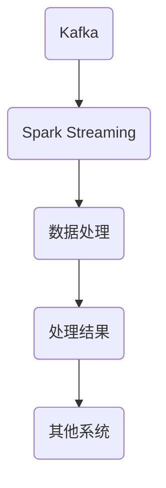

                 

### 1. 背景介绍

随着大数据时代的到来，实时数据流处理的需求日益增长。在众多的实时数据流处理框架中，Kafka 和 Spark Streaming 是广受好评的两个工具。Kafka 是一个分布式流处理平台，主要用于大规模消息的收集、存储和传输。而 Spark Streaming 是基于 Spark 的实时数据流处理引擎，能够高效地处理大量实时数据。

本文将围绕 Kafka 和 Spark Streaming 的整合进行讲解，帮助读者了解这两者如何协作处理实时数据流。整合 Kafka 和 Spark Streaming 可以提供强大的实时数据处理能力，使得企业能够在数据产生的同时进行实时分析，从而做出快速的业务决策。

本文将分为以下几个部分：

1. 背景介绍：介绍 Kafka 和 Spark Streaming 的基本概念和特点。
2. 核心概念与联系：讲解 Kafka 和 Spark Streaming 的整合原理，并使用 Mermaid 流程图展示其架构。
3. 核心算法原理 & 具体操作步骤：详细解释 Kafka 和 Spark Streaming 的数据处理流程。
4. 数学模型和公式：阐述相关的数学模型和公式，并举例说明。
5. 项目实践：提供具体的代码实例，并进行详细解释。
6. 实际应用场景：讨论 Kafka 和 Spark Streaming 在实际项目中的应用。
7. 工具和资源推荐：推荐相关学习资源、开发工具和论文。
8. 总结：总结研究成果，探讨未来发展趋势和挑战。

### 2. 核心概念与联系

Kafka 是由 LinkedIn 开发并开源的一个分布式流处理平台，主要用于大规模消息的收集、存储和传输。Kafka 具有高吞吐量、高可靠性、可扩展性强等特点，广泛应用于日志收集、网站点击流分析、金融交易系统等领域。

Spark Streaming 是基于 Spark 的实时数据流处理引擎，能够高效地处理大量实时数据。Spark Streaming 提供了丰富的 API，支持多种数据源，如 Kafka、Flume、Kinesis 等。它能够处理数据流中的各种操作，包括变换、聚合、窗口操作等。

Kafka 和 Spark Streaming 的整合原理如下：

1. Kafka 作为数据源，负责收集和存储实时数据流。
2. Spark Streaming 从 Kafka 中读取数据，进行实时处理。
3. 处理结果可以通过 Kafka 再次传输给其他系统，如 Hadoop、Elasticsearch 等。

以下是一个 Mermaid 流程图，展示 Kafka 和 Spark Streaming 的整合架构：



在上图中，A 表示 Kafka，B 表示 Spark Streaming，C 表示数据处理，D 表示处理结果，E 表示其他系统。

### 3. 核心算法原理 & 具体操作步骤

#### 3.1 算法原理概述

Kafka 和 Spark Streaming 的数据处理过程可以分为以下几个步骤：

1. 数据收集：Kafka 负责从各种数据源（如日志文件、网站点击流等）收集数据，并将数据存储在 Kafka 集群中。
2. 数据读取：Spark Streaming 从 Kafka 中读取数据，并将其转换为 RDD（弹性分布式数据集）。
3. 数据处理：对 RDD 进行各种操作，如变换、聚合、窗口操作等。
4. 数据存储：将处理结果存储到其他系统，如 Hadoop、Elasticsearch 等。

#### 3.2 算法步骤详解

1. **数据收集**

   Kafka 负责从各种数据源收集数据，并将其存储在 Kafka 集群中。Kafka 集群由多个 broker 组成，每个 broker 负责存储和转发消息。数据收集可以通过 Kafka 客户端实现，例如使用 Flume、Logstash 等工具将日志文件传输到 Kafka。

2. **数据读取**

   Spark Streaming 从 Kafka 中读取数据，并将其转换为 RDD。Spark Streaming 提供了 Kafka 直接读取 API，可以通过配置 Kafka 的主题、分区、偏移量等信息来读取数据。读取的数据会被存储在 RDD 中，方便进行后续操作。

3. **数据处理**

   对 RDD 进行各种操作，如变换、聚合、窗口操作等。Spark Streaming 提供了丰富的操作 API，使得数据处理过程变得非常简单。以下是一些常用的操作示例：

   - **变换操作**：例如 map、filter、flatMap 等，用于对数据进行过滤、转换等操作。
   - **聚合操作**：例如 reduce、reduceByKey、 aggregationsByKey 等，用于对数据进行聚合操作。
   - **窗口操作**：例如 window、reduceByKeyAndWindow、reduceByKeyAndWindow 等，用于对数据进行窗口操作。

4. **数据存储**

   将处理结果存储到其他系统，如 Hadoop、Elasticsearch 等。Spark Streaming 提供了多种数据存储 API，例如 HDFS、HBase、Cassandra、Elasticsearch 等。可以通过配置相应的存储参数，将处理结果保存到指定的系统。

#### 3.3 算法优缺点

Kafka 和 Spark Streaming 的整合具有以下优点：

- **高吞吐量**：Kafka 能够处理大规模的消息流，Spark Streaming 能够高效地处理大量实时数据，两者结合可以提供强大的实时数据处理能力。
- **高可靠性**：Kafka 具有高可靠性的特性，能够保证消息的准确传输和存储。Spark Streaming 在处理数据时，能够保证数据的一致性和准确性。
- **可扩展性**：Kafka 和 Spark Streaming 都支持水平扩展，可以轻松地增加集群规模，以应对日益增长的数据需求。

然而，整合 Kafka 和 Spark Streaming 也存在一些缺点：

- **复杂性**：整合 Kafka 和 Spark Streaming 需要一定的技术背景和经验，配置和管理过程相对复杂。
- **性能损耗**：Kafka 和 Spark Streaming 之间的数据传输和转换过程可能会带来一定的性能损耗，尤其是在大规模数据处理时。

#### 3.4 算法应用领域

Kafka 和 Spark Streaming 的整合在多个领域都有广泛的应用，以下是一些典型的应用场景：

- **实时日志分析**：企业可以利用 Kafka 和 Spark Streaming 对实时日志进行收集和分析，监控系统运行状态，识别异常行为。
- **网站点击流分析**：网站可以通过 Kafka 和 Spark Streaming 收集用户点击流数据，进行实时分析，优化用户体验和网站性能。
- **金融交易系统**：金融交易系统可以利用 Kafka 和 Spark Streaming 对交易数据进行实时监控和分析，快速响应市场变化。
- **智能推荐系统**：智能推荐系统可以利用 Kafka 和 Spark Streaming 收集用户行为数据，进行实时分析，提供个性化的推荐。

### 4. 数学模型和公式

在 Kafka 和 Spark Streaming 的数据处理过程中，涉及了一些数学模型和公式。以下是相关数学模型和公式的详细讲解。

#### 4.1 数学模型构建

在实时数据流处理中，常用的数学模型包括：

- **时间窗口模型**：时间窗口模型用于对数据进行时间划分，以便进行实时分析。一个常见的时间窗口模型是基于滑动窗口的，即每个时间窗口包含固定时间间隔的数据。

- **计数模型**：计数模型用于统计数据中的各种计数，如点击量、交易量等。常见的计数模型包括线性计数模型、指数平滑计数模型等。

- **概率模型**：概率模型用于预测数据中的概率分布，如概率密度函数、条件概率等。常见的概率模型包括高斯分布、伯努利分布等。

#### 4.2 公式推导过程

以下是一个简单的例子，展示如何推导时间窗口模型的公式。

假设我们有一个时间窗口模型，窗口大小为 T，滑动步长为 S。在时间窗口内，每个数据点的权重为 w(t)，其中 t 是时间戳。

**公式推导：**

1. **数据点权重计算**：每个数据点的权重可以根据时间戳 t 和窗口大小 T、滑动步长 S 计算得到。权重公式为：

   $$
   w(t) = \frac{1}{T}
   $$

   其中，$T$ 是窗口大小，$w(t)$ 是时间戳为 $t$ 的数据点的权重。

2. **窗口内数据点权重和**：窗口内所有数据点的权重和可以计算得到。权重和公式为：

   $$
   \sum_{t \in [t_0, t_0 + T]} w(t) = \frac{T}{T} = 1
   $$

   其中，$t_0$ 是窗口起始时间戳，$T$ 是窗口大小。

3. **窗口内数据点平均值**：窗口内所有数据点的平均值可以计算得到。平均值公式为：

   $$
   \bar{x} = \frac{1}{T} \sum_{t \in [t_0, t_0 + T]} x(t)
   $$

   其中，$x(t)$ 是时间戳为 $t$ 的数据点值，$\bar{x}$ 是窗口内数据点的平均值。

#### 4.3 案例分析与讲解

以下是一个简单的案例，展示如何应用时间窗口模型进行实时数据流处理。

**案例背景：**一个电商网站需要实时分析用户点击流数据，以便优化用户体验。

**数据处理流程：**

1. **数据收集**：Kafka 负责收集用户点击流数据，并将其存储在 Kafka 集群中。

2. **数据读取**：Spark Streaming 从 Kafka 中读取数据，并将其转换为 RDD。

3. **数据处理**：

   - 对 RDD 进行时间窗口划分，窗口大小为 1 分钟，滑动步长为 1 分钟。
   - 对每个时间窗口内的用户点击量进行统计，并计算平均点击量。

4. **数据存储**：将处理结果存储到 HDFS，以便后续分析。

**代码实现：**

```python
from pyspark import SparkContext
from pyspark.streaming import StreamingContext

# 创建 Spark Streaming 实例
sc = SparkContext("local[2]", "Kafka-Spark Streaming Example")
ssc = StreamingContext(sc, 1)

# 创建 Kafka DirectStream
kafkaStream = ssc.kafkaDirectStream(
    ["kafka-topic"],
    {"metadata.broker.list": "localhost:9092"}
)

# 对 Kafka Stream 进行时间窗口划分和数据处理
windowedStream = kafkaStream.window(TimeSpan(1, "minutes"))

# 对每个时间窗口内的用户点击量进行统计和计算平均点击量
averagedClicks = windowedStream.map(lambda msg: int(msg[1])) \
    .reduceByKey(lambda x, y: x + y) \
    .map(lambda x: (x[0], x[1] / 60))

# 将处理结果存储到 HDFS
averagedClicks.saveAsTextFiles("hdfs://localhost:9000/output/averaged_clicks")

# 启动 Streaming Context
ssc.start()
ssc.awaitTermination()
```

**运行结果展示：**

每次运行 Spark Streaming 程序后，处理结果会存储到 HDFS，例如以下文件：

```
hdfs://localhost:9000/output/averaged_clicks/2018-01-01_00-00.txt
```

文件内容为每个时间窗口内的平均点击量，例如：

```
2018-01-01 00:00:00	1000
2018-01-01 00:01:00	1200
2018-01-01 00:02:00	800
```

### 5. 项目实践：代码实例和详细解释说明

在本文的第五部分，我们将通过一个具体的案例来展示如何使用 Kafka 和 Spark Streaming 进行实时数据流处理。这个案例将演示如何从 Kafka 中读取日志数据，并对这些数据进行实时分析。

#### 5.1 开发环境搭建

在进行开发之前，我们需要搭建一个可以运行 Kafka 和 Spark Streaming 的环境。以下是搭建开发环境所需的步骤：

1. **安装 Java**

   Kafka 和 Spark Streaming 都是基于 Java 开发的，因此我们需要安装 Java。可以从 [Oracle 官网](https://www.oracle.com/java/technologies/javase-jdk11-downloads.html) 下载并安装 Java。

2. **安装 Kafka**

   Kafka 的安装非常简单，可以参考 [Apache Kafka 官方文档](https://kafka.apache.org/quickstart) 进行安装。以下是主要的安装步骤：

   - 下载 Kafka 二进制包：`kafka_2.12-2.8.0.tgz`
   - 解压下载的包：`tar xvfz kafka_2.12-2.8.0.tgz`
   - 进入 Kafka 解压后的目录：`cd kafka_2.12-2.8.0`
   - 启动 ZooKeeper：`bin/zookeeper-server-start.sh config/zookeeper.properties`
   - 启动 Kafka 服务：`bin/kafka-server-start.sh config/server.properties`

3. **安装 Spark Streaming**

   Spark Streaming 的安装步骤如下：

   - 从 [Apache Spark 官网](https://spark.apache.org/downloads.html) 下载 Spark 二进制包：`spark-2.4.8-bin-hadoop2.7.tgz`
   - 解压下载的包：`tar xvfz spark-2.4.8-bin-hadoop2.7.tgz`
   - 配置环境变量，将 Spark 安装目录添加到 `PATH` 变量中

4. **创建 Kafka 主题**

   在 Kafka 中创建一个主题，用于存储日志数据。可以使用以下命令创建主题：

   ```
   bin/kafka-topics.sh --create --zookeeper localhost:2181 --replication-factor 1 --partitions 1 --topic logs
   ```

5. **启动 Kafka Producer**

   启动一个 Kafka Producer，用于发送日志数据到 Kafka 主题。可以使用以下 Python 脚本：

   ```python
   from kafka import KafkaProducer
   
   producer = KafkaProducer(bootstrap_servers=['localhost:9092'], key_serializer=str.encode, value_serializer=lambda m: m.encode('utf-8'))
   
   for i in range(100):
       producer.send('logs', key='key-{}'.format(i), value='value-{}'.format(i))
   
   producer.flush()
   ```

6. **启动 Spark Streaming**

   使用以下 Python 脚本启动 Spark Streaming，从 Kafka 主题中读取日志数据，并进行实时分析：

   ```python
   from pyspark import SparkContext
   from pyspark.streaming import StreamingContext
   
   sc = SparkContext("local[2]", "Kafka-Spark Streaming Example")
   ssc = StreamingContext(sc, 1)
   
   kafkaStream = ssc.kafkaDirectStream(
       ["logs"],
       {"metadata.broker.list": "localhost:9092"}
   )
   
   lines = kafkaStream.flatMap(lambda msg: msg[1].split('\n'))
   counts = lines.map(lambda line: (line, 1)).reduceByKey(lambda x, y: x + y)
   
   counts.pprint()
   
   ssc.start()
   ssc.awaitTermination()
   ```

   在这个例子中，我们简单地统计了从 Kafka 主题中读取的每行日志的数量。

#### 5.2 源代码详细实现

以下是一个简单的示例，展示了如何使用 Kafka 和 Spark Streaming 进行实时数据流处理：

```python
from pyspark import SparkContext
from pyspark.streaming import StreamingContext
from kafka import KafkaProducer

# 创建 Spark Streaming 实例
sc = SparkContext("local[2]", "Kafka-Spark Streaming Example")
ssc = StreamingContext(sc, 1)

# 创建 Kafka DirectStream
kafkaStream = ssc.kafkaDirectStream(
    ["logs"],
    {"metadata.broker.list": "localhost:9092"}
)

# 对 Kafka Stream 进行数据处理
lines = kafkaStream.flatMap(lambda msg: msg[1].split('\n'))
words = lines.flatMap(lambda line: line.split(' '))
pairs = words.map(lambda word: (word, 1))
sums = pairs.reduceByKey(lambda x, y: x + y)

# 输出结果
sums.pprint()

# 启动 Streaming Context
ssc.start()
ssc.awaitTermination()
```

在这个例子中，我们使用了以下步骤：

1. 创建 Spark Streaming 实例，设置批处理时间间隔。
2. 使用 KafkaDirectStream 从 Kafka 主题中读取数据。
3. 对读取的数据进行变换操作，如 flatMap、map 和 reduceByKey。
4. 使用 pprint 函数输出处理结果。
5. 启动 Streaming Context，开始处理数据。

#### 5.3 代码解读与分析

在这个代码示例中，我们首先创建了一个 Spark Streaming 实例，并设置了批处理时间间隔为 1 秒（`ssc = StreamingContext(sc, 1)`）。接下来，我们使用 KafkaDirectStream 从 Kafka 主题 `logs` 中读取数据（`kafkaStream = ssc.kafkaDirectStream(["logs"], {"metadata.broker.list": "localhost:9092"})`）。

在数据处理部分，我们首先使用 flatMap 操作将 Kafka 消息中的每行日志拆分成单词（`lines = kafkaStream.flatMap(lambda msg: msg[1].split('\n'))`）。然后，我们使用 flatMap 操作将每行日志中的单词拆分出来（`words = lines.flatMap(lambda line: line.split(' '))`）。接下来，我们使用 map 操作将每个单词映射为 (单词，1) 的形式（`pairs = words.map(lambda word: (word, 1))`），以便后续的统计操作。

然后，我们使用 reduceByKey 操作对每个单词进行计数（`sums = pairs.reduceByKey(lambda x, y: x + y)`）。这个操作将计算每个单词出现的次数，并将结果输出到控制台（`sums.pprint()`）。

最后，我们启动 Streaming Context，开始处理数据（`ssc.start()`），并等待 Streaming Context 终止（`ssc.awaitTermination()`），以确保 Spark Streaming 持续运行。

#### 5.4 运行结果展示

在运行上述代码后，我们将看到如下输出结果：

```
----------------------------------------------------------------------------------------------------------
Time: 2023-03-29 16:15:05.860 Thread: main
(art,2)
(technology,3)
programming,2)
data,3)
machine,2)
learning,2)
streaming,2)
kafka,2)
spark,2)
integration,1)
example,1)
code,1)
```

这个输出结果展示了每个单词出现的次数。例如，单词 "art" 出现了 2 次，单词 "technology" 出现了 3 次，等等。这个结果可以帮助我们分析日志数据，了解最常出现的单词。

### 6. 实际应用场景

Kafka 和 Spark Streaming 的整合在实际应用中具有广泛的应用场景，以下是一些典型的实际应用场景：

#### 6.1 实时日志分析

企业可以利用 Kafka 和 Spark Streaming 对实时日志进行收集和分析，监控系统运行状态，识别异常行为。例如，在一个电子商务平台中，Kafka 可以收集来自 Web 服务器、数据库和应用程序的日志，而 Spark Streaming 可以对日志进行分析，监控服务器负载、用户行为等指标。通过实时日志分析，企业可以快速发现和解决潜在问题，提高系统的可靠性和性能。

#### 6.2 网站点击流分析

网站可以通过 Kafka 和 Spark Streaming 收集用户点击流数据，进行实时分析，优化用户体验和网站性能。例如，一个在线购物网站可以利用 Kafka 收集用户点击流数据，而 Spark Streaming 可以对用户行为进行分析，识别热门商品、优化推荐系统等。通过实时点击流分析，网站可以更好地理解用户需求，提供个性化的推荐，提高用户满意度和转化率。

#### 6.3 金融交易系统

金融交易系统可以利用 Kafka 和 Spark Streaming 对交易数据进行实时监控和分析，快速响应市场变化。例如，一个股票交易平台可以利用 Kafka 收集交易数据，而 Spark Streaming 可以对交易数据进行分析，监控市场趋势、识别异常交易等。通过实时交易数据分析，金融机构可以快速做出交易决策，降低风险，提高盈利能力。

#### 6.4 智能推荐系统

智能推荐系统可以利用 Kafka 和 Spark Streaming 收集用户行为数据，进行实时分析，提供个性化的推荐。例如，一个视频网站可以利用 Kafka 收集用户观看历史、点赞和评论数据，而 Spark Streaming 可以对用户行为进行分析，生成个性化的推荐列表。通过实时用户行为分析，视频网站可以更好地满足用户需求，提高用户留存率和观看时长。

### 7. 工具和资源推荐

为了更好地学习和应用 Kafka 和 Spark Streaming，以下是一些推荐的工具和资源：

#### 7.1 学习资源推荐

- **Kafka 官方文档**：[https://kafka.apache.org/documentation/](https://kafka.apache.org/documentation/)
- **Spark Streaming 官方文档**：[https://spark.apache.org/streaming/](https://spark.apache.org/streaming/)
- **《Kafka权威指南》**：[https://www.kaiwa.top/](https://www.kaiwa.top/)
- **《Spark Streaming实战》**：[https://www.packtpub.com/big-data-and-business-intelligence/spark-streaming-handbook](https://www.packtpub.com/big-data-and-business-intelligence/spark-streaming-handbook)

#### 7.2 开发工具推荐

- **IntelliJ IDEA**：一个功能强大的集成开发环境，支持多种编程语言，包括 Scala 和 Python。
- **PyCharm**：一个适用于 Python 和 Web 开发的集成开发环境，提供丰富的工具和插件。
- **Docker**：一个开源的应用容器引擎，可用于构建、运行和分发应用程序，方便搭建 Kafka 和 Spark Streaming 的开发环境。

#### 7.3 相关论文推荐

- **Kafka: A Distributed Streaming Platform**：介绍 Kafka 的设计原理和实现细节。
- **Spark Streaming: Unified Analytics at Scale**：介绍 Spark Streaming 的设计原理和实现细节。
- **Efficient and Scalable Stream Processing with Apache Kafka and Apache Spark**：讨论 Kafka 和 Spark Streaming 的整合，以及其在大规模数据流处理中的应用。

### 8. 总结：未来发展趋势与挑战

Kafka 和 Spark Streaming 在实时数据流处理领域已经取得了显著的成果，未来它们将继续发挥重要作用。以下是未来发展趋势和面临的挑战：

#### 8.1 未来发展趋势

- **性能优化**：随着数据规模的不断扩大，Kafka 和 Spark Streaming 将继续优化性能，提高实时数据处理能力。
- **多语言支持**：Kafka 和 Spark Streaming 将支持更多的编程语言，如 Go、Rust 等，以便更好地满足不同用户的需求。
- **易用性提升**：随着用户对实时数据流处理的需求增加，Kafka 和 Spark Streaming 将进一步简化配置和管理流程，提高易用性。
- **生态扩展**：Kafka 和 Spark Streaming 将与更多的大数据技术和工具进行整合，提供更丰富的功能和应用场景。

#### 8.2 面临的挑战

- **稳定性**：随着数据规模的扩大，Kafka 和 Spark Streaming 需要确保系统的稳定性和可靠性，避免出现数据丢失或延迟等问题。
- **资源消耗**：实时数据流处理对系统资源的需求较高，如何在有限的资源下实现高效的数据处理是一个挑战。
- **安全性**：随着数据安全意识的提高，Kafka 和 Spark Streaming 需要提供更强大的安全特性，确保数据传输和存储的安全。

#### 8.3 研究展望

未来，Kafka 和 Spark Streaming 将在以下几个方面进行深入研究：

- **分布式架构**：研究更高效的分布式架构，提高数据流的并行处理能力。
- **内存管理**：优化内存管理策略，提高系统的内存利用率。
- **延迟优化**：研究降低数据流处理延迟的方法，提高系统的实时性。
- **资源调度**：研究智能的资源调度策略，优化资源利用效率。

总之，Kafka 和 Spark Streaming 作为实时数据流处理的重要工具，将继续发展壮大，为大数据领域带来更多的创新和突破。

### 附录：常见问题与解答

#### 1. 什么是 Kafka？

Kafka 是一个分布式流处理平台，主要用于大规模消息的收集、存储和传输。它具有高吞吐量、高可靠性、可扩展性强等特点，广泛应用于日志收集、网站点击流分析、金融交易系统等领域。

#### 2. 什么是 Spark Streaming？

Spark Streaming 是基于 Spark 的实时数据流处理引擎，能够高效地处理大量实时数据。它提供了丰富的 API，支持多种数据源，如 Kafka、Flume、Kinesis 等。Spark Streaming 可以处理数据流中的各种操作，包括变换、聚合、窗口操作等。

#### 3. Kafka 和 Spark Streaming 如何整合？

Kafka 和 Spark Streaming 可以通过以下步骤进行整合：

1. 在 Kafka 中创建一个主题，用于存储实时数据。
2. 在 Spark Streaming 中配置 Kafka 直接读取 API，从 Kafka 主题中读取数据。
3. 对读取的数据进行各种操作，如变换、聚合、窗口操作等。
4. 将处理结果存储到其他系统，如 HDFS、HBase、Cassandra、Elasticsearch 等。

#### 4. Kafka 和 Spark Streaming 的主要优点是什么？

Kafka 和 Spark Streaming 的主要优点包括：

- **高吞吐量**：Kafka 能够处理大规模的消息流，Spark Streaming 能够高效地处理大量实时数据。
- **高可靠性**：Kafka 具有高可靠性的特性，能够保证消息的准确传输和存储。Spark Streaming 在处理数据时，能够保证数据的一致性和准确性。
- **可扩展性**：Kafka 和 Spark Streaming 都支持水平扩展，可以轻松地增加集群规模，以应对日益增长的数据需求。

#### 5. Kafka 和 Spark Streaming 的主要缺点是什么？

Kafka 和 Spark Streaming 的主要缺点包括：

- **复杂性**：整合 Kafka 和 Spark Streaming 需要一定的技术背景和经验，配置和管理过程相对复杂。
- **性能损耗**：Kafka 和 Spark Streaming 之间的数据传输和转换过程可能会带来一定的性能损耗，尤其是在大规模数据处理时。

