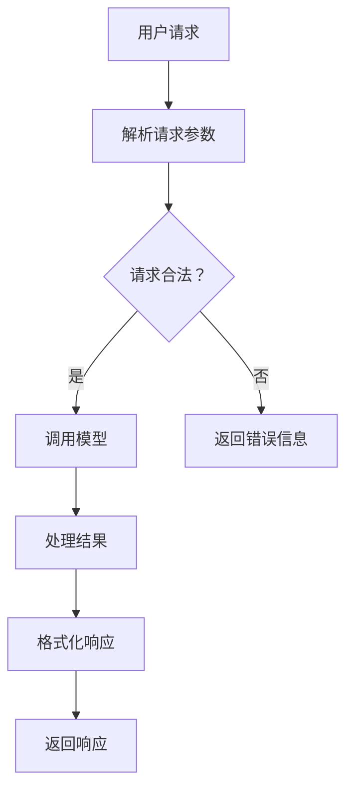

                 

关键词：语言模型，API设计，AI服务，易用性，用户体验

> 摘要：本文将探讨语言模型API设计的核心概念、原理和方法，通过具体的实例和代码实现，展示如何设计易于使用的API，从而提升AI服务的用户体验。

## 1. 背景介绍

随着人工智能技术的快速发展，自然语言处理（NLP）技术取得了显著的进步。特别是大型语言模型（LLM），如GPT-3、BERT等，已经成为许多应用程序的核心组件。这些语言模型不仅能够理解和生成自然语言，还能够进行文本分类、情感分析、问答系统等复杂任务。

然而，LLM的强大功能并不总是意味着易于使用。为了充分发挥LLM的潜力，开发者需要设计高效的API来与模型交互。API设计的质量直接影响用户对AI服务的体验。因此，如何设计易于使用且功能强大的LLM API成为了当前的一个重要课题。

本文旨在探讨LLM API设计的核心概念和原理，提供实用的设计方法和最佳实践，并通过实例展示如何实现这样的API。最终目标是帮助开发者设计出既高效又易用的AI服务，从而提升用户体验。

## 2. 核心概念与联系

### 2.1 语言模型概述

语言模型（Language Model，LM）是自然语言处理的核心组件，它能够预测下一个单词、句子或文本片段的概率分布。这种概率分布是基于大量文本数据的统计学习结果。LLM，如GPT-3、BERT等，通过深度学习技术从海量数据中学习语言模式，能够生成高质量的自然语言文本。

### 2.2 API设计原理

API（Application Programming Interface）是软件开发中的一个重要概念，它定义了不同软件组件之间交互的接口。一个好的API设计应该简单、直观、易于扩展。对于LLM API，我们需要考虑以下几个方面：

- **易用性**：API应该提供简洁、直观的接口，减少用户的认知负担。
- **灵活性**：API应该允许用户根据自己的需求进行定制，如调整输入参数、输出格式等。
- **安全性**：API需要保护用户数据的安全，防止数据泄露和滥用。
- **效率**：API应该高效，降低用户访问模型的延迟。

### 2.3 Mermaid流程图

下面是一个简单的Mermaid流程图，展示LLM API的基本工作流程。



## 3. 核心算法原理 & 具体操作步骤

### 3.1 算法原理概述

LLM API的核心算法是基于大型预训练语言模型，如GPT-3或BERT。这些模型通过深度学习从大量文本数据中学习语言模式，能够生成与输入文本相关的自然语言输出。具体操作步骤如下：

1. **请求解析**：解析用户请求，提取请求参数，如输入文本、输出长度、温度等。
2. **模型调用**：将请求参数传递给语言模型，执行预测任务。
3. **结果处理**：对模型输出进行处理，如文本清洗、格式化等。
4. **响应返回**：将处理后的结果返回给用户。

### 3.2 算法步骤详解

1. **请求解析**：

   ```python
   def parse_request(request):
       # 解析请求参数
       text = request.get('text', '')
       length = request.get('length', 100)
       temperature = request.get('temperature', 1.0)
       return text, length, temperature
   ```

2. **模型调用**：

   ```python
   import openai

   def call_model(text, length, temperature):
       # 调用GPT-3模型
       response = openai.Completion.create(
           engine="text-davinci-002",
           prompt=text,
           max_tokens=length,
           temperature=temperature
       )
       return response.choices[0].text.strip()
   ```

3. **结果处理**：

   ```python
   def process_result(result):
       # 清洗和处理结果
       return result
   ```

4. **响应返回**：

   ```python
   from flask import Flask, jsonify

   app = Flask(__name__)

   @app.route('/generate', methods=['POST'])
   def generate():
       request = flask.request.json
       text, length, temperature = parse_request(request)
       result = call_model(text, length, temperature)
       processed_result = process_result(result)
       return jsonify({'result': processed_result})
   ```

### 3.3 算法优缺点

**优点**：

- **高效性**：预训练语言模型具有很高的计算效率，能够快速响应用户请求。
- **灵活性**：API设计灵活，允许用户自定义输入参数和输出格式。

**缺点**：

- **计算资源需求高**：训练和运行大型语言模型需要大量计算资源和存储空间。
- **复杂度较高**：API设计和管理复杂，需要专业的开发团队。

### 3.4 算法应用领域

LLM API广泛应用于各种场景，如：

- **问答系统**：通过语言模型生成对用户问题的回答。
- **文本生成**：生成文章、故事、新闻摘要等。
- **聊天机器人**：模拟人类对话，提供智能客服。

## 4. 数学模型和公式 & 详细讲解 & 举例说明

### 4.1 数学模型构建

语言模型的核心是生成模型，它通过概率分布预测下一个单词或文本片段。一个简单的语言模型可以表示为：

$$
P(w_t | w_{t-1}, w_{t-2}, ..., w_1) = \frac{e^{\phi(w_t; w_{t-1}, w_{t-2}, ..., w_1)}}{\sum_{w'} e^{\phi(w';
```

