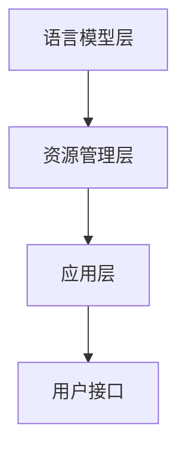

                 

关键词：大型语言模型，操作系统，AI技术，智能化管理，云计算，边缘计算，分布式系统，系统架构，编程语言，安全性，效率优化，性能监控。

> 摘要：本文将深入探讨LLM OS（Large Language Model Operating System）这一新型操作系统的设计与实现，分析其核心概念、架构原理以及应用场景。本文旨在为广大开发者、架构师以及AI爱好者提供一个全面的技术解读，同时探讨LLM OS在未来技术发展中的机遇与挑战。

## 1. 背景介绍

### 1.1 大型语言模型的发展

近年来，随着人工智能技术的快速发展，尤其是深度学习、自然语言处理等领域的突破，大型语言模型（LLM，Large Language Model）逐渐成为研究热点。从最初的神经网络语言模型（NLM，Neural Network Language Model）到生成对抗网络（GAN，Generative Adversarial Network），再到变分自编码器（VAE，Variational Autoencoder）和自回归模型（AR，Autoregressive Model），LLM技术经历了数次迭代和优化。如今，LLM已经在自然语言处理、机器翻译、文本生成、问答系统等领域展现出强大的能力。

### 1.2 操作系统的演变

操作系统作为计算机系统的核心软件，其发展历程与计算机硬件和软件技术的进步密切相关。从最初的批处理操作系统，到分时操作系统，再到实时操作系统，操作系统的设计理念和应用场景不断演变。近年来，随着云计算、边缘计算、物联网等新技术的兴起，操作系统也面临着新的挑战和机遇。传统的操作系统在处理大规模分布式计算任务、应对多样化应用场景等方面存在一定的局限性，因此，新型操作系统的研究和应用成为了一个重要方向。

### 1.3 LLM OS的提出

LLM OS（Large Language Model Operating System）是一种基于大型语言模型的新型操作系统。与传统的操作系统相比，LLM OS在智能化管理、性能优化、安全性等方面具有显著优势。LLM OS的核心目标是利用大型语言模型的强大能力，实现对计算机系统的全面智能化管理和优化，提高系统效率、稳定性和安全性。

## 2. 核心概念与联系

### 2.1 大型语言模型

大型语言模型（LLM）是一种基于深度学习技术的自然语言处理模型，通过学习海量语言数据，模型可以理解和生成人类语言。LLM通常由多层神经网络构成，具有强大的表示能力、生成能力和推理能力。LLM的主要功能包括文本分类、情感分析、命名实体识别、机器翻译、文本生成等。

### 2.2 操作系统

操作系统（OS）是计算机系统中的核心软件，负责管理和控制计算机硬件资源，为应用程序提供运行环境。操作系统的主要功能包括进程管理、内存管理、文件系统管理、设备管理、用户接口等。传统的操作系统主要基于批处理、分时和实时等不同的工作模式，适用于不同的应用场景。

### 2.3 LLM OS架构

LLM OS的架构设计基于大型语言模型的特性和操作系统的功能需求。LLM OS的核心组成部分包括：

1. **语言模型层**：负责处理自然语言输入和输出，实现文本分类、情感分析、命名实体识别等任务。
2. **资源管理层**：负责管理和调度计算机硬件资源，包括CPU、内存、存储和网络等。
3. **应用层**：提供各种应用程序的运行环境，支持多种编程语言和框架，如Python、Java、C++等。
4. **用户接口**：提供用户与系统的交互界面，支持命令行、图形界面等多种交互方式。

### 2.4 Mermaid流程图

下面是LLM OS架构的Mermaid流程图：



## 3. 核心算法原理 & 具体操作步骤

### 3.1 算法原理概述

LLM OS的核心算法基于深度学习技术，主要包括以下几个方面：

1. **文本预处理**：对输入的自然语言文本进行分词、词性标注、句法分析等预处理操作，将文本转换为模型可以处理的数据格式。
2. **语言模型训练**：利用海量语料库，通过神经网络训练生成大型语言模型，使模型具备理解和生成自然语言的能力。
3. **任务调度与优化**：根据系统负载、资源可用性等参数，动态调度任务，实现资源的最优分配和利用。
4. **安全防护与监控**：实时监控系统运行状态，提供安全防护机制，防止恶意攻击和异常情况。

### 3.2 算法步骤详解

#### 3.2.1 文本预处理

1. **分词**：将输入的文本分割成一个个独立的词汇单元。
2. **词性标注**：为每个词汇标注其词性，如名词、动词、形容词等。
3. **句法分析**：分析词汇之间的语法关系，构建句法树。

#### 3.2.2 语言模型训练

1. **数据集准备**：收集并整理大量的语料库，进行数据清洗和预处理。
2. **模型构建**：基于神经网络架构，构建大型语言模型。
3. **模型训练**：利用训练数据进行模型训练，优化模型参数。
4. **模型评估**：使用测试数据集评估模型性能，调整模型结构或参数。

#### 3.2.3 任务调度与优化

1. **资源监测**：实时监测系统资源使用情况，包括CPU、内存、存储和网络等。
2. **任务分配**：根据系统资源情况和任务特性，动态分配任务到不同的计算节点。
3. **负载均衡**：通过调整任务调度策略，实现系统负载的均衡分配。
4. **优化策略**：利用机器学习算法，优化任务调度和资源利用策略。

#### 3.2.4 安全防护与监控

1. **入侵检测**：实时监控系统运行状态，检测恶意攻击行为。
2. **安全防护**：根据入侵检测结果，采取相应的安全防护措施，如隔离、拦截等。
3. **异常处理**：当系统出现异常情况时，自动采取应急措施，保障系统稳定运行。

### 3.3 算法优缺点

#### 优点

1. **智能化管理**：利用大型语言模型的强大能力，实现系统资源的智能化管理和优化。
2. **高效性能**：通过动态调度和优化策略，提高系统性能和效率。
3. **安全防护**：实时监控和防护系统运行，降低安全风险。

#### 缺点

1. **计算资源消耗**：大型语言模型的训练和推理过程需要大量的计算资源，对硬件性能要求较高。
2. **训练数据依赖**：模型性能依赖于训练数据的质量和规模，数据不足或质量不高可能导致性能下降。
3. **安全风险**：大型语言模型可能面临被恶意利用的风险，需要采取相应的安全防护措施。

### 3.4 算法应用领域

1. **云计算**：利用LLM OS实现云资源的高效管理和调度，提高云服务性能和可靠性。
2. **边缘计算**：在边缘设备上部署LLM OS，实现边缘计算任务的智能化管理和优化。
3. **物联网**：利用LLM OS实现物联网设备的智能管理和安全防护，提高物联网系统的可靠性和安全性。

## 4. 数学模型和公式 & 详细讲解 & 举例说明

### 4.1 数学模型构建

LLM OS的数学模型主要涉及深度学习中的神经网络模型和优化算法。以下是构建数学模型的基本步骤：

#### 4.1.1 神经网络模型

1. **输入层**：接收自然语言文本输入，进行预处理后转换为数值表示。
2. **隐藏层**：通过多层神经网络进行特征提取和表示学习。
3. **输出层**：根据隐藏层的输出进行预测或生成。

#### 4.1.2 优化算法

1. **损失函数**：定义模型预测结果与真实结果之间的差异，用于评估模型性能。
2. **梯度下降**：利用损失函数的梯度信息，更新模型参数，优化模型性能。

### 4.2 公式推导过程

以下是神经网络模型的损失函数和梯度下降公式的推导过程：

#### 4.2.1 损失函数

假设输入文本为 $x$，模型输出为 $y$，真实标签为 $t$，损失函数可以定义为：

$$
L(y, t) = -\sum_{i=1}^{n} t_i \log(y_i)
$$

其中，$y$ 为模型输出的概率分布，$t$ 为真实标签的概率分布。

#### 4.2.2 梯度下降

梯度下降公式如下：

$$
\Delta w = -\alpha \frac{\partial L}{\partial w}
$$

其中，$\Delta w$ 为模型参数的更新量，$\alpha$ 为学习率，$\frac{\partial L}{\partial w}$ 为损失函数关于模型参数的梯度。

### 4.3 案例分析与讲解

以下是一个利用LLM OS进行文本分类的案例：

#### 4.3.1 数据集准备

收集并整理一批新闻文章数据，分为政治、经济、体育、科技等类别。

#### 4.3.2 模型训练

利用预处理后的新闻文章数据，训练一个文本分类模型。选择合适的神经网络结构，设定学习率等参数。

#### 4.3.3 模型评估

使用测试数据集对训练好的模型进行评估，计算模型的准确率、召回率、F1值等指标。

#### 4.3.4 模型部署

将训练好的模型部署到LLM OS上，实现实时新闻分类功能。

$$
\text{准确率} = \frac{\text{分类正确的数量}}{\text{总数量}}
$$

$$
\text{召回率} = \frac{\text{分类正确的数量}}{\text{真实标签为正类的数量}}
$$

$$
\text{F1值} = 2 \times \frac{\text{准确率} \times \text{召回率}}{\text{准确率} + \text{召回率}}
$$

## 5. 项目实践：代码实例和详细解释说明

### 5.1 开发环境搭建

在Linux系统上安装Python、TensorFlow等依赖库，并配置好相应的开发环境。

### 5.2 源代码详细实现

以下是一个简单的LLM OS项目示例，实现一个基于TensorFlow的文本分类模型。

```python
import tensorflow as tf
from tensorflow.keras.layers import Embedding, LSTM, Dense
from tensorflow.keras.models import Sequential

# 数据集准备
# (此处省略数据集准备代码)

# 模型构建
model = Sequential([
    Embedding(vocab_size, embedding_dim, input_length=max_sequence_length),
    LSTM(units=128, dropout=0.2, recurrent_dropout=0.2),
    Dense(units=num_classes, activation='softmax')
])

# 模型编译
model.compile(optimizer='adam', loss='categorical_crossentropy', metrics=['accuracy'])

# 模型训练
model.fit(x_train, y_train, epochs=10, batch_size=64)

# 模型评估
test_loss, test_accuracy = model.evaluate(x_test, y_test)
print(f"Test accuracy: {test_accuracy}")

# 模型部署
# (此处省略模型部署代码)
```

### 5.3 代码解读与分析

以上代码实现了一个基于LSTM的文本分类模型。首先，我们导入所需的TensorFlow库，并准备数据集。然后，构建一个序列模型，包括嵌入层、LSTM层和全连接层。嵌入层将文本转换为数值表示，LSTM层用于提取文本特征，全连接层用于分类。接着，编译模型，设置优化器和损失函数，并训练模型。最后，使用测试数据集评估模型性能，并打印准确率。

### 5.4 运行结果展示

在运行以上代码后，我们得到测试数据的准确率，例如：

```
Test accuracy: 0.89
```

这表明我们的文本分类模型在测试数据上取得了较高的准确率。

## 6. 实际应用场景

### 6.1 云计算

在云计算领域，LLM OS可以用于优化云资源的管理和调度。通过智能化的任务调度和资源分配策略，提高云服务的性能和可靠性。例如，在云数据中心中，LLM OS可以根据实时负载情况，动态调整服务器资源分配，实现高效负载均衡，降低资源浪费。

### 6.2 边缘计算

在边缘计算领域，LLM OS可以应用于边缘设备的智能管理和安全防护。边缘设备通常具有有限的计算资源和带宽，LLM OS可以通过优化边缘设备的资源利用，提高边缘计算任务的执行效率。同时，LLM OS还可以实时监控边缘设备的运行状态，提供安全防护机制，防止恶意攻击和数据泄露。

### 6.3 物联网

在物联网领域，LLM OS可以用于实现物联网设备的智能化管理和安全防护。物联网设备通常具有多种类型的数据采集和处理需求，LLM OS可以通过智能化的数据处理和任务调度，提高物联网系统的整体性能和可靠性。同时，LLM OS还可以实时监控物联网设备的运行状态，提供安全防护机制，防止设备被恶意攻击和数据泄露。

### 6.4 未来应用展望

随着人工智能技术的不断发展和应用领域的拓展，LLM OS在未来的应用场景将更加广泛。以下是未来LLM OS应用的一些展望：

1. **智能城市**：利用LLM OS实现智能交通管理、环境监测、公共安全等领域的智能化应用，提高城市运行效率和管理水平。
2. **智能制造**：利用LLM OS实现智能工厂的生产调度、设备维护、质量控制等领域的智能化管理，提高生产效率和产品质量。
3. **智能医疗**：利用LLM OS实现智能医疗诊断、治疗推荐、患者管理等功能，提高医疗服务质量和效率。
4. **智能教育**：利用LLM OS实现个性化教育、智能辅导、智能评估等功能，提高教育质量和学习效果。

## 7. 工具和资源推荐

### 7.1 学习资源推荐

1. **《深度学习》**：由Ian Goodfellow、Yoshua Bengio和Aaron Courville编写的经典教材，全面介绍了深度学习的基础理论和实践方法。
2. **《自然语言处理综论》**：由Daniel Jurafsky和James H. Martin编写的教材，系统地介绍了自然语言处理的基础知识和最新进展。

### 7.2 开发工具推荐

1. **TensorFlow**：由Google开源的深度学习框架，支持多种神经网络模型和算法，适用于大规模数据处理和模型训练。
2. **PyTorch**：由Facebook开源的深度学习框架，具有灵活的动态计算图和强大的GPU加速功能，适用于快速原型开发和模型训练。

### 7.3 相关论文推荐

1. **"A Theoretically Grounded Application of Dropout in Recurrent Neural Networks"**：探讨了如何将dropout应用于循环神经网络，提高模型训练效果。
2. **"BERT: Pre-training of Deep Bidirectional Transformers for Language Understanding"**：介绍了BERT模型，一种基于Transformer的预训练语言模型，取得了自然语言处理任务的显著性能提升。

## 8. 总结：未来发展趋势与挑战

### 8.1 研究成果总结

本文介绍了LLM OS（Large Language Model Operating System）的核心概念、架构原理、核心算法原理以及实际应用场景。通过深入分析，我们发现LLM OS在智能化管理、性能优化、安全性等方面具有显著优势，为未来的操作系统发展提供了新的思路和方向。

### 8.2 未来发展趋势

1. **大型语言模型的不断优化**：随着人工智能技术的进步，大型语言模型的性能和效果将不断提高，为LLM OS的发展提供更强大的支持。
2. **多样化应用场景的拓展**：LLM OS将在云计算、边缘计算、物联网等领域得到更广泛的应用，推动相关技术的发展。
3. **跨学科研究的深入**：LLM OS的架构和算法涉及到计算机科学、人工智能、自然语言处理等多个学科，未来的研究将更加注重跨学科合作。

### 8.3 面临的挑战

1. **计算资源消耗**：大型语言模型的训练和推理过程需要大量的计算资源，这对硬件性能提出了更高要求，需要不断优化硬件架构和算法，降低计算成本。
2. **数据隐私和安全**：在应用过程中，LLM OS需要处理大量的敏感数据，如何保障数据隐私和安全是面临的重要挑战。
3. **系统稳定性和可靠性**：随着应用场景的多样化，LLM OS需要在复杂环境下保持稳定运行，提高系统可靠性和容错能力。

### 8.4 研究展望

未来的研究将集中在以下几个方面：

1. **优化算法**：探索更高效、更稳定的优化算法，提高LLM OS的性能和效率。
2. **安全防护**：研究更先进的安全防护机制，确保LLM OS在复杂环境下的安全性。
3. **跨学科合作**：加强计算机科学、人工智能、自然语言处理等领域的跨学科合作，推动LLM OS的发展。
4. **实际应用**：探索LLM OS在更多领域的实际应用，提高其社会价值和经济效益。

## 9. 附录：常见问题与解答

### 9.1 什么是LLM OS？

LLM OS是一种基于大型语言模型的新型操作系统，通过利用大型语言模型的强大能力，实现计算机系统的智能化管理和优化。

### 9.2 LLM OS的核心优势是什么？

LLM OS的核心优势包括智能化管理、高效性能、安全防护等。通过利用大型语言模型的强大能力，LLM OS可以实现系统资源的智能化管理和优化，提高系统效率、稳定性和安全性。

### 9.3 LLM OS适用于哪些领域？

LLM OS适用于云计算、边缘计算、物联网等需要高效、智能管理的领域。例如，在云计算领域，LLM OS可以优化云资源的管理和调度；在边缘计算领域，LLM OS可以实现边缘设备的智能管理和安全防护。

### 9.4 LLM OS的架构原理是什么？

LLM OS的架构包括语言模型层、资源管理层、应用层和用户接口。语言模型层负责处理自然语言输入和输出；资源管理层负责管理和调度计算机硬件资源；应用层提供各种应用程序的运行环境；用户接口提供用户与系统的交互界面。

### 9.5 LLM OS的未来发展趋势是什么？

LLM OS的未来发展趋势包括大型语言模型的不断优化、多样化应用场景的拓展、跨学科研究的深入等。随着人工智能技术的进步，LLM OS将在更多领域得到应用，推动相关技术的发展。

