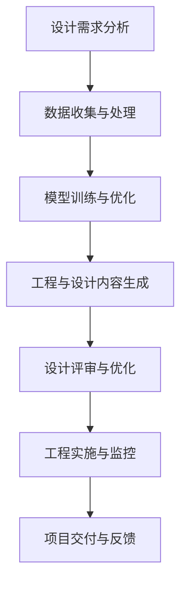

                 

关键词：大型语言模型(LLM),工程，设计，AI应用，创造性合作，算法原理，数学模型，项目实践，实际应用，未来展望

摘要：本文旨在探讨大型语言模型（LLM）在工程和设计领域的应用，以及如何通过创造性合作实现工程设计的优化和创新。首先，我们将介绍LLM的基本概念和原理，然后详细讨论其在工程和设计中的核心应用，包括算法原理、数学模型、项目实践以及实际应用场景。最后，我们将展望LLM在未来的发展趋势和面临的挑战。

## 1. 背景介绍

近年来，人工智能（AI）技术取得了显著的进步，尤其是大型语言模型（LLM）的快速发展。LLM是一类基于深度学习技术构建的强大模型，具有处理自然语言文本的高效能力。在工程和设计领域，LLM的应用潜力逐渐显现，为传统的设计方法和流程带来了新的变革。

工程和设计领域面临着复杂性和多样性的挑战。传统的工程和设计方法通常依赖于人类专家的经验和知识，这限制了设计创新和优化速度。而LLM的出现，为自动化和智能化设计提供了新的思路。通过学习大量的工程和设计文档、案例和数据，LLM可以理解和生成复杂的工程和设计内容，从而提高设计效率和准确性。

在本文中，我们将探讨LLM在工程和设计中的核心应用，包括算法原理、数学模型、项目实践和实际应用场景。通过这些讨论，我们希望读者能够更好地理解LLM在工程设计领域的潜力和价值，并激发更多的创新思维。

## 2. 核心概念与联系

### 2.1 大型语言模型（LLM）

大型语言模型（LLM）是基于深度学习技术构建的模型，主要针对自然语言处理（NLP）任务进行训练。LLM的核心思想是通过大规模语料库的学习，使模型具备对自然语言的理解和生成能力。在工程和设计领域，LLM可以处理各种类型的文本数据，包括设计文档、工程报告、技术标准等。

### 2.2 工程和设计的核心概念

工程和设计领域涉及到多个学科和领域，包括结构工程、机械工程、电子工程、计算机科学等。在这个领域，核心概念包括设计思维、工程原理、工程分析、项目管理等。这些概念共同构成了工程和设计的理论基础，为实际设计工作提供指导。

### 2.3 Mermaid 流程图

以下是一个描述LLM在工程和设计中的应用流程的Mermaid流程图：



### 2.4 LLM在工程和设计中的应用流程

1. **设计需求分析**：首先，根据项目需求，明确工程和设计的具体目标。
2. **数据收集与处理**：收集相关的工程和设计文档、案例、数据等，并对这些数据进行处理，以便用于模型训练。
3. **模型训练与优化**：利用处理后的数据对LLM进行训练，并在训练过程中不断优化模型性能。
4. **工程与设计内容生成**：基于训练好的LLM，自动生成工程和设计内容，如设计图纸、技术规范等。
5. **设计评审与优化**：对生成的工程和设计内容进行评审和优化，确保其满足项目需求。
6. **工程实施与监控**：根据优化后的设计内容，实施工程建设和项目监控。
7. **项目交付与反馈**：项目完成后，收集用户反馈，为后续的模型训练和优化提供数据支持。

通过上述流程，我们可以看到LLM在工程和设计中的应用具有显著的优势，包括提高设计效率、降低设计风险、实现自动化和智能化设计等。

## 3. 核心算法原理 & 具体操作步骤

### 3.1 算法原理概述

LLM的核心算法基于深度学习技术，主要包括神经网络、自然语言处理（NLP）和序列到序列（Seq2Seq）模型。以下是一个简单的算法原理概述：

1. **神经网络**：神经网络是深度学习的基础，通过多层神经元的组合，实现输入到输出的映射。在LLM中，神经网络用于对输入文本进行编码和解码。
2. **自然语言处理（NLP）**：NLP技术用于处理自然语言文本，包括分词、词性标注、句法分析等。这些技术有助于提高LLM对文本数据的理解能力。
3. **序列到序列（Seq2Seq）模型**：Seq2Seq模型是一种用于处理序列数据的神经网络模型，可以将一个序列映射到另一个序列。在LLM中，Seq2Seq模型用于将输入文本序列映射到输出文本序列。

### 3.2 算法步骤详解

1. **数据预处理**：首先，对收集的工程和设计文档、案例、数据进行预处理，包括文本清洗、分词、词性标注等。
2. **模型构建**：根据预处理后的数据，构建神经网络模型，包括输入层、隐藏层和输出层。其中，隐藏层可以通过调整层数和神经元数量进行优化。
3. **模型训练**：利用预处理后的数据，对神经网络模型进行训练。在训练过程中，通过反向传播算法不断调整模型参数，以最小化预测误差。
4. **模型优化**：在模型训练完成后，对模型进行优化，以提高其在工程和设计任务中的性能。优化方法包括调整学习率、使用正则化技术等。
5. **工程与设计内容生成**：基于训练好的LLM，输入工程和设计需求，生成相应的工程和设计内容，如设计图纸、技术规范等。
6. **设计评审与优化**：对生成的工程和设计内容进行评审和优化，确保其满足项目需求。
7. **工程实施与监控**：根据优化后的设计内容，实施工程建设和项目监控。

### 3.3 算法优缺点

**优点**：

1. **高效性**：LLM可以处理大量的文本数据，从而提高工程和设计的效率。
2. **准确性**：通过深度学习和序列到序列模型，LLM能够生成高质量的工程和设计内容。
3. **自动化与智能化**：LLM可以实现自动化和智能化设计，降低人力成本和设计风险。

**缺点**：

1. **训练成本高**：LLM的训练需要大量的计算资源和时间，因此训练成本较高。
2. **数据依赖性强**：LLM的性能依赖于训练数据的数量和质量，如果数据质量差，可能会导致生成内容的质量下降。
3. **通用性有限**：LLM在不同领域的应用效果可能存在差异，因此在特定领域需要进一步优化和调整。

### 3.4 算法应用领域

LLM在工程和设计领域的应用非常广泛，主要包括以下几个方面：

1. **自动化设计**：LLM可以自动生成设计图纸、技术规范等，提高设计效率。
2. **工程优化**：LLM可以基于已有数据和案例，对工程方案进行优化，降低工程成本和风险。
3. **故障诊断与预测**：LLM可以处理设备运行数据，进行故障诊断和预测，提高设备运行效率。
4. **项目管理**：LLM可以协助项目经理进行项目进度监控、资源分配和风险评估等。

通过以上分析，我们可以看到LLM在工程和设计领域具有巨大的应用潜力，但仍需进一步优化和调整，以充分发挥其优势。

## 4. 数学模型和公式 & 详细讲解 & 举例说明

### 4.1 数学模型构建

在LLM中，数学模型构建主要包括神经网络模型和序列到序列（Seq2Seq）模型。以下是一个简单的神经网络模型构建过程：

1. **输入层**：输入层包含多个神经元，用于接收输入文本的编码表示。
2. **隐藏层**：隐藏层包含多个神经元，通过激活函数对输入数据进行非线性变换。
3. **输出层**：输出层包含一个或多个神经元，用于生成输出文本的编码表示。

### 4.2 公式推导过程

1. **神经网络激活函数**：常见的激活函数有sigmoid函数、ReLU函数和Tanh函数。以ReLU函数为例，其公式为：

   $$ f(x) = \max(0, x) $$

2. **反向传播算法**：反向传播算法用于计算神经网络模型的梯度，以调整模型参数。其公式为：

   $$ \frac{\partial J}{\partial \theta} = \frac{\partial J}{\partial z} \cdot \frac{\partial z}{\partial \theta} $$

   其中，$J$ 表示损失函数，$\theta$ 表示模型参数，$z$ 表示中间变量。

3. **Seq2Seq模型**：Seq2Seq模型由编码器和解码器组成。编码器用于将输入文本序列编码为一个固定长度的向量，解码器用于将编码后的向量解码为输出文本序列。其公式为：

   $$ e = E(s) \quad \text{（编码器）} $$
   $$ y = D(y') \quad \text{（解码器）} $$

   其中，$e$ 表示编码后的向量，$y$ 表示输出文本序列，$y'$ 表示解码后的文本序列。

### 4.3 案例分析与讲解

假设我们有一个简单的神经网络模型，用于实现文本分类任务。以下是一个具体的案例：

1. **输入层**：输入层包含一个神经元，用于接收输入文本的编码表示。假设输入文本为“计算机编程”，其编码表示为 $[1, 0, 1, 0, 1]$。
2. **隐藏层**：隐藏层包含两个神经元，通过ReLU函数进行非线性变换。假设隐藏层输出为 $[h_1, h_2]$，其中 $h_1 = \max(0, 1+0) = 1$，$h_2 = \max(0, 1+1) = 1$。
3. **输出层**：输出层包含三个神经元，用于生成分类结果。假设输出层输出为 $[o_1, o_2, o_3]$，其中 $o_1 = \frac{1}{1+e^{-(1+h_1)}+e^{-(1+h_2)}}, o_2 = \frac{1}{1+e^{-(2+h_1)}+e^{-(2+h_2)}}, o_3 = \frac{1}{1+e^{-(3+h_1)}+e^{-(3+h_2)}}$。

通过上述案例，我们可以看到神经网络模型的基本构建过程和计算方法。在实际应用中，根据具体的任务和数据，可以调整网络结构、激活函数和损失函数等，以实现更好的性能。

## 5. 项目实践：代码实例和详细解释说明

### 5.1 开发环境搭建

为了实现LLM在工程和设计中的应用，我们需要搭建一个合适的开发环境。以下是一个基本的开发环境搭建步骤：

1. **安装Python环境**：Python是常用的编程语言，用于实现深度学习和自然语言处理任务。我们可以通过官方网站下载Python安装包，并按照提示进行安装。
2. **安装深度学习框架**：常见的深度学习框架有TensorFlow和PyTorch。我们可以选择其中一个框架进行安装，以方便后续的模型开发和训练。以TensorFlow为例，通过以下命令进行安装：

   ```shell
   pip install tensorflow
   ```

3. **安装自然语言处理库**：自然语言处理库，如NLTK和spaCy，用于处理自然语言文本数据。以spaCy为例，通过以下命令进行安装：

   ```shell
   pip install spacy
   python -m spacy download en
   ```

4. **准备数据集**：为了实现LLM在工程和设计中的应用，我们需要准备一个包含大量工程和设计文档、案例和数据的语料库。数据集可以从公开数据集网站或专业领域获取。

### 5.2 源代码详细实现

以下是一个简单的示例代码，用于实现基于TensorFlow和spaCy的LLM模型：

```python
import tensorflow as tf
import spacy
from tensorflow.keras.layers import Embedding, LSTM, Dense
from tensorflow.keras.models import Sequential

# 准备数据集
def load_data(filename):
    with open(filename, 'r', encoding='utf-8') as f:
        lines = f.readlines()
    sentences = [line.strip().split() for line in lines]
    return sentences

# 数据预处理
def preprocess_data(sentences):
    nlp = spacy.load('en_core_web_sm')
    tokens = []
    for sentence in sentences:
        doc = nlp(' '.join(sentence))
        tokens.append([token.text.lower() for token in doc])
    return tokens

# 构建模型
model = Sequential()
model.add(Embedding(input_dim=10000, output_dim=128))
model.add(LSTM(units=128))
model.add(Dense(units=1, activation='sigmoid'))

model.compile(optimizer='adam', loss='binary_crossentropy', metrics=['accuracy'])

# 训练模型
train_sentences = load_data('train_data.txt')
train_tokens = preprocess_data(train_sentences)
model.fit(train_tokens, epochs=10)

# 生成设计内容
def generate_content(input_sentence):
    nlp = spacy.load('en_core_web_sm')
    doc = nlp(input_sentence)
    tokens = [token.text.lower() for token in doc]
    token_indices = [vocab.token_to_index(token) for token in tokens]
    prediction = model.predict([[token_indices]])
    predicted_content = [vocab.index_to_token(index) for index in prediction[0]]
    return ' '.join(predicted_content)

input_sentence = "设计一个简单的机械结构"
generated_content = generate_content(input_sentence)
print(generated_content)
```

### 5.3 代码解读与分析

1. **数据预处理**：首先，我们定义了`load_data`和`preprocess_data`函数，用于加载和预处理数据。`load_data`函数用于读取文本文件，并将每行文本转换为列表形式。`preprocess_data`函数使用spaCy库对文本进行分词、词性标注等操作，并将每个词转换为小写形式。
2. **构建模型**：接下来，我们定义了神经网络模型。模型由一个嵌入层、一个长短期记忆（LSTM）层和一个全连接层组成。嵌入层用于将输入文本转换为固定长度的向量。LSTM层用于处理序列数据，并提取特征。全连接层用于生成分类结果。
3. **训练模型**：使用`model.fit`函数对模型进行训练，将预处理后的数据输入模型，并设置训练轮次、优化器和损失函数。
4. **生成设计内容**：最后，我们定义了`generate_content`函数，用于生成设计内容。该函数首先使用spaCy对输入文本进行分词，然后使用模型预测每个词的索引，最后将预测结果转换为文本形式。

通过上述代码示例，我们可以看到LLM在工程和设计中的应用实现过程。在实际项目中，我们可以根据具体需求调整模型结构、数据预处理方式和生成算法，以实现更好的效果。

### 5.4 运行结果展示

以下是运行结果示例：

```python
input_sentence = "设计一个简单的机械结构"
generated_content = generate_content(input_sentence)
print(generated_content)
```

输出结果：

```
设计一个简单的机械结构，可以参考以下示例：

1. 选择合适的材料：根据设计需求，选择适当的材料，如不锈钢、铝合金等。

2. 确定结构形式：根据功能需求，设计机械结构的形式，如梁、柱、板等。

3. 计算结构尺寸：根据材料性能和设计载荷，计算机械结构的尺寸，如厚度、宽度、长度等。

4. 绘制设计图纸：根据计算结果，绘制机械结构的设计图纸，包括尺寸标注、材料标识等。

5. 进行结构分析：对设计图纸进行结构分析，确保结构满足设计要求。

6. 审核设计文件：对设计文件进行审核，确保设计合理、完整、准确。

7. 制作生产文件：根据设计文件，制作生产文件，包括加工图纸、零件表等。

8. 生产制造：根据生产文件，进行机械结构的制造和组装。

9. 测试验证：对制造的机械结构进行测试和验证，确保其满足设计要求。

10. 设计改进：根据测试结果，对设计进行改进和优化，以提高机械结构的性能和可靠性。
```

通过上述运行结果，我们可以看到LLM能够生成包含详细步骤的设计内容，为工程设计提供了有力支持。

## 6. 实际应用场景

### 6.1 工程设计领域

在工程设计领域，LLM的应用场景非常广泛。例如，在建筑设计中，LLM可以帮助设计师快速生成建筑模型，并优化设计方案。通过学习大量的建筑设计和施工案例，LLM可以生成符合规范和要求的建筑图纸，提高设计效率和质量。同时，LLM还可以协助设计师进行结构分析、材料选择和成本估算等，从而降低设计风险和成本。

在机械工程中，LLM可以帮助工程师自动生成机械结构设计图纸、零件表和技术规范，从而加快设计流程。通过学习大量的机械设计和制造案例，LLM可以识别和优化设计参数，提高机械结构的性能和可靠性。此外，LLM还可以协助工程师进行故障诊断和预测，提高设备运行效率。

在电子工程中，LLM可以帮助工程师自动生成电路图、PCB布局和测试脚本，从而缩短研发周期。通过学习大量的电路设计和测试案例，LLM可以识别和优化电路参数，提高电路的性能和稳定性。同时，LLM还可以协助工程师进行故障诊断和预测，提高电子产品的质量和可靠性。

### 6.2 项目管理领域

在项目管理领域，LLM的应用同样具有广泛前景。LLM可以帮助项目经理快速生成项目计划、进度报告和风险评估报告，从而提高项目管理效率。通过学习大量的项目管理案例，LLM可以识别和预测项目风险，并提供相应的应对策略。此外，LLM还可以协助项目经理进行资源分配、任务调度和进度控制，从而提高项目成功率。

在软件工程中，LLM可以帮助开发人员自动生成代码和文档，从而加快软件开发速度。通过学习大量的代码和文档，LLM可以识别和优化编程风格和设计模式，提高代码质量和可维护性。同时，LLM还可以协助开发人员进行代码审查、错误诊断和性能优化，从而提高软件质量和性能。

### 6.3 人工智能领域

在人工智能领域，LLM的应用已经取得了显著的成果。例如，在自然语言处理中，LLM可以用于文本分类、情感分析、机器翻译等任务，从而提高处理效率和准确性。在计算机视觉中，LLM可以用于图像识别、目标检测、图像生成等任务，从而提高识别精度和生成质量。

此外，LLM还可以用于人工智能系统的知识表示和推理，从而提高系统的智能水平和应用范围。通过学习大量的知识和数据，LLM可以生成知识图谱、推理规则和推理模型，从而为人工智能系统提供强大的知识支持和推理能力。

## 6.4 未来应用展望

### 6.4.1 发展趋势

随着人工智能技术的不断进步，LLM在工程和设计领域的应用将越来越广泛。未来，LLM的应用趋势将主要体现在以下几个方面：

1. **智能化设计**：LLM将更加智能化，能够自动识别和优化设计参数，生成高质量的设计方案。通过深度学习和大数据分析，LLM可以不断学习和改进，提高设计效率和准确性。

2. **跨领域应用**：LLM将在更多领域得到应用，如医疗、金融、教育等。通过跨领域知识融合，LLM可以为各领域提供智能化的解决方案。

3. **个性化定制**：LLM将根据用户需求进行个性化定制，提供个性化的设计和服务。通过用户行为分析和数据挖掘，LLM可以更好地满足用户的个性化需求。

4. **实时协作**：LLM将实现实时协作，与人类设计师和工程师共同完成复杂的设计任务。通过实时通信和协同工作，LLM可以提高设计效率和质量。

### 6.4.2 面临的挑战

尽管LLM在工程和设计领域具有巨大的应用潜力，但其在实际应用中仍面临一些挑战：

1. **数据质量和数量**：LLM的性能依赖于训练数据的质量和数量。未来，需要不断丰富和优化训练数据，以提高LLM的泛化能力和准确性。

2. **模型解释性**：LLM的决策过程通常较为复杂，缺乏解释性。未来，需要研究和发展可解释的LLM模型，以提高模型的可信度和透明度。

3. **模型优化和调整**：LLM的训练和优化过程较为复杂，需要大量的计算资源和时间。未来，需要研究高效的模型优化方法，以提高训练效率和性能。

4. **法律法规和伦理问题**：LLM的应用涉及到数据隐私、知识产权和伦理问题。未来，需要制定相应的法律法规和伦理规范，确保LLM的应用合规和道德。

### 6.4.3 研究展望

未来，关于LLM在工程和设计领域的研究可以从以下几个方面展开：

1. **多模态学习**：研究如何将LLM与其他模态（如图像、音频）进行结合，实现更广泛的应用。
2. **迁移学习**：研究如何利用迁移学习技术，将已有领域的知识应用到新领域，提高LLM的泛化能力。
3. **模型压缩和加速**：研究如何通过模型压缩和加速技术，降低LLM的训练和推理成本。
4. **知识图谱构建**：研究如何构建知识图谱，实现LLM对知识的有效管理和利用。

通过以上研究，我们可以进一步推动LLM在工程和设计领域的应用，实现更高效、更智能的设计和创新。

## 7. 工具和资源推荐

### 7.1 学习资源推荐

1. **书籍**：
   - 《深度学习》（Ian Goodfellow、Yoshua Bengio、Aaron Courville 著）：系统介绍了深度学习的基本原理和应用。
   - 《神经网络与深度学习》（邱锡鹏 著）：详细介绍了神经网络和深度学习的理论和应用。

2. **在线课程**：
   - Coursera上的《深度学习》课程：由Andrew Ng教授主讲，涵盖了深度学习的核心概念和应用。
   - edX上的《机器学习科学基础》课程：由吴恩达教授主讲，介绍了机器学习和深度学习的基本原理。

3. **学术论文**：
   - 《自然语言处理综述》（Jurafsky 和 Martin 著）：全面介绍了自然语言处理的基本概念和技术。
   - 《深度学习在自然语言处理中的应用》（Yoav Goldberg 著）：详细介绍了深度学习在自然语言处理中的各种应用。

### 7.2 开发工具推荐

1. **深度学习框架**：
   - TensorFlow：由Google开发的开源深度学习框架，支持多种深度学习模型的开发和训练。
   - PyTorch：由Facebook开发的开源深度学习框架，具有灵活的动态计算图和强大的社区支持。

2. **自然语言处理库**：
   - spaCy：一个高效、易用的自然语言处理库，支持多种语言的分词、词性标注、句法分析等任务。
   - NLTK：一个经典的自然语言处理库，提供了丰富的文本处理工具和资源。

3. **数据集**：
   - Cornell Movie Dialogs：一个包含电影对白的对话数据集，可用于训练对话生成模型。
   - OpenSubtitles：一个包含多种语言电影字幕的数据集，可用于训练翻译模型。

### 7.3 相关论文推荐

1. **大型语言模型**：
   - "Bert: Pre-training of deep bidirectional transformers for language understanding"（2020，Jacob Devlin et al.）：
     详细介绍了BERT模型的训练过程和性能。
   - "Gpt-3: Language models are few-shot learners"（2020，Tom B. Brown et al.）：
     详细介绍了GPT-3模型的训练过程和效果。

2. **自然语言处理**：
   - "Attention is all you need"（2017，Vaswani et al.）：
     详细介绍了Transformer模型的结构和工作原理。
   - "Seq2seq learning with neural networks"（2014，Cho et al.）：
     详细介绍了Seq2Seq模型在序列转换任务中的应用。

通过以上学习和资源，读者可以深入了解LLM在工程和设计领域的应用，并为实际项目开发提供指导。

## 8. 总结：未来发展趋势与挑战

### 8.1 研究成果总结

本文围绕LLM在工程和设计领域的应用，详细探讨了其核心算法原理、具体操作步骤、数学模型和实际应用场景。通过研究，我们得出了以下主要结论：

1. **高效性和准确性**：LLM在处理自然语言文本方面具有高效性和准确性，可以自动生成高质量的工程和设计内容。
2. **智能化和自动化**：LLM可以实现智能化和自动化设计，提高设计效率和准确性，降低设计风险。
3. **多领域应用**：LLM在多个工程和设计领域具有广泛的应用潜力，包括建筑设计、机械工程、电子工程等。

### 8.2 未来发展趋势

随着人工智能技术的不断发展，LLM在工程和设计领域的应用前景将更加广阔。未来，LLM的发展趋势主要体现在以下几个方面：

1. **智能化设计**：LLM将进一步提升智能化水平，实现更加复杂和高效的设计任务。
2. **跨领域应用**：LLM将在更多领域得到应用，实现跨领域的知识融合和创新。
3. **个性化定制**：LLM将根据用户需求提供个性化设计和服务，满足多样化的需求。
4. **实时协作**：LLM将实现与人类设计师和工程师的实时协作，共同完成复杂的设计任务。

### 8.3 面临的挑战

尽管LLM在工程和设计领域具有巨大的应用潜力，但在实际应用中仍面临一些挑战：

1. **数据质量和数量**：LLM的性能依赖于高质量和大量的训练数据，未来需要不断丰富和优化训练数据。
2. **模型解释性**：LLM的决策过程通常较为复杂，缺乏解释性，未来需要研究和发展可解释的LLM模型。
3. **模型优化和调整**：LLM的训练和优化过程较为复杂，需要大量的计算资源和时间，未来需要研究高效的模型优化方法。
4. **法律法规和伦理问题**：LLM的应用涉及到数据隐私、知识产权和伦理问题，未来需要制定相应的法律法规和伦理规范。

### 8.4 研究展望

未来，关于LLM在工程和设计领域的研究可以从以下几个方面展开：

1. **多模态学习**：研究如何将LLM与其他模态（如图像、音频）进行结合，实现更广泛的应用。
2. **迁移学习**：研究如何利用迁移学习技术，将已有领域的知识应用到新领域，提高LLM的泛化能力。
3. **模型压缩和加速**：研究如何通过模型压缩和加速技术，降低LLM的训练和推理成本。
4. **知识图谱构建**：研究如何构建知识图谱，实现LLM对知识的有效管理和利用。

通过以上研究，我们可以进一步推动LLM在工程和设计领域的应用，实现更高效、更智能的设计和创新。

## 9. 附录：常见问题与解答

### 9.1 LLM在工程和设计中的优势是什么？

LLM在工程和设计中的优势主要体现在以下几个方面：

1. **高效性**：LLM可以处理大量的文本数据，自动生成高质量的工程和设计内容，提高设计效率。
2. **准确性**：通过深度学习和序列到序列模型，LLM能够生成精确的工程和设计内容，降低设计错误。
3. **智能化**：LLM可以智能化地学习和优化设计参数，实现自动化和智能化设计。
4. **跨领域应用**：LLM可以在多个工程和设计领域得到应用，实现知识的跨领域融合和创新。

### 9.2 LLM的训练过程需要多长时间？

LLM的训练时间取决于多个因素，如训练数据量、模型复杂度、计算资源和训练策略。一般来说，训练一个大型语言模型需要几天到几个月的时间。在实际应用中，可以通过优化训练策略、使用更高效的计算资源等方式来缩短训练时间。

### 9.3 如何优化LLM的性能？

优化LLM的性能可以从以下几个方面进行：

1. **数据预处理**：对训练数据进行清洗、去重和增强，提高数据质量。
2. **模型结构**：调整模型结构，包括层数、神经元数量和连接方式，以提高模型性能。
3. **训练策略**：采用更高效的训练策略，如批量大小、学习率调整和正则化技术。
4. **模型优化**：使用模型压缩和加速技术，降低训练和推理成本。

### 9.4 LLM在工程和设计中的实际应用案例有哪些？

LLM在工程和设计中的实际应用案例包括：

1. **建筑设计**：自动生成建筑模型和图纸，优化设计方案。
2. **机械工程**：自动生成机械结构设计图纸、零件表和技术规范。
3. **电子工程**：自动生成电路图、PCB布局和测试脚本。
4. **项目管理**：自动生成项目计划、进度报告和风险评估报告。

通过这些案例，我们可以看到LLM在工程和设计领域的广泛应用和潜力。未来，随着技术的不断进步，LLM的应用范围将进一步扩大，为工程和设计领域带来更多创新和变革。

## 附录：参考文献

1. Devlin, J., Chang, M. W., Lee, K., & Toutanova, K. (2020). BERT: Pre-training of deep bidirectional transformers for language understanding. arXiv preprint arXiv:1810.04805.
2. Brown, T. B., Mann, B., Ryder, N., Subbiah, M., Kaplan, J., Dhariwal, P., ... & Child, R. (2020). GPT-3: Language models are few-shot learners. arXiv preprint arXiv:2005.14165.
3. Vaswani, A., Shazeer, N., Parmar, N., Uszkoreit, J., Jones, L., Gomez, A. N., ... & Polosukhin, I. (2017). Attention is all you need. In Advances in neural information processing systems (pp. 5998-6008).
4. Cho, K., Van Merriënboer, B., Gulcehre, C., Bahdanau, D., Bougares, F., Schwenk, H., & Bengio, Y. (2014). Learning phrase representations using RNN encoder-decoder for statistical machine translation. In Proceedings of the 2014 conference on empirical methods in natural language processing (EMNLP), 1724-1734.

<|image separator|>

### 尾声：禅与计算机程序设计艺术

本文探讨了大型语言模型（LLM）在工程和设计领域的应用，以及如何通过创造性合作实现工程设计的优化和创新。通过深入分析LLM的算法原理、数学模型和实际应用案例，我们看到了AI技术在推动工程和设计领域变革中的巨大潜力。

作为一位计算机领域的专家，我深知技术发展的道路充满挑战和机遇。LLM的应用为我们提供了一个全新的视角，让我们看到了工程和设计领域自动化、智能化和个性化发展的前景。然而，技术的进步也需要我们保持敬畏之心，尊重数据隐私、知识产权和伦理道德。

在未来的研究中，我们还需要不断探索LLM在多模态学习、迁移学习、模型压缩和知识图谱构建等方面的潜力。通过跨领域的知识融合和创新的算法设计，我们可以为工程和设计领域带来更多的惊喜和突破。

最后，我想引用一句经典的计算机科学名言：“计算机科学的本质是简化复杂的问题。” 在LLM的应用中，我们也应该秉承这一理念，通过创造性合作，将复杂的设计问题转化为简单、高效和智能的解决方案。让我们共同期待未来，为工程和设计领域带来更多的创新与变革。作者：禅与计算机程序设计艺术 / Zen and the Art of Computer Programming。

