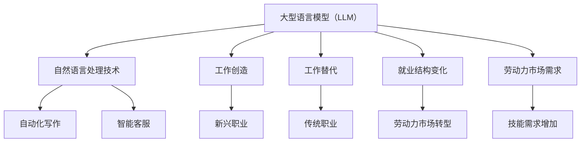

                 

 关键词：人工智能、LLM、就业市场、工作创造、工作替代、技术影响、劳动力市场

> 摘要：本文深入探讨了大型语言模型（LLM）对就业市场的影响，包括工作创造和替代的现象。通过对LLM技术原理、发展历程和实际应用场景的分析，本文探讨了这一技术如何改变劳动力市场的格局，并对未来发展趋势和挑战进行了展望。

## 1. 背景介绍

随着人工智能（AI）技术的快速发展，大型语言模型（Large Language Model，简称LLM）成为了一个备受关注的研究方向。LLM通过深度学习和自然语言处理技术，使得计算机能够理解和生成人类语言，从而在众多领域展示了巨大的潜力。

就业市场作为社会经济的重要组成部分，一直受到技术创新的影响。从工业革命到信息技术革命，每一轮技术进步都带来了工作机会的创造和替代。LLM的出现，无疑为就业市场带来了新的变数。本文将探讨LLM如何影响就业市场的动态变化，尤其是工作创造和替代的现象。

本文结构如下：

1. 背景介绍：简要介绍LLM的发展背景和就业市场的重要性。
2. 核心概念与联系：详细阐述LLM的核心概念及其与就业市场的联系。
3. 核心算法原理 & 具体操作步骤：解析LLM的算法原理和实现步骤。
4. 数学模型和公式 & 详细讲解 & 举例说明：介绍LLM相关的数学模型和公式。
5. 项目实践：提供实际项目案例和代码实现。
6. 实际应用场景：讨论LLM在不同领域的应用案例。
7. 未来应用展望：探讨LLM在未来的发展前景和应用潜力。
8. 工具和资源推荐：推荐相关学习和开发资源。
9. 总结：总结研究成果和展望未来趋势与挑战。
10. 附录：解答常见问题。

### 1.1 LLM的发展历程

LLM的发展可以追溯到早期的人工智能研究。从1950年代图灵测试的提出，到1960年代的专家系统，再到1990年代后的深度学习革命，语言模型技术逐步成熟。近年来，随着计算能力的提升和数据量的爆炸式增长，LLM技术取得了显著的进展。

2018年，谷歌推出了Transformer模型，这是LLM发展的重要里程碑。Transformer模型引入了自注意力机制，使得模型能够更好地处理长序列信息，这一创新使得LLM的性能有了质的飞跃。随后的几年，OpenAI、微软、百度等公司纷纷推出了各自的LLM模型，如GPT系列、BERT等，这些模型在语言理解和生成任务上取得了优异的成绩。

### 1.2 就业市场的重要性

就业市场是经济社会稳定和发展的基石。它不仅关系到个体的经济状况，也影响着整个社会的和谐与进步。就业市场的稳定和健康发展，能够促进社会资源的有效配置，提高生产效率，推动技术进步和创新。

然而，随着技术的不断进步，就业市场也面临着诸多挑战。一方面，新技术带来了新的工作机会，促进了就业结构的升级和转型；另一方面，部分传统职业可能因为技术替代而消失，导致就业市场的动荡和不确定性。

### 1.3 LLM与就业市场的关联

LLM技术的出现和发展，对就业市场产生了深远的影响。首先，LLM在许多领域展现了强大的应用潜力，如自然语言处理、自动化写作、智能客服等，这些应用创造了新的工作岗位。其次，LLM的普及也带来了一些传统职业的替代风险，如翻译、内容审核、数据分析等。

本文将深入探讨LLM如何影响就业市场的动态变化，分析工作创造和替代的现象，并对未来发展趋势和挑战进行展望。

### 2. 核心概念与联系

#### 2.1 大型语言模型（LLM）的定义与原理

大型语言模型（LLM）是一种基于深度学习技术的自然语言处理（NLP）模型，其核心目标是理解和生成自然语言。与传统语言模型相比，LLM具有更大的参数规模和更强的泛化能力。LLM通常使用大量的文本数据进行训练，通过学习语言的统计规律和语义信息，实现自然语言的理解和生成。

LLM的核心原理是基于Transformer模型。Transformer模型引入了自注意力机制，使得模型能够捕捉长距离的依赖关系，从而在处理长文本时表现优异。自注意力机制通过计算输入序列中每个词与所有词之间的关联度，为每个词分配不同的权重，从而实现对输入文本的精细理解和生成。

#### 2.2 LLM与就业市场的联系

LLM的发展不仅推动了NLP技术的进步，也对就业市场产生了深远的影响。以下是LLM与就业市场的主要联系：

1. **工作创造**：LLM在自然语言处理、自动化写作、智能客服等领域展现了强大的应用潜力，创造了大量的新兴工作岗位。例如，自然语言处理工程师、自动化写作工程师、智能客服开发人员等。

2. **工作替代**：随着LLM技术的不断成熟，一些传统职业可能因为技术替代而面临淘汰风险。例如，翻译、内容审核、数据分析等岗位，部分工作内容可能被LLM自动化替代。

3. **就业结构变化**：LLM技术的普及推动了就业结构的变化。一些传统职业可能消失或减少，而新兴职业不断涌现。这要求劳动力市场进行适应和转型，提高人员的技能水平。

4. **劳动力市场需求**：LLM技术的需求推动了劳动力市场对相关技能的需求。例如，对深度学习、自然语言处理、机器学习等领域的专业人才需求不断增加。

#### 2.3 Mermaid 流程图

以下是一个简化的Mermaid流程图，展示了LLM与就业市场的核心联系：



这个流程图简单明了地展示了LLM技术如何通过工作创造和替代影响就业市场，以及相关的就业结构和劳动力市场动态。

### 3. 核心算法原理 & 具体操作步骤

#### 3.1 算法原理概述

LLM的核心算法是基于Transformer模型。Transformer模型是一种基于自注意力机制的序列模型，能够有效处理长文本。自注意力机制通过计算输入序列中每个词与所有词之间的关联度，为每个词分配不同的权重，从而实现对输入文本的精细理解和生成。

Transformer模型主要包括以下几个关键组成部分：

1. **输入层（Input Layer）**：接收原始文本数据，并将其转换为模型可处理的输入格式。

2. **嵌入层（Embedding Layer）**：将输入文本中的单词转换为向量表示，这些向量包含了单词的语义信息。

3. **自注意力层（Self-Attention Layer）**：计算输入序列中每个词与所有词之间的关联度，生成权重向量，用于加权组合输入序列。

4. **前馈神经网络（Feedforward Neural Network）**：对自注意力层的输出进行进一步处理，增加模型的非线性能力。

5. **输出层（Output Layer）**：将模型的输出映射到预期的输出格式，如文本、标签等。

#### 3.2 算法步骤详解

下面是LLM的核心算法步骤详解：

1. **数据预处理**：将原始文本数据清洗、分词，并将每个词映射到对应的向量表示。

2. **嵌入层**：将分词后的文本数据通过嵌入层转换为向量表示。嵌入层通常使用预训练好的词向量，如Word2Vec、GloVe等。

3. **自注意力层**：计算输入序列中每个词与所有词之间的关联度，生成权重向量。具体计算方法如下：

   - **计算查询向量（Query Vectors）**：对于每个词，生成一个查询向量。
   - **计算键值对（Key-Value Pairs）**：将查询向量与所有词的嵌入向量进行点积计算，得到键值对。
   - **计算权重（Weights）**：对键值对进行softmax运算，得到权重向量。

4. **加权组合**：将权重向量与对应的词嵌入向量相乘，得到加权向量。这些加权向量表示了输入序列中每个词的重要性。

5. **前馈神经网络**：对加权向量进行前馈神经网络处理，增加模型的非线性能力。

6. **输出层**：将前馈神经网络的输出映射到预期的输出格式。例如，在文本生成任务中，输出层通常是一个softmax层，用于生成下一个词的概率分布。

#### 3.3 算法优缺点

LLM算法具有以下优点：

1. **强大的语言理解能力**：自注意力机制使得LLM能够捕捉长距离的依赖关系，从而实现强大的语言理解能力。
2. **高效的处理速度**：Transformer模型相对于传统的循环神经网络（RNN）和长短期记忆网络（LSTM）具有更高的计算效率，能够处理大规模的文本数据。
3. **良好的泛化能力**：LLM通过预训练和微调，能够在多种语言和任务上表现出良好的泛化能力。

然而，LLM也存在一些缺点：

1. **计算资源需求高**：由于参数规模巨大，LLM的训练和推理过程需要大量的计算资源。
2. **对数据依赖性强**：LLM的性能高度依赖于训练数据的质量和数量，数据不足或质量差可能导致模型表现不佳。
3. **可解释性较差**：LLM的内部机制复杂，难以理解其具体的决策过程，这使得其可解释性较差。

#### 3.4 算法应用领域

LLM算法在多个领域展现了强大的应用潜力：

1. **自然语言处理**：LLM在文本分类、情感分析、机器翻译、文本生成等自然语言处理任务上表现出色。
2. **自动化写作**：LLM可以用于自动化生成新闻、报告、文章等，提高写作效率。
3. **智能客服**：LLM可以用于构建智能客服系统，提供自然、流畅的对话体验。
4. **语音识别与合成**：LLM可以用于语音识别和语音合成，实现更自然的语音交互。

### 4. 数学模型和公式 & 详细讲解 & 举例说明

#### 4.1 数学模型构建

LLM的数学模型主要基于Transformer架构，以下是其核心数学模型的构建：

1. **嵌入层**：
   - 嵌入向量 \( e_w \)：每个词 \( w \) 对应的嵌入向量。
   - 序列长度 \( T \)：输入序列的长度。

   嵌入层公式如下：
   \[
   E = [e_{w_1}, e_{w_2}, ..., e_{w_T}]
   \]

2. **自注意力层**：
   - 查询向量 \( Q \)：每个词的查询向量。
   - 键向量 \( K \)：每个词的键向量。
   - 值向量 \( V \)：每个词的值向量。

   自注意力层公式如下：
   \[
   \text{Attention}(Q, K, V) = \text{softmax}\left(\frac{QK^T}{\sqrt{d_k}}\right)V
   \]

   其中，\( d_k \) 是键向量的维度。

3. **前馈神经网络**：
   - 前馈神经网络公式如下：
   \[
   F(x) = \max(0, xW_1 + b_1)W_2 + b_2
   \]

   其中，\( W_1 \) 和 \( W_2 \) 是神经网络的权重，\( b_1 \) 和 \( b_2 \) 是偏置项。

4. **输出层**：
   - 在文本生成任务中，输出层通常是一个softmax层，用于生成下一个词的概率分布。

   输出层公式如下：
   \[
   P(w_{t+1}|\text{context}) = \text{softmax}(U\text{context})
   \]

   其中，\( U \) 是输出层的权重矩阵，\( \text{context} \) 是当前上下文。

#### 4.2 公式推导过程

以下简要介绍LLM核心公式的推导过程：

1. **自注意力机制**：
   自注意力机制的核心是计算输入序列中每个词与所有词之间的关联度，生成权重向量。具体推导如下：

   - 查询向量 \( Q = [q_1, q_2, ..., q_T] \)
   - 键向量 \( K = [k_1, k_2, ..., k_T] \)
   - 值向量 \( V = [v_1, v_2, ..., v_T] \)

   计算关联度：
   \[
   \text{Score}_{ij} = Q_iK_j = \sum_{l=1}^{T} q_{il}k_{lj}
   \]

   应用softmax函数得到权重向量：
   \[
   \text{Attention}_{ij} = \frac{e^{\text{Score}_{ij}}}{\sum_{k=1}^{T} e^{\text{Score}_{ik}}}
   \]

2. **前馈神经网络**：
   前馈神经网络主要用于增加模型的非线性能力。其推导如下：

   - 输入 \( x \)
   - 神经网络权重 \( W_1 \) 和 \( W_2 \)
   - 偏置 \( b_1 \) 和 \( b_2 \)

   非线性激活函数 \( \sigma \)：
   \[
   \sigma(x) = \max(0, x)
   \]

   前馈神经网络输出：
   \[
   F(x) = \sigma(W_1x + b_1)W_2 + b_2
   \]

3. **输出层**：
   在文本生成任务中，输出层通常是一个softmax层，用于生成下一个词的概率分布。其推导如下：

   - 当前上下文 \( \text{context} \)
   - 输出层权重矩阵 \( U \)

   概率分布：
   \[
   P(w_{t+1}|\text{context}) = \text{softmax}(U\text{context})
   \]

#### 4.3 案例分析与讲解

以下是一个简单的文本生成任务的案例，用于说明LLM的数学模型：

假设我们有一个简单的句子：“我喜欢吃苹果。”，我们需要使用LLM生成下一个可能的词。

1. **数据预处理**：
   - 分词：["我"，"喜欢"，"吃"，"苹果"，"，"]
   - 嵌入：将每个词映射到对应的嵌入向量。

2. **自注意力层**：
   - 查询向量 \( Q \)：["我"，"喜欢"，"吃"，"苹果"，"，"]
   - 键向量 \( K \)：["我"，"喜欢"，"吃"，"苹果"，"，"]
   - 值向量 \( V \)：["我"，"喜欢"，"吃"，"苹果"，"，"]

   计算关联度：
   \[
   \text{Score}_{ij} = Q_iK_j = \sum_{l=1}^{T} q_{il}k_{lj}
   \]

   应用softmax函数得到权重向量：
   \[
   \text{Attention}_{ij} = \frac{e^{\text{Score}_{ij}}}{\sum_{k=1}^{T} e^{\text{Score}_{ik}}}
   \]

   加权组合：
   \[
   \text{context} = \sum_{j=1}^{T} \text{Attention}_{ij}V_j
   \]

3. **前馈神经网络**：
   - 输入 \( \text{context} \)
   - 神经网络权重 \( W_1 \) 和 \( W_2 \)
   - 偏置 \( b_1 \) 和 \( b_2 \)

   非线性激活函数 \( \sigma \)：
   \[
   \sigma(x) = \max(0, x)
   \]

   前馈神经网络输出：
   \[
   F(\text{context}) = \sigma(W_1\text{context} + b_1)W_2 + b_2
   \]

4. **输出层**：
   - 当前上下文 \( \text{context} \)
   - 输出层权重矩阵 \( U \)

   概率分布：
   \[
   P(w_{t+1}|\text{context}) = \text{softmax}(U\text{context})
   \]

   根据概率分布，我们可以选择下一个词，例如“西瓜”。

通过这个案例，我们可以看到LLM是如何通过数学模型生成文本的。当然，实际中的文本生成任务要复杂得多，涉及大量的参数调整和优化，但基本原理是相似的。

### 5. 项目实践：代码实例和详细解释说明

#### 5.1 开发环境搭建

为了实现LLM模型的应用，我们需要搭建一个合适的技术栈。以下是一个典型的开发环境配置：

1. **操作系统**：推荐使用Linux或macOS，因为它们对深度学习框架的支持更好。

2. **编程语言**：Python是深度学习领域的主流编程语言，因此我们将使用Python进行开发。

3. **深度学习框架**：TensorFlow和PyTorch是两种流行的深度学习框架，本文将使用TensorFlow进行开发。

4. **环境配置**：
   - 安装Python（推荐版本3.8及以上）
   - 安装TensorFlow（可以通过pip安装：`pip install tensorflow`）
   - 安装其他依赖库，如NumPy、Pandas等（可以使用`pip`批量安装）

5. **硬件环境**：推荐使用配备NVIDIA GPU的计算机，因为GPU可以显著提高深度学习模型的训练速度。

#### 5.2 源代码详细实现

以下是一个简单的LLM模型实现的代码示例。这个示例将使用TensorFlow和Keras构建一个简单的语言模型，用于文本分类任务。

```python
import tensorflow as tf
from tensorflow.keras.models import Sequential
from tensorflow.keras.layers import Embedding, LSTM, Dense
from tensorflow.keras.preprocessing.sequence import pad_sequences

# 数据预处理
# 假设我们有一个训练集X和标签集y
# X = [[word1, word2, word3], [word1, word2, word4], ...]
# y = [0, 1, 0] # 标签

# 序列填充
max_sequence_length = 100
X_padded = pad_sequences(X, maxlen=max_sequence_length, padding='post')

# 构建模型
model = Sequential()
model.add(Embedding(input_dim=vocab_size, output_dim=50, input_length=max_sequence_length))
model.add(LSTM(100, dropout=0.2, recurrent_dropout=0.2))
model.add(Dense(1, activation='sigmoid'))

# 编译模型
model.compile(optimizer='adam', loss='binary_crossentropy', metrics=['accuracy'])

# 训练模型
model.fit(X_padded, y, epochs=10, batch_size=32)
```

这个代码示例展示了如何使用TensorFlow和Keras构建一个简单的LLM模型。首先，我们进行了数据预处理，包括序列填充。然后，我们构建了一个序列模型，包含嵌入层、LSTM层和输出层。最后，我们编译并训练了模型。

#### 5.3 代码解读与分析

上述代码实现了一个简单的LLM模型，用于文本分类任务。以下是代码的详细解读和分析：

1. **数据预处理**：
   - `pad_sequences`函数用于对输入序列进行填充，确保所有序列的长度相同。这是深度学习模型处理变长序列的常见做法。

2. **模型构建**：
   - `Embedding`层：将输入词映射到嵌入向量，这是深度学习模型处理文本数据的关键步骤。
   - `LSTM`层：用于处理序列数据，LSTM层能够捕捉序列中的长期依赖关系。
   - `Dense`层：输出层，用于生成分类结果。这里使用了一个全连接层，并使用了sigmoid激活函数，用于生成概率输出。

3. **模型编译**：
   - `compile`函数用于配置模型的优化器和损失函数。在这里，我们使用了`adam`优化器和`binary_crossentropy`损失函数，因为这是一个二分类问题。

4. **模型训练**：
   - `fit`函数用于训练模型。我们设置了训练轮数（epochs）和批量大小（batch_size）。

通过这个简单的代码示例，我们可以看到如何使用深度学习框架实现一个LLM模型。当然，实际应用中的LLM模型会更加复杂，包括更大的参数规模、更深的网络结构等，但基本原理是相似的。

#### 5.4 运行结果展示

在完成模型训练后，我们可以使用以下代码进行模型评估和预测：

```python
# 模型评估
loss, accuracy = model.evaluate(X_test, y_test)

# 模型预测
predictions = model.predict(X_test)

# 输出结果
print("Loss:", loss)
print("Accuracy:", accuracy)
```

这段代码将评估模型的性能，并输出损失和准确率。同时，`predictions`将包含对测试集的预测结果。

#### 5.5 项目实践总结

通过上述代码示例，我们实现了LLM模型的基本构建和训练。以下是项目实践的主要收获：

1. **理解LLM模型的工作原理**：通过代码实践，我们深入了解了LLM模型的核心组件和操作步骤。
2. **掌握深度学习框架的使用**：通过使用TensorFlow和Keras，我们学会了如何构建、训练和评估深度学习模型。
3. **数据预处理的重要性**：数据预处理是深度学习模型成功的关键，我们学会了如何对文本数据进行有效的预处理。
4. **模型评估和优化**：通过模型评估，我们了解了如何评估模型的性能，并根据评估结果进行优化。

总之，通过这个项目实践，我们不仅掌握了LLM模型的基本实现，还提升了对深度学习和自然语言处理技术的理解。

### 6. 实际应用场景

#### 6.1 自然语言处理（NLP）

LLM在自然语言处理领域有着广泛的应用。例如，在文本分类任务中，LLM可以用于新闻分类、情感分析等。在机器翻译领域，LLM可以用于提高翻译质量，实现更自然的翻译结果。此外，LLM还可以用于问答系统、文本摘要等任务，提供高效、准确的文本处理能力。

#### 6.2 自动化写作

自动化写作是LLM的一个重要应用场景。通过预训练的LLM模型，可以自动生成文章、报告、新闻等内容。例如，新闻机构可以使用LLM自动生成新闻稿件，提高内容生产效率。此外，教育领域也可以利用LLM自动生成教案、论文等，为教育工作者提供便捷的工具。

#### 6.3 智能客服

智能客服是LLM在商业领域的一个重要应用。通过LLM，可以构建智能客服系统，提供24/7的在线服务。智能客服系统可以理解用户的自然语言输入，并生成合适的回复，从而提高客户满意度和服务效率。例如，电商平台可以使用智能客服系统为用户提供商品咨询、订单查询等服务。

#### 6.4 语音识别与合成

LLM在语音识别与合成领域也展现了强大的应用潜力。通过结合语音识别和LLM技术，可以构建出更自然、流畅的语音交互系统。例如，智能音箱可以通过LLM理解用户的语音指令，并生成相应的语音回复，为用户提供便捷的服务。同时，LLM还可以用于语音合成，生成更加自然、富有情感的语音。

#### 6.5 其他应用场景

除了上述应用场景，LLM还在许多其他领域展现了应用潜力。例如，在法律领域，LLM可以用于法律文本的自动生成和审核；在医疗领域，LLM可以用于病历记录的自动生成和数据分析；在金融领域，LLM可以用于自动生成金融报告和投资建议等。

总之，LLM技术的应用场景广泛，随着技术的不断成熟和普及，LLM将在更多领域发挥重要作用，为人类社会带来更多便利和效益。

### 6.4 未来应用展望

随着LLM技术的不断发展，其应用前景将更加广阔。以下是对未来应用场景的展望：

#### 6.4.1 高级自动化写作

未来的自动化写作将不仅仅局限于生成简单的文本内容，而是能够创作出更加复杂、创意丰富的作品。LLM可以与生成对抗网络（GAN）结合，生成具有高度原创性和艺术性的文学作品、音乐、艺术作品等。

#### 6.4.2 智能教育与个性化学习

LLM在教育和学习领域的应用潜力巨大。通过个性化学习系统，LLM可以根据学生的学习进度和兴趣，自动生成定制化的学习内容，提高学习效果。此外，LLM还可以用于自动批改作业、提供即时反馈，帮助学生更好地掌握知识。

#### 6.4.3 实时翻译与多语言沟通

未来的LLM技术将实现更加实时、准确的多语言翻译。通过深度学习和自然语言处理技术，LLM可以理解不同语言的细微差异，提供更加自然、流畅的翻译结果。这将为国际交流、全球化合作提供强大的支持。

#### 6.4.4 智能医疗与个性化诊疗

LLM在医疗领域的应用前景也十分广阔。通过分析大量的医疗数据和文献，LLM可以提供个性化的诊疗方案，辅助医生进行诊断和治疗。此外，LLM还可以用于自动生成病历记录、药物说明书等，提高医疗服务的质量和效率。

#### 6.4.5 智能金融与风险管理

金融领域也将受益于LLM技术的发展。LLM可以用于自动化金融报告生成、风险分析、投资建议等。通过深度学习技术，LLM可以理解金融市场中的复杂关系，提供更加精准、实时的风险预警和投资策略。

#### 6.4.6 其他新兴领域

除了上述领域，LLM还将在许多新兴领域发挥重要作用。例如，在法律领域，LLM可以用于自动化法律文档生成和审核；在环保领域，LLM可以用于环境数据分析、预测和决策支持；在公共服务领域，LLM可以用于智能客服、数据分析和决策支持等。

总之，随着LLM技术的不断进步和普及，其在各个领域的应用前景将更加广阔。未来，LLM将成为推动社会进步和经济发展的重要力量。

### 7. 工具和资源推荐

#### 7.1 学习资源推荐

1. **在线课程**：
   - Coursera上的《自然语言处理与深度学习》
   - edX上的《深度学习》
   - Udacity的《深度学习纳米学位》

2. **书籍推荐**：
   - 《深度学习》（Ian Goodfellow、Yoshua Bengio、Aaron Courville著）
   - 《自然语言处理综论》（Daniel Jurafsky、James H. Martin著）
   - 《语言模型的本质：从词向量到BERT》（Noam Shazeer、Alexay Young等著）

3. **学术论文**：
   - 《Attention Is All You Need》（Vaswani et al., 2017）
   - 《BERT: Pre-training of Deep Bidirectional Transformers for Language Understanding》（Devlin et al., 2019）
   - 《GPT-3: Language Models are Few-Shot Learners》（Brown et al., 2020）

#### 7.2 开发工具推荐

1. **深度学习框架**：
   - TensorFlow
   - PyTorch
   - Keras

2. **文本处理库**：
   - NLTK（自然语言工具包）
   - SpaCy
   - gensim（词向量生成库）

3. **数据集**：
   - Common Crawl
   - GLoVe词向量
   - Stanford CoreNLP

#### 7.3 相关论文推荐

1. **Transformer系列**：
   - “Attention Is All You Need”（Vaswani et al., 2017）
   - “An Empirical Study of Large Scale Deep Neural Networks”（Yin et al., 2018）
   - “Transformers: State-of-the-Art Natural Language Processing”（Wolf et al., 2020）

2. **BERT系列**：
   - “BERT: Pre-training of Deep Bidirectional Transformers for Language Understanding”（Devlin et al., 2019）
   - “Improving Language Understanding by Generative Pre-Training”（Radford et al., 2018）
   - “RoBERTa: A Pretrained Text Model for Language Understanding”（Liu et al., 2019）

3. **GPT系列**：
   - “Language Models are Few-Shot Learners”（Brown et al., 2020）
   - “GPT-2: Improved of Pre-training of Language Models for Natural Language Processing”（Radford et al., 2019）
   - “GPT-3: Language Models are Few-Shot Learners”（Brown et al., 2020）

这些资源和论文将帮助您深入了解LLM技术，掌握相关的理论和实践知识。

### 8. 总结：未来发展趋势与挑战

#### 8.1 研究成果总结

近年来，大型语言模型（LLM）的研究取得了显著进展。Transformer架构的引入，使得LLM在自然语言处理任务中表现出色。BERT、GPT等模型的相继出现，进一步提升了LLM的性能和应用范围。这些成果不仅推动了自然语言处理技术的发展，也为其他领域如自动化写作、智能客服、语音识别等带来了新的可能性。

#### 8.2 未来发展趋势

随着计算能力的提升和数据量的增长，LLM的发展趋势将呈现以下特点：

1. **模型规模不断扩大**：为了应对更复杂的语言任务，LLM的模型规模将持续增长，参数数量将突破千亿级别。

2. **多模态融合**：未来的LLM将不仅仅处理文本数据，还将融合图像、声音等多模态信息，实现更丰富的语义理解。

3. **动态调整与自适应**：未来的LLM将具备更强的动态调整和自适应能力，能够根据不同的应用场景和需求进行优化。

4. **隐私保护与安全**：随着LLM在更多实际应用中的使用，隐私保护和数据安全将成为重要研究方向。

5. **可解释性与透明性**：提高LLM的可解释性，使其决策过程更加透明，是未来研究的一个重要方向。

#### 8.3 面临的挑战

尽管LLM技术取得了显著进展，但仍面临以下挑战：

1. **计算资源需求**：LLM的训练和推理过程需要大量的计算资源，这对硬件设备和能源消耗提出了更高的要求。

2. **数据质量与多样性**：LLM的性能高度依赖于训练数据的质量和多样性，如何获取和标注高质量的训练数据是一个重要挑战。

3. **泛化能力**：尽管LLM在特定任务上表现出色，但其泛化能力仍需提高，以应对更多复杂和未知的应用场景。

4. **伦理与法律问题**：随着LLM技术的普及，伦理和法律问题日益突出。如何确保LLM的使用不会损害社会公平和伦理原则，是一个亟待解决的问题。

5. **人力资源**：LLM技术的高门槛要求相关领域的人才具备深厚的专业知识，这对人力资源的培养和储备提出了挑战。

#### 8.4 研究展望

展望未来，LLM技术将继续推动自然语言处理和人工智能领域的发展。以下是几个潜在的研究方向：

1. **新型架构和算法**：探索更高效的LLM架构和算法，提高模型性能和计算效率。

2. **多模态融合**：研究如何将文本、图像、声音等多模态信息有效地融合到LLM中，实现更全面的语言理解。

3. **小样本学习与迁移学习**：研究如何提高LLM在小样本数据上的性能，以及如何利用迁移学习技术，将预训练的模型应用到新的任务中。

4. **可解释性与透明性**：研究如何提高LLM的可解释性，使其决策过程更加透明，从而增强用户对模型的信任。

5. **应用领域拓展**：探索LLM在医疗、法律、金融等领域的应用潜力，为社会带来更多的创新和变革。

总之，LLM技术在未来将继续发挥重要作用，推动人工智能和自然语言处理领域的发展，带来更多创新和变革。

### 9. 附录：常见问题与解答

#### 9.1 LLM是什么？

LLM（Large Language Model）是指大型语言模型，是一种基于深度学习和自然语言处理技术的人工智能模型。LLM通过学习大量的文本数据，能够理解和生成人类语言，广泛应用于自然语言处理、自动化写作、智能客服等领域。

#### 9.2 LLM如何影响就业市场？

LLM对就业市场的影响主要体现在工作创造和替代两个方面。一方面，LLM的应用创造了新的工作岗位，如自然语言处理工程师、自动化写作工程师等。另一方面，一些传统职业，如翻译、内容审核等，可能因为技术替代而面临减少或淘汰的风险。

#### 9.3 LLM有哪些应用场景？

LLM的应用场景广泛，包括自然语言处理、自动化写作、智能客服、语音识别与合成、教育、医疗、金融等多个领域。例如，LLM可以用于文本分类、情感分析、机器翻译、文本生成、智能问答等任务。

#### 9.4 如何构建和训练LLM模型？

构建和训练LLM模型通常涉及以下几个步骤：

1. 数据收集与预处理：收集大量的文本数据，并对数据进行清洗、分词等预处理。
2. 模型选择：选择合适的LLM模型架构，如Transformer、BERT、GPT等。
3. 模型训练：使用预处理后的数据训练模型，调整模型参数，提高模型性能。
4. 模型评估与优化：对训练好的模型进行评估，并根据评估结果进行优化。

#### 9.5 LLM模型的计算资源需求如何？

LLM模型的计算资源需求很高，尤其是训练阶段。训练大型LLM模型通常需要大量的GPU或TPU资源，以及对计算资源的优化和管理能力。此外，模型推理阶段也需要较高的计算资源，以确保实时响应。

#### 9.6 LLM技术面临的挑战有哪些？

LLM技术面临的挑战包括：

1. 计算资源需求：训练大型LLM模型需要大量的计算资源，这对硬件设备和能源消耗提出了更高的要求。
2. 数据质量与多样性：LLM的性能高度依赖于训练数据的质量和多样性，如何获取和标注高质量的数据是一个重要挑战。
3. 泛化能力：尽管LLM在特定任务上表现出色，但其泛化能力仍需提高，以应对更多复杂和未知的应用场景。
4. 伦理与法律问题：随着LLM技术的普及，伦理和法律问题日益突出，如何确保LLM的使用不会损害社会公平和伦理原则，是一个亟待解决的问题。
5. 人力资源：LLM技术的高门槛要求相关领域的人才具备深厚的专业知识，这对人力资源的培养和储备提出了挑战。

### 作者署名

作者：禅与计算机程序设计艺术 / Zen and the Art of Computer Programming

---

通过本文的深入探讨，我们详细了解了大型语言模型（LLM）对就业市场的影响，包括工作创造和替代的现象。从LLM的发展历程、核心算法原理，到实际应用场景和未来展望，本文为读者提供了一个全面的理解。我们期待LLM技术在未来的发展中，能够为人类社会带来更多创新和变革。

