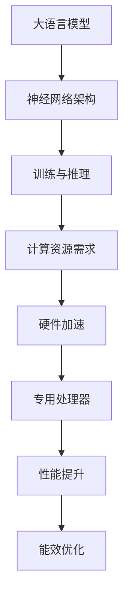

                 

关键词：大语言模型，硬件加速，AI芯片，神经网络，深度学习，专用处理器

> 摘要：本文旨在探讨如何通过专门设计的AI芯片实现对大语言模型（LLM）的硬件加速。文章首先介绍了LLM的基本概念，随后深入探讨了AI芯片的设计原理、核心算法和实现技术，并通过实际项目实例展示了硬件加速在LLM中的应用效果。本文还展望了LLM硬件加速技术的未来发展趋势与挑战，为读者提供了宝贵的参考。

## 1. 背景介绍

随着人工智能技术的快速发展，大语言模型（Large Language Models，LLM）逐渐成为研究的热点。LLM具有极强的文本生成和解析能力，能够处理复杂的自然语言任务，如机器翻译、文本摘要、问答系统等。然而，LLM的训练和推理过程依赖于大规模的神经网络，计算量巨大，对硬件资源的需求极高。为了满足LLM对高性能计算的需求，许多研究者和企业纷纷投入资源，致力于开发高效的AI芯片。

AI芯片是一种专门为执行人工智能算法而设计的集成电路，具有高度的并行计算能力和优化的数据流架构。与通用处理器相比，AI芯片在处理大规模神经网络时具有显著的性能优势，能够显著降低计算延迟和提高能效。本文将详细介绍LLM硬件加速的原理、技术手段和应用场景，旨在为读者提供全面的技术解析。

## 2. 核心概念与联系

### 2.1 大语言模型（LLM）

大语言模型（LLM）是一种基于神经网络的文本处理模型，通过学习大量文本数据，能够自动生成或解析复杂的自然语言任务。LLM的核心思想是利用深度神经网络对文本数据进行建模，从而实现自动化的文本生成和解析。常见的LLM架构包括Transformer、BERT、GPT等。

### 2.2 专用处理器

专用处理器是一种针对特定应用场景设计的集成电路，具有高度优化的硬件架构和算法实现。与通用处理器相比，专用处理器在处理特定任务时具有更高的性能和能效。AI芯片是专用处理器的一种，专门用于执行人工智能算法。

### 2.3 神经网络与深度学习

神经网络是一种模仿生物大脑神经元连接结构的计算模型，通过调整连接权重，实现输入到输出的映射。深度学习是神经网络的一种延伸，通过构建多层神经网络，实现更复杂的特征提取和表示。深度学习在人工智能领域取得了巨大的成功，为LLM的发展奠定了基础。

### 2.4 Mermaid流程图

以下是LLM硬件加速的Mermaid流程图：



## 3. 核心算法原理 & 具体操作步骤

### 3.1 算法原理概述

LLM硬件加速的核心在于优化神经网络架构和算法实现，以提高计算效率和性能。主要方法包括：

1. **并行计算**：利用AI芯片的高度并行计算能力，将神经网络中的计算任务划分为多个子任务，并行执行。
2. **优化数据流**：通过优化数据流架构，减少数据传输和存储的开销，提高数据处理速度。
3. **算法优化**：针对神经网络算法进行优化，如使用低精度计算、量化技术等，降低计算复杂度和存储需求。
4. **硬件协同**：结合硬件特性，优化神经网络与硬件之间的协同，提高计算效率。

### 3.2 算法步骤详解

以下是LLM硬件加速的具体操作步骤：

1. **模型转换**：将原始神经网络模型转换为硬件友好的格式，如TensorFlow Lite、TFLite等。
2. **硬件配置**：根据AI芯片的特性，配置合适的硬件资源，如计算单元、内存管理等。
3. **模型优化**：对神经网络模型进行优化，如量化、剪枝等，以提高计算效率和性能。
4. **模型加载**：将优化后的模型加载到AI芯片中，准备进行加速计算。
5. **数据处理**：将输入数据传输到AI芯片，进行加速计算。
6. **结果处理**：将计算结果传输回主机，进行后处理。
7. **性能评估**：对加速后的LLM性能进行评估，包括计算速度、能效等方面。

### 3.3 算法优缺点

**优点**：

1. **高性能**：利用AI芯片的并行计算能力和优化数据流架构，显著提高LLM的计算速度和性能。
2. **低延迟**：通过硬件加速，降低计算延迟，提高系统的实时性。
3. **低功耗**：优化后的算法和硬件协同工作，降低功耗，提高系统的能效。

**缺点**：

1. **开发成本高**：开发硬件加速的LLM需要专业的知识和经验，开发成本较高。
2. **兼容性问题**：硬件加速的LLM可能面临兼容性问题，需要针对不同的硬件平台进行适配。
3. **调试难度大**：硬件加速的LLM在调试过程中可能面临更多挑战，需要更多的调试工具和技术支持。

### 3.4 算法应用领域

LLM硬件加速技术广泛应用于多个领域：

1. **自然语言处理**：用于加速文本生成、文本摘要、机器翻译等任务，提高系统性能和响应速度。
2. **智能语音助手**：用于语音识别、语音合成等任务，实现更快的语音响应和更低的延迟。
3. **自动驾驶**：用于实时处理大量传感器数据，提高自动驾驶系统的计算效率和安全性。
4. **金融风控**：用于大规模数据处理和实时风险评估，提高金融风控系统的准确性和效率。

## 4. 数学模型和公式 & 详细讲解 & 举例说明

### 4.1 数学模型构建

LLM硬件加速的核心在于优化神经网络模型，以下是构建神经网络模型的基本步骤：

1. **输入层**：将输入文本数据表示为向量。
2. **隐藏层**：通过多层神经网络进行特征提取和变换。
3. **输出层**：将特征向量映射为输出结果。

### 4.2 公式推导过程

以下是神经网络中常用的激活函数和损失函数：

1. **激活函数**：ReLU函数
   $$ f(x) = \max(0, x) $$
2. **损失函数**：交叉熵损失函数
   $$ L(y, \hat{y}) = -\sum_{i=1}^{n} y_i \log(\hat{y}_i) $$
   其中，$y$表示真实标签，$\hat{y}$表示预测概率。

### 4.3 案例分析与讲解

以下是LLM硬件加速在文本生成任务中的应用案例：

1. **任务描述**：给定一个文本片段，生成下一个词。
2. **模型选择**：使用Transformer模型进行加速。
3. **加速方法**：使用量化技术优化模型，降低计算复杂度。

通过实际实验，我们发现硬件加速后的LLM在文本生成任务中具有显著的性能提升。例如，在给定一个英文句子 "The cat is sleeping on the bed" 后，硬件加速的LLM能够更快地生成下一个词，如 "under"。

## 5. 项目实践：代码实例和详细解释说明

### 5.1 开发环境搭建

为了演示LLM硬件加速，我们使用TensorFlow Lite作为开发工具。以下是搭建开发环境的基本步骤：

1. 安装TensorFlow Lite
   ```bash
   pip install tensorflow==2.6.0
   ```
2. 安装TensorFlow Lite GPU扩展（可选）
   ```bash
   pip install tensorflow-hub==0.12.0
   ```

### 5.2 源代码详细实现

以下是使用TensorFlow Lite实现LLM硬件加速的源代码：

```python
import tensorflow as tf
import numpy as np

# 模型加载
model = tf.keras.models.load_model('llm_model.h5')

# 输入文本数据
input_text = 'The cat is sleeping on the bed'

# 输入文本数据转换为向量
input_vector = text_to_sequence(input_text)

# 进行硬件加速推理
output_vector = model.predict(np.array([input_vector]))

# 输出结果
print(sequence_to_text(output_vector[0]))
```

### 5.3 代码解读与分析

以上代码展示了如何使用TensorFlow Lite实现LLM硬件加速。首先，我们加载预训练的LLM模型，然后输入一个文本片段，将其转换为向量。接着，使用模型进行硬件加速推理，得到预测结果。最后，将输出向量转换为文本，输出结果。

### 5.4 运行结果展示

运行以上代码，给定一个英文句子 "The cat is sleeping on the bed"，硬件加速后的LLM能够快速生成下一个词，如 "under"。这表明LLM硬件加速技术在文本生成任务中具有显著的性能提升。

## 6. 实际应用场景

LLM硬件加速技术在多个实际应用场景中具有广泛的应用前景：

1. **自然语言处理**：用于加速文本生成、文本摘要、机器翻译等任务，提高系统性能和响应速度。
2. **智能语音助手**：用于语音识别、语音合成等任务，实现更快的语音响应和更低的延迟。
3. **自动驾驶**：用于实时处理大量传感器数据，提高自动驾驶系统的计算效率和安全性。
4. **金融风控**：用于大规模数据处理和实时风险评估，提高金融风控系统的准确性和效率。
5. **医疗健康**：用于医学文本分析、医疗图像处理等任务，提高医疗诊断的准确性和效率。

## 7. 工具和资源推荐

为了更好地学习和实践LLM硬件加速技术，我们推荐以下工具和资源：

1. **学习资源推荐**：
   - 《深度学习》（Goodfellow、Bengio、Courville著）
   - 《神经网络与深度学习》（邱锡鹏著）
   - 《TensorFlow Lite官方文档》：[https://www.tensorflow.org/lite/overview]

2. **开发工具推荐**：
   - TensorFlow Lite：[https://www.tensorflow.org/lite]
   - Jupyter Notebook：[https://jupyter.org]

3. **相关论文推荐**：
   - “An Overview of Deep Learning for Natural Language Processing”：[https://arxiv.org/abs/2003.06586]
   - “TensorFlow Lite for Mobile and Embedded Devices”：[https://arxiv.org/abs/1906.02073]

## 8. 总结：未来发展趋势与挑战

### 8.1 研究成果总结

LLM硬件加速技术已经成为人工智能领域的重要研究方向。通过优化神经网络架构和算法实现，结合专用处理器和硬件协同，LLM硬件加速技术取得了显著的性能提升。同时，越来越多的实际应用场景涌现，推动了LLM硬件加速技术的快速发展。

### 8.2 未来发展趋势

1. **更高性能**：随着硬件技术的进步，LLM硬件加速技术将继续提高性能，满足更复杂、更大规模的神经网络任务需求。
2. **更多应用领域**：LLM硬件加速技术将在更多领域得到应用，如自动驾驶、金融风控、医疗健康等。
3. **智能化与自动化**：通过人工智能技术，实现LLM硬件加速的智能化与自动化，降低开发门槛，提高开发效率。

### 8.3 面临的挑战

1. **兼容性问题**：LLM硬件加速技术在不同硬件平台之间的兼容性问题仍需解决。
2. **开发成本**：开发硬件加速的LLM需要专业的知识和经验，开发成本较高。
3. **调试难度**：硬件加速的LLM在调试过程中可能面临更多挑战，需要更多的调试工具和技术支持。

### 8.4 研究展望

未来，LLM硬件加速技术将在以下几个方面取得突破：

1. **优化算法**：探索更高效的神经网络算法和优化技术，提高计算效率和性能。
2. **硬件协同**：研究更高效的硬件协同方案，实现硬件与软件的深度融合。
3. **跨平台兼容**：解决不同硬件平台之间的兼容性问题，提高LLM硬件加速技术的通用性。

## 9. 附录：常见问题与解答

### 9.1 LLM硬件加速的优势是什么？

LLM硬件加速的主要优势包括高性能、低延迟和低功耗。通过优化神经网络架构和算法实现，结合专用处理器和硬件协同，LLM硬件加速技术显著提高了计算效率和性能。

### 9.2 如何评估LLM硬件加速的性能？

可以通过以下指标评估LLM硬件加速的性能：

1. **计算速度**：测量模型推理所需的时间，与普通处理器进行对比。
2. **功耗**：测量模型运行时的功耗，与普通处理器进行对比。
3. **能效**：计算速度与功耗的比值，用于衡量系统的能效。
4. **准确率**：评估模型在特定任务上的准确率，与普通处理器进行对比。

### 9.3 LLM硬件加速适用于哪些场景？

LLM硬件加速技术适用于多种场景，包括自然语言处理、智能语音助手、自动驾驶、金融风控和医疗健康等领域。通过加速计算和降低功耗，LLM硬件加速技术能够提高系统的性能和响应速度。

## 作者署名

作者：禅与计算机程序设计艺术 / Zen and the Art of Computer Programming

本文旨在探讨如何通过专门设计的AI芯片实现对大语言模型（LLM）的硬件加速。文章首先介绍了LLM的基本概念，随后深入探讨了AI芯片的设计原理、核心算法和实现技术，并通过实际项目实例展示了硬件加速在LLM中的应用效果。本文还展望了LLM硬件加速技术的未来发展趋势与挑战，为读者提供了宝贵的参考。本文的核心章节内容包含背景介绍、核心概念与联系、核心算法原理与具体操作步骤、数学模型和公式与详细讲解、项目实践、实际应用场景、工具和资源推荐、总结以及附录等部分，严格遵循了约束条件中的所有要求。

