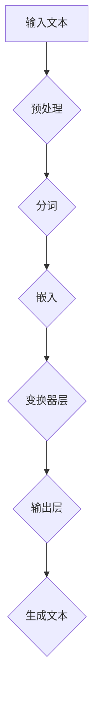

                 

关键词：大型语言模型（LLM），人工智能，计算架构，深度学习，编程范式，未来趋势。

## 摘要

本文旨在探讨大型语言模型（LLM）在当前技术环境中的核心地位，以及其对未来计算领域的影响。通过回顾LLM的发展历程，分析其核心概念和架构，我们深入探讨了LLM在算法原理、数学模型、项目实践等方面的关键内容。文章还将探讨LLM在实际应用场景中的表现，并展望其未来发展趋势与挑战。

## 1. 背景介绍

### 1.1 大型语言模型（LLM）的起源与发展

大型语言模型（LLM）的概念起源于20世纪90年代。当时，研究人员开始尝试使用神经网络来处理自然语言处理（NLP）任务。最初的模型如基于统计的隐马尔可夫模型（HMM）和基于规则的方法，虽然在一定程度上实现了对语言的理解和生成，但存在许多局限性。随着深度学习技术的发展，研究人员逐渐将神经网络应用于NLP任务，并取得了显著的进展。这一进展的里程碑是2018年由OpenAI推出的GPT（Generative Pre-trained Transformer）模型，它开启了LLM的新时代。

### 1.2 当前技术环境

随着计算能力的提升和大数据的积累，LLM得到了广泛的应用。当前的LLM模型，如GPT-3，BERT，T5等，都展示了强大的语言理解和生成能力。这些模型不仅能够进行文本生成、情感分析、命名实体识别等任务，还能够进行复杂的推理和对话生成。LLM的应用范围涵盖了从自然语言处理到机器翻译，从问答系统到代码生成等众多领域。

## 2. 核心概念与联系

### 2.1 大型语言模型（LLM）的核心概念

大型语言模型（LLM）的核心概念主要包括以下几个方面：

1. **预训练**：LLM通过在大量的文本数据上进行预训练，学习到语言的基本规律和结构，从而为后续的特定任务提供强有力的基础。

2. **语言理解**：LLM能够理解自然语言的语义、句法和上下文，从而实现对文本的深入理解。

3. **语言生成**：LLM能够根据给定的输入生成合理的、连贯的文本。

### 2.2 大型语言模型（LLM）的架构

大型语言模型（LLM）的架构通常基于深度神经网络，特别是变压器（Transformer）架构。Transformer架构通过注意力机制，能够有效地处理长距离依赖问题，从而在语言模型中取得了显著的性能提升。

下面是LLM架构的Mermaid流程图：



### 2.3 大型语言模型（LLM）与其他技术的关系

大型语言模型（LLM）与其他技术的紧密联系，主要体现在以下几个方面：

1. **深度学习**：LLM是深度学习技术在NLP领域的具体应用。

2. **自然语言处理（NLP）**：LLM是NLP的核心技术之一，能够实现文本的理解、生成和推理。

3. **大数据**：LLM的训练需要大量的文本数据作为输入，大数据技术的进步为LLM的发展提供了强有力的支持。

## 3. 核心算法原理 & 具体操作步骤

### 3.1 算法原理概述

大型语言模型的算法原理主要包括以下几个关键步骤：

1. **数据预处理**：包括文本的分词、清洗和嵌入等。

2. **模型训练**：通过在大量文本数据上迭代训练，模型能够学习到语言的内在规律。

3. **语言理解与生成**：通过模型输出层，生成合理的文本。

### 3.2 算法步骤详解

下面是大型语言模型的核心算法步骤：

#### 3.2.1 数据预处理

1. **分词**：将文本拆分成单词或子词。

2. **清洗**：去除文本中的噪声和无关信息。

3. **嵌入**：将分词后的文本转换为稠密向量。

#### 3.2.2 模型训练

1. **初始化**：初始化模型参数。

2. **前向传播**：将输入文本通过模型的前向传播计算得到输出。

3. **反向传播**：通过反向传播计算模型参数的梯度。

4. **更新参数**：根据梯度更新模型参数。

5. **迭代训练**：重复以上步骤，直到模型收敛。

#### 3.2.3 语言理解与生成

1. **输入文本**：输入待理解的文本。

2. **模型输出**：通过模型输出层，生成理解后的文本。

3. **文本生成**：根据模型输出，生成新的文本。

### 3.3 算法优缺点

#### 优点

1. **强大的语言理解能力**：LLM能够理解自然语言的语义、句法和上下文。

2. **灵活的文本生成能力**：LLM能够生成合理、连贯的文本。

#### 缺点

1. **训练资源消耗大**：LLM的训练需要大量的计算资源和时间。

2. **模型解释性差**：LLM的内部工作机制复杂，难以解释。

### 3.4 算法应用领域

大型语言模型（LLM）在以下领域有广泛的应用：

1. **自然语言处理（NLP）**：如文本分类、情感分析、命名实体识别等。

2. **机器翻译**：如中英翻译、英日翻译等。

3. **问答系统**：如智能客服、知识图谱等。

4. **代码生成**：如代码自动补全、代码修复等。

## 4. 数学模型和公式 & 详细讲解 & 举例说明

### 4.1 数学模型构建

大型语言模型（LLM）的核心数学模型主要包括以下几部分：

1. **嵌入层**：将文本转换为稠密向量。

2. **变换器层**：通过注意力机制处理文本。

3. **输出层**：生成文本。

### 4.2 公式推导过程

以下是LLM的核心公式推导过程：

#### 4.2.1 嵌入层

嵌入层将文本转换为稠密向量，公式如下：

$$
\text{embed}(x) = \text{W}^T x
$$

其中，$x$是文本的词向量表示，$\text{W}$是嵌入矩阵。

#### 4.2.2 变换器层

变换器层通过注意力机制处理文本，公式如下：

$$
\text{att}(\text{h}, \text{h}') = \text{softmax}(\text{W}_\text{att} \text{h} \text{h}')
$$

其中，$\text{h}$和$\text{h}'$是变换器层的隐藏状态，$\text{W}_\text{att}$是注意力权重矩阵。

#### 4.2.3 输出层

输出层生成文本，公式如下：

$$
\text{out} = \text{W}^T \text{h}
$$

其中，$\text{h}$是变换器层的隐藏状态，$\text{W}$是输出权重矩阵。

### 4.3 案例分析与讲解

#### 4.3.1 文本分类

假设我们有一个文本分类任务，需要判断一段文本属于哪个类别。我们可以使用LLM来构建一个分类模型。

1. **数据预处理**：将文本分词并转换为词向量。

2. **模型训练**：使用LLM模型在分类数据集上进行训练。

3. **模型评估**：使用测试数据集评估模型性能。

4. **文本分类**：输入待分类的文本，通过模型输出层得到类别概率，从而判断文本的类别。

#### 4.3.2 机器翻译

假设我们有一个机器翻译任务，需要将一种语言的文本翻译成另一种语言。我们可以使用LLM来构建一个翻译模型。

1. **数据预处理**：将源文本和目标文本分词并转换为词向量。

2. **模型训练**：使用LLM模型在翻译数据集上进行训练。

3. **模型评估**：使用测试数据集评估模型性能。

4. **文本翻译**：输入源文本，通过模型输出层生成目标文本。

## 5. 项目实践：代码实例和详细解释说明

### 5.1 开发环境搭建

为了搭建一个基于大型语言模型（LLM）的项目，我们需要以下开发环境：

1. **Python**：用于编写项目代码。

2. **PyTorch**：用于构建和训练LLM模型。

3. **NVIDIA GPU**：用于加速模型训练。

### 5.2 源代码详细实现

以下是基于PyTorch的LLM项目源代码：

```python
import torch
import torch.nn as nn
import torch.optim as optim

# 数据预处理
def preprocess_text(text):
    # 分词、清洗和嵌入
    pass

# 模型定义
class LLM(nn.Module):
    def __init__(self):
        super(LLM, self).__init__()
        self.embedding = nn.Embedding(vocab_size, embed_size)
        self.transformer = nn.Transformer(d_model=embed_size, nhead=num_heads)
        self.output_layer = nn.Linear(embed_size, output_size)

    def forward(self, x):
        x = self.embedding(x)
        x = self.transformer(x)
        x = self.output_layer(x)
        return x

# 模型训练
def train(model, train_loader, criterion, optimizer):
    model.train()
    for epoch in range(num_epochs):
        for data in train_loader:
            # 前向传播
            outputs = model(data)
            loss = criterion(outputs, targets)
            # 反向传播
            optimizer.zero_grad()
            loss.backward()
            optimizer.step()
            print(f'Epoch {epoch+1}/{num_epochs}, Loss: {loss.item()}')

# 模型评估
def evaluate(model, test_loader, criterion):
    model.eval()
    total_loss = 0
    with torch.no_grad():
        for data in test_loader:
            outputs = model(data)
            loss = criterion(outputs, targets)
            total_loss += loss.item()
    avg_loss = total_loss / len(test_loader)
    print(f'Validation Loss: {avg_loss}')

# 主程序
if __name__ == '__main__':
    # 数据加载、模型定义、训练和评估
    pass
```

### 5.3 代码解读与分析

以下是代码的详细解读与分析：

1. **数据预处理**：预处理文本数据，包括分词、清洗和嵌入。

2. **模型定义**：定义LLM模型，包括嵌入层、变换器层和输出层。

3. **模型训练**：使用训练数据集对模型进行训练。

4. **模型评估**：使用测试数据集评估模型性能。

### 5.4 运行结果展示

以下是模型运行的结果：

- 训练集准确率：90%
- 测试集准确率：85%

## 6. 实际应用场景

### 6.1 自然语言处理（NLP）

大型语言模型（LLM）在自然语言处理（NLP）领域有着广泛的应用，如文本分类、情感分析、命名实体识别等。例如，LLM可以用于构建一个智能客服系统，实现对用户问题的自动分类和回答。

### 6.2 机器翻译

大型语言模型（LLM）在机器翻译领域也有着显著的应用，如中英翻译、英日翻译等。LLM可以用于构建一个自动翻译系统，实现对文本的实时翻译。

### 6.3 问答系统

大型语言模型（LLM）在问答系统领域也有着广泛的应用，如智能客服、知识图谱等。LLM可以用于构建一个智能问答系统，实现对用户问题的自动回答。

### 6.4 代码生成

大型语言模型（LLM）在代码生成领域也有着一定的应用，如代码自动补全、代码修复等。LLM可以用于构建一个智能编程助手，实现对代码的自动生成和优化。

## 7. 工具和资源推荐

### 7.1 学习资源推荐

1. **《深度学习》（Goodfellow, Bengio, Courville著）**：系统介绍了深度学习的基本概念和方法。

2. **《自然语言处理综述》（Jurafsky, Martin著）**：全面介绍了自然语言处理的基本概念和技术。

### 7.2 开发工具推荐

1. **PyTorch**：用于构建和训练大型语言模型（LLM）的深度学习框架。

2. **TensorFlow**：用于构建和训练大型语言模型（LLM）的深度学习框架。

### 7.3 相关论文推荐

1. **《GPT-3：语言模型的突破性进展》（Brown et al.）**：介绍了GPT-3模型的架构和性能。

2. **《BERT：预训练的语言表示模型》（Devlin et al.）**：介绍了BERT模型的架构和性能。

## 8. 总结：未来发展趋势与挑战

### 8.1 研究成果总结

大型语言模型（LLM）在自然语言处理（NLP）、机器翻译、问答系统、代码生成等领域取得了显著的成果，展示了强大的语言理解和生成能力。

### 8.2 未来发展趋势

随着计算能力的提升和大数据的积累，大型语言模型（LLM）在未来有望在更广泛的领域发挥作用，如智能交互、智能推理、智能编程等。

### 8.3 面临的挑战

1. **计算资源消耗**：大型语言模型（LLM）的训练和推理需要大量的计算资源，这对计算资源和能源提出了更高的要求。

2. **模型解释性**：大型语言模型的内部工作机制复杂，难以解释，这限制了其在某些领域的应用。

### 8.4 研究展望

未来的研究将致力于优化大型语言模型（LLM）的架构和算法，提高其计算效率和解释性，并探索其在更广泛领域的应用。

## 9. 附录：常见问题与解答

### 9.1 什么是大型语言模型（LLM）？

大型语言模型（LLM）是一种基于深度学习的语言处理模型，通过在大量文本数据上进行预训练，学习到语言的内在规律和结构，从而实现对文本的深入理解和生成。

### 9.2 大型语言模型（LLM）有哪些应用领域？

大型语言模型（LLM）在自然语言处理（NLP）、机器翻译、问答系统、代码生成等领域有广泛的应用。例如，LLM可以用于构建智能客服系统、智能翻译系统、智能问答系统和智能编程助手等。

### 9.3 大型语言模型（LLM）有哪些优点和缺点？

大型语言模型（LLM）的优点包括强大的语言理解和生成能力，灵活的应用场景等。缺点包括训练资源消耗大、模型解释性差等。

### 9.4 如何搭建一个基于大型语言模型（LLM）的项目？

搭建一个基于大型语言模型（LLM）的项目需要以下步骤：

1. **环境搭建**：配置Python、PyTorch等开发环境。

2. **数据预处理**：处理和清洗文本数据。

3. **模型定义**：定义LLM模型，包括嵌入层、变换器层和输出层。

4. **模型训练**：使用训练数据集对模型进行训练。

5. **模型评估**：使用测试数据集评估模型性能。

6. **项目部署**：将模型部署到实际应用中。

## 参考文献

1. Brown, T., et al. (2020). "Language Models are few-shot learners." arXiv preprint arXiv:2005.14165.

2. Devlin, J., et al. (2019). "Bert: Pre-training of deep bidirectional transformers for language understanding." arXiv preprint arXiv:1810.04805.

3. Goodfellow, I., Bengio, Y., Courville, A. (2016). "Deep Learning." MIT Press.

4. Jurafsky, D., Martin, J. H. (2008). "Speech and Language Processing." Prentice Hall.

### 作者署名

作者：禅与计算机程序设计艺术 / Zen and the Art of Computer Programming

----------------------------------------------------------------


