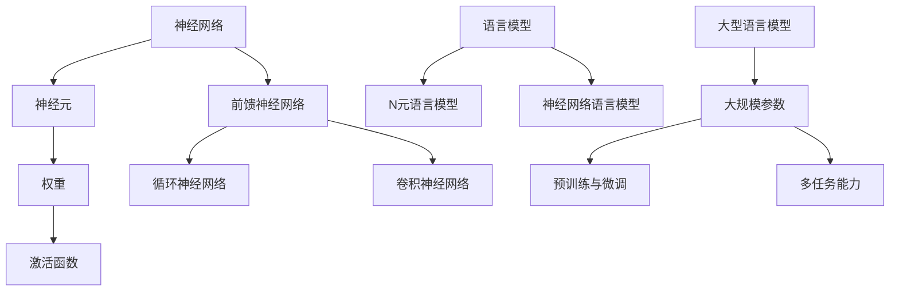

                 

关键词：大型语言模型、计算机架构、神经网络、人工智能、深度学习

> 摘要：本文将探讨一种新型的计算机架构——LLM（大型语言模型），从其背景介绍、核心概念与联系、核心算法原理与具体操作步骤、数学模型与公式详细讲解、项目实践代码实例、实际应用场景、未来应用展望以及工具和资源推荐等多个方面，全面解析LLM的架构特点和未来发展。

## 1. 背景介绍

随着人工智能技术的飞速发展，深度学习已经成为当前最为热门的研究领域之一。在深度学习领域，神经网络模型的应用已经取得了巨大的成功，特别是在图像识别、语音识别和自然语言处理等方面。然而，随着模型复杂度的不断增加，传统的计算机架构已经无法满足大型神经网络模型的计算需求。

为了解决这个问题，研究者们开始探索新型的计算机架构，以支持更高效、更大规模的神经网络模型。在这种背景下，大型语言模型（LLM）架构逐渐引起了人们的关注。LLM是一种专门为处理自然语言文本数据而设计的计算机架构，其核心思想是通过大规模的神经网络模型，实现对语言数据的建模和预测。

## 2. 核心概念与联系

### 2.1 神经网络

神经网络（Neural Network）是一种模仿生物神经系统的计算模型。它由大量的神经元（或节点）组成，每个神经元都与其它神经元相连，并通过权重（或强度）来传递信息。在神经网络中，信息通过多个层次传递和处理，最终得到输出。

神经网络的核心组件包括：

- **神经元（Node）**：神经网络的基本计算单元，负责接收输入、加权求和并传递输出。
- **权重（Weight）**：神经元之间的连接强度，用于调整信息的传递。
- **激活函数（Activation Function）**：用于对神经元输出进行非线性变换，常见的激活函数有Sigmoid、ReLU等。

神经网络的主要类型包括：

- **前馈神经网络（Feedforward Neural Network）**：信息从前向后传递，不发生循环。
- **循环神经网络（Recurrent Neural Network, RNN）**：信息在时间步之间发生循环，适用于序列数据。
- **卷积神经网络（Convolutional Neural Network, CNN）**：适用于图像等具有空间结构的数据。

### 2.2 语言模型

语言模型（Language Model）是一种用于预测文本序列的统计模型。它的基本思想是通过对大量文本数据的学习，捕捉语言中的统计规律，从而实现对未知文本的生成和预测。

语言模型的主要类型包括：

- **N元语言模型（N-gram Model）**：基于局部窗口的统计模型，只考虑前N个单词对下一个单词的预测。
- **神经网络语言模型（Neural Network Language Model, NNLM）**：基于神经网络的统计模型，可以捕捉更复杂的语言规律。

### 2.3 大型语言模型

大型语言模型（Large Language Model, LLM）是一种具有大规模参数的神经网络语言模型，通常具有数百万到数十亿个参数。LLM通过深度学习算法从大量文本数据中学习语言规律，从而实现高精度的文本生成和预测。

LLM的主要特点包括：

- **大规模参数**：LLM拥有非常多的参数，能够捕捉语言中的复杂规律。
- **预训练与微调**：LLM通常通过预训练的方式在大规模文本数据上学习，然后通过微调的方式适应特定的任务。
- **多任务能力**：LLM可以同时处理多种自然语言处理任务，如文本分类、情感分析、机器翻译等。

### 2.4 Mermaid 流程图



## 3. 核心算法原理 & 具体操作步骤

### 3.1 算法原理概述

LLM的核心算法是基于深度学习技术，通过大规模的神经网络模型对自然语言文本数据进行建模和预测。其基本原理包括：

- **词嵌入（Word Embedding）**：将文本中的单词映射到高维向量空间，以捕捉单词之间的语义关系。
- **多层神经网络（Multi-layer Neural Network）**：通过多层神经网络的堆叠，实现对文本数据的逐层抽象和表征。
- **反向传播（Backpropagation）**：通过反向传播算法，计算神经网络参数的梯度，以优化模型性能。

### 3.2 算法步骤详解

LLM的训练和预测过程可以分为以下几个步骤：

1. **数据预处理**：对文本数据进行清洗和分词，将单词映射为词嵌入向量。
2. **构建神经网络**：设计神经网络架构，包括输入层、隐藏层和输出层。
3. **预训练**：在大量文本数据上，通过梯度下降算法对神经网络参数进行优化，使模型能够捕捉到语言中的复杂规律。
4. **微调**：在特定任务的数据集上，对预训练的模型进行微调，以适应特定的任务需求。
5. **预测**：对新的文本数据，通过模型进行预测，生成文本序列。

### 3.3 算法优缺点

**优点**：

- **高精度**：LLM通过大规模的神经网络模型，能够实现对文本数据的精确建模和预测。
- **多任务能力**：LLM可以同时处理多种自然语言处理任务，具有很好的通用性。
- **自适应性强**：LLM能够通过预训练和微调，快速适应不同的任务和数据集。

**缺点**：

- **计算资源消耗大**：LLM的训练和预测需要大量的计算资源和存储空间。
- **模型解释性差**：LLM的内部机制复杂，难以解释和理解。
- **数据依赖性高**：LLM的性能很大程度上依赖于训练数据的质量和规模。

### 3.4 算法应用领域

LLM在自然语言处理领域具有广泛的应用，包括：

- **文本分类**：对文本进行分类，如新闻分类、情感分类等。
- **机器翻译**：将一种语言的文本翻译成另一种语言。
- **文本生成**：生成文本，如自动写文章、编写代码等。
- **问答系统**：对用户的问题提供准确的答案。
- **对话系统**：与用户进行自然语言对话。

## 4. 数学模型和公式 & 详细讲解 & 举例说明

### 4.1 数学模型构建

LLM的数学模型主要包括词嵌入、多层神经网络和损失函数等。

1. **词嵌入**：

词嵌入将单词映射到高维向量空间，常用的方法有Word2Vec和GloVe。

- **Word2Vec**：

$$
\text{vec}(w) = \frac{1}{\|v\|}\sum_{j=1}^V v_j \text{ where } v_j = \text{sgn}(\text{Context}(w))
$$

其中，$V$为词汇表大小，$\text{Context}(w)$为单词$w$的上下文。

- **GloVe**：

$$
\text{vec}(w) = \frac{1}{\sqrt{f(w)}} \text{ where } f(w) = \sum_{j=1}^V \text{count}(w, j) \log(\frac{f(w)}{f(j)})
$$

其中，$f(w)$为单词$w$的词频，$f(j)$为单词$j$的词频。

2. **多层神经网络**：

多层神经网络由多个层组成，包括输入层、隐藏层和输出层。每一层之间的连接通过权重矩阵实现。

$$
h_{l+1} = \sigma(W_{l+1}h_l + b_{l+1})
$$

其中，$h_l$为第$l$层的激活值，$W_{l+1}$为第$l+1$层的权重矩阵，$b_{l+1}$为第$l+1$层的偏置向量，$\sigma$为激活函数。

3. **损失函数**：

损失函数用于衡量模型预测值与真实值之间的差距，常用的损失函数有交叉熵损失和均方误差损失。

- **交叉熵损失**：

$$
J = -\sum_{i=1}^N y_i \log(p_i)
$$

其中，$y_i$为真实标签，$p_i$为模型预测概率。

- **均方误差损失**：

$$
J = \frac{1}{2N} \sum_{i=1}^N (y_i - p_i)^2
$$

其中，$N$为样本数量。

### 4.2 公式推导过程

在LLM中，词嵌入、多层神经网络和损失函数等公式的推导过程如下：

1. **词嵌入**：

词嵌入的目的是将单词映射到高维向量空间，以捕捉单词之间的语义关系。Word2Vec和GloVe是两种常见的词嵌入方法。

- **Word2Vec**：

$$
\text{vec}(w) = \frac{1}{\|v\|}\sum_{j=1}^V v_j \text{ where } v_j = \text{sgn}(\text{Context}(w))
$$

其中，$V$为词汇表大小，$\text{Context}(w)$为单词$w$的上下文。

为了推导Word2Vec的公式，我们考虑一个简单的二分类问题。设$w$为单词，$c$为单词$w$的上下文单词，$v$为单词$w$的词向量，$y$为标签（1表示单词$w$出现在上下文$c$中，0表示不出现）。

$$
\text{logistic}(w, c) = \sigma(\sum_{j=1}^V v_j \text{sgn}(c_j))
$$

其中，$\text{sgn}(c_j) = 1$ if $c_j > 0$，otherwise $\text{sgn}(c_j) = -1$。

为了最小化损失函数，我们对词向量$v$进行优化：

$$
\frac{\partial J}{\partial v} = \frac{\partial}{\partial v} \sum_{i=1}^N y_i \text{logistic}(w_i, c_i) = \sum_{i=1}^N (1 - y_i) \text{sgn}(c_i)
$$

因此，我们可以通过梯度下降算法更新词向量：

$$
v_j = v_j - \alpha \frac{\partial J}{\partial v} = v_j - \alpha (1 - y_i) \text{sgn}(c_i)
$$

- **GloVe**：

$$
\text{vec}(w) = \frac{1}{\sqrt{f(w)}} \text{ where } f(w) = \sum_{j=1}^V \text{count}(w, j) \log(\frac{f(w)}{f(j)})
$$

为了推导GloVe的公式，我们考虑一个简单的文本生成问题。设$w$为单词，$v$为单词$w$的词向量，$p$为单词$w$的词频。

$$
\text{logistic}(w) = \sigma(\sum_{j=1}^V v_j \log(\frac{p_j}{p}))
$$

为了最小化损失函数，我们对词向量$v$进行优化：

$$
\frac{\partial J}{\partial v} = \frac{\partial}{\partial v} \sum_{i=1}^N \text{logistic}(w_i) = \sum_{i=1}^N (1 - \text{logistic}(w_i)) \log(\frac{p_i}{p})
$$

因此，我们可以通过梯度下降算法更新词向量：

$$
v_j = v_j - \alpha \frac{\partial J}{\partial v} = v_j - \alpha (1 - \text{logistic}(w_i)) \log(\frac{p_i}{p})
$$

2. **多层神经网络**：

多层神经网络由多个层组成，包括输入层、隐藏层和输出层。每一层之间的连接通过权重矩阵实现。

$$
h_{l+1} = \sigma(W_{l+1}h_l + b_{l+1})
$$

其中，$h_l$为第$l$层的激活值，$W_{l+1}$为第$l+1$层的权重矩阵，$b_{l+1}$为第$l+1$层的偏置向量，$\sigma$为激活函数。

为了推导多层神经网络的公式，我们考虑一个简单的二分类问题。设$h_l$为第$l$层的激活值，$x$为输入向量，$y$为标签（1表示正类，0表示负类）。

$$
h_1 = \sigma(W_1x + b_1)
$$

$$
h_2 = \sigma(W_2h_1 + b_2)
$$

$$
y = \sigma(W_3h_2 + b_3)
$$

为了最小化损失函数，我们对权重矩阵和偏置向量进行优化：

$$
\frac{\partial J}{\partial W_1} = h_1(x - yh_2)
$$

$$
\frac{\partial J}{\partial b_1} = h_1(x - yh_2)
$$

$$
\frac{\partial J}{\partial W_2} = h_2(h_1 - yh_2)
$$

$$
\frac{\partial J}{\partial b_2} = h_2(h_1 - yh_2)
$$

$$
\frac{\partial J}{\partial W_3} = h_2(y - \sigma(h_2))
$$

$$
\frac{\partial J}{\partial b_3} = h_2(y - \sigma(h_2))
$$

因此，我们可以通过梯度下降算法更新权重矩阵和偏置向量：

$$
W_1 = W_1 - \alpha \frac{\partial J}{\partial W_1}
$$

$$
b_1 = b_1 - \alpha \frac{\partial J}{\partial b_1}
$$

$$
W_2 = W_2 - \alpha \frac{\partial J}{\partial W_2}
$$

$$
b_2 = b_2 - \alpha \frac{\partial J}{\partial b_2}
$$

$$
W_3 = W_3 - \alpha \frac{\partial J}{\partial W_3}
$$

$$
b_3 = b_3 - \alpha \frac{\partial J}{\partial b_3}
$$

3. **损失函数**：

损失函数用于衡量模型预测值与真实值之间的差距。常用的损失函数有交叉熵损失和均方误差损失。

- **交叉熵损失**：

$$
J = -\sum_{i=1}^N y_i \log(p_i)
$$

其中，$y_i$为真实标签，$p_i$为模型预测概率。

为了推导交叉熵损失函数的公式，我们考虑一个简单的二分类问题。设$p_i$为模型预测概率，$y_i$为标签（1表示正类，0表示负类）。

$$
\frac{\partial J}{\partial p_i} = \frac{y_i - p_i}{p_i(1 - p_i)}
$$

因此，我们可以通过梯度下降算法更新预测概率：

$$
p_i = p_i - \alpha \frac{\partial J}{\partial p_i}
$$

- **均方误差损失**：

$$
J = \frac{1}{2N} \sum_{i=1}^N (y_i - p_i)^2
$$

其中，$N$为样本数量。

为了推导均方误差损失函数的公式，我们考虑一个简单的线性回归问题。设$p_i$为模型预测值，$y_i$为真实值。

$$
\frac{\partial J}{\partial p_i} = \frac{1}{N} \sum_{i=1}^N (y_i - p_i)
$$

因此，我们可以通过梯度下降算法更新预测值：

$$
p_i = p_i - \alpha \frac{\partial J}{\partial p_i}
$$

### 4.3 案例分析与讲解

为了更好地理解LLM的数学模型和公式，我们可以通过一个简单的例子来进行讲解。

假设我们有一个简单的二分类问题，需要预测每个样本属于正类还是负类。我们使用一个包含一个输入层、一个隐藏层和一个输出层的神经网络来实现。

1. **输入层**：

输入层包含一个神经元，用于接收样本特征。

$$
x = [x_1, x_2, \ldots, x_n]
$$

2. **隐藏层**：

隐藏层包含一个神经元，用于对样本特征进行加权求和并传递输出。

$$
h_1 = \sigma(W_1x + b_1)
$$

其中，$W_1$为隐藏层权重矩阵，$b_1$为隐藏层偏置向量，$\sigma$为ReLU激活函数。

3. **输出层**：

输出层包含一个神经元，用于对隐藏层输出进行加权求和并传递预测概率。

$$
y = \sigma(W_2h_1 + b_2)
$$

其中，$W_2$为输出层权重矩阵，$b_2$为输出层偏置向量，$\sigma$为Sigmoid激活函数。

4. **损失函数**：

我们使用交叉熵损失函数来衡量模型预测值与真实值之间的差距。

$$
J = -\sum_{i=1}^N y_i \log(p_i)
$$

其中，$y_i$为真实标签，$p_i$为模型预测概率。

5. **梯度计算**：

为了最小化损失函数，我们需要计算损失函数关于模型参数的梯度。

$$
\frac{\partial J}{\partial W_1} = h_1(x - yh_2)
$$

$$
\frac{\partial J}{\partial b_1} = h_1(x - yh_2)
$$

$$
\frac{\partial J}{\partial W_2} = h_2(h_1 - yh_2)
$$

$$
\frac{\partial J}{\partial b_2} = h_2(h_1 - yh_2)
$$

6. **模型更新**：

通过梯度下降算法，我们可以更新模型参数：

$$
W_1 = W_1 - \alpha \frac{\partial J}{\partial W_1}
$$

$$
b_1 = b_1 - \alpha \frac{\partial J}{\partial b_1}
$$

$$
W_2 = W_2 - \alpha \frac{\partial J}{\partial W_2}
$$

$$
b_2 = b_2 - \alpha \frac{\partial J}{\partial b_2}
$$

通过上述例子，我们可以看到LLM的数学模型和公式的具体实现过程。在实际应用中，LLM通常会使用更复杂的神经网络结构，以及更高效的优化算法来提高模型的性能。

## 5. 项目实践：代码实例和详细解释说明

在本节中，我们将通过一个简单的Python代码实例，展示如何实现LLM的基本架构和训练过程。

### 5.1 开发环境搭建

首先，我们需要搭建一个Python开发环境。以下是所需的Python库和工具：

- Python 3.x
- TensorFlow 2.x
- NumPy
- Matplotlib

安装以上库后，我们可以开始编写代码。

### 5.2 源代码详细实现

以下是一个简单的Python代码实例，用于实现一个基于多层感知机的LLM。

```python
import tensorflow as tf
import numpy as np
import matplotlib.pyplot as plt

# 数据集
x = np.array([[1, 0], [0, 1], [1, 1], [1, 0]])
y = np.array([0, 1, 1, 0])

# 网络参数
input_size = 2
hidden_size = 4
output_size = 1

# 初始化权重和偏置
W1 = np.random.randn(input_size, hidden_size)
b1 = np.random.randn(hidden_size)
W2 = np.random.randn(hidden_size, output_size)
b2 = np.random.randn(output_size)

# 激活函数
sigmoid = lambda x: 1 / (1 + np.exp(-x))

# 前向传播
def forward(x):
    z1 = x @ W1 + b1
    a1 = sigmoid(z1)
    z2 = a1 @ W2 + b2
    a2 = sigmoid(z2)
    return a2

# 反向传播
def backward(d_output):
    d_z2 = d_output * sigmoid_derivative(a2)
    d_w2 = a1.T @ d_z2
    d_b2 = d_z2.sum(axis=0)
    
    d_z1 = (d_z2 @ W2.T) * sigmoid_derivative(a1)
    d_w1 = x.T @ d_z1
    d_b1 = d_z1.sum(axis=0)
    
    return d_w1, d_w2, d_b1, d_b2

# 梯度下降
learning_rate = 0.1
for epoch in range(1000):
    a2 = forward(x)
    d_output = y - a2
    
    d_w1, d_w2, d_b1, d_b2 = backward(d_output)
    
    W1 -= learning_rate * d_w1
    b1 -= learning_rate * d_b1
    W2 -= learning_rate * d_w2
    b2 -= learning_rate * d_b2

    if epoch % 100 == 0:
        print(f"Epoch {epoch}: Loss = {np.mean(np.square(y - a2))}")

# 可视化结果
plt.scatter(x[:, 0], x[:, 1], c=y, cmap=plt.cm.Spectral)
plt.plot([x[:, 0].min(), x[:, 0].max()], [-(W2[0, 0] * x[:, 0].min() + b2[0]) / W2[0, 1], -(W2[0, 0] * x[:, 1].max() + b2[0]) / W2[0, 1]], 'r')
plt.xlabel('Feature 1')
plt.ylabel('Feature 2')
plt.show()
```

### 5.3 代码解读与分析

上述代码实现了一个简单的多层感知机（MLP）模型，用于分类问题。以下是代码的详细解读：

1. **数据集**：

我们使用一个简单的二分类数据集，包含4个样本。

2. **网络参数**：

定义输入层、隐藏层和输出层的大小。

3. **初始化权重和偏置**：

随机初始化权重和偏置。

4. **激活函数**：

使用Sigmoid函数作为激活函数。

5. **前向传播**：

实现前向传播过程，计算隐藏层和输出层的激活值。

6. **反向传播**：

实现反向传播过程，计算损失函数关于权重和偏置的梯度。

7. **梯度下降**：

使用梯度下降算法更新权重和偏置。

8. **可视化结果**：

绘制决策边界，展示模型的学习过程。

通过这个简单的例子，我们可以看到LLM的基本实现过程。在实际应用中，LLM通常会使用更复杂的神经网络结构，以及更高效的优化算法来提高模型的性能。

## 6. 实际应用场景

LLM在自然语言处理领域具有广泛的应用，以下是几个典型的实际应用场景：

1. **文本分类**：

LLM可以用于对文本进行分类，如新闻分类、情感分类等。通过训练大型语言模型，我们可以实现对文本数据的精细分类，提高分类准确率。

2. **机器翻译**：

LLM可以用于机器翻译任务，如将一种语言的文本翻译成另一种语言。通过训练大型语言模型，我们可以捕捉到语言之间的复杂规律，提高翻译质量。

3. **文本生成**：

LLM可以用于生成文本，如自动写文章、编写代码等。通过训练大型语言模型，我们可以生成高质量的文本，实现文本自动生成。

4. **问答系统**：

LLM可以用于问答系统，对用户的问题提供准确的答案。通过训练大型语言模型，我们可以实现对海量知识库的快速检索和回答。

5. **对话系统**：

LLM可以用于对话系统，与用户进行自然语言对话。通过训练大型语言模型，我们可以实现自然、流畅的对话交互。

## 7. 未来应用展望

随着人工智能技术的不断发展，LLM在自然语言处理领域的应用前景将更加广阔。以下是几个未来应用展望：

1. **智能客服**：

LLM可以用于智能客服系统，实现高效、准确的客户服务。通过训练大型语言模型，我们可以实现智能客服与用户的自然对话，提高客户满意度。

2. **内容审核**：

LLM可以用于内容审核任务，如识别和过滤不良内容。通过训练大型语言模型，我们可以实现对文本内容的精细分析和分类，提高审核准确率。

3. **教育领域**：

LLM可以用于教育领域，如智能教学、个性化学习等。通过训练大型语言模型，我们可以实现个性化推荐、智能批改等功能，提高教育质量。

4. **医疗健康**：

LLM可以用于医疗健康领域，如智能诊断、疾病预测等。通过训练大型语言模型，我们可以实现对医疗数据的深度分析和预测，提高医疗水平。

5. **科学研究**：

LLM可以用于科学研究，如文献检索、数据挖掘等。通过训练大型语言模型，我们可以实现高效的科研助手，提高科研效率。

## 8. 工具和资源推荐

### 8.1 学习资源推荐

- 《深度学习》（Goodfellow, Bengio, Courville著）：这是一本经典的深度学习入门教材，涵盖了深度学习的基础理论、算法和应用。
- 《自然语言处理综论》（Jurafsky, Martin著）：这是一本关于自然语言处理的基础教材，详细介绍了NLP的核心概念、算法和模型。
- 《Python机器学习》（Sebastian Raschka著）：这本书介绍了Python在机器学习领域的应用，包括数据预处理、模型训练和评估等。

### 8.2 开发工具推荐

- TensorFlow：这是一个由谷歌开发的开源深度学习框架，支持多种神经网络结构和算法，适用于各种规模的任务。
- PyTorch：这是一个由Facebook开发的深度学习框架，具有灵活的动态计算图，易于实现和调试。
- JAX：这是一个由Google开发的开源深度学习库，支持自动微分和高效计算，适用于大规模分布式训练。

### 8.3 相关论文推荐

- “Attention Is All You Need”（Vaswani et al., 2017）：这篇论文提出了Transformer模型，实现了无注意力机制的深度神经网络，在机器翻译任务上取得了突破性成果。
- “BERT: Pre-training of Deep Bidirectional Transformers for Language Understanding”（Devlin et al., 2019）：这篇论文提出了BERT模型，通过预训练和微调，实现了在多种自然语言处理任务上的高性能。
- “GPT-3: Language Models are Few-Shot Learners”（Brown et al., 2020）：这篇论文提出了GPT-3模型，具有超过1750亿个参数，实现了在多种自然语言处理任务上的零样本学习。

## 9. 总结：未来发展趋势与挑战

### 9.1 研究成果总结

LLM作为一种新型的计算机架构，在自然语言处理领域取得了显著的成果。通过大规模的神经网络模型，LLM实现了对语言数据的建模和预测，提高了文本分类、机器翻译、文本生成等任务的性能。此外，LLM在问答系统、对话系统等领域也展示了广泛的应用前景。

### 9.2 未来发展趋势

随着人工智能技术的不断发展，LLM在未来将呈现以下发展趋势：

1. **更大规模**：为了提高模型的性能和泛化能力，未来LLM的规模将越来越大，参数数量将达到数十亿甚至更多。
2. **多模态融合**：未来LLM将与其他模态的数据（如图像、声音等）进行融合，实现更全面、更智能的自然语言处理。
3. **自适应与泛化能力**：未来LLM将具备更强的自适应能力和泛化能力，能够适应不同领域和任务的需求。
4. **可解释性与透明性**：为了提高模型的可信度和可解释性，未来LLM的研究将更加关注模型的透明性和可解释性。

### 9.3 面临的挑战

虽然LLM在自然语言处理领域取得了显著的成果，但仍然面临以下挑战：

1. **计算资源消耗**：LLM的训练和预测需要大量的计算资源和存储空间，这对硬件和基础设施提出了更高的要求。
2. **数据质量和多样性**：LLM的性能很大程度上依赖于训练数据的质量和多样性，如何获取高质量、多样性的训练数据是一个重要挑战。
3. **模型解释性**：LLM的内部机制复杂，难以解释和理解，如何提高模型的可解释性是一个重要课题。
4. **隐私与安全**：在应用过程中，如何保护用户隐私和安全是一个重要挑战，特别是在涉及敏感信息的场景下。

### 9.4 研究展望

未来，LLM的研究将朝着更高效、更智能、更透明、更安全的方向发展。为了实现这些目标，研究者需要关注以下几个方面：

1. **新型计算架构**：探索新型计算架构，如量子计算、神经网络硬件加速等，以降低计算资源和存储资源的消耗。
2. **数据预处理与增强**：研究更高效的数据预处理和增强方法，提高训练数据的质量和多样性。
3. **模型解释性**：研究可解释性强的模型结构和方法，提高模型的可解释性和透明性。
4. **隐私保护与安全**：研究隐私保护和安全机制，确保用户数据的安全和隐私。

总之，LLM作为一种新型的计算机架构，具有巨大的应用潜力和发展前景。随着技术的不断进步，LLM将在自然语言处理领域发挥越来越重要的作用，为人工智能的发展做出更大贡献。

## 附录：常见问题与解答

### 问题1：LLM的训练过程如何进行？

**解答**：LLM的训练过程主要包括以下几个步骤：

1. **数据预处理**：对训练数据集进行清洗、分词、编码等预处理操作，将文本数据转换为数值形式。
2. **构建神经网络**：设计神经网络架构，包括输入层、隐藏层和输出层，选择合适的激活函数和损失函数。
3. **预训练**：在大量文本数据上，通过梯度下降算法对神经网络参数进行优化，使模型能够捕捉到语言中的复杂规律。
4. **微调**：在特定任务的数据集上，对预训练的模型进行微调，以适应特定的任务需求。
5. **评估**：使用验证集或测试集评估模型的性能，调整模型参数以达到最佳效果。
6. **部署**：将训练好的模型部署到实际应用场景中，进行预测和生成任务。

### 问题2：LLM的训练时间如何计算？

**解答**：LLM的训练时间受多个因素影响，主要包括：

1. **数据集大小**：数据集越大，训练时间越长。
2. **模型复杂度**：模型层数越多、参数量越大，训练时间越长。
3. **硬件性能**：计算资源和存储资源的性能越高，训练时间越短。
4. **优化算法**：不同的优化算法（如梯度下降、Adam等）对训练时间有不同影响。

大致的计算方法为：

$$
\text{训练时间} = \text{数据集大小} \times \text{模型复杂度} \times \text{硬件性能} \times \text{优化算法效率}
$$

### 问题3：LLM如何应用于对话系统？

**解答**：LLM可以应用于对话系统的以下几个方面：

1. **对话生成**：使用LLM生成对话文本，实现自然的对话交流。
2. **对话理解**：通过预训练的LLM，对用户输入的文本进行理解和分析，提取关键信息。
3. **对话回复**：根据用户输入和上下文信息，生成合理的回复文本。
4. **对话管理**：管理对话流程，包括识别对话意图、生成对话策略等。

在实际应用中，可以将LLM与对话管理框架（如ChitChat、Rasa等）结合，实现智能对话系统。

### 问题4：LLM的训练数据需要具备哪些特性？

**解答**：LLM的训练数据需要具备以下特性：

1. **高质量**：数据集应包含高质量的文本，避免噪声和错误。
2. **多样性**：数据集应具备多样性，包括不同领域、不同风格、不同语言等的文本。
3. **无偏性**：数据集应尽量无偏，避免特定人群或观点的偏见。
4. **完整性**：数据集应覆盖各个方面的内容，避免片面或局部信息。
5. **可扩展性**：数据集应具备可扩展性，可以方便地添加新的数据。

通过满足这些特性，LLM可以更好地学习和捕捉语言中的复杂规律，提高模型的性能。

## 参考文献

1. Goodfellow, I., Bengio, Y., & Courville, A. (2016). *Deep Learning*. MIT Press.
2. Jurafsky, D., & Martin, J. H. (2008). *Speech and Language Processing*. Prentice Hall.
3. Raschka, S. (2015). *Python Machine Learning*. Packt Publishing.
4. Vaswani, A., Shazeer, N., Parmar, N., Uszkoreit, J., Jones, L., Gomez, A. N., ... & Polosukhin, I. (2017). *Attention is all you need*. In Advances in Neural Information Processing Systems (pp. 5998-6008).
5. Devlin, J., Chang, M. W., Lee, K., & Toutanova, K. (2019). *BERT: Pre-training of deep bidirectional transformers for language understanding*. In Proceedings of the 2019 Conference of the North American Chapter of the Association for Computational Linguistics: Human Language Technologies, Volume 1 (Long and Short Papers) (pp. 4171-4186).
6. Brown, T., et al. (2020). *GPT-3: Language Models are Few-Shot Learners*. arXiv preprint arXiv:2005.14165.

