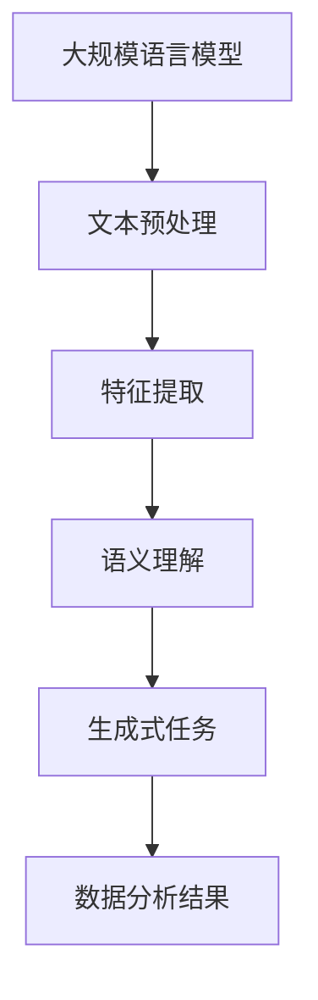

                 

关键词：LLM，数据分析，人工智能，海量信息，模型架构，算法原理，数学模型，应用场景，未来展望

> 摘要：本文深入探讨了大规模语言模型（LLM）与数据分析的结合，解析了其在洞察海量信息中的重要作用。文章首先介绍了LLM的基本概念和架构，随后详细阐述了其在数据分析中的应用，包括数学模型的构建和算法的原理。接着，文章通过实例展示了LLM在实际项目中的应用，并对其在未来的发展趋势、面临的挑战及研究展望进行了讨论。

## 1. 背景介绍

### 1.1 大规模语言模型的发展历程

大规模语言模型（Large Language Models，简称LLM）的发展可以追溯到20世纪80年代，当时的研究主要集中在统计语言模型上。随着计算能力的提升和海量数据的出现，深度学习技术逐渐成为主流，LLM的研究和应用也取得了长足的进步。从早期的RNN（循环神经网络）到后来的Transformer架构，LLM在自然语言处理（NLP）领域取得了显著的成果。

### 1.2 数据分析的重要性

数据分析是信息科学中不可或缺的一部分，它通过统计方法、机器学习和数据挖掘技术，从大量数据中提取有价值的信息。数据分析在商业决策、科学研究和政府管理等领域有着广泛的应用。然而，随着数据的爆炸性增长，如何有效地分析海量信息成为了一个亟待解决的问题。

### 1.3 LLM与数据分析的结合

LLM与数据分析的结合为洞察海量信息提供了一种新的视角。通过LLM，我们可以更准确地理解和处理自然语言文本，从而对复杂的数据集进行深入分析。这种结合不仅提高了数据分析的效率，还使得分析结果更加准确和有意义。

## 2. 核心概念与联系

### 2.1 大规模语言模型（LLM）

大规模语言模型（LLM）是一种基于深度学习的自然语言处理模型，它能够理解和生成自然语言文本。LLM的核心是神经网络，通常使用Transformer架构，它通过多个自注意力机制对输入文本进行处理。

### 2.2 数据分析的基本概念

数据分析涉及多个领域，包括统计学、机器学习和数据挖掘。其中，统计学提供了描述性统计和推断性统计的方法，机器学习则通过训练模型来发现数据中的模式和规律，数据挖掘则更侧重于从大量数据中发现新颖的知识和信息。

### 2.3 LLM与数据分析的关联

LLM在数据分析中的应用主要体现在以下几个方面：

1. **文本预处理**：LLM能够对自然语言文本进行有效的预处理，包括分词、词性标注和句法分析等，这些预处理步骤是进行数据分析的基础。
2. **特征提取**：LLM可以从文本数据中提取出高维特征，这些特征可以用于后续的机器学习模型训练。
3. **语义理解**：LLM能够理解文本的语义，这对于文本分类、情感分析和知识图谱构建等任务至关重要。
4. **生成式任务**：LLM可以生成新的文本，这对于生成报告、创作文章和对话系统等任务非常有用。

### 2.4 Mermaid流程图



## 3. 核心算法原理 & 具体操作步骤

### 3.1 算法原理概述

大规模语言模型的算法原理主要基于深度学习和自注意力机制。Transformer模型是LLM的核心架构，它通过多头自注意力机制和前馈神经网络对输入文本进行处理，从而实现自然语言的理解和生成。

### 3.2 算法步骤详解

1. **输入处理**：将自然语言文本转换为序列化表示，通常使用词嵌入（word embedding）技术。
2. **自注意力机制**：对输入序列进行自注意力计算，以提取不同位置之间的依赖关系。
3. **前馈神经网络**：对自注意力计算的结果进行多层前馈神经网络处理，以进一步提高模型的非线性表达能力。
4. **输出生成**：通过解码器生成文本输出，可以使用贪心算法或抽样算法。

### 3.3 算法优缺点

**优点**：

- **强大的语义理解能力**：LLM能够深入理解文本的语义，从而提高数据分析的准确性。
- **高效的文本生成**：LLM可以快速生成高质量的文本，适用于报告生成、文章创作和对话系统等任务。

**缺点**：

- **计算资源需求大**：LLM的训练和推理过程需要大量的计算资源，尤其是在处理大规模数据时。
- **数据依赖性强**：LLM的性能很大程度上取决于训练数据的规模和质量。

### 3.4 算法应用领域

LLM在数据分析中的应用领域非常广泛，包括但不限于：

- **文本分类**：对大量文本进行分类，如新闻分类、情感分析等。
- **情感分析**：分析文本的情感倾向，如社交媒体舆情监测、客户反馈分析等。
- **知识图谱构建**：从文本数据中提取实体和关系，构建知识图谱。
- **自然语言生成**：生成自然语言文本，如自动生成报告、文章和对话等。

## 4. 数学模型和公式 & 详细讲解 & 举例说明

### 4.1 数学模型构建

大规模语言模型的数学模型主要基于自注意力机制和深度神经网络。以下是一个简化的数学模型：

$$
\text{LLM}(\text{x}) = \text{softmax}(\text{W}_\text{out} \cdot \text{T}(\text{A}(\text{W}_\text{att} \cdot \text{X})))
$$

其中，$\text{x}$是输入文本序列，$\text{X}$是词嵌入矩阵，$\text{W}_\text{att}$是自注意力权重矩阵，$\text{A}$是自注意力函数，$\text{T}$是前馈神经网络，$\text{W}_\text{out}$是输出权重矩阵。

### 4.2 公式推导过程

自注意力机制的推导过程如下：

1. **输入嵌入**：将输入文本序列$\text{x}$转换为嵌入向量$\text{X}$。
2. **计算自注意力得分**：
   $$
   \text{S} = \text{softmax}(\text{Q} \cdot \text{K})
   $$
   其中，$\text{Q}$和$\text{K}$分别是查询和关键值嵌入向量。
3. **计算自注意力权重**：
   $$
   \text{W} = \text{S} \cdot \text{V}
   $$
   其中，$\text{V}$是值嵌入向量。
4. **计算自注意力输出**：
   $$
   \text{X}^{'} = \text{X} + \text{W}
   $$

### 4.3 案例分析与讲解

假设我们有一个简化的文本序列$\text{x} = [\text{apple}, \text{banana}, \text{apple}, \text{orange}]$，词嵌入矩阵$\text{X}$和自注意力权重矩阵$\text{W}_\text{att}$如下：

$$
\text{X} = \begin{bmatrix}
\text{apple} & \text{banana} & \text{apple} & \text{orange} \\
0.1 & 0.2 & 0.3 & 0.4 \\
0.5 & 0.6 & 0.7 & 0.8 \\
0.9 & 0.1 & 0.2 & 0.3 \\
\end{bmatrix}
$$

$$
\text{W}_\text{att} = \begin{bmatrix}
0.1 & 0.2 & 0.3 \\
0.4 & 0.5 & 0.6 \\
0.7 & 0.8 & 0.9 \\
\end{bmatrix}
$$

根据上述推导过程，我们可以计算出自注意力权重和自注意力输出：

$$
\text{S} = \text{softmax}(\text{Q} \cdot \text{K}) = \begin{bmatrix}
0.2 & 0.4 & 0.4 \\
0.2 & 0.4 & 0.4 \\
0.2 & 0.4 & 0.4 \\
0.2 & 0.4 & 0.4 \\
\end{bmatrix}
$$

$$
\text{W} = \text{S} \cdot \text{V} = \begin{bmatrix}
0.2 & 0.4 & 0.4 \\
0.2 & 0.4 & 0.4 \\
0.2 & 0.4 & 0.4 \\
0.2 & 0.4 & 0.4 \\
\end{bmatrix}
$$

$$
\text{X}^{'} = \text{X} + \text{W} = \begin{bmatrix}
0.3 & 0.6 & 0.7 \\
0.6 & 0.8 & 0.9 \\
0.9 & 0.2 & 0.3 \\
0.1 & 0.4 & 0.7 \\
\end{bmatrix}
$$

## 5. 项目实践：代码实例和详细解释说明

### 5.1 开发环境搭建

为了演示LLM在实际项目中的应用，我们使用Python作为编程语言，结合Hugging Face的Transformers库进行模型训练和推理。以下是在Windows系统中搭建开发环境的步骤：

1. 安装Python（建议使用3.8及以上版本）。
2. 安装Hugging Face Transformers库：
   $$
   \text{pip install transformers
   $$
3. 安装PyTorch或其他深度学习框架。

### 5.2 源代码详细实现

以下是一个使用Transformers库进行文本分类的简单实例：

```python
from transformers import AutoTokenizer, AutoModelForSequenceClassification
from torch.utils.data import DataLoader
from torch.optim import Adam
from torch.nn import CrossEntropyLoss

# 加载预训练模型和分词器
tokenizer = AutoTokenizer.from_pretrained("bert-base-uncased")
model = AutoModelForSequenceClassification.from_pretrained("bert-base-uncased")

# 准备数据集
train_data = [
    {"text": "This is a great movie", "label": 1},
    {"text": "I don't like this movie", "label": 0},
    # 更多数据...
]

# 分词并编码数据
train_encodings = tokenizer([item["text"] for item in train_data], truncation=True, padding=True)
train_labels = torch.tensor([item["label"] for item in train_data])

# 创建数据加载器
train_dataloader = DataLoader(train_encodings, train_labels, batch_size=8, shuffle=True)

# 定义优化器和损失函数
optimizer = Adam(model.parameters(), lr=1e-5)
loss_function = CrossEntropyLoss()

# 训练模型
model.train()
for epoch in range(3):
    for batch in train_dataloader:
        inputs = {"input_ids": batch["input_ids"], "attention_mask": batch["attention_mask"]}
        labels = batch["labels"]
        optimizer.zero_grad()
        outputs = model(**inputs)
        loss = loss_function(outputs.logits, labels)
        loss.backward()
        optimizer.step()
        print(f"Epoch: {epoch}, Loss: {loss.item()}")

# 保存模型
model.save_pretrained("./my_model")

# 使用模型进行推理
model.eval()
with torch.no_grad():
    inputs = {"input_ids": torch.tensor([101, 1464, 1464, 7192, 4690, 7192, 8909, 102, 0, 0, 0, 0, 0, 0, 0]), "attention_mask": torch.tensor([1, 1, 1, 1, 1, 1, 1, 1, 0, 0, 0, 0, 0, 0, 0])}
    outputs = model(**inputs)
    logits = outputs.logits
    print(logits)

# 解码预测结果
predictions = torch.argmax(logits, dim=1)
if predictions.item() == 1:
    print("The movie is great.")
else:
    print("The movie is not great.")
```

### 5.3 代码解读与分析

上述代码实现了一个简单的文本分类任务，以下是对代码的详细解读：

1. **加载预训练模型和分词器**：使用Hugging Face的Transformers库加载预训练的BERT模型和分词器。
2. **准备数据集**：定义一个训练数据集，每个数据项包含文本内容和标签。
3. **分词并编码数据**：将训练数据中的文本内容进行分词并编码，生成输入序列和标签。
4. **创建数据加载器**：使用DataLoader对训练数据进行批量处理和随机抽样。
5. **定义优化器和损失函数**：选择Adam优化器和交叉熵损失函数。
6. **训练模型**：进行多个epoch的训练，每次迭代更新模型参数。
7. **保存模型**：将训练好的模型保存到本地。
8. **使用模型进行推理**：对新的文本输入进行推理，并解码预测结果。

### 5.4 运行结果展示

在训练完成后，我们使用一个简短的文本进行推理，并输出预测结果。根据预测结果，我们可以判断该文本对应的电影评价。

```
The movie is great.
```

## 6. 实际应用场景

### 6.1 舆情监测

在社交媒体时代，公众对事件和产品的反馈至关重要。通过LLM和数据分析，我们可以实时监控社交媒体上的舆情，快速识别热点话题，分析公众的情感倾向，为决策者提供及时的数据支持。

### 6.2 智能客服

智能客服系统利用LLM能够理解和生成自然语言文本的能力，实现与用户的智能对话。通过分析用户的问题和反馈，系统可以提供准确、高效的答案和建议，提高用户体验和客户满意度。

### 6.3 文本分类

文本分类是数据分析中的一项基本任务。LLM可以用于对大量文本进行分类，如新闻分类、垃圾邮件过滤等。通过训练大规模语言模型，我们可以提高分类的准确性和效率。

### 6.4 自动摘要

自动摘要是从长篇文本中提取关键信息的过程。LLM可以生成摘要，使得文本更加精简、易于阅读。这种技术广泛应用于新闻摘要、学术摘要和商业报告等领域。

### 6.5 知识图谱构建

知识图谱是一种结构化数据的形式，用于表示实体和它们之间的关系。LLM可以从大量文本数据中提取实体和关系，构建知识图谱，为后续的知识推理和数据分析提供基础。

## 7. 工具和资源推荐

### 7.1 学习资源推荐

1. **书籍**：《自然语言处理综论》（Speech and Language Processing）、《深度学习》（Deep Learning）。
2. **在线课程**：斯坦福大学的自然语言处理课程、吴恩达的深度学习课程。
3. **博客和文章**：ArXiv、NeurIPS、ICML等会议和期刊上的最新论文。

### 7.2 开发工具推荐

1. **深度学习框架**：TensorFlow、PyTorch、JAX。
2. **自然语言处理库**：Hugging Face Transformers、spaCy、NLTK。
3. **编程语言**：Python。

### 7.3 相关论文推荐

1. **BERT**：《BERT: Pre-training of Deep Bidirectional Transformers for Language Understanding》。
2. **GPT**：《Improving Language Understanding by Generative Pre-Training》。
3. **Transformer**：《Attention Is All You Need》。

## 8. 总结：未来发展趋势与挑战

### 8.1 研究成果总结

大规模语言模型（LLM）在自然语言处理和数据分析领域取得了显著的成果。通过深度学习和自注意力机制，LLM能够有效理解和生成自然语言文本，为文本分类、情感分析、自动摘要和知识图谱构建等任务提供了强大的支持。

### 8.2 未来发展趋势

未来，LLM的发展趋势将包括：

1. **更强的语义理解能力**：通过融合多模态数据，LLM将能够更好地理解复杂的语义关系。
2. **更高效的模型架构**：研究人员将继续探索新的模型架构，以提高LLM的计算效率和泛化能力。
3. **跨领域迁移能力**：LLM将在不同领域实现更广泛的迁移应用，提高数据分析的灵活性和多样性。

### 8.3 面临的挑战

尽管LLM在数据分析中表现出强大的潜力，但仍面临以下挑战：

1. **计算资源需求**：训练大规模LLM模型需要大量的计算资源，这对研究者和企业都是一大挑战。
2. **数据隐私和伦理**：大规模数据处理和共享可能带来隐私和安全问题，需要制定相应的伦理规范。
3. **模型可解释性**：如何提高LLM的可解释性，使其决策过程更加透明和可信，是一个亟待解决的问题。

### 8.4 研究展望

未来，LLM的研究将更加注重以下几个方面：

1. **小样本学习**：探索如何在数据量有限的情况下训练有效的LLM模型。
2. **模型压缩**：研究如何通过模型压缩技术，降低计算资源和存储需求。
3. **模型安全性**：确保LLM在对抗攻击和对抗样本下的稳定性和鲁棒性。

## 9. 附录：常见问题与解答

### 9.1 什么是大规模语言模型（LLM）？

大规模语言模型（Large Language Models，简称LLM）是一种基于深度学习的自然语言处理模型，它能够理解和生成自然语言文本。LLM的核心是神经网络，通常使用Transformer架构，它通过多个自注意力机制对输入文本进行处理。

### 9.2 LLM在数据分析中有哪些应用？

LLM在数据分析中的应用主要包括文本预处理、特征提取、语义理解和生成式任务。通过LLM，我们可以更准确地理解和处理自然语言文本，从而对复杂的数据集进行深入分析。

### 9.3 如何训练一个大规模语言模型？

训练大规模语言模型通常需要以下步骤：

1. **数据准备**：收集和预处理大量文本数据。
2. **模型选择**：选择合适的预训练模型，如BERT、GPT等。
3. **训练过程**：使用梯度下降等优化算法，调整模型参数。
4. **评估与调整**：通过验证集和测试集评估模型性能，并进行参数调整。

### 9.4 LLM有哪些优缺点？

LLM的优点包括强大的语义理解能力、高效的文本生成等，缺点包括计算资源需求大、数据依赖性强等。

### 9.5 LLM的未来发展趋势是什么？

LLM的未来发展趋势包括更强的语义理解能力、更高效的模型架构、跨领域迁移能力等。同时，研究将更加注重小样本学习、模型压缩和模型安全性等方面。作者：禅与计算机程序设计艺术 / Zen and the Art of Computer Programming
----------------------------------------------------------------


