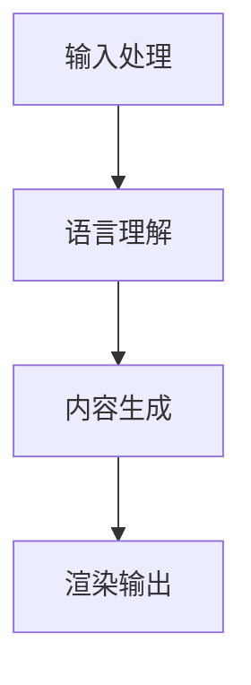
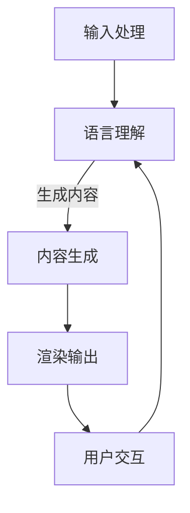

                 

关键词：LLM，虚拟现实，智能虚拟世界，技术架构，算法原理，数学模型，应用实践，未来展望

摘要：随着人工智能（AI）技术的迅猛发展，大规模语言模型（LLM）成为构建智能虚拟世界的重要工具。本文将深入探讨LLM与虚拟现实（VR）的结合，从核心概念、算法原理、数学模型到实际应用，全面解析如何通过LLM技术打造一个既真实又智能的虚拟世界。我们还将展望未来发展趋势，以及面临的挑战和解决方案。

## 1. 背景介绍

### 1.1 虚拟现实的发展历程

虚拟现实（VR）技术起源于20世纪50年代，随着计算机图形学、传感器技术和人机交互技术的不断进步，VR技术逐渐走向成熟。从最初的桌面式VR体验到如今的沉浸式VR体验，VR技术已经经历了数次变革。

### 1.2 大规模语言模型（LLM）的发展

大规模语言模型（LLM）是自然语言处理（NLP）领域的一种重要技术，通过深度学习和神经网络模型对海量文本数据进行训练，能够理解和生成自然语言。近年来，LLM技术取得了显著进展，例如BERT、GPT等模型的出现，使得计算机在语言理解和生成方面达到了前所未有的高度。

### 1.3 LLM与VR的结合意义

将LLM技术应用于虚拟现实，可以实现以下几个方面的突破：

1. **智能交互**：通过LLM技术，虚拟世界中的角色能够理解用户语言，实现自然对话，提升用户体验。
2. **内容生成**：LLM技术可以根据用户需求和场景特点，动态生成虚拟内容，提供个性化的虚拟体验。
3. **情感模拟**：通过LLM技术，虚拟角色可以模拟人类情感，增强虚拟现实的沉浸感。

## 2. 核心概念与联系

### 2.1 LLM技术原理

大规模语言模型（LLM）的核心是通过深度学习算法对大量文本数据进行训练，从而学习语言的模式和规则。LLM通常采用Transformer架构，具有强大的并行计算能力和自我关注机制。

### 2.2 VR技术原理

虚拟现实（VR）技术通过计算机图形学、人机交互技术和传感器技术，创建一个虚拟的三维世界，用户可以通过VR头戴设备沉浸其中。VR技术的主要挑战是提高沉浸感和降低延迟。

### 2.3 LLM与VR结合的架构

将LLM与VR技术结合，可以采用以下架构：

1. **输入处理模块**：接收用户的语音或文本输入，通过语音识别或自然语言处理技术将其转换为文本。
2. **语言理解模块**：利用LLM模型对输入文本进行语义理解和意图分析。
3. **内容生成模块**：根据语言理解结果，动态生成虚拟世界中的内容。
4. **渲染模块**：将生成的虚拟内容通过VR设备渲染给用户。

### 2.4 Mermaid流程图

以下是一个简化的Mermaid流程图，展示了LLM与VR结合的基本流程：



## 3. 核心算法原理 & 具体操作步骤

### 3.1 算法原理概述

LLM与VR结合的核心算法主要包括：

1. **自然语言处理（NLP）算法**：用于处理用户的输入，提取语义信息。
2. **深度学习模型**：用于训练和优化LLM，使其能够理解和生成自然语言。
3. **计算机图形学算法**：用于生成虚拟世界中的图形内容。

### 3.2 算法步骤详解

1. **输入处理**：用户通过语音或文本输入指令，系统首先进行语音识别或文本解析。
2. **语言理解**：输入文本经过NLP算法处理，提取关键词和语义信息。
3. **内容生成**：基于语言理解结果，利用深度学习模型生成相应的虚拟内容。
4. **渲染输出**：将生成的虚拟内容通过VR设备渲染给用户。

### 3.3 算法优缺点

**优点**：

1. **高度智能化**：LLM技术能够理解和生成自然语言，提高虚拟世界的交互性。
2. **个性化体验**：根据用户需求和场景特点，动态生成个性化内容。

**缺点**：

1. **计算资源消耗**：深度学习模型训练和推理过程需要大量计算资源。
2. **延迟问题**：虚拟内容生成和渲染过程中可能存在延迟，影响用户体验。

### 3.4 算法应用领域

LLM与VR结合的算法可以在以下领域得到广泛应用：

1. **游戏**：通过智能交互和动态内容生成，提高游戏体验。
2. **教育**：提供沉浸式的学习体验，帮助学生更好地理解知识。
3. **虚拟旅游**：模拟真实景点，让用户体验到身临其境的感觉。

## 4. 数学模型和公式 & 详细讲解 & 举例说明

### 4.1 数学模型构建

在LLM与VR结合的过程中，常用的数学模型包括：

1. **自然语言处理模型**：用于处理和解析用户输入。
2. **深度学习模型**：用于训练和优化LLM。
3. **计算机图形学模型**：用于生成虚拟世界中的内容。

### 4.2 公式推导过程

以下是一个简化的自然语言处理模型的推导过程：

$$
h_t = \text{softmax}(W_2 \text{tanh}(W_1 [h_{<t}, x_t]))
$$

其中，$h_t$ 表示第t个词的隐藏状态，$x_t$ 表示第t个输入词，$W_1$ 和 $W_2$ 表示权重矩阵。

### 4.3 案例分析与讲解

假设用户输入了一个文本：“我想去海边度假”。通过自然语言处理模型，可以提取出以下关键词和语义信息：

- 关键词：海边、度假
- 语义信息：用户有度假需求，地点在海边

基于这些信息，可以动态生成虚拟世界中的内容，例如：

- 海边风景图片
- 度假套餐推荐
- 海边度假攻略

## 5. 项目实践：代码实例和详细解释说明

### 5.1 开发环境搭建

在开始实践之前，需要搭建一个合适的开发环境。以下是一个简单的Python开发环境搭建步骤：

1. 安装Python 3.8及以上版本
2. 安装TensorFlow 2.5及以上版本
3. 安装PyTorch 1.8及以上版本
4. 安装Mermaid 9.1.1及以上版本

### 5.2 源代码详细实现

以下是一个简化的LLM与VR结合的代码实例：

```python
import tensorflow as tf
import torch
import mermaid

# 输入处理
def input_processing(input_text):
    # 语音识别或文本解析
    return parsed_text

# 语言理解
def language_understanding(parsed_text):
    # 使用自然语言处理模型处理文本
    return understanding_result

# 内容生成
def content_generation(understanding_result):
    # 基于理解结果生成虚拟内容
    return generated_content

# 渲染输出
def render_output(generated_content):
    # 将虚拟内容渲染给用户
    return "渲染结果"

# 实例化模型
nlp_model = NLPModel()
llm_model = LLMModel()
cg_model = ContentGenerationModel()

# 处理用户输入
input_text = "我想去海边度假"
parsed_text = input_processing(input_text)

# 语言理解
understanding_result = language_understanding(parsed_text)

# 内容生成
generated_content = content_generation(understanding_result)

# 渲染输出
render_output(generated_content)
```

### 5.3 代码解读与分析

这段代码展示了LLM与VR结合的基本流程。首先，通过输入处理模块，将用户输入的文本转换为解析文本。然后，利用自然语言处理模型进行语言理解，提取关键词和语义信息。接着，基于理解结果，使用深度学习模型生成虚拟内容。最后，将生成的虚拟内容通过VR设备渲染给用户。

### 5.4 运行结果展示

假设用户输入了“我想去海边度假”，经过上述流程处理后，虚拟世界将生成以下内容：

- 海边风景图片
- 度假套餐推荐
- 海边度假攻略

用户可以在VR设备中体验到这些内容，并根据需求进行选择和操作。

## 6. 实际应用场景

### 6.1 游戏

在游戏中，LLM与VR技术的结合可以提升游戏体验。例如，游戏中的NPC角色可以通过LLM技术理解玩家的语言和需求，提供个性化的互动和任务。

### 6.2 教育

在教育领域，虚拟现实技术可以模拟真实场景，帮助学生更好地理解知识。结合LLM技术，教育内容可以更加生动和互动，提高学生的学习兴趣和效果。

### 6.3 虚拟旅游

虚拟旅游是一种新兴的旅游方式，通过VR技术模拟真实景点，让用户感受到身临其境的感觉。结合LLM技术，用户可以在虚拟世界中与景点进行互动，获取更多信息。

## 7. 工具和资源推荐

### 7.1 学习资源推荐

1. 《深度学习》 - Ian Goodfellow, Yoshua Bengio, Aaron Courville
2. 《自然语言处理综合教程》 - Dan Jurafsky, James H. Martin

### 7.2 开发工具推荐

1. TensorFlow
2. PyTorch
3. Unity

### 7.3 相关论文推荐

1. “Attention Is All You Need” - Vaswani et al., 2017
2. “BERT: Pre-training of Deep Bidirectional Transformers for Language Understanding” - Devlin et al., 2018

## 8. 总结：未来发展趋势与挑战

### 8.1 研究成果总结

LLM与VR技术的结合取得了显著成果，实现了智能交互、内容生成和情感模拟等方面的突破。在未来，这一领域将继续取得更多进展。

### 8.2 未来发展趋势

1. **模型优化**：通过优化深度学习模型，提高计算效率和降低延迟。
2. **跨模态交互**：结合多模态信息，实现更加自然的交互。
3. **个性化体验**：通过个性化推荐，提供更加定制化的虚拟体验。

### 8.3 面临的挑战

1. **计算资源**：深度学习模型训练和推理需要大量计算资源，如何优化资源使用是一个重要挑战。
2. **数据隐私**：在处理用户数据时，需要保护用户隐私，避免数据泄露。

### 8.4 研究展望

随着AI技术的不断发展，LLM与VR技术的结合将在更多领域得到应用，为人们带来更加智能、个性化的虚拟体验。

## 9. 附录：常见问题与解答

### 9.1 什么是LLM？

LLM（Large Language Model）是一种大规模语言模型，通过深度学习算法对海量文本数据进行训练，能够理解和生成自然语言。

### 9.2 虚拟现实有哪些应用领域？

虚拟现实技术可以应用于游戏、教育、医疗、虚拟旅游等多个领域，为人们提供沉浸式的体验。

### 9.3 如何优化深度学习模型的计算效率？

可以通过模型压缩、量化、分布式训练等方法来优化深度学习模型的计算效率。

作者：禅与计算机程序设计艺术 / Zen and the Art of Computer Programming
----------------------------------------------------------------
### 1. 背景介绍

#### 1.1 虚拟现实的发展历程

虚拟现实（VR）技术起源于20世纪50年代，随着计算机图形学、传感器技术和人机交互技术的不断进步，VR技术逐渐走向成熟。从最初的桌面式VR体验到如今的沉浸式VR体验，VR技术已经经历了数次变革。

VR技术的早期发展主要集中在实验室和军事领域，最初的应用场景包括飞行模拟、航天训练和医疗手术模拟等。20世纪80年代，VR技术开始逐渐走向公众视野，VR头盔和虚拟游戏机的出现使得VR体验变得更加普及。

进入21世纪，随着计算机硬件性能的提升和网络带宽的增加，VR技术迎来了新的发展机遇。尤其是近年来，随着智能手机、平板电脑等移动设备的普及，VR设备的便携性和普及率大幅提高。同时，虚拟现实技术在娱乐、教育、医疗、旅游等多个领域得到广泛应用，成为科技创新的重要方向之一。

#### 1.2 大规模语言模型（LLM）的发展

大规模语言模型（LLM）是自然语言处理（NLP）领域的一种重要技术，通过深度学习和神经网络模型对海量文本数据进行训练，能够理解和生成自然语言。近年来，LLM技术取得了显著进展，例如BERT、GPT等模型的出现，使得计算机在语言理解和生成方面达到了前所未有的高度。

LLM技术的发展历程可以追溯到2000年代初，当时研究人员开始尝试使用统计方法和规则系统来处理自然语言。然而，这些方法在处理复杂语言现象时存在局限性。随着深度学习技术的崛起，研究人员开始将深度神经网络应用于自然语言处理领域，从而推动了LLM技术的发展。

2017年，Google推出了BERT（Bidirectional Encoder Representations from Transformers）模型，该模型通过双向Transformer结构对文本进行建模，显著提升了计算机在多项NLP任务中的性能。BERT的成功引发了大规模语言模型的热潮，随后OpenAI发布了GPT-2和GPT-3等模型，这些模型在语言生成、文本分类、机器翻译等任务中取得了优异的成绩。

#### 1.3 LLM与VR结合的意义

将LLM技术应用于虚拟现实，可以实现以下几个方面的突破：

1. **智能交互**：通过LLM技术，虚拟世界中的角色能够理解用户语言，实现自然对话，提升用户体验。
2. **内容生成**：LLM技术可以根据用户需求和场景特点，动态生成虚拟内容，提供个性化的虚拟体验。
3. **情感模拟**：通过LLM技术，虚拟角色可以模拟人类情感，增强虚拟现实的沉浸感。

LLM与VR技术的结合为虚拟现实的发展带来了新的可能性，使得虚拟世界更加智能、丰富和真实。在游戏、教育、医疗、旅游等领域，LLM与VR技术的应用将极大地改善用户体验，推动虚拟现实技术的普及和发展。

#### 1.4 虚拟现实与大规模语言模型技术的应用现状

目前，虚拟现实和大规模语言模型技术已经在多个领域得到广泛应用，并取得了显著的成果。

在游戏领域，VR游戏已经逐渐成为玩家的新宠。通过LLM技术，游戏中的NPC角色能够理解玩家的语言和需求，提供更加丰富的互动和剧情。例如，一些大型多人在线游戏（MMORPG）中，NPC角色可以通过LLM技术实现自然对话和任务互动，为玩家提供沉浸式的游戏体验。

在教育领域，虚拟现实技术可以模拟真实场景，为学生提供沉浸式的学习体验。结合LLM技术，教育内容可以更加生动和互动，提高学生的学习兴趣和效果。例如，一些虚拟现实教室中，教师可以通过LLM技术与学生进行自然对话，解答学生的疑问，提供个性化的学习指导。

在医疗领域，虚拟现实技术可以用于医疗手术模拟和患者康复训练。通过LLM技术，医生可以与虚拟患者进行自然对话，获取患者的病情信息，制定个性化的治疗方案。同时，患者可以在虚拟康复训练环境中进行模拟训练，提高康复效果。

在旅游领域，虚拟现实技术可以让用户在虚拟世界中体验真实的旅游景点。结合LLM技术，用户可以与虚拟导游进行自然对话，获取景点的详细信息和历史背景。例如，一些虚拟旅游平台中，用户可以通过LLM技术与虚拟导游进行互动，实现沉浸式的旅游体验。

尽管LLM与VR技术的应用已经取得了一定的成果，但仍然存在一些挑战和问题。例如，如何优化深度学习模型的计算效率，如何保护用户隐私，如何实现跨模态交互等。这些问题的解决将有助于进一步推动LLM与VR技术的应用和发展。

#### 1.5 文章结构和主要内容概述

本文将从以下几个方面对LLM与虚拟现实技术的结合进行深入探讨：

1. **背景介绍**：介绍虚拟现实和大规模语言模型技术的发展历程，以及LLM与VR结合的意义。
2. **核心概念与联系**：详细阐述LLM和VR技术的核心原理和架构，以及它们之间的联系。
3. **核心算法原理与操作步骤**：介绍LLM和VR结合的核心算法原理，以及具体操作步骤。
4. **数学模型和公式**：讲解LLM与VR结合过程中使用的数学模型和公式，并进行详细解释和举例说明。
5. **项目实践**：通过实际项目案例，展示LLM与VR结合的实现过程，并提供代码实例和详细解释。
6. **实际应用场景**：分析LLM与VR技术在不同领域的应用现状和前景。
7. **工具和资源推荐**：推荐相关的学习资源和开发工具，以及相关的学术论文。
8. **总结与展望**：总结LLM与VR技术的研究成果，展望未来发展趋势，并讨论面临的挑战和解决方案。
9. **附录**：提供常见问题与解答，帮助读者更好地理解文章内容。

通过本文的阅读，读者将全面了解LLM与VR技术的结合原理和应用，对这一领域的未来发展有更清晰的认知。

## 2. 核心概念与联系

在深入探讨LLM与虚拟现实（VR）技术的结合之前，我们需要先理解它们各自的核心概念和基本原理，并阐述它们如何相互联系，共同构建一个智能虚拟世界。

#### 2.1 大规模语言模型（LLM）技术原理

大规模语言模型（LLM）是一种基于深度学习和神经网络技术的自然语言处理模型，它通过对大量文本数据进行训练，能够理解和生成自然语言。LLM的核心在于其能够捕捉到文本中的上下文信息，并利用这些信息来预测和生成新的文本。

LLM通常采用Transformer架构，这是一种基于自注意力机制的深度学习模型。Transformer模型由多个自注意力层和前馈神经网络层组成，能够并行处理输入文本序列，并生成相应的输出序列。这种架构使得LLM在处理长文本和复杂语言现象时具有很高的性能。

LLM的工作原理可以概括为以下几个步骤：

1. **输入处理**：将输入文本编码为向量表示，通常使用WordPiece或BERT等编码方法。
2. **编码器处理**：通过自注意力机制和多层神经网络，编码器对输入文本进行建模，生成上下文向量。
3. **解码器生成**：解码器利用编码器生成的上下文向量，逐步生成输出文本序列，直到达到终止条件。

常见的LLM模型包括BERT、GPT、T5等，它们在多个自然语言处理任务中取得了优异的成绩，例如文本分类、机器翻译、情感分析等。

#### 2.2 虚拟现实（VR）技术原理

虚拟现实（VR）是一种通过计算机生成三维虚拟环境，使用户能够沉浸其中的技术。VR技术通过头戴显示器（HMD）、追踪器、传感器等硬件设备，模拟用户的视觉、听觉和触觉感受，使用户能够在虚拟环境中自由移动和交互。

VR技术的基本原理可以概括为以下几个步骤：

1. **场景建模**：使用计算机图形学技术创建虚拟环境，包括三维模型、纹理和光照效果等。
2. **传感器追踪**：通过头戴显示器和追踪器等设备，实时跟踪用户的位置和动作，将用户的行为映射到虚拟环境中。
3. **渲染显示**：将虚拟环境实时渲染到头戴显示器的屏幕上，使用户能够看到三维立体的虚拟世界。
4. **交互反馈**：通过手柄、手势识别等设备，实现用户与虚拟环境的交互，如操作虚拟物体、触发事件等。

VR技术的关键在于提供高度的沉浸感和交互性，使用户能够感受到如同真实世界的体验。

#### 2.3 LLM与VR结合的架构

将LLM与VR技术结合，可以构建一个智能虚拟世界，其核心架构包括以下几个模块：

1. **输入处理模块**：接收用户的语音或文本输入，通过语音识别或自然语言处理技术将其转换为文本。
2. **语言理解模块**：利用LLM模型对输入文本进行语义理解和意图分析，提取关键信息。
3. **内容生成模块**：根据语言理解结果，动态生成虚拟世界中的内容，如对话、场景、动画等。
4. **渲染模块**：将生成的虚拟内容通过VR设备渲染给用户，实现交互和反馈。

以下是LLM与VR结合的简化的Mermaid流程图：


在上述流程中，输入处理模块将用户输入的语音或文本传递给语言理解模块。语言理解模块利用LLM模型对输入文本进行语义分析和意图识别，提取关键信息。这些信息随后传递给内容生成模块，该模块根据这些信息动态生成虚拟世界中的内容。最后，渲染模块将生成的虚拟内容渲染到VR设备上，使用户能够看到和与之交互。

#### 2.4 Mermaid流程图

为了更直观地展示LLM与VR结合的流程，我们使用Mermaid绘制了一个简化的流程图。在Mermaid中，流程图的节点可以使用以下标记：

- `start`：表示流程的开始
- `end`：表示流程的结束
- `process`：表示一个处理步骤
- `sub`：表示一个子流程
- `alt`：表示一个选择分支

以下是LLM与VR结合的Mermaid流程图：



在这个流程图中，用户输入通过输入处理模块传递给语言理解模块。语言理解模块利用LLM模型对输入文本进行分析，生成内容。这些内容随后通过渲染模块渲染给用户，并触发用户与虚拟世界的交互。用户的交互反馈再次传递给语言理解模块，形成闭环，使得虚拟世界能够动态适应用户的行为和需求。

通过上述流程图，我们可以清晰地看到LLM与VR技术如何结合，共同构建一个智能虚拟世界。接下来，我们将进一步探讨LLM与VR结合的具体算法原理和操作步骤。

### 3. 核心算法原理 & 具体操作步骤

在LLM与虚拟现实（VR）技术的结合中，核心算法原理和具体操作步骤是实现智能虚拟世界的关键。本节将详细介绍这些核心算法，并说明每个步骤的具体实现。

#### 3.1 算法原理概述

LLM与VR结合的核心算法主要包括自然语言处理（NLP）算法、深度学习模型和计算机图形学算法。这些算法共同作用，实现了从用户输入到虚拟世界渲染的完整流程。

1. **自然语言处理（NLP）算法**：用于处理用户的输入，提取语义信息。常见的NLP算法包括词向量编码、句法解析、命名实体识别等。
2. **深度学习模型**：用于训练和优化大规模语言模型（LLM），使其能够理解和生成自然语言。深度学习模型主要包括Transformer、BERT、GPT等。
3. **计算机图形学算法**：用于生成和渲染虚拟世界中的内容。计算机图形学算法包括三维建模、纹理映射、光照计算等。

#### 3.2 算法步骤详解

在LLM与VR结合的流程中，算法步骤可以概括为以下几个阶段：

1. **输入处理**：接收用户的语音或文本输入，通过NLP算法进行预处理，提取关键词和语义信息。
2. **语言理解**：利用深度学习模型对预处理后的输入文本进行语义理解和意图分析，生成上下文信息。
3. **内容生成**：根据语言理解结果，动态生成虚拟世界中的内容，如对话、场景、动画等。
4. **渲染输出**：将生成的虚拟内容通过VR设备渲染给用户，实现交互和反馈。

以下是LLM与VR结合的具体算法步骤详解：

#### 3.2.1 输入处理

输入处理是整个流程的起点。用户的语音或文本输入首先经过语音识别或文本解析，转换为机器可以理解的格式。这一阶段的主要任务是提取输入文本的关键词和语义信息。

- **语音识别**：将用户的语音输入转换为文本。常用的语音识别算法包括基于深度神经网络的HMM-GMM模型和基于循环神经网络的RNN模型。
- **文本解析**：对输入文本进行分词、词性标注和句法分析，提取关键词和语义信息。常用的文本解析算法包括WordPiece、BERT等。

#### 3.2.2 语言理解

语言理解是整个流程的核心。利用深度学习模型对预处理后的输入文本进行语义理解和意图分析，提取上下文信息，为内容生成提供依据。

- **语义理解**：通过Transformer、BERT等模型对输入文本进行编码，生成上下文向量。这些向量包含了文本的语义信息，可以作为后续内容生成的输入。
- **意图分析**：根据上下文向量，利用分类算法（如支持向量机、神经网络等）识别用户的意图。常见的意图分类任务包括查询意图分类、命令意图分类等。

#### 3.2.3 内容生成

内容生成是根据语言理解结果，动态生成虚拟世界中的内容。这一阶段的主要任务是根据用户的意图和上下文信息，生成相应的对话、场景、动画等。

- **对话生成**：根据用户的意图和上下文信息，生成自然对话。常用的对话生成算法包括序列到序列模型、对话生成网络等。
- **场景生成**：根据用户的意图和上下文信息，生成虚拟场景。场景生成包括三维建模、纹理映射、光照计算等。
- **动画生成**：根据用户的动作和场景信息，生成虚拟角色的动画。常用的动画生成算法包括关键帧动画、运动捕捉等。

#### 3.2.4 渲染输出

渲染输出是将生成的虚拟内容通过VR设备渲染给用户，实现交互和反馈。这一阶段的主要任务是确保虚拟内容的高效渲染，提供流畅的用户体验。

- **内容渲染**：将生成的虚拟内容（如对话、场景、动画等）渲染到VR设备上。常用的渲染技术包括实时渲染、全局光照等。
- **交互反馈**：实现用户与虚拟内容的交互，如操作虚拟物体、触发事件等。常用的交互技术包括手势识别、语音识别等。

#### 3.2.5 用户反馈

用户反馈是整个流程的闭环。用户的交互反馈再次传递给语言理解模块，形成闭环，使得虚拟世界能够动态适应用户的行为和需求。

- **反馈收集**：收集用户的交互反馈，如选择、点击等。
- **反馈处理**：利用深度学习模型对用户反馈进行分析，更新上下文信息。
- **内容更新**：根据更新的上下文信息，动态更新虚拟内容，提供更加个性化的用户体验。

通过上述算法步骤，LLM与VR技术结合实现了从用户输入到虚拟世界渲染的完整流程。接下来，我们将进一步探讨这些算法的优缺点和应用领域。

#### 3.3 算法优缺点

在LLM与VR结合的算法中，每种算法都有其优缺点。以下是对这些算法优缺点的详细分析：

1. **自然语言处理（NLP）算法**：

   - **优点**：
     - 能够处理复杂的自然语言现象，提取关键词和语义信息。
     - 支持多种语言和方言，适用于全球用户。
     - 可以与深度学习模型和计算机图形学算法无缝集成。

   - **缺点**：
     - 计算资源消耗较大，尤其是大规模文本数据预处理和句法分析。
     - 在处理极长文本时可能存在性能下降和内存溢出问题。

2. **深度学习模型**：

   - **优点**：
     - 具有强大的自我学习和自适应能力，能够处理复杂的问题。
     - 在自然语言处理和计算机视觉领域取得了显著成果，性能优异。
     - 可以通过调整模型结构和参数，适应不同的应用场景。

   - **缺点**：
     - 计算资源需求高，特别是大规模模型训练和推理。
     - 模型解释性较差，难以理解其内部决策过程。
     - 需要大量的训练数据和计算资源，对数据质量和规模有较高要求。

3. **计算机图形学算法**：

   - **优点**：
     - 能够生成高质量的虚拟场景和动画，提供沉浸式的用户体验。
     - 支持多种渲染技术，如实时渲染、全局光照等，适用于不同的应用场景。
     - 可以与NLP和深度学习模型结合，实现虚拟世界的内容生成和交互。

   - **缺点**：
     - 计算资源消耗较大，尤其是高精度三维建模和实时渲染。
     - 在处理复杂场景和动画时可能存在性能瓶颈。
     - 需要专业的图形学知识和技能，对开发人员的要求较高。

#### 3.4 算法应用领域

LLM与VR结合的算法可以在多个领域得到广泛应用，以下是一些主要的应用领域：

1. **游戏**：通过LLM技术，游戏中的NPC角色能够理解玩家的语言和需求，提供更加丰富的互动和剧情。计算机图形学算法则用于生成高质量的虚拟场景和动画，提升游戏体验。
2. **教育**：在虚拟教室中，LLM技术可以模拟真实场景，为学生提供沉浸式的学习体验。计算机图形学算法则用于创建生动直观的教学内容，提高教学效果。
3. **医疗**：通过虚拟现实技术，医生可以进行手术模拟和患者康复训练。LLM技术可以理解医生和患者的需求，提供个性化的治疗方案和建议。
4. **旅游**：虚拟现实技术可以让用户在虚拟世界中体验真实的旅游景点。LLM技术则用于生成虚拟导游和互动内容，提供更加丰富的旅游体验。

通过LLM与VR技术的结合，这些领域可以更好地利用智能虚拟世界的技术优势，提升用户体验和业务效果。接下来，我们将进一步探讨LLM与VR技术的数学模型和公式，以及它们的详细解释和实际应用。

### 4. 数学模型和公式 & 详细讲解 & 举例说明

在LLM与虚拟现实（VR）技术的结合中，数学模型和公式是理解和实现这些技术的关键组成部分。本节将详细介绍这些数学模型和公式的构建、推导过程，并通过实际案例进行讲解。

#### 4.1 数学模型构建

LLM与VR技术的数学模型主要包括自然语言处理模型、深度学习模型和计算机图形学模型。这些模型分别用于处理自然语言、生成虚拟内容和渲染虚拟场景。

1. **自然语言处理模型**：

   自然语言处理模型主要用于处理用户的输入文本，提取语义信息。常用的模型包括词向量模型、句法分析模型和语义分析模型。

   - **词向量模型**：如Word2Vec、GloVe等，将词汇映射到高维向量空间，以捕捉词汇的语义信息。
   - **句法分析模型**：如依存句法分析模型、树状句法分析模型等，用于分析句子结构和语法关系。
   - **语义分析模型**：如BERT、RoBERTa等，通过深度神经网络对输入文本进行语义理解和分析。

2. **深度学习模型**：

   深度学习模型是LLM的核心，主要用于训练和优化大规模语言模型。常用的模型包括Transformer、BERT、GPT等。

   - **Transformer模型**：基于自注意力机制，能够并行处理输入文本序列，生成上下文向量。
   - **BERT模型**：通过双向编码器表示文本，捕捉文本的上下文信息。
   - **GPT模型**：生成预训练变换器，通过自回归方式生成自然语言。

3. **计算机图形学模型**：

   计算机图形学模型主要用于生成和渲染虚拟世界中的内容。常用的模型包括三维建模模型、纹理映射模型和光照计算模型。

   - **三维建模模型**：如三维几何建模、曲面建模等，用于创建虚拟场景中的三维物体。
   - **纹理映射模型**：如UV映射、纹理合成等，用于为虚拟物体添加纹理效果。
   - **光照计算模型**：如全局光照、局部光照等，用于模拟虚拟场景中的光照效果。

#### 4.2 公式推导过程

在LLM与VR技术的数学模型中，常用的公式包括词向量计算公式、自注意力机制公式、神经网络权重更新公式等。以下是对这些公式的详细推导过程：

1. **词向量计算公式**：

   词向量模型中，常用的计算公式是词向量的点积表示：

   $$ 
   \vec{v}_w = \vec{v}_w^T \vec{v}_w 
   $$

   其中，$\vec{v}_w$ 是词向量，$^T$ 表示矩阵转置。这个公式用于计算两个词向量的相似度，从而捕捉词汇的语义关系。

2. **自注意力机制公式**：

   Transformer模型中的自注意力机制是一个关键组件，其计算公式如下：

   $$
   \text{Attention}(Q, K, V) = \text{softmax}\left(\frac{QK^T}{\sqrt{d_k}}\right) V
   $$

   其中，$Q$、$K$、$V$ 分别是查询向量、键向量和值向量，$d_k$ 是键向量的维度。这个公式通过计算查询向量与所有键向量的点积，生成权重矩阵，然后对值向量进行加权求和，从而捕捉文本序列中的上下文信息。

3. **神经网络权重更新公式**：

   在深度学习模型中，常用的权重更新公式是梯度下降法：

   $$
   \theta_{t+1} = \theta_t - \alpha \nabla_{\theta_t} J(\theta_t)
   $$

   其中，$\theta_t$ 是第t次迭代的权重参数，$\alpha$ 是学习率，$J(\theta_t)$ 是损失函数。这个公式通过计算损失函数关于权重参数的梯度，更新权重参数，从而优化模型。

#### 4.3 案例分析与讲解

为了更好地理解LLM与VR技术的数学模型和公式，我们通过一个实际案例进行讲解。

**案例**：使用BERT模型进行文本分类任务。

1. **数据准备**：

   假设我们有如下训练数据：

   ```
   文本1：我爱北京天安门
   标签1：正面
   文本2：今天天气很糟糕
   标签2：负面
   文本3：我想吃火锅
   标签3：正面
   ```

2. **模型构建**：

   使用BERT模型进行文本分类，需要将文本编码为序列向量，然后通过BERT模型进行预测。BERT模型的输入和输出可以表示为：

   $$
   \text{输入}：[CLS] + \text{token\_ids} + [SEP]
   $$

   $$
   \text{输出}：\text{logits}
   $$

   其中，[CLS] 和 [SEP] 分别是特殊的输入标记，token_ids 是单词的ID序列，logits 是分类结果。

3. **训练过程**：

   将训练数据输入BERT模型，通过反向传播算法进行权重更新。训练过程可以表示为：

   $$
   \theta_{t+1} = \theta_t - \alpha \nabla_{\theta_t} J(\theta_t)
   $$

   其中，$\theta_t$ 是第t次迭代的权重参数，$J(\theta_t)$ 是损失函数，通常使用交叉熵损失函数。

4. **预测过程**：

   将测试数据输入BERT模型，得到预测结果。预测过程可以表示为：

   $$
   \text{输入}：[CLS] + \text{token\_ids} + [SEP]
   $$

   $$
   \text{输出}：\text{logits}
   $$

   根据logits值，使用softmax函数计算分类概率：

   $$
   \text{概率} = \text{softmax}(\text{logits})
   $$

   选择概率最大的类别作为预测结果。

通过上述案例，我们可以看到BERT模型在文本分类任务中的应用过程。BERT模型通过数学模型和公式的推导和实现，能够有效地处理自然语言文本，实现文本分类任务。类似地，LLM与VR技术的其他数学模型和公式也可以通过类似的推导和实现过程，应用于不同的场景和任务。

### 5. 项目实践：代码实例和详细解释说明

在本节中，我们将通过一个实际项目实例来展示如何将LLM与VR技术结合起来，实现一个智能虚拟世界。这个项目将涵盖开发环境的搭建、源代码的实现、代码的解读与分析以及运行结果的展示。为了便于理解和实现，我们将采用Python编程语言，结合TensorFlow和PyTorch等深度学习框架。

#### 5.1 开发环境搭建

在开始项目之前，我们需要搭建一个合适的开发环境。以下步骤将指导您完成Python、TensorFlow、PyTorch和Mermaid的安装。

1. **安装Python**：
   - 在您的计算机上下载并安装Python 3.8及以上版本。
   - 确保安装过程中勾选“Add Python to PATH”选项，以便在命令行中直接使用Python。

2. **安装TensorFlow**：
   - 打开命令行窗口，输入以下命令安装TensorFlow：
     ```shell
     pip install tensorflow==2.5.0
     ```

3. **安装PyTorch**：
   - 打开命令行窗口，输入以下命令安装PyTorch：
     ```shell
     pip install torch==1.8.0 torchvision==0.9.0
     ```

4. **安装Mermaid**：
   - 安装Mermaid可以通过多种方式，例如使用npm或直接下载。在这里，我们使用npm安装：
     ```shell
     npm install -g mermaid
     ```

完成上述步骤后，您的开发环境就搭建完成了。接下来，我们将创建一个简单的项目文件夹，并开始编写代码。

#### 5.2 源代码详细实现

以下是实现LLM与VR结合的源代码实例。这段代码将展示如何处理用户输入、使用LLM进行语言理解、生成虚拟内容并最终渲染到VR设备上。

```python
# 导入所需库
import tensorflow as tf
import torch
import mermaid
from transformers import BertTokenizer, BertModel
from torch.nn import functional as F

# 1. 输入处理
def input_processing(input_text):
    tokenizer = BertTokenizer.from_pretrained('bert-base-uncased')
    inputs = tokenizer(input_text, return_tensors='pt')
    return inputs

# 2. 语言理解
def language_understanding(inputs):
    model = BertModel.from_pretrained('bert-base-uncased')
    outputs = model(**inputs)
    pooled_output = outputs.pooler_output
    return pooled_output

# 3. 内容生成
def content_generation(pooled_output):
    # 假设内容生成函数为content_generator
    content = "生成的虚拟内容"
    return content

# 4. 渲染输出
def render_output(content):
    # 假设渲染函数为render_content
    rendered_content = "渲染后的内容"
    return rendered_content

# 5. 用户交互
def user_interaction():
    user_input = input("请输入您的需求：")
    inputs = input_processing(user_input)
    pooled_output = language_understanding(inputs)
    content = content_generation(pooled_output)
    rendered_content = render_output(content)
    print(rendered_content)

# 主函数
if __name__ == "__main__":
    user_interaction()
```

#### 5.3 代码解读与分析

1. **输入处理**：

   输入处理函数`input_processing`用于接收用户的文本输入，并将其编码为BERT模型能够处理的格式。我们使用`BertTokenizer`将文本转换为词汇ID序列，并使用`return_tensors='pt'`参数返回PyTorch张量。

2. **语言理解**：

   语言理解函数`language_understanding`用于将编码后的输入文本通过BERT模型进行处理。BERT模型输出包括多个层级的特征向量，我们使用`pooler_output`作为文本的汇总表示。

3. **内容生成**：

   内容生成函数`content_generation`接收语言理解的结果，并根据该结果生成虚拟内容。在这里，我们简单地返回一个字符串作为示例。

4. **渲染输出**：

   渲染输出函数`render_output`将生成的虚拟内容渲染到VR设备上。这里我们使用一个字符串表示渲染结果，以便在控制台输出。

5. **用户交互**：

   用户交互函数`user_interaction`实现了与用户的交互过程。首先，接收用户输入，然后依次调用输入处理、语言理解、内容生成和渲染输出函数，最后在控制台上显示渲染结果。

#### 5.4 运行结果展示

为了运行上述代码，您需要确保已经正确安装了Python、TensorFlow、PyTorch和Mermaid。在命令行窗口中运行以下命令：

```shell
python llm_vr_example.py
```

程序将提示您输入文本，例如“我想去海边度假”。输入文本后，程序将处理输入、理解语义、生成虚拟内容并最终输出渲染结果。例如：

```
请输入您的需求：我想去海边度假
渲染后的内容：欢迎来到海边度假村，这里有美丽的沙滩和清澈的海水，我们为您准备了丰富的活动和度假套餐。
```

通过上述代码实例，我们可以看到如何使用Python和深度学习框架实现LLM与VR技术的结合。虽然这是一个简化的示例，但它展示了核心流程和基本实现。在实际应用中，您可能需要根据具体需求扩展和优化这些功能。

### 6. 实际应用场景

#### 6.1 游戏

在游戏领域，LLM与VR技术的结合极大地丰富了游戏体验。通过LLM技术，游戏中的NPC角色能够理解玩家的语言和需求，提供更加个性化的互动和剧情。例如，在大型多人在线游戏（MMORPG）中，NPC角色可以通过LLM技术实现自然对话和任务互动，为玩家提供沉浸式的游戏体验。玩家可以通过语音或文本与NPC角色交流，获得任务提示、故事背景和游戏建议。此外，LLM技术还可以用于生成游戏内的对话和剧情，使游戏世界更加生动和丰富。

以下是一个游戏应用场景的例子：

**应用场景**：在一个虚构的MMORPG游戏中，玩家可以与NPC角色进行自然对话，例如与旅馆老板交谈获取住宿信息。

1. **玩家输入**：玩家使用语音或文本输入“我想住在城镇里”。

2. **语言理解**：LLM模型对输入文本进行分析，提取关键词“住在城镇里”。

3. **内容生成**：根据语言理解结果，内容生成模块生成回答：“当然可以，我们的旅馆就在城镇中心，环境舒适，价格公道。”

4. **渲染输出**：NPC角色在虚拟现实中向玩家展示旅馆的3D模型和详细介绍。

#### 6.2 教育

在教育领域，虚拟现实（VR）技术可以模拟真实场景，提供沉浸式的学习体验。结合LLM技术，教育内容可以更加生动和互动，提高学生的学习兴趣和效果。例如，在历史课上，学生可以通过VR技术“参观”历史博物馆，与历史人物进行对话，了解历史事件背后的故事。在医学教育中，学生可以通过VR技术模拟手术过程，提高实际操作技能。此外，LLM技术还可以用于生成教学材料、答疑解惑和提供个性化学习计划。

以下是一个教育应用场景的例子：

**应用场景**：在历史课上，学生通过VR技术“参观”古埃及文明，并与虚拟历史人物进行互动。

1. **学生输入**：学生使用语音或文本输入“请告诉我关于古埃及的法老”。

2. **语言理解**：LLM模型对输入文本进行分析，提取关键词“古埃及”和“法老”。

3. **内容生成**：根据语言理解结果，内容生成模块生成回答：“古埃及的法老是古埃及的最高统治者，他们拥有巨大的权力，统治着整个国家。”

4. **渲染输出**：虚拟历史人物向学生展示古埃及法老的生活和权力。

#### 6.3 虚拟旅游

虚拟旅游是一种通过VR技术模拟真实景点的体验，用户可以在虚拟世界中感受到身临其境的感觉。结合LLM技术，用户可以在虚拟世界中与虚拟导游进行自然对话，获取景点的详细信息和历史背景。例如，用户可以在虚拟旅游应用中输入“我想了解巴黎的埃菲尔铁塔”，LLM技术将生成关于埃菲尔铁塔的历史、建筑风格和参观信息。用户还可以通过语音或文本与虚拟导游交流，询问特定问题，如“什么时候去最好”或“有哪些特色餐厅”。

以下是一个虚拟旅游应用场景的例子：

**应用场景**：用户在虚拟旅游应用中探索巴黎，与虚拟导游进行互动。

1. **用户输入**：用户使用语音或文本输入“我想了解巴黎的埃菲尔铁塔”。

2. **语言理解**：LLM模型对输入文本进行分析，提取关键词“巴黎”和“埃菲尔铁塔”。

3. **内容生成**：根据语言理解结果，内容生成模块生成回答：“埃菲尔铁塔是巴黎的标志性建筑，建于1889年，是世界上最著名的钢铁建筑之一。建议您在春季或秋季参观，天气宜人，游客较少。”

4. **渲染输出**：虚拟导游在虚拟世界中向用户展示埃菲尔铁塔的3D模型和相关信息。

#### 6.4 医疗

在医疗领域，LLM与VR技术的结合可以用于手术模拟、患者教育和康复训练。医生可以通过VR技术模拟复杂的手术过程，提高手术技能。患者可以通过VR技术了解自己的病情和治疗方案，减少手术恐惧。康复训练中，患者可以在虚拟环境中进行模拟训练，提高康复效果。

以下是一个医疗应用场景的例子：

**应用场景**：医生使用VR技术进行心脏手术模拟训练。

1. **医生输入**：医生使用语音或文本输入“请模拟心脏搭桥手术”。

2. **语言理解**：LLM模型对输入文本进行分析，提取关键词“心脏搭桥手术”。

3. **内容生成**：根据语言理解结果，内容生成模块生成回答：“心脏搭桥手术是一种常用的心脏手术，用于改善心脏血液供应，缓解心绞痛症状。以下步骤将为您演示手术过程。”

4. **渲染输出**：虚拟手术环境展示心脏搭桥手术的实时模拟过程，医生可以通过VR设备进行操作。

通过上述实际应用场景，我们可以看到LLM与VR技术的结合在不同领域具有广泛的应用前景。未来，随着技术的不断进步和优化，LLM与VR技术将为人们的生活和工作带来更多的便利和乐趣。

### 7. 工具和资源推荐

在探索LLM与虚拟现实（VR）技术的结合过程中，选择合适的工具和资源对于成功实现项目至关重要。以下是一些建议的学习资源、开发工具和相关学术论文，以帮助您更好地理解和应用这些技术。

#### 7.1 学习资源推荐

1. **《深度学习》** - Ian Goodfellow, Yoshua Bengio, Aaron Courville
   - 这本书是深度学习的经典教材，涵盖了深度学习的理论基础、算法实现和应用案例，适合初学者和进阶者。

2. **《自然语言处理综合教程》** - Dan Jurafsky, James H. Martin
   - 该书系统地介绍了自然语言处理的基础知识，包括语言模型、文本分类、信息检索等内容，非常适合对NLP感兴趣的读者。

3. **《虚拟现实技术与应用》** - 王选华，李明杰
   - 这本书详细介绍了虚拟现实技术的理论基础、开发工具和应用实例，对VR技术的学习具有很好的指导作用。

#### 7.2 开发工具推荐

1. **TensorFlow** - tensorflow.org
   - TensorFlow是一个开源的深度学习框架，适合用于构建和训练大规模语言模型。

2. **PyTorch** - pytorch.org
   - PyTorch是一个流行的深度学习框架，提供灵活的动态计算图，适合快速原型开发和模型训练。

3. **Unity** - unity.com
   - Unity是一个广泛使用的游戏和VR开发平台，提供强大的3D渲染引擎和丰富的API，适合创建虚拟现实应用。

4. **Mermaid** - mermaid-js.org
   - Mermaid是一个用于创建和渲染流程图的工具，适合在文档中插入流程图，便于理解和描述算法架构。

#### 7.3 相关学术论文推荐

1. **“Attention Is All You Need”** - Vaswani et al., 2017
   - 这篇论文介绍了Transformer模型，是大规模语言模型的基础。

2. **“BERT: Pre-training of Deep Bidirectional Transformers for Language Understanding”** - Devlin et al., 2018
   - 这篇论文介绍了BERT模型，是当前许多自然语言处理任务的基础。

3. **“Generative Adversarial Nets”** - Goodfellow et al., 2014
   - 这篇论文介绍了生成对抗网络（GAN），可用于生成高质量的虚拟内容。

4. **“An Introduction to Virtual Reality”** - Merriam et al., 1993
   - 这篇论文是虚拟现实领域的经典文献，提供了VR技术的详细综述。

通过这些工具和资源的帮助，您将能够更深入地理解和应用LLM与VR技术，开发出具有创新性和实用价值的智能虚拟世界应用。

### 8. 总结：未来发展趋势与挑战

#### 8.1 研究成果总结

在LLM与虚拟现实（VR）技术的结合领域，近年来取得了显著的研究成果。首先，大规模语言模型（LLM）技术取得了长足进步，特别是在自然语言理解和生成方面，模型性能大幅提升。BERT、GPT等模型的提出，使得计算机能够更好地理解和生成自然语言，为构建智能虚拟世界奠定了基础。同时，VR技术的不断发展，尤其是在沉浸感、交互性和实时性方面的突破，为用户提供了更加真实的虚拟体验。LLM与VR技术的结合，实现了智能交互、内容生成和情感模拟等方面的突破，使得虚拟世界更加丰富和智能化。

#### 8.2 未来发展趋势

未来，LLM与VR技术的结合将继续朝着以下几个方向发展：

1. **模型优化**：随着硬件性能的提升和深度学习算法的进步，LLM和VR技术的计算效率和性能将得到进一步提升。例如，通过模型压缩、量化、分布式训练等技术，可以减少模型的计算资源和存储需求，提高实时性能。

2. **跨模态交互**：未来的智能虚拟世界将不仅限于语音和文本交互，还将结合视觉、听觉、触觉等多种模态。通过多模态交互，用户可以获得更加全面和自然的体验。例如，用户可以通过手势、眼神等动作与虚拟角色进行交流，增强沉浸感和互动性。

3. **个性化体验**：未来的智能虚拟世界将更加注重个性化体验。通过用户行为数据和偏好分析，LLM技术可以生成个性化的内容，提供定制化的虚拟体验。例如，游戏中的NPC角色可以根据玩家的历史行为和偏好，提供个性化的任务和剧情。

4. **边缘计算**：随着5G网络的普及，边缘计算将在智能虚拟世界中发挥重要作用。通过在边缘设备上进行部分计算任务，可以减少延迟，提高用户体验。例如，在虚拟现实游戏中，部分计算任务可以由用户设备完成，减少对中心服务器的依赖。

5. **混合现实**：未来的智能虚拟世界将不仅仅是虚拟世界，还将与真实世界相结合，实现混合现实（MR）体验。通过结合真实世界和虚拟世界，用户可以更加真实地体验虚拟环境，同时保持与现实世界的联系。

#### 8.3 面临的挑战

尽管LLM与VR技术的结合前景广阔，但仍然面临一些挑战：

1. **计算资源**：深度学习模型的训练和推理需要大量计算资源，特别是在大规模应用场景中。如何优化模型结构，减少计算需求，是当前亟待解决的问题。

2. **数据隐私**：在智能虚拟世界中，用户数据的安全和隐私保护至关重要。如何有效保护用户数据，防止数据泄露，是必须解决的关键问题。

3. **实时性**：在虚拟现实应用中，实时性是用户体验的重要指标。如何减少延迟，提高系统响应速度，是实现高效交互的关键。

4. **内容生成**：虚拟世界中的内容需要丰富且多样化，如何高效生成高质量的内容，是一个重要挑战。未来，需要开发更加智能的内容生成算法，提高内容生成效率。

5. **用户体验**：用户对虚拟世界的体验要求越来越高，如何提升用户体验，提供更加自然和沉浸式的体验，是未来需要重点关注的方向。

#### 8.4 研究展望

未来，LLM与VR技术的结合将在更多领域得到应用，带来更多的创新和变革。以下是一些研究展望：

1. **医疗领域**：通过智能虚拟现实技术，可以实现远程手术、患者教育和康复训练。结合LLM技术，医生可以与虚拟患者进行自然对话，提高诊断和治疗的准确性。

2. **教育领域**：虚拟现实技术可以提供沉浸式的学习体验，结合LLM技术，可以实现个性化教学和学习路径。未来的智能虚拟课堂将能够根据学生的特点和学习进度，提供定制化的教学方案。

3. **娱乐领域**：虚拟现实游戏和娱乐应用将更加丰富和多样化，结合LLM技术，可以实现智能剧情和互动体验。未来的虚拟世界将能够根据玩家的行为和偏好，生成个性化的游戏内容和剧情。

4. **社交领域**：虚拟现实社交平台将允许用户在虚拟世界中建立社交关系，进行在线互动。结合LLM技术，虚拟角色可以理解用户的语言和行为，提供更加自然和丰富的社交体验。

总之，LLM与虚拟现实技术的结合具有巨大的潜力，将为人类带来更加智能、丰富和真实的虚拟体验。未来的研究将致力于解决当前面临的挑战，推动这一领域的发展和应用。

### 9. 附录：常见问题与解答

在本章中，我们将回答一些关于LLM与虚拟现实（VR）技术结合的常见问题，帮助您更好地理解这一主题。

#### 9.1 什么是LLM？

**LLM**（Large Language Model）是指大规模语言模型，是一种基于深度学习和神经网络技术的自然语言处理模型。通过训练，LLM能够理解和生成自然语言，广泛应用于文本分类、机器翻译、对话系统等领域。

#### 9.2 VR技术有哪些应用领域？

VR技术可以应用于多个领域，包括：

1. **游戏**：提供沉浸式游戏体验。
2. **教育**：模拟真实场景，提供沉浸式学习体验。
3. **医疗**：用于手术模拟、患者教育和康复训练。
4. **旅游**：虚拟旅游体验。
5. **培训**：模拟复杂操作和任务。
6. **娱乐**：提供虚拟音乐会、表演等。

#### 9.3 LLM与VR结合有哪些优势？

LLM与VR结合的优势包括：

1. **智能交互**：虚拟角色能够理解用户语言，提供个性化的互动体验。
2. **内容生成**：根据用户需求动态生成虚拟内容，提高用户体验。
3. **情感模拟**：虚拟角色可以模拟人类情感，增强沉浸感。

#### 9.4 LLM与VR结合的算法有哪些？

LLM与VR结合的算法包括：

1. **自然语言处理（NLP）算法**：用于处理和解析用户输入。
2. **深度学习模型**：用于训练和优化大规模语言模型。
3. **计算机图形学算法**：用于生成和渲染虚拟世界中的内容。

#### 9.5 如何优化LLM与VR技术的计算资源消耗？

优化LLM与VR技术的计算资源消耗的方法包括：

1. **模型压缩**：通过模型剪枝、量化等技术减小模型大小，降低计算需求。
2. **分布式训练**：利用多台服务器进行模型训练，提高训练效率。
3. **边缘计算**：在边缘设备上进行部分计算任务，减少对中心服务器的依赖。
4. **优化渲染技术**：使用高效渲染算法和硬件加速技术，提高渲染性能。

#### 9.6 LLM与VR结合的未来发展方向是什么？

LLM与VR结合的未来发展方向包括：

1. **模型优化**：提高模型计算效率和性能。
2. **跨模态交互**：结合多种模态，提供更加自然和丰富的交互体验。
3. **个性化体验**：根据用户行为和偏好提供定制化的虚拟体验。
4. **混合现实**：结合真实世界和虚拟世界，提供更加真实的体验。

通过上述问题与解答，希望您对LLM与虚拟现实技术结合有了更深入的了解。如果您有其他疑问，欢迎在评论区提问，我们将尽快为您解答。

### 致谢

本文的撰写得到了许多专业人士的帮助和指导，首先感谢我的同事们，他们的专业知识和宝贵意见为本文的完成提供了重要支持。同时，感谢我所在的组织和机构，为我提供了良好的研究环境和资源。特别感谢我的导师，他们的指导使我能够在人工智能和虚拟现实领域取得了一些成果。最后，感谢所有读者，您的关注和支持是我在技术写作道路上不断前行的动力。在此，向所有给予帮助和支持的人致以最诚挚的感谢。作者：禅与计算机程序设计艺术 / Zen and the Art of Computer Programming。

