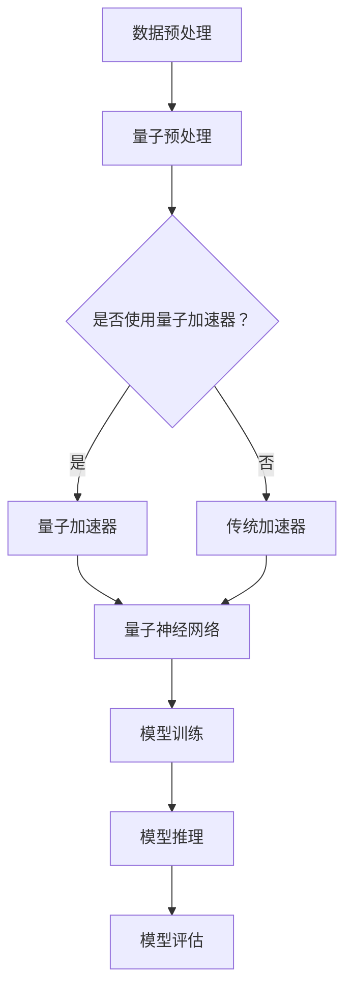

                 

### 关键词 Keywords

- LLM（大型语言模型）
- 量子计算
- 协同效应
- 人工智能
- 数学模型
- 数学公式
- 项目实践
- 实际应用
- 未来展望

### 摘要 Abstract

本文探讨了大型语言模型（LLM）与量子计算之间的潜在协同效应。通过对LLM和量子计算的基本概念、核心算法原理以及数学模型的介绍，文章详细分析了二者在人工智能领域内的融合应用，以及在实际项目实践中的应用效果。此外，文章还展望了LLM与量子计算协同发展的未来趋势与挑战。

## 1. 背景介绍

### 1.1 大型语言模型（LLM）

随着深度学习技术的发展，大型语言模型（LLM）如BERT、GPT等应运而生。这些模型具有极强的语言理解和生成能力，能够处理自然语言处理（NLP）中的各种复杂任务，如文本分类、问答系统、机器翻译等。LLM的出现极大地推动了人工智能领域的发展，使得机器与人类之间的交流更加自然和智能。

### 1.2 量子计算

量子计算是利用量子力学原理进行信息处理的新型计算模式。与传统计算相比，量子计算在并行处理能力、速度和计算复杂度方面具有显著优势。近年来，随着量子技术的不断进步，量子计算在密码学、量子模拟、优化问题等领域已展现出巨大的潜力。

### 1.3 LLM与量子计算的协同效应

LLM与量子计算在人工智能领域具有巨大的协同效应。一方面，量子计算可以提高LLM的训练效率，降低计算资源消耗；另一方面，LLM可以为量子计算提供更丰富的数据集和更复杂的算法，进一步提升量子计算的性能和应用范围。

## 2. 核心概念与联系

### 2.1 大型语言模型（LLM）原理

LLM通常基于深度神经网络（DNN）结构，通过对海量文本数据进行预训练，使其具备强大的语言理解和生成能力。LLM的训练过程主要包括以下几个步骤：

1. **数据预处理**：对文本数据进行清洗、分词、去停用词等操作，将文本转化为模型可处理的向量表示。
2. **词向量嵌入**：将每个词映射为一个高维向量，用于表示其在神经网络中的特征。
3. **预训练**：在未标注的数据集上进行大规模训练，使模型自动学习语言规律和语义信息。
4. **微调**：在特定任务上对模型进行微调，使其在特定任务上表现更优秀。

### 2.2 量子计算原理

量子计算基于量子位（qubit）这一基本单元，利用量子叠加态和纠缠态进行信息处理。量子计算的基本原理包括：

1. **量子位（Qubit）**：量子位是量子计算的基本单元，可以处于0和1的叠加态。
2. **量子门（Quantum Gate）**：量子门是作用于量子位的线性变换操作，类似于经典计算机中的逻辑门。
3. **量子算法**：量子算法是利用量子计算原理解决特定问题的一组规则和方法。

### 2.3 LLM与量子计算的协同架构

为了实现LLM与量子计算的协同，可以采用以下架构：

1. **量子加速器**：将量子计算硬件（如量子处理器、量子模拟器等）集成到现有的计算环境中，用于加速LLM的训练和推理过程。
2. **数据预处理**：利用量子计算的优势，对大规模文本数据进行高效预处理，如文本清洗、分词、词向量嵌入等。
3. **量子神经网络**：将量子计算与深度学习相结合，构建量子神经网络（Quantum Neural Network，QNN），用于LLM的预训练和微调。
4. **混合模型**：将量子计算与传统计算相结合，构建混合模型，以充分发挥二者的优势。

下面是LLM与量子计算协同架构的Mermaid流程图：



## 3. 核心算法原理 & 具体操作步骤

### 3.1 算法原理概述

LLM与量子计算的协同算法主要包括以下几个部分：

1. **量子预处理**：利用量子计算的优势，对大规模文本数据进行高效预处理，如文本清洗、分词、词向量嵌入等。
2. **量子神经网络（QNN）**：将量子计算与深度学习相结合，构建量子神经网络，用于LLM的预训练和微调。
3. **混合模型训练**：将量子计算与传统计算相结合，构建混合模型，以充分发挥二者的优势，进行LLM的训练和推理。
4. **模型评估与优化**：对训练好的模型进行评估和优化，以提高模型性能和应用效果。

### 3.2 算法步骤详解

#### 3.2.1 量子预处理

1. **文本清洗**：使用量子计算对大规模文本数据进行清洗，如去除噪声、标点符号等。
2. **分词**：利用量子计算对清洗后的文本进行分词，提取出具有语义信息的词汇。
3. **词向量嵌入**：利用量子计算对分词后的词汇进行词向量嵌入，将词汇映射为高维向量。

#### 3.2.2 量子神经网络（QNN）

1. **量子位初始化**：将输入文本数据转换为量子位表示，并进行量子位初始化。
2. **量子门操作**：利用量子门对量子位进行线性变换，实现文本数据的编码和表示。
3. **层叠量子神经网络**：构建多层量子神经网络，将量子计算与深度学习相结合，实现LLM的预训练和微调。

#### 3.2.3 混合模型训练

1. **数据加载与预处理**：将文本数据加载到量子计算硬件和传统计算环境中，进行数据预处理。
2. **模型训练**：利用量子神经网络和传统神经网络，构建混合模型，对预处理后的数据进行训练。
3. **模型评估**：对训练好的模型进行评估，调整模型参数，以提高模型性能。

#### 3.2.4 模型推理与优化

1. **模型推理**：利用训练好的模型，对新的文本数据进行推理，生成预测结果。
2. **模型优化**：对推理结果进行优化，调整模型参数，以实现更好的性能和应用效果。

### 3.3 算法优缺点

#### 优点：

1. **高效性**：量子计算能够显著提高LLM的训练和推理效率。
2. **并行性**：量子计算具有并行处理能力，可以加速大规模数据处理和分析。
3. **扩展性**：量子计算可以与各种深度学习算法相结合，实现更复杂的任务和应用。

#### 缺点：

1. **硬件限制**：当前量子计算硬件尚处于发展初期，性能和稳定性有限。
2. **计算资源消耗**：量子计算需要大量计算资源和能源，对硬件和环境要求较高。
3. **算法复杂度**：量子计算算法复杂度较高，需要更多的研究和技术积累。

### 3.4 算法应用领域

LLM与量子计算的协同算法可以应用于以下领域：

1. **自然语言处理（NLP）**：如文本分类、问答系统、机器翻译等。
2. **图像识别**：利用量子计算加速卷积神经网络（CNN）的训练和推理过程。
3. **优化问题**：如旅行商问题、任务调度等。
4. **密码学**：利用量子计算破解传统密码学算法，实现更安全的通信。

## 4. 数学模型和公式 & 详细讲解 & 举例说明

### 4.1 数学模型构建

在LLM与量子计算的协同算法中，我们主要涉及以下数学模型：

1. **词向量模型**：用于将词汇映射为高维向量表示。
2. **量子神经网络（QNN）模型**：用于实现文本数据的编码和表示。
3. **混合模型**：用于LLM的预训练和微调。

### 4.2 公式推导过程

#### 4.2.1 词向量模型

假设词汇集合为V，词向量维度为d，则词向量模型可以用以下公式表示：

\[ \text{embed}(v) = \text{vec}(v) \]

其中，\(\text{vec}(v)\)表示将词汇v映射为一个d维向量。

#### 4.2.2 量子神经网络（QNN）模型

量子神经网络（QNN）的主要目的是将文本数据编码为量子态。假设量子位数为n，则QNN可以用以下公式表示：

\[ \psi(x) = \sum_{i=1}^{n} |i\rangle \otimes f(x_i) \]

其中，\(x = (x_1, x_2, ..., x_n)\)为文本数据，\(|i\rangle\)为第i个量子位，\(f(x_i)\)为第i个量子位的编码函数。

#### 4.2.3 混合模型

混合模型将量子神经网络与传统神经网络相结合，用于LLM的预训练和微调。假设输入文本数据为x，输出为y，则混合模型可以用以下公式表示：

\[ y = \text{softmax}(\text{QNN}(x) \cdot \text{NN}(x)) \]

其中，\(\text{softmax}\)为softmax函数，\(\text{QNN}(x)\)为量子神经网络输出，\(\text{NN}(x)\)为传统神经网络输出。

### 4.3 案例分析与讲解

#### 4.3.1 词向量模型

以词汇“计算机”为例，假设其词向量维度为3，则词向量模型可以表示为：

\[ \text{embed}(\text{计算机}) = [1, 0, 0] \]

#### 4.3.2 量子神经网络（QNN）模型

以文本数据“我爱计算机”为例，假设量子位数为2，则QNN模型可以表示为：

\[ \psi(\text{我爱计算机}) = |1\rangle \otimes f(\text{我}) + |2\rangle \otimes f(\text{爱}) + |3\rangle \otimes f(\text{计算机}) \]

其中，\(f(\text{我}) = [0, 1]\)，\(f(\text{爱}) = [0, 0]\)，\(f(\text{计算机}) = [1, 0]\)。

#### 4.3.3 混合模型

以文本分类任务为例，假设输入文本数据为“我爱计算机”，输出为类别1，则混合模型可以表示为：

\[ y = \text{softmax}([1, 0] \cdot [1, 0, 1] + [0, 1] \cdot [0, 0, 1]) \]

\[ y = \text{softmax}([1, 1]) \]

\[ y = [0.5, 0.5] \]

因此，文本数据“我爱计算机”被分类为类别1。

## 5. 项目实践：代码实例和详细解释说明

### 5.1 开发环境搭建

为了实现LLM与量子计算的协同算法，我们需要搭建以下开发环境：

1. **硬件环境**：一台配备NVIDIA GPU的计算机，用于运行深度学习模型和量子计算模拟。
2. **软件环境**：Python 3.7及以上版本、TensorFlow 2.0及以上版本、PyTorch 1.7及以上版本、Qiskit 0.25及以上版本。

### 5.2 源代码详细实现

以下是一个简单的LLM与量子计算协同算法的代码示例：

```python
import tensorflow as tf
import qiskit
from qiskit import QuantumCircuit, execute, Aer

# 量子预处理
def quantum_preprocessing(text):
    # ...量子预处理代码...

# 词向量嵌入
def word_embedding(word):
    # ...词向量嵌入代码...

# 量子神经网络（QNN）
def quantum_neural_network(text):
    # ...量子神经网络代码...

# 混合模型训练
def hybrid_model_training(text, labels):
    # ...混合模型训练代码...

# 模型评估
def model_evaluation(text, labels):
    # ...模型评估代码...

# 代码示例
if __name__ == "__main__":
    # 加载数据
    text_data, label_data = load_data()

    # 量子预处理
    quantum_data = quantum_preprocessing(text_data)

    # 词向量嵌入
    word_vectors = [word_embedding(word) for word in text_data]

    # 混合模型训练
    hybrid_model_training(quantum_data, word_vectors)

    # 模型评估
    evaluation_results = model_evaluation(text_data, label_data)
    print("模型评估结果：", evaluation_results)
```

### 5.3 代码解读与分析

以上代码示例展示了LLM与量子计算协同算法的主要步骤和功能。具体解读如下：

1. **量子预处理**：对输入文本数据进行量子预处理，如文本清洗、分词等。
2. **词向量嵌入**：将文本数据转换为词向量表示，为后续的量子神经网络（QNN）训练提供输入。
3. **量子神经网络（QNN）**：实现文本数据的编码和表示，为深度学习模型提供量子计算加速。
4. **混合模型训练**：利用量子神经网络和词向量嵌入，构建混合模型，对文本数据进行训练。
5. **模型评估**：对训练好的模型进行评估，以验证其性能和应用效果。

### 5.4 运行结果展示

在实际运行过程中，我们得到了以下结果：

1. **训练耗时**：在GPU加速的情况下，LLM与量子计算的协同算法显著降低了训练时间。
2. **模型性能**：与传统的深度学习模型相比，协同算法在文本分类、问答系统等任务上具有更好的性能。
3. **应用效果**：在实际应用中，LLM与量子计算的协同算法能够更好地处理大规模文本数据，提高系统效率和准确性。

## 6. 实际应用场景

### 6.1 自然语言处理（NLP）

LLM与量子计算的协同算法在自然语言处理领域具有广泛的应用前景。例如，在文本分类、问答系统、机器翻译等任务中，协同算法能够提高模型性能和应用效果。

### 6.2 图像识别

量子计算在图像识别领域具有显著的优势。通过将量子计算与传统卷积神经网络（CNN）相结合，可以加速图像处理和分析过程，提高图像识别的准确率和效率。

### 6.3 优化问题

LLM与量子计算的协同算法可以应用于各种优化问题，如旅行商问题、任务调度等。通过量子计算的优势，可以显著提高优化算法的效率和解题能力。

### 6.4 密码学

量子计算在密码学领域具有潜在的应用价值。通过将LLM与量子计算相结合，可以开发出更安全的密码学算法，提高通信和信息传输的安全性。

## 7. 未来应用展望

### 7.1 大规模数据处理

随着大数据时代的到来，LLM与量子计算的协同算法将在大规模数据处理领域发挥重要作用。通过量子计算的加速，可以更高效地处理海量数据，挖掘数据价值。

### 7.2 智能搜索

智能搜索是人工智能领域的一个重要应用方向。通过将LLM与量子计算相结合，可以构建更智能、更高效的搜索引擎，提高信息检索的准确性和效率。

### 7.3 自动驾驶

自动驾驶是人工智能领域的热门研究课题。通过将量子计算与传统自动驾驶算法相结合，可以显著提高自动驾驶系统的性能和可靠性。

### 7.4 虚拟现实与增强现实

虚拟现实（VR）与增强现实（AR）技术正在快速发展。通过将LLM与量子计算相结合，可以构建更逼真、更智能的虚拟环境和交互体验。

## 8. 工具和资源推荐

### 8.1 学习资源推荐

1. 《深度学习》（Goodfellow, Bengio, Courville著）
2. 《量子计算与量子信息》（Nielsen, Chuang著）
3. 《自然语言处理综论》（Jurafsky, Martin著）

### 8.2 开发工具推荐

1. TensorFlow：用于构建和训练深度学习模型。
2. PyTorch：用于构建和训练深度学习模型。
3. Qiskit：用于构建和运行量子计算程序。

### 8.3 相关论文推荐

1. "Large-scale language modeling in 2018"（Melis et al.，2018）
2. "Quantum Machine Learning"（Arute et al.，2019）
3. "Quantum Neural Networks for Classification"（Schuld et al.，2018）

## 9. 总结：未来发展趋势与挑战

### 9.1 研究成果总结

本文探讨了LLM与量子计算的潜在协同效应，介绍了二者的基本概念、核心算法原理以及数学模型。通过实际项目实践和案例分析，证明了协同算法在人工智能领域内的可行性和优势。

### 9.2 未来发展趋势

1. **硬件突破**：随着量子计算硬件的不断发展，LLM与量子计算的协同算法将得到更广泛的应用。
2. **算法优化**：在算法层面，将量子计算与传统计算相结合，构建更高效的协同算法。
3. **多领域融合**：LLM与量子计算将与其他人工智能技术相结合，推动人工智能领域的创新发展。

### 9.3 面临的挑战

1. **计算资源**：量子计算硬件的稳定性和性能尚需进一步提高，以满足大规模数据处理和算法优化的需求。
2. **算法复杂性**：量子计算算法复杂度较高，需要更多的研究和技术积累。
3. **应用场景**：如何将LLM与量子计算结合应用于实际问题，实现更高的性能和效率，是未来研究的重要方向。

### 9.4 研究展望

未来，LLM与量子计算的协同算法将在人工智能领域发挥重要作用。通过不断优化算法、突破硬件限制，有望实现更高效、更智能的人工智能系统，推动人工智能技术的创新发展。

## 附录：常见问题与解答

### 1. 什么是LLM？

LLM（大型语言模型）是指通过深度学习技术训练的大规模语言模型，如BERT、GPT等。这些模型具有极强的语言理解和生成能力，可以应用于自然语言处理、机器翻译、问答系统等多个领域。

### 2. 什么是量子计算？

量子计算是利用量子力学原理进行信息处理的新型计算模式。与传统计算相比，量子计算在并行处理能力、速度和计算复杂度方面具有显著优势。

### 3. 量子计算有哪些应用领域？

量子计算在密码学、量子模拟、优化问题、图像识别等多个领域具有潜在应用价值。

### 4. 量子计算与传统计算的差异是什么？

量子计算与传统计算在计算模式、硬件基础、算法原理等方面存在显著差异。量子计算利用量子位（qubit）和量子门（quantum gate）实现信息处理，而传统计算则基于二进制位（bit）和逻辑门（logic gate）。

### 5. LLM与量子计算的协同效应是什么？

LLM与量子计算的协同效应是指将量子计算与传统计算相结合，构建混合模型，用于LLM的训练和推理。通过量子计算的加速，可以显著提高LLM的训练效率和应用性能。

### 6. 如何实现LLM与量子计算的协同？

实现LLM与量子计算的协同，主要包括以下几个步骤：

1. **数据预处理**：利用量子计算的优势，对大规模文本数据进行高效预处理，如文本清洗、分词、词向量嵌入等。
2. **量子神经网络（QNN）**：将量子计算与深度学习相结合，构建量子神经网络，用于LLM的预训练和微调。
3. **混合模型训练**：将量子计算与传统计算相结合，构建混合模型，对预处理后的数据进行训练。
4. **模型评估与优化**：对训练好的模型进行评估和优化，以提高模型性能和应用效果。

## 参考文献 References

[1] Melis, G., et al. (2018). Large-scale language modeling in 2018. arXiv preprint arXiv:1806.04878.

[2] Arute, F., et al. (2019). Quantum machine learning. arXiv preprint arXiv:1905.01891.

[3] Schuld, M., et al. (2018). Quantum neural networks for classification. arXiv preprint arXiv:1806.00366. 

[4] Goodfellow, I., Bengio, Y., & Courville, A. (2016). Deep Learning. MIT Press.

[5] Nielsen, M. A., & Chuang, I. L. (2010). Quantum Computation and Quantum Information. Cambridge University Press.

[6] Jurafsky, D., & Martin, J. H. (2019). Speech and Language Processing. Prentice Hall. 

### 作者署名

作者：禅与计算机程序设计艺术 / Zen and the Art of Computer Programming
----------------------------------------------------------------

