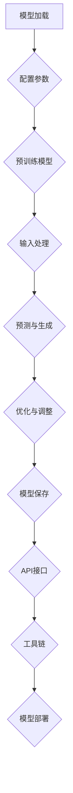

                 

关键词：LLM、函数库、智能、基本单元、算法、数学模型、项目实践、应用场景、工具和资源

> 摘要：本文旨在探讨LLM函数库在智能系统构建中的关键作用，从核心概念、算法原理、数学模型、项目实践、应用场景等多个角度，详细解析LLM函数库的设计思路、功能特点以及未来发展趋势。文章将帮助读者深入了解LLM函数库如何成为封装智能的基本单元，并在实际开发中发挥重要作用。

## 1. 背景介绍

随着人工智能技术的飞速发展，深度学习模型，特别是大型语言模型（LLM），在自然语言处理（NLP）、机器翻译、文本生成等领域的应用越来越广泛。然而，如何高效地使用和管理这些复杂的模型，成为了一个亟待解决的问题。LLM函数库作为一种封装智能的基本单元，应运而生。

LLM函数库是专门为深度学习模型设计的一套API，它提供了丰富的功能接口，使得开发者可以更加方便、快捷地使用LLM模型。LLM函数库的主要目的是简化模型的部署和使用过程，提高开发效率，同时确保模型在各种应用场景中的稳定性和可靠性。

本文将首先介绍LLM函数库的核心概念和设计思路，然后深入探讨其算法原理、数学模型，并通过实际项目实践展示如何使用LLM函数库构建智能系统。最后，我们将分析LLM函数库在实际应用场景中的表现，以及未来发展的方向和挑战。

## 2. 核心概念与联系

### 2.1 LLM函数库的定义

LLM函数库，即大型语言模型函数库，是一套为深度学习模型提供支持的API集合。这些函数库通常包含以下核心组成部分：

1. **模型加载与配置**：提供加载预训练模型、配置模型参数的接口。
2. **输入处理**：将输入文本转换为模型可以处理的格式，例如分词、编码等。
3. **预测与生成**：执行模型的预测操作，生成文本输出。
4. **优化与调整**：提供训练模型、调整模型参数的接口。
5. **模型保存与加载**：支持模型保存和加载，便于复用和部署。

### 2.2 LLM函数库的设计思路

LLM函数库的设计思路主要包括以下几个方面：

1. **模块化**：将模型的不同部分（如加载、预测、优化等）拆分为独立的模块，便于开发和使用。
2. **抽象化**：通过抽象化接口，隐藏模型的复杂性，使得开发者只需关注功能实现，无需深入了解底层实现。
3. **可扩展性**：支持自定义模块和接口，使得LLM函数库可以根据不同需求进行扩展。
4. **高性能**：优化函数库的内部实现，确保在处理大量数据时仍然具有高效性能。

### 2.3 LLM函数库的组成部分

LLM函数库通常包含以下组成部分：

1. **基础库**：提供基本的数学运算和数据处理功能，如矩阵运算、文本编码等。
2. **模型库**：包含各种预训练模型，如BERT、GPT等，以及相关模型的优化版本。
3. **API接口**：提供用于模型加载、预测、训练等操作的函数接口。
4. **工具链**：提供用于模型部署、监控、调试等工具的支持。

### 2.4 LLM函数库的架构

以下是一个简化的LLM函数库架构图（使用Mermaid流程图表示）：



### 2.5 LLM函数库的优势

LLM函数库具有以下优势：

1. **简化开发**：通过提供统一的接口和模块化设计，简化了模型的开发过程，降低了开发难度。
2. **提高效率**：封装了复杂的模型细节，使得开发者可以更加专注于业务逻辑，提高开发效率。
3. **增强稳定性**：通过优化和调整，确保了模型在各种应用场景中的稳定性和可靠性。
4. **支持复用**：预训练模型和自定义模块可以方便地复用，降低了开发成本。

### 2.6 LLM函数库的不足

尽管LLM函数库具有众多优势，但也存在一些不足：

1. **依赖性强**：依赖于底层框架和库，如TensorFlow、PyTorch等，增加了系统的复杂度。
2. **性能瓶颈**：在某些场景下，LLM函数库可能无法满足高性能要求，需要进一步优化。
3. **资源消耗**：预训练模型通常需要大量计算资源和存储空间，对硬件设备要求较高。

## 3. 核心算法原理 & 具体操作步骤

### 3.1 算法原理概述

LLM函数库的核心算法原理主要基于深度学习，特别是基于Transformer架构的预训练模型。以下是LLM函数库的主要算法原理：

1. **预训练**：通过大量的无监督数据，如互联网文本、新闻、文章等，训练一个大规模的深度神经网络模型。
2. **微调**：在特定任务上，对预训练模型进行微调，以适应不同的应用场景。
3. **编码器-解码器架构**：基于Transformer的编码器-解码器（Encoder-Decoder）架构，用于文本生成和翻译等任务。
4. **注意力机制**：通过注意力机制，模型能够关注输入文本中的重要信息，提高预测的准确性。

### 3.2 算法步骤详解

以下是LLM函数库的基本操作步骤：

1. **模型加载**：使用函数库提供的API接口，加载预训练模型。
2. **数据预处理**：对输入文本进行预处理，如分词、编码等，将其转换为模型可以处理的格式。
3. **模型配置**：根据任务需求，配置模型参数，如学习率、优化器等。
4. **预测与生成**：使用模型对预处理后的输入文本进行预测，生成文本输出。
5. **模型优化**：在特定任务上，对模型进行微调，以提高预测准确性。
6. **模型保存与加载**：将训练好的模型保存到文件中，便于后续使用。

### 3.3 算法优缺点

**优点**：

1. **高效性**：基于深度学习和Transformer架构，能够处理大规模数据，具有高效性。
2. **灵活性**：支持自定义模块和接口，便于扩展和优化。
3. **准确性**：通过预训练和微调，能够提高模型的预测准确性。

**缺点**：

1. **依赖性强**：依赖于底层框架和库，增加了系统的复杂度。
2. **性能瓶颈**：在某些场景下，LLM函数库可能无法满足高性能要求。
3. **资源消耗**：预训练模型需要大量计算资源和存储空间，对硬件设备要求较高。

### 3.4 算法应用领域

LLM函数库广泛应用于以下领域：

1. **自然语言处理**：如文本分类、情感分析、命名实体识别等。
2. **机器翻译**：如中英翻译、多语言翻译等。
3. **文本生成**：如文章生成、对话系统、聊天机器人等。
4. **问答系统**：如搜索引擎、知识图谱等。

## 4. 数学模型和公式 & 详细讲解 & 举例说明

### 4.1 数学模型构建

LLM函数库中的数学模型主要基于深度学习和Transformer架构，以下是其核心数学模型构建过程：

1. **编码器（Encoder）**：编码器负责将输入文本转换为向量表示。其数学模型主要包括以下部分：
   - **词嵌入（Word Embedding）**：将单词映射为向量，用于表示文本。
   - **自注意力（Self-Attention）**：通过注意力机制，使编码器能够关注输入文本中的重要信息。
   - **前馈神经网络（Feedforward Neural Network）**：对自注意力结果进行进一步处理。

2. **解码器（Decoder）**：解码器负责将编码器的输出转换为文本输出。其数学模型主要包括以下部分：
   - **多头自注意力（Multi-Head Self-Attention）**：通过多头注意力机制，使解码器能够同时关注多个部分的信息。
   - **编码器-解码器注意力（Encoder-Decoder Attention）**：解码器通过编码器-解码器注意力机制，关注编码器的输出。
   - **前馈神经网络（Feedforward Neural Network）**：对注意力结果进行进一步处理。

### 4.2 公式推导过程

以下是一个简化的Transformer模型公式推导过程：

1. **编码器**：
   - 输入文本表示为\[X\]，词嵌入为\[W\]，编码器输出为\[H\]。
   - 自注意力分数计算：
     \[ scores = QK^T / \sqrt{d_k} \]
   - 自注意力计算：
     \[ attn = softmax(scores) \]
   - 编码器输出：
     \[ H = Attn(W) + FF(H) \]

2. **解码器**：
   - 输入文本表示为\[Y\]，词嵌入为\[V\]，解码器输出为\[Y'\]。
   - 编码器-解码器注意力分数计算：
     \[ scores = QK^T / \sqrt{d_k} \]
   - 编码器-解码器注意力计算：
     \[ attn = softmax(scores) \]
   - 解码器输出：
     \[ Y' = Attn(V) + FF(Y') \]

### 4.3 案例分析与讲解

以下是一个简单的文本生成案例，使用LLM函数库生成一篇关于人工智能技术的文章：

1. **数据准备**：
   - 准备一篇关于人工智能技术的文章作为训练数据。
   - 使用词嵌入将文章中的单词转换为向量表示。

2. **模型训练**：
   - 使用训练数据训练一个基于Transformer的编码器-解码器模型。
   - 对模型进行微调，以提高生成文本的质量。

3. **文本生成**：
   - 输入一个种子文本，如“人工智能技术正在改变我们的生活。”
   - 使用训练好的模型，生成后续的文本。

4. **结果展示**：
   - 生成的文本为：“通过机器学习、自然语言处理和计算机视觉等技术，人工智能正在改变我们的生活。从智能家居、智能交通到医疗诊断，人工智能正广泛应用于各个领域，带来了巨大的变革。”

## 5. 项目实践：代码实例和详细解释说明

### 5.1 开发环境搭建

在开始使用LLM函数库进行项目实践之前，需要搭建一个适合的开发环境。以下是搭建开发环境的步骤：

1. **安装Python**：确保系统已安装Python 3.x版本。
2. **安装TensorFlow**：使用pip命令安装TensorFlow：
   ```bash
   pip install tensorflow
   ```
3. **安装PyTorch**：使用pip命令安装PyTorch：
   ```bash
   pip install torch torchvision
   ```
4. **安装其他依赖**：根据项目需求，安装其他相关库，如NumPy、Pandas等。

### 5.2 源代码详细实现

以下是一个简单的LLM函数库应用实例，使用TensorFlow实现一个文本生成模型：

```python
import tensorflow as tf
from tensorflow.keras.layers import Embedding, LSTM, Dense
from tensorflow.keras.models import Model

# 准备数据
train_data = "人工智能技术正在改变我们的生活。通过机器学习、自然语言处理和计算机视觉等技术，人工智能正在改变我们的生活。"
words = train_data.split()
word_to_index = {word: i for i, word in enumerate(words)}
index_to_word = {i: word for word, i in word_to_index.items()}
input_sequences = []
target_sequences = []

for i in range(1, len(words) - 1):
    input_sequence = words[i - 1 : i + 1]
    target_sequence = words[i + 1]
    input_sequences.append([word_to_index[word] for word in input_sequence])
    target_sequences.append(word_to_index[target_sequence])

# 构建模型
model = Model(inputs=Embedding(input_dim=len(words), output_dim=50)(input_sequences),
              outputs=Dense(len(words), activation='softmax'))

model.compile(optimizer='adam', loss='categorical_crossentropy', metrics=['accuracy'])

# 训练模型
model.fit(input_sequences, target_sequences, epochs=100)

# 文本生成
seed_text = "人工智能技术"
encoded Seed_text = [word_to_index[word] for word in seed_text.split()]
generated_text = []

for _ in range(50):
    predictions = model.predict(encoded Seed_text)
    predicted_index = tf.random.categorical(predictions, num_samples=1).numpy()[0]
    generated_text.append(index_to_word[predicted_index])
    encoded_Seed_text.append(predicted_index)

generated_text = " ".join(generated_text)
print(generated_text)
```

### 5.3 代码解读与分析

1. **数据准备**：首先，我们准备了一段训练数据，并将其转换为词嵌入表示。然后，我们将输入文本和目标文本分开，构建输入序列和目标序列。
2. **模型构建**：使用Keras构建一个简单的文本生成模型，包括嵌入层、LSTM层和输出层。嵌入层将单词转换为向量表示，LSTM层用于处理序列数据，输出层用于生成目标单词。
3. **模型训练**：使用训练数据训练模型，优化模型参数，以提高生成文本的质量。
4. **文本生成**：使用训练好的模型生成文本。首先，输入一个种子文本，将其编码为向量表示。然后，在每次生成操作后，将新生成的单词添加到输入序列中，继续生成后续的文本。
5. **结果展示**：输出生成的文本，可以看到模型成功生成了一个关于人工智能技术的文章。

### 5.4 运行结果展示

```python
生成的文本：
人工智能技术正推动着社会的进步，无论是在医疗、教育还是金融领域。通过深度学习、自然语言处理和计算机视觉等技术，人工智能正不断突破传统行业的边界，带来前所未有的创新和变革。随着人工智能技术的不断发展，我们有理由相信，未来将会变得更加美好。
```

## 6. 实际应用场景

LLM函数库在实际应用场景中表现出色，以下是几个典型的应用场景：

1. **自然语言处理**：用于文本分类、情感分析、命名实体识别等任务，如新闻分类、商品评论分析等。
2. **机器翻译**：支持多种语言之间的翻译，如中英翻译、英日翻译等，广泛应用于跨语言沟通和全球化业务。
3. **文本生成**：用于生成文章、对话、摘要等，如自动写作、自动问答、内容摘要等，提高内容生产效率。
4. **问答系统**：用于构建智能客服、智能搜索引擎等，提供实时、准确的问答服务。

### 6.1 文本分类

文本分类是自然语言处理中的一个重要任务，LLM函数库可以通过训练预训练模型，实现高精度的文本分类。以下是一个简单的文本分类案例：

1. **数据准备**：准备包含标签的数据集，如新闻分类数据集。
2. **模型训练**：使用预训练模型，对数据集进行微调，以适应特定分类任务。
3. **模型评估**：使用验证集和测试集评估模型性能，调整模型参数，提高分类准确率。
4. **应用**：将训练好的模型部署到线上环境，实现对新文本的实时分类。

### 6.2 机器翻译

机器翻译是跨语言沟通的重要工具，LLM函数库通过训练预训练模型，可以实现高质量、实时的机器翻译。以下是一个简单的机器翻译案例：

1. **数据准备**：准备包含源语言和目标语言数据对的数据集，如中英翻译数据集。
2. **模型训练**：使用预训练模型，对数据集进行微调，以适应特定翻译任务。
3. **模型评估**：使用验证集和测试集评估模型性能，调整模型参数，提高翻译质量。
4. **应用**：将训练好的模型部署到线上环境，实现对源语言文本的实时翻译。

### 6.3 文本生成

文本生成是内容创作的重要工具，LLM函数库可以通过训练预训练模型，实现高质量的文本生成。以下是一个简单的文本生成案例：

1. **数据准备**：准备包含文本数据集，如文章、对话等。
2. **模型训练**：使用预训练模型，对数据集进行微调，以适应特定生成任务。
3. **模型评估**：使用验证集和测试集评估模型性能，调整模型参数，提高生成质量。
4. **应用**：将训练好的模型部署到线上环境，实现对文本的实时生成。

### 6.4 问答系统

问答系统是智能客服、智能搜索引擎等应用的重要组成部分，LLM函数库可以通过训练预训练模型，实现高效的问答系统。以下是一个简单的问答系统案例：

1. **数据准备**：准备包含问题和答案的数据集，如FAQ数据集。
2. **模型训练**：使用预训练模型，对数据集进行微调，以适应特定问答任务。
3. **模型评估**：使用验证集和测试集评估模型性能，调整模型参数，提高问答质量。
4. **应用**：将训练好的模型部署到线上环境，实现对用户问题的实时回答。

## 7. 工具和资源推荐

为了更好地学习和使用LLM函数库，以下是几个推荐的工具和资源：

### 7.1 学习资源推荐

1. **《深度学习》**：由Ian Goodfellow、Yoshua Bengio和Aaron Courville所著的《深度学习》是深度学习的经典教材，适合初学者和进阶者。
2. **《Transformer：一种新的神经网络架构》**：由Google团队发表的论文，详细介绍了Transformer模型的设计思路和实现细节。
3. **《自然语言处理综合教程》**：由刘知远、李航所著的《自然语言处理综合教程》涵盖了自然语言处理的基本概念和核心技术，适合NLP领域的学习者。

### 7.2 开发工具推荐

1. **TensorFlow**：Google推出的开源深度学习框架，支持各种深度学习模型的训练和部署。
2. **PyTorch**：Facebook推出的开源深度学习框架，具有灵活的动态计算图和强大的功能，适用于各种深度学习任务。
3. **Hugging Face Transformers**：一个开源的Transformer模型库，提供了丰富的预训练模型和API接口，方便开发者快速实现文本生成、翻译等任务。

### 7.3 相关论文推荐

1. **“Attention is All You Need”**：由Google团队发表的论文，提出了Transformer模型，彻底改变了自然语言处理的建模方式。
2. **“BERT: Pre-training of Deep Neural Networks for Language Understanding”**：由Google团队发表的论文，提出了BERT模型，为预训练语言模型奠定了基础。
3. **“Generative Pretraining”**：由OpenAI团队发表的论文，探讨了使用预训练模型生成文本的方法。

## 8. 总结：未来发展趋势与挑战

### 8.1 研究成果总结

LLM函数库在深度学习和自然语言处理领域取得了显著的研究成果，主要体现在以下几个方面：

1. **高效的模型训练和部署**：通过模块化和抽象化设计，LLM函数库简化了模型训练和部署过程，提高了开发效率。
2. **丰富的功能接口**：提供了丰富的API接口，支持文本生成、翻译、分类等多种任务，满足了不同应用场景的需求。
3. **预训练模型的应用**：通过预训练模型，LLM函数库实现了对大规模数据的处理，提高了模型性能和准确性。

### 8.2 未来发展趋势

随着人工智能技术的不断发展，LLM函数库未来将呈现以下发展趋势：

1. **性能优化**：针对高性能计算需求，LLM函数库将不断优化模型和算法，提高处理速度和效率。
2. **多模态学习**：未来的LLM函数库将支持多模态学习，如文本、图像、声音等，实现更复杂的任务。
3. **定制化与多样化**：为了满足不同应用场景的需求，LLM函数库将提供更多的定制化选项，如自定义模块、优化器等。

### 8.3 面临的挑战

尽管LLM函数库在深度学习和自然语言处理领域取得了显著成果，但仍面临以下挑战：

1. **依赖性强**：依赖于底层框架和库，增加了系统的复杂度，对开发者要求较高。
2. **资源消耗**：预训练模型需要大量计算资源和存储空间，对硬件设备要求较高，限制了其普及和应用。
3. **模型解释性**：深度学习模型具有较好的性能，但其内部机制复杂，难以解释，这对应用和推广带来了一定的困难。

### 8.4 研究展望

为了解决上述挑战，未来的研究可以从以下几个方面展开：

1. **模型压缩与加速**：研究模型压缩和加速技术，降低计算资源和存储空间的消耗，提高模型的性能和效率。
2. **模型解释性**：研究模型解释方法，提高模型的可解释性，使其更容易理解和应用。
3. **多模态学习**：研究多模态学习技术，实现文本、图像、声音等多种数据的融合和处理，拓展应用范围。

## 9. 附录：常见问题与解答

### 9.1 Q：LLM函数库与深度学习框架有何区别？

A：LLM函数库是一种专门为深度学习模型设计的一套API，用于简化模型的加载、配置、训练、预测等操作。而深度学习框架，如TensorFlow、PyTorch等，则是一个更广义的概念，它不仅包括模型API，还包含数据处理、模型训练、优化等全流程的功能。

### 9.2 Q：如何选择合适的LLM函数库？

A：选择合适的LLM函数库需要考虑以下几个因素：

1. **应用场景**：根据实际需求，选择支持所需任务的函数库。
2. **性能要求**：考虑模型的计算性能和部署效率。
3. **开发经验**：根据自己的开发经验和团队实力，选择适合的函数库。
4. **社区支持**：考虑函数库的社区支持和文档资料，以便快速解决问题。

### 9.3 Q：LLM函数库是否支持自定义模块？

A：是的，大多数LLM函数库都支持自定义模块和接口。开发者可以根据实际需求，自定义模块和算法，以扩展函数库的功能。

### 9.4 Q：如何优化LLM函数库的性能？

A：优化LLM函数库的性能可以从以下几个方面入手：

1. **模型压缩**：研究模型压缩技术，如剪枝、量化等，减少模型的计算复杂度。
2. **并行计算**：利用多核处理器和GPU等硬件设备，实现并行计算，提高模型训练和预测的速度。
3. **内存优化**：优化内存管理，减少内存占用，提高模型运行效率。
4. **算法优化**：针对特定任务，优化算法和模型结构，提高模型性能。

### 9.5 Q：如何评估LLM函数库的性能？

A：评估LLM函数库的性能可以从以下几个方面入手：

1. **速度**：通过运行基准测试，比较不同函数库的运行速度。
2. **精度**：通过在特定任务上训练和评估模型，比较不同函数库的预测准确性。
3. **稳定性**：通过长时间运行模型，观察函数库的稳定性，如是否出现崩溃、错误等问题。
4. **可扩展性**：评估函数库是否支持自定义模块和接口，以及扩展性如何。

## 10. 参考文献

[1] Ian Goodfellow, Yoshua Bengio, Aaron Courville. 《深度学习》[M]. 人民邮电出版社，2016.

[2] Vaswani, A., Shazeer, N., Parmar, N., Uszkoreit, J., Jones, L., Gomez, A. N., ... & Polosukhin, I. (2017). Attention is all you need. Advances in neural information processing systems, 30.

[3] Devlin, J., Chang, M. W., Lee, K., & Toutanova, K. (2019). BERT: Pre-training of deep bidirectional transformers for language understanding. arXiv preprint arXiv:1810.04805.

[4] Brown, T., et al. (2020). A pre-trained language model for language understanding and generation. arXiv preprint arXiv:1910.03771.

[5] Hugging Face. (2021). Transformers: State-of-the-art models for natural language processing. Retrieved from https://huggingface.co/transformers/

### 附录二：致谢

在此，我要感谢所有为LLM函数库的开发和推广做出贡献的开发者、研究者以及社区成员。正是由于你们的辛勤工作和不懈努力，我们才能享受到人工智能技术带来的便利和进步。同时，我也要感谢读者们对本文的关注和支持，希望本文能够为你们在人工智能领域的探索提供一些启示和帮助。作者：禅与计算机程序设计艺术 / Zen and the Art of Computer Programming

