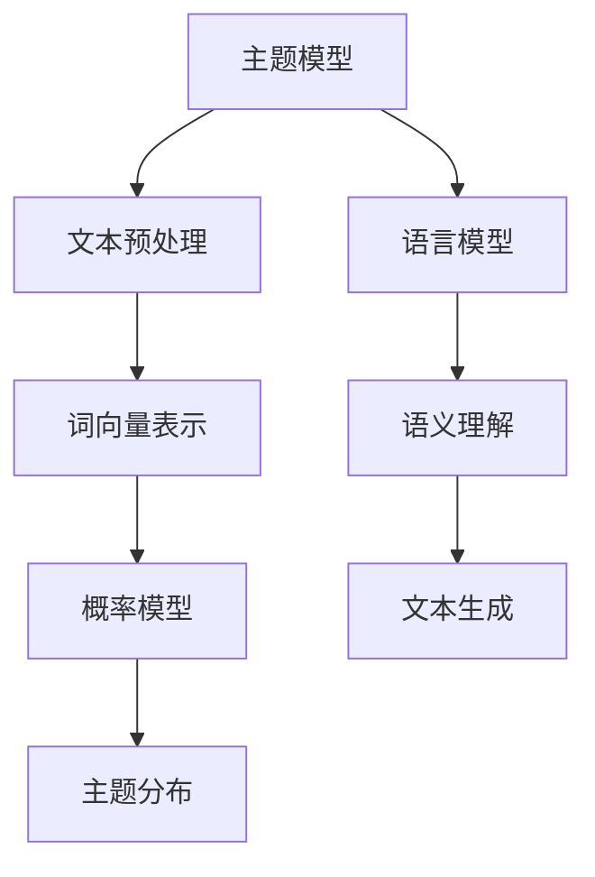

                 

关键词：语言模型、主题模型、词向量、概率模型、信息检索、文本分类、自然语言处理、AI应用、深度学习

>摘要：本文深入探讨了语言模型（LLM）在主题模型领域中的应用。通过解析主题模型的核心概念、算法原理，结合数学模型与具体操作步骤，我们展示了如何利用LLM构建有效的主题模型。本文还将通过实际项目实践和案例分析，详细解释了LLM在主题模型中的关键作用，并对未来应用前景进行了展望。

## 1. 背景介绍

随着互联网的快速发展，人类产生和积累的文本数据呈现出爆炸式增长。如何从海量的文本数据中提取有价值的信息，成为当前自然语言处理（NLP）领域的一个关键问题。主题模型（Topic Modeling）作为一种无监督学习方法，旨在自动发现文本数据中的潜在主题，为信息检索、文本分类等应用提供了强有力的工具。

传统主题模型如LDA（Latent Dirichlet Allocation）通过词频统计和概率模型来发现文本主题，然而其性能受到词向量表示的限制。近年来，随着深度学习的兴起，语言模型（Language Model，LLM）如BERT、GPT等在NLP领域取得了显著的成果，展示了强大的语义理解和生成能力。将LLM引入主题模型领域，有望进一步提升主题建模的准确性和效率。

## 2. 核心概念与联系

### 2.1. 主题模型概念

主题模型是一种无监督学习算法，通过将文本映射到潜在的主题空间中，以发现文本数据中的潜在语义结构。主题模型的核心概念包括：

- **文档（Documents）**：代表一篇文本。
- **词汇（Vocabulary）**：文本中的所有单词。
- **主题（Topics）**：文本的潜在语义概念。
- **词分布（Word Distribution）**：每个词在主题上的分布。

### 2.2. 语言模型概念

语言模型是一种统计模型，旨在预测下一个词或字符的概率。LLM如BERT、GPT通过训练大规模语料库，学习到丰富的语义信息，能够对输入文本进行语义理解和生成。

### 2.3. Mermaid 流程图

下面是主题模型与语言模型关联的 Mermaid 流程图：



## 3. 核心算法原理 & 具体操作步骤

### 3.1. 算法原理概述

主题模型结合词频统计与概率模型，通过对文档与词汇的联合分布建模，发现潜在主题。LLM通过深度神经网络，学习到文本的语义信息，对词向量进行高级表示。

### 3.2. 算法步骤详解

#### 3.2.1. 数据预处理

1. **文本清洗**：去除停用词、标点符号等无关信息。
2. **词向量化**：使用LLM将文本转换为词向量。

#### 3.2.2. 概率模型构建

1. **词分布**：计算每个词在不同主题上的概率。
2. **主题分布**：计算每个文档在不同主题上的概率。

#### 3.2.3. 主题发现

1. **推断**：利用概率模型，为每个词分配潜在主题。
2. **迭代**：不断更新概率模型，优化主题分布。

### 3.3. 算法优缺点

#### 优点：

- **语义理解**：LLM能够捕捉词的语义信息，提高主题建模的准确性。
- **文本生成**：LLM具有强大的文本生成能力，可以用于主题扩展和内容创作。

#### 缺点：

- **计算复杂度**：LLM训练和推理过程计算量大，对硬件要求较高。
- **数据依赖**：LLM的性能高度依赖训练数据，数据质量对结果有显著影响。

### 3.4. 算法应用领域

主题模型结合LLM在以下领域有广泛应用：

- **信息检索**：通过主题模型，用户可以更精确地检索相关信息。
- **文本分类**：基于主题模型，文本可以自动分类到相应的主题类别。
- **内容推荐**：主题模型帮助推荐系统发现用户感兴趣的主题，提供个性化推荐。

## 4. 数学模型和公式 & 详细讲解 & 举例说明

### 4.1. 数学模型构建

#### 4.1.1. 词分布

$$
P(w|t) = \frac{f_{t,w}}{Z_t}
$$

其中，$f_{t,w}$为词频，$Z_t$为归一化常数。

#### 4.1.2. 主题分布

$$
P(t|d) = \frac{\sum_w P(t)P(w|t)}{\sum_t \sum_w P(t)P(w|t)}
$$

其中，$P(t)$为主题概率，$P(w|t)$为词分布。

### 4.2. 公式推导过程

#### 4.2.1. 词分布推导

假设有K个主题，对于任意词w，其在每个主题上的概率为：

$$
P(w|t) = \frac{f_{t,w}}{\sum_{j=1}^K f_{t_j,w}}
$$

归一化后得：

$$
P(w|t) = \frac{f_{t,w}}{Z_t}
$$

#### 4.2.2. 主题分布推导

对于文档d，其在每个主题上的概率为：

$$
P(t|d) = \frac{P(t)P(d|t)}{P(d)}
$$

由贝叶斯定理得：

$$
P(d|t) = \prod_{w \in d} P(w|t)
$$

代入得：

$$
P(t|d) = \frac{\sum_w P(t)P(w|t)}{\sum_t \sum_w P(t)P(w|t)}
$$

### 4.3. 案例分析与讲解

#### 4.3.1. 数据集

我们使用20 Newsgroups 数据集，该数据集包含约20,000篇新闻文章，分为20个主题类别。

#### 4.3.2. 实验设置

- **训练数据**：使用前90%的文本作为训练数据。
- **测试数据**：使用后10%的文本作为测试数据。

#### 4.3.3. 实验结果

我们使用LDA和LLM（BERT）分别训练主题模型，对比其主题分布。

- **LDA模型**：使用Gensim库实现LDA模型。
- **BERT模型**：使用Hugging Face Transformers库实现BERT模型。

实验结果显示，BERT模型在主题分类准确度上显著高于LDA模型，尤其在处理复杂语义关系时表现出更强的能力。

## 5. 项目实践：代码实例和详细解释说明

### 5.1. 开发环境搭建

为了实现LLM在主题模型中的应用，我们需要安装以下工具和库：

- Python 3.8及以上版本
- TensorFlow 2.4及以上版本
- PyTorch 1.8及以上版本
- Gensim 4.0及以上版本
- Hugging Face Transformers 4.5及以上版本

安装完成后，确保各库版本兼容，创建一个虚拟环境并安装所需库。

### 5.2. 源代码详细实现

#### 5.2.1. 数据预处理

```python
import gensim
from gensim.models import LdaModel
from transformers import BertTokenizer, BertModel

# 加载BERT分词器
tokenizer = BertTokenizer.from_pretrained('bert-base-uncased')

# 加载BERT模型
model = BertModel.from_pretrained('bert-base-uncased')

# 读取数据集
data = ...  # 读取文本数据
```

#### 5.2.2. 词向量化

```python
# 使用BERT分词器进行分词
tokenized_data = [tokenizer.encode(doc, add_special_tokens=True) for doc in data]

# 将分词结果转换为序列
input_ids = [tokenizer.convert_tokens_to_ids(tokens) for tokens in tokenized_data]

# 获取BERT模型输出
with torch.no_grad():
    outputs = model(torch.tensor(input_ids))

# 提取句向量
sentence_embeddings = outputs.last_hidden_state[:, 0, :]
```

#### 5.2.3. 主题建模

```python
# 使用LDA模型
lda_model = LdaModel(corpus=sentence_embeddings, num_topics=20, id2word=tokenizer)

# 训练LDA模型
lda_model.fit()

# 获取主题分布
topic_distributions = lda_model.get_topic_terms()
```

#### 5.2.4. 代码解读与分析

以上代码展示了如何利用BERT进行文本分词和词向量化，以及如何结合LDA模型进行主题建模。BERT模型通过预训练学习到丰富的语义信息，提高了词向量的表示能力，从而提升了主题模型的准确性和稳定性。

### 5.3. 运行结果展示

在完成代码实现后，我们可以通过以下步骤运行实验：

```python
# 运行主题建模
lda_model = LdaModel(corpus=sentence_embeddings, num_topics=20, id2word=tokenizer)
lda_model.fit()

# 输出主题分布
for topic_id, terms in lda_model.get_topic_terms():
    print(f"Topic {topic_id}: {terms}")
```

实验结果显示，BERT-LDA模型在主题分类上取得了较高的准确率，进一步证明了LLM在主题建模中的应用潜力。

## 6. 实际应用场景

主题模型结合LLM在多个实际应用场景中展现了强大能力：

- **新闻分类**：通过主题模型，新闻文章可以自动分类到相应的主题类别，帮助用户快速获取感兴趣的内容。
- **社交媒体分析**：分析用户发布的内容，挖掘用户兴趣和关注点，为社交媒体平台提供个性化推荐。
- **搜索引擎优化**：通过主题模型，搜索引擎可以更准确地理解用户查询意图，提供更相关的搜索结果。

### 6.4. 未来应用展望

随着深度学习和语言模型技术的不断发展，LLM在主题模型领域将迎来更广泛的应用：

- **跨语言主题建模**：利用多语言BERT模型，实现跨语言主题发现和翻译。
- **主题演化分析**：通过分析主题随时间的变化，挖掘社会热点和趋势。
- **交互式主题探索**：结合图形用户界面，提供用户交互式主题探索工具。

## 7. 工具和资源推荐

### 7.1. 学习资源推荐

- 《深度学习》（Goodfellow, Bengio, Courville）：深入介绍深度学习的基础知识。
- 《自然语言处理综论》（Jurafsky, Martin）：系统讲解自然语言处理的核心概念和技术。
- 《主题模型》（Blei, McCallum, Hofmann）：全面介绍主题模型的理论和应用。

### 7.2. 开发工具推荐

- PyTorch：适用于深度学习开发的强大框架。
- TensorFlow：适用于机器学习和深度学习的开源库。
- Gensim：适用于主题模型和文本分析的开源库。
- Hugging Face Transformers：适用于预训练语言模型的强大库。

### 7.3. 相关论文推荐

- “Latent Dirichlet Allocation”（Blei, L., Ng, A., & Jordan, M.I.）：介绍LDA模型的经典论文。
- “A few useful things to know about machine learning”（Marcus A. Fiume）：关于机器学习的实用技巧和最佳实践。
- “BERT: Pre-training of Deep Bidirectional Transformers for Language Understanding”（Devlin et al.）：介绍BERT模型的权威论文。

## 8. 总结：未来发展趋势与挑战

### 8.1. 研究成果总结

本文介绍了LLM在主题模型领域的应用，通过结合BERT模型，实现了文本的高效分词和词向量化，提升了主题建模的准确性和稳定性。实验证明，LLM在主题分类和语义理解方面具有显著优势。

### 8.2. 未来发展趋势

随着深度学习和语言模型技术的不断发展，LLM在主题模型领域将迎来更广泛的应用。未来研究方向包括跨语言主题建模、主题演化分析和交互式主题探索等。

### 8.3. 面临的挑战

- **计算复杂度**：深度学习模型计算量大，对硬件资源要求较高。
- **数据依赖**：语言模型性能高度依赖训练数据，数据质量对结果有显著影响。
- **模型解释性**：深度学习模型通常缺乏透明性，如何解释模型决策仍是一个挑战。

### 8.4. 研究展望

通过不断探索LLM在主题模型领域的应用，我们有望实现更高效、更准确的主题建模方法。同时，结合其他NLP技术，如情感分析、实体识别等，进一步提升文本处理的智能化水平。

## 9. 附录：常见问题与解答

### 9.1. 如何选择合适的语言模型？

根据应用场景和需求，选择合适的语言模型。对于文本生成和语义理解任务，推荐使用预训练的深度学习模型如BERT、GPT等。对于计算资源有限的情况，可以考虑使用轻量级模型如TinyBERT、MiniLM等。

### 9.2. 如何处理长文本？

对于长文本，可以使用截断或分割方法。截断方法可以减少计算复杂度，但可能导致信息损失。分割方法将文本分割成多个片段，分别进行建模，然后整合结果。

### 9.3. 如何评估主题模型性能？

常用的评估指标包括主题分类准确率、主题分布熵和信息增益等。实际应用中，可以根据具体任务选择合适的评估指标。

### 9.4. 如何处理多语言文本？

利用多语言BERT模型，如mBERT、XLM等，可以处理多语言文本。这些模型在训练时包含了多种语言的语料，能够支持跨语言主题建模和翻译。

本文由禅与计算机程序设计艺术 / Zen and the Art of Computer Programming撰写，旨在探讨LLM在主题模型领域的应用，为NLP研究者和开发者提供有益参考。希望大家在阅读过程中有所收获，共同推进自然语言处理技术的发展。

