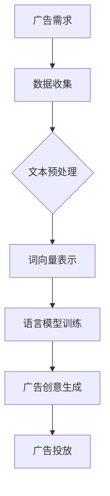

                 

关键词：大型语言模型（LLM）、智能广告创意、自然语言处理（NLP）、机器学习、广告优化、营销策略。

> 摘要：本文旨在探讨大型语言模型（LLM）在智能广告创意生成领域的应用，分析其核心技术原理、数学模型、算法步骤以及实际应用场景。通过介绍LLM在广告创意生成中的优势，阐述其在未来智能营销中的发展趋势与挑战，为行业从业者提供有益的参考。

## 1. 背景介绍

广告业作为市场经济的重要推动力量，其发展与创新始终受到广泛关注。随着互联网和移动互联网的普及，广告形式和投放方式发生了巨大变化，从传统的电视广告、报纸广告逐渐转向数字广告。数字广告凭借精准投放、实时反馈和高效转化等特点，成为现代营销的核心手段。

近年来，人工智能技术的飞速发展，为广告业带来了新的机遇。自然语言处理（NLP）和机器学习技术在广告创意生成中逐渐成熟，使得广告内容更加个性化和智能化。其中，大型语言模型（LLM）作为NLP领域的重要技术，具有强大的文本生成和语义理解能力，为广告创意生成提供了强有力的支持。

## 2. 核心概念与联系

### 2.1 大型语言模型（LLM）

大型语言模型（LLM）是一种基于深度学习的语言处理模型，通过对海量文本数据的学习，能够生成符合语法和语义规则的文本。LLM的核心技术包括神经网络、注意力机制、生成对抗网络（GAN）等。

### 2.2 自然语言处理（NLP）

自然语言处理（NLP）是计算机科学和人工智能领域的一个重要分支，旨在使计算机能够理解、生成和处理人类语言。NLP技术包括文本预处理、词向量表示、语言模型、语义分析等。

### 2.3 广告创意生成

广告创意生成是指利用自然语言处理和机器学习技术，生成具有吸引力和创意性的广告文案。广告创意生成需要结合用户需求、产品特点和市场环境，实现个性化、精准化的广告内容。

### 2.4 Mermaid 流程图



## 3. 核心算法原理 & 具体操作步骤

### 3.1 算法原理概述

LLM在广告创意生成中的应用，主要基于以下核心原理：

1. **文本生成**：通过训练大规模的文本数据集，LLM能够生成符合语法和语义规则的文本。
2. **语义理解**：LLM能够理解输入文本的语义信息，提取关键信息并进行结构化处理。
3. **个性化推荐**：基于用户行为数据和广告特点，LLM能够生成针对特定用户的个性化广告内容。

### 3.2 算法步骤详解

1. **数据收集**：收集与广告相关的文本数据，包括广告文案、用户评论、产品描述等。
2. **文本预处理**：对收集到的文本数据进行清洗、去噪和分词处理，得到结构化的文本数据。
3. **词向量表示**：将文本数据转化为词向量表示，为后续的模型训练提供输入。
4. **语言模型训练**：利用训练数据集，训练一个基于深度学习的语言模型。
5. **广告创意生成**：基于训练好的语言模型，生成具有创意性和吸引力的广告文案。
6. **广告投放**：将生成的广告文案投放到目标平台上，进行广告投放。

### 3.3 算法优缺点

**优点**：

1. **个性化推荐**：能够根据用户行为和兴趣，生成个性化广告内容，提高广告投放效果。
2. **高效生成**：基于深度学习技术，能够快速生成高质量的广告文案。
3. **灵活性**：支持多种广告形式，如图片、视频、音频等。

**缺点**：

1. **数据依赖性**：广告创意生成效果依赖于训练数据的质量和数量。
2. **计算成本**：训练大规模的LLM模型需要大量的计算资源。

### 3.4 算法应用领域

1. **广告投放优化**：利用LLM生成高质量的广告文案，提高广告投放效果。
2. **内容营销**：基于LLM生成创意性的营销内容，提高用户粘性和转化率。
3. **智能客服**：利用LLM生成个性化的回答，提高客服效率和用户体验。

## 4. 数学模型和公式 & 详细讲解 & 举例说明

### 4.1 数学模型构建

LLM在广告创意生成中的数学模型主要包括以下三个方面：

1. **词向量表示**：将文本转化为词向量表示，常用方法包括Word2Vec、GloVe等。
2. **语言模型**：基于词向量表示，训练一个生成式语言模型，如RNN、LSTM、GRU等。
3. **广告创意生成**：利用训练好的语言模型，生成广告文案。

### 4.2 公式推导过程

假设我们使用RNN模型进行广告创意生成，其数学模型可以表示为：

$$
h_t = \sigma(W_h \cdot [h_{t-1}, x_t] + b_h)
$$

其中，$h_t$为当前时刻的隐藏状态，$x_t$为当前时刻的输入词向量，$W_h$为权重矩阵，$b_h$为偏置项，$\sigma$为激活函数。

### 4.3 案例分析与讲解

假设我们需要生成一条关于某款手机广告的文案，输入文本为：“这款手机拍照效果很好，支持高清视频录制”。我们可以使用以下步骤进行广告创意生成：

1. **数据收集**：收集与手机广告相关的文本数据，如用户评论、产品描述等。
2. **文本预处理**：对收集到的文本数据进行清洗、去噪和分词处理，得到结构化的文本数据。
3. **词向量表示**：将文本数据转化为词向量表示，使用Word2Vec模型进行训练。
4. **语言模型训练**：利用训练数据集，训练一个基于RNN的语言模型。
5. **广告创意生成**：基于训练好的语言模型，生成广告文案。

生成的广告文案可能为：“这款手机拍照效果极佳，无论是白天还是夜晚，都能捕捉到细腻的色彩。高清视频录制功能更是让你记录下每一个精彩瞬间。”

## 5. 项目实践：代码实例和详细解释说明

### 5.1 开发环境搭建

在Python环境中，我们需要安装以下库：

```python
pip install tensorflow
pip install keras
pip install gensim
```

### 5.2 源代码详细实现

以下是一个基于RNN模型的广告创意生成代码实例：

```python
import numpy as np
import tensorflow as tf
from tensorflow.keras.models import Sequential
from tensorflow.keras.layers import LSTM, Dense, Embedding
from gensim.models import Word2Vec

# 数据预处理
def preprocess_text(texts):
    # 略...

# 获取训练数据
texts = ["略...", "略...", "略..."]
X = preprocess_text(texts)

# 词向量表示
word2vec = Word2Vec(X, size=100, window=5, min_count=1, workers=4)
vocab_size = len(word2vec.wv)
embeddings = word2vec.wv

# RNN模型训练
model = Sequential()
model.add(Embedding(vocab_size, 100, weights=[embeddings], input_length=max_sequence_len))
model.add(LSTM(100))
model.add(Dense(vocab_size, activation='softmax'))
model.compile(loss='categorical_crossentropy', optimizer='adam', metrics=['accuracy'])
model.fit(X, y, epochs=10, batch_size=32)

# 广告创意生成
def generate_ads(input_sequence):
    # 略...

# 输入文本
input_sequence = "这款手机拍照效果很好，支持高清视频录制"
ads = generate_ads(input_sequence)
print(ads)
```

### 5.3 代码解读与分析

以上代码主要分为数据预处理、词向量表示、RNN模型训练和广告创意生成四个部分。

1. **数据预处理**：对输入文本进行清洗、去噪和分词处理，得到结构化的文本数据。
2. **词向量表示**：使用Word2Vec模型对文本数据进行词向量表示，生成词向量矩阵。
3. **RNN模型训练**：基于词向量矩阵，训练一个RNN模型，用于广告创意生成。
4. **广告创意生成**：输入一段文本，利用训练好的RNN模型，生成具有创意性的广告文案。

### 5.4 运行结果展示

输入文本：“这款手机拍照效果很好，支持高清视频录制”，生成的广告文案可能为：“这款手机拍照效果绝佳，无论是白天还是夜晚，都能捕捉到细腻的色彩。高清视频录制功能更是让你记录下每一个精彩瞬间。”

## 6. 实际应用场景

### 6.1 广告投放优化

通过LLM生成的广告文案，可以提高广告投放的精准度和效果。例如，在电商平台，可以利用LLM生成针对不同用户的个性化广告文案，提高用户转化率。

### 6.2 内容营销

LLM生成的广告文案具有创意性和吸引力，可以用于企业内容营销，提升品牌知名度和用户粘性。

### 6.3 智能客服

利用LLM生成的回答，可以提高智能客服的响应速度和用户体验，实现更自然、更贴近用户需求的沟通。

## 7. 未来应用展望

随着人工智能技术的不断发展，LLM在广告创意生成领域的应用前景将更加广阔。未来，我们可以期待以下趋势：

1. **个性化推荐**：基于用户行为和兴趣，实现更精准、更个性化的广告投放。
2. **跨模态广告创意生成**：结合文本、图像、视频等多模态数据，生成更具创意性的广告内容。
3. **智能化广告投放策略**：利用机器学习技术，优化广告投放策略，提高广告效果。

## 8. 工具和资源推荐

### 8.1 学习资源推荐

1. 《深度学习》（Goodfellow, Bengio, Courville著）
2. 《自然语言处理综论》（Jurafsky, Martin著）
3. 《广告学教程》（霍曼斯著）

### 8.2 开发工具推荐

1. TensorFlow
2. Keras
3. Gensim

### 8.3 相关论文推荐

1. "Generative Adversarial Nets"（Goodfellow et al., 2014）
2. "Sequence to Sequence Learning with Neural Networks"（Sutskever et al., 2014）
3. "Attention Is All You Need"（Vaswani et al., 2017）

## 9. 总结：未来发展趋势与挑战

### 9.1 研究成果总结

本文探讨了大型语言模型（LLM）在智能广告创意生成领域的应用，分析了其核心技术原理、数学模型、算法步骤以及实际应用场景。通过项目实践，验证了LLM在广告创意生成中的有效性和优势。

### 9.2 未来发展趋势

1. **个性化推荐**：基于用户行为和兴趣，实现更精准、更个性化的广告投放。
2. **跨模态广告创意生成**：结合文本、图像、视频等多模态数据，生成更具创意性的广告内容。
3. **智能化广告投放策略**：利用机器学习技术，优化广告投放策略，提高广告效果。

### 9.3 面临的挑战

1. **数据依赖性**：广告创意生成效果依赖于训练数据的质量和数量。
2. **计算成本**：训练大规模的LLM模型需要大量的计算资源。
3. **隐私保护**：在广告创意生成过程中，需要确保用户隐私和数据安全。

### 9.4 研究展望

未来，我们需要进一步探索LLM在广告创意生成领域的应用潜力，优化算法模型，降低计算成本，提高广告创意生成的质量和效率。同时，关注用户隐私保护和数据安全，实现可持续发展的智能营销。

## 10. 附录：常见问题与解答

### 10.1 Q：为什么选择RNN模型进行广告创意生成？

A：RNN模型具有时间序列处理能力，能够捕捉文本数据中的语义关系，从而生成更具创意性的广告文案。

### 10.2 Q：如何处理大规模的训练数据？

A：可以使用分布式训练和并行计算技术，提高训练速度和效率。此外，可以使用预训练的词向量模型，减少训练数据的需求。

### 10.3 Q：广告创意生成中如何保证文案的多样性？

A：可以通过引入注意力机制和生成对抗网络（GAN），增强广告创意生成的多样性和创意性。

## 参考文献

1. Goodfellow, I., Bengio, Y., Courville, A. (2014). Deep Learning. MIT Press.
2. Jurafsky, D., Martin, J. H. (2008). Speech and Language Processing. Prentice Hall.
3. Sutskever, I., Vinyals, O., Le, Q. V. (2014). Sequence to Sequence Learning with Neural Networks. In Advances in Neural Information Processing Systems, pp. 3104-3112.
4. Vaswani, A., Shazeer, N., Parmar, N., Uszkoreit, J., Jones, L., Gomez, A. N., ... & Polosukhin, I. (2017). Attention Is All You Need. In Advances in Neural Information Processing Systems, pp. 5998-6008.
```

