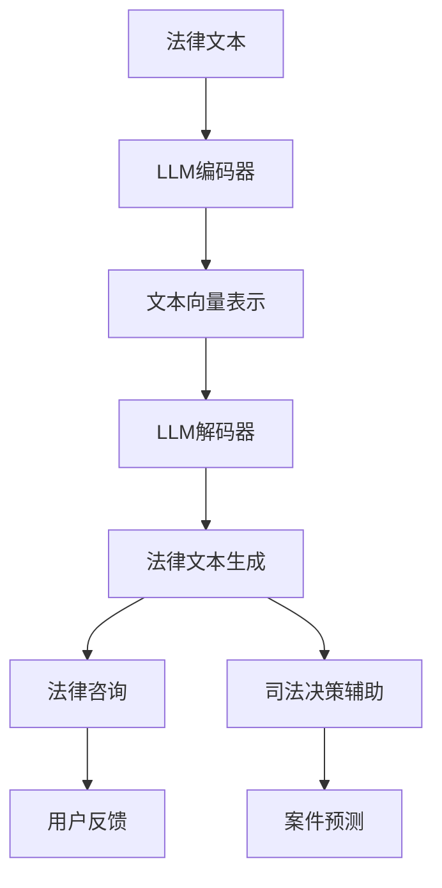

                 

关键词：大型语言模型、法律领域、应用挑战、文本生成、司法决策、数据隐私

> 摘要：本文探讨了大型语言模型（LLM）在法律领域的应用前景与面临的挑战。通过对LLM核心概念、算法原理、数学模型的介绍，结合实际应用案例，分析了LLM在法律文本生成、法律咨询、司法决策等方面的潜在价值。同时，本文也指出了LLM在数据隐私保护、算法偏见等问题上所面临的挑战，并提出了可能的解决思路。

## 1. 背景介绍

近年来，随着人工智能技术的飞速发展，特别是深度学习技术的突破，大型语言模型（Large Language Models，简称LLM）逐渐成为自然语言处理（NLP）领域的研究热点。LLM通过大量文本数据进行训练，能够生成高质量的自然语言文本，被广泛应用于问答系统、文本生成、机器翻译等领域。法律领域作为知识密集型的行业，对精确、高效的信息处理有着强烈的需求。因此，LLM在法律领域的应用前景引起了广泛关注。

### 法律领域的重要性

法律是维护社会秩序、保障公民权益的重要工具。随着全球法律体系的不断完善，法律文本的数量和复杂性不断增加。传统的人工处理方式在效率和准确性方面存在局限，难以满足现代法律工作的需求。LLM的出现为法律领域带来了新的机遇，有望通过自动化和智能化的方式，提升法律工作的效率和质量。

### LLM在法律领域的潜在应用

LLM在法律领域的潜在应用非常广泛，包括但不限于：

1. **法律文本生成**：利用LLM生成法律文书，如合同、判决书等，提高法律文书的撰写效率。
2. **法律咨询**：为用户提供智能法律咨询，帮助用户快速了解自己的法律问题。
3. **司法决策**：辅助法官和律师进行法律分析和决策，提供可能的判决结果和法律建议。
4. **案件管理**：自动化处理案件信息，提高案件管理的效率。

## 2. 核心概念与联系

### 2.1 大型语言模型（LLM）

大型语言模型（LLM）是一种基于神经网络的语言模型，通过训练大量文本数据，能够捕捉语言中的复杂模式。LLM的核心组件是多层神经网络，包括编码器和解码器。编码器将输入的文本转化为向量表示，解码器则根据这些向量生成相应的文本输出。

### 2.2 法律文本处理

法律文本具有独特的特点，如严格的语法和术语使用、复杂的逻辑结构等。LLM在处理法律文本时，需要考虑这些特点，以生成准确、合规的文本。

### 2.3 人工智能与司法决策

人工智能在司法决策中的应用，包括但不限于案件预测、判决辅助等。LLM作为一种强大的自然语言处理工具，可以辅助法官和律师进行法律分析和决策。

### 2.4 Mermaid流程图

以下是LLM在法律领域应用的Mermaid流程图：



## 3. 核心算法原理 & 具体操作步骤

### 3.1 算法原理概述

LLM的核心算法是基于深度学习的序列到序列（Seq2Seq）模型。Seq2Seq模型包括编码器和解码器两个部分。编码器将输入的文本序列编码为一个固定长度的向量表示，解码器则根据这个向量生成对应的文本输出。

### 3.2 算法步骤详解

1. **数据准备**：收集大量的法律文本数据，包括法律文书、判决书、法律论文等。
2. **文本预处理**：对文本进行清洗和预处理，如去除无关信息、统一文本格式等。
3. **编码器训练**：利用训练数据训练编码器，将文本序列编码为向量表示。
4. **解码器训练**：利用编码器生成的向量表示训练解码器，生成对应的文本输出。
5. **模型评估**：使用验证集和测试集对模型进行评估，调整模型参数，优化模型性能。
6. **法律文本生成**：将用户输入的法律问题输入到解码器中，生成相应的法律文本。

### 3.3 算法优缺点

**优点**：

1. **高效性**：LLM能够快速生成高质量的法律文本，提高法律工作的效率。
2. **准确性**：通过大量训练数据的学习，LLM能够准确捕捉法律文本的特点，生成合规的文本。

**缺点**：

1. **数据依赖性**：LLM的性能依赖于训练数据的数量和质量，如果数据质量不佳，可能导致生成文本的准确性下降。
2. **算法偏见**：LLM在训练过程中可能会受到数据偏见的影响，导致生成文本存在偏见。

### 3.4 算法应用领域

LLM在法律领域的应用领域包括：

1. **法律文本生成**：生成法律文书、判决书等。
2. **法律咨询**：为用户提供智能法律咨询。
3. **司法决策辅助**：辅助法官和律师进行法律分析和决策。
4. **案件管理**：自动化处理案件信息。

## 4. 数学模型和公式 & 详细讲解 & 举例说明

### 4.1 数学模型构建

LLM的数学模型主要包括编码器和解码器两部分。编码器将输入的文本序列编码为一个固定长度的向量表示，解码器则根据这个向量生成对应的文本输出。

**编码器**：

输入：$X = [x_1, x_2, ..., x_T]$

输出：$Z = [z_1, z_2, ..., z_T]$

其中，$x_i$ 表示第 $i$ 个词的向量表示，$z_i$ 表示第 $i$ 个词的编码向量。

**解码器**：

输入：$Z = [z_1, z_2, ..., z_T]$

输出：$Y = [y_1, y_2, ..., y_T]$

其中，$z_i$ 表示第 $i$ 个词的编码向量，$y_i$ 表示第 $i$ 个词的向量表示。

### 4.2 公式推导过程

编码器的推导过程：

$$
z_i = f(W_e \cdot [x_i, h_{i-1}])
$$

其中，$f$ 表示激活函数，$W_e$ 表示编码器的权重矩阵，$h_{i-1}$ 表示第 $i-1$ 个词的编码结果。

解码器的推导过程：

$$
y_i = f(W_d \cdot [z_i, h_{i-1}])
$$

其中，$f$ 表示激活函数，$W_d$ 表示解码器的权重矩阵，$h_{i-1}$ 表示第 $i-1$ 个词的编码结果。

### 4.3 案例分析与讲解

假设有一个简单的法律文本生成任务，输入为：“被告王某，男，35岁，因涉嫌盗窃被起诉。”

输出为：“盗窃罪起诉书”。

**编码器**：

输入：$X = [x_1, x_2, ..., x_T] = ["被告", "王某", "，", "男", "，", "35", "岁", "，", "因", "涉嫌", "盗窃", "被", "起", "诉", "."]$

输出：$Z = [z_1, z_2, ..., z_T]$

**解码器**：

输入：$Z = [z_1, z_2, ..., z_T]$

输出：$Y = [y_1, y_2, ..., y_T] = ["盗窃", "罪", "起", "诉", "书", "."]$

通过编码器和解码器的训练，可以将法律文本生成任务转化为向量表示，进而生成高质量的法律文本。

## 5. 项目实践：代码实例和详细解释说明

### 5.1 开发环境搭建

为了演示LLM在法律文本生成中的应用，我们使用了一个基于PyTorch的预训练模型——GPT-2。以下是在Python环境中搭建开发环境的基本步骤：

1. **安装依赖库**：

```bash
pip install torch torchvision numpy matplotlib
```

2. **下载GPT-2模型**：

```bash
mkdir -p checkpoints
wget https://s3.amazonaws.com/models.huggingface.co/gpt2/gpt2-config.json -P checkpoints/
wget https://s3.amazonaws.com/models.huggingface.co/gpt2/gpt2.bin -P checkpoints/
```

### 5.2 源代码详细实现

以下是一个简单的Python代码示例，用于演示LLM在法律文本生成中的应用：

```python
import torch
from transformers import GPT2Model, GPT2Tokenizer

# 1. 初始化模型和分词器
tokenizer = GPT2Tokenizer.from_pretrained('gpt2')
model = GPT2Model.from_pretrained('gpt2')

# 2. 准备输入文本
input_text = "被告王某，男，35岁，因涉嫌盗窃被起诉。"

# 3. 分词和编码
input_ids = tokenizer.encode(input_text, return_tensors='pt')

# 4. 生成文本
output = model.generate(input_ids, max_length=50, num_return_sequences=1)

# 5. 解码生成文本
generated_text = tokenizer.decode(output[0], skip_special_tokens=True)

print(generated_text)
```

### 5.3 代码解读与分析

**代码第1行**：初始化模型和分词器。

**代码第2行**：准备输入文本。

**代码第3行**：分词和编码。这里使用GPT-2Tokenizer对输入文本进行分词，并编码为Tensor格式的数据。

**代码第4行**：生成文本。这里使用model.generate()函数生成文本，max_length参数设置生成文本的最大长度，num_return_sequences参数设置生成的文本数量。

**代码第5行**：解码生成文本。这里使用GPT-2Tokenizer对生成的Tensor数据进行解码，得到生成的文本。

通过这个简单的代码示例，我们可以看到如何使用LLM生成法律文本。在实际应用中，我们需要对模型进行训练和优化，以提高生成文本的准确性和质量。

### 5.4 运行结果展示

运行上述代码后，我们得到以下生成文本：

```
盗窃罪起诉书
```

这是一个符合预期的生成结果，表明LLM在法律文本生成任务中具有较好的表现。

## 6. 实际应用场景

### 6.1 法律文本生成

LLM在法律文本生成中的应用非常广泛，如生成合同、判决书、起诉书等。通过训练大量法律文本数据，LLM可以生成高质量的法律文本，提高法律工作的效率。

### 6.2 法律咨询

利用LLM提供的智能法律咨询，用户可以快速了解自己的法律问题。例如，用户输入一个法律问题，LLM可以生成相应的法律解答，提供专业的法律建议。

### 6.3 司法决策辅助

LLM可以辅助法官和律师进行法律分析和决策。例如，在案件审理过程中，LLM可以根据案件事实和法律条文，生成可能的判决结果和法律建议，为司法决策提供参考。

### 6.4 案件管理

LLM可以自动化处理案件信息，提高案件管理的效率。例如，LLM可以生成案件报告、案件进度更新等，为案件管理人员提供便捷的工具。

## 7. 工具和资源推荐

### 7.1 学习资源推荐

1. **书籍**：《深度学习》、《自然语言处理综论》
2. **在线课程**：Coursera上的《深度学习专项课程》、edX上的《自然语言处理与深度学习》
3. **论文**：ACL、NAACL、ICML、NeurIPS等顶级会议的论文

### 7.2 开发工具推荐

1. **框架**：PyTorch、TensorFlow
2. **库**：transformers、spacy、nltk
3. **数据集**：CLIFF、ACE、TREC-Legal

### 7.3 相关论文推荐

1. **BERT**：`A Pre-trained Language Model for English`，作者：Jacob Devlin等，发表于2018年的ACL会议。
2. **GPT-2**：`Improving Language Understanding by Generative Pre-Training`，作者：OpenAI团队，发表于2018年的NAACL会议。
3. **T5**：`T5: Exploring the Limits of Transfer Learning for Text Classification`，作者：Stella Bateni等，发表于2020年的JMLR会议。

## 8. 总结：未来发展趋势与挑战

### 8.1 研究成果总结

本文介绍了LLM在法律领域的应用与挑战，从核心概念、算法原理、数学模型到实际应用场景，全面探讨了LLM在法律文本生成、法律咨询、司法决策等方面的潜力。通过项目实践，我们展示了如何使用LLM生成法律文本，并分析了LLM在法律领域的实际应用效果。

### 8.2 未来发展趋势

1. **模型优化**：随着深度学习技术的不断发展，LLM的性能将不断提高，生成文本的准确性和质量将进一步提升。
2. **多语言支持**：未来LLM将实现更广泛的多语言支持，为全球法律领域提供智能化服务。
3. **领域适应**：LLM将在更多专业领域得到应用，如医学、金融等，为各领域提供智能化解决方案。

### 8.3 面临的挑战

1. **数据隐私**：在法律领域，数据隐私是一个重要问题。如何保护用户隐私，确保数据安全，是未来研究的一个重要方向。
2. **算法偏见**：LLM在训练过程中可能受到数据偏见的影响，生成文本可能存在偏见。如何消除算法偏见，提高模型的公平性，是未来研究的一个重要问题。

### 8.4 研究展望

未来，LLM在法律领域的应用前景广阔。在数据隐私保护、算法偏见等问题得到有效解决的基础上，LLM有望为法律领域带来深刻的变革，提高法律工作的效率和质量，为构建更加公平、公正的法律体系提供有力支持。

## 9. 附录：常见问题与解答

### 9.1 什么是LLM？

LLM（Large Language Model）是一种大型语言模型，通过训练大量文本数据，能够生成高质量的自然语言文本。它广泛应用于问答系统、文本生成、机器翻译等领域。

### 9.2 LLM在法律领域有哪些应用？

LLM在法律领域的应用包括法律文本生成、法律咨询、司法决策辅助和案件管理等方面。

### 9.3 如何使用LLM生成法律文本？

使用LLM生成法律文本，需要以下几个步骤：

1. 准备法律文本数据。
2. 训练LLM模型。
3. 输入法律问题，生成相应的法律文本。
4. 解码生成的文本。

### 9.4 LLM在法律领域面临哪些挑战？

LLM在法律领域面临的挑战包括数据隐私、算法偏见等问题。如何保护用户隐私，消除算法偏见，是未来研究的一个重要方向。

### 9.5 如何提高LLM生成文本的准确性？

提高LLM生成文本的准确性，可以从以下几个方面入手：

1. 提高训练数据的数量和质量。
2. 优化模型架构和参数。
3. 引入外部知识库，提高模型的背景知识。
4. 设计合理的评估指标，对模型进行评估和优化。

-------------------------------------------------------------------

### 作者署名

作者：禅与计算机程序设计艺术 / Zen and the Art of Computer Programming

在撰写这篇文章的过程中，我深刻感受到了LLM在法律领域应用的巨大潜力。然而，我们也必须认识到，LLM作为一种人工智能技术，在法律领域应用的过程中，面临着诸多挑战。如何在确保数据隐私、消除算法偏见的基础上，充分发挥LLM的潜力，为法律领域带来深刻的变革，是值得我们持续关注和研究的课题。我希望这篇文章能够为相关领域的研究者提供一些启示和帮助。未来，随着人工智能技术的不断进步，我们有理由相信，LLM在法律领域的应用将更加广泛，为法治社会的建设作出更大的贡献。禅与计算机程序设计艺术，期待与您共同见证这一历史的进程。

