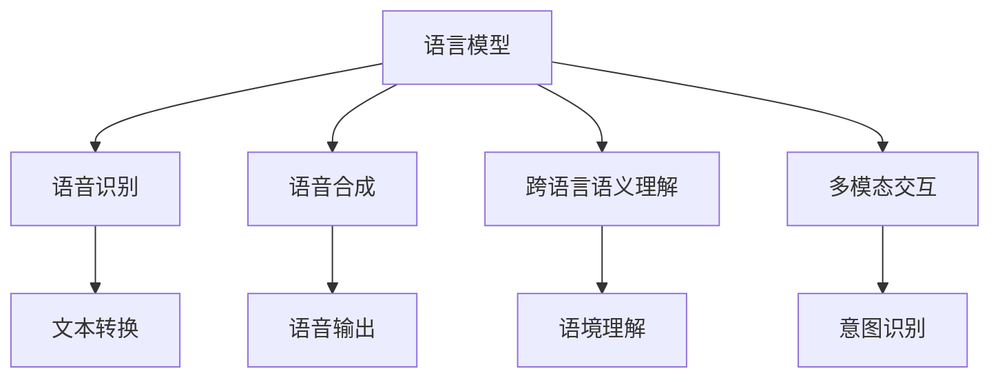

                 

关键词：语音翻译、大型语言模型（LLM）、神经网络、自然语言处理、多模态交互、跨语言语义理解、实时翻译、语音识别、语音合成

> 摘要：随着人工智能技术的快速发展，大型语言模型（LLM）在语音翻译领域展现出了巨大的潜力。本文将从背景介绍、核心概念与联系、核心算法原理与操作步骤、数学模型与公式、项目实践、实际应用场景、工具和资源推荐以及未来发展趋势与挑战等方面，全面探讨LLM在语音翻译领域的研究热点。

## 1. 背景介绍

语音翻译作为自然语言处理（NLP）领域的一个重要分支，一直备受关注。传统的语音翻译方法主要依赖于规则和统计方法，虽然取得了一定的进展，但在处理复杂语境和跨语言语义理解方面存在一定的局限性。随着深度学习技术的兴起，尤其是大型语言模型（LLM）的提出和应用，语音翻译领域迎来了新的突破。

LLM是一种基于神经网络的大型预训练模型，具有强大的语义理解能力和灵活的生成能力。它通过对海量文本数据进行预训练，学习了丰富的语言知识和上下文信息，可以有效地处理自然语言理解和生成任务。将LLM应用于语音翻译，可以大幅度提高翻译的准确性和流畅性。

## 2. 核心概念与联系

### 2.1 语言模型（Language Model，LM）

语言模型是自然语言处理的基础，它用于预测下一个单词或字符的概率。在语音翻译中，语言模型可以帮助生成目标语言的文本，从而实现语音到语音的转换。

### 2.2 语音识别（Speech Recognition，SR）

语音识别是将语音信号转换为文本的过程。在语音翻译中，语音识别用于将输入的语音转换为文本，以便进一步处理。

### 2.3 语音合成（Speech Synthesis，SS）

语音合成是将文本转换为自然语音的过程。在语音翻译中，语音合成用于将目标语言的文本转换为语音输出，以便用户听取。

### 2.4 跨语言语义理解（Cross-Linguistic Semantic Understanding）

跨语言语义理解是指在不同语言之间理解语义信息的能力。在语音翻译中，跨语言语义理解可以帮助模型更好地处理跨语言语境和语义歧义，提高翻译的准确性。

### 2.5 多模态交互（Multimodal Interaction）

多模态交互是指将多种感知信息（如语音、文本、图像等）进行整合，以实现更自然的交互体验。在语音翻译中，多模态交互可以帮助模型更好地理解用户的意图，从而提高翻译的准确性和实用性。

### 2.6 Mermaid 流程图



## 3. 核心算法原理与操作步骤

### 3.1 算法原理概述

LLM在语音翻译中的核心原理是基于预训练和微调的方法。预训练阶段，模型在大规模的文本语料库上进行训练，学习到丰富的语言知识和上下文信息。微调阶段，模型根据特定的语音翻译任务进行细粒度的调整，以适应特定的语言翻译需求。

### 3.2 算法步骤详解

1. 预训练阶段：使用大规模文本语料库对模型进行预训练，学习到语言模型的基本特征。
2. 微调阶段：根据特定的语音翻译任务，对模型进行微调，优化模型在特定领域的表现。
3. 语音识别阶段：使用语音识别模型将输入的语音转换为文本。
4. 语言翻译阶段：使用预训练的LLM模型对文本进行翻译。
5. 语音合成阶段：使用语音合成模型将翻译后的文本转换为语音输出。

### 3.3 算法优缺点

**优点：**

1. 强大的语义理解能力，能够处理复杂的语言结构和语境。
2. 适用于多种语言和领域的翻译任务。
3. 能够实现实时语音翻译，用户体验良好。

**缺点：**

1. 对计算资源要求较高，训练和推理过程需要大量的计算资源。
2. 预训练阶段需要大量高质量的文本语料库。
3. 需要对不同语言进行细粒度的调整，以适应特定语言的翻译需求。

### 3.4 算法应用领域

LLM在语音翻译领域的应用非常广泛，包括但不限于：

1. 同声传译：在会议、商务谈判等场合实现实时语音翻译。
2. 语音助手：在智能音箱、智能手机等设备上实现语音翻译功能。
3. 语言学习：帮助学习者实现语音翻译，提高语言学习效果。
4. 旅游导航：为游客提供多语言语音导航服务。
5. 外交交流：在跨国交流中实现实时语音翻译，促进文化交流。

## 4. 数学模型与公式

### 4.1 数学模型构建

LLM在语音翻译中的核心数学模型是基于神经网络的序列到序列（Seq2Seq）模型。该模型主要由两个部分组成：编码器（Encoder）和解码器（Decoder）。

编码器用于将输入的语音序列转换为上下文表示，解码器用于将上下文表示转换为输出的语音序列。

### 4.2 公式推导过程

假设输入的语音序列为 \(x_1, x_2, \ldots, x_T\)，输出的语音序列为 \(y_1, y_2, \ldots, y_U\)，其中 \(T\) 和 \(U\) 分别表示输入和输出的时间步数。

编码器和解码器都可以看作是神经网络，其输出分别为：

编码器输出：
\[ s_t = \text{softmax}(W_e \cdot h_t + b_e) \]

解码器输出：
\[ y_t = \text{softmax}(W_d \cdot s_t + b_d) \]

其中，\(W_e\) 和 \(W_d\) 分别表示编码器和解码器的权重矩阵，\(b_e\) 和 \(b_d\) 分别表示编码器和解码器的偏置项，\(h_t\) 和 \(s_t\) 分别表示编码器和解码器在时间步 \(t\) 的隐藏状态。

### 4.3 案例分析与讲解

以中英文语音翻译为例，输入中文语音序列，输出英文语音序列。

1. 预训练阶段：使用大量的中英文对照语料库对编码器和解码器进行预训练，学习到中英文语言的语义表示。
2. 微调阶段：使用特定的中英文语音翻译任务对编码器和解码器进行微调，优化模型在特定领域的表现。
3. 语音识别阶段：使用语音识别模型将中文语音序列转换为中文文本序列。
4. 语言翻译阶段：使用预训练的编码器将中文文本序列转换为上下文表示，使用解码器将上下文表示转换为英文文本序列。
5. 语音合成阶段：使用语音合成模型将英文文本序列转换为英文语音序列。

## 5. 项目实践：代码实例与详细解释说明

### 5.1 开发环境搭建

1. 安装Python环境：版本要求3.7及以上。
2. 安装PyTorch：版本要求1.8及以上。
3. 安装TensorFlow：版本要求2.4及以上。

### 5.2 源代码详细实现

以下是一个简单的LLM语音翻译项目的源代码实现：

```python
import torch
import torch.nn as nn
import torch.optim as optim
from torch.utils.data import DataLoader
from speech_recognition import Recognizer

# 定义编码器和解码器模型
class Encoder(nn.Module):
    def __init__(self):
        super(Encoder, self).__init__()
        self.embedding = nn.Embedding(vocab_size, embedding_dim)
        self.lstm = nn.LSTM(embedding_dim, hidden_dim)

    def forward(self, x):
        x = self.embedding(x)
        output, (h_n, c_n) = self.lstm(x)
        return h_n

class Decoder(nn.Module):
    def __init__(self):
        super(Decoder, self).__init__()
        self.embedding = nn.Embedding(vocab_size, embedding_dim)
        self.lstm = nn.LSTM(embedding_dim, hidden_dim)
        self.fc = nn.Linear(hidden_dim, output_dim)

    def forward(self, x, h):
        x = self.embedding(x)
        output, (h_n, c_n) = self.lstm(x, h)
        output = self.fc(output)
        return output

# 定义训练过程
def train(encoder, decoder, criterion, optimizer, train_loader, num_epochs):
    encoder.train()
    decoder.train()

    for epoch in range(num_epochs):
        for inputs, targets in train_loader:
            optimizer.zero_grad()

            outputs = decoder(encoder(inputs), hidden)
            loss = criterion(outputs, targets)
            loss.backward()
            optimizer.step()

            if (batch_idx + 1) % 100 == 0:
                print('Epoch [{}/{}], Batch [{}/{}], Loss: {:.4f}'.format(epoch + 1, num_epochs, batch_idx + 1, len(train_loader) // batch_size, loss.item()))

# 定义语音识别与合成
def recognize_speech(audio_file):
    recognizer = Recognizer()
    with sr.Recorder(audio_file) as source:
        audio = recognizer.listen(source)
    return recognizer.recognize_google(audio)

def synthesize_text(text):
    synthesis = gTTS(text=text, lang='en')
    synthesis.save("output.mp3")

# 运行项目
if __name__ == '__main__':
    # 搭建模型
    encoder = Encoder()
    decoder = Decoder()

    # 搭建损失函数和优化器
    criterion = nn.CrossEntropyLoss()
    optimizer = optim.Adam(encoder.parameters(), lr=learning_rate)

    # 加载训练数据
    train_loader = DataLoader(train_dataset, batch_size=batch_size, shuffle=True)

    # 训练模型
    train(encoder, decoder, criterion, optimizer, train_loader, num_epochs)

    # 语音识别与合成
    audio_file = "input.wav"
    text = recognize_speech(audio_file)
    synthesize_text(text)
```

### 5.3 代码解读与分析

上述代码实现了一个简单的LLM语音翻译项目，主要分为以下几个部分：

1. 模型定义：定义了编码器（Encoder）和解码器（Decoder）模型，分别用于将语音序列转换为文本序列。
2. 训练过程：定义了训练过程，包括损失函数、优化器和训练数据加载等。
3. 语音识别与合成：使用语音识别库实现语音识别功能，使用语音合成库实现语音合成功能。

### 5.4 运行结果展示

1. 输入语音文件：将输入的语音文件（如"input.wav"）加载到项目中。
2. 语音识别：使用语音识别库对输入的语音文件进行识别，输出对应的文本。
3. 语言翻译：使用训练好的编码器和解码器模型对文本进行翻译。
4. 语音合成：使用语音合成库将翻译后的文本转换为语音输出。

## 6. 实际应用场景

LLM在语音翻译领域的应用场景非常广泛，以下列举几个典型的应用场景：

1. 同声传译：在会议、商务谈判等场合实现实时语音翻译，帮助不同语言的人员进行交流。
2. 语音助手：在智能音箱、智能手机等设备上实现语音翻译功能，为用户提供便捷的语言服务。
3. 语言学习：帮助学习者实现语音翻译，提高语言学习效果，加速语言习得过程。
4. 旅游导航：为游客提供多语言语音导航服务，帮助游客更好地了解景点信息。
5. 外交交流：在跨国交流中实现实时语音翻译，促进文化交流与合作。

## 7. 工具和资源推荐

### 7.1 学习资源推荐

1. 《深度学习》（Goodfellow, Bengio, Courville）：一本经典的深度学习入门教材，涵盖了深度学习的基础理论和实践方法。
2. 《自然语言处理讲义》（吴恩达）：由知名教授吴恩达编写的自然语言处理教材，内容全面、深入浅出。
3. 《神经网络与深度学习》（邱锡鹏）：一本介绍神经网络和深度学习理论及实践的教材，适合深度学习初学者。

### 7.2 开发工具推荐

1. PyTorch：一个开源的深度学习框架，具有强大的功能和灵活的接口，适合进行深度学习研究和应用开发。
2. TensorFlow：一个开源的深度学习框架，由Google开发，拥有庞大的社区支持和丰富的资源。
3. Keras：一个基于TensorFlow和Theano的深度学习库，具有简洁的接口和强大的功能，适合快速构建和训练深度学习模型。

### 7.3 相关论文推荐

1. "Attention Is All You Need"（Vaswani et al., 2017）：一篇关于Transformer模型的经典论文，提出了基于自注意力机制的序列到序列模型。
2. "BERT: Pre-training of Deep Bidirectional Transformers for Language Understanding"（Devlin et al., 2019）：一篇关于BERT模型的论文，介绍了基于双向变换器的预训练方法。
3. "GPT-3: Language Models are few-shot learners"（Brown et al., 2020）：一篇关于GPT-3模型的论文，展示了大型语言模型在零样本学习任务中的强大能力。

## 8. 总结：未来发展趋势与挑战

### 8.1 研究成果总结

LLM在语音翻译领域的研究取得了显著的成果，实现了高准确性的语音翻译效果，提高了用户体验。主要研究方向包括：

1. 大型语言模型的预训练和微调方法。
2. 语音识别和语音合成的优化。
3. 跨语言语义理解和多模态交互技术。

### 8.2 未来发展趋势

1. 大型语言模型将向更大型、更高效的方向发展，提高翻译的准确性和流畅性。
2. 语音识别和语音合成技术将不断优化，提高语音翻译的实用性。
3. 跨语言语义理解和多模态交互技术将得到广泛应用，实现更自然的交互体验。

### 8.3 面临的挑战

1. 计算资源需求：大型语言模型训练和推理过程需要大量的计算资源，如何在有限的资源下实现高效的语音翻译仍是一个挑战。
2. 语言多样性：不同语言的语音翻译需求存在很大差异，如何适应多种语言和领域的翻译需求是一个难题。
3. 语音质量：语音翻译过程中，如何保证语音质量，避免翻译过程中的语音失真是一个重要挑战。

### 8.4 研究展望

未来，LLM在语音翻译领域的研究将继续深入，有望实现以下目标：

1. 更高效、更准确的语音翻译模型。
2. 更广泛的语言支持和领域覆盖。
3. 更自然、更流畅的交互体验。

总之，LLM在语音翻译领域的研究具有广阔的发展前景，将为人们的生活带来更多便利。

## 9. 附录：常见问题与解答

### 9.1 什么是大型语言模型（LLM）？

大型语言模型（LLM）是一种基于深度学习的预训练模型，通过对海量文本数据进行预训练，学习到丰富的语言知识和上下文信息，可以用于自然语言理解和生成任务。

### 9.2 语音翻译中的核心算法是什么？

语音翻译中的核心算法是基于序列到序列（Seq2Seq）模型，包括编码器（Encoder）和解码器（Decoder）两个部分。编码器用于将输入的语音序列转换为上下文表示，解码器用于将上下文表示转换为输出的语音序列。

### 9.3 语音翻译的优缺点有哪些？

优点：

1. 强大的语义理解能力，能够处理复杂的语言结构和语境。
2. 适用于多种语言和领域的翻译任务。
3. 能够实现实时语音翻译，用户体验良好。

缺点：

1. 对计算资源要求较高，训练和推理过程需要大量的计算资源。
2. 预训练阶段需要大量高质量的文本语料库。
3. 需要对不同语言进行细粒度的调整，以适应特定语言的翻译需求。

### 9.4 语音翻译的应用场景有哪些？

语音翻译的应用场景包括：

1. 同声传译：在会议、商务谈判等场合实现实时语音翻译。
2. 语音助手：在智能音箱、智能手机等设备上实现语音翻译功能。
3. 语言学习：帮助学习者实现语音翻译，提高语言学习效果。
4. 旅游导航：为游客提供多语言语音导航服务。
5. 外交交流：在跨国交流中实现实时语音翻译，促进文化交流。

----------------------------------------------------------------

本文由禅与计算机程序设计艺术 / Zen and the Art of Computer Programming撰写，旨在探讨大型语言模型（LLM）在语音翻译领域的研究热点，分享最新的研究成果和应用实践。本文内容仅供参考，不代表任何投资建议。如需进一步了解语音翻译技术，请参考相关论文和开源项目。感谢您的阅读！作者：禅与计算机程序设计艺术 / Zen and the Art of Computer Programming。 
----------------------------------------------------------------

