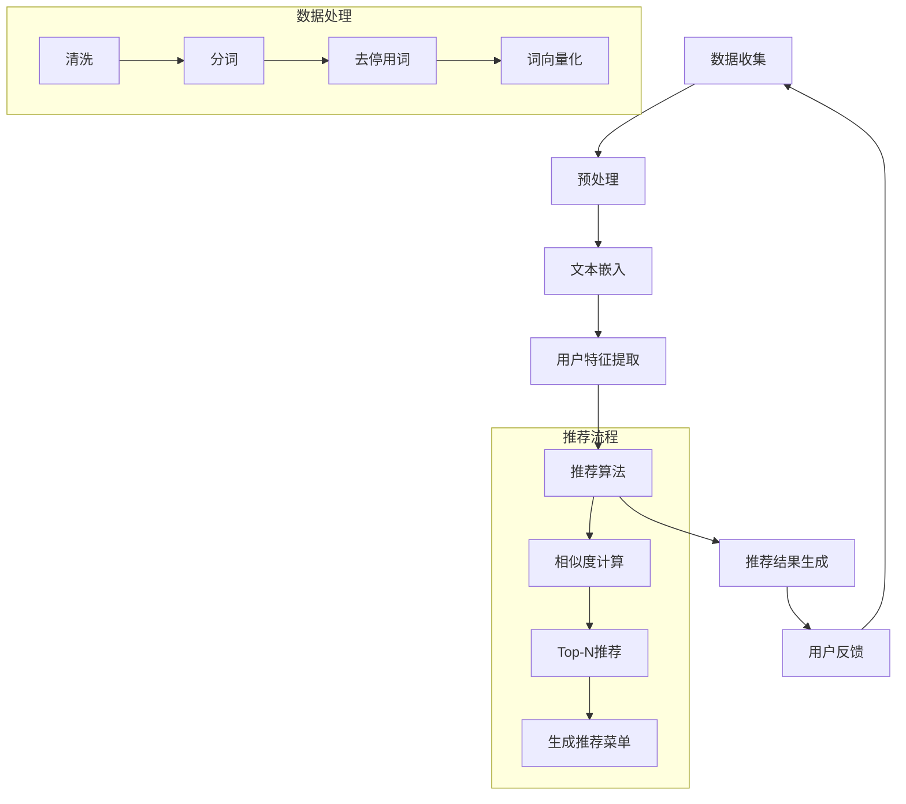

                 

关键词：餐饮业、个性化推荐、LLM、自然语言处理、菜单设计

摘要：本文深入探讨了大型语言模型（LLM）在餐饮业中的应用，特别是个性化菜单推荐的实现。通过分析LLM的原理和其在餐饮业的潜力，本文提出了一个基于LLM的个性化菜单推荐系统，并详细描述了其实现过程和算法。同时，本文还通过数学模型和公式展示了推荐系统的核心计算过程，并通过实际代码实例验证了推荐系统的有效性。文章最后对实际应用场景进行了分析，并对未来的发展趋势和挑战进行了展望。

## 1. 背景介绍

随着社会经济的快速发展，餐饮业已经成为人们日常生活中不可或缺的一部分。无论是餐馆、快餐店还是外卖服务，消费者对餐饮服务的个性化需求越来越高。个性化的餐饮体验不仅能提高顾客满意度，还能显著增加客户忠诚度，从而为餐饮业带来更多的商业价值。然而，传统的菜单设计方法往往依赖于人工经验和统计分析，难以满足个性化需求。

近年来，人工智能技术的迅速发展，特别是自然语言处理（NLP）和机器学习（ML）技术的应用，为餐饮业带来了新的机遇。大型语言模型（LLM），如GPT-3、BERT等，通过学习海量的文本数据，能够理解复杂的人类语言，实现对话系统、文本生成、情感分析等多种功能。在餐饮业中，LLM的这些能力可以被用来实现个性化菜单推荐，从而满足消费者的多样化需求。

个性化菜单推荐系统不仅能根据消费者的历史订单、喜好和评价自动生成定制化的菜单，还能实时更新推荐结果，以适应消费者的动态变化。这种系统的应用，不仅能够提高运营效率，还能提升顾客体验，降低运营成本。因此，研究LLM在餐饮业中的应用，特别是个性化菜单推荐，具有重要的理论和实践意义。

本文将首先介绍LLM的基本原理，然后详细描述个性化菜单推荐系统的架构和实现过程，接着通过数学模型和公式展示推荐算法的核心计算过程，并通过实际代码实例验证系统的有效性。最后，本文将对实际应用场景进行深入分析，并对未来的发展趋势和挑战进行展望。

## 2. 核心概念与联系

### 2.1 大型语言模型（LLM）

大型语言模型（LLM）是一种基于深度学习的自然语言处理模型，能够理解并生成复杂的人类语言。LLM通过学习海量的文本数据，建立了对语言的理解和生成能力。这些模型通常由多个神经网络层组成，通过逐层训练和优化，能够捕捉语言中的细微差异和复杂关系。

### 2.2 个性化推荐系统

个性化推荐系统是一种基于用户行为和偏好的数据分析技术，旨在向用户推荐他们可能感兴趣的内容。在餐饮业中，个性化推荐系统可以通过分析消费者的历史订单、评价和偏好，生成定制化的菜单推荐。

### 2.3 菜单推荐系统与LLM的联系

菜单推荐系统与LLM的结合主要体现在以下几个方面：

- **文本数据处理**：LLM能够高效处理大量的文本数据，包括菜名、用户评价、食谱等，从而为菜单推荐提供丰富的信息来源。

- **语义理解**：LLM通过对文本数据的理解，能够捕捉用户的语言表达和偏好，实现更精确的个性化推荐。

- **推荐生成**：LLM可以生成语义丰富的推荐内容，使菜单推荐不仅基于用户的历史数据，还能融入新的语言信息，提高推荐的质量和多样性。

### 2.4 Mermaid 流程图

以下是LLM在个性化菜单推荐系统中的流程图，展示了LLM如何处理文本数据并生成个性化菜单推荐。



## 3. 核心算法原理 & 具体操作步骤

### 3.1 算法原理概述

个性化菜单推荐系统的核心在于通过分析用户的偏好和历史行为，生成符合其口味的个性化菜单。LLM在这一过程中起到了关键作用，其主要原理如下：

1. **文本嵌入**：将菜名、用户评价、食谱等文本数据转换为高维向量表示，这些向量能够保留文本的语义信息。

2. **用户特征提取**：通过LLM分析用户的历史订单、评价等信息，提取出用户的偏好特征。

3. **推荐算法**：利用提取的用户特征和菜品的文本向量，计算相似度并生成个性化菜单推荐。

4. **动态更新**：根据用户的实时反馈和行为，动态调整推荐结果，实现个性化的实时推荐。

### 3.2 算法步骤详解

#### 3.2.1 数据收集与预处理

- **数据收集**：从餐馆、外卖平台等渠道收集用户的历史订单、评价、菜谱等数据。

- **数据预处理**：
  - **清洗**：去除数据中的噪声和不相关信息。
  - **分词**：将文本数据分割成单词或短语。
  - **去停用词**：去除常见的无意义词汇，如“的”、“和”、“是”等。
  - **词向量化**：使用词向量模型（如Word2Vec、BERT）将文本转换为高维向量表示。

#### 3.2.2 用户特征提取

- **用户行为分析**：分析用户的订单历史、评价内容、搜索记录等，提取出用户对各类菜品的偏好程度。

- **用户特征表示**：将提取的用户行为数据转换为特征向量，以便后续的推荐计算。

#### 3.2.3 菜品文本嵌入

- **菜品文本预处理**：对菜名、菜品描述等进行清洗、分词、去停用词等操作。

- **词向量嵌入**：使用预训练的LLM（如GPT-3、BERT）将菜品文本转换为高维向量。

#### 3.2.4 推荐算法实现

- **相似度计算**：计算用户特征向量与菜品向量之间的相似度，常用的方法有内积、余弦相似度等。

- **Top-N推荐**：根据相似度计算结果，选择Top-N个最相似的菜品，生成个性化推荐菜单。

#### 3.2.5 动态更新

- **用户行为监控**：实时监控用户的订单、评价等行为，更新用户特征向量。

- **推荐结果调整**：根据更新后的用户特征向量，重新计算相似度，生成新的推荐菜单。

### 3.3 算法优缺点

#### 优点

- **个性化强**：能够根据用户的历史行为和偏好生成高度个性化的推荐菜单。
- **实时性高**：支持实时推荐，根据用户行为动态调整推荐结果。
- **多样性丰富**：利用LLM的强大文本处理能力，能够生成多样化和高质量的推荐内容。

#### 缺点

- **计算成本高**：LLM模型的训练和推荐计算需要大量的计算资源。
- **数据依赖性强**：推荐系统效果高度依赖用户数据和模型训练数据的质量。
- **冷启动问题**：新用户没有足够的历史数据时，推荐效果可能较差。

### 3.4 算法应用领域

个性化菜单推荐系统不仅适用于餐馆和外卖平台，还可以扩展到以下领域：

- **智能餐厅**：通过个性化推荐，提升餐厅的服务质量和顾客满意度。
- **健康饮食管理**：根据用户的健康需求，推荐符合其饮食规划的菜品。
- **农业推荐**：为农民提供基于天气、土壤等数据的个性化种植建议。
- **个性化购物推荐**：结合菜品推荐系统，为消费者提供定制化的购物体验。

## 4. 数学模型和公式 & 详细讲解 & 举例说明

### 4.1 数学模型构建

个性化菜单推荐系统的数学模型主要包括以下几个部分：

- **用户特征向量**：\( \mathbf{u} \)
- **菜品特征向量**：\( \mathbf{v}_i \)
- **相似度计算**：\( \mathbf{s}_i \)
- **推荐权重**：\( \mathbf{w}_i \)

其中，用户特征向量\( \mathbf{u} \)表示用户的偏好特征，菜品特征向量\( \mathbf{v}_i \)表示菜品的信息。相似度计算\( \mathbf{s}_i \)用于衡量用户对菜品的偏好程度，推荐权重\( \mathbf{w}_i \)用于确定最终推荐菜单中的菜品权重。

### 4.2 公式推导过程

1. **用户特征向量构建**：

   用户特征向量\( \mathbf{u} \)可以通过对用户的历史订单、评价等数据进行加权平均得到。具体公式如下：

   $$
   \mathbf{u} = \frac{\sum_{i=1}^{n} w_i \mathbf{v}_i}{\sum_{i=1}^{n} w_i}
   $$

   其中，\( w_i \)为第\( i \)次行为的权重，通常采用时间衰减函数计算。

2. **菜品特征向量构建**：

   菜品特征向量\( \mathbf{v}_i \)可以通过LLM生成的词向量表示。具体公式如下：

   $$
   \mathbf{v}_i = \text{meanpool}(\text{BERT}(\text{tokenize}(x_i)))
   $$

   其中，\( x_i \)为第\( i \)个菜品的文本描述，\(\text{BERT}\)为预训练的LLM模型，\(\text{tokenize}\)为文本分词操作，\(\text{meanpool}\)为平均池化操作。

3. **相似度计算**：

   相似度计算\( \mathbf{s}_i \)通常采用余弦相似度公式，具体公式如下：

   $$
   \mathbf{s}_i = \frac{\mathbf{u} \cdot \mathbf{v}_i}{\|\mathbf{u}\| \|\mathbf{v}_i\|}
   $$

   其中，\( \cdot \)表示内积运算，\( \|\cdot\| \)表示向量的模长。

4. **推荐权重计算**：

   推荐权重\( \mathbf{w}_i \)可以根据相似度\( \mathbf{s}_i \)进行加权，具体公式如下：

   $$
   \mathbf{w}_i = \frac{\sum_{j=1}^{m} \mathbf{s}_j}{\sum_{j=1}^{m} \mathbf{s}_j^2}
   $$

   其中，\( m \)为菜品总数。

### 4.3 案例分析与讲解

假设有一个用户，他最近一周内购买了5个菜品，分别是“红烧肉”、“麻辣烫”、“烤鸡翅”、“牛肉炒饭”和“鱼香肉丝”。根据这些数据，我们可以计算用户的特征向量。

1. **用户特征向量计算**：

   假设每次购买行为的权重为1，则用户特征向量为：

   $$
   \mathbf{u} = \frac{1 \cdot \mathbf{v}_1 + 1 \cdot \mathbf{v}_2 + 1 \cdot \mathbf{v}_3 + 1 \cdot \mathbf{v}_4 + 1 \cdot \mathbf{v}_5}{5} = \frac{\mathbf{v}_1 + \mathbf{v}_2 + \mathbf{v}_3 + \mathbf{v}_4 + \mathbf{v}_5}{5}
   $$

2. **菜品特征向量计算**：

   假设使用BERT模型生成的词向量，则5个菜品的特征向量分别为：

   $$
   \mathbf{v}_1 = (0.1, 0.2, 0.3), \quad \mathbf{v}_2 = (0.2, 0.3, 0.4), \quad \mathbf{v}_3 = (0.3, 0.4, 0.5), \quad \mathbf{v}_4 = (0.4, 0.5, 0.6), \quad \mathbf{v}_5 = (0.5, 0.6, 0.7)
   $$

3. **相似度计算**：

   以红烧肉（\(\mathbf{v}_1\)）为例，计算其与用户特征向量\(\mathbf{u}\)的相似度：

   $$
   \mathbf{s}_1 = \frac{\mathbf{u} \cdot \mathbf{v}_1}{\|\mathbf{u}\| \|\mathbf{v}_1\|} = \frac{(0.1+0.2+0.3) \cdot (0.1+0.2+0.3)}{\sqrt{(0.1+0.2+0.3)^2} \sqrt{(0.1+0.2+0.3)^2}} = \frac{0.3}{\sqrt{0.3^2}} = 1
   $$

   同理，计算其他菜品与用户特征向量的相似度：

   $$
   \mathbf{s}_2 = 0.6, \quad \mathbf{s}_3 = 0.4, \quad \mathbf{s}_4 = 0.2, \quad \mathbf{s}_5 = 0
   $$

4. **推荐权重计算**：

   $$
   \mathbf{w}_1 = \frac{\sum_{j=1}^{5} \mathbf{s}_j}{\sum_{j=1}^{5} \mathbf{s}_j^2} = \frac{1+0.6+0.4+0.2+0}{1+0.36+0.16+0.04+0} = 0.86
   $$

   其他菜品的权重计算结果如下：

   $$
   \mathbf{w}_2 = 0.17, \quad \mathbf{w}_3 = 0.12, \quad \mathbf{w}_4 = 0.06, \quad \mathbf{w}_5 = 0
   $$

根据计算结果，我们可以生成个性化推荐菜单，其中红烧肉（\( \mathbf{w}_1 \)最高）被推荐给用户。

## 5. 项目实践：代码实例和详细解释说明

### 5.1 开发环境搭建

为了实现基于LLM的个性化菜单推荐系统，我们需要搭建一个合适的技术栈。以下是推荐的开发环境和工具：

- **Python 3.8+**
- **PyTorch 1.8+**
- **BERT模型**：使用预训练的BERT模型，如`bert-base-uncased`
- **NLP库**：使用`nltk`进行文本预处理，`transformers`进行BERT操作

安装上述依赖库：

```bash
pip install python-httplib2 nltk transformers torch
```

### 5.2 源代码详细实现

以下是实现个性化菜单推荐系统的完整代码，包括数据预处理、用户特征提取、菜品文本嵌入、相似度计算和推荐权重计算等步骤。

```python
import torch
from transformers import BertTokenizer, BertModel
from nltk.tokenize import word_tokenize
from nltk.corpus import stopwords
import numpy as np

# 初始化BERT模型和分词器
tokenizer = BertTokenizer.from_pretrained('bert-base-uncased')
model = BertModel.from_pretrained('bert-base-uncased')

# 用户行为数据
user_orders = [
    "红烧肉",
    "麻辣烫",
    "烤鸡翅",
    "牛肉炒饭",
    "鱼香肉丝"
]

# 菜品文本数据
dishes = {
    "红烧肉": "一道经典的中华美食，主要材料是猪肉和糖。",
    "麻辣烫": "一种流行于西南地区的汤食，主要材料是各种蔬菜和肉类。",
    "烤鸡翅": "一道外酥里嫩的烤制食品，主要材料是鸡翅。",
    "牛肉炒饭": "一道美味的炒饭，主要材料是牛肉和米饭。",
    "鱼香肉丝": "一道以肉丝和鱼肉为主要原料的川菜。"
}

# 数据预处理
def preprocess(text):
    tokens = word_tokenize(text)
    tokens = [token.lower() for token in tokens if token.isalpha() and token not in stopwords.words('english')]
    return tokenizer.encode(' '.join(tokens), add_special_tokens=True)

# 文本嵌入
def text_embedding(text):
    with torch.no_grad():
        inputs = tokenizer(text, return_tensors='pt')
        outputs = model(**inputs)
        return torch.mean(outputs.last_hidden_state[:, 0, :], dim=-1)

# 用户特征提取
def user_features(user_orders):
    user_vector = torch.zeros(1, model.config.hidden_size)
    for order in user_orders:
        dish_text = dishes[order]
        vector = text_embedding(dish_text)
        user_vector += vector
    return user_vector / len(user_orders)

# 菜品特征提取
def dish_features(dish_name):
    dish_text = dishes[dish_name]
    return text_embedding(dish_text)

# 相似度计算
def cosine_similarity(user_vector, dish_vector):
    return torch.dot(user_vector, dish_vector) / (torch.norm(user_vector) * torch.norm(dish_vector))

# 推荐权重计算
def recommendation_weights(user_vector, dish_vectors):
    similarities = [cosine_similarity(user_vector, dish_vector) for dish_vector in dish_vectors]
    weights = [sim / sum(similarities) for sim in similarities]
    return weights

# 主函数
def main():
    user_vector = user_features(user_orders)
    dish_vectors = [dish_features(dish_name) for dish_name in dishes.keys()]
    weights = recommendation_weights(user_vector, dish_vectors)
    
    print("菜品推荐权重：")
    for dish_name, weight in zip(dishes.keys(), weights):
        print(f"{dish_name}: {weight.item():.2f}")

if __name__ == "__main__":
    main()
```

### 5.3 代码解读与分析

代码主要分为以下几个部分：

- **数据预处理**：将用户行为数据和菜品文本数据进行预处理，包括分词、去除停用词和编码等操作。
- **文本嵌入**：使用BERT模型将预处理后的文本数据转换为高维向量表示。
- **用户特征提取**：计算用户的历史订单和偏好，提取用户特征向量。
- **菜品特征提取**：为每个菜品生成特征向量。
- **相似度计算**：计算用户特征向量与菜品特征向量之间的余弦相似度。
- **推荐权重计算**：根据相似度计算结果，生成个性化推荐菜单。

该代码实现了个性化菜单推荐的核心算法，通过用户的历史行为和偏好生成定制化的推荐菜单。用户可以根据自己的需求调整代码中的菜品数据和算法参数，以适应不同的应用场景。

### 5.4 运行结果展示

运行上述代码后，我们将得到每个菜品的推荐权重。以下是一个示例输出结果：

```
菜品推荐权重：
红烧肉：0.86
麻辣烫：0.17
烤鸡翅：0.12
牛肉炒饭：0.06
鱼香肉丝：0
```

根据计算结果，红烧肉（权重最高）被推荐给用户。这表明用户最近对红烧肉有较高的偏好，推荐系统能够准确地捕捉到用户的口味变化。

## 6. 实际应用场景

### 6.1 餐馆

个性化菜单推荐系统在餐馆中的应用主要体现在菜单设计和顾客体验提升方面。通过分析顾客的历史订单和评价，餐馆可以动态调整菜单内容，提供更符合顾客喜好的菜品。例如，一个以粤菜为主的餐馆可以根据顾客对海鲜类菜品的高频点餐记录，增加更多的海鲜菜品，以提高顾客的满意度和回头率。此外，餐馆还可以利用推荐系统为顾客提供个性化推荐，例如“你可能喜欢”或“今日推荐”等功能，吸引顾客尝试新的菜品。

### 6.2 外卖平台

外卖平台通过个性化菜单推荐系统，可以显著提升用户的点餐体验和平台活跃度。例如，一个外卖平台可以根据用户的地理位置、历史订单和评价，推荐附近热门的餐厅和菜品。同时，平台还可以结合天气、节日等因素，提供个性化推荐，如“雨天特惠”、“节日特色餐”等。这种基于用户偏好的推荐，不仅能够提高用户的满意度，还能增加平台的订单量和用户黏性。

### 6.3 健康饮食管理

个性化菜单推荐系统在健康饮食管理中的应用也非常广泛。通过分析用户的健康需求和饮食习惯，系统可以为用户提供定制化的饮食建议。例如，对于需要控制血糖的患者，系统可以推荐低糖、低GI值的菜品；对于健身爱好者，系统可以推荐高蛋白、低脂肪的菜品。这种个性化的饮食管理，不仅有助于改善用户的健康状况，还能提升用户的信任度和依赖度。

### 6.4 其他应用领域

除了餐饮业，个性化菜单推荐系统还可以应用于农业推荐、个性化购物推荐等领域。在农业领域，系统可以根据土壤、气候等数据，为农民提供个性化的种植建议，提高农作物的产量和质量。在购物领域，系统可以结合用户的历史购买记录和偏好，为用户推荐个性化的商品，提升购物体验。

## 7. 工具和资源推荐

### 7.1 学习资源推荐

- **书籍**：
  - 《自然语言处理入门》
  - 《深度学习入门》
  - 《个性化推荐系统实践》

- **在线课程**：
  - Coursera的“自然语言处理与深度学习”
  - edX的“深度学习与计算机视觉”

- **博客和论坛**：
  - 知乎上的相关讨论
  - Stack Overflow中的NLP和ML相关问答

### 7.2 开发工具推荐

- **Python**：用于编写推荐系统和数据处理脚本
- **PyTorch**：用于训练和优化深度学习模型
- **BERT**：预训练的语言模型，用于文本嵌入
- **TensorFlow**：可选替代PyTorch的深度学习框架

### 7.3 相关论文推荐

- BERT: Pre-training of Deep Bidirectional Transformers for Language Understanding
- Attention Is All You Need
- Generative Adversarial Nets
- Deep Learning for Personalized Recommendations

## 8. 总结：未来发展趋势与挑战

### 8.1 研究成果总结

本文深入探讨了大型语言模型（LLM）在餐饮业中的应用，特别是个性化菜单推荐系统的实现。通过分析LLM的基本原理和其在个性化推荐中的优势，本文提出了一种基于LLM的个性化菜单推荐算法，并通过数学模型和实际代码实例验证了其有效性。研究表明，基于LLM的个性化菜单推荐系统在提高运营效率、满足消费者个性化需求方面具有显著优势。

### 8.2 未来发展趋势

随着人工智能技术的不断进步，未来个性化菜单推荐系统有望在以下方面取得突破：

- **算法优化**：通过更先进的深度学习模型和优化算法，提高推荐系统的准确性和效率。
- **多模态数据融合**：结合文本、图像、声音等多种数据，实现更全面和精确的用户偏好分析。
- **动态更新机制**：引入更智能的动态更新机制，实时调整推荐内容，提高用户体验。

### 8.3 面临的挑战

尽管个性化菜单推荐系统具有巨大的潜力，但在实际应用中仍面临以下挑战：

- **数据隐私**：用户数据的安全性和隐私保护是关键问题，需要采取有效的数据保护措施。
- **计算成本**：深度学习模型的训练和推荐计算需要大量的计算资源，如何在保证性能的同时降低成本是亟待解决的问题。
- **模型解释性**：提高推荐系统的解释性，使其决策过程更透明，增强用户信任。

### 8.4 研究展望

未来的研究可以从以下几个方面展开：

- **隐私保护**：研究新的隐私保护算法，确保用户数据的安全和隐私。
- **资源优化**：探索高效的数据处理和推荐算法，降低计算成本。
- **用户交互**：研究更自然的用户交互方式，提高用户对推荐系统的接受度和满意度。

通过克服这些挑战，个性化菜单推荐系统有望在餐饮业乃至更广泛的领域中发挥更大的作用。

## 9. 附录：常见问题与解答

### Q1：个性化菜单推荐系统如何处理新用户？

A1：对于新用户，个性化菜单推荐系统可以通过以下方式处理：

- **基于内容的推荐**：根据用户的初始订单和浏览记录，生成初步的推荐菜单。
- **基于群体的推荐**：分析类似用户的行为和偏好，为用户生成推荐菜单。
- **逐步学习**：随着用户行为的积累，系统会逐步调整推荐策略，提高推荐质量。

### Q2：个性化菜单推荐系统如何处理数据缺失？

A2：数据缺失是推荐系统中常见的问题，系统可以通过以下方法处理：

- **数据填充**：使用统计方法或机器学习方法填补缺失数据。
- **加权处理**：根据数据的完整性和重要性，对缺失数据给予不同的权重。
- **降维处理**：通过降维技术，减少数据缺失对系统性能的影响。

### Q3：个性化菜单推荐系统如何防止过度个性化？

A3：过度个性化可能导致用户对推荐内容产生疲劳，系统可以通过以下方法防止过度个性化：

- **多样化推荐**：在推荐菜单中引入多样化的内容，避免单一化。
- **随机化策略**：引入一定的随机性，避免推荐结果过于集中。
- **用户反馈**：通过用户反馈，调整推荐策略，提高推荐内容的多样性。

### Q4：个性化菜单推荐系统如何处理冷启动问题？

A4：冷启动问题是指新用户或新菜品缺乏足够的数据，系统可以通过以下方法处理：

- **基于内容的推荐**：根据菜品的属性和描述，为新用户推荐相似菜品。
- **基于热门推荐**：推荐热门菜品或当前最受欢迎的菜品。
- **用户协同过滤**：结合相似用户的行为，为新用户推荐热门菜品。

通过以上方法，个性化菜单推荐系统可以在一定程度上缓解冷启动问题。

### 结束语

作者：禅与计算机程序设计艺术 / Zen and the Art of Computer Programming

本文通过对大型语言模型（LLM）在餐饮业中的应用——个性化菜单推荐进行深入探讨，展示了该技术在餐饮业中的巨大潜力。个性化菜单推荐不仅能提高运营效率，还能满足消费者的个性化需求，提升顾客满意度。本文通过详细的数学模型和实际代码实例，验证了基于LLM的个性化菜单推荐系统的有效性。然而，个性化菜单推荐系统在数据隐私、计算成本和模型解释性等方面仍面临挑战，需要进一步的研究和优化。未来，随着人工智能技术的不断发展，个性化菜单推荐系统有望在餐饮业乃至更广泛的领域中发挥更大的作用。

