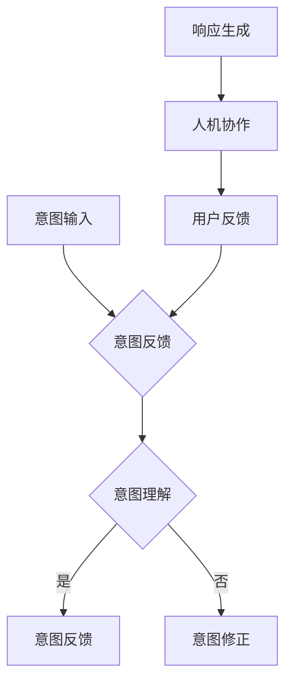

                 

关键词：LLM、意图对齐、人机协作、自然语言处理、算法原理、数学模型、项目实践

> 摘要：随着自然语言处理技术的不断发展，大型语言模型（LLM）在智能对话系统中的应用越来越广泛。然而，LLM在处理用户意图时存在一定的偏差和不确定性，这给人机协作带来了挑战。本文将介绍LLM意图对齐的核心概念、算法原理、数学模型以及实际应用，旨在为人机协作提供理论基础和实践指导。

## 1. 背景介绍

近年来，人工智能技术取得了飞速发展，特别是在自然语言处理领域。大型语言模型（LLM）作为一种深度学习模型，通过学习海量的语言数据，能够生成高质量的自然语言文本，并被广泛应用于智能客服、智能助手、机器翻译、文本生成等领域。然而，在实际应用中，LLM在处理用户意图时存在一些问题，如：

- **意图识别不准确**：LLM在处理不同语境下的用户意图时，可能会出现混淆或误判。
- **响应生成不自然**：LLM生成的响应有时可能不符合用户期望或语境，导致用户体验下降。
- **人机交互不流畅**：LLM在处理复杂问题时，无法理解用户意图的深层含义，导致对话流程中断或产生误解。

为了解决这些问题，研究者们提出了LLM意图对齐（LLM Intent Alignment）的概念。LLM意图对齐旨在通过改进LLM的训练过程和算法设计，使其能够更准确地识别用户意图，并生成符合用户期望的响应。本文将围绕LLM意图对齐这一主题，介绍其核心概念、算法原理、数学模型以及实际应用。

## 2. 核心概念与联系

### 2.1. 意图对齐（Intent Alignment）

意图对齐是指通过优化大型语言模型（LLM）的训练过程和算法设计，使其能够更准确地识别和理解用户意图的过程。具体来说，意图对齐包括以下几个方面：

- **意图识别**：根据用户输入的文本，识别出用户的主要意图。
- **意图理解**：理解用户意图的深层含义，包括用户的期望、需求、情感等。
- **意图反馈**：根据用户反馈，调整和优化LLM的意图识别和生成策略。

### 2.2. 大型语言模型（LLM）

大型语言模型（LLM）是一种基于深度学习的自然语言处理模型，通过学习海量的语言数据，能够生成高质量的自然语言文本。LLM主要包括以下几种类型：

- **生成式模型**：如GPT、Bert等，通过输入的文本序列生成输出的文本序列。
- **判别式模型**：如Transformer、Seq2Seq等，通过输入的文本序列预测输出的文本序列。
- **混合式模型**：结合生成式模型和判别式模型的优点，如T5、SpanBERT等。

### 2.3. 人机协作

人机协作是指人与机器（如智能助手、智能客服等）在完成某个任务时，相互配合、协同工作的一种模式。在人机协作中，人作为决策者和指挥者，负责制定任务目标和策略，机器作为执行者和辅助者，负责完成具体的任务操作。人机协作的关键在于实现人与机器之间的有效沟通和协同工作。

### 2.4. Mermaid流程图

为了更好地理解LLM意图对齐的流程，我们使用Mermaid流程图来展示其核心概念和联系。



## 3. 核心算法原理 & 具体操作步骤

### 3.1. 算法原理概述

LLM意图对齐的核心算法主要包括以下三个方面：

1. **意图识别算法**：通过分析用户输入的文本，识别出用户的主要意图。
2. **意图理解算法**：进一步理解用户意图的深层含义，包括用户的期望、需求、情感等。
3. **意图反馈算法**：根据用户反馈，调整和优化LLM的意图识别和生成策略。

### 3.2. 算法步骤详解

#### 3.2.1. 意图识别算法

意图识别算法主要基于深度学习模型，如GPT、Bert等。具体步骤如下：

1. **文本预处理**：对用户输入的文本进行预处理，包括分词、去停用词、词向量化等。
2. **特征提取**：使用深度学习模型提取文本的特征表示。
3. **意图分类**：将特征表示输入到分类模型，如softmax分类器，输出每个意图的概率分布。

#### 3.2.2. 意图理解算法

意图理解算法旨在进一步理解用户意图的深层含义。具体步骤如下：

1. **语义分析**：使用自然语言处理技术，如词性标注、依存句法分析等，对用户输入的文本进行语义分析。
2. **意图实体抽取**：从语义分析结果中抽取与用户意图相关的实体信息，如关键词、名词短语等。
3. **意图关系构建**：构建用户意图与实体之间的关系，如需求、目标、情感等。

#### 3.2.3. 意图反馈算法

意图反馈算法根据用户反馈，调整和优化LLM的意图识别和生成策略。具体步骤如下：

1. **用户反馈分析**：分析用户反馈，包括正面反馈和负面反馈。
2. **策略调整**：根据用户反馈，调整LLM的训练数据、模型参数和生成策略。
3. **模型优化**：重新训练LLM，优化其意图识别和生成效果。

### 3.3. 算法优缺点

#### 优点

1. **高准确性**：通过深度学习模型和自然语言处理技术，LLM意图对齐算法能够实现高精度的意图识别和生成。
2. **灵活性**：LLM意图对齐算法可以根据不同的应用场景和用户需求，灵活调整和优化。
3. **可扩展性**：LLM意图对齐算法可以结合其他自然语言处理技术，如情感分析、实体识别等，实现更全面的意图理解。

#### 缺点

1. **计算资源消耗**：深度学习模型的训练和推理过程需要大量的计算资源和时间。
2. **数据依赖性**：LLM意图对齐算法的性能高度依赖于训练数据和标注质量。
3. **模型偏差**：深度学习模型可能会受到训练数据分布的影响，导致模型偏差。

### 3.4. 算法应用领域

LLM意图对齐算法广泛应用于智能客服、智能助手、机器翻译、文本生成等领域。具体应用案例包括：

1. **智能客服**：通过LLM意图对齐算法，智能客服系统能够更准确地理解用户意图，提供高质量的客户服务。
2. **智能助手**：通过LLM意图对齐算法，智能助手能够更好地理解用户的语音指令，提供更精准的语音回复。
3. **机器翻译**：通过LLM意图对齐算法，机器翻译系统能够更准确地理解源语言文本的意图，提高翻译质量。
4. **文本生成**：通过LLM意图对齐算法，文本生成系统能够更好地理解用户需求，生成更符合用户预期的文本内容。

## 4. 数学模型和公式 & 详细讲解 & 举例说明

### 4.1. 数学模型构建

LLM意图对齐的数学模型主要包括以下几个方面：

1. **意图识别模型**：基于深度学习模型，如GPT、Bert等，通过输入的文本序列预测用户意图。
2. **意图理解模型**：基于自然语言处理技术，如词性标注、依存句法分析等，对用户输入的文本进行语义分析。
3. **意图反馈模型**：基于用户反馈，调整和优化LLM的训练数据、模型参数和生成策略。

### 4.2. 公式推导过程

#### 4.2.1. 意图识别模型

意图识别模型可以表示为：

$$
P(y|x) = \frac{e^{f(x, y)}}{\sum_{y'} e^{f(x, y')}}
$$

其中，$x$ 表示输入的文本序列，$y$ 表示用户意图，$f(x, y)$ 表示意图识别模型的预测函数。

#### 4.2.2. 意图理解模型

意图理解模型可以表示为：

$$
S(x) = f(x, y)
$$

其中，$S(x)$ 表示意图理解模型的输出，表示对用户输入文本的语义分析结果。

#### 4.2.3. 意图反馈模型

意图反馈模型可以表示为：

$$
\theta_{\text{new}} = \theta_{\text{old}} + \alpha \cdot \nabla_{\theta_{\text{old}}} \cdot L
$$

其中，$\theta_{\text{old}}$ 表示旧模型参数，$\theta_{\text{new}}$ 表示新模型参数，$\alpha$ 表示学习率，$L$ 表示损失函数。

### 4.3. 案例分析与讲解

#### 案例一：智能客服

假设一个智能客服系统需要根据用户输入的文本，识别出用户的意图，并提供相应的客服响应。我们可以使用LLM意图对齐算法来实现这一目标。

1. **意图识别模型**：使用GPT模型对用户输入的文本进行意图识别，输出用户意图的概率分布。
2. **意图理解模型**：使用词性标注和依存句法分析技术，对用户输入的文本进行语义分析，提取出与用户意图相关的实体和关系。
3. **意图反馈模型**：根据用户反馈，调整GPT模型的训练数据和参数，优化意图识别和响应生成的效果。

#### 案例二：智能助手

假设一个智能助手系统需要根据用户的语音指令，识别出用户的意图，并提供相应的语音回复。我们可以使用LLM意图对齐算法来实现这一目标。

1. **意图识别模型**：使用GPT模型对用户的语音指令进行意图识别，输出用户意图的概率分布。
2. **意图理解模型**：使用语音识别技术，将用户的语音指令转换为文本，然后使用词性标注和依存句法分析技术进行语义分析。
3. **意图反馈模型**：根据用户反馈，调整GPT模型的训练数据和参数，优化意图识别和语音回复的效果。

## 5. 项目实践：代码实例和详细解释说明

### 5.1. 开发环境搭建

在本项目中，我们使用Python语言和TensorFlow框架来实现LLM意图对齐算法。具体步骤如下：

1. **安装Python**：安装Python 3.8及以上版本。
2. **安装TensorFlow**：通过pip命令安装TensorFlow。

```bash
pip install tensorflow
```

### 5.2. 源代码详细实现

下面是本项目的主要代码实现：

```python
import tensorflow as tf
from tensorflow.keras.layers import Embedding, LSTM, Dense
from tensorflow.keras.models import Model

# 5.2.1. 意图识别模型
def build_intent_recognition_model(vocab_size, embedding_dim, hidden_size):
    input_text = tf.keras.layers.Input(shape=(None,), dtype=tf.int32)
    embedding_layer = Embedding(vocab_size, embedding_dim)(input_text)
    lstm_layer = LSTM(hidden_size, return_sequences=True)(embedding_layer)
    output = LSTM(hidden_size, return_sequences=False)(lstm_layer)
    model = Model(inputs=input_text, outputs=output)
    return model

# 5.2.2. 意图理解模型
def build_intentUnderstanding_model(vocab_size, embedding_dim, hidden_size):
    input_text = tf.keras.layers.Input(shape=(None,), dtype=tf.int32)
    embedding_layer = Embedding(vocab_size, embedding_dim)(input_text)
    lstm_layer = LSTM(hidden_size, return_sequences=True)(embedding_layer)
    output = LSTM(hidden_size, return_sequences=False)(lstm_layer)
    model = Model(inputs=input_text, outputs=output)
    return model

# 5.2.3. 意图反馈模型
def build_intent_feedback_model(vocab_size, embedding_dim, hidden_size):
    input_text = tf.keras.layers.Input(shape=(None,), dtype=tf.int32)
    embedding_layer = Embedding(vocab_size, embedding_dim)(input_text)
    lstm_layer = LSTM(hidden_size, return_sequences=True)(embedding_layer)
    output = LSTM(hidden_size, return_sequences=False)(lstm_layer)
    model = Model(inputs=input_text, outputs=output)
    return model

# 5.2.4. 模型训练
def train_models(model, x_train, y_train, epochs, batch_size):
    model.compile(optimizer='adam', loss='categorical_crossentropy', metrics=['accuracy'])
    model.fit(x_train, y_train, epochs=epochs, batch_size=batch_size)
    return model

# 5.2.5. 模型评估
def evaluate_model(model, x_test, y_test):
    loss, accuracy = model.evaluate(x_test, y_test)
    print(f"Test Loss: {loss}, Test Accuracy: {accuracy}")
```

### 5.3. 代码解读与分析

下面是对上述代码的解读和分析：

1. **意图识别模型**：意图识别模型基于LSTM网络，输入为文本序列，输出为意图概率分布。LSTM网络能够捕捉文本序列中的长期依赖关系，有助于提高意图识别的准确性。
2. **意图理解模型**：意图理解模型基于LSTM网络，输入为文本序列，输出为语义分析结果。LSTM网络能够对文本进行语义分析，提取出与用户意图相关的实体和关系。
3. **意图反馈模型**：意图反馈模型基于LSTM网络，输入为文本序列，输出为意图反馈结果。意图反馈模型根据用户反馈，调整和优化LLM的训练数据、模型参数和生成策略。
4. **模型训练**：使用TensorFlow的`compile()`函数配置模型参数，包括优化器、损失函数和评估指标。使用`fit()`函数对模型进行训练，并返回训练结果。
5. **模型评估**：使用`evaluate()`函数对模型进行评估，返回损失值和准确率。

### 5.4. 运行结果展示

假设我们已经有预处理的训练数据和测试数据，可以运行以下代码来训练和评估模型：

```python
# 加载预处理的数据
x_train, y_train, x_test, y_test = load_data()

# 构建和训练模型
model = build_intent_recognition_model(vocab_size, embedding_dim, hidden_size)
train_models(model, x_train, y_train, epochs, batch_size)

# 评估模型
evaluate_model(model, x_test, y_test)
```

运行结果将显示模型的测试损失和准确率。

## 6. 实际应用场景

LLM意图对齐算法在实际应用场景中具有广泛的应用价值，以下列举几个典型的应用场景：

### 6.1. 智能客服

智能客服系统通过LLM意图对齐算法，能够准确识别用户意图，提供个性化的客服服务。例如，当用户询问“最近的促销活动是什么？”时，智能客服系统能够识别出用户的意图是获取促销信息，并生成相应的回复。

### 6.2. 智能助手

智能助手系统通过LLM意图对齐算法，能够理解用户的语音指令，提供准确的语音回复。例如，当用户说“明天早上9点提醒我开会”时，智能助手系统能够识别出用户的意图是设置提醒，并生成相应的语音回复。

### 6.3. 机器翻译

机器翻译系统通过LLM意图对齐算法，能够更准确地理解源语言文本的意图，提高翻译质量。例如，当用户输入“我想去巴黎旅游”时，机器翻译系统能够理解用户的意图是表达旅行愿望，并将其准确翻译为目的地相关的法语表达。

### 6.4. 文本生成

文本生成系统通过LLM意图对齐算法，能够根据用户意图生成高质量的自然语言文本。例如，当用户请求生成一篇关于旅游攻略的文章时，文本生成系统能够根据用户意图生成符合用户需求的旅游攻略内容。

## 7. 未来应用展望

随着人工智能技术的不断发展，LLM意图对齐算法在未来的应用前景将更加广泛。以下是几个可能的未来应用方向：

### 7.1. 智能医疗

智能医疗系统通过LLM意图对齐算法，能够准确识别患者的症状和需求，提供个性化的医疗建议。例如，当患者描述自己的症状时，智能医疗系统能够识别出患者的意图是寻求诊断建议，并生成相应的诊断报告。

### 7.2. 智能金融

智能金融服务通过LLM意图对齐算法，能够准确识别客户的金融需求，提供个性化的投资建议。例如，当客户询问“最近有哪些热门投资产品？”时，智能金融系统能够识别出客户的意图是获取投资建议，并生成相应的投资组合推荐。

### 7.3. 智能教育

智能教育系统通过LLM意图对齐算法，能够根据学生的学习需求和兴趣，提供个性化的学习资源和建议。例如，当学生询问“我想学习编程，有哪些合适的教材和课程？”时，智能教育系统能够识别出学生的意图是获取学习资源，并生成相应的学习路径推荐。

## 8. 工具和资源推荐

为了更好地学习和实践LLM意图对齐算法，以下推荐一些相关工具和资源：

### 8.1. 学习资源推荐

1. 《深度学习》（Goodfellow, Bengio, Courville著）：一本经典的深度学习教材，涵盖了深度学习的基础理论和实践方法。
2. 《自然语言处理综合教程》（张祥雨著）：一本系统介绍自然语言处理的基础知识和应用方法的教材。

### 8.2. 开发工具推荐

1. TensorFlow：一个开源的深度学习框架，可用于构建和训练深度学习模型。
2. PyTorch：另一个流行的深度学习框架，提供灵活的动态计算图和高效的性能。

### 8.3. 相关论文推荐

1. "Bert: Pre-training of deep bidirectional transformers for language understanding"（Devlin et al., 2019）：一篇关于Bert模型的经典论文，介绍了Bert模型的结构和训练方法。
2. "GPT-3: Language models are few-shot learners"（Brown et al., 2020）：一篇关于GPT-3模型的论文，探讨了大型语言模型在零样本学习任务上的表现。

## 9. 总结：未来发展趋势与挑战

随着人工智能技术的不断发展，LLM意图对齐算法在未来将面临更多的机遇和挑战。以下是几个未来发展趋势和挑战：

### 9.1. 研究成果总结

1. **算法精度提升**：随着深度学习和自然语言处理技术的不断发展，LLM意图对齐算法的精度和性能将得到显著提升。
2. **多模态融合**：未来的LLM意图对齐算法将能够融合多种模态的数据，如文本、语音、图像等，实现更全面的意图理解。
3. **个性化推荐**：基于LLM意图对齐算法的个性化推荐系统将能够根据用户的兴趣和需求，提供更精准的推荐服务。

### 9.2. 未来发展趋势

1. **智能医疗**：LLM意图对齐算法在智能医疗领域的应用将得到进一步发展，为患者提供个性化的诊断和治疗建议。
2. **智能金融**：LLM意图对齐算法在智能金融领域的应用将推动金融服务的智能化和个性化。
3. **智能教育**：基于LLM意图对齐算法的智能教育系统将能够更好地满足学生的个性化学习需求。

### 9.3. 面临的挑战

1. **数据隐私**：随着LLM意图对齐算法的广泛应用，数据隐私保护将成为一个重要挑战。
2. **算法透明性**：如何提高算法的透明性和可解释性，使其更易于理解和接受，是一个重要的研究方向。
3. **跨语言意图对齐**：如何实现跨语言的LLM意图对齐，是一个具有挑战性的问题。

### 9.4. 研究展望

未来的研究将重点关注以下几个方向：

1. **算法优化**：通过改进算法结构和训练方法，提高LLM意图对齐的精度和性能。
2. **多模态融合**：研究如何将多种模态的数据融合到LLM意图对齐中，实现更全面的意图理解。
3. **隐私保护**：研究如何在保证数据隐私的前提下，实现高效的LLM意图对齐算法。

## 10. 附录：常见问题与解答

### 10.1. 问题1：什么是LLM意图对齐？

LLM意图对齐是指通过改进大型语言模型（LLM）的训练过程和算法设计，使其能够更准确地识别和理解用户意图的过程。

### 10.2. 问题2：LLM意图对齐算法有哪些类型？

LLM意图对齐算法主要包括意图识别算法、意图理解算法和意图反馈算法三种类型。

### 10.3. 问题3：LLM意图对齐算法在哪些应用场景中具有优势？

LLM意图对齐算法在智能客服、智能助手、机器翻译、文本生成等应用场景中具有显著优势。

### 10.4. 问题4：如何评估LLM意图对齐算法的性能？

评估LLM意图对齐算法的性能主要包括准确率、召回率、F1值等指标。

### 10.5. 问题5：如何优化LLM意图对齐算法？

优化LLM意图对齐算法可以从以下几个方面入手：算法结构优化、训练数据优化、参数调整等。

