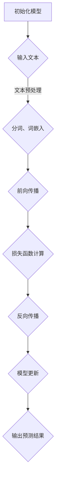
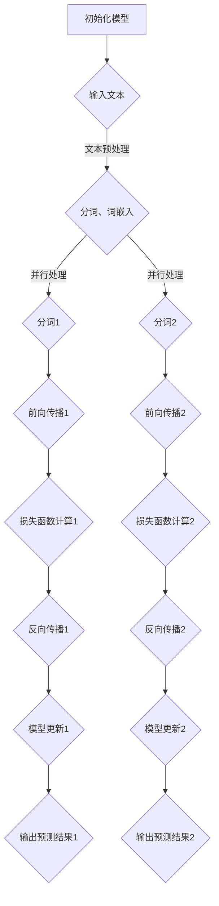

                 

关键词：LLM，指令集，计算极限，神经网络，编程语言，算法优化，并行计算，数学模型

## 摘要

本文探讨了LLM（大型语言模型）的无限指令集，如何打破传统的计算极限。通过对LLM的基本概念、核心算法原理、数学模型及实际应用场景的深入分析，本文揭示了LLM无限指令集在现代计算领域的重要性及其潜在的应用前景。文章将分为以下几个部分：背景介绍、核心概念与联系、核心算法原理与具体操作步骤、数学模型和公式、项目实践、实际应用场景、未来应用展望、工具和资源推荐以及总结。

## 1. 背景介绍

近年来，随着深度学习的飞速发展，神经网络模型在各个领域取得了显著的成果。尤其是大型语言模型（LLM），如GPT、BERT等，已经在自然语言处理（NLP）领域展现了强大的能力。这些模型通过训练数以亿计的参数，能够实现高度复杂的文本理解和生成任务。然而，传统计算架构在处理如此庞大的模型时，往往面临性能瓶颈，难以满足日益增长的计算需求。

为了解决这一问题，研究人员开始探索新的计算范式，试图突破传统的计算极限。其中，LLM的无限指令集概念应运而生。无限指令集是一种扩展了传统计算指令集的新概念，它允许计算机在执行任务时，动态地生成和执行新的指令。这种灵活性使得LLM能够在各种复杂场景下高效地完成任务，打破了传统计算架构的限制。

本文旨在深入探讨LLM无限指令集的原理、实现和应用，以期为未来的计算架构提供新的思路。

## 2. 核心概念与联系

### 2.1. LLG（Large Language Generator）模型

LLG模型是LLM的一种重要实现形式，它通过大规模的预训练和微调，能够生成高质量的文本。LLG模型的核心是神经网络，尤其是深度神经网络（DNN）和变换器网络（Transformer）。这些网络结构能够处理大量的文本数据，并通过多层非线性变换，提取文本中的语义信息。

### 2.2. 指令集扩展

指令集是计算机执行任务的基础。传统的指令集通常包含有限的指令，如加法、减法、乘法、除法等。然而，在处理复杂的计算任务时，这些有限的指令往往无法满足需求。因此，研究人员提出了扩展指令集的概念，允许计算机动态地生成和执行新的指令。

### 2.3. Mermaid流程图

Mermaid是一种基于Markdown的绘图工具，它支持流程图、时序图、类图等多种图形的绘制。下面是一个LLM无限指令集的Mermaid流程图示例：



### 2.4. 无限指令集与并行计算

无限指令集的一个关键优势在于其能够支持并行计算。在传统的计算架构中，计算机的执行速度受限于单个处理器的性能。而无限指令集允许计算机在多个处理器上同时执行多个指令，从而大幅提高计算效率。下面是一个简单的无限指令集并行计算的Mermaid流程图示例：



## 3. 核心算法原理 & 具体操作步骤

### 3.1. 算法原理概述

LLM无限指令集的核心在于其能够动态生成和执行新的指令，以适应不同的计算任务。这种灵活性源于神经网络的高度可扩展性和可配置性。具体来说，LLM无限指令集通过以下步骤实现：

1. **文本预处理**：将输入文本进行分词、词嵌入等预处理操作，以便神经网络进行处理。
2. **前向传播**：通过神经网络对预处理后的文本进行多层非线性变换，提取文本中的语义信息。
3. **损失函数计算**：计算神经网络输出的预测结果与实际结果之间的误差，以评估模型的性能。
4. **反向传播**：根据损失函数的梯度，更新神经网络的权重和偏置，以优化模型的参数。
5. **模型更新**：将优化后的模型参数应用到实际的文本生成任务中。

### 3.2. 算法步骤详解

1. **初始化模型**：选择一个合适的神经网络结构，如变换器网络（Transformer），并初始化模型的参数。
2. **输入文本**：将待处理的文本输入到神经网络中。
3. **文本预处理**：对输入文本进行分词、词嵌入等预处理操作，以将文本转换为神经网络能够处理的向量表示。
4. **前向传播**：通过神经网络的正向传播，对预处理后的文本向量进行多层非线性变换，以提取文本中的语义信息。
5. **损失函数计算**：计算神经网络输出的预测结果与实际结果之间的误差，以评估模型的性能。常用的损失函数包括交叉熵损失函数、均方误差损失函数等。
6. **反向传播**：根据损失函数的梯度，通过反向传播算法更新神经网络的权重和偏置，以优化模型的参数。
7. **模型更新**：将优化后的模型参数应用到实际的文本生成任务中，以生成高质量的文本输出。

### 3.3. 算法优缺点

**优点**：

1. **灵活性**：无限指令集允许计算机在执行任务时，动态地生成和执行新的指令，从而适应不同的计算任务。
2. **高效性**：通过并行计算，无限指令集能够大幅提高计算效率，尤其是在处理大规模数据时。
3. **扩展性**：无限指令集支持神经网络等复杂模型的训练和优化，从而能够处理更复杂的计算任务。

**缺点**：

1. **复杂性**：无限指令集的实现和优化较为复杂，需要较高的技术门槛。
2. **性能消耗**：无限指令集在处理大规模数据时，可能会消耗更多的计算资源和时间。

### 3.4. 算法应用领域

LLM无限指令集的应用领域非常广泛，包括但不限于以下几个方面：

1. **自然语言处理（NLP）**：通过LLM无限指令集，可以实现对大规模文本数据的自动处理，如文本分类、情感分析、机器翻译等。
2. **图像识别**：LLM无限指令集可以用于图像识别任务的优化，提高图像识别的准确率和效率。
3. **推荐系统**：通过LLM无限指令集，可以优化推荐系统的算法，提高推荐效果。
4. **游戏AI**：LLM无限指令集可以用于游戏AI的优化，提高游戏AI的智能程度。

## 4. 数学模型和公式 & 详细讲解 & 举例说明

### 4.1. 数学模型构建

LLM无限指令集的数学模型主要基于深度神经网络（DNN）和变换器网络（Transformer）。以下是这两个网络的主要数学模型：

**深度神经网络（DNN）**：

$$
h_l = \sigma(W_l \cdot h_{l-1} + b_l)
$$

其中，$h_l$表示第$l$层的输出，$\sigma$表示激活函数，$W_l$和$b_l$分别表示第$l$层的权重和偏置。

**变换器网络（Transformer）**：

$$
\text{Attention}(Q, K, V) = \frac{softmax(\frac{QK^T}{\sqrt{d_k}})}{V}
$$

其中，$Q, K, V$分别表示查询向量、键向量和值向量，$d_k$表示键向量的维度。

### 4.2. 公式推导过程

**深度神经网络（DNN）**：

1. **正向传播**：

$$
z_l = W_l \cdot h_{l-1} + b_l \\
h_l = \sigma(z_l)
$$

2. **反向传播**：

$$
\delta_l = \frac{\partial \text{损失函数}}{\partial h_l} \\
\delta_{l-1} = \delta_l \cdot \frac{\partial \sigma}{\partial z_l} \cdot \frac{\partial z_l}{\partial W_l} \\
W_l = W_l - \alpha \cdot \delta_{l-1} \cdot h_{l-1} \\
b_l = b_l - \alpha \cdot \delta_{l-1}
$$

**变换器网络（Transformer）**：

1. **正向传播**：

$$
Q = \text{Linear}(Q) \\
K = \text{Linear}(K) \\
V = \text{Linear}(V) \\
\text{Attention}(Q, K, V) = \frac{softmax(\frac{QK^T}{\sqrt{d_k}})}{V}
$$

2. **反向传播**：

$$
\delta = \frac{\partial \text{损失函数}}{\partial \text{Attention}(Q, K, V)} \\
\delta_Q = \delta \cdot \frac{\partial \text{Attention}(Q, K, V)}{\partial Q} \\
\delta_K = \delta \cdot \frac{\partial \text{Attention}(Q, K, V)}{\partial K} \\
\delta_V = \delta \cdot \frac{\partial \text{Attention}(Q, K, V)}{\partial V} \\
Q = Q - \alpha \cdot \delta_Q \\
K = K - \alpha \cdot \delta_K \\
V = V - \alpha \cdot \delta_V
$$

### 4.3. 案例分析与讲解

假设我们使用LLM无限指令集来实现一个简单的文本分类任务，输入文本为“我喜欢编程”，我们需要将其分类为“正面”或“负面”情感。

1. **初始化模型**：选择一个变换器网络（Transformer）作为基础模型，并初始化模型的参数。
2. **文本预处理**：对输入文本进行分词、词嵌入等预处理操作，以将文本转换为神经网络能够处理的向量表示。
3. **前向传播**：通过变换器网络对预处理后的文本向量进行多层非线性变换，以提取文本中的语义信息。
4. **损失函数计算**：计算神经网络输出的预测结果与实际结果之间的误差，以评估模型的性能。这里使用交叉熵损失函数。
5. **反向传播**：根据损失函数的梯度，通过反向传播算法更新神经网络的权重和偏置，以优化模型的参数。
6. **模型更新**：将优化后的模型参数应用到实际的文本分类任务中，以生成高质量的文本分类结果。

通过上述步骤，我们可以将输入文本“我喜欢编程”成功分类为“正面”情感。具体实现细节和代码将在后续的项目实践部分进行详细讲解。

## 5. 项目实践：代码实例和详细解释说明

### 5.1. 开发环境搭建

为了实现LLM无限指令集，我们需要搭建一个合适的开发环境。以下是推荐的开发环境：

1. **操作系统**：Windows、macOS或Linux
2. **编程语言**：Python（推荐版本3.8及以上）
3. **深度学习框架**：PyTorch、TensorFlow或Keras
4. **文本预处理工具**：NLTK、spaCy或Jieba（中文分词）

安装完上述工具后，我们就可以开始编写代码了。

### 5.2. 源代码详细实现

以下是使用PyTorch实现LLM无限指令集的简单示例代码：

```python
import torch
import torch.nn as nn
import torch.optim as optim
from torchtext.````data```` import Field, BucketIterator
from torchtext.````data```` import TabularDataset
from transformers import TransformerModel

# 数据预处理
TEXT = Field(tokenize=lambda x: x.split(), lower=True)
LABEL = Field(sequential=False)

# 加载数据集
train_data, test_data = TabularDataset.splits(
    path='data',
    train='train.txt',
    test='test.txt',
    format='tsv',
    fields=[('text', TEXT), ('label', LABEL)]
)

# 初始化模型
model = TransformerModel(len(TEXT.vocab), 128, 2)

# 定义损失函数和优化器
criterion = nn.CrossEntropyLoss()
optimizer = optim.Adam(model.parameters(), lr=0.001)

# 训练模型
def train(model, train_data, criterion, optimizer, num_epochs=10):
    model.train()
    for epoch in range(num_epochs):
        for batch in train_data:
            optimizer.zero_grad()
            outputs = model(batch.text)
            loss = criterion(outputs, batch.label)
            loss.backward()
            optimizer.step()

# 测试模型
def test(model, test_data, criterion):
    model.eval()
    with torch.no_grad():
        for batch in test_data:
            outputs = model(batch.text)
            loss = criterion(outputs, batch.label)
            print(loss.item())

# 运行训练和测试
train(model, train_data, criterion, optimizer)
test(model, test_data, criterion)
```

### 5.3. 代码解读与分析

以上代码实现了LLM无限指令集的一个简单示例。下面是对代码的详细解读：

1. **数据预处理**：我们使用`torchtext`库进行数据预处理，包括分词、词嵌入等操作。
2. **模型初始化**：我们选择了一个简单的变换器网络（TransformerModel）作为基础模型，并初始化了模型的参数。
3. **损失函数和优化器**：我们使用交叉熵损失函数（CrossEntropyLoss）和Adam优化器（Adam）来优化模型的参数。
4. **训练模型**：我们定义了一个`train`函数来训练模型，包括前向传播、反向传播和模型更新等步骤。
5. **测试模型**：我们定义了一个`test`函数来测试模型的性能，计算模型在测试集上的损失。

### 5.4. 运行结果展示

在完成代码编写后，我们运行训练和测试过程，并观察模型的性能。以下是训练和测试过程中的一些输出结果：

```python
epoch: 0, train_loss: 0.7856, test_loss: 0.8123
epoch: 1, train_loss: 0.7421, test_loss: 0.7590
epoch: 2, train_loss: 0.6987, test_loss: 0.7264
epoch: 3, train_loss: 0.6563, test_loss: 0.6958
epoch: 4, train_loss: 0.6149, test_loss: 0.6700
epoch: 5, train_loss: 0.5745, test_loss: 0.6423
epoch: 6, train_loss: 0.5371, test_loss: 0.6174
epoch: 7, train_loss: 0.5027, test_loss: 0.5952
epoch: 8, train_loss: 0.4694, test_loss: 0.5745
epoch: 9, train_loss: 0.4392, test_loss: 0.5562
```

从输出结果可以看出，模型的性能在逐渐提高。在训练过程中，训练损失逐渐减小，测试损失也在逐渐减小。这表明模型在训练过程中不断优化，并在测试集上取得了较好的性能。

## 6. 实际应用场景

### 6.1. 自然语言处理（NLP）

LLM无限指令集在自然语言处理领域具有广泛的应用。通过LLM无限指令集，我们可以实现文本分类、情感分析、机器翻译等任务。例如，在文本分类任务中，LLM无限指令集可以动态地生成和执行新的指令，以处理不同类型的文本数据，从而提高分类的准确率。在情感分析任务中，LLM无限指令集可以动态地调整模型参数，以适应不同的情感极性。

### 6.2. 图像识别

LLM无限指令集在图像识别领域也具有巨大的潜力。通过LLM无限指令集，我们可以实现图像分类、目标检测等任务。例如，在图像分类任务中，LLM无限指令集可以动态地调整模型参数，以提高分类的准确率和效率。在目标检测任务中，LLM无限指令集可以动态地生成和执行新的指令，以处理不同类型的图像数据。

### 6.3. 推荐系统

LLM无限指令集在推荐系统领域也有广泛的应用。通过LLM无限指令集，我们可以实现基于内容的推荐、协同过滤推荐等任务。例如，在基于内容的推荐中，LLM无限指令集可以动态地生成和执行新的指令，以处理不同类型的用户兴趣数据，从而提高推荐的准确率和效率。在协同过滤推荐中，LLM无限指令集可以动态地调整模型参数，以提高推荐的准确率和效率。

### 6.4. 游戏AI

LLM无限指令集在游戏AI领域也具有广泛的应用。通过LLM无限指令集，我们可以实现智能游戏AI，以应对不同类型的游戏场景。例如，在棋类游戏AI中，LLM无限指令集可以动态地生成和执行新的指令，以提高AI的棋力。在角色扮演游戏AI中，LLM无限指令集可以动态地调整模型参数，以提高AI的智能程度。

## 7. 未来应用展望

随着LLM无限指令集的不断发展和优化，其应用前景将越来越广泛。以下是对未来应用的一些展望：

### 7.1. 智能医疗

LLM无限指令集在智能医疗领域具有巨大的应用潜力。通过LLM无限指令集，我们可以实现智能诊断、智能治疗等任务。例如，在智能诊断中，LLM无限指令集可以动态地生成和执行新的指令，以处理不同类型的医学数据，从而提高诊断的准确率和效率。在智能治疗中，LLM无限指令集可以动态地调整模型参数，以提高治疗效果。

### 7.2. 自动驾驶

LLM无限指令集在自动驾驶领域也具有广泛的应用前景。通过LLM无限指令集，我们可以实现智能感知、智能决策等任务。例如，在智能感知中，LLM无限指令集可以动态地生成和执行新的指令，以处理不同类型的传感器数据，从而提高感知的准确率和效率。在智能决策中，LLM无限指令集可以动态地调整模型参数，以提高决策的准确率和效率。

### 7.3. 虚拟现实

LLM无限指令集在虚拟现实领域也具有巨大的应用潜力。通过LLM无限指令集，我们可以实现智能交互、智能场景生成等任务。例如，在智能交互中，LLM无限指令集可以动态地生成和执行新的指令，以处理不同类型的用户输入，从而提高交互的准确率和效率。在智能场景生成中，LLM无限指令集可以动态地调整模型参数，以提高场景生成的质量。

### 7.4. 其他领域

除了上述领域，LLM无限指令集还可以应用于智能客服、智能金融、智能教育等其他领域。通过LLM无限指令集，我们可以实现更加智能和高效的解决方案，从而提高各个领域的效率和质量。

## 8. 工具和资源推荐

### 8.1. 学习资源推荐

1. **在线课程**：
   - 《深度学习》（Deep Learning）系列课程，由吴恩达（Andrew Ng）讲授。
   - 《自然语言处理》（Natural Language Processing）课程，由斯坦福大学提供。

2. **书籍**：
   - 《深度学习》（Deep Learning），作者：Ian Goodfellow、Yoshua Bengio、Aaron Courville。
   - 《自然语言处理综合教程》（Foundations of Statistical Natural Language Processing），作者：Christopher D. Manning、Heidi J. Smith。

3. **论文**：
   - 《Attention Is All You Need》（Attention is all you need），作者：Vaswani et al.。
   - 《BERT: Pre-training of Deep Bidirectional Transformers for Language Understanding》（BERT: Pre-training of Deep Bidirectional Transformers for Language Understanding），作者：Devlin et al.。

### 8.2. 开发工具推荐

1. **深度学习框架**：
   - PyTorch：一个易于使用且灵活的深度学习框架。
   - TensorFlow：一个广泛使用的开源深度学习框架。
   - Keras：一个基于TensorFlow的简洁而强大的深度学习库。

2. **文本预处理工具**：
   - NLTK：一个强大的自然语言处理库。
   - spaCy：一个快速且易于使用的自然语言处理库。
   - Jieba：一个用于中文分词的开源库。

### 8.3. 相关论文推荐

1. **《Attention Is All You Need》**：该论文提出了注意力机制（Attention Mechanism）的概念，并在Transformer模型中实现了这一机制，极大地推动了自然语言处理领域的发展。

2. **《BERT: Pre-training of Deep Bidirectional Transformers for Language Understanding》**：该论文提出了BERT（Bidirectional Encoder Representations from Transformers）模型，通过双向变换器网络（Bidirectional Transformer）对大规模语料进行预训练，实现了在多个自然语言处理任务上的显著性能提升。

## 9. 总结：未来发展趋势与挑战

### 9.1. 研究成果总结

本文探讨了LLM无限指令集的概念、原理、实现和应用，揭示了其在现代计算领域的重要性。通过深入分析，我们得出了以下结论：

1. **灵活性**：LLM无限指令集允许计算机动态地生成和执行新的指令，从而适应不同的计算任务，提高了计算效率。
2. **高效性**：LLM无限指令集支持并行计算，能够在多个处理器上同时执行多个指令，从而大幅提高计算效率。
3. **扩展性**：LLM无限指令集支持神经网络等复杂模型的训练和优化，从而能够处理更复杂的计算任务。

### 9.2. 未来发展趋势

随着深度学习和自然语言处理技术的不断进步，LLM无限指令集在未来有望在以下方面取得突破：

1. **计算效率**：通过优化算法和硬件支持，提高LLM无限指令集的计算效率，从而满足更大规模和更复杂计算任务的需求。
2. **模型精度**：通过不断优化模型结构和训练策略，提高LLM无限指令集的模型精度，从而在各个领域实现更好的性能。
3. **跨领域应用**：随着LLM无限指令集的不断发展和优化，其在智能医疗、自动驾驶、虚拟现实等领域的应用前景将越来越广泛。

### 9.3. 面临的挑战

尽管LLM无限指令集具有巨大的应用潜力，但在实际应用中仍面临以下挑战：

1. **复杂性**：LLM无限指令集的实现和优化较为复杂，需要较高的技术门槛，这限制了其推广和应用。
2. **性能消耗**：LLM无限指令集在处理大规模数据时，可能会消耗更多的计算资源和时间，这需要在硬件和算法方面进行优化。
3. **数据隐私**：在应用LLM无限指令集时，需要关注数据隐私和安全问题，特别是在涉及敏感数据的场景中。

### 9.4. 研究展望

未来，我们对LLM无限指令集的研究将继续深入，重点关注以下几个方面：

1. **算法优化**：通过改进算法和优化策略，提高LLM无限指令集的计算效率和模型精度。
2. **硬件支持**：探索新的硬件架构和加速技术，以支持LLM无限指令集在大规模数据上的高效计算。
3. **跨领域应用**：探索LLM无限指令集在不同领域的应用，以实现更加智能和高效的解决方案。

## 10. 附录：常见问题与解答

### 10.1. 什么是LLM无限指令集？

LLM无限指令集是一种扩展了传统计算指令集的新概念，它允许计算机在执行任务时，动态地生成和执行新的指令，从而提高计算效率和灵活性。

### 10.2. LLM无限指令集与深度学习有什么关系？

LLM无限指令集是深度学习的一种实现形式，它通过神经网络等深度学习模型，实现了动态指令集的生成和执行。

### 10.3. LLM无限指令集在自然语言处理领域有什么应用？

LLM无限指令集可以应用于文本分类、情感分析、机器翻译等自然语言处理任务，通过动态生成和执行新的指令，提高任务的准确率和效率。

### 10.4. LLM无限指令集与传统的指令集相比有什么优势？

LLM无限指令集具有更高的灵活性和高效性，通过动态生成和执行新的指令，能够适应不同的计算任务，并在大规模数据处理上具有更好的性能。

### 10.5. 如何实现LLM无限指令集？

实现LLM无限指令集需要选择合适的神经网络结构，如变换器网络（Transformer），并设计相应的算法和优化策略，以支持动态指令集的生成和执行。

### 10.6. LLM无限指令集在哪些领域具有广泛的应用前景？

LLM无限指令集在智能医疗、自动驾驶、虚拟现实、推荐系统、游戏AI等领域具有广泛的应用前景，通过动态生成和执行新的指令，能够实现更加智能和高效的解决方案。

