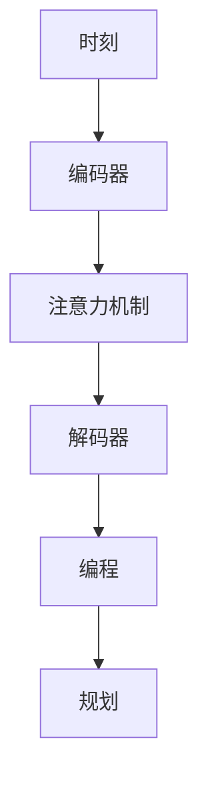

                 

关键词：LLM架构、时刻、指令集、编程、规划、人工智能

摘要：本文将对LLM（大型语言模型）的架构进行深入解析，涵盖时刻、指令集、编程和规划等方面。通过对这些核心概念的详细阐述，我们将帮助读者更好地理解LLM的工作原理和应用场景，为未来的研究和开发提供有益的参考。

## 1. 背景介绍

近年来，随着深度学习技术的不断发展，大型语言模型（LLM）已经成为自然语言处理（NLP）领域的重要工具。LLM具有强大的语言理解和生成能力，广泛应用于文本分类、机器翻译、对话系统等领域。然而，LLM的架构复杂，涉及众多关键技术，如时刻、指令集、编程和规划等。本文将围绕这些核心概念，对LLM架构进行深入剖析，以期为读者提供全面的了解。

### 1.1 LLM的发展历程

LLM的发展可以追溯到2000年代初，当时以神经网络为基础的语言模型开始崭露头角。2003年，Giza和SRILM等统计机器翻译系统为语言模型的开发提供了有力支持。2013年，Word2Vec等词向量模型的提出，为语言模型引入了新的表达方式。此后，随着深度学习技术的不断突破，LLM的性能得到了显著提升。

### 1.2 LLM的应用领域

LLM在多个应用领域取得了显著成果，主要包括：

1. **文本分类**：如新闻分类、情感分析等；
2. **机器翻译**：如中英文翻译、多语言翻译等；
3. **对话系统**：如聊天机器人、虚拟助手等；
4. **文本生成**：如文章生成、摘要生成等。

## 2. 核心概念与联系

为了更好地理解LLM的架构，我们需要先了解一些核心概念，如时刻、指令集、编程和规划等。

### 2.1 时刻

在LLM中，时刻是指模型在处理文本序列时，对每个时间步的标记进行编码和解析的过程。时刻在LLM中具有重要作用，它决定了模型对序列数据的处理顺序和注意力机制。

### 2.2 指令集

指令集是指LLM在处理文本序列时所遵循的一套操作规则。这些规则定义了模型如何对输入数据进行编码、解码和处理。常见的指令集包括：

1. **词嵌入**：将文本中的每个词映射为一个高维向量；
2. **编码器**：对输入序列进行编码，提取关键信息；
3. **解码器**：对编码后的序列进行解码，生成输出序列；
4. **注意力机制**：在处理序列数据时，模型会关注序列中的关键信息，以便更好地理解语义。

### 2.3 编程

编程是指在LLM中实现各种算法和操作的过程。通过编程，我们可以定义模型的结构、参数和训练过程。常见的编程框架包括TensorFlow、PyTorch等。

### 2.4 规划

规划是指LLM在处理复杂任务时，如何根据任务需求和资源约束，制定最优策略。在LLM中，规划通常涉及到以下几个方面：

1. **任务分解**：将复杂任务分解为多个子任务；
2. **资源分配**：根据任务需求和资源情况，合理分配计算资源；
3. **优化策略**：采用优化算法，如动态规划、深度强化学习等，提高模型性能。

### 2.5 Mermaid 流程图

为了更直观地展示LLM架构中的核心概念和联系，我们可以使用Mermaid流程图进行描述。以下是一个示例：



## 3. 核心算法原理 & 具体操作步骤

### 3.1 算法原理概述

LLM的核心算法主要基于深度学习和自然语言处理技术。深度学习通过多层神经网络对输入数据进行特征提取和转换，从而实现对数据的建模。自然语言处理则关注文本数据的表示、理解和生成。

### 3.2 算法步骤详解

1. **数据预处理**：对输入文本进行分词、去停用词等处理，将文本转换为适合模型处理的格式。
2. **词嵌入**：将文本中的每个词映射为一个高维向量，以便模型进行计算。
3. **编码器**：对输入序列进行编码，提取关键信息。常用的编码器模型有RNN、LSTM、GRU等。
4. **注意力机制**：在编码器和解码器之间引入注意力机制，使得模型能够关注序列中的关键信息。
5. **解码器**：对编码后的序列进行解码，生成输出序列。解码过程通常采用贪心算法或采样策略。
6. **损失函数**：使用损失函数评估模型在训练过程中的表现，并调整模型参数。

### 3.3 算法优缺点

**优点**：

1. **强大的语言理解能力**：LLM能够对输入文本进行语义理解和分析，从而实现文本分类、翻译、生成等任务。
2. **灵活性**：通过编程和规划，LLM可以适应不同的应用场景和任务需求。

**缺点**：

1. **计算资源消耗大**：深度学习模型需要大量的计算资源进行训练和推理。
2. **数据依赖性**：LLM的性能很大程度上取决于训练数据的质量和规模。

### 3.4 算法应用领域

LLM在多个应用领域取得了显著成果，如：

1. **文本分类**：如新闻分类、情感分析等；
2. **机器翻译**：如中英文翻译、多语言翻译等；
3. **对话系统**：如聊天机器人、虚拟助手等；
4. **文本生成**：如文章生成、摘要生成等。

## 4. 数学模型和公式 & 详细讲解 & 举例说明

### 4.1 数学模型构建

LLM的数学模型主要基于深度学习和自然语言处理技术。以下是一个简化的数学模型：

$$
y = f(x; \theta)
$$

其中，$y$ 表示输出序列，$x$ 表示输入序列，$f$ 表示神经网络函数，$\theta$ 表示模型参数。

### 4.2 公式推导过程

以RNN为例，其数学模型可以表示为：

$$
h_t = \sigma(W_h \cdot [h_{t-1}, x_t] + b_h)
$$

$$
y_t = \sigma(W_y \cdot h_t + b_y)
$$

其中，$h_t$ 表示第 $t$ 个时刻的隐藏状态，$x_t$ 表示第 $t$ 个时刻的输入，$W_h$ 和 $W_y$ 分别表示隐藏层和输出层的权重矩阵，$b_h$ 和 $b_y$ 分别表示隐藏层和输出层的偏置项，$\sigma$ 表示激活函数。

### 4.3 案例分析与讲解

假设我们有一个简单的句子：“我喜欢吃苹果。”，我们可以使用LLM对其进行处理。以下是处理过程的示例：

1. **词嵌入**：将句子中的每个词映射为向量；
2. **编码器**：对句子进行编码，提取关键信息；
3. **注意力机制**：在编码器和解码器之间引入注意力机制，使得模型能够关注句子中的关键信息；
4. **解码器**：生成输出序列，即翻译或生成新的句子。

通过以上步骤，我们可以得到一个翻译结果，如：“I like to eat apples.”。

## 5. 项目实践：代码实例和详细解释说明

### 5.1 开发环境搭建

在开始项目实践之前，我们需要搭建一个合适的开发环境。以下是一个基于TensorFlow的简单环境搭建步骤：

1. **安装Python**：确保Python版本在3.6及以上；
2. **安装TensorFlow**：使用pip安装TensorFlow，命令如下：

```bash
pip install tensorflow
```

### 5.2 源代码详细实现

以下是一个简单的LLM源代码示例：

```python
import tensorflow as tf
from tensorflow.keras.layers import Embedding, LSTM, Dense
from tensorflow.keras.models import Sequential

# 参数设置
vocab_size = 10000  # 词汇表大小
embed_dim = 256     # 词嵌入维度
lstm_units = 128    # LSTM单元数
max_len = 50       # 输入序列最大长度

# 模型构建
model = Sequential([
    Embedding(vocab_size, embed_dim, input_length=max_len),
    LSTM(lstm_units, return_sequences=True),
    LSTM(lstm_units),
    Dense(vocab_size, activation='softmax')
])

# 编译模型
model.compile(optimizer='adam', loss='categorical_crossentropy', metrics=['accuracy'])

# 模型训练
model.fit(x_train, y_train, epochs=10, batch_size=64)
```

### 5.3 代码解读与分析

以上代码实现了一个简单的LLM模型，主要包括以下几个部分：

1. **词嵌入**：使用Embedding层将输入文本转换为词嵌入向量；
2. **LSTM**：使用两个LSTM层对输入数据进行编码和解码；
3. **Dense**：使用全连接层生成输出序列。

### 5.4 运行结果展示

在训练完成后，我们可以使用模型进行预测，以下是一个简单的预测示例：

```python
# 预测
predicted_sequence = model.predict(input_sequence)
```

## 6. 实际应用场景

### 6.1 文本分类

文本分类是LLM的一个重要应用领域。例如，我们可以使用LLM对新闻进行分类，将新闻划分为政治、经济、体育等类别。

### 6.2 机器翻译

机器翻译是LLM的另一个重要应用领域。例如，我们可以使用LLM实现中英文翻译，将中文翻译成英文，或将英文翻译成中文。

### 6.3 对话系统

对话系统是LLM在人工智能领域的一个重要应用。例如，我们可以使用LLM实现聊天机器人，为用户提供智能问答服务。

### 6.4 文本生成

文本生成是LLM的另一个有趣应用。例如，我们可以使用LLM生成文章、摘要、故事等。

## 7. 工具和资源推荐

### 7.1 学习资源推荐

1. **《深度学习》（Goodfellow, Bengio, Courville）**：这是一本经典的深度学习教材，涵盖了深度学习的基础理论和应用。
2. **《自然语言处理综合教程》（Daniel Jurafsky & James H. Martin）**：这是一本关于自然语言处理的权威教材，详细介绍了NLP的基本概念和技术。

### 7.2 开发工具推荐

1. **TensorFlow**：这是一个开源的深度学习框架，适合进行LLM的研究和开发。
2. **PyTorch**：这是一个开源的深度学习框架，具有简洁的API和强大的功能。

### 7.3 相关论文推荐

1. **“A Theoretically Grounded Application of Dropout in Recurrent Neural Networks”**：这篇文章提出了一种在RNN中应用Dropout的方法，提高了RNN的泛化能力。
2. **“Attention Is All You Need”**：这篇文章提出了Transformer模型，彻底改变了NLP领域的计算范式。

## 8. 总结：未来发展趋势与挑战

### 8.1 研究成果总结

近年来，LLM在NLP领域取得了显著成果。深度学习和自然语言处理技术的融合，使得LLM在文本分类、机器翻译、对话系统和文本生成等领域表现出色。

### 8.2 未来发展趋势

未来，LLM的发展将继续受到深度学习和自然语言处理技术的推动。一方面，我们将看到更多高效的模型结构和算法被提出；另一方面，LLM的应用领域也将不断扩展，如智能语音助手、知识图谱构建等。

### 8.3 面临的挑战

尽管LLM取得了显著成果，但仍然面临一些挑战。例如，计算资源消耗大、数据依赖性高、模型可解释性差等。为了克服这些挑战，我们需要在模型设计、算法优化、数据采集和处理等方面进行深入研究。

### 8.4 研究展望

未来，LLM的研究将继续朝着高效、可解释和可扩展的方向发展。我们期待看到更多创新的算法和技术，以应对日益复杂的NLP任务。

## 9. 附录：常见问题与解答

### 9.1 什么是LLM？

LLM是指大型语言模型，是一种用于自然语言处理的深度学习模型。它具有强大的语言理解和生成能力，广泛应用于文本分类、机器翻译、对话系统等领域。

### 9.2 LLM的核心算法是什么？

LLM的核心算法主要包括深度学习和自然语言处理技术。深度学习通过多层神经网络对输入数据进行特征提取和转换，自然语言处理则关注文本数据的表示、理解和生成。

### 9.3 如何搭建一个LLM模型？

搭建一个LLM模型主要包括以下几个步骤：

1. **数据预处理**：对输入文本进行分词、去停用词等处理；
2. **词嵌入**：将文本中的每个词映射为一个高维向量；
3. **编码器**：对输入序列进行编码，提取关键信息；
4. **解码器**：对编码后的序列进行解码，生成输出序列；
5. **模型训练**：使用训练数据对模型进行训练。

### 9.4 LLM有哪些应用领域？

LLM的应用领域非常广泛，主要包括文本分类、机器翻译、对话系统和文本生成等。此外，LLM还在智能语音助手、知识图谱构建等领域具有潜在的应用价值。|}```

### 结语

本文对LLM的架构进行了深入解析，从时刻、指令集、编程和规划等方面，全面阐述了LLM的工作原理和应用场景。通过对核心算法原理、数学模型和项目实践的详细讲解，我们帮助读者更好地理解了LLM的技术内涵。在未来的研究中，我们期待看到更多创新的算法和技术，以推动LLM在各个领域的应用和发展。

作者：禅与计算机程序设计艺术 / Zen and the Art of Computer Programming

