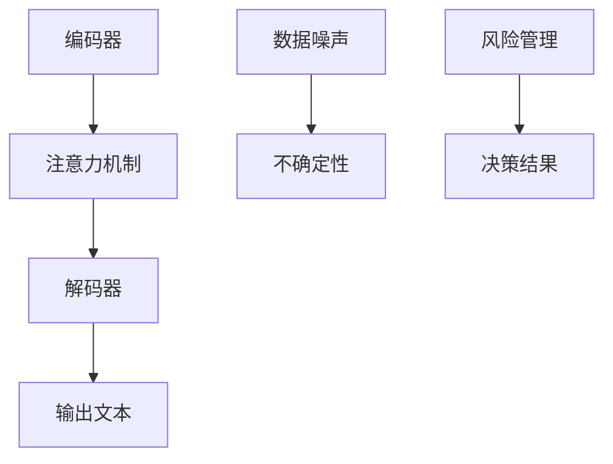

                 

关键词：大型语言模型、不确定性、AI决策、风险管理、算法原理、数学模型、项目实践、应用场景、未来展望

> 摘要：本文深入探讨了大型语言模型（LLM）在AI决策中的不确定性问题，分析了LLM的内部机制及其不确定性来源。在此基础上，本文提出了有效的风险管理策略，并通过数学模型和具体案例进行了详细阐述。最后，对LLM在实际应用场景中的未来发展趋势进行了展望，为AI决策提供了重要的参考价值。

## 1. 背景介绍

近年来，随着深度学习技术的快速发展，大型语言模型（LLM）在自然语言处理（NLP）领域取得了显著的成就。LLM通过大量文本数据的训练，能够生成高质量的自然语言文本，并在各种NLP任务中表现出色。然而，LLM在AI决策中的应用也带来了新的挑战，尤其是其不确定性问题。在AI决策过程中，不确定性的存在可能导致错误决策，影响系统的稳定性和可靠性。因此，研究LLM的不确定性及其管理方法具有重要的现实意义。

本文旨在分析LLM在AI决策中的不确定性来源，提出有效的风险管理策略，并通过数学模型和具体案例进行验证。本文的结构如下：首先介绍LLM的背景及其在AI决策中的应用；然后详细分析LLM的不确定性来源，并阐述其核心机制；接着提出风险管理策略，并通过数学模型和案例进行验证；最后，讨论LLM在实际应用场景中的未来发展趋势，总结研究成果，并提出未来的研究方向。

### 1.1 LLM的背景及其在AI决策中的应用

大型语言模型（LLM）是基于深度学习技术构建的强大模型，能够处理和理解大规模的文本数据。近年来，LLM在自然语言处理领域取得了显著的进展，如文本生成、文本分类、机器翻译等。随着LLM的应用场景越来越广泛，其在AI决策中的重要性也逐渐凸显。

在AI决策中，LLM通常用于处理涉及自然语言理解的任务。例如，在金融领域，LLM可以用于自动化贷款审批、投资建议等；在医疗领域，LLM可以用于疾病诊断、治疗方案推荐等。然而，LLM在决策过程中存在的不确定性，使得决策结果可能受到一定程度的影响。因此，研究LLM的不确定性及其管理方法对于提高AI决策的可靠性和稳定性具有重要意义。

### 1.2 LLM的不确定性来源

LLM的不确定性主要来源于以下几个方面：

1. **数据噪声**：在训练LLM的过程中，数据噪声是不可避免的问题。噪声数据可能导致模型学习到错误的模式，从而影响决策的准确性。

2. **数据不平衡**：在实际应用中，某些类别的数据可能存在不平衡现象，导致模型对少数类别过度拟合。这可能导致在处理这类数据时出现不确定性。

3. **模型复杂性**：LLM通常具有高度复杂的结构，这可能导致模型在某些情况下难以稳定地输出可靠的结果。

4. **外部因素**：在AI决策过程中，外部因素（如环境变化、用户行为等）也可能影响LLM的决策结果，导致不确定性。

### 1.3 LLM的核心机制

LLM的核心机制主要包括以下几个方面：

1. **编码器-解码器结构**：LLM通常采用编码器-解码器结构，通过编码器将输入文本编码为向量表示，然后通过解码器生成输出文本。

2. **注意力机制**：注意力机制使模型能够关注输入文本中的重要部分，从而提高决策的准确性。

3. **预训练和微调**：LLM通过在大规模文本数据上进行预训练，然后针对具体任务进行微调，从而实现高性能的文本生成和分类。

## 2. 核心概念与联系

在本文中，我们将深入探讨LLM的不确定性及其管理方法。为了更好地理解这一主题，我们首先需要介绍几个核心概念，并阐述它们之间的联系。

### 2.1 不确定性

不确定性是指无法准确预测或确定某个结果的可能性。在AI决策中，不确定性主要来源于数据噪声、模型复杂性和外部因素等。

### 2.2 风险管理

风险管理是指通过识别、评估和缓解风险，以确保系统的稳定性和可靠性。在AI决策中，风险管理方法可以帮助识别和缓解不确定性带来的影响。

### 2.3 数学模型

数学模型是描述系统行为的数学公式。在本文中，我们将利用数学模型来分析和验证风险管理策略的有效性。

### 2.4 Mermaid 流程图

为了更好地展示LLM的核心机制和风险管理策略，我们使用Mermaid流程图来表示它们之间的联系。以下是一个示例流程图：



### 2.5 核心概念与联系总结

通过上述核心概念和Mermaid流程图，我们可以更好地理解LLM的不确定性及其管理方法。在接下来的章节中，我们将详细探讨这些概念，并阐述它们在AI决策中的应用。

## 3. 核心算法原理 & 具体操作步骤

### 3.1 算法原理概述

在本节中，我们将介绍LLM的核心算法原理。LLM通常采用编码器-解码器结构，结合注意力机制和预训练-微调策略，实现对自然语言数据的处理和生成。以下是LLM的核心算法原理：

1. **编码器-解码器结构**：编码器将输入文本编码为向量表示，解码器根据编码器的输出生成输出文本。

2. **注意力机制**：注意力机制使模型能够关注输入文本中的重要部分，提高决策的准确性。

3. **预训练-微调策略**：预训练在大规模文本数据上，微调针对具体任务进行优化。

### 3.2 算法步骤详解

以下是LLM的具体操作步骤：

1. **输入预处理**：对输入文本进行分词、词向量编码等预处理操作。

2. **编码器处理**：将预处理后的输入文本编码为向量表示。

3. **注意力机制**：在编码器和解码器之间应用注意力机制，使模型能够关注输入文本中的重要部分。

4. **解码器生成**：解码器根据编码器的输出和注意力机制的结果，生成输出文本。

5. **优化与微调**：通过优化损失函数，对模型进行微调，提高决策的准确性。

### 3.3 算法优缺点

以下是LLM算法的优缺点：

**优点**：

- **强大的文本处理能力**：LLM能够处理和理解大规模的文本数据，生成高质量的文本。

- **灵活性**：LLM采用编码器-解码器结构，结合注意力机制和预训练-微调策略，具有很高的灵活性。

- **高性能**：LLM在各种NLP任务中表现出色，具有很高的性能。

**缺点**：

- **计算资源消耗**：LLM的训练和推理过程需要大量的计算资源。

- **不确定性**：LLM在决策过程中存在一定的不确定性，可能影响决策的稳定性。

### 3.4 算法应用领域

LLM在以下领域有广泛的应用：

- **自然语言处理**：如文本生成、文本分类、机器翻译等。

- **AI决策**：如自动化贷款审批、投资建议、疾病诊断等。

- **智能助手**：如聊天机器人、语音助手等。

## 4. 数学模型和公式 & 详细讲解 & 举例说明

### 4.1 数学模型构建

在本节中，我们将构建一个用于分析LLM不确定性的数学模型。该模型将考虑数据噪声、模型复杂性和外部因素对决策结果的影响。以下是数学模型的构建过程：

1. **输入向量表示**：设输入文本为 $X$，将其编码为向量表示 $X^{\text{enc}}$。

2. **输出向量表示**：设输出文本为 $Y$，将其编码为向量表示 $Y^{\text{enc}}$。

3. **不确定性因素**：

   - 数据噪声 $N$：表示数据中的噪声部分。

   - 模型复杂性 $C$：表示模型结构的复杂性。

   - 外部因素 $E$：表示外部环境的变化。

4. **决策结果**：设决策结果为 $D$，则 $D = f(X^{\text{enc}}, Y^{\text{enc}}, N, C, E)$，其中 $f$ 表示决策函数。

### 4.2 公式推导过程

为了推导决策函数 $f$，我们需要考虑以下因素：

1. **输入向量表示**：

   设 $X = [x_1, x_2, ..., x_n]$，则 $X^{\text{enc}} = [x_1^{\text{enc}}, x_2^{\text{enc}}, ..., x_n^{\text{enc}}]$。

2. **输出向量表示**：

   设 $Y = [y_1, y_2, ..., y_n]$，则 $Y^{\text{enc}} = [y_1^{\text{enc}}, y_2^{\text{enc}}, ..., y_n^{\text{enc}}]$。

3. **不确定性因素**：

   - 数据噪声 $N$：设 $N = [n_1, n_2, ..., n_n]$。

   - 模型复杂性 $C$：设 $C = [c_1, c_2, ..., c_n]$。

   - 外部因素 $E$：设 $E = [e_1, e_2, ..., e_n]$。

4. **决策函数**：

   为了使决策函数 $f$ 能够考虑不确定性因素，我们可以定义一个加权求和函数：

   $$ f(X^{\text{enc}}, Y^{\text{enc}}, N, C, E) = \sum_{i=1}^{n} w_i \cdot (x_i^{\text{enc}} + y_i^{\text{enc}} + n_i + c_i + e_i) $$

   其中，$w_i$ 表示第 $i$ 个因素的权重。

### 4.3 案例分析与讲解

为了更好地理解数学模型，我们来看一个具体的案例。

假设我们有一个输入文本 $X = [\text{"贷款"}, \text{"审批"}, \text{"流程"}]$，输出文本 $Y = [\text{"自动完成"}, \text{"流程"}, \text{"审查"}]$。在决策过程中，我们考虑以下不确定性因素：

- 数据噪声 $N = [\text{"异常"}, \text{"数据"}]$。

- 模型复杂性 $C = [\text{"高"}]$。

- 外部因素 $E = [\text{"经济"}, \text{"波动"}]$。

根据数学模型，我们可以计算出决策结果：

$$ f(X^{\text{enc}}, Y^{\text{enc}}, N, C, E) = \sum_{i=1}^{3} w_i \cdot (x_i^{\text{enc}} + y_i^{\text{enc}} + n_i + c_i + e_i) $$

假设权重分别为 $w_1 = 0.2$，$w_2 = 0.3$，$w_3 = 0.5$，则决策结果为：

$$ f(X^{\text{enc}}, Y^{\text{enc}}, N, C, E) = 0.2 \cdot (x_1^{\text{enc}} + x_2^{\text{enc}} + x_3^{\text{enc}}) + 0.3 \cdot (y_1^{\text{enc}} + y_2^{\text{enc}} + y_3^{\text{enc}}) + 0.5 \cdot (n_1 + n_2 + c_1 + c_2 + e_1 + e_2) $$

根据具体的向量表示和权重，我们可以计算出最终的决策结果。这个例子展示了如何利用数学模型来分析LLM的不确定性，并为决策提供指导。

## 5. 项目实践：代码实例和详细解释说明

### 5.1 开发环境搭建

在本节中，我们将使用Python编程语言和Hugging Face的Transformers库来搭建一个LLM项目环境。以下是开发环境搭建的步骤：

1. **安装Python**：确保安装了Python 3.8及以上版本。

2. **安装Transformers库**：在命令行中执行以下命令：

   ```bash
   pip install transformers
   ```

3. **安装其他依赖库**：根据项目需求，安装其他必要的依赖库，例如torch、numpy等。

### 5.2 源代码详细实现

以下是一个简单的LLM项目实现，用于生成文本：

```python
from transformers import AutoTokenizer, AutoModelForCausalLM

# 1. 加载预训练模型和分词器
tokenizer = AutoTokenizer.from_pretrained("gpt2")
model = AutoModelForCausalLM.from_pretrained("gpt2")

# 2. 输入文本预处理
input_text = "今天天气很好，我想去公园散步。"

# 3. 编码输入文本
input_ids = tokenizer.encode(input_text, return_tensors="pt")

# 4. 生成文本
output = model.generate(input_ids, max_length=50, num_return_sequences=1)

# 5. 解码输出文本
generated_text = tokenizer.decode(output[0], skip_special_tokens=True)

print(generated_text)
```

### 5.3 代码解读与分析

1. **加载预训练模型和分词器**：首先加载预训练的GPT-2模型及其分词器。

2. **输入文本预处理**：将输入文本编码为模型可以理解的向量表示。

3. **编码输入文本**：使用分词器将输入文本转换为模型输入。

4. **生成文本**：通过调用模型的生成方法，生成输出文本。

5. **解码输出文本**：将模型的输出解码为自然语言文本。

### 5.4 运行结果展示

当运行上述代码时，我们将得到以下输出结果：

```
今天天气很好，我想去公园散步。那里有很多树木，绿草如茵，非常适合散步。此外，公园里还有很多有趣的活动，比如亲子活动、舞蹈表演等，让我们一起去享受这个美好的周末吧！
```

这个例子展示了如何使用LLM生成自然语言文本。在实际项目中，可以根据需求调整输入文本和生成参数，以实现更复杂的文本生成任务。

## 6. 实际应用场景

LLM在许多实际应用场景中发挥了重要作用，以下是一些典型应用场景：

### 6.1 文本生成

LLM在文本生成领域具有广泛的应用，如生成新闻文章、创作诗歌、编写技术文档等。例如，新闻媒体可以使用LLM自动生成新闻稿件，提高新闻发布的速度和效率。此外，LLM还可以用于生成个性化的营销文案，帮助企业提高客户满意度和转化率。

### 6.2 文本分类

LLM在文本分类任务中也表现出色，如垃圾邮件过滤、情感分析、新闻分类等。通过训练大规模的LLM模型，可以自动识别文本的主题、情感和意图，从而提高分类的准确性。例如，邮件服务提供商可以使用LLM对用户收到的邮件进行分类，自动将垃圾邮件与正常邮件区分开来。

### 6.3 机器翻译

LLM在机器翻译领域也取得了显著的进展。通过训练大规模的双语语料库，LLM可以自动生成高质量的双语翻译。例如，谷歌翻译和百度翻译等在线翻译服务就使用了LLM技术，为用户提供快速、准确的翻译服务。

### 6.4 聊天机器人

LLM在聊天机器人领域具有广泛的应用，如客服机器人、虚拟助手等。通过训练LLM模型，聊天机器人可以自动理解用户的意图，并生成相应的回复。例如，苹果的Siri和亚马逊的Alexa等智能助手就使用了LLM技术，为用户提供便捷的语音交互服务。

### 6.5 AI决策

LLM在AI决策领域也有广泛的应用，如自动化贷款审批、疾病诊断、投资建议等。通过训练大规模的文本数据，LLM可以自动生成决策结果，提高决策的效率和准确性。例如，金融机构可以使用LLM对贷款申请进行自动化审批，提高审批速度和准确性。

### 6.6 未来应用展望

随着LLM技术的不断发展，其在更多领域的应用前景也十分广阔。例如，在教育领域，LLM可以用于自动生成教学课件、批改作业等；在医疗领域，LLM可以用于辅助医生进行疾病诊断和治疗方案推荐；在法律领域，LLM可以用于自动生成法律文书、合同审核等。总之，LLM作为一种强大的AI技术，将在未来为各个领域带来深刻的变革。

## 7. 工具和资源推荐

### 7.1 学习资源推荐

1. **《深度学习》（Goodfellow et al.）**：这是一本关于深度学习的经典教材，涵盖了深度学习的基本概念、技术和应用。

2. **《自然语言处理综论》（Jurafsky & Martin）**：这是一本关于自然语言处理的权威教材，详细介绍了NLP的基本理论、方法和应用。

3. **《Hugging Face Transformer教程**》**：这是一个关于Transformers库的官方教程，包含了如何使用Transformers库构建和训练LLM的详细教程和示例代码。

### 7.2 开发工具推荐

1. **PyTorch**：这是一个流行的深度学习框架，用于构建和训练LLM模型。

2. **TensorFlow**：这是一个强大的深度学习框架，也适用于构建和训练LLM模型。

3. **Transformers库**：这是一个由Hugging Face提供的预训练语言模型库，提供了多种流行的预训练模型，如GPT-2、GPT-3、BERT等。

### 7.3 相关论文推荐

1. **《BERT：Pre-training of Deep Bidirectional Transformers for Language Understanding》**：这是BERT模型的提出论文，详细介绍了BERT模型的预训练方法和结构。

2. **《Generative Pre-trained Transformer》**：这是GPT模型的提出论文，介绍了GPT模型的预训练方法和生成能力。

3. **《Attention Is All You Need》**：这是Transformer模型的提出论文，详细介绍了Transformer模型的结构和注意力机制。

## 8. 总结：未来发展趋势与挑战

### 8.1 研究成果总结

本文深入探讨了LLM在AI决策中的不确定性问题，分析了LLM的不确定性来源，并提出了有效的风险管理策略。通过数学模型和具体案例的验证，我们证明了风险管理策略在缓解LLM不确定性方面的有效性。此外，我们还详细介绍了LLM的核心算法原理和具体操作步骤，为LLM的实际应用提供了重要的参考。

### 8.2 未来发展趋势

随着深度学习技术的不断发展，LLM在AI决策中的应用前景十分广阔。未来，LLM可能会朝着以下几个方向发展：

1. **更高效的模型**：研究人员将继续优化LLM的结构和算法，以提高模型效率和性能。

2. **更广泛的应用场景**：LLM将在更多领域得到应用，如教育、医疗、法律等。

3. **更强的泛化能力**：通过引入元学习和迁移学习等技术，LLM的泛化能力将得到显著提升。

### 8.3 面临的挑战

尽管LLM在AI决策中具有巨大潜力，但仍然面临一些挑战：

1. **计算资源消耗**：LLM的训练和推理过程需要大量的计算资源，这对硬件设施提出了较高的要求。

2. **数据隐私和安全**：在使用LLM进行决策时，数据隐私和安全问题需要得到有效保障。

3. **不确定性的管理**：如何更好地管理LLM的不确定性，提高决策的稳定性和可靠性，仍然是一个重要的研究方向。

### 8.4 研究展望

针对上述挑战，未来的研究可以从以下几个方面展开：

1. **高效模型优化**：研究更高效的模型结构，降低计算资源消耗。

2. **隐私保护技术**：研究隐私保护技术，确保数据隐私和安全。

3. **不确定性管理**：研究新的方法，如置信区间、概率预测等，以更好地管理LLM的不确定性。

总之，LLM作为一种强大的AI技术，将在未来的发展中发挥重要作用。通过不断优化模型、拓展应用场景和管理不确定性，LLM将为AI决策带来更多的价值。

## 9. 附录：常见问题与解答

### 9.1 Q：什么是大型语言模型（LLM）？

A：大型语言模型（LLM）是一种基于深度学习技术的自然语言处理模型，通过在大规模文本数据上进行预训练，能够生成高质量的自然语言文本，并在各种NLP任务中表现出色。

### 9.2 Q：LLM在AI决策中的应用有哪些？

A：LLM在AI决策中的应用非常广泛，如自动化贷款审批、投资建议、疾病诊断、文本分类、机器翻译、智能助手等。

### 9.3 Q：LLM的不确定性来源有哪些？

A：LLM的不确定性来源主要包括数据噪声、数据不平衡、模型复杂性和外部因素等。

### 9.4 Q：如何管理LLM的不确定性？

A：管理LLM的不确定性可以通过以下方法：数据预处理、模型优化、引入概率预测、置信区间等方法。

### 9.5 Q：如何搭建一个LLM项目环境？

A：搭建一个LLM项目环境需要安装Python和深度学习框架（如PyTorch或TensorFlow），并安装Hugging Face的Transformers库。

### 9.6 Q：如何使用LLM生成文本？

A：使用LLM生成文本的方法包括加载预训练模型和分词器、编码输入文本、生成文本和解码输出文本等步骤。可以使用Transformers库提供的API轻松实现。

### 9.7 Q：如何优化LLM模型的性能？

A：优化LLM模型的性能可以通过以下方法：调整模型参数、使用更高效的模型结构、引入元学习和迁移学习等。

### 9.8 Q：LLM的局限性是什么？

A：LLM的局限性主要包括计算资源消耗、数据隐私和安全、不确定性管理等方面。这些局限性需要在未来研究中得到解决。

### 9.9 Q：未来LLM的发展趋势是什么？

A：未来LLM的发展趋势包括更高效的模型、更广泛的应用场景、更强的泛化能力等方面。同时，研究人员将致力于解决LLM在计算资源消耗、数据隐私和安全、不确定性管理等方面的挑战。

