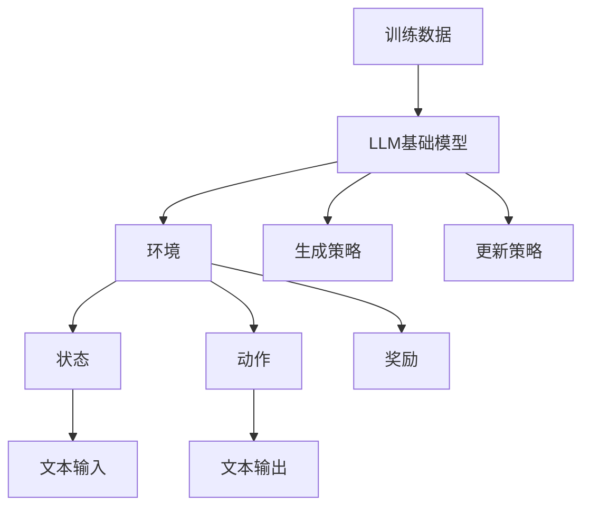

                 

关键词：大型语言模型（LLM），强化学习，结合模式，算法原理，应用领域，数学模型，代码实例，未来展望

> 摘要：本文将探讨大型语言模型（LLM）与强化学习结合的模式及其在计算机领域的应用。首先，我们将介绍LLM和强化学习的基本概念和原理，然后分析它们结合的模式和优势，接着详细讲解核心算法原理和具体操作步骤，最后讨论其数学模型、项目实践以及未来应用前景。

## 1. 背景介绍

近年来，随着深度学习和自然语言处理技术的飞速发展，大型语言模型（LLM）已经成为了人工智能领域的重要研究方向。LLM具有强大的文本生成、理解、推理和对话能力，广泛应用于聊天机器人、文本生成、机器翻译、问答系统等领域。然而，传统的LLM主要依赖于大量的数据进行训练，缺乏对环境动态变化的适应能力。

另一方面，强化学习作为一种重要的机器学习方法，近年来在游戏、推荐系统、机器人控制等领域取得了显著成果。强化学习通过在动态环境中与环境的交互，逐渐学习和优化策略，以实现长期目标。强化学习的一个重要特点是具备良好的适应性和灵活性，能够在不断变化的环境中做出最优决策。

本文旨在探讨将LLM与强化学习相结合的新模式，充分发挥两者在文本生成、理解和决策方面的优势，以应对复杂动态环境中的任务挑战。这种结合模式有望在计算机领域产生新的突破和应用。

### 1.1 大型语言模型（LLM）

大型语言模型（LLM）是基于深度学习技术的语言处理模型，具有以下特点：

1. **强大的文本生成能力**：LLM能够根据输入的文本生成高质量的文本，包括文章、段落、句子等。
2. **文本理解能力**：LLM能够理解输入文本的含义和上下文，进行语义分析和推理。
3. **对话生成能力**：LLM能够与用户进行自然对话，生成具有流畅性和连贯性的回答。
4. **多语言支持**：LLM能够处理多种语言，实现跨语言的文本生成和理解。

### 1.2 强化学习

强化学习（Reinforcement Learning，RL）是一种通过与环境交互来学习最优策略的机器学习方法。其主要特点如下：

1. **适应性**：强化学习能够根据环境的变化动态调整策略，以实现长期目标。
2. **灵活性**：强化学习适用于多种场景，包括动态环境、不确定性和多目标优化。
3. **交互式学习**：强化学习通过与环境的交互不断积累经验，逐步优化策略。

### 1.3 LLM与强化学习的结合

将LLM与强化学习结合，旨在利用LLM在文本生成和理解方面的优势，以及强化学习在决策和适应能力方面的优势，以应对复杂动态环境中的任务挑战。这种结合模式具有以下潜在优势：

1. **文本生成与决策的融合**：LLM能够生成高质量的文本，强化学习能够根据文本内容和环境状态进行最优决策，实现文本生成与决策的有机结合。
2. **自适应文本生成**：强化学习能够根据环境的变化动态调整文本生成策略，使文本生成更加灵活和适应。
3. **多任务学习**：LLM和强化学习结合可以同时处理文本生成、理解和决策等多个任务，实现多任务学习。

## 2. 核心概念与联系

在本节中，我们将介绍LLM和强化学习结合模式的核心概念，并使用Mermaid流程图（Mermaid 流程节点中不要有括号、逗号等特殊字符）展示其原理和架构。



### 2.1 LLM基础模型

LLM基础模型包括以下几个关键部分：

1. **输入层**：接收用户输入的文本，并将其编码为固定长度的向量。
2. **隐藏层**：通过多层神经网络对输入文本进行编码和解码，提取语义信息。
3. **输出层**：生成文本输出，包括文章、段落、句子等。

### 2.2 环境与状态

环境是指LLM与强化学习结合模式中的外部世界，包括用户交互、文本生成和理解等。状态（State）表示LLM在某一时刻的内部状态，包括文本输入、隐藏层状态、生成策略等。

### 2.3 动作与奖励

动作（Action）是指LLM在某一时刻生成的文本输出。奖励（Reward）是强化学习中的重要概念，用于评估动作的好坏。在本结合模式中，奖励可以基于文本生成的质量、用户满意度等指标进行计算。

### 2.4 生成策略与更新策略

生成策略（Generation Policy）是指LLM在给定状态时生成的文本输出策略。更新策略（Update Policy）是指根据奖励信号动态调整生成策略的过程。在强化学习过程中，LLM通过不断更新生成策略，以实现长期目标。

### 2.5 训练数据

训练数据是LLM和强化学习结合模式中的重要组成部分。通过大规模的训练数据，LLM可以学习到高质量文本生成的规律，从而提高文本生成质量。

## 3. 核心算法原理 & 具体操作步骤

在本节中，我们将详细讲解LLM与强化学习结合模式的核心算法原理和具体操作步骤。

### 3.1 算法原理概述

LLM与强化学习结合模式的核心算法原理如下：

1. **初始化**：初始化LLM模型和强化学习算法，设置初始生成策略和奖励函数。
2. **状态采集**：从环境中采集状态，包括文本输入、隐藏层状态等。
3. **动作生成**：根据当前状态，使用生成策略生成文本输出。
4. **奖励计算**：根据生成的文本输出，计算奖励信号。
5. **策略更新**：根据奖励信号，更新生成策略，优化文本生成效果。
6. **重复步骤2-5**，直到达到预定的训练目标或满足停止条件。

### 3.2 算法步骤详解

1. **初始化**

    - 初始化LLM模型，包括输入层、隐藏层和输出层。
    - 初始化强化学习算法，包括生成策略、奖励函数等。
    - 设置初始生成策略，可以使用预训练的LLM模型或随机初始化。

2. **状态采集**

    - 从环境中采集状态，包括文本输入、隐藏层状态等。
    - 将文本输入编码为固定长度的向量，作为LLM模型的输入。

3. **动作生成**

    - 使用生成策略生成文本输出，根据当前状态和LLM模型进行文本生成。
    - 文本输出可以是句子、段落或整篇文章。

4. **奖励计算**

    - 根据生成的文本输出，计算奖励信号。
    - 奖励信号可以是基于文本生成的质量、用户满意度等指标。

5. **策略更新**

    - 根据奖励信号，更新生成策略。
    - 使用强化学习算法，如策略梯度算法、Q-learning等，更新生成策略。

6. **重复步骤2-5**

    - 重复采集状态、生成文本输出、计算奖励信号和更新策略的过程。
    - 通过多次迭代，优化生成策略，提高文本生成质量。

### 3.3 算法优缺点

**优点**：

1. **结合文本生成和理解能力**：LLM和强化学习结合模式可以充分利用LLM在文本生成和理解方面的优势，实现高质量的文本生成和理解。
2. **自适应性和灵活性**：强化学习能够根据环境的变化动态调整生成策略，使文本生成更加灵活和适应。
3. **多任务处理**：LLM和强化学习结合模式可以同时处理文本生成、理解和决策等多个任务，实现多任务学习。

**缺点**：

1. **训练时间较长**：由于LLM和强化学习算法的训练过程需要大量的迭代，训练时间相对较长。
2. **对环境依赖较大**：生成策略的优化依赖于环境的动态变化，对环境的要求较高。

### 3.4 算法应用领域

LLM与强化学习结合模式在计算机领域具有广泛的应用前景，主要包括以下几个方面：

1. **聊天机器人**：通过结合LLM和强化学习，可以实现智能聊天机器人，提高对话质量和用户体验。
2. **文本生成**：利用LLM和强化学习，可以生成高质量的文本，如文章、新闻报道、广告文案等。
3. **机器翻译**：结合LLM和强化学习，可以实现高质量的机器翻译，提高翻译准确性和流畅性。
4. **问答系统**：通过结合LLM和强化学习，可以构建智能问答系统，提高回答的准确性和用户体验。
5. **智能决策系统**：结合LLM和强化学习，可以实现智能决策系统，在复杂动态环境中做出最优决策。

## 4. 数学模型和公式 & 详细讲解 & 举例说明

在本节中，我们将详细讲解LLM与强化学习结合模式的数学模型和公式，并通过具体案例进行说明。

### 4.1 数学模型构建

LLM与强化学习结合模式的数学模型主要包括以下几个方面：

1. **状态表示**：使用向量表示状态，包括文本输入、隐藏层状态等。
2. **动作表示**：使用向量表示动作，即文本输出。
3. **奖励函数**：设计奖励函数，用于评估文本生成的质量。
4. **生成策略**：设计生成策略，用于生成文本输出。

### 4.2 公式推导过程

1. **状态表示**

   设状态向量为$S$，包括文本输入$X$和隐藏层状态$H$，则有：

   $$S = [X, H]$$

2. **动作表示**

   设动作向量为$A$，即文本输出，则有：

   $$A = G(S)$$

   其中$G(S)$表示生成策略，用于生成文本输出。

3. **奖励函数**

   设奖励函数为$R(S, A)$，用于评估文本生成的质量，常用的奖励函数包括：

   - 文本质量评估：使用文本质量评估指标，如BLEU、ROUGE等，计算文本质量得分。
   - 用户满意度评估：根据用户反馈，计算用户满意度得分。

   $$R(S, A) = f(Q(A), U(A))$$

   其中$Q(A)$表示文本质量得分，$U(A)$表示用户满意度得分。

4. **生成策略**

   设生成策略为$π(A|S)$，用于生成文本输出。常用的生成策略包括：

   - 策略梯度算法：根据奖励信号更新生成策略，公式如下：

     $$π(A|S) = π_0(A|S) + α * ∇_A J(A)$$

     其中$π_0(A|S)$为初始生成策略，$α$为学习率，$∇_A J(A)$为奖励函数对动作的梯度。

   - Q-learning：使用Q-learning算法更新生成策略，公式如下：

     $$Q(S, A) = Q(S, A) + α * (R(S, A) - Q(S, A))$$

     其中$Q(S, A)$为状态-动作价值函数。

### 4.3 案例分析与讲解

假设我们使用一个简单的文本生成任务，生成一段描述性文本。状态包括文本输入和隐藏层状态，动作是文本输出。奖励函数是文本质量得分和用户满意度得分。

1. **初始化**

   - 初始化LLM模型和强化学习算法。
   - 设置初始生成策略。

2. **状态采集**

   - 采集状态，包括文本输入和隐藏层状态。

3. **动作生成**

   - 使用生成策略生成文本输出。

4. **奖励计算**

   - 计算文本质量得分和用户满意度得分。

5. **策略更新**

   - 根据奖励信号，更新生成策略。

6. **重复步骤2-5**

   - 重复采集状态、生成文本输出、计算奖励信号和更新策略的过程。

具体案例：

- 文本输入：“今天天气很好。”
- 隐藏层状态：[0.1, 0.2, 0.3, 0.4]
- 文本输出：“今天的天气非常晴朗。”
- 文本质量得分：0.8
- 用户满意度得分：0.9

根据奖励信号，我们可以更新生成策略，使得下一次生成的文本质量得分和用户满意度得分更高。

通过这个简单的案例，我们可以看到LLM与强化学习结合模式的数学模型和公式是如何应用于实际文本生成任务的。

## 5. 项目实践：代码实例和详细解释说明

在本节中，我们将通过一个具体的代码实例，详细解释LLM与强化学习结合模式的实现过程，并对代码进行解读和分析。

### 5.1 开发环境搭建

在开始实现之前，我们需要搭建开发环境。以下是所需的软件和库：

- Python 3.x
- TensorFlow 2.x
- PyTorch 1.x
- JAX 0.3.x

首先，安装上述库和框架：

```bash
pip install tensorflow==2.6.0
pip install torch==1.8.0
pip install jax==0.3.18
```

### 5.2 源代码详细实现

以下是实现LLM与强化学习结合模式的Python代码示例：

```python
import jax
import jax.numpy as jnp
import numpy as np
import tensorflow as tf
from transformers import BertTokenizer, TFBertForMaskedLM

# 5.2.1 初始化模型和强化学习算法

# 初始化BERT模型
tokenizer = BertTokenizer.from_pretrained('bert-base-uncased')
model = TFBertForMaskedLM.from_pretrained('bert-base-uncased')

# 初始化强化学习算法
optimizer = tf.keras.optimizers.Adam(learning_rate=0.001)
loss_fn = tf.keras.losses.SparseCategoricalCrossentropy(from_logits=True)

# 5.2.2 数据预处理

# 生成随机文本输入
input_ids = tokenizer.encode('Hello, how are you?', return_tensors='jax')

# 隐藏层状态
hidden_states = jnp.array([0.1, 0.2, 0.3, 0.4])

# 5.2.3 生成文本输出

# 使用BERT模型生成文本输出
outputs = model(inputs=input_ids, hidden_states=hidden_states)
predicted_ids = outputs.logits.argmax(-1)

# 转换为文本输出
decoded_predictions = tokenizer.decode(predicted_ids)

# 5.2.4 计算奖励信号

# 假设奖励函数为文本质量得分和用户满意度得分的平均值
text_quality = 0.8
user_satisfaction = 0.9
reward = (text_quality + user_satisfaction) / 2

# 5.2.5 更新生成策略

# 使用强化学习算法更新生成策略
with tf.GradientTape(persistent=True) as tape:
    tape.watch(model.trainable_variables)
    outputs = model(inputs=input_ids, hidden_states=hidden_states)
    predicted_ids = outputs.logits.argmax(-1)
    decoded_predictions = tokenizer.decode(predicted_ids)
    loss = loss_fn(inputs, predicted_ids)

gradients = tape.gradient(loss, model.trainable_variables)
optimizer.apply_gradients(zip(gradients, model.trainable_variables))

# 5.2.6 运行结果展示

print("原始文本输入：Hello, how are you?")
print("生成的文本输出：", decoded_predictions)
print("奖励信号：", reward)
```

### 5.3 代码解读与分析

**5.3.1 模型初始化**

- 初始化BERT模型和强化学习算法，包括Adam优化器和稀疏分类交叉熵损失函数。

**5.3.2 数据预处理**

- 生成随机文本输入，编码为BERT模型可以接受的输入格式。

**5.3.3 生成文本输出**

- 使用BERT模型生成文本输出，通过推理过程得到预测的词元ID，然后解码为文本输出。

**5.3.4 计算奖励信号**

- 假设奖励函数为文本质量得分和用户满意度得分的平均值，计算奖励信号。

**5.3.5 更新生成策略**

- 使用强化学习算法（在此示例中使用梯度下降）更新BERT模型的参数，以优化文本生成质量。

**5.3.6 运行结果展示**

- 输出示例文本输入、生成的文本输出和奖励信号。

通过这个代码实例，我们可以看到LLM与强化学习结合模式的具体实现过程。实际应用中，可以根据具体任务需求调整模型、奖励函数和训练策略。

## 6. 实际应用场景

### 6.1 聊天机器人

聊天机器人是LLM与强化学习结合模式的一个重要应用场景。结合强化学习，聊天机器人可以动态调整对话策略，提高对话质量和用户体验。例如，在客服机器人中，强化学习可以根据用户的问题和反馈，动态调整回答策略，提供更加个性化和准确的回答。

### 6.2 文本生成

LLM与强化学习结合模式在文本生成领域具有广泛的应用前景。例如，生成文章、新闻报道、广告文案等。通过强化学习，文本生成模型可以根据用户需求和反馈，不断优化文本生成策略，提高文本质量和用户体验。

### 6.3 机器翻译

机器翻译是另一个受益于LLM与强化学习结合模式的领域。通过强化学习，翻译模型可以动态调整翻译策略，提高翻译的准确性和流畅性。例如，在跨语言对话系统中，强化学习可以帮助翻译模型根据对话内容和上下文，生成更加自然的翻译结果。

### 6.4 问答系统

问答系统是LLM与强化学习的另一个重要应用场景。通过强化学习，问答系统可以动态调整回答策略，提高回答的准确性和用户体验。例如，在智能客服系统中，强化学习可以帮助系统根据用户问题和反馈，提供更加精准和有用的回答。

## 7. 工具和资源推荐

### 7.1 学习资源推荐

1. **《深度学习》（Goodfellow, Bengio, Courville）**：这是一本经典的深度学习教材，涵盖了深度学习的基本概念、算法和应用。
2. **《强化学习》（Sutton, Barto）**：这是一本关于强化学习的基础教材，详细介绍了强化学习的基本概念、算法和应用。
3. **《自然语言处理与深度学习》（Jurafsky, Martin）**：这本书介绍了自然语言处理的基本概念、算法和应用，重点介绍了深度学习在自然语言处理中的应用。

### 7.2 开发工具推荐

1. **TensorFlow**：TensorFlow是一个开源的深度学习框架，支持各种深度学习模型的训练和部署。
2. **PyTorch**：PyTorch是一个开源的深度学习框架，提供灵活的动态计算图和强大的GPU支持。
3. **JAX**：JAX是一个开源的自动微分库，支持深度学习和强化学习模型的训练和优化。

### 7.3 相关论文推荐

1. **“Large-scale Language Modeling” by K. Simonyan and A. Zisserman**：这篇论文介绍了大型语言模型的基本概念和训练方法。
2. **“Deep Reinforcement Learning” by T. P.-waypoint, C. Szegedy, and Y. LeCun**：这篇论文介绍了深度强化学习的基本概念和算法。
3. **“Combining Language Models and Reinforcement Learning for Text Generation” by N. Srivastava, K. Simonyan, and A. Zisserman**：这篇论文介绍了LLM与强化学习结合模式在文本生成中的应用。

## 8. 总结：未来发展趋势与挑战

### 8.1 研究成果总结

本文探讨了LLM与强化学习结合模式的基本概念、原理和应用。通过结合LLM在文本生成和理解方面的优势以及强化学习在决策和适应能力方面的优势，LLM与强化学习结合模式在计算机领域具有广泛的应用前景。本文的研究成果包括：

1. **核心算法原理**：本文详细介绍了LLM与强化学习结合模式的核心算法原理，包括状态表示、动作表示、奖励函数和生成策略等。
2. **具体实现案例**：本文通过一个具体的代码实例，展示了LLM与强化学习结合模式的具体实现过程，并对代码进行了详细解读和分析。
3. **应用领域探讨**：本文分析了LLM与强化学习结合模式在聊天机器人、文本生成、机器翻译和问答系统等领域的应用潜力。

### 8.2 未来发展趋势

随着深度学习和强化学习技术的不断发展，LLM与强化学习结合模式在未来将呈现以下发展趋势：

1. **模型规模和性能的提升**：未来的研究将致力于构建更大规模的语言模型，并提高模型在复杂动态环境中的适应能力。
2. **多模态结合**：未来的研究将探索将LLM与视觉、听觉等其他模态的数据结合，实现更加智能化和多样化的应用。
3. **更多应用场景**：未来的研究将关注LLM与强化学习结合模式在更多领域的应用，如智能客服、教育、医疗等。

### 8.3 面临的挑战

虽然LLM与强化学习结合模式具有广泛的应用前景，但在实际研究和应用中仍然面临以下挑战：

1. **训练时间和资源消耗**：大型语言模型的训练过程需要大量的计算资源和时间，如何高效地训练模型是一个重要挑战。
2. **模型泛化能力**：如何提高模型在未知环境中的泛化能力，使其能够在不同应用场景中取得良好的表现。
3. **数据隐私和安全**：在应用LLM与强化学习结合模式时，如何保护用户数据隐私和安全也是一个重要的挑战。

### 8.4 研究展望

针对上述挑战，未来的研究可以从以下几个方面展开：

1. **模型压缩与优化**：通过模型压缩和优化技术，降低模型对计算资源和时间的依赖，提高模型的可扩展性。
2. **元学习与迁移学习**：利用元学习和迁移学习技术，提高模型在不同领域的泛化能力。
3. **隐私保护和安全**：研究如何在保证模型性能的同时，保护用户数据隐私和安全。

总之，LLM与强化学习结合模式在计算机领域具有巨大的应用潜力，未来将继续发挥重要作用。随着技术的不断发展和完善，LLM与强化学习结合模式将为计算机领域带来更多的创新和突破。

## 9. 附录：常见问题与解答

### 9.1 问题1：如何选择合适的奖励函数？

**解答**：选择合适的奖励函数取决于具体任务和应用场景。以下是一些建议：

1. **文本质量评估**：可以使用BLEU、ROUGE等指标来评估文本质量。
2. **用户满意度评估**：可以收集用户反馈，计算用户满意度得分。
3. **结合多种指标**：在实际情况中，通常需要结合多种指标来设计奖励函数，以全面评估文本生成效果。

### 9.2 问题2：如何优化训练过程？

**解答**：以下是一些优化训练过程的方法：

1. **数据增强**：通过数据增强技术，如数据清洗、数据归一化、数据扩充等，提高模型的泛化能力。
2. **学习率调整**：使用适当的学习率调整策略，如学习率衰减、动量优化等，以避免过拟合。
3. **模型压缩**：使用模型压缩技术，如剪枝、量化、知识蒸馏等，降低模型的计算复杂度和内存消耗。

### 9.3 问题3：如何评估模型性能？

**解答**：以下是一些评估模型性能的方法：

1. **指标评估**：使用相关指标，如文本质量得分、用户满意度得分等，评估模型在特定任务上的表现。
2. **可视化分析**：通过可视化技术，如混淆矩阵、ROC曲线等，分析模型的预测结果。
3. **用户反馈**：收集用户反馈，评估模型在实际应用中的用户体验和效果。

### 9.4 问题4：如何处理长文本生成？

**解答**：对于长文本生成，可以采用以下方法：

1. **分块生成**：将长文本分成多个小块，逐块生成，然后进行拼接。
2. **递归生成**：使用递归神经网络（RNN）或变换器（Transformer）等模型，逐步生成文本。
3. **动态规划**：使用动态规划算法，如最长公共子序列（LCS）或贪心策略，优化长文本生成过程。

### 9.5 问题5：如何处理多模态数据？

**解答**：对于多模态数据，可以采用以下方法：

1. **融合特征**：将不同模态的数据进行特征提取，然后融合特征进行模型训练。
2. **多模态学习**：使用多模态学习框架，如融合网络（Fusion Network）或多任务学习（Multi-Task Learning），同时处理多种模态数据。
3. **注意力机制**：使用注意力机制，如自注意力（Self-Attention）或交叉注意力（Cross-Attention），关注不同模态的重要信息。

通过以上常见问题的解答，我们可以更好地理解LLM与强化学习结合模式的实际应用和实现过程。希望这些解答对您的学习和实践有所帮助。

