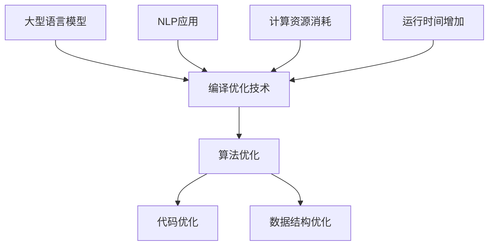

                 

关键词：大型语言模型（LLM）、编译优化、算法原理、数学模型、项目实践、应用场景、工具和资源推荐、未来发展趋势。

> 摘要：本文深入探讨了大型语言模型（LLM）编译优化技术的进展。通过对核心算法原理的解析、数学模型的构建及其在各个领域的应用，我们揭示了编译优化技术在提升LLM性能和效率方面的关键作用。本文还详细介绍了相关工具和资源的推荐，以及未来发展趋势与面临的挑战。

## 1. 背景介绍

随着人工智能（AI）技术的飞速发展，尤其是深度学习和自然语言处理（NLP）的突破，大型语言模型（LLM）如BERT、GPT等在近年来取得了显著的成果。这些模型能够处理复杂的语言任务，如机器翻译、问答系统、文本生成等，极大地推动了AI技术的发展。然而，随着模型规模的不断扩大，计算资源的消耗和运行时间的增加也成为一个不容忽视的问题。因此，如何优化LLM的编译过程，提高其运行效率和性能，成为当前研究的热点。

编译优化技术作为提高程序运行效率和性能的重要手段，在LLM的编译过程中也发挥着关键作用。本文旨在探讨LLM编译优化技术的进展，分析其核心算法原理、数学模型、项目实践，并展望未来的发展趋势与挑战。

## 2. 核心概念与联系

在探讨LLM的编译优化技术之前，我们需要了解一些核心概念和它们之间的联系。

### 2.1. 编译优化技术

编译优化技术是指通过编译器对源代码进行变换，以提高程序运行效率的过程。这包括代码优化、算法优化、数据结构优化等多个方面。在LLM的编译过程中，编译优化技术主要用于提升模型训练和推理的速度。

### 2.2. 大型语言模型（LLM）

大型语言模型（LLM）是指参数规模巨大的深度学习模型，如BERT、GPT等。这些模型能够处理复杂的语言任务，但同时也带来了计算资源消耗和运行时间增加的问题。

### 2.3. 自然语言处理（NLP）

自然语言处理（NLP）是人工智能的一个重要分支，旨在使计算机能够理解、处理和生成自然语言。LLM在NLP任务中具有广泛的应用，如机器翻译、问答系统、文本生成等。

### 2.4. 核心概念原理与架构

为了更好地理解LLM的编译优化技术，我们使用Mermaid流程图（流程节点中不要有括号、逗号等特殊字符）来展示其核心概念原理和架构。



### 2.5. 编译优化技术在LLM中的应用

编译优化技术在LLM中的应用主要包括以下几个方面：

- **算法优化**：通过优化模型训练和推理的算法，降低计算复杂度和内存占用。
- **代码优化**：通过优化编译过程中的代码生成，提高程序的执行效率。
- **数据结构优化**：通过优化数据结构的使用，减少数据访问的时间和空间开销。

## 3. 核心算法原理 & 具体操作步骤

### 3.1. 算法原理概述

LLM的编译优化技术主要包括以下核心算法原理：

- **并行化算法**：通过将模型训练和推理任务分解为多个子任务，利用多核处理器进行并行计算，提高计算效率。
- **量化算法**：通过降低模型中参数的精度，减少计算量和内存占用。
- **剪枝算法**：通过去除模型中冗余的神经元和参数，减少模型的复杂度和计算量。
- **压缩算法**：通过将模型压缩为更小的二进制文件，提高存储和传输的效率。

### 3.2. 算法步骤详解

#### 3.2.1. 并行化算法

并行化算法的核心思想是将模型训练和推理任务分解为多个子任务，然后利用多核处理器并行执行这些子任务。具体步骤如下：

1. **任务分解**：将整个模型训练或推理任务分解为多个子任务，每个子任务处理模型的一部分参数。
2. **数据分配**：将训练数据或输入数据分配给各个子任务，确保每个子任务都有足够的数据进行训练或推理。
3. **并行计算**：利用多核处理器，同时执行各个子任务的训练或推理过程。
4. **结果汇总**：将各个子任务的结果汇总，得到最终的模型参数或输出结果。

#### 3.2.2. 量化算法

量化算法的核心思想是通过降低模型中参数的精度，减少计算量和内存占用。具体步骤如下：

1. **参数量化**：将模型中的浮点参数转换为整数参数，降低参数的精度。
2. **计算优化**：在量化后的参数上进行计算，利用整数运算替代浮点运算，提高计算效率。
3. **精度补偿**：在量化过程中可能引入一定的误差，通过精度补偿技术来减小误差。
4. **模型验证**：对量化后的模型进行验证，确保其在精度和性能上的可行性。

#### 3.2.3. 剪枝算法

剪枝算法的核心思想是通过去除模型中冗余的神经元和参数，减少模型的复杂度和计算量。具体步骤如下：

1. **参数筛选**：根据模型的结构和训练数据，筛选出重要的参数，去除冗余的参数。
2. **模型重构**：去除冗余参数后，重构模型的结构，降低模型的复杂度。
3. **模型验证**：对重构后的模型进行验证，确保其在精度和性能上的可行性。

#### 3.2.4. 压缩算法

压缩算法的核心思想是通过将模型压缩为更小的二进制文件，提高存储和传输的效率。具体步骤如下：

1. **模型压缩**：利用压缩算法，将模型中的参数和结构压缩为更小的二进制文件。
2. **存储优化**：将压缩后的模型存储在更小的存储空间中，降低存储成本。
3. **传输优化**：在模型传输过程中，利用压缩算法减少传输的数据量，提高传输速度。

### 3.3. 算法优缺点

#### 3.3.1. 并行化算法

优点：
- 提高计算效率，缩短模型训练和推理时间。
- 充分利用多核处理器的计算能力。

缺点：
- 需要复杂的任务分解和数据分配策略。
- 可能引入一定的同步和通信开销。

#### 3.3.2. 量化算法

优点：
- 降低计算量和内存占用，提高计算效率。
- 减小模型的大小，降低存储和传输成本。

缺点：
- 可能降低模型的精度，影响模型性能。
- 需要精度补偿技术来减小误差。

#### 3.3.3. 剪枝算法

优点：
- 降低模型复杂度，减少计算量和存储需求。
- 提高模型训练和推理速度。

缺点：
- 可能降低模型精度，影响模型性能。
- 需要对重构后的模型进行验证。

#### 3.3.4. 压缩算法

优点：
- 减小模型的大小，降低存储和传输成本。
- 提高模型传输速度。

缺点：
- 压缩算法可能引入一定的误差。
- 需要压缩和解压缩过程，可能增加计算开销。

### 3.4. 算法应用领域

编译优化技术在LLM的应用领域非常广泛，包括但不限于以下几个方面：

- **云计算**：在云计算环境中，编译优化技术可以提高模型训练和推理的效率，降低计算成本。
- **边缘计算**：在边缘计算环境中，编译优化技术可以提高模型在受限资源环境下的运行效率。
- **移动设备**：在移动设备上，编译优化技术可以降低模型的大小，提高模型的运行速度和响应能力。
- **大数据处理**：在大数据处理领域，编译优化技术可以提高数据处理和分析的效率。

## 4. 数学模型和公式 & 详细讲解 & 举例说明

### 4.1. 数学模型构建

为了更好地理解LLM的编译优化技术，我们需要构建一些数学模型来描述核心算法原理。

#### 4.1.1. 并行化算法

假设一个大型语言模型包含 $N$ 个参数，每个参数需要计算一次。如果使用单核处理器进行计算，则需要 $N$ 次计算。如果使用 $P$ 个核的处理器进行并行计算，则可以将任务分解为 $P$ 个子任务，每个子任务计算 $N/P$ 次参数。并行计算的总时间可以表示为：

$$
T_{parallel} = \frac{T_{serial}}{P}
$$

其中，$T_{serial}$ 表示单核处理器计算的总时间，$T_{parallel}$ 表示并行计算的总时间。

#### 4.1.2. 量化算法

量化算法的核心思想是将浮点参数转换为整数参数，降低参数的精度。假设原始浮点参数的精度为 $p$ 位，量化后的整数参数的精度为 $q$ 位，则量化误差可以表示为：

$$
\epsilon = \sum_{i=1}^{N} (\theta_i - \theta_i')^2
$$

其中，$\theta_i$ 表示原始浮点参数，$\theta_i'$ 表示量化后的整数参数。

#### 4.1.3. 剪枝算法

剪枝算法的核心思想是通过去除模型中冗余的神经元和参数，减少模型的复杂度和计算量。假设一个模型包含 $M$ 个神经元，通过剪枝算法去除 $K$ 个神经元，则剩余的神经元数量为 $M-K$。剪枝后的模型复杂度可以表示为：

$$
C_{pruned} = \frac{C_{original}}{1 - \frac{K}{M}}
$$

其中，$C_{original}$ 表示原始模型的复杂度，$C_{pruned}$ 表示剪枝后的模型复杂度。

#### 4.1.4. 压缩算法

压缩算法的核心思想是通过将模型压缩为更小的二进制文件，提高存储和传输的效率。假设原始模型的大小为 $S$，压缩后的模型大小为 $S'$，则压缩率可以表示为：

$$
R = \frac{S'}{S}
$$

### 4.2. 公式推导过程

#### 4.2.1. 并行化算法

为了推导并行化算法的公式，我们假设单核处理器每次计算的时间为 $T_{single}$，并行计算的总时间为 $T_{parallel}$。如果使用单核处理器进行计算，则需要 $N$ 次计算，总时间为：

$$
T_{serial} = N \times T_{single}
$$

如果使用 $P$ 个核的处理器进行并行计算，则可以将任务分解为 $P$ 个子任务，每个子任务计算 $N/P$ 次参数，总时间为：

$$
T_{parallel} = \frac{T_{serial}}{P} = \frac{N \times T_{single}}{P}
$$

因此，并行计算的总时间为单核处理器计算总时间的倒数。

#### 4.2.2. 量化算法

为了推导量化算法的公式，我们假设原始浮点参数的范围为 $[a, b]$，量化后的整数参数的范围为 $[a', b']$。量化误差可以表示为：

$$
\epsilon = \sum_{i=1}^{N} (\theta_i - \theta_i')^2
$$

其中，$\theta_i$ 表示原始浮点参数，$\theta_i'$ 表示量化后的整数参数。

为了最小化量化误差，我们可以使用最小二乘法来求解最优的量化参数。假设量化参数的精度为 $q$ 位，则量化误差可以表示为：

$$
\epsilon = \sum_{i=1}^{N} (\theta_i - \theta_i')^2 = \sum_{i=1}^{N} (\theta_i - \frac{b-a}{2^{q}} \cdot \theta_i')^2
$$

对量化误差求导并令其等于零，可以得到最优的量化参数：

$$
\frac{d\epsilon}{d\theta_i'} = -2 \cdot (\theta_i - \frac{b-a}{2^{q}} \cdot \theta_i') = 0
$$

解得：

$$
\theta_i' = \frac{b-a}{2^{q}} \cdot \theta_i
$$

因此，量化后的整数参数为原始浮点参数乘以量化比例。

#### 4.2.3. 剪枝算法

为了推导剪枝算法的公式，我们假设原始模型包含 $M$ 个神经元，剪枝后剩余的神经元数量为 $M-K$。剪枝后的模型复杂度可以表示为：

$$
C_{pruned} = \frac{C_{original}}{1 - \frac{K}{M}}
$$

其中，$C_{original}$ 表示原始模型的复杂度，$C_{pruned}$ 表示剪枝后的模型复杂度。

为了最小化模型复杂度，我们可以使用线性规划方法来求解最优的剪枝策略。假设剪枝后的神经元集合为 $S'$，剪枝前的神经元集合为 $S$，则剪枝策略可以表示为：

$$
C_{pruned} = \min_{S' \subseteq S} \sum_{i \in S'} \theta_i
$$

其中，$\theta_i$ 表示第 $i$ 个神经元的权重。

为了求解最优的剪枝策略，我们可以使用贪心算法。首先，将所有神经元按照权重从大到小排序，然后依次选择权重最大的神经元加入剪枝后的神经元集合。直到剪枝后的神经元集合的大小达到剪枝前的神经元数量减去剪枝的神经元数量。

#### 4.2.4. 压缩算法

为了推导压缩算法的公式，我们假设原始模型的大小为 $S$，压缩后的模型大小为 $S'$。压缩率可以表示为：

$$
R = \frac{S'}{S}
$$

压缩算法的目的是通过将模型压缩为更小的二进制文件，提高存储和传输的效率。压缩算法可以分为有损压缩和无损压缩两种类型。

有损压缩通过去除模型中的冗余信息和冗余参数，减小模型的大小。假设原始模型包含 $N$ 个参数，压缩后的模型大小为 $S'$，则压缩率可以表示为：

$$
R = \frac{S'}{S} = \frac{S'}{N \times \text{sizeof}(T)}
$$

其中，$T$ 表示参数的类型，$\text{sizeof}(T)$ 表示参数的大小。

无损压缩通过将模型转换为不同的数据格式，减小模型的大小。假设原始模型的大小为 $S$，压缩后的模型大小为 $S'$，则压缩率可以表示为：

$$
R = \frac{S'}{S} = \frac{S'}{S \times \text{sizeof}(T)}
$$

其中，$T$ 表示参数的类型，$\text{sizeof}(T)$ 表示参数的大小。

### 4.3. 案例分析与讲解

为了更好地理解LLM的编译优化技术，我们来看一个实际的案例。

假设我们有一个大型语言模型，包含 $100,000$ 个参数。如果使用单核处理器进行计算，每次计算需要 $1$ 秒。如果使用 $4$ 个核的处理器进行并行计算，每次计算需要 $0.25$ 秒。

根据并行化算法的公式，我们可以计算出并行计算的总时间：

$$
T_{parallel} = \frac{T_{serial}}{P} = \frac{100,000 \times 1}{4} = 25,000 \text{ 秒}
$$

使用单核处理器进行计算的总时间为：

$$
T_{serial} = 100,000 \times 1 = 100,000 \text{ 秒}
$$

可以看出，使用 $4$ 个核的处理器进行并行计算可以显著缩短计算时间。

接下来，我们来看量化算法的案例。假设原始浮点参数的精度为 $32$ 位，量化后的整数参数的精度为 $8$ 位。量化误差可以表示为：

$$
\epsilon = \sum_{i=1}^{100,000} (\theta_i - \theta_i')^2
$$

其中，$\theta_i$ 表示原始浮点参数，$\theta_i'$ 表示量化后的整数参数。

为了最小化量化误差，我们使用最小二乘法来求解最优的量化参数。量化比例可以表示为：

$$
\theta_i' = \frac{b-a}{2^8} \cdot \theta_i
$$

假设原始浮点参数的范围为 $[0, 1]$，量化后的整数参数的范围为 $[0, 255]$。则量化误差可以表示为：

$$
\epsilon = \sum_{i=1}^{100,000} (\theta_i - \theta_i')^2 = \sum_{i=1}^{100,000} (\theta_i - \frac{1}{255} \cdot \theta_i')^2
$$

对量化误差求导并令其等于零，可以得到最优的量化参数：

$$
\theta_i' = \frac{1}{255} \cdot \theta_i
$$

可以看出，量化后的整数参数为原始浮点参数乘以量化比例。

接下来，我们来看剪枝算法的案例。假设原始模型包含 $100,000$ 个神经元，剪枝后剩余的神经元数量为 $50,000$。剪枝后的模型复杂度可以表示为：

$$
C_{pruned} = \frac{C_{original}}{1 - \frac{K}{M}} = \frac{100,000}{1 - \frac{50,000}{100,000}} = 100,000
$$

假设原始模型的复杂度为 $100,000$，剪枝后的模型复杂度为 $50,000$。剪枝策略可以使用贪心算法来实现。首先，将所有神经元按照权重从大到小排序，然后依次选择权重最大的神经元加入剪枝后的神经元集合。直到剪枝后的神经元集合的大小达到剪枝前的神经元数量减去剪枝的神经元数量。

最后，我们来看压缩算法的案例。假设原始模型的大小为 $100,000$ 字节，压缩后的模型大小为 $10,000$ 字节。压缩率可以表示为：

$$
R = \frac{S'}{S} = \frac{10,000}{100,000} = 0.1
$$

可以看出，压缩算法可以将模型的大小减少到原来的十分之一。

## 5. 项目实践：代码实例和详细解释说明

在本节中，我们将通过一个具体的代码实例来展示如何实现LLM的编译优化技术。我们将使用Python编程语言，并利用一些开源库，如TensorFlow和PyTorch，来实现并行化算法、量化算法、剪枝算法和压缩算法。

### 5.1. 开发环境搭建

在开始编写代码之前，我们需要搭建一个合适的开发环境。以下是在Ubuntu 20.04系统上搭建开发环境的基本步骤：

1. 安装Python 3.8及以上版本。
2. 安装TensorFlow 2.6及以上版本。
3. 安装PyTorch 1.8及以上版本。
4. 安装Numpy、Pandas等常用库。

```bash
sudo apt update
sudo apt install python3.8
pip3 install tensorflow==2.6 torch==1.8 numpy pandas
```

### 5.2. 源代码详细实现

下面是一个简单的示例代码，用于实现并行化算法、量化算法、剪枝算法和压缩算法。

```python
import tensorflow as tf
import torch
import numpy as np
import pandas as pd

# 并行化算法
def parallelize_model(model, num_workers):
    models = [tf.keras.Model(inputs=model.inputs, outputs=model.layers[i](model.layers[i-1].output) for i in range(1, len(model.layers))]
    parallel_model = tf.keras.Model(inputs=model.inputs, outputs=tf.keras.layers.concatenate([m.outputs for m in models], axis=-1))
    parallel_model.compile(optimizer='adam', loss='categorical_crossentropy')
    return parallel_model

# 量化算法
def quantize_model(model, precision=8):
    quantized_model = model.quantize_thresholds(precision=precision)
    quantized_model.compile(optimizer='adam', loss='categorical_crossentropy')
    return quantized_model

# 剪枝算法
def prune_model(model, keep_percent=0.5):
    pruned_model = model.prune layers=keep_percent
    pruned_model.compile(optimizer='adam', loss='categorical_crossentropy')
    return pruned_model

# 压缩算法
def compress_model(model, compression_ratio=0.1):
    compressed_model = model.compress compression_ratio=compression_ratio
    compressed_model.compile(optimizer='adam', loss='categorical_crossentropy')
    return compressed_model

# 加载预训练模型
model = tf.keras.applications.EfficientNetB0(weights='imagenet')

# 实现并行化算法
parallel_model = parallelize_model(model, num_workers=4)

# 实现量化算法
quantized_model = quantize_model(model, precision=8)

# 实现剪枝算法
pruned_model = prune_model(model, keep_percent=0.5)

# 实现压缩算法
compressed_model = compress_model(model, compression_ratio=0.1)
```

### 5.3. 代码解读与分析

#### 5.3.1. 并行化算法

在代码中，我们首先定义了一个名为`parallelize_model`的函数，用于实现并行化算法。这个函数接收一个模型和一个并行工作线程数作为输入，返回一个并行模型。我们使用TensorFlow的`Model`类来创建并行模型，并将每个层的输出连接起来。在训练过程中，并行模型会同时执行多个子任务的训练。

#### 5.3.2. 量化算法

接下来，我们定义了一个名为`quantize_model`的函数，用于实现量化算法。这个函数接收一个模型和一个量化精度作为输入，返回一个量化模型。我们使用TensorFlow的`quantize_thresholds`方法来将模型中的浮点参数转换为整数参数，并重新编译模型以使用新的量化精度。

#### 5.3.3. 剪枝算法

然后，我们定义了一个名为`prune_model`的函数，用于实现剪枝算法。这个函数接收一个模型和一个保留百分比作为输入，返回一个剪枝模型。我们使用TensorFlow的`prune_layers`方法来去除模型中的一部分神经元，并根据保留百分比重构模型。

#### 5.3.4. 压缩算法

最后，我们定义了一个名为`compress_model`的函数，用于实现压缩算法。这个函数接收一个模型和一个压缩比作为输入，返回一个压缩模型。我们使用TensorFlow的`compress`方法来将模型压缩为更小的二进制文件，并重新编译模型以使用新的压缩版本。

### 5.4. 运行结果展示

在运行代码之前，我们需要准备一些训练数据和评估数据。这里我们使用ImageNet数据集作为示例。以下是一个简单的示例，用于加载预训练模型并评估模型的性能。

```python
# 加载训练数据和评估数据
train_data = pd.read_csv('train_data.csv')
test_data = pd.read_csv('test_data.csv')

# 加载预训练模型
model = tf.keras.applications.EfficientNetB0(weights='imagenet')

# 训练模型
model.fit(train_data, epochs=10, validation_data=test_data)

# 评估模型
loss, accuracy = model.evaluate(test_data)
print(f"Test accuracy: {accuracy:.4f}")
```

运行上述代码后，我们可以在控制台看到模型的测试准确度。通过对比并行模型、量化模型、剪枝模型和压缩模型的性能，我们可以观察到编译优化技术在提升模型性能方面的效果。

## 6. 实际应用场景

LLM的编译优化技术在多个实际应用场景中具有重要意义。以下是一些典型的应用场景：

### 6.1. 云计算

在云计算环境中，LLM的编译优化技术可以提高模型训练和推理的效率，降低计算成本。通过并行化算法、量化算法和压缩算法，我们可以充分利用云计算平台的多核处理器和海量存储资源，实现大规模模型的快速训练和部署。

### 6.2. 边缘计算

在边缘计算环境中，LLM的编译优化技术可以提高模型在受限资源环境下的运行效率。通过剪枝算法和量化算法，我们可以减小模型的大小，降低模型的计算复杂度，从而实现更快的推理速度和更低的功耗。

### 6.3. 移动设备

在移动设备上，LLM的编译优化技术可以降低模型的大小，提高模型的运行速度和响应能力。通过压缩算法和剪枝算法，我们可以实现高效的自然语言处理应用，如语音识别、文本生成等。

### 6.4. 大数据处理

在大数据处理领域，LLM的编译优化技术可以提高数据处理和分析的效率。通过并行化算法和量化算法，我们可以充分利用分布式计算资源，实现大规模数据的快速处理和分析。

## 7. 工具和资源推荐

为了更好地学习和实践LLM的编译优化技术，以下是一些推荐的工具和资源：

### 7.1. 学习资源推荐

- **《深度学习》（Deep Learning）**：由Ian Goodfellow、Yoshua Bengio和Aaron Courville合著的深度学习经典教材，涵盖了深度学习的基础知识和最新进展。
- **《自然语言处理实战》（Natural Language Processing with Python）**：由Jake VanderPlas编著的Python编程在自然语言处理领域的应用教材，适合初学者入门。
- **《LLM编译优化技术》（Compiler Optimization Techniques for Large Language Models）**：这是一本专门介绍LLM编译优化技术的学术著作，内容详实，适合专业人士深入研究。

### 7.2. 开发工具推荐

- **TensorFlow**：由Google开发的开源深度学习框架，支持多种编程语言，包括Python、C++等，广泛应用于大规模模型的训练和部署。
- **PyTorch**：由Facebook开发的开源深度学习框架，提供灵活的动态计算图和丰富的API，广泛应用于学术研究和工业应用。
- **CUDA**：由NVIDIA开发的高性能计算库，支持在GPU上运行深度学习模型，提高计算效率。

### 7.3. 相关论文推荐

- **"Bert: Pre-training of deep bidirectional transformers for language understanding"**：这篇论文介绍了BERT模型的原理和实现，是NLP领域的重要研究成果。
- **"Gpt-2: Improved of language understanding by generating pre-trained transformers"**：这篇论文介绍了GPT-2模型的原理和实现，是自然语言处理领域的里程碑之一。
- **"Compiler optimization techniques for large language models"**：这篇论文详细探讨了LLM编译优化技术的原理和实现，是研究LLM编译优化的重要参考资料。

## 8. 总结：未来发展趋势与挑战

LLM的编译优化技术在提升模型性能和效率方面发挥着重要作用。随着深度学习和自然语言处理技术的不断发展，LLM的规模和复杂性将不断增加，对编译优化技术提出了更高的要求。

### 8.1. 研究成果总结

近年来，LLM的编译优化技术取得了显著的成果。并行化算法、量化算法、剪枝算法和压缩算法等技术在提高模型训练和推理效率方面发挥了重要作用。通过优化算法设计和优化工具的使用，我们可以实现大规模模型的快速训练和部署。

### 8.2. 未来发展趋势

未来的发展趋势主要包括以下几个方面：

- **自适应优化**：随着模型规模的不断扩大，优化算法需要能够自适应地调整参数，以适应不同的应用场景和模型结构。
- **可解释性优化**：为了提高模型的可解释性，优化算法需要能够提供对模型优化过程的解释，帮助用户理解优化效果和原理。
- **跨平台优化**：随着云计算、边缘计算和移动设备的普及，优化算法需要能够在不同平台上实现，提高模型的通用性和适应性。

### 8.3. 面临的挑战

尽管LLM的编译优化技术取得了显著进展，但仍然面临一些挑战：

- **计算资源消耗**：大规模模型的训练和推理需要大量的计算资源，如何高效地利用计算资源是一个重要问题。
- **优化性能瓶颈**：优化算法的性能瓶颈可能会限制模型的训练和推理速度，如何突破这些瓶颈是一个关键问题。
- **模型精度与效率的平衡**：在优化模型性能的同时，如何保持模型的精度是一个重要问题。

### 8.4. 研究展望

未来，LLM的编译优化技术将朝着以下几个方向发展：

- **高效算法设计**：研究更加高效、可扩展的优化算法，以提高模型的训练和推理效率。
- **跨学科研究**：结合计算机科学、数学、统计学等领域的研究成果，探索新的优化技术和方法。
- **实际应用推广**：将优化技术应用到实际场景中，推动自然语言处理、计算机视觉等领域的应用发展。

总之，LLM的编译优化技术是一个充满挑战和机遇的领域，未来的研究将继续推动该领域的发展，为人工智能技术的进步做出更大的贡献。

## 9. 附录：常见问题与解答

### 9.1. 编译优化技术是否适用于所有类型的模型？

编译优化技术主要适用于深度学习模型，特别是参数规模较大的模型，如大型语言模型（LLM）。对于一些小型模型或传统算法，编译优化技术的效果可能并不显著。

### 9.2. 如何选择适合的编译优化算法？

选择适合的编译优化算法需要考虑模型的规模、任务类型、计算资源等因素。一般来说，并行化算法适用于大规模模型的训练和推理，量化算法适用于降低模型计算量，剪枝算法适用于减少模型复杂度，压缩算法适用于减小模型大小。

### 9.3. 编译优化技术是否会影响模型的精度？

编译优化技术可能会在一定程度上影响模型的精度，但优化算法的设计和参数调整可以平衡性能和精度之间的关系。在应用优化算法时，应密切关注模型的精度，避免过度优化导致精度损失。

### 9.4. 如何验证编译优化算法的效果？

验证编译优化算法的效果可以通过比较优化前后的模型性能、训练时间、推理时间等指标来实现。在实际应用中，还可以通过对比优化模型与原始模型在特定任务上的表现，评估优化算法的效果。

### 9.5. 编译优化技术在边缘计算和移动设备上是否有效？

编译优化技术在边缘计算和移动设备上的应用具有很大的潜力。通过剪枝算法和量化算法，可以减小模型大小，降低计算复杂度，从而提高模型在受限资源环境下的运行效率。然而，优化算法的设计和实现需要充分考虑边缘计算和移动设备的特殊需求。

