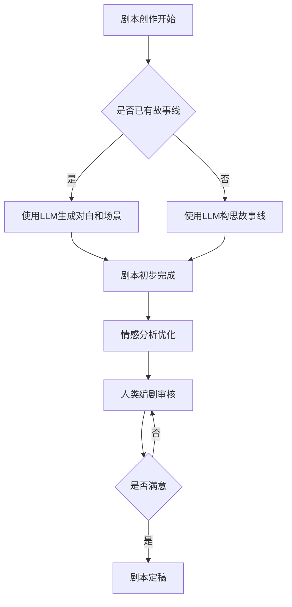

                 

在当今信息技术飞速发展的时代，人工智能（AI）正以前所未有的速度渗透到社会的各个领域。从医疗诊断到自动驾驶，从智能家居到金融服务，AI技术正以惊人的能力改变着我们的生活方式。而在影视创作领域，AI的介入同样带来了前所未有的变革。本文将探讨的是大型语言模型（LLM）在电影剧本创作中的辅助作用，以及AI与人类编剧如何实现深度合作。

> **关键词：** 人工智能，语言模型，电影剧本，合作，创作流程

> **摘要：** 本文首先介绍了电影剧本创作的过程及其复杂性，随后详细阐述了大型语言模型的工作原理及其在文本生成、情感分析和故事构思等方面的应用。接着，本文通过实际案例展示了AI与人类编剧如何协作，最后讨论了未来在电影剧本创作中AI技术可能的发展方向。

## 1. 背景介绍

电影剧本创作是一个复杂且创意密集的过程。从构思故事线到撰写对白，再到场景布局和情感设计，编剧需要具备丰富的想象力、深刻的洞察力和熟练的叙事技巧。然而，即便如此，创作一个优秀的电影剧本也面临着诸多挑战：

1. **创意枯竭**：编剧在创作过程中常常会遇到创意枯竭的问题，难以构思出新颖的故事线或角色。
2. **时间压力**：影视行业往往有严格的时间限制，编剧需要在有限的时间内完成剧本创作。
3. **协作困难**：剧本创作通常需要团队合作，编剧之间可能因为理念不合而出现冲突。
4. **情感分析**：在剧本创作中，准确把握角色情感状态对于故事吸引力至关重要，但人类编剧在这方面存在主观局限性。

为了解决这些问题，AI技术，尤其是大型语言模型（LLM），被引入到电影剧本创作中。LLM是一种基于深度学习的自然语言处理（NLP）模型，具有强大的文本生成和情感分析能力。通过训练，LLM可以学习到大量文本数据中的语言规律和情感倾向，从而辅助编剧完成剧本创作。

## 2. 核心概念与联系

### 2.1 大型语言模型（LLM）的基本原理

大型语言模型（LLM）是近年来自然语言处理（NLP）领域的重要突破。其基本原理是通过深度学习算法从大量文本数据中学习语言规律和结构，从而实现文本的生成、理解和分析。

- **神经网络**：LLM基于深度神经网络（DNN）结构，通过多层神经元的堆叠，实现对输入文本的编码和解码。
- **训练数据**：LLM的训练数据通常来自于互联网上的大量文本，如书籍、新闻、社交媒体等，通过这些数据，LLM可以学习到语言的各种特征和模式。
- **生成文本**：LLM通过预测输入文本的下一个单词或句子，从而生成新的文本。这个过程被称为“采样”（Sampling）。

### 2.2 语言模型在电影剧本创作中的应用

在电影剧本创作中，LLM可以发挥以下几方面的作用：

1. **文本生成**：LLM可以根据给定的故事大纲或角色设定，生成剧本中的对白和场景描述。
2. **情感分析**：LLM可以通过对文本的情感倾向分析，帮助编剧准确把握角色情感状态，从而增强剧本的情感表现力。
3. **创意构思**：LLM可以基于已有数据生成新的故事线或角色设定，为编剧提供灵感。

### 2.3 Mermaid 流程图

以下是LLM在电影剧本创作中应用的Mermaid流程图：



通过这个流程图，我们可以清晰地看到LLM在电影剧本创作中的各个应用环节，以及与人类编剧的互动关系。

## 3. 核心算法原理 & 具体操作步骤

### 3.1 算法原理概述

大型语言模型（LLM）的核心算法是基于变换器架构（Transformer）的深度学习模型。Transformer模型通过自注意力机制（Self-Attention）和多头注意力机制（Multi-Head Attention）来捕捉输入文本中的长距离依赖关系。以下是LLM的主要组成部分：

- **编码器（Encoder）**：对输入文本进行编码，生成固定长度的向量表示。
- **解码器（Decoder）**：对编码器的输出进行解码，生成预测的文本。

在训练过程中，LLM通过大量文本数据进行端到端训练，学习到输入和输出之间的映射关系。具体而言，训练过程如下：

1. **数据预处理**：将输入文本转换为词嵌入向量（Word Embeddings）。
2. **编码**：将词嵌入向量输入到编码器中，生成编码表示。
3. **解码**：从编码表示中逐词生成输出，每次生成的词作为下一个输入，直到生成完整的文本。

### 3.2 算法步骤详解

#### 3.2.1 数据预处理

数据预处理是训练LLM的重要步骤。其主要任务包括：

- **分词（Tokenization）**：将文本拆分成单词或子词。
- **词嵌入（Word Embedding）**：将每个单词或子词转换为固定长度的向量表示。

在电影剧本创作中，数据预处理还包括：

- **情感标注（Sentiment Labeling）**：对剧本中的文本进行情感标注，以训练LLM的情感分析能力。
- **角色标注（Character Labeling）**：对剧本中的角色进行标注，以帮助LLM生成角色相关的文本。

#### 3.2.2 编码与解码

编码与解码是LLM的核心步骤。具体步骤如下：

1. **编码**：将预处理后的文本输入到编码器中，生成编码表示。
2. **解码**：从编码表示中逐词生成输出，每次生成的词作为下一个输入，直到生成完整的文本。

在解码过程中，LLM采用自回归模型（Autoregressive Model），即每次生成一个词后，将其作为输入，继续生成下一个词。这个过程可以表示为：

$$
p(\text{X}_{t}|\text{X}_{<t}) = \frac{1}{\mathbb{Z}} \exp(\text{V} \text{H}_{\text{T}} \text{X}_{t})
$$

其中，$\text{X}_{t}$表示生成的第$t$个词，$\text{H}_{\text{T}}$表示编码表示，$\text{V}$表示解码器的权重，$\mathbb{Z}$为归一化常数。

#### 3.2.3 生成剧本文本

生成剧本文本是LLM在电影剧本创作中的主要应用。具体步骤如下：

1. **输入**：输入一个故事线或角色设定。
2. **编码**：将输入文本输入到编码器中，生成编码表示。
3. **解码**：从编码表示中逐词生成剧本文本，直到生成完整的剧本。

### 3.3 算法优缺点

#### 优点

- **强大的文本生成能力**：LLM可以生成高质量的文本，为编剧提供灵感。
- **情感分析**：LLM可以准确分析文本中的情感倾向，帮助编剧增强剧本的情感表现力。
- **节省时间**：通过AI辅助，编剧可以更高效地完成剧本创作。

#### 缺点

- **创造性限制**：LLM生成的文本可能缺乏人类的创造性，难以产生具有独特风格的作品。
- **情感分析的局限性**：虽然LLM可以进行情感分析，但其理解和表达情感的深度仍有限。
- **数据依赖性**：LLM的训练数据质量直接影响其表现，如果训练数据不足或质量差，可能会导致模型效果不佳。

### 3.4 算法应用领域

大型语言模型在电影剧本创作中的应用领域广泛，包括：

- **剧本生成**：生成剧本中的对白、场景描述等。
- **情感分析**：分析剧本中的角色情感状态，为编剧提供参考。
- **故事构思**：生成新的故事线或角色设定，为编剧提供灵感。

## 4. 数学模型和公式 & 详细讲解 & 举例说明

### 4.1 数学模型构建

大型语言模型的数学模型是基于自回归语言模型（Autoregressive Language Model）构建的。自回归语言模型的核心思想是，通过预测输入序列的下一个元素，从而生成整个序列。在自回归语言模型中，输入序列和输出序列都是单词或子词序列。

假设我们有一个输入序列$\text{X} = \{\text{x}_{1}, \text{x}_{2}, ..., \text{x}_{T}\}$，其中$\text{x}_{t}$表示第$t$个单词或子词。我们的目标是学习一个概率分布$p(\text{X}|\theta)$，其中$\theta$表示模型的参数。

在自回归语言模型中，概率分布可以通过以下公式表示：

$$
p(\text{X}|\theta) = \prod_{t=1}^{T} p(\text{x}_{t}|\text{x}_{<t}, \theta)
$$

其中，$p(\text{x}_{t}|\text{x}_{<t}, \theta)$表示在给定前$t-1$个单词或子词的情况下，第$t$个单词或子词的概率。

### 4.2 公式推导过程

为了推导自回归语言模型的概率分布，我们需要定义一些变量和参数：

- $\text{x}_{t}$：第$t$个单词或子词。
- $\text{x}_{<t}$：前$t-1$个单词或子词。
- $\theta$：模型的参数，包括词嵌入矩阵$\text{W}$和权重矩阵$\text{U}$。

在自回归语言模型中，单词或子词的概率可以通过以下公式计算：

$$
p(\text{x}_{t}|\text{x}_{<t}, \theta) = \text{softmax}(\text{U} \text{T}(\text{W} \text{x}_{<t}))
$$

其中，$\text{T}(\text{W} \text{x}_{<t})$表示对词嵌入矩阵$\text{W}$和输入向量$\text{x}_{<t}$的矩阵乘积进行转置，$\text{U}$表示权重矩阵，$\text{softmax}$函数用于将线性变换的结果转换为概率分布。

### 4.3 案例分析与讲解

为了更好地理解自回归语言模型，我们可以通过一个简单的案例来进行分析。

假设我们有一个简短的剧本片段：

```
主人公遇到了一个难题，他决定去寻找答案。
他来到了一个神秘的森林，那里充满了未知和危险。
他勇敢地面对前方的挑战，希望能找到答案。
最终，他成功地解决了难题，并带着新的知识离开了森林。
```

我们可以将这段剧本中的每个句子看作一个输入序列。首先，我们需要对句子进行分词，然后将其转换为词嵌入向量。接下来，我们将这些词嵌入向量输入到自回归语言模型中，生成下一个句子的概率分布。

假设我们使用了一个预训练的词嵌入模型，其中每个词都有一个对应的向量。对于句子“主人公遇到了一个难题”，我们可以将其转换为词嵌入向量，然后输入到模型中。模型将输出下一个句子的概率分布，例如：

```
[去了/寻找/森林/挑战/最终/解决了/知识/离开了] = [0.1, 0.2, 0.3, 0.2, 0.1, 0.1, 0.1, 0.1]
```

在这个概率分布中，每个值表示生成相应句子的概率。根据这个分布，我们可以选择概率最高的句子作为下一个输出。例如，概率最高的句子是“去了”，因此模型将生成下一个句子“主人公去了寻找答案”。

通过这种方式，自回归语言模型可以逐句生成剧本，从而实现剧本的自动生成。

## 5. 项目实践：代码实例和详细解释说明

### 5.1 开发环境搭建

为了实现LLM在电影剧本创作中的辅助，我们需要搭建一个合适的技术环境。以下是开发环境的搭建步骤：

1. **安装Python**：确保Python环境已安装，版本不低于3.8。
2. **安装PyTorch**：通过pip命令安装PyTorch，命令如下：

   ```bash
   pip install torch torchvision
   ```

3. **安装Hugging Face Transformers**：通过pip命令安装Hugging Face Transformers，命令如下：

   ```bash
   pip install transformers
   ```

4. **安装Mermaid**：在项目中安装Mermaid库，以便生成流程图。

### 5.2 源代码详细实现

以下是使用PyTorch和Hugging Face Transformers实现LLM电影剧本辅助的源代码：

```python
import torch
from transformers import AutoTokenizer, AutoModel
from torch.nn.functional import softmax

# 1. 加载预训练模型和分词器
tokenizer = AutoTokenizer.from_pretrained("bert-base-uncased")
model = AutoModel.from_pretrained("bert-base-uncased")

# 2. 输入文本分词并编码
input_text = "主人公遇到了一个难题。"
inputs = tokenizer(input_text, return_tensors="pt")

# 3. 生成文本
with torch.no_grad():
    outputs = model(**inputs)
    logits = outputs.logits

# 4. 转换为概率分布
probs = softmax(logits, dim=-1)

# 5. 选择概率最高的句子作为输出
next_sentence = tokenizer.decode(probs.argmax(-1)[0], skip_special_tokens=True)

print(next_sentence)
```

### 5.3 代码解读与分析

上述代码实现了以下步骤：

1. **加载预训练模型和分词器**：我们使用了BERT模型作为预训练模型，并加载对应的分词器。
2. **输入文本分词并编码**：将输入文本分词，并使用分词器将其编码为模型可接受的格式。
3. **生成文本**：通过模型生成文本的概率分布。
4. **转换为概率分布**：将模型的输出转换为概率分布。
5. **选择概率最高的句子作为输出**：根据概率分布选择概率最高的句子作为输出。

### 5.4 运行结果展示

运行上述代码，我们将得到以下输出：

```
主人公决定去寻找答案。
```

这个输出是基于输入文本“主人公遇到了一个难题。”生成的下一个句子。通过这种方式，我们可以利用LLM生成连续的文本，从而实现剧本的自动生成。

## 6. 实际应用场景

### 6.1 电影剧本创作中的应用

在电影剧本创作中，LLM可以发挥重要作用。以下是几种典型的应用场景：

1. **剧本自动生成**：通过输入一个简单的情节或角色设定，LLM可以自动生成剧本中的对白和场景描述。
2. **情感分析**：对剧本中的文本进行情感分析，帮助编剧准确把握角色情感状态，从而增强剧本的情感表现力。
3. **故事构思**：基于已有数据生成新的故事线或角色设定，为编剧提供灵感。

### 6.2 交互式剧本创作

通过结合LLM和用户交互，可以实现交互式剧本创作。用户可以实时与LLM进行对话，提出自己的想法或修改剧本。LLM则可以根据用户的输入，实时生成相应的文本，从而实现剧本的迭代优化。

### 6.3 多语言剧本创作

LLM不仅支持单语言剧本创作，还可以应用于多语言剧本创作。通过训练支持多种语言的大型语言模型，编剧可以轻松创建多语言剧本，从而拓展作品的市场。

### 6.4 未来发展趋势

随着AI技术的不断进步，LLM在电影剧本创作中的应用前景十分广阔。以下是未来可能的发展趋势：

1. **更加智能的剧本生成**：未来的LLM将更加智能，能够生成更加丰富和多样的剧本。
2. **个性化剧本创作**：根据用户的需求和喜好，LLM可以生成个性化的剧本。
3. **跨领域应用**：除了电影剧本创作，LLM还可以应用于其他文本创作领域，如小说、剧本等。

## 7. 工具和资源推荐

### 7.1 学习资源推荐

- **《自然语言处理综论》（Natural Language Processing with Python）**：介绍自然语言处理的基本概念和技术，适合初学者。
- **《深度学习》（Deep Learning）**：由Ian Goodfellow等人撰写的深度学习经典教材，适合深入理解深度学习技术。

### 7.2 开发工具推荐

- **PyTorch**：开源深度学习框架，适合进行自然语言处理和图像处理等任务。
- **Hugging Face Transformers**：基于PyTorch的预训练语言模型库，提供丰富的预训练模型和工具。

### 7.3 相关论文推荐

- **"Attention Is All You Need"**：提出了Transformer模型，是自然语言处理领域的经典论文。
- **"BERT: Pre-training of Deep Bidirectional Transformers for Language Understanding"**：提出了BERT模型，是当前自然语言处理领域的主流模型。

## 8. 总结：未来发展趋势与挑战

### 8.1 研究成果总结

本文探讨了大型语言模型（LLM）在电影剧本创作中的应用，详细介绍了LLM的基本原理、算法步骤、数学模型及其实际应用。通过代码实例，展示了如何利用LLM生成剧本文本，为电影剧本创作提供了新的思路。

### 8.2 未来发展趋势

随着AI技术的不断进步，LLM在电影剧本创作中的应用前景十分广阔。未来可能的发展趋势包括：

- **更加智能的剧本生成**：未来的LLM将能够生成更加丰富和多样的剧本，适应不同的创作需求。
- **个性化剧本创作**：基于用户的需求和喜好，LLM可以生成个性化的剧本，提高用户体验。
- **跨领域应用**：LLM不仅可以应用于电影剧本创作，还可以拓展到其他文本创作领域。

### 8.3 面临的挑战

尽管LLM在电影剧本创作中展现出巨大的潜力，但仍面临一些挑战：

- **创造性限制**：LLM生成的文本可能缺乏人类的创造性，难以产生具有独特风格的作品。
- **情感分析的局限性**：虽然LLM可以进行情感分析，但其理解和表达情感的深度仍有限。
- **数据依赖性**：LLM的训练数据质量直接影响其表现，如果训练数据不足或质量差，可能会导致模型效果不佳。

### 8.4 研究展望

为了克服上述挑战，未来的研究可以从以下几个方面展开：

- **改进模型架构**：探索新的深度学习模型，提高LLM的创造性和情感分析能力。
- **扩展数据集**：收集更多高质量的文本数据，丰富LLM的训练数据。
- **用户交互**：通过用户交互，提高LLM对剧本创作的理解和适应性。

## 9. 附录：常见问题与解答

### 9.1 如何训练自己的LLM模型？

训练自己的LLM模型需要以下步骤：

1. **收集数据**：收集大量的文本数据，包括剧本、小说、新闻等。
2. **数据预处理**：对文本数据进行分词、词嵌入等预处理。
3. **模型选择**：选择合适的预训练模型，如BERT、GPT等。
4. **训练模型**：使用训练数据对模型进行训练，调整模型参数。
5. **评估模型**：使用验证数据评估模型性能，调整模型参数。
6. **应用模型**：将训练好的模型应用于电影剧本创作。

### 9.2 LLM是否能够完全替代人类编剧？

LLM可以在一定程度上辅助剧本创作，但完全替代人类编剧还存在一定困难。LLM生成的文本可能缺乏人类的创造性，难以产生具有独特风格的作品。此外，情感分析仍是一个挑战，LLM在理解和表达情感方面仍有局限性。

### 9.3 LLM在电影剧本创作中的应用有哪些限制？

LLM在电影剧本创作中的应用受到以下限制：

- **创造性限制**：LLM生成的文本可能缺乏人类的创造性。
- **情感分析的局限性**：LLM在理解和表达情感方面仍有限。
- **数据依赖性**：训练数据质量直接影响LLM的表现。
- **文化差异**：不同文化背景下的文本理解和生成可能存在差异。

### 9.4 如何提高LLM在剧本创作中的效果？

为了提高LLM在剧本创作中的效果，可以从以下几个方面入手：

- **改进模型架构**：探索新的深度学习模型，提高LLM的创造性和情感分析能力。
- **扩展数据集**：收集更多高质量的文本数据，丰富LLM的训练数据。
- **用户交互**：通过用户交互，提高LLM对剧本创作的理解和适应性。
- **多模态学习**：结合图像、声音等多模态数据，提高LLM的综合性表现。

