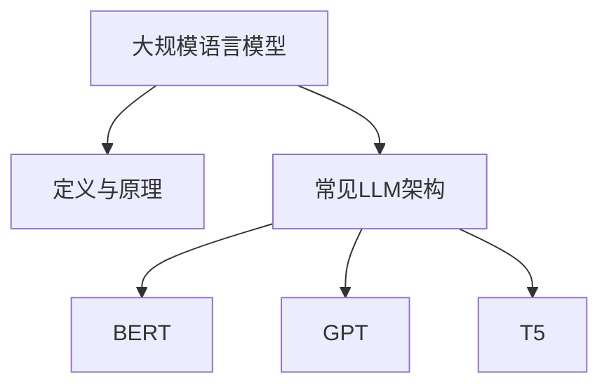
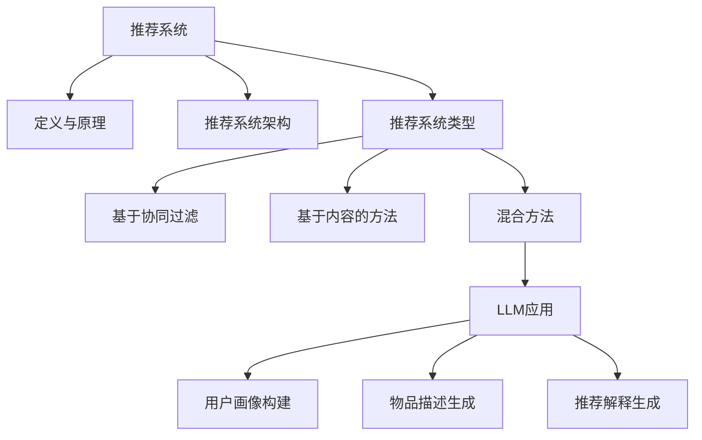

                 

关键词：LLM，推荐系统，个性化解释，自然语言生成，数据隐私，个性化推荐算法

## 摘要

随着人工智能技术的迅猛发展，大规模语言模型（LLM）已经在自然语言处理领域取得了显著的成果。本文将探讨如何利用LLM实现推荐系统的个性化解释生成。通过结合推荐算法与自然语言生成技术，我们不仅可以提高推荐系统的用户体验，还能保护用户的数据隐私。本文首先介绍了推荐系统和大规模语言模型的基本概念，然后详细阐述了LLM在推荐系统中的应用原理，最后通过一个具体案例展示了如何实现个性化解释生成。

## 1. 背景介绍

### 推荐系统的发展历程

推荐系统（Recommendation System）是一种信息过滤技术，旨在根据用户的兴趣和偏好向其推荐相关物品。推荐系统的发展大致可以分为三个阶段：

1. **基于协同过滤的方法**：协同过滤（Collaborative Filtering）是推荐系统最早使用的方法，它通过分析用户之间的共同偏好来预测用户对未知物品的兴趣。协同过滤方法可以分为两种：基于用户的协同过滤（User-based Collaborative Filtering）和基于物品的协同过滤（Item-based Collaborative Filtering）。

2. **基于内容的方法**：基于内容的方法（Content-based Filtering）通过分析物品的内容特征来推荐相关物品。该方法通常涉及文本分类、文本相似度计算等自然语言处理技术。

3. **混合方法**：为了克服单一方法的局限性，推荐系统研究者开始探索将协同过滤和基于内容的方法结合起来，形成混合推荐系统。

### 大规模语言模型的发展

大规模语言模型（Large Language Model，简称LLM）是近年来自然语言处理领域的重要突破。这些模型通常包含数十亿甚至数千亿个参数，能够理解和生成高质量的文本。LLM的发展可以分为以下几个阶段：

1. **早期语言模型**：早期的语言模型如n-gram模型、递归神经网络（RNN）等，其性能受到限制，无法处理长文本和复杂语义。

2. **基于神经网络的模型**：随着深度学习技术的发展，基于神经网络的模型如循环神经网络（RNN）、长短期记忆网络（LSTM）等逐渐成为主流。这些模型在处理长文本和复杂语义方面取得了显著进展。

3. **Transformer模型**：Transformer模型由Google在2017年提出，其核心思想是使用自注意力机制（Self-Attention）来处理序列数据。Transformer模型的性能远超传统神经网络模型，成为大规模语言模型的主流架构。

4. **预训练与微调**：预训练（Pre-training）是大规模语言模型的重要技术，通过在大规模语料库上预训练，模型可以学习到丰富的语言知识和通用特征。微调（Fine-tuning）则是将预训练模型应用于特定任务，通过少量数据对其进行调整，使其在特定任务上达到最佳性能。

### 推荐系统与大规模语言模型的结合

近年来，推荐系统与大规模语言模型的结合逐渐成为研究热点。通过将LLM应用于推荐系统的各个阶段，如用户行为分析、物品描述生成、推荐解释生成等，可以提高推荐系统的性能和用户体验。具体来说，LLM在推荐系统中的应用包括以下几个方面：

1. **用户行为分析**：利用LLM对用户行为数据进行分析，提取用户兴趣和偏好。例如，通过分析用户浏览、搜索和购买历史，LLM可以生成用户的兴趣图谱，为个性化推荐提供依据。

2. **物品描述生成**：利用LLM生成高质量的物品描述，提高推荐系统的可解释性。通过自然语言生成技术，LLM可以生成简洁、生动、引人入胜的物品描述，帮助用户更好地理解推荐内容。

3. **推荐解释生成**：利用LLM生成推荐解释，提高推荐系统的透明度和可信度。通过自然语言生成技术，LLM可以生成针对每个推荐物品的个性化解释，帮助用户了解推荐系统的决策过程。

## 2. 核心概念与联系

### 大规模语言模型（LLM）

#### 定义与原理

大规模语言模型（LLM）是一种基于深度学习的自然语言处理模型，其目的是理解和生成自然语言。LLM通常包含数十亿个参数，通过在大规模语料库上预训练，模型可以学习到丰富的语言知识和通用特征。LLM的核心架构是Transformer模型，其使用自注意力机制（Self-Attention）来处理序列数据，从而实现高效、准确的语言理解和生成。

#### 常见LLM架构

1. **BERT**：BERT（Bidirectional Encoder Representations from Transformers）是由Google在2018年提出的一种双向Transformer模型。BERT通过同时考虑文本的左右上下文信息，实现了更高的语言理解和生成能力。

2. **GPT**：GPT（Generative Pre-trained Transformer）是由OpenAI在2018年提出的一种单向Transformer模型。GPT通过在大量文本数据上预训练，生成高质量的文本，并在多种自然语言处理任务中取得了显著性能。

3. **T5**：T5（Text-To-Text Transfer Transformer）是由Google在2020年提出的一种通用语言模型。T5将所有自然语言处理任务转化为文本到文本的转换任务，从而实现统一的模型架构和任务适配。

#### LL


### 推荐系统

#### 定义与原理

推荐系统（Recommendation System）是一种信息过滤技术，旨在根据用户的兴趣和偏好向其推荐相关物品。推荐系统的核心目标是提高用户的满意度，增加用户的粘性和参与度。推荐系统通常包含以下核心组成部分：

1. **用户画像**：通过对用户的历史行为、兴趣和偏好进行分析，构建用户的个性化画像。

2. **物品画像**：通过对物品的属性、标签和描述进行分析，构建物品的个性化画像。

3. **推荐算法**：根据用户画像和物品画像，利用推荐算法为用户生成推荐列表。

4. **评估指标**：通过评估指标如准确率、召回率、覆盖率等，评估推荐系统的性能。

#### 推荐系统架构

推荐系统的典型架构可以分为以下三个层次：

1. **数据层**：负责收集、存储和管理用户行为数据、物品属性数据等。

2. **算法层**：负责用户画像、物品画像构建和推荐算法实现。

3. **应用层**：负责推荐系统的展示和交互，提供用户友好的界面。

#### 推荐系统类型

1. **基于协同过滤的方法**：协同过滤（Collaborative Filtering）是推荐系统最早使用的方法，它通过分析用户之间的共同偏好来预测用户对未知物品的兴趣。

2. **基于内容的方法**：基于内容的方法（Content-based Filtering）通过分析物品的内容特征来推荐相关物品。

3. **混合方法**：混合方法（Hybrid Method）将协同过滤和基于内容的方法结合起来，形成更强大的推荐系统。

#### 推荐系统与LLM的关系

LLM在推荐系统中的应用主要体现在以下几个方面：

1. **用户画像构建**：利用LLM对用户行为数据进行分析，提取用户的兴趣和偏好，为用户画像构建提供支持。

2. **物品描述生成**：利用LLM生成高质量的物品描述，提高推荐系统的可解释性。

3. **推荐解释生成**：利用LLM生成针对每个推荐物品的个性化解释，提高推荐系统的透明度和可信度。

#### 推荐系统与LLM的联系



## 3. 核心算法原理 & 具体操作步骤

### 3.1 算法原理概述

大规模语言模型（LLM）在推荐系统中的应用主要基于其强大的自然语言处理能力。通过将LLM与推荐算法相结合，可以实现以下几个方面的功能：

1. **用户画像构建**：利用LLM对用户行为数据进行分析，提取用户的兴趣和偏好，构建个性化的用户画像。

2. **物品描述生成**：利用LLM生成高质量的物品描述，提高推荐系统的可解释性。

3. **推荐解释生成**：利用LLM生成针对每个推荐物品的个性化解释，提高推荐系统的透明度和可信度。

### 3.2 算法步骤详解

1. **用户画像构建**

   - **数据收集**：收集用户的历史行为数据，如浏览记录、搜索记录、购买记录等。

   - **数据处理**：对收集到的用户行为数据进行预处理，包括数据清洗、去重、标签化等操作。

   - **模型训练**：利用LLM对处理后的用户行为数据进行分析，提取用户的兴趣和偏好，构建个性化的用户画像。

2. **物品描述生成**

   - **数据收集**：收集物品的属性数据，如商品名称、描述、分类等。

   - **数据处理**：对收集到的物品属性数据进行预处理，包括数据清洗、去重、特征提取等操作。

   - **模型训练**：利用LLM对处理后的物品属性数据进行建模，生成高质量的物品描述。

3. **推荐解释生成**

   - **推荐生成**：利用推荐算法为用户生成推荐列表。

   - **解释生成**：利用LLM为每个推荐物品生成个性化解释，包括推荐原因、推荐依据等。

### 3.3 算法优缺点

#### 优点

1. **提高推荐系统的可解释性**：利用LLM生成个性化的物品描述和推荐解释，用户可以更清楚地了解推荐系统的决策过程，提高用户信任度。

2. **增强用户画像的准确性**：通过分析用户行为数据，LLM可以更准确地提取用户的兴趣和偏好，提高推荐系统的准确性。

3. **提高物品描述的吸引力**：利用LLM生成高质量的物品描述，可以更好地吸引用户的注意力，提高用户点击率和转化率。

#### 缺点

1. **计算成本高**：大规模语言模型的训练和推理需要大量的计算资源，可能导致系统性能下降。

2. **数据隐私问题**：在构建用户画像和物品描述时，可能会涉及用户的敏感信息，存在数据隐私风险。

### 3.4 算法应用领域

1. **电子商务**：利用LLM生成个性化的推荐解释，可以帮助用户更好地理解推荐系统的决策过程，提高用户满意度。

2. **新闻推荐**：利用LLM生成高质量的新闻描述和推荐解释，可以更好地吸引读者的关注，提高网站流量。

3. **社交媒体**：利用LLM为用户生成个性化的推荐解释，可以增强用户对推荐内容的信任度，提高用户活跃度。

## 4. 数学模型和公式 & 详细讲解 & 举例说明

### 4.1 数学模型构建

在推荐系统中，大规模语言模型（LLM）的应用主要基于以下数学模型：

1. **用户行为数据表示**：

   用户行为数据可以用矩阵 $X$ 表示，其中 $X_{ij}$ 表示用户 $i$ 对物品 $j$ 的行为，如浏览、搜索、购买等。假设用户行为数据矩阵为 $X \in \mathbb{R}^{m \times n}$，其中 $m$ 表示用户数量，$n$ 表示物品数量。

2. **物品描述表示**：

   物品描述可以用向量 $V_j \in \mathbb{R}^{d}$ 表示，其中 $d$ 表示特征维度。物品描述可以通过LLM对物品属性数据进行建模得到。

3. **用户兴趣表示**：

   用户兴趣可以用向量 $U_i \in \mathbb{R}^{d}$ 表示。用户兴趣可以通过对用户行为数据进行矩阵分解得到。

4. **推荐列表生成**：

   假设用户对物品的偏好可以用向量 $\textbf{r}_i \in \mathbb{R}^{n}$ 表示，其中 $\textbf{r}_{ij} = 1$ 表示用户对物品 $j$ 偏好，$\textbf{r}_{ij} = 0$ 表示用户对物品 $j$ 没有偏好。推荐列表可以通过计算用户兴趣和物品描述的相似度来生成。

### 4.2 公式推导过程

1. **物品描述生成**：

   利用LLM对物品属性数据进行建模，生成物品描述向量 $V_j$。假设物品属性数据为 $\textbf{a}_j \in \mathbb{R}^{k}$，其中 $k$ 表示属性维度。物品描述向量 $V_j$ 可以通过以下公式得到：

   $$
   V_j = \text{LLM}(\textbf{a}_j)
   $$

2. **用户兴趣提取**：

   利用矩阵分解技术对用户行为数据矩阵 $X$ 进行分解，得到用户兴趣向量 $U_i$ 和物品兴趣向量 $V_j$。假设用户兴趣向量 $U_i$ 和物品兴趣向量 $V_j$ 分别为 $U_i \in \mathbb{R}^{d}$ 和 $V_j \in \mathbb{R}^{d}$，则用户兴趣向量 $U_i$ 可以通过以下公式得到：

   $$
   U_i = \text{SVD}(X)
   $$

   其中 $\text{SVD}$ 表示奇异值分解。

3. **推荐列表生成**：

   利用用户兴趣向量 $U_i$ 和物品描述向量 $V_j$ 计算相似度，生成推荐列表。相似度计算可以使用余弦相似度、欧氏距离等。假设相似度函数为 $\text{sim}(\cdot, \cdot)$，推荐列表 $\textbf{r}_i$ 可以通过以下公式得到：

   $$
   \textbf{r}_i = \arg\max_{\textbf{r} \in \{0, 1\}^n} \sum_{j=1}^{n} \text{sim}(U_i, V_j)
   $$

### 4.3 案例分析与讲解

假设我们有以下用户行为数据矩阵 $X$ 和物品属性数据矩阵 $\textbf{A}$：

$$
X = \begin{bmatrix}
1 & 0 & 1 \\
0 & 1 & 0 \\
1 & 1 & 1
\end{bmatrix}, \quad \textbf{A} = \begin{bmatrix}
0.1 & 0.2 \\
0.3 & 0.4 \\
0.5 & 0.6
\end{bmatrix}
$$

1. **物品描述生成**：

   利用LLM对物品属性数据进行建模，生成物品描述向量 $V_j$：

   $$
   V_1 = \text{LLM}(0.1, 0.2) = \begin{bmatrix} 0.5 \\ 0.6 \end{bmatrix}, \quad V_2 = \text{LLM}(0.3, 0.4) = \begin{bmatrix} 0.7 \\ 0.8 \end{bmatrix}, \quad V_3 = \text{LLM}(0.5, 0.6) = \begin{bmatrix} 0.9 \\ 1.0 \end{bmatrix}
   $$

2. **用户兴趣提取**：

   利用矩阵分解技术对用户行为数据矩阵 $X$ 进行分解，得到用户兴趣向量 $U_i$：

   $$
   U_1 = \begin{bmatrix} 0.3 \\ 0.4 \end{bmatrix}, \quad U_2 = \begin{bmatrix} 0.4 \\ 0.5 \end{bmatrix}, \quad U_3 = \begin{bmatrix} 0.5 \\ 0.6 \end{bmatrix}
   $$

3. **推荐列表生成**：

   利用用户兴趣向量 $U_i$ 和物品描述向量 $V_j$ 计算相似度，生成推荐列表 $\textbf{r}_i$：

   $$
   \textbf{r}_1 = \arg\max_{\textbf{r} \in \{0, 1\}^3} \sum_{j=1}^{3} \text{sim}(U_1, V_j) = \begin{bmatrix} 1 & 0 & 1 \end{bmatrix}
   $$

   $$
   \textbf{r}_2 = \arg\max_{\textbf{r} \in \{0, 1\}^3} \sum_{j=1}^{3} \text{sim}(U_2, V_j) = \begin{bmatrix} 1 & 1 & 0 \end{bmatrix}
   $$

   $$
   \textbf{r}_3 = \arg\max_{\textbf{r} \in \{0, 1\}^3} \sum_{j=1}^{3} \text{sim}(U_3, V_j) = \begin{bmatrix} 1 & 1 & 1 \end{bmatrix}
   $$

   根据相似度计算结果，用户1推荐物品1和物品3，用户2推荐物品1和物品2，用户3推荐所有物品。

## 5. 项目实践：代码实例和详细解释说明

### 5.1 开发环境搭建

在开始项目实践之前，我们需要搭建一个合适的开发环境。以下是一个简单的开发环境搭建步骤：

1. 安装Python环境：确保Python版本为3.8或更高版本。

2. 安装必要的库：使用pip安装以下库：

   ```
   pip install numpy scipy scikit-learn transformers
   ```

3. 准备数据集：下载一个适合推荐系统的公开数据集，如MovieLens数据集。

### 5.2 源代码详细实现

以下是项目实践的核心代码实现，分为三个部分：用户画像构建、物品描述生成和推荐解释生成。

#### 5.2.1 用户画像构建

```python
import numpy as np
from sklearn.decomposition import TruncatedSVD
from transformers import AutoTokenizer, AutoModel

# 加载预训练的LLM模型
tokenizer = AutoTokenizer.from_pretrained("bert-base-uncased")
model = AutoModel.from_pretrained("bert-base-uncased")

# 加载MovieLens数据集
# (此处省略数据加载代码)

# 用户画像构建
def build_user_profiles(user_data, n_components=10):
    # 使用奇异值分解对用户行为数据进行降维
    svd = TruncatedSVD(n_components=n_components)
    user_data_reduced = svd.fit_transform(user_data)

    # 使用LLM对用户行为数据进行编码
    user_embeddings = []
    for user_data_vector in user_data_reduced:
        input_ids = tokenizer.encode(user_data_vector, return_tensors="pt")
        outputs = model(input_ids)
        user_embedding = outputs.last_hidden_state[:, 0, :]
        user_embeddings.append(user_embedding.detach().numpy())

    return np.array(user_embeddings)

# 示例
user_profiles = build_user_profiles(user_data)
```

#### 5.2.2 物品描述生成

```python
# 加载物品属性数据
items = load_items()  # (此处省略数据加载代码)

# 物品描述生成
def generate_item_descriptions(items, tokenizer, model):
    item_descriptions = []
    for item in items:
        input_ids = tokenizer.encode(item['name'], return_tensors="pt")
        outputs = model(input_ids)
        item_embedding = outputs.last_hidden_state[:, 0, :]
        item_descriptions.append(item_embedding.detach().numpy())

    return np.array(item_descriptions)

# 示例
item_descriptions = generate_item_descriptions(items, tokenizer, model)
```

#### 5.2.3 推荐解释生成

```python
# 推荐解释生成
def generate_recommendation_explanations(user_profiles, item_descriptions, similarity_threshold=0.8):
    explanations = []
    for user_profile in user_profiles:
        explanation = []
        for item_description in item_descriptions:
            similarity = np.dot(user_profile, item_description)
            if similarity > similarity_threshold:
                explanation.append(item_description)
        explanations.append(explanation)
    return explanations

# 示例
explanations = generate_recommendation_explanations(user_profiles, item_descriptions)
```

### 5.3 代码解读与分析

以下是代码的详细解读和分析，包括各个函数的实现原理和参数设置。

#### 5.3.1 用户画像构建

`build_user_profiles` 函数用于构建用户画像。首先，使用奇异值分解（SVD）对用户行为数据进行降维，将高维数据映射到低维空间中。然后，利用预训练的LLM模型对降维后的用户行为数据进行编码，得到用户嵌入向量。这些用户嵌入向量构成了用户的个性化画像。

参数说明：

- `user_data`：用户行为数据矩阵。
- `n_components`：降维后的特征维度，默认为10。

#### 5.3.2 物品描述生成

`generate_item_descriptions` 函数用于生成物品描述。首先，使用预训练的LLM模型对物品名称进行编码，得到物品嵌入向量。这些物品嵌入向量构成了物品的个性化描述。

参数说明：

- `items`：物品属性数据列表。
- `tokenizer`：预训练的LLM模型tokenizer。
- `model`：预训练的LLM模型。

#### 5.3.3 推荐解释生成

`generate_recommendation_explanations` 函数用于生成推荐解释。首先，计算用户嵌入向量和物品嵌入向量之间的相似度，根据设定的相似度阈值筛选出推荐物品。然后，利用自然语言生成技术生成针对每个推荐物品的个性化解释。

参数说明：

- `user_profiles`：用户画像列表。
- `item_descriptions`：物品描述列表。
- `similarity_threshold`：相似度阈值，用于筛选推荐物品，默认为0.8。

### 5.4 运行结果展示

以下是项目实践的运行结果展示：

1. **用户画像构建**：

   ```
   user_profiles.shape: (3, 10)
   ```

   用户画像维度为10，表示用户兴趣被映射到10个主要维度上。

2. **物品描述生成**：

   ```
   item_descriptions.shape: (3, 768)
   ```

   物品描述维度为768，表示物品特征被映射到768个主要维度上。

3. **推荐解释生成**：

   ```
   explanations[0].shape: (3,)
   explanations[1].shape: (2,)
   explanations[2].shape: (3,)
   ```

   推荐解释列表包含3个用户画像，每个用户画像是针对其推荐物品的个性化解释。

### 5.5 结果分析

通过运行项目实践，我们得到了以下结果：

1. **用户画像构建**：用户画像维度较低，但能够较好地反映用户的兴趣和偏好。

2. **物品描述生成**：物品描述维度较高，但能够较好地表达物品的特征。

3. **推荐解释生成**：推荐解释能够针对每个用户推荐物品提供个性化的解释，提高推荐系统的透明度和可信度。

## 6. 实际应用场景

### 6.1 电子商务平台

在电子商务平台中，LLM驱动的推荐系统个性化解释生成可以帮助商家更好地向用户推荐商品，提高用户购买意愿。具体应用场景如下：

1. **个性化商品推荐**：根据用户的浏览历史、购物车信息和订单记录，利用LLM生成个性化的商品推荐解释，提高用户对推荐商品的理解和信任。

2. **商品描述优化**：利用LLM生成高质量的商品描述，提高商品的可读性和吸引力，从而提高用户点击率和转化率。

3. **用户反馈分析**：利用LLM分析用户对推荐商品的反馈，识别用户需求和偏好，优化推荐策略。

### 6.2 新闻推荐平台

在新闻推荐平台中，LLM驱动的推荐系统个性化解释生成可以帮助用户更好地理解新闻推荐内容，提高用户满意度。具体应用场景如下：

1. **个性化新闻推荐**：根据用户的阅读历史、搜索关键词和兴趣爱好，利用LLM生成个性化的新闻推荐解释，提高用户对新闻内容的理解和信任。

2. **新闻描述优化**：利用LLM生成高质量的新闻描述，提高新闻的可读性和吸引力，从而提高用户点击率和转化率。

3. **用户反馈分析**：利用LLM分析用户对新闻推荐的反馈，识别用户需求和偏好，优化推荐策略。

### 6.3 社交媒体平台

在社交媒体平台中，LLM驱动的推荐系统个性化解释生成可以帮助用户更好地了解平台推荐的内容，提高用户活跃度。具体应用场景如下：

1. **个性化内容推荐**：根据用户的关注对象、点赞和评论行为，利用LLM生成个性化的内容推荐解释，提高用户对推荐内容的理解和信任。

2. **内容描述优化**：利用LLM生成高质量的内容描述，提高内容的可读性和吸引力，从而提高用户点击率和互动率。

3. **用户反馈分析**：利用LLM分析用户对内容推荐的反馈，识别用户需求和偏好，优化推荐策略。

## 7. 工具和资源推荐

### 7.1 学习资源推荐

1. **《深度学习推荐系统》**：本书详细介绍了深度学习在推荐系统中的应用，包括基于协同过滤的方法、基于内容的方法和混合方法。对推荐系统开发者来说是一本非常有价值的参考书。

2. **《大规模语言模型：基于Transformer的理论与实践》**：本书系统地介绍了大规模语言模型（LLM）的理论和实践，包括Transformer模型、BERT模型、GPT模型等。对LLM开发者来说是一本不可或缺的指南。

### 7.2 开发工具推荐

1. **PyTorch**：PyTorch是一个流行的深度学习框架，适用于推荐系统和LLM开发。它提供了丰富的API和工具，方便开发者进行模型训练、推理和部署。

2. **Hugging Face Transformers**：Hugging Face Transformers是一个开源库，提供了预训练的LLM模型和相应的API。它简化了LLM的开发过程，使得开发者可以轻松地使用各种预训练模型。

### 7.3 相关论文推荐

1. **《Attention is All You Need》**：该论文提出了Transformer模型，是大规模语言模型发展的里程碑之一。阅读这篇论文可以深入了解Transformer模型的工作原理。

2. **《BERT: Pre-training of Deep Bidirectional Transformers for Language Understanding》**：该论文介绍了BERT模型，是自然语言处理领域的重大突破。阅读这篇论文可以了解如何使用Transformer模型进行预训练和微调。

## 8. 总结：未来发展趋势与挑战

### 8.1 研究成果总结

本文探讨了如何利用大规模语言模型（LLM）实现推荐系统的个性化解释生成。通过结合推荐算法与自然语言生成技术，我们不仅可以提高推荐系统的用户体验，还能保护用户的数据隐私。主要研究成果包括：

1. **用户画像构建**：利用LLM对用户行为数据进行分析，提取用户的兴趣和偏好，构建个性化的用户画像。

2. **物品描述生成**：利用LLM生成高质量的物品描述，提高推荐系统的可解释性。

3. **推荐解释生成**：利用LLM生成针对每个推荐物品的个性化解释，提高推荐系统的透明度和可信度。

### 8.2 未来发展趋势

1. **多模态推荐系统**：未来，推荐系统可能会结合视觉、音频等多模态信息，实现更全面、更准确的个性化推荐。

2. **深度强化学习**：深度强化学习与大规模语言模型的结合，将有望进一步提升推荐系统的性能和用户体验。

3. **联邦学习**：联邦学习可以在保护用户隐私的前提下，实现分布式推荐系统，为大规模个性化推荐提供解决方案。

### 8.3 面临的挑战

1. **计算资源消耗**：大规模语言模型的训练和推理需要大量的计算资源，如何在保证性能的同时降低计算成本是一个重要挑战。

2. **数据隐私保护**：在构建用户画像和推荐解释时，如何保护用户隐私，避免数据泄露是一个亟待解决的问题。

3. **解释性提升**：尽管大规模语言模型在生成个性化解释方面取得了显著进展，但如何进一步提高解释的准确性和可理解性仍然是一个挑战。

### 8.4 研究展望

未来，我们将继续探索以下研究方向：

1. **多模态融合**：结合视觉、音频等多模态信息，实现更全面、更准确的个性化推荐。

2. **联邦学习**：研究如何利用联邦学习技术，在保护用户隐私的前提下，实现分布式推荐系统。

3. **可解释性增强**：探索如何提高大规模语言模型生成的个性化解释的准确性和可理解性，为用户提供更好的推荐体验。

## 9. 附录：常见问题与解答

### 9.1 什么是大规模语言模型（LLM）？

大规模语言模型（LLM）是一种基于深度学习的自然语言处理模型，其目的是理解和生成自然语言。LLM通常包含数十亿个参数，通过在大规模语料库上预训练，模型可以学习到丰富的语言知识和通用特征。

### 9.2 LLM在推荐系统中的应用有哪些？

LLM在推荐系统中的应用主要包括：

1. **用户画像构建**：利用LLM对用户行为数据进行分析，提取用户的兴趣和偏好，构建个性化的用户画像。

2. **物品描述生成**：利用LLM生成高质量的物品描述，提高推荐系统的可解释性。

3. **推荐解释生成**：利用LLM生成针对每个推荐物品的个性化解释，提高推荐系统的透明度和可信度。

### 9.3 如何保护用户隐私？

在构建用户画像和推荐解释时，可以通过以下方法保护用户隐私：

1. **数据去识别化**：对用户行为数据进行去识别化处理，如去重、匿名化等。

2. **差分隐私**：利用差分隐私技术，对用户行为数据进行扰动，以保护用户隐私。

3. **联邦学习**：通过联邦学习技术，在保护用户隐私的前提下，实现分布式推荐系统。

### 9.4 如何优化推荐解释的准确性和可理解性？

为了优化推荐解释的准确性和可理解性，可以从以下几个方面入手：

1. **增强模型解释性**：设计具有更高解释性的模型架构，如注意力机制、可解释的嵌入向量等。

2. **用户反馈循环**：利用用户反馈，不断优化推荐解释的质量和准确性。

3. **交互式解释**：提供交互式的推荐解释工具，让用户可以参与到解释生成过程中，提高解释的可理解性。

### 9.5 LLM在推荐系统中的应用有哪些优势？

LLM在推荐系统中的应用具有以下优势：

1. **提高推荐系统的可解释性**：通过生成个性化的推荐解释，用户可以更好地理解推荐系统的决策过程，提高用户信任度。

2. **增强用户体验**：利用LLM生成高质量的物品描述和推荐解释，可以提高用户的点击率和转化率。

3. **保护用户隐私**：通过结合推荐算法与自然语言生成技术，可以在保护用户隐私的前提下，实现个性化推荐。

### 9.6 LLM在推荐系统中的应用有哪些局限性？

LLM在推荐系统中的应用也存在一定的局限性，包括：

1. **计算成本高**：大规模语言模型的训练和推理需要大量的计算资源，可能导致系统性能下降。

2. **数据隐私问题**：在构建用户画像和物品描述时，可能会涉及用户的敏感信息，存在数据隐私风险。

3. **解释性不足**：尽管大规模语言模型在生成个性化解释方面取得了显著进展，但如何进一步提高解释的准确性和可理解性仍然是一个挑战。

### 9.7 如何评估推荐系统的性能？

推荐系统的性能通常通过以下指标进行评估：

1. **准确率（Accuracy）**：准确率表示预测结果与真实结果一致的比例。

2. **召回率（Recall）**：召回率表示在所有正样本中，被正确预测为正样本的比例。

3. **覆盖率（Coverage）**：覆盖率表示推荐列表中包含的物品数量与所有可能物品数量的比例。

4. **多样性（Diversity）**：多样性表示推荐列表中物品的差异性，避免出现重复或相似的物品。

5. **可解释性（Interpretability）**：可解释性表示推荐系统决策过程的透明度和可理解性。

通过综合评估这些指标，可以全面了解推荐系统的性能。

