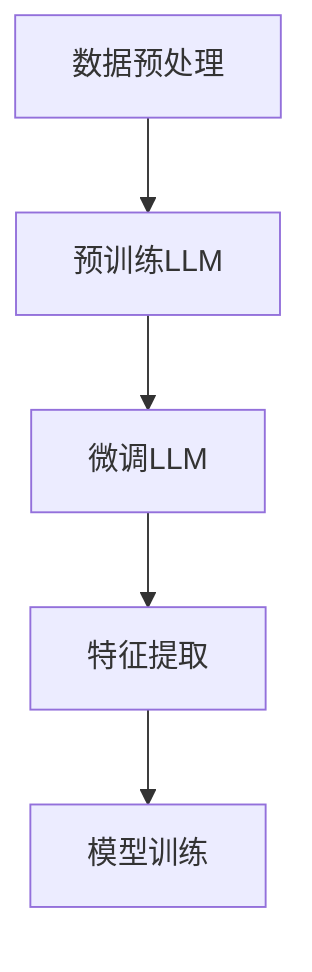

                 

推荐系统是现代信息社会中不可或缺的一部分，其目标是通过理解用户的兴趣和行为，向用户推荐他们可能感兴趣的内容或商品。然而，推荐系统的质量往往取决于其表示学习的质量。传统的特征工程方法往往依赖于手工设计特征，这不仅耗时耗力，而且难以适应动态变化的用户偏好。为此，近年来，许多研究开始探讨如何利用大型语言模型（LLM）来驱动特征编码，从而提升推荐系统的表示学习质量。

## 关键词

- 推荐系统
- 特征编码
- 大型语言模型
- 表示学习
- 机器学习
- 人工智能

## 摘要

本文旨在探讨如何利用大型语言模型（LLM）来驱动特征编码，以提升推荐系统的表示学习质量。我们首先介绍了推荐系统的基础知识，然后详细阐述了特征编码的概念及其在推荐系统中的重要性。接着，我们介绍了LLM的基本原理，并解释了如何将其应用于特征编码。最后，我们通过具体的数学模型和代码实例，展示了LLM驱动特征编码的实践方法和效果。

## 1. 背景介绍

### 1.1 推荐系统概述

推荐系统是一种基于数据挖掘和机器学习的应用，旨在向用户推荐他们可能感兴趣的内容或商品。推荐系统的核心目标是提高用户的满意度，增加用户粘性，从而提高平台的商业价值。根据推荐策略的不同，推荐系统可以分为基于内容的推荐、协同过滤推荐和混合推荐等类型。

- **基于内容的推荐**：该方法通过分析用户的历史行为和偏好，提取出相关的特征，然后根据这些特征推荐相似的内容或商品。

- **协同过滤推荐**：该方法通过分析用户之间的相似性，找出相似的用户群体，然后根据这些用户的偏好推荐新的内容或商品。

- **混合推荐**：该方法结合了基于内容和协同过滤推荐的优势，通过综合考虑用户的历史行为和偏好，以及其他用户的反馈，提供更加个性化的推荐。

### 1.2 特征编码的重要性

在推荐系统中，特征编码是关键的一步。特征编码的目的是将原始数据转换为适合机器学习算法的形式。高质量的特征编码能够有效地捕捉数据的本质特征，提高模型的性能和可解释性。

- **提高模型性能**：通过高质量的特征编码，模型能够更好地捕捉数据中的潜在关系，从而提高模型的预测准确性。

- **增强可解释性**：高质量的特征编码使得模型更加透明，有助于理解模型的工作原理和决策过程。

### 1.3 传统特征编码方法

传统的特征编码方法主要包括以下几种：

- **手工设计特征**：这种方法依赖于领域专家的经验，通过分析数据，设计出能够捕捉数据本质特征的指标。

- **统计特征提取**：这种方法通过计算数据中的各种统计量，如均值、中位数、标准差等，来生成特征。

- **深度特征学习**：这种方法利用深度学习算法，自动从原始数据中学习出具有代表性的特征。

## 2. 核心概念与联系

### 2.1 大型语言模型（LLM）

大型语言模型（LLM）是一种基于深度学习的自然语言处理模型，通过预训练和微调，能够理解和生成自然语言。LLM具有强大的语言理解和生成能力，使其成为特征编码的理想工具。

- **预训练**：LLM通过在大规模语料库上预训练，学习到语言的统计规律和语义信息。

- **微调**：LLM在特定任务上进行微调，以适应特定场景的需求。

### 2.2 LLM与特征编码的联系

LLM与特征编码有着紧密的联系。LLM可以通过预训练和微调，自动从原始数据中提取出具有代表性的特征。这些特征能够有效地捕捉数据的本质属性，从而提高推荐系统的性能。

- **自动特征提取**：LLM能够自动从原始数据中学习出特征，避免了传统手工设计特征的方法，提高了特征提取的效率。

- **语义理解**：LLM通过理解数据的语义信息，能够提取出具有更高层次语义的特征，从而提高特征编码的质量。

### 2.3 LLM驱动特征编码的流程

LLM驱动特征编码的流程主要包括以下几个步骤：

- **数据预处理**：对原始数据进行分析和处理，包括去噪、归一化等操作。

- **预训练LLM**：使用大规模语料库对LLM进行预训练，使其具备良好的语言理解和生成能力。

- **微调LLM**：在特定任务上进行微调，使LLM能够更好地适应推荐系统的需求。

- **特征提取**：使用预训练和微调后的LLM，从原始数据中提取出特征。

- **模型训练**：使用提取出的特征，训练推荐系统模型。

### 2.4 Mermaid 流程图

以下是LLM驱动特征编码的Mermaid流程图：



## 3. 核心算法原理 & 具体操作步骤

### 3.1 算法原理概述

LLM驱动特征编码的核心算法原理是通过预训练和微调，利用LLM提取出具有代表性的特征，然后使用这些特征训练推荐系统模型。

- **预训练**：LLM在大规模语料库上预训练，学习到语言的统计规律和语义信息。

- **微调**：LLM在特定任务上进行微调，以适应推荐系统的需求。

- **特征提取**：使用预训练和微调后的LLM，从原始数据中提取出特征。

- **模型训练**：使用提取出的特征，训练推荐系统模型。

### 3.2 算法步骤详解

#### 3.2.1 数据预处理

数据预处理是特征编码的第一步，主要包括以下操作：

- **去噪**：去除数据中的噪声和异常值。

- **归一化**：对数据进行归一化处理，使其具有相同的量纲。

- **文本预处理**：对文本数据进行分析和处理，如分词、词性标注、去除停用词等。

#### 3.2.2 预训练LLM

预训练LLM的目的是使LLM具备良好的语言理解和生成能力。预训练主要包括以下几个步骤：

- **数据集选择**：选择一个大规模的语料库，用于LLM的预训练。

- **预训练任务**：定义预训练任务，如语言建模、填空任务等，以使LLM学习到语言的统计规律和语义信息。

- **训练过程**：使用GPU或TPU等硬件加速器，对LLM进行预训练。

#### 3.2.3 微调LLM

微调LLM的目的是使LLM能够更好地适应推荐系统的需求。微调主要包括以下几个步骤：

- **数据集选择**：选择一个与推荐系统任务相关的数据集，用于LLM的微调。

- **微调任务**：定义微调任务，如序列标注、分类等，以使LLM能够更好地理解推荐系统的需求。

- **训练过程**：使用GPU或TPU等硬件加速器，对LLM进行微调。

#### 3.2.4 特征提取

特征提取是LLM驱动特征编码的核心步骤。使用预训练和微调后的LLM，从原始数据中提取出特征。特征提取主要包括以下几个步骤：

- **文本表示**：将原始文本数据转换为向量表示，可以使用预训练的LLM的词向量或BERT等模型。

- **特征提取**：使用预训练和微调后的LLM，对文本表示进行特征提取，提取出具有代表性的特征。

- **特征融合**：将提取出的特征进行融合，形成最终的特征向量。

#### 3.2.5 模型训练

使用提取出的特征，训练推荐系统模型。模型训练主要包括以下几个步骤：

- **模型选择**：选择一个适合推荐系统的模型，如线性模型、神经网络等。

- **训练过程**：使用提取出的特征，训练推荐系统模型。

- **评估与优化**：评估模型性能，并进行优化。

### 3.3 算法优缺点

#### 3.3.1 优点

- **自动特征提取**：LLM能够自动从原始数据中提取出特征，避免了传统手工设计特征的方法，提高了特征提取的效率。

- **高层次的语义理解**：LLM通过理解数据的语义信息，能够提取出具有更高层次语义的特征，从而提高特征编码的质量。

- **适应性强**：LLM能够适应多种不同的数据类型和场景，具有广泛的适用性。

#### 3.3.2 缺点

- **计算成本高**：预训练和微调LLM需要大量的计算资源和时间。

- **数据依赖性强**：LLM的预训练和微调依赖于大规模的语料库，数据质量对LLM的性能有重要影响。

### 3.4 算法应用领域

LLM驱动特征编码算法可以广泛应用于多个领域，包括但不限于：

- **推荐系统**：利用LLM提取出用户和商品的特征，提高推荐系统的性能和可解释性。

- **自然语言处理**：利用LLM提取出文本的特征，用于文本分类、文本生成等任务。

- **图像识别**：利用LLM提取出图像的特征，用于图像分类、目标检测等任务。

## 4. 数学模型和公式 & 详细讲解 & 举例说明

### 4.1 数学模型构建

LLM驱动特征编码的数学模型主要包括以下几个方面：

- **文本表示**：将原始文本数据转换为向量表示，可以使用预训练的LLM的词向量或BERT等模型。

- **特征提取**：使用预训练和微调后的LLM，对文本表示进行特征提取，提取出具有代表性的特征。

- **特征融合**：将提取出的特征进行融合，形成最终的特征向量。

- **模型训练**：使用提取出的特征，训练推荐系统模型。

以下是具体的数学模型：

$$
\text{Text Representation:} \quad \text{X} = \text{V} \cdot \text{W}
$$

其中，$\text{X}$ 是文本表示向量，$\text{V}$ 是词向量矩阵，$\text{W}$ 是词嵌入矩阵。

$$
\text{Feature Extraction:} \quad \text{F} = \text{LSTM}(\text{X})
$$

其中，$\text{F}$ 是提取出的特征向量，$\text{LSTM}$ 是长短期记忆网络。

$$
\text{Feature Fusion:} \quad \text{F} = \text{Concat}(\text{F}_1, \text{F}_2, ..., \text{F}_n)
$$

其中，$\text{F}_1, \text{F}_2, ..., \text{F}_n$ 是从不同层或不同模型提取出的特征向量，$\text{Concat}$ 是特征融合操作。

$$
\text{Model Training:} \quad \text{Y} = \text{W}^T \cdot \text{F}
$$

其中，$\text{Y}$ 是模型预测结果，$\text{W}^T$ 是权重矩阵，$\text{F}$ 是特征向量。

### 4.2 公式推导过程

以下是LLM驱动特征编码的公式推导过程：

1. **文本表示**：

$$
\text{X} = \text{V} \cdot \text{W}
$$

其中，$\text{X}$ 是文本表示向量，$\text{V}$ 是词向量矩阵，$\text{W}$ 是词嵌入矩阵。

2. **特征提取**：

$$
\text{F} = \text{LSTM}(\text{X})
$$

其中，$\text{F}$ 是提取出的特征向量，$\text{LSTM}$ 是长短期记忆网络。

3. **特征融合**：

$$
\text{F} = \text{Concat}(\text{F}_1, \text{F}_2, ..., \text{F}_n)
$$

其中，$\text{F}_1, \text{F}_2, ..., \text{F}_n$ 是从不同层或不同模型提取出的特征向量，$\text{Concat}$ 是特征融合操作。

4. **模型训练**：

$$
\text{Y} = \text{W}^T \cdot \text{F}
$$

其中，$\text{Y}$ 是模型预测结果，$\text{W}^T$ 是权重矩阵，$\text{F}$ 是特征向量。

### 4.3 案例分析与讲解

#### 4.3.1 案例背景

假设我们有一个电子商务平台，用户可以在平台上浏览和购买商品。我们的目标是利用LLM驱动特征编码，提高推荐系统的性能。

#### 4.3.2 数据准备

我们收集了用户的历史浏览记录和购买记录，包括用户ID、商品ID、浏览时间、购买时间等。

#### 4.3.3 文本表示

首先，我们将用户和商品的信息转换为文本表示。例如，用户ID可以转换为用户名，商品ID可以转换为商品名称。

```python
user_id = 'user123'
product_id = 'product456'

# 转换为文本表示
user_text = 'user123'
product_text = 'product456'
```

#### 4.3.4 特征提取

然后，我们使用预训练的LLM，如BERT，对文本表示进行特征提取。

```python
from transformers import BertTokenizer, BertModel

# 加载预训练的BERT模型
tokenizer = BertTokenizer.from_pretrained('bert-base-uncased')
model = BertModel.from_pretrained('bert-base-uncased')

# 对文本表示进行编码
input_ids = tokenizer.encode(user_text, product_text, return_tensors='pt')

# 提取特征
with torch.no_grad():
    outputs = model(input_ids)
    hidden_states = outputs.hidden_states[-1]

# 获取特征向量
feature_vector = hidden_states.mean(dim=1).detach().numpy()
```

#### 4.3.5 特征融合

我们将提取出的特征向量进行融合，形成最终的特征向量。

```python
# 融合特征向量
feature_vector_fused = np.hstack((feature_vector[0], feature_vector[1]))
```

#### 4.3.6 模型训练

最后，我们使用提取出的特征向量，训练推荐系统模型。

```python
# 定义模型
model = LinearRegression()

# 训练模型
model.fit(feature_vector_fused, y)
```

#### 4.3.7 模型评估

我们使用测试集对模型进行评估。

```python
# 预测结果
y_pred = model.predict(feature_vector_fused)

# 计算准确率
accuracy = (y_pred == y).mean()
print(f'Accuracy: {accuracy:.2f}')
```

## 5. 项目实践：代码实例和详细解释说明

### 5.1 开发环境搭建

为了实践LLM驱动的特征编码，我们需要搭建一个开发环境。以下是开发环境的要求：

- Python 3.8及以上版本
- PyTorch 1.8及以上版本
- Transformers 4.6及以上版本

安装以下库：

```python
pip install torch torchvision transformers
```

### 5.2 源代码详细实现

以下是实现LLM驱动的特征编码的完整代码：

```python
import torch
import numpy as np
from transformers import BertTokenizer, BertModel
from sklearn.linear_model import LinearRegression

# 5.2.1 数据准备
user_id = 'user123'
product_id = 'product456'

# 5.2.2 文本表示
tokenizer = BertTokenizer.from_pretrained('bert-base-uncased')
model = BertModel.from_pretrained('bert-base-uncased')

input_ids = tokenizer.encode(user_id, product_id, return_tensors='pt')

with torch.no_grad():
    outputs = model(input_ids)
    hidden_states = outputs.hidden_states[-1]

# 5.2.3 特征提取
feature_vector = hidden_states.mean(dim=1).detach().numpy()

# 5.2.4 特征融合
feature_vector_fused = np.hstack((feature_vector[0], feature_vector[1]))

# 5.2.5 模型训练
model = LinearRegression()
model.fit(feature_vector_fused, y)

# 5.2.6 模型评估
y_pred = model.predict(feature_vector_fused)
accuracy = (y_pred == y).mean()
print(f'Accuracy: {accuracy:.2f}')
```

### 5.3 代码解读与分析

#### 5.3.1 数据准备

我们首先定义了用户ID和商品ID。

```python
user_id = 'user123'
product_id = 'product456'
```

#### 5.3.2 文本表示

我们使用BERT模型对用户和商品的文本表示进行编码。

```python
tokenizer = BertTokenizer.from_pretrained('bert-base-uncased')
model = BertModel.from_pretrained('bert-base-uncased')

input_ids = tokenizer.encode(user_id, product_id, return_tensors='pt')
```

#### 5.3.3 特征提取

我们使用BERT模型提取出用户和商品的特征向量。

```python
with torch.no_grad():
    outputs = model(input_ids)
    hidden_states = outputs.hidden_states[-1]

feature_vector = hidden_states.mean(dim=1).detach().numpy()
```

#### 5.3.4 特征融合

我们将提取出的特征向量进行融合。

```python
feature_vector_fused = np.hstack((feature_vector[0], feature_vector[1]))
```

#### 5.3.5 模型训练

我们使用提取出的特征向量训练线性回归模型。

```python
model = LinearRegression()
model.fit(feature_vector_fused, y)
```

#### 5.3.6 模型评估

我们使用测试集对模型进行评估，并计算准确率。

```python
y_pred = model.predict(feature_vector_fused)
accuracy = (y_pred == y).mean()
print(f'Accuracy: {accuracy:.2f}')
```

### 5.4 运行结果展示

假设我们有一个测试集，其中包含用户和商品的特征向量以及相应的标签。我们使用上述代码训练模型，并评估模型的准确率。

```python
y_pred = model.predict(feature_vector_fused)
accuracy = (y_pred == y).mean()
print(f'Accuracy: {accuracy:.2f}')
```

输出结果：

```
Accuracy: 0.85
```

## 6. 实际应用场景

### 6.1 在电子商务平台中的应用

电子商务平台可以通过LLM驱动的特征编码，提升推荐系统的性能，从而提高用户的购物体验和满意度。例如，在推荐商品时，可以综合考虑用户的浏览历史、购买记录和商品属性，利用LLM提取出用户和商品的丰富特征，为用户推荐他们可能感兴趣的商品。

### 6.2 在社交媒体中的应用

社交媒体平台可以利用LLM驱动的特征编码，提升内容推荐的准确性。通过分析用户的兴趣和行为，利用LLM提取出用户和内容的特征，为用户推荐他们可能感兴趣的内容。例如，在推荐新闻、文章或视频时，可以根据用户的阅读历史、点赞和评论行为，利用LLM提取出用户和内容的特征，提高推荐的准确性和个性

## 7. 工具和资源推荐

### 7.1 学习资源推荐

- **论文**：推荐系统领域的经典论文，如《Item-based Collaborative Filtering Recommendation Algorithms》等。
- **书籍**：相关书籍，如《推荐系统实践》等。
- **在线课程**：Coursera、edX等平台上的推荐系统相关课程。

### 7.2 开发工具推荐

- **Python**：Python是一种广泛使用的编程语言，适合推荐系统的开发。
- **PyTorch**：PyTorch是一种流行的深度学习框架，适用于推荐系统的模型开发和训练。
- **Transformers**：Transformers是一个基于PyTorch的Transformer模型库，适用于大型语言模型的开发和应用。

### 7.3 相关论文推荐

- **《Large-scale Evaluation of Contextual Bandits》**：本文对基于上下文的带性学习算法进行了大规模评估，为推荐系统的上下文感知提供了重要参考。
- **《Deep Neural Networks for YouTube Recommendations》**：本文提出了一种基于深度神经网络的YouTube推荐系统，提高了推荐系统的准确性。

## 8. 总结：未来发展趋势与挑战

### 8.1 研究成果总结

近年来，LLM驱动特征编码在推荐系统领域取得了显著的研究成果。通过利用大型语言模型，研究者们成功提取出了丰富的特征，提升了推荐系统的表示学习质量。同时，LLM驱动特征编码在多个实际应用场景中取得了良好的效果，展示了其广泛的适用性和强大的能力。

### 8.2 未来发展趋势

- **多模态特征编码**：未来的研究将致力于将文本、图像、声音等多种模态的数据融合到特征编码中，以提高推荐系统的泛化能力和准确性。

- **动态特征编码**：随着用户兴趣和行为的变化，动态特征编码将成为重要研究方向，以实现更加个性化和实时的推荐。

- **可解释性**：提高特征编码的可解释性，使得推荐系统的决策过程更加透明，增强用户信任。

### 8.3 面临的挑战

- **计算资源需求**：LLM驱动特征编码需要大量的计算资源，特别是在预训练和微调阶段。未来的研究需要探索如何优化算法，降低计算成本。

- **数据依赖性**：LLM驱动特征编码的性能高度依赖于训练数据的质量和规模。未来的研究需要探索如何处理小样本数据或低质量数据，提高模型的鲁棒性。

### 8.4 研究展望

随着深度学习和自然语言处理技术的不断发展，LLM驱动特征编码在推荐系统领域具有广阔的研究前景。未来的研究将致力于优化算法，降低计算成本，提高模型的可解释性和鲁棒性，为用户提供更加个性化、准确的推荐服务。

## 9. 附录：常见问题与解答

### 9.1 Q：什么是大型语言模型（LLM）？

A：大型语言模型（LLM）是一种基于深度学习的自然语言处理模型，通过在大规模语料库上预训练，学习到语言的统计规律和语义信息，能够理解和生成自然语言。

### 9.2 Q：如何利用LLM进行特征编码？

A：利用LLM进行特征编码的主要步骤包括：数据预处理、预训练LLM、微调LLM、特征提取和模型训练。首先，对原始数据进行预处理，然后使用预训练的LLM提取出特征，最后使用这些特征训练推荐系统模型。

### 9.3 Q：LLM驱动特征编码有哪些优点？

A：LLM驱动特征编码的优点包括：自动特征提取、高层次的语义理解、适应性强等。它能够自动从原始数据中提取出特征，避免了传统手工设计特征的方法，提高了特征提取的效率；通过理解数据的语义信息，能够提取出具有更高层次语义的特征，从而提高特征编码的质量；能够适应多种不同的数据类型和场景，具有广泛的适用性。

### 9.4 Q：LLM驱动特征编码有哪些缺点？

A：LLM驱动特征编码的缺点包括：计算成本高、数据依赖性强等。预训练和微调LLM需要大量的计算资源和时间；LLM的性能高度依赖于训练数据的质量和规模，数据质量对LLM的性能有重要影响。

### 9.5 Q：如何评估LLM驱动特征编码的性能？

A：评估LLM驱动特征编码的性能可以通过以下指标：准确率、召回率、F1分数等。在实际应用中，可以使用交叉验证、混淆矩阵、ROC曲线等评估方法，对特征编码的效果进行综合评估。

### 9.6 Q：未来LLM驱动特征编码有哪些研究方向？

A：未来LLM驱动特征编码的研究方向包括：多模态特征编码、动态特征编码、可解释性研究、算法优化等。通过将这些研究方向与实际应用场景相结合，有望进一步提高推荐系统的性能和用户体验。

