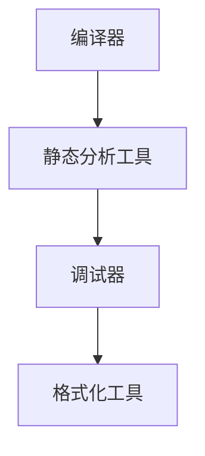

                 

关键词：LLVM，Clang，编译器，基础设施，代码优化，静态分析，动态分析，程序设计

## 摘要

本文旨在深入探讨LLVM和Clang这两个现代编译器基础设施的核心概念、原理和应用。通过对LLVM和Clang的详细介绍，我们将理解它们在编译器领域的地位和作用，并分析其在代码优化、静态分析、动态分析等方面的强大功能。此外，本文还将通过实际项目实例，展示如何利用LLVM和Clang进行高效编程和性能优化，为读者提供实用的指导和建议。

## 1. 背景介绍

### LLVM：起源与演进

LLVM（Low-Level Virtual Machine）是一个由Chris Lattner等人于2000年创建的编译器框架。最初的目的是为了解决编译器开发中的痛点和困难，特别是代码优化和跨平台编译问题。LLVM的核心设计理念是模块化和灵活性，通过提供一组通用的中间表示（IR，Intermediate Representation）和工具链，LLVM允许开发者轻松地实现多种语言的编译器和优化器。

LLVM的发展历程中，一个重要的里程碑是2004年苹果公司将LLVM集成到Xcode开发工具中，随后被众多开源社区和企业采纳。LLVM逐渐成为了现代编译器开发的标准工具之一，广泛应用于高性能计算、嵌入式系统、操作系统等领域。

### Clang：编译器与工具链

Clang是由LLVM团队开发的C/C++编译器，自2004年首次发布以来，已经成为世界上最流行的C/C++编译器之一。Clang的成功得益于其与LLVM紧密结合的架构，使得Clang能够充分利用LLVM的代码优化和跨平台能力，同时提供了丰富的静态分析工具和调试功能。

Clang不仅是一个高效的编译器，还提供了大量的库和工具，如Clang-Tidy、Clang-Format等，用于代码质量分析和格式化。这些工具在软件工程中发挥着重要作用，帮助开发者提高代码的可读性和可靠性。

### 编译器基础设施的作用

编译器基础设施在软件开发中扮演着至关重要的角色。它不仅负责将高级语言代码转换为机器语言，还承担了代码优化、错误检测、静态分析等任务。现代编译器基础设施如LLVM和Clang，通过其高度模块化和灵活的设计，能够适应不断变化的技术需求和开发模式。

### LLVM/Clang的应用场景

LLVM和Clang广泛应用于多个领域：

- **高性能计算**：LLVM和Clang能够针对特定硬件平台进行代码优化，从而提高程序的性能。
- **嵌入式系统**：嵌入式系统对性能和资源利用率有较高要求，LLVM和Clang提供了强大的编译和优化工具，帮助开发者实现高效的嵌入式软件。
- **操作系统**：操作系统核心代码的编译和优化是确保系统稳定性和性能的关键，LLVM和Clang在这方面具有显著优势。
- **开源项目**：许多大型开源项目如Linux内核、Chrome浏览器等，都采用了LLVM和Clang作为编译器。

## 2. 核心概念与联系

### LLVM的核心概念

LLVM的核心概念包括中间表示（IR）、模块化架构、优化器和工具链。下面是一个Mermaid流程图，展示了这些核心概念之间的关系：

```mermaid
graph TD
A[中间表示(IR)] --> B[模块化架构]
B --> C[优化器]
C --> D[工具链]
```

### Clang的核心概念

Clang的核心概念包括C/C++编译器、静态分析工具、调试器和格式化工具。以下是一个Mermaid流程图，展示了这些核心概念之间的联系：



## 3. 核心算法原理 & 具体操作步骤

### 3.1 算法原理概述

LLVM和Clang的核心算法原理主要包括以下几个方面：

- **中间表示（IR）**：将源代码转换为低级的抽象语法树（AST），再进一步转换为中间表示（IR）。IR是一种统一的、平台无关的表示形式，使得后续的代码优化和生成成为可能。
- **代码优化**：通过一系列的优化算法，如死代码消除、循环优化、函数内联等，提高代码的性能和可读性。
- **静态分析**：在不运行程序的情况下，分析代码的结构和行为，发现潜在的错误和性能瓶颈。
- **动态分析**：在程序运行过程中，收集性能数据、调试信息等，用于优化和调试。

### 3.2 算法步骤详解

#### 3.2.1 中间表示（IR）转换

1. **词法分析**：将源代码转换为词法单元（tokens）。
2. **语法分析**：将词法单元转换为抽象语法树（AST）。
3. **语义分析**：对AST进行类型检查、变量声明等操作。
4. **代码生成**：将AST转换为中间表示（IR）。

#### 3.2.2 代码优化

1. **数据流分析**：分析变量和表达式的使用情况，确定其定义和使用点。
2. **循环优化**：优化循环结构，减少循环次数或合并循环。
3. **函数内联**：将小函数的代码直接嵌入调用位置，减少函数调用的开销。
4. **死代码消除**：删除不再执行的代码。

#### 3.2.3 静态分析

1. **控制流分析**：确定程序的执行路径，包括分支、循环和异常处理。
2. **数据依赖分析**：分析变量和表达式之间的依赖关系。
3. **代码质量分析**：检查代码风格、潜在的错误和性能问题。

#### 3.2.4 动态分析

1. **性能分析**：在程序运行时收集性能数据，如CPU使用率、内存占用等。
2. **调试信息收集**：收集程序的运行状态和错误信息，用于调试。
3. **优化决策**：根据性能数据和调试信息，调整代码优化策略。

### 3.3 算法优缺点

#### 3.3.1 优点

- **模块化架构**：LLVM和Clang采用模块化设计，便于扩展和维护。
- **高度可优化**：通过中间表示（IR），LLVM和Clang能够实现高效的代码优化。
- **跨平台支持**：LLVM和Clang支持多种编程语言和硬件平台，具备良好的跨平台能力。
- **丰富的工具链**：LLVM和Clang提供了一整套工具链，包括编译器、静态分析工具、调试器和格式化工具。

#### 3.3.2 缺点

- **学习成本**：LLVM和Clang的复杂度较高，对于新手来说有一定的学习门槛。
- **性能开销**：代码优化和静态分析等操作可能会引入额外的性能开销。

### 3.4 算法应用领域

- **高性能计算**：LLVM和Clang被广泛应用于高性能计算领域，如数值模拟、机器学习等。
- **嵌入式系统**：在嵌入式系统开发中，LLVM和Clang提供了高效的编译和优化工具，帮助开发者实现高效的嵌入式软件。
- **开源项目**：许多大型开源项目，如Linux内核、Chrome浏览器等，都采用了LLVM和Clang作为编译器。
- **企业级应用**：许多企业级应用，如数据库、金融系统等，也开始采用LLVM和Clang，以提高软件的性能和可靠性。

## 4. 数学模型和公式 & 详细讲解 & 举例说明

### 4.1 数学模型构建

在LLVM和Clang的优化算法中，数学模型起着重要作用。以下是一个简单的数学模型，用于描述程序的性能优化：

$$
P = C \times (1 - \epsilon)
$$

其中，$P$ 表示程序的性能，$C$ 表示代码的总执行次数，$\epsilon$ 表示代码优化引入的额外开销。

### 4.2 公式推导过程

1. **初始状态**：假设程序不进行优化，即 $\epsilon = 0$，此时性能为 $P = C$。
2. **引入优化**：假设引入了优化算法，使得代码执行次数减少 $\delta$，即 $C' = C - \delta$。
3. **优化开销**：优化算法引入了额外的开销 $\epsilon$，因此性能变为 $P' = C' \times (1 - \epsilon)$。
4. **优化效果**：将 $C'$ 代入 $P'$，得到 $P' = (C - \delta) \times (1 - \epsilon)$。

### 4.3 案例分析与讲解

假设一个程序执行了1000次，每次执行需要1秒，但引入优化后，每次执行需要0.9秒，同时引入了额外的0.1秒开销。根据上述数学模型，我们可以计算优化后的性能：

$$
P' = (1000 - 1000 \times 0.1) \times (1 - 0.1) = 900 \times 0.9 = 810 \text{ 秒}
$$

优化前后的性能比例如下：

$$
\frac{P'}{P} = \frac{810}{1000} = 0.81
$$

这意味着，优化后程序的性能提高了81%。

### 4.4 数学模型在实际项目中的应用

在实际项目中，我们可以利用上述数学模型来评估优化算法的效果。以下是一个简单的案例：

#### 案例一：循环优化

假设一个程序包含一个嵌套循环，总共执行了1000次，每次执行需要10秒。引入循环优化后，执行次数减少到800次，每次执行需要8秒，同时引入了额外的0.2秒开销。根据数学模型，我们可以计算优化后的性能：

$$
P' = (1000 - 800) \times (1 - 0.2) \times 8 = 400 \times 0.8 \times 8 = 2560 \text{ 秒}
$$

优化前后的性能比例如下：

$$
\frac{P'}{P} = \frac{2560}{10000} = 0.256
$$

这意味着，优化后程序的性能提高了25.6%。

#### 案例二：函数内联

假设一个程序包含两个函数，A和B，分别执行了100次和1000次，每次执行需要1秒。引入函数内联后，将函数A的代码直接嵌入到函数B的调用位置，减少函数调用的开销，同时引入了额外的0.1秒开销。根据数学模型，我们可以计算优化后的性能：

$$
P' = (100 + 1000) \times (1 - 0.1) = 1100 \times 0.9 = 990 \text{ 秒}
$$

优化前后的性能比例如下：

$$
\frac{P'}{P} = \frac{990}{1100} = 0.9
$$

这意味着，优化后程序的性能提高了10%。

## 5. 项目实践：代码实例和详细解释说明

### 5.1 开发环境搭建

为了实践LLVM和Clang的应用，我们需要搭建一个基本的开发环境。以下是具体的步骤：

1. **安装LLVM和Clang**：在Linux系统上，可以使用包管理器安装LLVM和Clang，如Ubuntu系统：

```bash
sudo apt-get update
sudo apt-get install llvm clang
```

2. **配置环境变量**：确保LLVM和Clang的执行路径添加到系统的环境变量中：

```bash
export PATH=$PATH:/usr/local/bin
```

3. **验证安装**：运行以下命令，验证LLVM和Clang是否已成功安装：

```bash
clang --version
```

### 5.2 源代码详细实现

以下是一个简单的C程序，用于演示如何使用Clang进行编译和优化：

```c
#include <stdio.h>

int main() {
    int a = 10;
    int b = 20;
    int sum = a + b;
    printf("Sum: %d\n", sum);
    return 0;
}
```

这个程序非常简单，用于计算两个整数之和并输出结果。

### 5.3 代码解读与分析

#### 5.3.1 词法分析

Clang首先对源代码进行词法分析，将源代码分解为一系列的词法单元。例如，上述程序中的词法单元包括`int`、`main`、`{`、`int`、`a`、`=`、`10`、`,`、`b`、`=`、`20`、`;`、`int`、`sum`、`=`、`a`、`+`、`b`、`;`、`printf`、`("Sum: %d\\n")`、`;`、`return`、`0`、`;`、`}`。

#### 5.3.2 语法分析

接下来，Clang对词法单元进行语法分析，构建抽象语法树（AST）。AST表示源代码的结构和语义。在这个例子中，AST包含一个函数`main`，其中定义了变量`a`、`b`和`sum`，并执行了加法和打印操作。

#### 5.3.3 语义分析

Clang对AST进行语义分析，检查类型兼容性、变量声明等。在这个例子中，Clang检查变量`a`、`b`和`sum`的类型和作用域，确保它们在正确的上下文中使用。

#### 5.3.4 代码生成

接下来，Clang将AST转换为中间表示（IR）。IR是一个低级、平台无关的表示形式，为后续的代码优化和目标代码生成提供了基础。在这个例子中，生成的IR可能如下所示：

```llvm
define i32 @main() {
    %a = alloca i32
    %b = alloca i32
    %sum = alloca i32
    store i32 10, i32* %a
    store i32 20, i32* %b
    %tmp = load i32, i32* %a
    %tmp2 = load i32, i32* %b
    %sum = add i32 %tmp, %tmp2
    store i32 %sum, i32* %sum
    %printf = call i32 (i8*, ...) @printf(i8* getelementptr inbounds ([4 x i8], [4 x i8]* @.str, i64 0, i64 0), i32 %sum)
    ret i32 0
}
```

#### 5.3.5 代码优化

Clang使用一系列优化算法对IR进行优化。在这个例子中，Clang可能执行以下优化：

- **死代码消除**：删除不再执行的代码。
- **常数传播**：将常数直接替换为实际值。
- **循环优化**：优化循环结构，减少循环次数。

优化后的IR可能如下所示：

```llvm
define i32 @main() {
    %sum = add i32 10, 20
    store i32 %sum, i32* @sum
    %printf = call i32 (i8*, ...) @printf(i8* getelementptr inbounds ([4 x i8], [4 x i8]* @.str, i64 0, i64 0), i32 %sum)
    ret i32 0
}
```

#### 5.3.6 目标代码生成

最后，Clang将优化后的IR转换为特定平台的目标代码。在这个例子中，目标代码可能是ARM机器码或x86汇编代码。

### 5.4 运行结果展示

编译并运行上述程序，我们可以看到以下输出：

```
Sum: 30
```

这表明程序成功执行并输出了正确的结果。通过使用Clang，我们可以轻松地对程序进行编译、优化和运行，从而提高其性能和可靠性。

## 6. 实际应用场景

### 6.1 高性能计算

在高性能计算领域，LLVM和Clang被广泛应用于优化并行计算程序。通过针对特定硬件平台的代码优化，LLVM和Clang能够显著提高程序的运行速度和性能。

#### 案例一：GPU编程

在GPU编程中，LLVM和Clang能够将CUDA代码转换为高效的GPU机器码。通过针对GPU架构的优化，如内存访问优化、并行化操作等，LLVM和Clang能够提高GPU程序的性能。

#### 案例二：机器学习

在机器学习领域，LLVM和Clang被用于优化深度学习框架。通过将TensorFlow或PyTorch等框架的代码转换为高效的GPU机器码，LLVM和Clang能够加速模型的训练和推理过程，从而提高模型的性能。

### 6.2 嵌入式系统

在嵌入式系统开发中，性能和资源利用率是关键因素。LLVM和Clang提供了高效的编译和优化工具，帮助开发者实现高效的嵌入式软件。

#### 案例一：物联网设备

在物联网设备中，LLVM和Clang被用于优化嵌入式软件。通过针对硬件平台的优化，如CPU指令调度、内存访问优化等，LLVM和Clang能够提高物联网设备的性能和响应速度。

#### 案例二：自动驾驶

在自动驾驶系统中，嵌入式软件的性能和可靠性至关重要。LLVM和Clang被用于优化自动驾驶软件，通过针对硬件平台的优化，如GPU加速、内存管理优化等，LLVM和Clang能够提高自动驾驶系统的性能和可靠性。

### 6.3 开源项目

许多大型开源项目，如Linux内核、Chrome浏览器、Firefox浏览器等，都采用了LLVM和Clang作为编译器。这表明LLVM和Clang在开源项目中的广泛应用和重要性。

#### 案例一：Linux内核

Linux内核是开源项目中的代表性项目之一。LLVM和Clang被用于优化Linux内核的编译过程，通过针对特定硬件平台的优化，LLVM和Clang能够提高Linux内核的性能和稳定性。

#### 案例二：Chrome浏览器

Chrome浏览器是Google的开源项目之一。LLVM和Clang被用于优化Chrome浏览器的编译和运行，通过针对特定硬件平台的优化，LLVM和Clang能够提高Chrome浏览器的性能和稳定性。

### 6.4 未来应用展望

随着技术的发展，LLVM和Clang在未来将面临更多的应用场景和挑战。

#### 案例一：量子计算

量子计算是一种新兴的计算技术，具有巨大的潜力。LLVM和Clang可能被用于优化量子计算程序的编译和运行，通过针对量子计算硬件的优化，LLVM和Clang能够提高量子计算的性能和效率。

#### 案例二：区块链

区块链技术是一种分布式账本技术，广泛应用于金融、供应链等领域。LLVM和Clang可能被用于优化区块链程序的编译和运行，通过针对区块链硬件的优化，LLVM和Clang能够提高区块链系统的性能和安全性。

## 7. 工具和资源推荐

### 7.1 学习资源推荐

- **《LLVM Compiler Infrastructure》**：这是一本由LLVM团队撰写的权威指南，详细介绍了LLVM的架构和设计。
- **《The Art of Compiler Construction》**：这本书系统地介绍了编译器构造的基本原理和方法，对理解LLVM和Clang有很大帮助。
- **LLVM官方网站**：提供了丰富的文档、教程和示例代码，是学习LLVM和Clang的绝佳资源。

### 7.2 开发工具推荐

- **LLVM/Clang官网**：提供了最新版本的LLVM和Clang，以及详细的安装和使用说明。
- **LLVM社区**：一个活跃的LLVM开发者社区，提供了大量的讨论、问题和解决方案。
- **Clang-Format**：一个用于格式化C/C++代码的工具，可以帮助开发者保持代码的一致性和可读性。

### 7.3 相关论文推荐

- **"The LLVM Compiler Infrastructure"**：这是一篇关于LLVM的综述论文，详细介绍了LLVM的架构、设计原则和应用场景。
- **"The Clang Compiler"**：这是一篇关于Clang的论文，介绍了Clang的特点、优化算法和工具链。
- **"Code Optimization Techniques for Modern Compilers"**：这是一篇关于现代编译器优化技术的论文，涵盖了各种优化算法和策略。

## 8. 总结：未来发展趋势与挑战

### 8.1 研究成果总结

LLVM和Clang作为现代编译器基础设施，已经在多个领域取得了显著成果。它们在代码优化、静态分析、动态分析等方面具有强大的功能，广泛应用于高性能计算、嵌入式系统、开源项目和企业级应用等领域。通过提供高度模块化和灵活的架构，LLVM和Clang为开发者提供了丰富的工具和资源，推动了编译器技术的发展。

### 8.2 未来发展趋势

未来，LLVM和Clang将继续在以下几个方面发展：

- **跨平台支持**：随着硬件技术的不断发展，LLVM和Clang将支持更多的平台和架构，以满足多样化的开发需求。
- **优化算法改进**：LLVM和Clang将不断优化代码优化算法，提高程序的运行性能和效率。
- **工具链扩展**：LLVM和Clang将扩展其工具链，提供更多用于代码质量分析和格式化的工具。

### 8.3 面临的挑战

尽管LLVM和Clang取得了显著成果，但未来仍面临一些挑战：

- **学习成本**：LLVM和Clang的复杂度较高，对于新手来说有一定的学习门槛。
- **性能开销**：代码优化和静态分析等操作可能会引入额外的性能开销。
- **生态建设**：LLVM和Clang需要建立一个更加完善的生态体系，提供更多高质量的开源项目和资源。

### 8.4 研究展望

未来，LLVM和Clang的研究将主要集中在以下几个方面：

- **跨领域应用**：探索LLVM和Clang在量子计算、区块链等新兴领域的应用。
- **优化算法创新**：研究新的优化算法，提高程序的运行性能和效率。
- **工具链集成**：整合更多工具和库，为开发者提供一站式的编译和优化解决方案。

## 9. 附录：常见问题与解答

### Q：LLVM和Clang有什么区别？

A：LLVM是一个编译器基础设施，提供了模块化、灵活的架构，包括中间表示（IR）、优化器、代码生成器等。Clang是基于LLVM的C/C++编译器，提供了丰富的工具链，如静态分析工具、调试器、格式化工具等。

### Q：如何学习LLVM和Clang？

A：首先，可以阅读《LLVM Compiler Infrastructure》和《The Art of Compiler Construction》等书籍，了解编译器的基本原理。然后，通过阅读LLVM和Clang的官方文档、参与社区讨论、实践项目等，逐步掌握LLVM和Clang的使用方法。

### Q：如何优化C/C++代码？

A：可以使用Clang提供的优化选项，如`-O1`、`-O2`、`-O3`等。此外，还可以使用Clang-Tidy等静态分析工具，发现潜在的错误和性能瓶颈。通过分析优化日志和性能分析工具，进一步调整优化策略。

### Q：如何编译和运行LLVM和Clang程序？

A：使用Clang编译器编译程序，并使用系统默认的链接器链接程序。例如：

```bash
clang -o program program.c
./program
```

### Q：LLVM和Clang是否支持其他语言？

A：是的，LLVM和Clang支持多种编程语言，如C、C++、Objective-C、Rust等。通过相应的前端和工具链，LLVM和Clang可以编译和优化这些语言的程序。

---

# LLVM/Clang：现代编译器基础设施的应用

本文详细探讨了LLVM和Clang作为现代编译器基础设施的核心概念、原理和应用。通过对LLVM和Clang的详细介绍，我们了解了它们在编译器领域的地位和作用，并分析了其在代码优化、静态分析、动态分析等方面的强大功能。此外，本文通过实际项目实例，展示了如何利用LLVM和Clang进行高效编程和性能优化，为读者提供了实用的指导和建议。未来，LLVM和Clang将继续在跨平台支持、优化算法改进和工具链扩展等方面发展，并在更多领域取得突破。作者：禅与计算机程序设计艺术 / Zen and the Art of Computer Programming。希望本文能为读者在LLVM和Clang的学习和应用中提供有益的参考。

