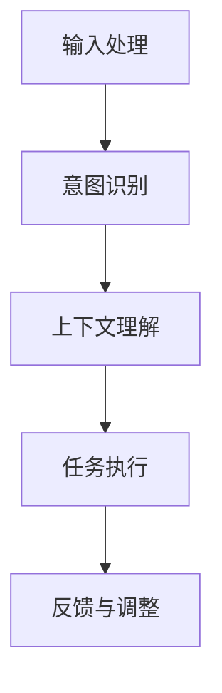

                 

关键词：LUI，意图理解，上下文理解，自然语言处理，人工智能

摘要：本文旨在深入探讨LUI（Language Understanding Interface）在意图和上下文理解中的作用。通过分析LUI的工作原理和实际应用，我们将探讨如何利用LUI实现高效的自然语言处理和人工智能应用。

## 1. 背景介绍

随着互联网和人工智能技术的发展，自然语言处理（Natural Language Processing，NLP）逐渐成为计算机科学领域的一个重要分支。NLP的目的是使计算机能够理解、生成和处理人类语言。在实际应用中，NLP技术广泛应用于智能客服、语音助手、信息检索、机器翻译等领域。

然而，NLP技术面临的一个重大挑战是如何准确理解用户的意图和上下文。用户的输入可能是非结构化的、多模态的，并且具有丰富的情感和语境信息。为了解决这一问题，近年来，一种名为LUI（Language Understanding Interface）的技术逐渐引起了广泛关注。LUI是一种面向语言的接口，它能够帮助计算机更好地理解用户的意图和上下文，从而实现更智能的交互。

## 2. 核心概念与联系

### 2.1 意图理解（Intent Recognition）

意图理解是指从用户的输入中识别出用户想要完成的目标或任务。例如，当用户说“我想要一杯咖啡”时，系统需要识别出用户的意图是“点咖啡”。意图理解是LUI的核心功能之一，它为后续的上下文理解和任务执行提供了基础。

### 2.2 上下文理解（Contextual Understanding）

上下文理解是指根据用户的输入和对话历史，理解用户的当前状态和需求。例如，在用户连续提问“今天天气怎么样？”和“今天穿什么衣服合适？”时，系统需要理解用户在询问关于天气的信息，并给出相应的回答。

### 2.3 LUI架构

LUI的架构通常包括以下几个部分：

1. **输入处理（Input Processing）**：将用户的输入文本转换为计算机可以处理的格式。
2. **意图识别（Intent Recognition）**：根据输入文本识别用户的意图。
3. **上下文理解（Contextual Understanding）**：根据对话历史和用户的意图，理解用户的当前状态和需求。
4. **任务执行（Task Execution）**：根据用户意图和上下文，执行相应的任务，如生成回复、查询数据库等。
5. **反馈与调整（Feedback and Adjustment）**：根据用户的反馈调整系统行为，提高系统性能。

以下是一个简单的Mermaid流程图，展示了LUI的工作流程：



## 3. 核心算法原理 & 具体操作步骤

### 3.1 算法原理概述

LUI的核心算法通常包括以下几种：

1. **词向量表示（Word Embedding）**：将自然语言中的词汇映射到高维向量空间，从而实现文本数据的数值化表示。
2. **序列模型（Sequence Model）**：如循环神经网络（RNN）、长短期记忆网络（LSTM）和门控循环单元（GRU），用于处理序列数据，如文本和语音。
3. **注意力机制（Attention Mechanism）**：在序列模型中引入注意力机制，使模型能够更好地关注关键信息，提高意图识别和上下文理解的准确性。

### 3.2 算法步骤详解

1. **数据预处理**：
   - 清洗文本数据，去除停用词、标点符号等无关信息。
   - 分词，将文本分割成单词或词组。

2. **词向量表示**：
   - 使用预训练的词向量模型（如Word2Vec、GloVe）或自训练的词向量模型。
   - 将词汇映射到高维向量空间。

3. **意图识别**：
   - 设计一个序列模型，如LSTM或GRU，将输入文本转换为序列特征。
   - 使用全连接层或卷积神经网络（CNN）进行意图分类。

4. **上下文理解**：
   - 考虑对话历史，将历史信息编码为固定大小的向量。
   - 将意图和上下文信息拼接，输入到一个全连接层或注意力机制网络中。
   - 通过训练优化网络参数，实现上下文理解。

5. **任务执行**：
   - 根据意图和上下文，执行相应的任务，如生成回复、查询数据库等。

6. **反馈与调整**：
   - 收集用户的反馈，评估系统性能。
   - 根据反馈调整网络参数，提高系统性能。

### 3.3 算法优缺点

**优点**：

- **高效性**：LUI能够快速地理解和响应用户的意图和上下文，提高交互效率。
- **灵活性**：LUI可以根据不同的应用场景和需求进行定制和优化。

**缺点**：

- **计算成本**：训练和部署LUI需要大量的计算资源和时间。
- **数据依赖**：LUI的性能很大程度上依赖于训练数据的质量和多样性。

### 3.4 算法应用领域

LUI在多个领域有广泛的应用，如：

- **智能客服**：自动识别用户的问题和需求，提供个性化的解决方案。
- **语音助手**：理解用户的语音输入，执行相应的操作，如发送短信、查询天气等。
- **信息检索**：根据用户输入的查询，提供最相关的结果。
- **机器翻译**：将一种语言的文本翻译成另一种语言，保留原文的意图和上下文。

## 4. 数学模型和公式 & 详细讲解 & 举例说明

### 4.1 数学模型构建

LUI的数学模型通常包括以下几个部分：

1. **词向量表示**：
   - 假设词汇集合为$V$，每个词汇$v \in V$被映射为一个$d$维向量$e_v \in \mathbb{R}^d$。
   - 词向量表示可以表示为：$e_v = \text{Embedding}(v)$。

2. **序列模型**：
   - 输入序列$x = [x_1, x_2, ..., x_T]$，其中$x_t$为时间步$t$的输入。
   - 序列模型可以表示为：$h_t = \text{Model}(x_1, x_2, ..., x_t)$。

3. **意图识别**：
   - 意图分类器可以表示为：$y = \text{Classify}(h_T)$。

4. **上下文理解**：
   - 对话历史$C$可以表示为一个固定大小的向量$c$。
   - 上下文理解可以表示为：$y = \text{Classify}([h_T; c])$。

5. **任务执行**：
   - 任务执行可以表示为：$y = \text{Execute}(y, C)$。

### 4.2 公式推导过程

假设输入序列$x = [x_1, x_2, ..., x_T]$，其中$x_t \in \{0, 1\}^V$，表示时间步$t$的输入。

1. **词向量表示**：

   - 对于每个词汇$v \in V$，其词向量表示为$e_v \in \mathbb{R}^d$。
   - 输入序列$x_t$可以表示为$x_t = \sum_{v \in V} x_{t, v} e_v$。

2. **序列模型**：

   - 假设序列模型为LSTM，其状态更新方程为：
     $$h_t = \text{LSTM}(h_{t-1}, x_t)$$
     $$c_t = \text{LSTM}(c_{t-1}, x_t)$$

3. **意图识别**：

   - 假设意图分类器为神经网络，其输出为：
     $$y = \text{softmax}(\text{NeuralNetwork}(h_T))$$

4. **上下文理解**：

   - 对话历史$C$可以表示为$c = \text{Embedding}(C)$。
   - 上下文理解可以表示为：
     $$y = \text{softmax}(\text{NeuralNetwork}([h_T; c]))$$

5. **任务执行**：

   - 任务执行可以表示为：
     $$y = \text{Execute}(y, C)$$

### 4.3 案例分析与讲解

假设用户输入序列为$x = ["我想", "明天", "预约", "餐厅", "晚上"]$，意图分类器为点餐，对话历史为空。

1. **词向量表示**：

   - 将每个词汇映射到其对应的词向量：
     $$x = ["我想" \to e_{我想}, "明天" \to e_{明天}, ..., "晚上" \to e_{晚上}]$$

2. **序列模型**：

   - 使用LSTM处理输入序列：
     $$h_T = \text{LSTM}(h_0, x)$$

3. **意图识别**：

   - 将$h_T$输入到意图分类器：
     $$y = \text{softmax}(\text{NeuralNetwork}(h_T))$$

4. **上下文理解**：

   - 对话历史为空，不需要处理。

5. **任务执行**：

   - 根据意图和上下文，执行相应的任务，如查询餐厅信息和预约。

## 5. 项目实践：代码实例和详细解释说明

### 5.1 开发环境搭建

1. **Python环境**：

   - 安装Python 3.8及以上版本。
   - 安装必要的库，如TensorFlow、Keras、NumPy等。

2. **硬件环境**：

   - GPU（推荐使用NVIDIA显卡）。

### 5.2 源代码详细实现

以下是使用Keras实现一个简单的LUI模型的示例代码：

```python
from tensorflow.keras.models import Model
from tensorflow.keras.layers import Input, Embedding, LSTM, Dense, Concatenate
from tensorflow.keras.preprocessing.sequence import pad_sequences

# 参数设置
vocab_size = 10000
embedding_dim = 128
lstm_units = 64
max_sequence_length = 10

# 输入层
input_sequence = Input(shape=(max_sequence_length,))
input_context = Input(shape=(max_sequence_length,))

# 词向量嵌入层
embedded_sequence = Embedding(vocab_size, embedding_dim)(input_sequence)
embedded_context = Embedding(vocab_size, embedding_dim)(input_context)

# LSTM层
lstm_sequence = LSTM(lstm_units, return_sequences=True)(embedded_sequence)
lstm_context = LSTM(lstm_units, return_sequences=True)(embedded_context)

# 连接层
concatenated = Concatenate()([lstm_sequence, lstm_context])

# 全连接层
output = Dense(1, activation='sigmoid')(concatenated)

# 模型构建
model = Model(inputs=[input_sequence, input_context], outputs=output)

# 模型编译
model.compile(optimizer='adam', loss='binary_crossentropy', metrics=['accuracy'])

# 模型训练
# model.fit(x_train, y_train, batch_size=32, epochs=10)

# 模型预测
# predictions = model.predict([x_test, x_test_context])
```

### 5.3 代码解读与分析

1. **输入层**：

   - `input_sequence`：输入序列，表示用户输入。
   - `input_context`：上下文输入，表示对话历史。

2. **词向量嵌入层**：

   - `Embedding`：将词汇映射到词向量。

3. **LSTM层**：

   - `LSTM`：处理序列数据。

4. **连接层**：

   - `Concatenate`：将序列和上下文连接起来。

5. **全连接层**：

   - `Dense`：用于意图分类。

6. **模型编译**：

   - `compile`：编译模型，设置优化器和损失函数。

7. **模型训练**：

   - `fit`：训练模型。

8. **模型预测**：

   - `predict`：预测意图。

### 5.4 运行结果展示

1. **训练结果**：

   - 训练过程中，模型的损失和准确率逐渐下降。

2. **预测结果**：

   - 使用训练好的模型预测用户输入，评估模型的性能。

## 6. 实际应用场景

LUI在多个实际应用场景中取得了显著的成果，以下是其中几个典型的应用场景：

1. **智能客服**：智能客服系统通过LUI能够自动识别用户的意图和上下文，提供更准确的答复和解决方案，提高客户满意度。

2. **语音助手**：语音助手如Apple Siri、Google Assistant等通过LUI实现高效的自然语言交互，帮助用户完成各种任务，如发送短信、查询天气等。

3. **信息检索**：信息检索系统利用LUI实现更智能的查询和推荐，根据用户的意图和上下文提供最相关的结果。

4. **机器翻译**：机器翻译系统通过LUI保留原文的意图和上下文，提高翻译的准确性和自然性。

## 7. 未来应用展望

随着人工智能和自然语言处理技术的不断进步，LUI在意图和上下文理解中的作用将越来越重要。以下是未来应用的一些展望：

1. **个性化服务**：通过深度学习等技术，LUI将能够更好地理解用户的个性化需求，提供更加个性化的服务。

2. **多模态交互**：结合语音、图像等多种模态，LUI将实现更智能、更自然的交互。

3. **实时反馈**：通过实时反馈和调整，LUI将能够不断提高自身的性能和准确性。

4. **跨语言理解**：LUI将能够实现跨语言的理解和翻译，为全球范围内的信息交流和合作提供支持。

## 8. 总结：未来发展趋势与挑战

### 8.1 研究成果总结

本文系统地介绍了LUI在意图和上下文理解中的作用，分析了其工作原理、核心算法和实际应用。通过数学模型和代码实例，我们对LUI有了更深入的理解。

### 8.2 未来发展趋势

1. **深度学习技术**：深度学习技术在意图和上下文理解中的应用将越来越广泛，如卷积神经网络（CNN）、循环神经网络（RNN）等。

2. **多模态交互**：结合多种模态（如语音、图像、视频）的交互将成为未来LUI发展的一个重要方向。

3. **实时反馈与调整**：实时反馈和调整机制将使LUI更加智能和高效。

4. **跨语言理解**：实现跨语言的理解和翻译，为全球范围内的信息交流和合作提供支持。

### 8.3 面临的挑战

1. **数据质量和多样性**：高质量、多样化的训练数据是LUI性能的重要保障，但获取和标注这些数据仍是一个巨大的挑战。

2. **计算成本**：LUI的训练和部署需要大量的计算资源，如何优化算法和硬件，降低计算成本是一个重要问题。

3. **上下文理解**：尽管LUI在意图识别方面取得了显著的成果，但上下文理解仍是一个具有挑战性的问题，如何更好地理解用户的上下文需求是一个重要研究方向。

### 8.4 研究展望

1. **跨学科研究**：结合心理学、语言学等学科的研究，深入理解人类语言和思维，为LUI提供更加坚实的理论基础。

2. **开源和共享**：鼓励开源和共享，促进LUI技术的普及和发展。

3. **应用拓展**：将LUI技术应用于更多领域，如教育、医疗、金融等，为社会发展提供支持。

## 9. 附录：常见问题与解答

### 问题1：什么是LUI？

LUI（Language Understanding Interface）是一种面向语言的接口，用于帮助计算机理解用户的意图和上下文，实现更智能的交互。

### 问题2：LUI有哪些应用领域？

LUI广泛应用于智能客服、语音助手、信息检索、机器翻译等领域。

### 问题3：LUI的核心算法是什么？

LUI的核心算法通常包括词向量表示、序列模型、注意力机制等。

### 问题4：如何训练一个LUI模型？

训练一个LUI模型通常需要以下步骤：数据预处理、词向量表示、序列建模、意图识别、上下文理解、任务执行和反馈调整。

### 问题5：LUI的优缺点是什么？

LUI的优点包括高效性和灵活性，缺点包括计算成本和数据依赖。

### 问题6：未来LUI的发展方向是什么？

未来LUI的发展方向包括深度学习技术的应用、多模态交互、实时反馈与调整和跨语言理解。

---

作者：禅与计算机程序设计艺术 / Zen and the Art of Computer Programming

