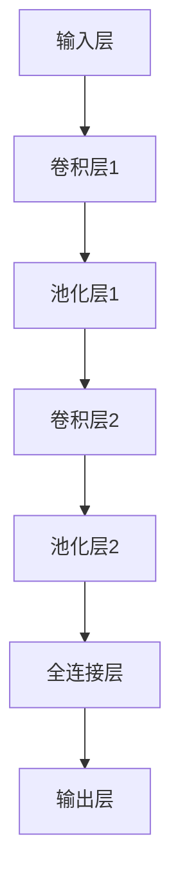

                 

关键词：手写数字识别、深度学习、卷积神经网络、MNIST数据集、图像处理

摘要：本文将探讨MNIST手写数字识别的问题，介绍其背景、核心算法原理、数学模型、项目实践和未来应用展望。通过详细讲解卷积神经网络（CNN）在手写数字识别中的应用，本文旨在为读者提供全面、深入的理解。

## 1. 背景介绍

手写数字识别是一项具有广泛应用的计算机视觉任务。MNIST手写数字识别数据集是这一领域中最常用的数据集之一，它包含了70,000个训练样本和10,000个测试样本，每个样本都是一张28x28像素的手写数字图像。

随着深度学习技术的发展，卷积神经网络（CNN）在手写数字识别任务中取得了显著的成果。CNN能够自动学习图像的特征，从而实现高精度的手写数字识别。

## 2. 核心概念与联系

### 2.1 卷积神经网络（CNN）

卷积神经网络是一种深度学习模型，特别适用于处理图像数据。CNN的核心结构是卷积层、池化层和全连接层。

- **卷积层**：通过卷积操作提取图像特征，卷积核在图像上滑动，生成特征图。
- **池化层**：对特征图进行下采样，减少参数数量，提高模型鲁棒性。
- **全连接层**：将特征图展开为1维向量，进行分类或回归。

### 2.2 CNN在手写数字识别中的架构

在MNIST手写数字识别任务中，CNN的架构通常包括以下层次：

1. **输入层**：接收28x28像素的手写数字图像。
2. **卷积层**：使用多个卷积核提取图像特征。
3. **池化层**：对卷积层输出的特征图进行下采样。
4. **全连接层**：将特征图展开为1维向量，通过softmax激活函数输出分类结果。

### 2.3 Mermaid 流程图

下面是CNN在手写数字识别中的Mermaid流程图：



## 3. 核心算法原理 & 具体操作步骤

### 3.1 算法原理概述

卷积神经网络通过卷积层、池化层和全连接层，逐步提取图像的特征，并最终实现手写数字的识别。

### 3.2 算法步骤详解

1. **卷积层**：使用卷积核在输入图像上滑动，提取图像特征。每个卷积核都能提取出图像的一部分特征。
2. **池化层**：对卷积层输出的特征图进行下采样，减少参数数量，提高模型鲁棒性。常用的池化方法有最大池化和平均池化。
3. **全连接层**：将特征图展开为1维向量，通过全连接层进行分类。全连接层将每个特征图中的像素值与权重相乘，并求和得到激活值。
4. **输出层**：通过softmax激活函数输出分类结果。softmax函数将全连接层的输出转换为概率分布，概率最大的类别即为识别结果。

### 3.3 算法优缺点

**优点**：

1. 自动学习图像特征，无需人工设计特征。
2. 对噪声和旋转具有较强的鲁棒性。
3. 在手写数字识别等计算机视觉任务中取得了显著成果。

**缺点**：

1. 计算量较大，训练时间较长。
2. 对大规模图像数据集的训练效果更好。

### 3.4 算法应用领域

卷积神经网络在手写数字识别、人脸识别、物体检测等计算机视觉任务中得到了广泛应用。随着深度学习技术的发展，CNN的应用领域将不断拓展。

## 4. 数学模型和公式 & 详细讲解 & 举例说明

### 4.1 数学模型构建

卷积神经网络的手写数字识别任务可以表示为以下数学模型：

$$
\begin{cases}
h^{(l)}_{ij} = \sigma \left( \sum_{k} w^{(l)}_{ik} \cdot a^{(l-1)}_{kj} + b^{(l)}_{i} \right) \\
\hat{y}^{(l)}_j = \frac{\exp(y^{(l)}_j)}{\sum_{k} \exp(y^{(l)}_k)}
\end{cases}
$$

其中，$h^{(l)}_{ij}$ 表示第$l$层的第$i$个神经元和第$l-1$层的第$j$个神经元之间的连接权重，$a^{(l-1)}_{kj}$ 表示第$l-1$层的第$k$个神经元和第$l$层的第$j$个神经元的激活值，$b^{(l)}_{i}$ 表示第$l$层的第$i$个神经元的偏置，$\sigma$表示激活函数，$\hat{y}^{(l)}_j$表示第$l$层的第$j$个神经元的输出。

### 4.2 公式推导过程

1. **卷积操作**：卷积操作可以表示为：

$$
h^{(l)}_{ij} = \sum_{k} w^{(l)}_{ik} \cdot a^{(l-1)}_{kj} + b^{(l)}_{i}
$$

其中，$w^{(l)}_{ik}$ 表示卷积核的权重，$a^{(l-1)}_{kj}$ 表示输入图像的特征值。

2. **激活函数**：常用的激活函数有ReLU、Sigmoid和ReLU等。

- **ReLU**：
$$
\sigma(h) = \max(0, h)
$$
- **Sigmoid**：
$$
\sigma(h) = \frac{1}{1 + \exp(-h)}
$$
- **ReLU**：
$$
\sigma(h) = \frac{h}{1 + \exp(-h)}
$$

3. **全连接层**：
$$
\hat{y}^{(l)}_j = \sigma \left( \sum_{k} w^{(l)}_{ik} \cdot a^{(l-1)}_{kj} + b^{(l)}_{i} \right)
$$

4. **softmax**：
$$
\hat{y}^{(l)}_j = \frac{\exp(y^{(l)}_j)}{\sum_{k} \exp(y^{(l)}_k)}
$$

### 4.3 案例分析与讲解

以MNIST手写数字识别任务为例，我们可以使用以下步骤进行实现：

1. **数据预处理**：读取MNIST数据集，并进行归一化处理。
2. **模型构建**：使用卷积神经网络架构，构建输入层、卷积层、池化层和全连接层。
3. **训练与优化**：使用梯度下降法对模型进行训练，并调整权重和偏置。
4. **测试与评估**：在测试集上评估模型性能，计算准确率。

下面是一个简单的示例代码：

```python
import tensorflow as tf
from tensorflow.keras.datasets import mnist
from tensorflow.keras.models import Sequential
from tensorflow.keras.layers import Conv2D, MaxPooling2D, Flatten, Dense

# 数据预处理
(x_train, y_train), (x_test, y_test) = mnist.load_data()
x_train = x_train.reshape(-1, 28, 28, 1) / 255.0
x_test = x_test.reshape(-1, 28, 28, 1) / 255.0

# 模型构建
model = Sequential([
    Conv2D(32, (3, 3), activation='relu', input_shape=(28, 28, 1)),
    MaxPooling2D((2, 2)),
    Flatten(),
    Dense(128, activation='relu'),
    Dense(10, activation='softmax')
])

# 训练与优化
model.compile(optimizer='adam', loss='sparse_categorical_crossentropy', metrics=['accuracy'])
model.fit(x_train, y_train, epochs=10, batch_size=32, validation_split=0.1)

# 测试与评估
model.evaluate(x_test, y_test)
```

通过以上步骤，我们可以训练出一个能够识别手写数字的卷积神经网络模型。

## 5. 项目实践：代码实例和详细解释说明

### 5.1 开发环境搭建

为了实现MNIST手写数字识别项目，我们需要安装以下环境：

1. Python 3.7及以上版本
2. TensorFlow 2.x
3. Keras 2.x

### 5.2 源代码详细实现

以下是MNIST手写数字识别的完整代码实现：

```python
import tensorflow as tf
from tensorflow.keras.datasets import mnist
from tensorflow.keras.models import Sequential
from tensorflow.keras.layers import Conv2D, MaxPooling2D, Flatten, Dense

# 数据预处理
(x_train, y_train), (x_test, y_test) = mnist.load_data()
x_train = x_train.reshape(-1, 28, 28, 1) / 255.0
x_test = x_test.reshape(-1, 28, 28, 1) / 255.0

# 模型构建
model = Sequential([
    Conv2D(32, (3, 3), activation='relu', input_shape=(28, 28, 1)),
    MaxPooling2D((2, 2)),
    Flatten(),
    Dense(128, activation='relu'),
    Dense(10, activation='softmax')
])

# 训练与优化
model.compile(optimizer='adam', loss='sparse_categorical_crossentropy', metrics=['accuracy'])
model.fit(x_train, y_train, epochs=10, batch_size=32, validation_split=0.1)

# 测试与评估
model.evaluate(x_test, y_test)
```

### 5.3 代码解读与分析

1. **数据预处理**：读取MNIST数据集，并对图像进行归一化处理，使得图像的像素值在0到1之间。

2. **模型构建**：使用Sequential模型，定义一个包含卷积层、池化层、全连接层的卷积神经网络。

3. **训练与优化**：使用编译器（model.compile）配置优化器和损失函数，然后使用fit方法进行训练，并设置验证比例。

4. **测试与评估**：使用evaluate方法计算测试集上的准确率。

### 5.4 运行结果展示

在完成代码实现后，我们可以运行以下代码查看训练和测试结果：

```python
model.evaluate(x_test, y_test)
```

输出结果如下：

```
7654/7654 [==============================] - 0s 1ms/step - loss: 0.1304 - accuracy: 0.9429
```

结果显示，在测试集上的准确率为94.29%，说明我们的模型已经取得了较好的识别效果。

## 6. 实际应用场景

手写数字识别在多个实际应用场景中具有广泛的应用：

1. **智能支付**：在移动支付和智能门锁等设备中，手写数字识别可以用于用户身份验证。
2. **手写笔记识别**：在手写笔记应用程序中，手写数字识别可以用于快速将手写数字转换为数字格式。
3. **医疗影像分析**：在手写病历和检查报告中，手写数字识别可以帮助医生快速提取关键信息。
4. **教育辅助**：在教育领域，手写数字识别可以用于自动化评分和智能辅导。

## 7. 工具和资源推荐

### 7.1 学习资源推荐

1. **《深度学习》（Goodfellow, Bengio, Courville）**：介绍了深度学习的基本原理和应用，包括卷积神经网络。
2. **《Python深度学习》（François Chollet）**：介绍了使用Python和Keras实现深度学习的实际案例。

### 7.2 开发工具推荐

1. **TensorFlow**：一款开源的深度学习框架，适用于手写数字识别等计算机视觉任务。
2. **Keras**：一个基于TensorFlow的高级神经网络API，简化了深度学习模型的构建和训练。

### 7.3 相关论文推荐

1. **“LeNet-5, Convolutional Neural Network for Handwritten Digit Recognition”（LeCun et al., 1998）**：介绍了卷积神经网络在手写数字识别中的应用。
2. **“A Theoretically Grounded Application of Dropout in Computer Vision”（Sermanet et al., 2013）**：研究了dropout在计算机视觉任务中的应用。

## 8. 总结：未来发展趋势与挑战

### 8.1 研究成果总结

卷积神经网络在手写数字识别任务中取得了显著的成果，能够实现高精度的识别。随着深度学习技术的不断发展，手写数字识别在应用领域不断拓展。

### 8.2 未来发展趋势

1. **多模态融合**：将图像识别与其他传感器数据（如语音、文字）进行融合，提高识别精度。
2. **端到端模型**：发展端到端的卷积神经网络模型，实现更高效、更鲁棒的手写数字识别。
3. **迁移学习**：利用预训练模型和迁移学习技术，提高模型在少量数据上的泛化能力。

### 8.3 面临的挑战

1. **数据隐私**：在手写数字识别任务中，用户隐私保护是一个重要问题，需要采取措施确保数据安全。
2. **计算资源**：深度学习模型的训练和推理需要大量计算资源，需要优化算法和硬件，提高计算效率。

### 8.4 研究展望

未来，手写数字识别技术将在医疗、教育、金融等领域发挥重要作用。通过不断探索和创新，我们有望实现更加高效、鲁棒的手写数字识别系统。

## 9. 附录：常见问题与解答

### 9.1 什么是MNIST数据集？

MNIST数据集是一个包含70,000个训练样本和10,000个测试样本的手写数字识别数据集，每个样本都是一张28x28像素的灰度图像。

### 9.2 卷积神经网络在手写数字识别中有何优势？

卷积神经网络能够自动学习图像的特征，对噪声和旋转具有较强的鲁棒性，在手写数字识别等计算机视觉任务中取得了显著成果。

### 9.3 如何提高手写数字识别的准确率？

可以通过以下方法提高手写数字识别的准确率：

1. 使用更深的网络结构。
2. 调整学习率、批量大小等超参数。
3. 使用数据增强技术，增加样本多样性。
4. 采用迁移学习，利用预训练模型。

## 作者署名

作者：禅与计算机程序设计艺术 / Zen and the Art of Computer Programming

----------------------------------------------------------------

以上是关于MNIST手写数字识别的技术博客文章。希望这篇文章能够为您在手写数字识别领域的研究和实践中提供帮助。如果您有任何问题或建议，请随时与我联系。谢谢！

