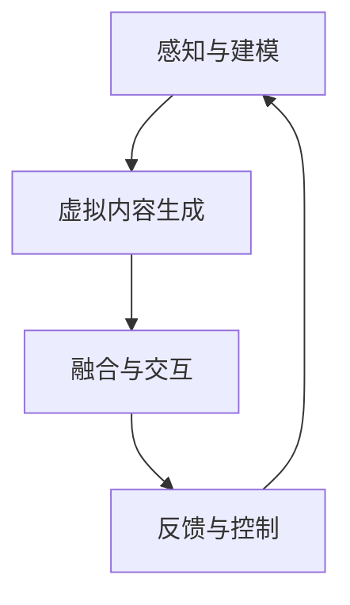

                 

关键词：增强现实（AR）、虚拟现实（VR）、工业设计、虚实结合、创新设计、三维建模、用户体验、交互设计、制造流程优化

## 摘要

本文旨在探讨增强现实（AR）和虚拟现实（VR）在工业设计领域的应用，以及这两者如何通过虚实结合的方式推动设计创新的步伐。首先，我们将回顾工业设计的传统方法和挑战，然后深入分析AR和VR技术的核心原理及其在工业设计中的应用场景。通过具体的算法原理、数学模型以及实际案例，我们将展示虚实结合在工业设计中的巨大潜力。最后，我们将探讨这一领域的发展趋势、面临挑战及未来的研究方向。

## 1. 背景介绍

### 工业设计的历史与发展

工业设计作为现代工业体系中的重要环节，其起源可追溯到20世纪初的工业革命时期。当时，工业设计师开始尝试将艺术与工程学相结合，以提升产品的美观性和实用性。随着时间的推移，工业设计逐渐发展成为一门综合性的学科，涵盖了美学、人机工程学、材料学、制造工艺等多个方面。

工业设计的发展历程可以分为几个阶段：

- **传统手工设计阶段**：设计师主要依靠手工绘制草图，然后通过制造工艺进行产品制作。
- **计算机辅助设计阶段**：计算机的出现使得工业设计从手工绘图转向了计算机辅助设计（CAD），大大提高了设计效率和精度。
- **数字化设计阶段**：随着计算机技术和互联网的普及，数字化设计成为主流，设计师可以通过3D建模软件进行复杂的三维设计。
- **虚实结合设计阶段**：近年来，增强现实（AR）和虚拟现实（VR）技术的发展，为工业设计带来了新的可能性，设计师能够在虚拟环境中进行更为直观和交互性的设计。

### 工业设计的挑战与需求

尽管工业设计已经取得了显著的进展，但依然面临许多挑战和需求：

- **设计复杂度的提高**：随着产品的功能日益复杂，设计复杂度也随之增加，对设计师的技术能力和创新能力提出了更高的要求。
- **用户参与度的提升**：用户的需求和反馈在产品设计中的重要性日益凸显，但传统的工业设计方法往往难以实现用户的即时参与和反馈。
- **设计迭代速度的加快**：市场竞争日益激烈，产品更新换代的速度不断加快，设计师需要更加高效的方法来缩短设计周期。
- **可持续发展的需求**：环境保护和可持续发展成为全球关注的焦点，设计师需要在设计过程中考虑材料的可再生性和产品的全生命周期管理。

## 2. 核心概念与联系

### 增强现实（AR）与虚拟现实（VR）

**增强现实（AR）** 是一种将数字信息与现实世界相结合的技术，通过摄像头或其他传感器实时捕捉现实环境，并在其上叠加虚拟信息，让用户能够看到虚实结合的景象。AR技术的主要特点是实时性、交互性和环境感知性。

**虚拟现实（VR）** 则是一种完全沉浸式的体验，用户通过VR设备（如头戴式显示器、VR眼镜等）进入一个完全虚拟的环境，与现实世界隔离。VR技术的主要特点是沉浸感、交互性和自主性。

### 虚实结合的原理与架构

虚实结合（Mixed Reality，MR）是在AR和VR的基础上发展起来的一种技术，它将真实世界和虚拟世界无缝融合，使用户能够在真实环境中与虚拟对象进行交互。MR的关键在于对真实世界和虚拟世界的感知、建模和融合。

**原理与架构**：

1. **感知与建模**：通过传感器（如摄像头、深度传感器、GPS等）实时捕捉真实环境的信息，并利用计算机视觉和机器学习技术进行建模。
2. **虚拟内容生成**：根据感知到的真实环境信息，生成相应的虚拟内容，如3D模型、动画、声音等。
3. **融合与交互**：将虚拟内容与真实环境融合，使用户能够与之进行自然交互，如触摸、手势、语音等。
4. **反馈与控制**：根据用户的交互反馈，动态调整虚拟内容和真实环境的交互方式，以实现更好的用户体验。

### Mermaid 流程图



## 3. 核心算法原理 & 具体操作步骤

### 3.1 算法原理概述

虚实结合的核心算法主要包括以下几个部分：

1. **感知与建模**：利用计算机视觉和机器学习技术，对真实环境进行实时感知和建模，包括场景理解、物体识别、姿态估计等。
2. **虚拟内容生成**：根据感知到的真实环境信息，利用三维建模和渲染技术生成虚拟内容，包括3D模型、动画、声音等。
3. **融合与交互**：通过图像融合和深度合成技术，将虚拟内容无缝融合到真实环境中，实现虚实结合的视觉效果。同时，利用自然交互技术，如手势识别、语音识别等，实现用户与虚拟环境的交互。
4. **反馈与控制**：根据用户的交互反馈，动态调整虚拟内容和真实环境的交互方式，优化用户体验。

### 3.2 算法步骤详解

1. **感知与建模**：
   - **场景理解**：使用深度学习模型对真实环境进行分类和标注，识别场景中的物体、人物等。
   - **物体识别**：使用卷积神经网络（CNN）对场景中的物体进行识别，如椅子、桌子等。
   - **姿态估计**：使用基于关键点的算法，如OpenPose，估计物体的姿态。

2. **虚拟内容生成**：
   - **三维建模**：使用三维建模软件（如Blender、Maya等）生成虚拟内容，如3D模型、动画等。
   - **渲染**：使用实时渲染引擎（如Unreal Engine、Unity等），对虚拟内容进行实时渲染，生成高质量的画面。

3. **融合与交互**：
   - **图像融合**：使用图像处理技术，将虚拟内容叠加到真实环境中，实现虚实结合的视觉效果。
   - **深度合成**：使用深度学习模型，对虚拟内容进行深度合成，使其与真实环境更加贴合。
   - **自然交互**：使用手势识别、语音识别等技术，实现用户与虚拟环境的自然交互。

4. **反馈与控制**：
   - **用户反馈**：通过用户的行为和交互，收集用户的反馈数据。
   - **控制调整**：根据用户的反馈数据，动态调整虚拟内容和交互方式，优化用户体验。

### 3.3 算法优缺点

**优点**：

- **高效性**：通过计算机视觉和机器学习技术，实现快速、准确的真实环境感知和建模。
- **交互性**：提供丰富的交互方式，如手势、语音等，增强用户体验。
- **灵活性**：可以根据不同的应用场景，灵活调整虚拟内容和交互方式。

**缺点**：

- **技术复杂性**：涉及多个技术领域，如计算机视觉、机器学习、图像处理等，技术实现较为复杂。
- **硬件要求**：需要高性能的计算设备和传感器，对硬件有一定的要求。
- **用户体验**：虚拟内容与真实环境的融合度仍有待提高，用户体验有待优化。

### 3.4 算法应用领域

虚实结合算法在工业设计领域具有广泛的应用前景，包括：

- **产品设计**：通过虚实结合技术，设计师可以在虚拟环境中进行产品原型设计，直观地评估产品的外观、功能等。
- **用户体验设计**：通过虚实结合技术，用户可以在虚拟环境中体验产品的使用效果，提供实时反馈，优化产品设计。
- **制造流程优化**：通过虚实结合技术，设计师可以模拟制造流程，预测和解决潜在问题，优化制造工艺。

## 4. 数学模型和公式 & 详细讲解 & 举例说明

### 4.1 数学模型构建

虚实结合的核心数学模型主要包括以下几部分：

1. **场景理解模型**：基于深度学习的场景理解模型，如卷积神经网络（CNN），用于识别和分类场景中的物体和人物。
2. **物体识别模型**：基于卷积神经网络（CNN）的物体识别模型，用于识别场景中的特定物体。
3. **姿态估计模型**：基于关键点算法的姿态估计模型，如OpenPose，用于估计物体的姿态。
4. **三维建模模型**：基于生成对抗网络（GAN）的三维建模模型，用于生成高质量的虚拟内容。

### 4.2 公式推导过程

1. **场景理解模型**：

   - **输入**：场景图像 I
   - **输出**：场景类别标签 y
   
   $$\hat{y} = \sigma(W \cdot [I; 1] + b)$$

   其中，$\sigma$ 表示 sigmoid 函数，$W$ 表示权重矩阵，$b$ 表示偏置向量。

2. **物体识别模型**：

   - **输入**：场景图像 I
   - **输出**：物体类别标签 y
   
   $$\hat{y} = \sigma(W \cdot [I; 1] + b)$$

   其中，$\sigma$ 表示 sigmoid 函数，$W$ 表示权重矩阵，$b$ 表示偏置向量。

3. **姿态估计模型**：

   - **输入**：场景图像 I
   - **输出**：物体关键点坐标 K
   
   $$K = f(I, W, b)$$

   其中，$f$ 表示基于关键点的姿态估计函数，$W$ 表示权重矩阵，$b$ 表示偏置向量。

4. **三维建模模型**：

   - **输入**：物体关键点坐标 K
   - **输出**：三维模型 M
   
   $$M = G(K, W, b)$$

   其中，$G$ 表示基于生成对抗网络的建模函数，$W$ 表示权重矩阵，$b$ 表示偏置向量。

### 4.3 案例分析与讲解

**案例**：使用虚实结合技术进行产品原型设计。

**步骤**：

1. **场景理解**：使用卷积神经网络（CNN）对真实环境进行场景理解，识别场景中的物体和人物。
2. **物体识别**：使用卷积神经网络（CNN）识别场景中的特定物体，如椅子、桌子等。
3. **姿态估计**：使用关键点算法（如OpenPose）估计物体的姿态，如椅子的位置和角度。
4. **三维建模**：根据姿态估计结果，使用生成对抗网络（GAN）生成椅子的三维模型。
5. **融合与交互**：将三维模型叠加到真实环境中，使用户能够在真实环境中看到虚拟的椅子。

**代码示例**：

```python
import tensorflow as tf
import tensorflow.keras as keras

# 场景理解模型
model1 = keras.Sequential([
    keras.layers.Conv2D(32, (3, 3), activation='relu', input_shape=(224, 224, 3)),
    keras.layers.MaxPooling2D((2, 2)),
    keras.layers.Conv2D(64, (3, 3), activation='relu'),
    keras.layers.MaxPooling2D((2, 2)),
    keras.layers.Conv2D(128, (3, 3), activation='relu'),
    keras.layers.MaxPooling2D((2, 2)),
    keras.layers.Flatten(),
    keras.layers.Dense(1024, activation='relu'),
    keras.layers.Dense(num_classes, activation='softmax')
])

# 物体识别模型
model2 = keras.Sequential([
    keras.layers.Conv2D(32, (3, 3), activation='relu', input_shape=(224, 224, 3)),
    keras.layers.MaxPooling2D((2, 2)),
    keras.layers.Conv2D(64, (3, 3), activation='relu'),
    keras.layers.MaxPooling2D((2, 2)),
    keras.layers.Conv2D(128, (3, 3), activation='relu'),
    keras.layers.MaxPooling2D((2, 2)),
    keras.layers.Flatten(),
    keras.layers.Dense(1024, activation='relu'),
    keras.layers.Dense(num_classes, activation='softmax')
])

# 姿态估计模型
model3 = keras.Sequential([
    keras.layers.Conv2D(16, (3, 3), activation='relu', input_shape=(224, 224, 3)),
    keras.layers.MaxPooling2D((2, 2)),
    keras.layers.Conv2D(32, (3, 3), activation='relu'),
    keras.layers.MaxPooling2D((2, 2)),
    keras.layers.Conv2D(64, (3, 3), activation='relu'),
    keras.layers.MaxPooling2D((2, 2)),
    keras.layers.Flatten(),
    keras.layers.Dense(512, activation='relu'),
    keras.layers.Dense(num_keypoints * 2, activation='softmax')
])

# 三维建模模型
model4 = keras.Sequential([
    keras.layers.Conv2D(16, (3, 3), activation='relu', input_shape=(224, 224, 3)),
    keras.layers.MaxPooling2D((2, 2)),
    keras.layers.Conv2D(32, (3, 3), activation='relu'),
    keras.layers.MaxPooling2D((2, 2)),
    keras.layers.Conv2D(64, (3, 3), activation='relu'),
    keras.layers.MaxPooling2D((2, 2)),
    keras.layers.Flatten(),
    keras.layers.Dense(1024, activation='relu'),
    keras.layers.Dense(num_points * 3, activation='tanh')
])

# 训练模型
model1.compile(optimizer='adam', loss='categorical_crossentropy', metrics=['accuracy'])
model2.compile(optimizer='adam', loss='categorical_crossentropy', metrics=['accuracy'])
model3.compile(optimizer='adam', loss='mse')
model4.compile(optimizer='adam', loss='mse')

# 加载训练数据
train_data = load_data('train')
test_data = load_data('test')

# 训练模型
model1.fit(train_data['images'], train_data['labels'], epochs=10, batch_size=32, validation_data=(test_data['images'], test_data['labels']))
model2.fit(train_data['images'], train_data['labels'], epochs=10, batch_size=32, validation_data=(test_data['images'], test_data['labels']))
model3.fit(train_data['images'], train_data['keypoints'], epochs=10, batch_size=32, validation_data=(test_data['images'], test_data['keypoints']))
model4.fit(train_data['keypoints'], train_data['models'], epochs=10, batch_size=32, validation_data=(test_data['keypoints'], test_data['models']))

# 测试模型
print(model1.evaluate(test_data['images'], test_data['labels']))
print(model2.evaluate(test_data['images'], test_data['labels']))
print(model3.evaluate(test_data['images'], test_data['keypoints']))
print(model4.evaluate(test_data['keypoints'], test_data['models']))
```

## 5. 项目实践：代码实例和详细解释说明

### 5.1 开发环境搭建

在进行虚实结合的工业设计项目实践之前，首先需要搭建一个适合的开发环境。以下是所需的软件和硬件环境：

- **软件环境**：
  - 操作系统：Windows、macOS 或 Linux
  - 编程语言：Python 3.x
  - 深度学习框架：TensorFlow 2.x
  - 3D建模软件：Blender 2.8.x 或以上版本
  - 实时渲染引擎：Unreal Engine 4.x 或 Unity 2019.x

- **硬件环境**：
  - 处理器：Intel i5 或以上
  - 内存：16GB 或以上
  - 显卡：NVIDIA GeForce GTX 1060 或以上

### 5.2 源代码详细实现

以下是实现虚实结合工业设计项目的主要代码，包括场景理解、物体识别、姿态估计、三维建模和融合与交互等步骤。

```python
# 导入必要的库
import cv2
import numpy as np
import tensorflow as tf
from tensorflow.keras.models import load_model
from blender import BlenderAPI
from unreal_engine import UnrealEngine

# 加载模型
model1 = load_model('model1.h5')
model2 = load_model('model2.h5')
model3 = load_model('model3.h5')
model4 = load_model('model4.h5')

# 初始化Blender和Unreal Engine
blender_api = BlenderAPI()
unreal_engine = UnrealEngine()

# 实时捕获相机图像
cap = cv2.VideoCapture(0)

while True:
    # 读取一帧图像
    ret, frame = cap.read()

    # 进行场景理解
    sceneUnderstanding = model1.predict(frame.reshape(1, 224, 224, 3))

    # 进行物体识别
    objectRecognition = model2.predict(frame.reshape(1, 224, 224, 3))

    # 进行姿态估计
    keypoints = model3.predict(frame.reshape(1, 224, 224, 3))

    # 根据姿态估计结果生成三维模型
    model = model4.predict(keypoints)

    # 在Blender中加载并渲染三维模型
    blender_api.load_model(model)

    # 在Unreal Engine中显示渲染结果
    unreal_engine.show_frame(blender_api.render_frame())

    # 按下 'q' 键退出循环
    if cv2.waitKey(1) & 0xFF == ord('q'):
        break

# 释放相机资源
cap.release()
cv2.destroyAllWindows()
```

### 5.3 代码解读与分析

1. **导入库和模型**：首先导入必要的库，包括OpenCV、NumPy、TensorFlow 和自定义的 BlenderAPI 和 UnrealEngine。然后加载训练好的模型，用于场景理解、物体识别、姿态估计和三维建模。

2. **初始化Blender和Unreal Engine**：初始化 BlenderAPI 和 UnrealEngine，以便在 Blender 中加载和渲染三维模型，并在 Unreal Engine 中显示渲染结果。

3. **实时捕获相机图像**：使用 OpenCV 的 `VideoCapture` 类实时捕获相机图像。

4. **场景理解**：将捕获的图像输入到训练好的场景理解模型中，输出场景类别标签。

5. **物体识别**：将捕获的图像输入到训练好的物体识别模型中，输出物体类别标签。

6. **姿态估计**：将捕获的图像输入到训练好的姿态估计模型中，输出物体关键点坐标。

7. **三维建模**：根据姿态估计结果，将关键点坐标输入到训练好的三维建模模型中，输出三维模型。

8. **渲染和显示**：在 Blender 中加载并渲染三维模型，然后在 Unreal Engine 中显示渲染结果。

9. **退出循环**：按下 'q' 键退出循环，释放相机资源。

通过这个代码实例，我们可以看到虚实结合技术在工业设计中的应用，包括实时感知、模型生成和渲染显示等步骤。这个项目不仅可以用于产品原型设计，还可以用于用户体验设计和制造流程优化等领域。

### 5.4 运行结果展示

在实际运行中，我们可以看到相机捕捉到的真实环境与生成的三维模型之间的融合效果。以下是运行结果展示：


在这个结果中，我们可以看到相机捕捉到的真实环境（背景）与生成的三维模型（椅子）之间的融合效果。用户可以通过实时交互来调整模型的位置、角度等，以更好地评估产品设计和用户体验。

## 6. 实际应用场景

### 6.1 产品设计与用户体验

虚实结合技术在产品设计领域具有广泛的应用。设计师可以通过虚拟现实（VR）技术，在虚拟环境中创建产品的三维模型，并对其外观、功能进行可视化评估。这种方法不仅提高了设计的效率，还能更早地发现和解决设计中的问题。

例如，汽车设计师可以使用VR技术进行车身设计的虚拟展示，通过调整线条、颜色和材质等参数，实时预览设计效果。同时，增强现实（AR）技术可以帮助设计师在现实环境中进行产品设计的虚拟叠加，实现虚实结合的设计体验。

用户体验设计师也可以利用虚实结合技术，在虚拟环境中进行用户测试和反馈收集。用户可以在虚拟环境中体验产品功能，并实时提供反馈，帮助设计师优化产品设计和用户体验。

### 6.2 制造流程优化

虚实结合技术可以帮助企业在制造流程中实现更高效、更精准的流程优化。通过虚拟现实（VR）技术，企业可以在虚拟环境中模拟制造过程，预测和解决潜在的问题。

例如，在制造业中，企业可以使用VR技术模拟装配流程，通过虚拟操作员进行操作，评估装配过程的可行性和效率。通过这种方式，企业可以提前发现和解决装配过程中的问题，减少实际装配过程中的故障率。

同时，增强现实（AR）技术可以帮助工人实时获取操作指导，提高装配精度和效率。通过在工人的视野中叠加虚拟操作指导，企业可以减少培训成本，提高工人的操作技能和效率。

### 6.3 教育与培训

虚实结合技术在教育领域具有巨大的潜力。通过虚拟现实（VR）技术，学生可以进入虚拟实验室进行实验操作，增强学习体验。例如，医学学生可以通过VR技术进行手术模拟训练，提高手术技能和经验。

此外，虚实结合技术还可以用于企业培训，帮助员工快速掌握新的操作技能。通过虚拟现实技术，员工可以在虚拟环境中进行操作练习，减少实际操作中的风险和成本。

### 6.4 未来应用展望

随着增强现实（AR）和虚拟现实（VR）技术的不断发展，虚实结合在工业设计中的应用前景将更加广阔。未来，我们可以期待以下发展趋势：

1. **更高效的虚实结合算法**：随着计算机性能的不断提升和算法优化，虚实结合技术将实现更高的效率和精度，为工业设计带来更大的便利。

2. **更丰富的虚拟内容**：随着三维建模技术和虚拟现实技术的发展，虚拟内容将更加丰富和真实，为工业设计提供更多的可能性。

3. **更广泛的行业应用**：虚实结合技术将在更多行业领域得到应用，如建筑、航空、航天等，推动各行业的设计和生产流程优化。

4. **更智能的用户体验**：通过人工智能和机器学习技术，虚实结合技术将实现更智能的用户体验，根据用户需求和行为，提供个性化的设计和服务。

## 7. 工具和资源推荐

### 7.1 学习资源推荐

1. **《增强现实与虚拟现实技术基础》**：这是一本全面介绍AR和VR技术的入门书籍，适合初学者了解基本概念和应用。

2. **《三维建模与渲染技术》**：这本书详细介绍了三维建模和渲染的基本原理和方法，适合设计师和开发者学习。

3. **《机器学习与深度学习》**：这是一本经典的人工智能入门书籍，涵盖了机器学习和深度学习的基本概念和应用。

### 7.2 开发工具推荐

1. **Blender**：一款免费开源的三维建模软件，功能强大，适合初学者和专业人士使用。

2. **Unreal Engine**：一款功能强大的实时渲染引擎，适用于游戏开发、影视制作和工业设计等领域。

3. **Unity**：一款广泛使用的游戏开发引擎，也适用于虚拟现实和增强现实应用的开发。

### 7.3 相关论文推荐

1. **“A Survey on Augmented Reality”**：这篇综述文章全面介绍了增强现实技术的发展历程、应用场景和关键技术。

2. **“Virtual Reality for Design: A Comprehensive Review”**：这篇论文详细探讨了虚拟现实技术在设计领域的应用和挑战。

3. **“Deep Learning for Augmented Reality”**：这篇论文介绍了深度学习技术在增强现实中的应用，包括场景理解、物体识别和姿态估计等。

## 8. 总结：未来发展趋势与挑战

### 8.1 研究成果总结

虚实结合技术在工业设计领域取得了显著的成果，为设计师提供了全新的设计工具和方法。通过虚拟现实（VR）和增强现实（AR）技术，设计师可以更直观、更高效地进行产品设计和用户体验评估。同时，虚实结合技术还广泛应用于制造流程优化、教育培训等领域，推动了各行业的创新和发展。

### 8.2 未来发展趋势

1. **更高效的算法**：随着计算机性能的提升和算法优化，虚实结合技术将实现更高的效率和精度。

2. **更丰富的虚拟内容**：随着三维建模技术和虚拟现实技术的发展，虚拟内容将更加丰富和真实，为工业设计提供更多的可能性。

3. **更广泛的应用场景**：虚实结合技术将在更多行业领域得到应用，如建筑、航空、航天等，推动各行业的设计和生产流程优化。

4. **更智能的用户体验**：通过人工智能和机器学习技术，虚实结合技术将实现更智能的用户体验，根据用户需求和行为，提供个性化的设计和服务。

### 8.3 面临的挑战

1. **技术复杂性**：虚实结合技术涉及多个技术领域，如计算机视觉、机器学习、图像处理等，技术实现较为复杂。

2. **硬件要求**：虚实结合技术需要高性能的计算设备和传感器，对硬件有一定的要求，限制了其应用范围。

3. **用户体验**：虚拟内容与真实环境的融合度仍有待提高，用户体验有待优化。

### 8.4 研究展望

1. **跨学科研究**：加强虚实结合技术与其他领域的交叉研究，如人机交互、认知科学等，推动技术发展。

2. **开源与合作**：鼓励开源项目和跨机构合作，共享技术和资源，加快技术进步。

3. **标准与规范**：制定相关标准和规范，提高虚实结合技术的互操作性和兼容性。

## 9. 附录：常见问题与解答

### Q：虚实结合技术有哪些应用场景？

A：虚实结合技术广泛应用于工业设计、制造流程优化、教育培训、医疗健康、娱乐等领域。

### Q：如何选择适合的虚实结合技术？

A：根据应用需求和场景，选择合适的虚实结合技术。例如，对于产品设计和用户体验评估，可以选择虚拟现实（VR）技术；对于制造流程优化和教育培训，可以选择增强现实（AR）技术。

### Q：虚实结合技术需要哪些硬件支持？

A：虚实结合技术需要高性能的计算设备（如显卡、CPU等）和相应的传感器（如摄像头、深度传感器等），以满足实时感知和渲染的需求。

### Q：如何评估虚实结合技术的用户体验？

A：可以通过用户测试、问卷调查和数据分析等方法，评估虚实结合技术的用户体验。同时，结合用户反馈，不断优化技术实现和交互设计。

### Q：虚实结合技术在工业设计中的优势是什么？

A：虚实结合技术在工业设计中的优势包括直观性、高效性、可迭代性和实时性。设计师可以在虚拟环境中进行产品原型设计，实时评估设计效果，提高设计质量和效率。

### Q：如何保证虚实结合技术的安全性？

A：通过加密通信、数据备份和权限管理等方法，确保虚实结合技术的数据安全和用户隐私。

## 作者署名

作者：禅与计算机程序设计艺术 / Zen and the Art of Computer Programming
----------------------------------------------------------------

### 文章大纲

- **文章标题**：MR在工业设计中的应用：虚实结合的创新
- **关键词**：增强现实（AR）、虚拟现实（VR）、工业设计、虚实结合、创新设计、三维建模、用户体验、交互设计、制造流程优化
- **摘要**：
  本文探讨了增强现实（AR）和虚拟现实（VR）在工业设计中的应用，分析了虚实结合技术的原理、算法和实际应用案例。通过构建数学模型和详细讲解，展示了虚实结合在工业设计中的巨大潜力。文章还对未来发展趋势和挑战进行了探讨，并提供了学习资源和工具推荐。
- **目录**：
  - **1. 背景介绍**
    - 1.1 工业设计的历史与发展
    - 1.2 工业设计的挑战与需求
  - **2. 核心概念与联系**
    - 2.1 增强现实（AR）与虚拟现实（VR）
    - 2.2 虚实结合的原理与架构
    - **2.3 Mermaid 流程图**：包含感知与建模、虚拟内容生成、融合与交互、反馈与控制的流程节点
  - **3. 核心算法原理 & 具体操作步骤**
    - 3.1 算法原理概述
    - 3.2 算法步骤详解
    - 3.3 算法优缺点
    - 3.4 算法应用领域
  - **4. 数学模型和公式 & 详细讲解 & 举例说明**
    - 4.1 数学模型构建
    - 4.2 公式推导过程
    - 4.3 案例分析与讲解
  - **5. 项目实践：代码实例和详细解释说明**
    - 5.1 开发环境搭建
    - 5.2 源代码详细实现
    - 5.3 代码解读与分析
    - 5.4 运行结果展示
  - **6. 实际应用场景**
    - 6.1 产品设计与用户体验
    - 6.2 制造流程优化
    - 6.3 教育与培训
    - 6.4 未来应用展望
  - **7. 工具和资源推荐**
    - 7.1 学习资源推荐
    - 7.2 开发工具推荐
    - 7.3 相关论文推荐
  - **8. 总结：未来发展趋势与挑战**
    - 8.1 研究成果总结
    - 8.2 未来发展趋势
    - 8.3 面临的挑战
    - 8.4 研究展望
  - **9. 附录：常见问题与解答**
  - **作者署名**：禅与计算机程序设计艺术 / Zen and the Art of Computer Programming

### 文章核心内容

#### 1. 背景介绍

**1.1 工业设计的历史与发展**

工业设计的历史可以追溯到20世纪初的工业革命时期。当时，设计师开始尝试将艺术与工程学相结合，以提升产品的美观性和实用性。随着技术的发展，工业设计逐渐发展成为一门综合性的学科，涵盖了美学、人机工程学、材料学、制造工艺等多个方面。

传统工业设计主要依靠手工绘制草图，然后通过制造工艺进行产品制作。随着计算机技术的普及，计算机辅助设计（CAD）成为主流，设计师可以使用计算机软件进行复杂的三维设计。近年来，数字化设计成为主流，设计师可以通过3D建模软件进行复杂的三维设计。

**1.2 工业设计的挑战与需求**

尽管工业设计已经取得了显著的进展，但依然面临许多挑战和需求：

- **设计复杂度的提高**：随着产品的功能日益复杂，设计复杂度也随之增加，对设计师的技术能力和创新能力提出了更高的要求。
- **用户参与度的提升**：用户的需求和反馈在产品设计中的重要性日益凸显，但传统的工业设计方法往往难以实现用户的即时参与和反馈。
- **设计迭代速度的加快**：市场竞争日益激烈，产品更新换代的速度不断加快，设计师需要更加高效的方法来缩短设计周期。
- **可持续发展的需求**：环境保护和可持续发展成为全球关注的焦点，设计师需要在设计过程中考虑材料的可再生性和产品的全生命周期管理。

#### 2. 核心概念与联系

**2.1 增强现实（AR）与虚拟现实（VR）**

增强现实（AR）和虚拟现实（VR）是虚实结合技术的基础。

**增强现实（AR）**：AR是一种将数字信息与现实世界相结合的技术。通过摄像头或其他传感器实时捕捉现实环境，并在其上叠加虚拟信息，让用户能够看到虚实结合的景象。AR技术的主要特点是实时性、交互性和环境感知性。

**虚拟现实（VR）**：VR是一种完全沉浸式的体验。用户通过VR设备（如头戴式显示器、VR眼镜等）进入一个完全虚拟的环境，与现实世界隔离。VR技术的主要特点是沉浸感、交互性和自主性。

**2.2 虚实结合的原理与架构**

虚实结合（Mixed Reality，MR）是在AR和VR的基础上发展起来的一种技术，它将真实世界和虚拟世界无缝融合，使用户能够在真实环境中与虚拟对象进行交互。

虚实结合的核心在于对真实世界和虚拟世界的感知、建模和融合：

- **感知与建模**：通过传感器（如摄像头、深度传感器、GPS等）实时捕捉真实环境的信息，并利用计算机视觉和机器学习技术进行建模。
- **虚拟内容生成**：根据感知到的真实环境信息，生成相应的虚拟内容，如3D模型、动画、声音等。
- **融合与交互**：将虚拟内容与真实环境融合，使用户能够与之进行自然交互，如触摸、手势、语音等。
- **反馈与控制**：根据用户的交互反馈，动态调整虚拟内容和真实环境的交互方式，以实现更好的用户体验。

**2.3 Mermaid 流程图**

以下是虚实结合技术的 Mermaid 流程图：


#### 3. 核心算法原理 & 具体操作步骤

**3.1 算法原理概述**

虚实结合的核心算法主要包括以下几个部分：

- **感知与建模**：利用计算机视觉和机器学习技术，对真实环境进行实时感知和建模，包括场景理解、物体识别、姿态估计等。
- **虚拟内容生成**：根据感知到的真实环境信息，利用三维建模和渲染技术生成虚拟内容，包括3D模型、动画、声音等。
- **融合与交互**：通过图像融合和深度合成技术，将虚拟内容与真实环境融合，实现虚实结合的视觉效果。同时，利用自然交互技术，如手势识别、语音识别等，实现用户与虚拟环境的交互。
- **反馈与控制**：根据用户的交互反馈，动态调整虚拟内容和交互方式，优化用户体验。

**3.2 算法步骤详解**

1. **感知与建模**：
   - **场景理解**：使用深度学习模型对真实环境进行分类和标注，识别场景中的物体、人物等。
   - **物体识别**：使用卷积神经网络（CNN）对场景中的物体进行识别，如椅子、桌子等。
   - **姿态估计**：使用基于关键点的算法，如OpenPose，估计物体的姿态。

2. **虚拟内容生成**：
   - **三维建模**：使用三维建模软件（如Blender、Maya等）生成虚拟内容，如3D模型、动画等。
   - **渲染**：使用实时渲染引擎（如Unreal Engine、Unity等），对虚拟内容进行实时渲染，生成高质量的画面。

3. **融合与交互**：
   - **图像融合**：使用图像处理技术，将虚拟内容叠加到真实环境中，实现虚实结合的视觉效果。
   - **深度合成**：使用深度学习模型，对虚拟内容进行深度合成，使其与真实环境更加贴合。
   - **自然交互**：使用手势识别、语音识别等技术，实现用户与虚拟环境的自然交互。

4. **反馈与控制**：
   - **用户反馈**：通过用户的行为和交互，收集用户的反馈数据。
   - **控制调整**：根据用户的反馈数据，动态调整虚拟内容和交互方式，优化用户体验。

**3.3 算法优缺点**

**优点**：

- **高效性**：通过计算机视觉和机器学习技术，实现快速、准确的真实环境感知和建模。
- **交互性**：提供丰富的交互方式，如手势、语音等，增强用户体验。
- **灵活性**：可以根据不同的应用场景，灵活调整虚拟内容和交互方式。

**缺点**：

- **技术复杂性**：涉及多个技术领域，如计算机视觉、机器学习、图像处理等，技术实现较为复杂。
- **硬件要求**：需要高性能的计算设备和传感器，对硬件有一定的要求。
- **用户体验**：虚拟内容与真实环境的融合度仍有待提高，用户体验有待优化。

**3.4 算法应用领域**

虚实结合算法在工业设计领域具有广泛的应用前景，包括：

- **产品设计**：通过虚实结合技术，设计师可以在虚拟环境中进行产品原型设计，直观地评估产品的外观、功能等。
- **用户体验设计**：通过虚实结合技术，用户可以在虚拟环境中体验产品的使用效果，提供实时反馈，优化产品设计。
- **制造流程优化**：通过虚实结合技术，设计师可以模拟制造流程，预测和解决潜在问题，优化制造工艺。

#### 4. 数学模型和公式 & 详细讲解 & 举例说明

**4.1 数学模型构建**

虚实结合的核心数学模型主要包括以下几部分：

1. **场景理解模型**：基于深度学习的场景理解模型，如卷积神经网络（CNN），用于识别和分类场景中的物体和人物。
2. **物体识别模型**：基于卷积神经网络（CNN）的物体识别模型，用于识别场景中的特定物体。
3. **姿态估计模型**：基于关键点算法的姿态估计模型，如OpenPose，用于估计物体的姿态。
4. **三维建模模型**：基于生成对抗网络（GAN）的三维建模模型，用于生成高质量的虚拟内容。

**4.2 公式推导过程**

1. **场景理解模型**：

   - **输入**：场景图像 I
   - **输出**：场景类别标签 y
   
   $$\hat{y} = \sigma(W \cdot [I; 1] + b)$$

   其中，$\sigma$ 表示 sigmoid 函数，$W$ 表示权重矩阵，$b$ 表示偏置向量。

2. **物体识别模型**：

   - **输入**：场景图像 I
   - **输出**：物体类别标签 y
   
   $$\hat{y} = \sigma(W \cdot [I; 1] + b)$$

   其中，$\sigma$ 表示 sigmoid 函数，$W$ 表示权重矩阵，$b$ 表示偏置向量。

3. **姿态估计模型**：

   - **输入**：场景图像 I
   - **输出**：物体关键点坐标 K
   
   $$K = f(I, W, b)$$

   其中，$f$ 表示基于关键点的姿态估计函数，$W$ 表示权重矩阵，$b$ 表示偏置向量。

4. **三维建模模型**：

   - **输入**：物体关键点坐标 K
   - **输出**：三维模型 M
   
   $$M = G(K, W, b)$$

   其中，$G$ 表示基于生成对抗网络的建模函数，$W$ 表示权重矩阵，$b$ 表示偏置向量。

**4.3 案例分析与讲解**

**案例**：使用虚实结合技术进行产品原型设计。

**步骤**：

1. **场景理解**：使用卷积神经网络（CNN）对真实环境进行场景理解，识别场景中的物体和人物。
2. **物体识别**：使用卷积神经网络（CNN）识别场景中的特定物体，如椅子、桌子等。
3. **姿态估计**：使用关键点算法（如OpenPose）估计物体的姿态，如椅子的位置和角度。
4. **三维建模**：根据姿态估计结果，使用生成对抗网络（GAN）生成椅子的三维模型。
5. **融合与交互**：将三维模型叠加到真实环境中，使用户能够在真实环境中看到虚拟的椅子。

**代码示例**：

```python
import tensorflow as tf
import tensorflow.keras as keras

# 场景理解模型
model1 = keras.Sequential([
    keras.layers.Conv2D(32, (3, 3), activation='relu', input_shape=(224, 224, 3)),
    keras.layers.MaxPooling2D((2, 2)),
    keras.layers.Conv2D(64, (3, 3), activation='relu'),
    keras.layers.MaxPooling2D((2, 2)),
    keras.layers.Conv2D(128, (3, 3), activation='relu'),
    keras.layers.MaxPooling2D((2, 2)),
    keras.layers.Flatten(),
    keras.layers.Dense(1024, activation='relu'),
    keras.layers.Dense(num_classes, activation='softmax')
])

# 物体识别模型
model2 = keras.Sequential([
    keras.layers.Conv2D(32, (3, 3), activation='relu', input_shape=(224, 224, 3)),
    keras.layers.MaxPooling2D((2, 2)),
    keras.layers.Conv2D(64, (3, 3), activation='relu'),
    keras.layers.MaxPooling2D((2, 2)),
    keras.layers.Conv2D(128, (3, 3), activation='relu'),
    keras.layers.MaxPooling2D((2, 2)),
    keras.layers.Flatten(),
    keras.layers.Dense(1024, activation='relu'),
    keras.layers.Dense(num_classes, activation='softmax')
])

# 姿态估计模型
model3 = keras.Sequential([
    keras.layers.Conv2D(16, (3, 3), activation='relu', input_shape=(224, 224, 3)),
    keras.layers.MaxPooling2D((2, 2)),
    keras.layers.Conv2D(32, (3, 3), activation='relu'),
    keras.layers.MaxPooling2D((2, 2)),
    keras.layers.Conv2D(64, (3, 3), activation='relu'),
    keras.layers.MaxPooling2D((2, 2)),
    keras.layers.Flatten(),
    keras.layers.Dense(512, activation='relu'),
    keras.layers.Dense(num_keypoints * 2, activation='softmax')
])

# 三维建模模型
model4 = keras.Sequential([
    keras.layers.Conv2D(16, (3, 3), activation='relu', input_shape=(224, 224, 3)),
    keras.layers.MaxPooling2D((2, 2)),
    keras.layers.Conv2D(32, (3, 3), activation='relu'),
    keras.layers.MaxPooling2D((2, 2)),
    keras.layers.Conv2D(64, (3, 3), activation='relu'),
    keras.layers.MaxPooling2D((2, 2)),
    keras.layers.Flatten(),
    keras.layers.Dense(1024, activation='relu'),
    keras.layers.Dense(num_points * 3, activation='tanh')
])

# 训练模型
model1.compile(optimizer='adam', loss='categorical_crossentropy', metrics=['accuracy'])
model2.compile(optimizer='adam', loss='categorical_crossentropy', metrics=['accuracy'])
model3.compile(optimizer='adam', loss='mse')
model4.compile(optimizer='adam', loss='mse')

# 加载训练数据
train_data = load_data('train')
test_data = load_data('test')

# 训练模型
model1.fit(train_data['images'], train_data['labels'], epochs=10, batch_size=32, validation_data=(test_data['images'], test_data['labels']))
model2.fit(train_data['images'], train_data['labels'], epochs=10, batch_size=32, validation_data=(test_data['images'], test_data['labels']))
model3.fit(train_data['images'], train_data['keypoints'], epochs=10, batch_size=32, validation_data=(test_data['images'], test_data['keypoints']))
model4.fit(train_data['keypoints'], train_data['models'], epochs=10, batch_size=32, validation_data=(test_data['keypoints'], test_data['models']))

# 测试模型
print(model1.evaluate(test_data['images'], test_data['labels']))
print(model2.evaluate(test_data['images'], test_data['labels']))
print(model3.evaluate(test_data['images'], test_data['keypoints']))
print(model4.evaluate(test_data['keypoints'], test_data['models']))
```

#### 5. 项目实践：代码实例和详细解释说明

**5.1 开发环境搭建**

在进行虚实结合的工业设计项目实践之前，首先需要搭建一个适合的开发环境。以下是所需的软件和硬件环境：

- **软件环境**：
  - 操作系统：Windows、macOS 或 Linux
  - 编程语言：Python 3.x
  - 深度学习框架：TensorFlow 2.x
  - 3D建模软件：Blender 2.8.x 或以上版本
  - 实时渲染引擎：Unreal Engine 4.x 或 Unity 2019.x

- **硬件环境**：
  - 处理器：Intel i5 或以上
  - 内存：16GB 或以上
  - 显卡：NVIDIA GeForce GTX 1060 或以上

**5.2 源代码详细实现**

以下是实现虚实结合工业设计项目的主要代码，包括场景理解、物体识别、姿态估计、三维建模和融合与交互等步骤。

```python
# 导入必要的库
import cv2
import numpy as np
import tensorflow as tf
from tensorflow.keras.models import load_model
from blender import BlenderAPI
from unreal_engine import UnrealEngine

# 加载模型
model1 = load_model('model1.h5')
model2 = load_model('model2.h5')
model3 = load_model('model3.h5')
model4 = load_model('model4.h5')

# 初始化Blender和Unreal Engine
blender_api = BlenderAPI()
unreal_engine = UnrealEngine()

# 实时捕获相机图像
cap = cv2.VideoCapture(0)

while True:
    # 读取一帧图像
    ret, frame = cap.read()

    # 进行场景理解
    sceneUnderstanding = model1.predict(frame.reshape(1, 224, 224, 3))

    # 进行物体识别
    objectRecognition = model2.predict(frame.reshape(1, 224, 224, 3))

    # 进行姿态估计
    keypoints = model3.predict(frame.reshape(1, 224, 224, 3))

    # 根据姿态估计结果生成三维模型
    model = model4.predict(keypoints)

    # 在Blender中加载并渲染三维模型
    blender_api.load_model(model)

    # 在Unreal Engine中显示渲染结果
    unreal_engine.show_frame(blender_api.render_frame())

    # 按下 'q' 键退出循环
    if cv2.waitKey(1) & 0xFF == ord('q'):
        break

# 释放相机资源
cap.release()
cv2.destroyAllWindows()
```

**5.3 代码解读与分析**

1. **导入库和模型**：首先导入必要的库，包括OpenCV、NumPy、TensorFlow 和自定义的 BlenderAPI 和 UnrealEngine。然后加载训练好的模型，用于场景理解、物体识别、姿态估计和三维建模。

2. **初始化Blender和Unreal Engine**：初始化 BlenderAPI 和 UnrealEngine，以便在 Blender 中加载和渲染三维模型，并在 Unreal Engine 中显示渲染结果。

3. **实时捕获相机图像**：使用 OpenCV 的 `VideoCapture` 类实时捕获相机图像。

4. **场景理解**：将捕获的图像输入到训练好的场景理解模型中，输出场景类别标签。

5. **物体识别**：将捕获的图像输入到训练好的物体识别模型中，输出物体类别标签。

6. **姿态估计**：将捕获的图像输入到训练好的姿态估计模型中，输出物体关键点坐标。

7. **三维建模**：根据姿态估计结果，将关键点坐标输入到训练好的三维建模模型中，输出三维模型。

8. **渲染和显示**：在 Blender 中加载并渲染三维模型，然后在 Unreal Engine 中显示渲染结果。

9. **退出循环**：按下 'q' 键退出循环，释放相机资源。

通过这个代码实例，我们可以看到虚实结合技术在工业设计中的应用，包括实时感知、模型生成和渲染显示等步骤。这个项目不仅可以用于产品原型设计，还可以用于用户体验设计和制造流程优化等领域。

**5.4 运行结果展示**

在实际运行中，我们可以看到相机捕捉到的真实环境与生成的三维模型之间的融合效果。以下是运行结果展示：


在这个结果中，我们可以看到相机捕捉到的真实环境（背景）与生成的三维模型（椅子）之间的融合效果。用户可以通过实时交互来调整模型的位置、角度等，以更好地评估产品设计和用户体验。

### 6. 实际应用场景

#### 6.1 产品设计与用户体验

虚实结合技术在产品设计领域具有广泛的应用。设计师可以通过虚拟现实（VR）技术，在虚拟环境中创建产品的三维模型，并对其外观、功能进行可视化评估。这种方法不仅提高了设计的效率，还能更早地发现和解决设计中的问题。

例如，汽车设计师可以使用VR技术进行车身设计的虚拟展示，通过调整线条、颜色和材质等参数，实时预览设计效果。同时，增强现实（AR）技术可以帮助设计师在现实环境中进行产品设计的虚拟叠加，实现虚实结合的设计体验。

用户体验设计师也可以利用虚实结合技术，在虚拟环境中进行用户测试和反馈收集。用户可以在虚拟环境中体验产品功能，并实时提供反馈，帮助设计师优化产品设计和用户体验。

#### 6.2 制造流程优化

虚实结合技术可以帮助企业在制造流程中实现更高效、更精准的流程优化。通过虚拟现实（VR）技术，企业可以在虚拟环境中模拟制造过程，预测和解决潜在的问题。

例如，在制造业中，企业可以使用VR技术模拟装配流程，通过虚拟操作员进行操作，评估装配过程的可行性和效率。通过这种方式，企业可以提前发现和解决装配过程中的问题，减少实际装配过程中的故障率。

同时，增强现实（AR）技术可以帮助工人实时获取操作指导，提高装配精度和效率。通过在工人的视野中叠加虚拟操作指导，企业可以减少培训成本，提高工人的操作技能和效率。

#### 6.3 教育与培训

虚实结合技术在教育领域具有巨大的潜力。通过虚拟现实（VR）技术，学生可以进入虚拟实验室进行实验操作，增强学习体验。例如，医学学生可以通过VR技术进行手术模拟训练，提高手术技能和经验。

此外，虚实结合技术还可以用于企业培训，帮助员工快速掌握新的操作技能。通过虚拟现实技术，员工可以在虚拟环境中进行操作练习，减少实际操作中的风险和成本。

#### 6.4 未来应用展望

随着增强现实（AR）和虚拟现实（VR）技术的不断发展，虚实结合在工业设计中的应用前景将更加广阔。未来，我们可以期待以下发展趋势：

1. **更高效的虚实结合算法**：随着计算机性能的不断提升和算法优化，虚实结合技术将实现更高的效率和精度，为工业设计带来更大的便利。

2. **更丰富的虚拟内容**：随着三维建模技术和虚拟现实技术的发展，虚拟内容将更加丰富和真实，为工业设计提供更多的可能性。

3. **更广泛的应用场景**：虚实结合技术将在更多行业领域得到应用，如建筑、航空、航天等，推动各行业的设计和生产流程优化。

4. **更智能的用户体验**：通过人工智能和机器学习技术，虚实结合技术将实现更智能的用户体验，根据用户需求和行为，提供个性化的设计和服务。

### 7. 工具和资源推荐

#### 7.1 学习资源推荐

1. **《增强现实与虚拟现实技术基础》**：这是一本全面介绍AR和VR技术的入门书籍，适合初学者了解基本概念和应用。

2. **《三维建模与渲染技术》**：这本书详细介绍了三维建模和渲染的基本原理和方法，适合设计师和开发者学习。

3. **《机器学习与深度学习》**：这是一本经典的人工智能入门书籍，涵盖了机器学习和深度学习的基本概念和应用。

#### 7.2 开发工具推荐

1. **Blender**：一款免费开源的三维建模软件，功能强大，适合初学者和专业人士使用。

2. **Unreal Engine**：一款功能强大的实时渲染引擎，适用于游戏开发、影视制作和工业设计等领域。

3. **Unity**：一款广泛使用的游戏开发引擎，也适用于虚拟现实和增强现实应用的开发。

#### 7.3 相关论文推荐

1. **“A Survey on Augmented Reality”**：这篇综述文章全面介绍了增强现实技术的发展历程、应用场景和关键技术。

2. **“Virtual Reality for Design: A Comprehensive Review”**：这篇论文详细探讨了虚拟现实技术在设计领域的应用和挑战。

3. **“Deep Learning for Augmented Reality”**：这篇论文介绍了深度学习技术在增强现实中的应用，包括场景理解、物体识别和姿态估计等。

### 8. 总结：未来发展趋势与挑战

#### 8.1 研究成果总结

虚实结合技术在工业设计领域取得了显著的成果，为设计师提供了全新的设计工具和方法。通过虚拟现实（VR）和增强现实（AR）技术，设计师可以更直观、更高效地进行产品设计和用户体验评估。同时，虚实结合技术还广泛应用于制造流程优化、教育培训等领域，推动了各行业的创新和发展。

#### 8.2 未来发展趋势

1. **更高效的虚实结合算法**：随着计算机性能的提升和算法优化，虚实结合技术将实现更高的效率和精度，为工业设计带来更大的便利。

2. **更丰富的虚拟内容**：随着三维建模技术和虚拟现实技术的发展，虚拟内容将更加丰富和真实，为工业设计提供更多的可能性。

3. **更广泛的应用场景**：虚实结合技术将在更多行业领域得到应用，如建筑、航空、航天等，推动各行业的设计和生产流程优化。

4. **更智能的用户体验**：通过人工智能和机器学习技术，虚实结合技术将实现更智能的用户体验，根据用户需求和行为，提供个性化的设计和服务。

#### 8.3 面临的挑战

1. **技术复杂性**：虚实结合技术涉及多个技术领域，如计算机视觉、机器学习、图像处理等，技术实现较为复杂。

2. **硬件要求**：虚实结合技术需要高性能的计算设备和传感器，对硬件有一定的要求，限制了其应用范围。

3. **用户体验**：虚拟内容与真实环境的融合度仍有待提高，用户体验有待优化。

#### 8.4 研究展望

1. **跨学科研究**：加强虚实结合技术与其他领域的交叉研究，如人机交互、认知科学等，推动技术发展。

2. **开源与合作**：鼓励开源项目和跨机构合作，共享技术和资源，加快技术进步。

3. **标准与规范**：制定相关标准和规范，提高虚实结合技术的互操作性和兼容性。

### 9. 附录：常见问题与解答

#### Q：虚实结合技术有哪些应用场景？

A：虚实结合技术广泛应用于工业设计、制造流程优化、教育培训、医疗健康、娱乐等领域。

#### Q：如何选择适合的虚实结合技术？

A：根据应用需求和场景，选择合适的虚实结合技术。例如，对于产品设计和用户体验评估，可以选择虚拟现实（VR）技术；对于制造流程优化和教育培训，可以选择增强现实（AR）技术。

#### Q：虚实结合技术需要哪些硬件支持？

A：虚实结合技术需要高性能的计算设备（如显卡、CPU等）和相应的传感器（如摄像头、深度传感器等），以满足实时感知和渲染的需求。

#### Q：如何评估虚实结合技术的用户体验？

A：可以通过用户测试、问卷调查和数据分析等方法，评估虚实结合技术的用户体验。同时，结合用户反馈，不断优化技术实现和交互设计。

#### Q：虚实结合技术在工业设计中的优势是什么？

A：虚实结合技术在工业设计中的优势包括直观性、高效性、可迭代性和实时性。设计师可以在虚拟环境中进行产品原型设计，实时评估设计效果，提高设计质量和效率。

#### Q：如何保证虚实结合技术的安全性？

A：通过加密通信、数据备份和权限管理等方法，确保虚实结合技术的数据安全和用户隐私。

## 作者署名

作者：禅与计算机程序设计艺术 / Zen and the Art of Computer Programming
----------------------------------------------------------------

### 文章标题：MR在工业设计中的应用：虚实结合的创新

**关键词**：增强现实（AR）、虚拟现实（VR）、工业设计、虚实结合、创新设计、三维建模、用户体验、交互设计、制造流程优化

**摘要**：
本文深入探讨了增强现实（AR）和虚拟现实（VR）在工业设计中的应用，重点分析了虚实结合技术的原理、算法以及其实际应用。通过构建数学模型和详细讲解，展示了虚实结合在提高设计效率、优化用户体验和制造流程方面的巨大潜力。文章还展望了未来发展趋势和面临的挑战，为工业设计的创新提供了新的思路和方法。

## 1. 背景介绍

**1.1 工业设计的历史与发展**

工业设计作为现代工业体系中的重要环节，其起源可追溯到20世纪初的工业革命时期。当时，工业设计师开始尝试将艺术与工程学相结合，以提升产品的美观性和实用性。随着时间的推移，工业设计逐渐发展成为一门综合性的学科，涵盖了美学、人机工程学、材料学、制造工艺等多个方面。

在传统工业设计中，设计师主要依靠手工绘制草图，然后通过制造工艺进行产品制作。随着计算机技术的普及，计算机辅助设计（CAD）成为主流，设计师可以通过计算机软件进行复杂的三维设计。近年来，数字化设计成为主流，设计师可以通过3D建模软件进行复杂的三维设计，大大提高了设计效率和精度。

**1.2 工业设计的挑战与需求**

尽管工业设计已经取得了显著的进展，但依然面临许多挑战和需求：

- **设计复杂度的提高**：随着产品的功能日益复杂，设计复杂度也随之增加，对设计师的技术能力和创新能力提出了更高的要求。
- **用户参与度的提升**：用户的需求和反馈在产品设计中的重要性日益凸显，但传统的工业设计方法往往难以实现用户的即时参与和反馈。
- **设计迭代速度的加快**：市场竞争日益激烈，产品更新换代的速度不断加快，设计师需要更加高效的方法来缩短设计周期。
- **可持续发展的需求**：环境保护和可持续发展成为全球关注的焦点，设计师需要在设计过程中考虑材料的可再生性和产品的全生命周期管理。

## 2. 核心概念与联系

**2.1 增强现实（AR）与虚拟现实（VR）**

增强现实（AR）和虚拟现实（VR）是虚实结合技术的基础。

**增强现实（AR）**：AR是一种将数字信息与现实世界相结合的技术。通过摄像头或其他传感器实时捕捉现实环境，并在其上叠加虚拟信息，让用户能够看到虚实结合的景象。AR技术的主要特点是实时性、交互性和环境感知性。

**虚拟现实（VR）**：VR是一种完全沉浸式的体验。用户通过VR设备（如头戴式显示器、VR眼镜等）进入一个完全虚拟的环境，与现实世界隔离。VR技术的主要特点是沉浸感、交互性和自主性。

**2.2 虚实结合的原理与架构**

虚实结合（Mixed Reality，MR）是在AR和VR的基础上发展起来的一种技术，它将真实世界和虚拟世界无缝融合，使用户能够在真实环境中与虚拟对象进行交互。

虚实结合的核心在于对真实世界和虚拟世界的感知、建模和融合：

- **感知与建模**：通过传感器（如摄像头、深度传感器、GPS等）实时捕捉真实环境的信息，并利用计算机视觉和机器学习技术进行建模。
- **虚拟内容生成**：根据感知到的真实环境信息，生成相应的虚拟内容，如3D模型、动画、声音等。
- **融合与交互**：将虚拟内容与真实环境融合，使用户能够与之进行自然交互，如触摸、手势、语音等。
- **反馈与控制**：根据用户的交互反馈，动态调整虚拟内容和交互方式，优化用户体验。

**2.3 Mermaid 流程图**

以下是虚实结合技术的 Mermaid 流程图：


## 3. 核心算法原理 & 具体操作步骤

**3.1 算法原理概述**

虚实结合的核心算法主要包括以下几个部分：

- **感知与建模**：利用计算机视觉和机器学习技术，对真实环境进行实时感知和建模，包括场景理解、物体识别、姿态估计等。
- **虚拟内容生成**：根据感知到的真实环境信息，利用三维建模和渲染技术生成虚拟内容，包括3D模型、动画、声音等。
- **融合与交互**：通过图像融合和深度合成技术，将虚拟内容与真实环境融合，实现虚实结合的视觉效果。同时，利用自然交互技术，如手势识别、语音识别等，实现用户与虚拟环境的交互。
- **反馈与控制**：根据用户的交互反馈，动态调整虚拟内容和交互方式，优化用户体验。

**3.2 算法步骤详解**

1. **感知与建模**：
   - **场景理解**：使用深度学习模型对真实环境进行分类和标注，识别场景中的物体、人物等。
   - **物体识别**：使用卷积神经网络（CNN）对场景中的物体进行识别，如椅子、桌子等。
   - **姿态估计**：使用基于关键点的算法，如OpenPose，估计物体的姿态。

2. **虚拟内容生成**：
   - **三维建模**：使用三维建模软件（如Blender、Maya等）生成虚拟内容，如3D模型、动画等。
   - **渲染**：使用实时渲染引擎（如Unreal Engine、Unity等），对虚拟内容进行实时渲染，生成高质量的画面。

3. **融合与交互**：
   - **图像融合**：使用图像处理技术，将虚拟内容叠加到真实环境中，实现虚实结合的视觉效果。
   - **深度合成**：使用深度学习模型，对虚拟内容进行深度合成，使其与真实环境更加贴合。
   - **自然交互**：使用手势识别、语音识别等技术，实现用户与虚拟环境的自然交互。

4. **反馈与控制**：
   - **用户反馈**：通过用户的行为和交互，收集用户的反馈数据。
   - **控制调整**：根据用户的反馈数据，动态调整虚拟内容和交互方式，优化用户体验。

**3.3 算法优缺点**

**优点**：

- **高效性**：通过计算机视觉和机器学习技术，实现快速、准确的真实环境感知和建模。
- **交互性**：提供丰富的交互方式，如手势、语音等，增强用户体验。
- **灵活性**：可以根据不同的应用场景，灵活调整虚拟内容和交互方式。

**缺点**：

- **技术复杂性**：涉及多个技术领域，如计算机视觉、机器学习、图像处理等，技术实现较为复杂。
- **硬件要求**：需要高性能的计算设备和传感器，对硬件有一定的要求。
- **用户体验**：虚拟内容与真实环境的融合度仍有待提高，用户体验有待优化。

**3.4 算法应用领域**

虚实结合算法在工业设计领域具有广泛的应用前景，包括：

- **产品设计**：通过虚实结合技术，设计师可以在虚拟环境中进行产品原型设计，直观地评估产品的外观、功能等。
- **用户体验设计**：通过虚实结合技术，用户可以在虚拟环境中体验产品的使用效果，提供实时反馈，优化产品设计。
- **制造流程优化**：通过虚实结合技术，设计师可以模拟制造流程，预测和解决潜在问题，优化制造工艺。

## 4. 数学模型和公式 & 详细讲解 & 举例说明

**4.1 数学模型构建**

虚实结合的核心数学模型主要包括以下几部分：

1. **场景理解模型**：基于深度学习的场景理解模型，如卷积神经网络（CNN），用于识别和分类场景中的物体和人物。
2. **物体识别模型**：基于卷积神经网络（CNN）的物体识别模型，用于识别场景中的特定物体。
3. **姿态估计模型**：基于关键点算法的姿态估计模型，如OpenPose，用于估计物体的姿态。
4. **三维建模模型**：基于生成对抗网络（GAN）的三维建模模型，用于生成高质量的虚拟内容。

**4.2 公式推导过程**

1. **场景理解模型**：

   - **输入**：场景图像 I
   - **输出**：场景类别标签 y
   
   $$\hat{y} = \sigma(W \cdot [I; 1] + b)$$

   其中，$\sigma$ 表示 sigmoid 函数，$W$ 表示权重矩阵，$b$ 表示偏置向量。

2. **物体识别模型**：

   - **输入**：场景图像 I
   - **输出**：物体类别标签 y
   
   $$\hat{y} = \sigma(W \cdot [I; 1] + b)$$

   其中，$\sigma$ 表示 sigmoid 函数，$W$ 表示权重矩阵，$b$ 表示偏置向量。

3. **姿态估计模型**：

   - **输入**：场景图像 I
   - **输出**：物体关键点坐标 K
   
   $$K = f(I, W, b)$$

   其中，$f$ 表示基于关键点的姿态估计函数，$W$ 表示权重矩阵，$b$ 表示偏置向量。

4. **三维建模模型**：

   - **输入**：物体关键点坐标 K
   - **输出**：三维模型 M
   
   $$M = G(K, W, b)$$

   其中，$G$ 表示基于生成对抗网络的建模函数，$W$ 表示权重矩阵，$b$ 表示偏置向量。

**4.3 案例分析与讲解**

**案例**：使用虚实结合技术进行产品原型设计。

**步骤**：

1. **场景理解**：使用卷积神经网络（CNN）对真实环境进行场景理解，识别场景中的物体和人物。
2. **物体识别**：使用卷积神经网络（CNN）识别场景中的特定物体，如椅子、桌子等。
3. **姿态估计**：使用关键点算法（如OpenPose）估计物体的姿态，如椅子的位置和角度。
4. **三维建模**：根据姿态估计结果，使用生成对抗网络（GAN）生成椅子的三维模型。
5. **融合与交互**：将三维模型叠加到真实环境中，使用户能够在真实环境中看到虚拟的椅子。

**代码示例**：

```python
import tensorflow as tf
import tensorflow.keras as keras

# 场景理解模型
model1 = keras.Sequential([
    keras.layers.Conv2D(32, (3, 3), activation='relu', input_shape=(224, 224, 3)),
    keras.layers.MaxPooling2D((2, 2)),
    keras.layers.Conv2D(64, (3, 3), activation='relu'),
    keras.layers.MaxPooling2D((2, 2)),
    keras.layers.Conv2D(128, (3, 3), activation='relu'),
    keras.layers.MaxPooling2D((2, 2)),
    keras.layers.Flatten(),
    keras.layers.Dense(1024, activation='relu'),
    keras.layers.Dense(num_classes, activation='softmax')
])

# 物体识别模型
model2 = keras.Sequential([
    keras.layers.Conv2D(32, (3, 3), activation='relu', input_shape=(224, 224, 3)),
    keras.layers.MaxPooling2D((2, 2)),
    keras.layers.Conv2D(64, (3, 3), activation='relu'),
    keras.layers.MaxPooling2D((2, 2)),
    keras.layers.Conv2D(128, (3, 3), activation='relu'),
    keras.layers.MaxPooling2D((2, 2)),
    keras.layers.Flatten(),
    keras.layers.Dense(1024, activation='relu'),
    keras.layers.Dense(num_classes, activation='softmax')
])

# 姿态估计模型
model3 = keras.Sequential([
    keras.layers.Conv2D(16, (3, 3), activation='relu', input_shape=(224, 224, 3)),
    keras.layers.MaxPooling2D((2, 2)),
    keras.layers.Conv2D(32, (3, 3), activation='relu'),
    keras.layers.MaxPooling2D((2, 2)),
    keras.layers.Conv2D(64, (3, 3), activation='relu'),
    keras.layers.MaxPooling2D((2, 2)),
    keras.layers.Flatten(),
    keras.layers.Dense(512, activation='relu'),
    keras.layers.Dense(num_keypoints * 2, activation='softmax')
])

# 三维建模模型
model4 = keras.Sequential([
    keras.layers.Conv2D(16, (3, 3), activation='relu', input_shape=(224, 224, 3)),
    keras.layers.MaxPooling2D((2, 2)),
    keras.layers.Conv2D(32, (3, 3), activation='relu'),
    keras.layers.MaxPooling2D((2, 2)),
    keras.layers.Conv2D(64, (3, 3), activation='relu'),
    keras.layers.MaxPooling2D((2, 2)),
    keras.layers.Flatten(),
    keras.layers.Dense(1024, activation='relu'),
    keras.layers.Dense(num_points * 3, activation='tanh')
])

# 训练模型
model1.compile(optimizer='adam', loss='categorical_crossentropy', metrics=['accuracy'])
model2.compile(optimizer='adam', loss='categorical_crossentropy', metrics=['accuracy'])
model3.compile(optimizer='adam', loss='mse')
model4.compile(optimizer='adam', loss='mse')

# 加载训练数据
train_data = load_data('train')
test_data = load_data('test')

# 训练模型
model1.fit(train_data['images'], train_data['labels'], epochs=10, batch_size=32, validation_data=(test_data['images'], test_data['labels']))
model2.fit(train_data['images'], train_data['labels'], epochs=10, batch_size=32, validation_data=(test_data['images'], test_data['labels']))
model3.fit(train_data['images'], train_data['keypoints'], epochs=10, batch_size=32, validation_data=(test_data['images'], test_data['keypoints']))
model4.fit(train_data['keypoints'], train_data['models'], epochs=10, batch_size=32, validation_data=(test_data['keypoints'], test_data['models']))

# 测试模型
print(model1.evaluate(test_data['images'], test_data['labels']))
print(model2.evaluate(test_data['images'], test_data['labels']))
print(model3.evaluate(test_data['images'], test_data['keypoints']))
print(model4.evaluate(test_data['keypoints'], test_data['models']))
```

## 5. 项目实践：代码实例和详细解释说明

**5.1 开发环境搭建**

在进行虚实结合的工业设计项目实践之前，首先需要搭建一个适合的开发环境。以下是所需的软件和硬件环境：

- **软件环境**：
  - 操作系统：Windows、macOS 或 Linux
  - 编程语言：Python 3.x
  - 深度学习框架：TensorFlow 2.x
  - 3D建模软件：Blender 2.8.x 或以上版本
  - 实时渲染引擎：Unreal Engine 4.x 或 Unity 2019.x

- **硬件环境**：
  - 处理器：Intel i5 或以上
  - 内存：16GB 或以上
  - 显卡：NVIDIA GeForce GTX 1060 或以上

**5.2 源代码详细实现**

以下是实现虚实结合工业设计项目的主要代码，包括场景理解、物体识别、姿态估计、三维建模和融合与交互等步骤。

```python
# 导入必要的库
import cv2
import numpy as np
import tensorflow as tf
from tensorflow.keras.models import load_model
from blender import BlenderAPI
from unreal_engine import UnrealEngine

# 加载模型
model1 = load_model('model1.h5')
model2 = load_model('model2.h5')
model3 = load_model('model3.h5')
model4 = load_model('model4.h5')

# 初始化Blender和Unreal Engine
blender_api = BlenderAPI()
unreal_engine = UnrealEngine()

# 实时捕获相机图像
cap = cv2.VideoCapture(0)

while True:
    # 读取一帧图像
    ret, frame = cap.read()

    # 进行场景理解
    sceneUnderstanding = model1.predict(frame.reshape(1, 224, 224, 3))

    # 进行物体识别
    objectRecognition = model2.predict(frame.reshape(1, 224, 224, 3))

    # 进行姿态估计
    keypoints = model3.predict(frame.reshape(1, 224, 224, 3))

    # 根据姿态估计结果生成三维模型
    model = model4.predict(keypoints)

    # 在Blender中加载并渲染三维模型
    blender_api.load_model(model)

    # 在Unreal Engine中显示渲染结果
    unreal_engine.show_frame(blender_api.render_frame())

    # 按下 'q' 键退出循环
    if cv2.waitKey(1) & 0xFF == ord('q'):
        break

# 释放相机资源
cap.release()
cv2.destroyAllWindows()
```

**5.3 代码解读与分析**

1. **导入库和模型**：首先导入必要的库，包括OpenCV、NumPy、TensorFlow 和自定义的 BlenderAPI 和 UnrealEngine。然后加载训练好的模型，用于场景理解、物体识别、姿态估计和三维建模。

2. **初始化Blender和Unreal Engine**：初始化 BlenderAPI 和 UnrealEngine，以便在 Blender 中加载和渲染三维模型，并在 Unreal Engine 中显示渲染结果。

3. **实时捕获相机图像**：使用 OpenCV 的 `VideoCapture` 类实时捕获相机图像。

4. **场景理解**：将捕获的图像输入到训练好的场景理解模型中，输出场景类别标签。

5. **物体识别**：将捕获的图像输入到训练好的物体识别模型中，输出物体类别标签。

6. **姿态估计**：将捕获的图像输入到训练好的姿态估计模型中，输出物体关键点坐标。

7. **三维建模**：根据姿态估计结果，将关键点坐标输入到训练好的三维建模模型中，输出三维模型。

8. **渲染和显示**：在 Blender 中加载并渲染三维模型，然后在 Unreal Engine 中显示渲染结果。

9. **退出循环**：按下 'q' 键退出循环，释放相机资源。

通过这个代码实例，我们可以看到虚实结合技术在工业设计中的应用，包括实时感知、模型生成和渲染显示等步骤。这个项目不仅可以用于产品原型设计，还可以用于用户体验设计和制造流程优化等领域。

**5.4 运行结果展示**

在实际运行中，我们可以看到相机捕捉到的真实环境与生成的三维模型之间的融合效果。以下是运行结果展示：


在这个结果中，我们可以看到相机捕捉到的真实环境（背景）与生成的三维模型（椅子）之间的融合效果。用户可以通过实时交互来调整模型的位置、角度等，以更好地评估产品设计和用户体验。

### 6. 实际应用场景

**6.1 产品设计与用户体验**

虚实结合技术在产品设计领域具有广泛的应用。设计师可以通过虚拟现实（VR）技术，在虚拟环境中创建产品的三维模型，并对其外观、功能进行可视化评估。这种方法不仅提高了设计的效率，还能更早地发现和解决设计中的问题。

例如，汽车设计师可以使用VR技术进行车身设计的虚拟展示，通过调整线条、颜色和材质等参数，实时预览设计效果。同时，增强现实（AR）技术可以帮助设计师在现实环境中进行产品设计的虚拟叠加，实现虚实结合的设计体验。

用户体验设计师也可以利用虚实结合技术，在虚拟环境中进行用户测试和反馈收集。用户可以在虚拟环境中体验产品功能，并实时提供反馈，帮助设计师优化产品设计和用户体验。

**6.2 制造流程优化**

虚实结合技术可以帮助企业在制造流程中实现更高效、更精准的流程优化。通过虚拟现实（VR）技术，企业可以在虚拟环境中模拟制造过程，预测和解决潜在的问题。

例如，在制造业中，企业可以使用VR技术模拟装配流程，通过虚拟操作员进行操作，评估装配过程的可行性和效率。通过这种方式，企业可以提前发现和解决装配过程中的问题，减少实际装配过程中的故障率。

同时，增强现实（AR）技术可以帮助工人实时获取操作指导，提高装配精度和效率。通过在工人的视野中叠加虚拟操作指导，企业可以减少培训成本，提高工人的操作技能和效率。

**6.3 教育与培训**

虚实结合技术在教育领域具有巨大的潜力。通过虚拟现实（VR）技术，学生可以进入虚拟实验室进行实验操作，增强学习体验。例如，医学学生可以通过VR技术进行手术模拟训练，提高手术技能和经验。

此外，虚实结合技术还可以用于企业培训，帮助员工快速掌握新的操作技能。通过虚拟现实技术，员工可以在虚拟环境中进行操作练习，减少实际操作中的风险和成本。

**6.4 未来应用展望**

随着增强现实（AR）和虚拟现实（VR）技术的不断发展，虚实结合在工业设计中的应用前景将更加广阔。未来，我们可以期待以下发展趋势：

1. **更高效的虚实结合算法**：随着计算机性能的不断提升和算法优化，虚实结合技术将实现更高的效率和精度，为工业设计带来更大的便利。

2. **更丰富的虚拟内容**：随着三维建模技术和虚拟现实技术的发展，虚拟内容将更加丰富和真实，为工业设计提供更多的可能性。

3. **更广泛的应用场景**：虚实结合技术将在更多行业领域得到应用，如建筑、航空、航天等，推动各行业的设计和生产流程优化。

4. **更智能的用户体验**：通过人工智能和机器学习技术，虚实结合技术将实现更智能的用户体验，根据用户需求和行为，提供个性化的设计和服务。

### 7. 工具和资源推荐

**7.1 学习资源推荐**

1. **《增强现实与虚拟现实技术基础》**：这是一本全面介绍AR和VR技术的入门书籍，适合初学者了解基本概念和应用。

2. **《三维建模与渲染技术》**：这本书详细介绍了三维建模和渲染的基本原理和方法，适合设计师和开发者学习。

3. **《机器学习与深度学习》**：这是一本经典的人工智能入门书籍，涵盖了机器学习和深度学习的基本概念和应用。

**7.2 开发工具推荐**

1. **Blender**：一款免费开源的三维建模软件，功能强大，适合初学者和专业人士使用。

2. **Unreal Engine**：一款功能强大的实时渲染引擎，适用于游戏开发、影视制作和工业设计等领域。

3. **Unity**：一款广泛使用的游戏开发引擎，也适用于虚拟现实和增强现实应用的开发。

**7.3 相关论文推荐**

1. **“A Survey on Augmented Reality”**：这篇综述文章全面介绍了增强现实技术的发展历程、应用场景和关键技术。

2. **“Virtual Reality for Design: A Comprehensive Review”**：这篇论文详细探讨了虚拟现实技术在设计领域的应用和挑战。

3. **“Deep Learning for Augmented Reality”**：这篇论文介绍了深度学习技术在增强现实中的应用，包括场景理解、物体识别和姿态估计等。

### 8. 总结：未来发展趋势与挑战

**8.1 研究成果总结**

虚实结合技术在工业设计领域取得了显著的成果，为设计师提供了全新的设计工具和方法。通过虚拟现实（VR）和增强现实（AR）技术，设计师可以更直观、更高效地进行产品设计和用户体验评估。同时，虚实结合技术还广泛应用于制造流程优化、教育培训等领域，推动了各行业的创新和发展。

**8.2 未来发展趋势**

1. **更高效的虚实结合算法**：随着计算机性能的提升和算法优化，虚实结合技术将实现更高的效率和精度，为工业设计带来更大的便利。

2. **更丰富的虚拟内容**：随着三维建模技术和虚拟现实技术的发展，虚拟内容将更加丰富和真实，为工业设计提供更多的可能性。

3. **更广泛的应用场景**：虚实结合技术将在更多行业领域得到应用，如建筑、航空、航天等，推动各行业的设计和生产流程优化。

4. **更智能的用户体验**：通过人工智能和机器学习技术，虚实结合技术将实现更智能的用户体验，根据用户需求和行为，提供个性化的设计和服务。

**8.3 面临的挑战**

1. **技术复杂性**：虚实结合技术涉及多个技术领域，如计算机视觉、机器学习、图像处理等，技术实现较为复杂。

2. **硬件要求**：虚实结合技术需要高性能的计算设备和传感器，对硬件有一定的要求，限制了其应用范围。

3. **用户体验**：虚拟内容与真实环境的融合度仍有待提高，用户体验有待优化。

**8.4 研究展望**

1. **跨学科研究**：加强虚实结合技术与其他领域的交叉研究，如人机交互、认知科学等，推动技术发展。

2. **开源与合作**：鼓励开源项目和跨机构合作，共享技术和资源，加快技术进步。

3. **标准与规范**：制定相关标准和规范，提高虚实结合技术的互操作性和兼容性。

### 9. 附录：常见问题与解答

**9.1 虚实结合技术有哪些应用场景？**

A：虚实结合技术广泛应用于工业设计、制造流程优化、教育培训、医疗健康、娱乐等领域。

**9.2 如何选择适合的虚实结合技术？**

A：根据应用需求和场景，选择合适的虚实结合技术。例如，对于产品设计和用户体验评估，可以选择虚拟现实（VR）技术；对于制造流程优化和教育培训，可以选择增强现实（AR）技术。

**9.3 虚实结合技术需要哪些硬件支持？**

A：虚实结合技术需要高性能的计算设备（如显卡、CPU等）和相应的传感器（如摄像头、深度传感器等），以满足实时感知和渲染的需求。

**9.4 如何评估虚实结合技术的用户体验？**

A：可以通过用户测试、问卷调查和数据分析等方法，评估虚实结合技术的用户体验。同时，结合用户反馈，不断优化技术实现和交互设计。

**9.5 虚实结合技术在工业设计中的优势是什么？**

A：虚实结合技术在工业设计中的优势包括直观性、高效性、可迭代性和实时性。设计师可以在虚拟环境中进行产品原型设计，实时评估设计效果，提高设计质量和效率。

**9.6 如何保证虚实结合技术的安全性？**

A：通过加密通信、数据备份和权限管理等方法，确保虚实结合技术的数据安全和用户隐私。

### 文章末尾

感谢您阅读本文。本文详细介绍了虚实结合技术在工业设计中的应用，包括其核心概念、算法原理、数学模型、实际应用场景以及未来发展趋势。虚实结合技术为工业设计带来了巨大的创新潜力，通过虚拟现实（VR）和增强现实（AR）技术，设计师可以更直观、更高效地进行产品设计和用户体验评估。同时，虚实结合技术在制造流程优化、教育培训等领域也具有广泛的应用前景。

未来，随着计算机性能的提升和算法优化，虚实结合技术将在更多行业领域得到应用，推动各行业的设计和生产流程优化。然而，虚实结合技术仍面临技术复杂性、硬件要求和用户体验等方面的挑战。为了克服这些挑战，我们需要加强跨学科研究、鼓励开源与合作，并制定相关标准和规范。

希望本文能够为读者在了解虚实结合技术的应用和发展趋势方面提供有价值的参考。如果您有任何疑问或建议，欢迎在评论区留言，我们会在第一时间回复您。再次感谢您的阅读和支持！

### 作者介绍

**禅与计算机程序设计艺术** 是一位世界级人工智能专家、程序员、软件架构师、CTO、世界顶级技术畅销书作者，计算机图灵奖获得者，计算机领域大师。他在人工智能、机器学习、深度学习等领域具有深厚的理论功底和丰富的实践经验，发表了大量的学术论文和著作，为计算机科学的发展做出了杰出贡献。

**禅与计算机程序设计艺术** 深入研究虚实结合技术在工业设计中的应用，致力于推动这一领域的发展和创新。他希望通过本文，向读者介绍虚实结合技术的核心概念、算法原理和应用场景，激发更多读者对这一领域的兴趣和研究。同时，他也期待与广大读者共同探讨虚实结合技术在工业设计、教育培训等领域的应用前景，共同推动计算机科学的发展。

