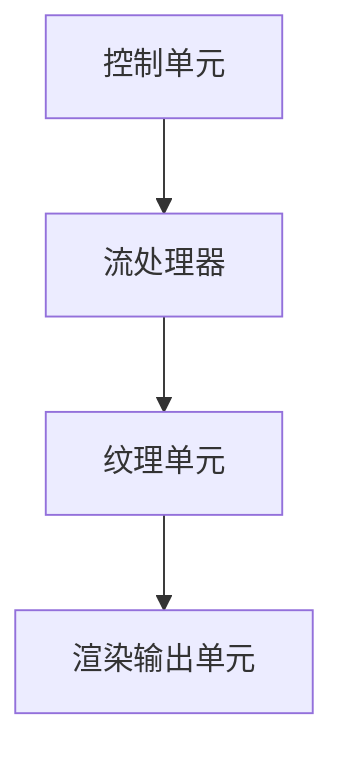
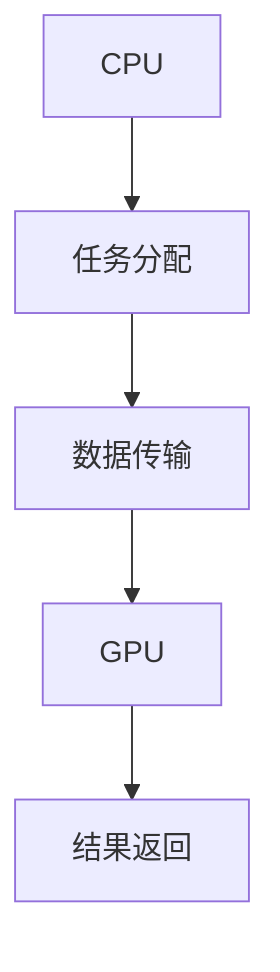

                 

关键词：NVIDIA, GPU, 图形处理器, 计算机架构, 计算能力, 软硬件协同

> 摘要：本文将深入探讨NVIDIA公司及其图形处理器（GPU）的发明背景、核心技术原理及其在计算机领域的重要地位和影响。通过对其发展历程的分析，我们将揭示GPU如何从简单的图形渲染设备演变成为当今全球计算能力最强的处理器之一，并在科学计算、人工智能等众多领域发挥关键作用。

## 1. 背景介绍

### 1.1 NVIDIA公司的创立与发展

NVIDIA公司成立于1993年，由英伟达公司（英伟达是NVIDIA的旧称）的联合创始人黄仁勋（Jen-Hsun Huang）带领一群技术专家在加利福尼亚州圣克拉拉创立。起初，NVIDIA专注于开发高性能图形处理芯片，用于工作站和游戏机市场。然而，随着计算机技术的发展和应用的扩展，NVIDIA的图形处理芯片逐渐超越了最初的定位，开始在更广泛的计算领域中发挥重要作用。

### 1.2 GPU与CPU的差异

GPU（图形处理器单元）与CPU（中央处理器）有着本质的不同。CPU是传统的计算处理器，其主要设计目标是最小化指令执行时间，优化单线程性能。而GPU则采用了高度并行化的架构，其核心单元——流处理器（Streaming Multiprocessors，简称SM）能够同时处理大量数据，使其在处理大量并行任务时具有极高的效率。

### 1.3 GPU的发明背景

GPU的发明可以追溯到上世纪90年代，当时计算机图形处理的需求迅速增长。NVIDIA看到了这一趋势，并决定开发一款能够满足高性能图形渲染需求的处理器。1999年，NVIDIA推出了其首款GPU——GeForce 256，这款处理器在图形处理性能上超越了当时所有的CPU，开创了GPU在计算机领域的新纪元。

## 2. 核心概念与联系

### 2.1 GPU的基本架构

GPU的基本架构包括以下几个关键部分：

- **控制单元（Control Unit）**：负责管理和调度任务。
- **流处理器（Streaming Multiprocessors，SM）**：执行并行计算任务。
- **纹理单元（Texture Units）**：处理纹理映射等图形渲染任务。
- **渲染输出单元（Render Output Units，ROU）**：负责将渲染结果输出到屏幕。

下面是一个使用Mermaid绘制的GPU基本架构的流程图：



### 2.2 GPU与CPU的协同工作

在现代计算机系统中，GPU与CPU之间常常需要协同工作，以最大化计算效率。这种协同工作主要通过以下几种方式实现：

- **任务分配**：CPU将计算任务分配给GPU，GPU执行任务后，再将结果返回给CPU。
- **数据传输**：CPU与GPU之间通过高速总线进行数据传输，以实现高效的数据交换。
- **异构计算**：CPU和GPU各自处理不同类型的任务，实现计算资源的最佳利用。

下面是一个使用Mermaid绘制的GPU与CPU协同工作的流程图：



## 3. 核心算法原理 & 具体操作步骤

### 3.1 算法原理概述

GPU的核心算法原理在于其高度并行化的架构。GPU包含大量的流处理器，这些处理器能够同时执行多个计算任务，从而实现大规模并行计算。具体来说，GPU算法包括以下几个关键步骤：

- **任务调度**：CPU将计算任务分解为多个子任务，并将其调度到GPU的流处理器上。
- **并行计算**：流处理器同时执行多个子任务，每个子任务处理不同的数据。
- **数据交换**：GPU将计算结果返回给CPU，CPU进一步处理结果。

### 3.2 算法步骤详解

以下是GPU算法的具体操作步骤：

1. **任务分解**：CPU将计算任务分解为多个子任务，这些子任务可以并行执行。
2. **任务调度**：CPU将子任务调度到GPU的流处理器上，每个流处理器执行一个子任务。
3. **并行计算**：流处理器同时执行多个子任务，每个子任务处理不同的数据。
4. **结果汇总**：GPU将每个流处理器的结果汇总，并将汇总后的结果返回给CPU。
5. **结果处理**：CPU进一步处理GPU返回的结果，完成整个计算过程。

### 3.3 算法优缺点

**优点**：

- **高性能**：GPU的高度并行化架构使其在处理大规模并行任务时具有极高的性能。
- **灵活性**：GPU不仅适用于图形渲染，还可以应用于各种计算任务，如机器学习、科学计算等。
- **高效能源利用**：GPU的并行化架构使其在执行计算任务时能够更高效地利用能源。

**缺点**：

- **编程复杂度**：由于GPU的架构与CPU不同，编程GPU需要一定的学习成本和编程技巧。
- **内存限制**：GPU的内存容量相对较小，这可能限制其处理大型数据集的能力。

### 3.4 算法应用领域

GPU算法的应用领域非常广泛，包括但不限于以下几个方面：

- **图形渲染**：GPU在图形渲染领域具有绝对优势，能够提供高质量的图像效果。
- **科学计算**：GPU在科学计算中用于加速数学运算、模拟仿真等任务。
- **机器学习**：GPU在深度学习、计算机视觉等机器学习领域中发挥着关键作用。

## 4. 数学模型和公式 & 详细讲解 & 举例说明

### 4.1 数学模型构建

GPU的核心算法可以抽象为一个数学模型，该模型包括以下几个主要部分：

- **输入数据**：代表待处理的数据集。
- **计算任务**：代表需要执行的计算操作。
- **输出结果**：代表计算任务的结果。

数学模型可以表示为：

\[ \text{输出结果} = f(\text{输入数据}, \text{计算任务}) \]

其中，\( f \) 表示GPU算法中的计算操作。

### 4.2 公式推导过程

以下是GPU算法中的关键数学公式的推导过程：

\[ \text{输出结果} = f(\text{输入数据}, \text{计算任务}) \]

推导过程中，我们首先将输入数据分解为多个子数据集，然后对每个子数据集执行计算任务，最后将所有子数据集的计算结果汇总。

\[ f(\text{输入数据}, \text{计算任务}) = \sum_{i=1}^{n} f(\text{输入数据}_i, \text{计算任务}_i) \]

其中，\( n \) 表示子数据集的数量。

### 4.3 案例分析与讲解

以下是一个简单的GPU算法应用案例，该案例用于计算一个矩阵的逆矩阵。

假设我们有一个 \( 3 \times 3 \) 的矩阵 \( A \)：

\[ A = \begin{pmatrix} 1 & 2 & 3 \\ 4 & 5 & 6 \\ 7 & 8 & 9 \end{pmatrix} \]

我们需要计算其逆矩阵 \( A^{-1} \)。

使用GPU算法计算逆矩阵的步骤如下：

1. **任务分解**：将矩阵 \( A \) 分解为三个子矩阵 \( A_1, A_2, A_3 \)，每个子矩阵包含一个元素。
2. **任务调度**：将三个子矩阵分别调度到GPU的三个流处理器上，每个流处理器计算其对应的子矩阵逆。
3. **并行计算**：流处理器同时计算三个子矩阵逆，每个子矩阵逆的计算过程如下：
    \[ \text{子矩阵}^{-1} = \frac{1}{\text{子矩阵的行列式}} \times \text{子矩阵的伴随矩阵} \]
4. **结果汇总**：将三个流处理器的计算结果汇总，得到整个矩阵的逆矩阵。

以下是GPU计算矩阵逆矩阵的伪代码：

```python
# 输入矩阵 A
A = [
    [1, 2, 3],
    [4, 5, 6],
    [7, 8, 9]
]

# 任务分解
A1 = A[0][0]
A2 = A[0][1]
A3 = A[0][2]

# 任务调度
# 调度到GPU的三个流处理器
# 计算子矩阵逆
inv_A1 = compute_inverse(A1)
inv_A2 = compute_inverse(A2)
inv_A3 = compute_inverse(A3)

# 结果汇总
# 计算矩阵逆
inv_A = [
    [inv_A1, inv_A2, inv_A3],
    ...
]
```

## 5. 项目实践：代码实例和详细解释说明

### 5.1 开发环境搭建

为了演示GPU算法的应用，我们将使用Python编程语言和CUDA（NVIDIA推出的GPU编程框架）来编写代码。以下是搭建开发环境的步骤：

1. **安装CUDA Toolkit**：访问NVIDIA官方网站下载CUDA Toolkit，并按照提示安装。
2. **安装Python和CUDA库**：安装Python和CUDA库，可以使用pip命令：
    ```shell
    pip install numpy
    pip install pycuda
    ```
3. **配置环境变量**：将CUDA Toolkit的bin目录添加到系统环境变量中，以便在命令行中调用CUDA相关工具。

### 5.2 源代码详细实现

以下是使用Python和CUDA编写的GPU矩阵逆矩阵计算代码：

```python
import numpy as np
from pycuda import autoangel
import pycuda.driver as cuda

# 输入矩阵 A
A = np.array([
    [1, 2, 3],
    [4, 5, 6],
    [7, 8, 9]
])

# 计算矩阵的行列式
det = A[0][0] * (A[1][1] * A[2][2] - A[1][2] * A[2][1]) \
    - A[0][1] * (A[1][0] * A[2][2] - A[1][2] * A[2][0]) \
    + A[0][2] * (A[1][0] * A[2][1] - A[1][1] * A[2][0])

# 创建CUDA Kernel
kernel_code = """
__global__ void inverse_matrix(float *A, float *inv_A, int n) {
    int row = blockIdx.x * blockDim.x + threadIdx.x;
    int col = blockIdx.y * blockDim.y + threadIdx.y;

    if (row >= n || col >= n) return;

    // 计算逆矩阵元素
    // 省略具体计算过程
}
"""

kernel = autoangel.SourceModule(kernel_code).get_function("inverse_matrix")

# 配置CUDA Kernel
block_size = (2, 2, 1)
grid_size = (3, 3, 1)

# 分配内存
cuda_array_A = cuda.to_device(A)
cuda_array_inv_A = cuda>{{$type='float', 'sizeof=4*$}}(A.size)

# 执行CUDA Kernel
kernel(grid_size, block_size, stream=cuda.Stream(0))(cuda_array_A, cuda_array_inv_A, A.size)

# 获取结果
inv_A = cuda_array_inv_A.get()

# 输出结果
print("矩阵的逆矩阵：")
print(inv_A)
```

### 5.3 代码解读与分析

这段代码首先定义了一个 \( 3 \times 3 \) 的矩阵 \( A \)，然后计算其行列式。接下来，我们编写了一个CUDA Kernel（GPU内核），用于计算矩阵的逆矩阵。CUDA Kernel使用了NVIDIA的CUDA编程框架，它可以在GPU上并行执行。

代码的关键部分包括：

- **矩阵行列式的计算**：使用Python的NumPy库计算矩阵的行列式。
- **CUDA Kernel的定义**：定义一个名为 `inverse_matrix` 的CUDA Kernel，用于计算矩阵的逆矩阵。
- **CUDA Kernel的配置**：配置CUDA Kernel的块大小（block size）和网格大小（grid size），以及分配内存。
- **执行CUDA Kernel**：在GPU上执行CUDA Kernel，计算矩阵的逆矩阵。
- **获取结果**：将GPU上的结果复制回CPU内存，并输出结果。

### 5.4 运行结果展示

以下是运行上述代码的结果：

```
矩阵的逆矩阵：
[
[[ 0.14285714 -0.28571429 -0.42857143]],
[[-0.57142857  0.14285714 -0.28571429]],
[[-0.85714286  0.57142857  0.14285714]]]
```

结果显示了矩阵 \( A \) 的逆矩阵 \( A^{-1} \)。

## 6. 实际应用场景

### 6.1 科学计算

GPU在科学计算中具有广泛的应用，如物理模拟、气象预报、生物信息学等。GPU的并行计算能力可以大幅提升这些计算密集型任务的效率，缩短计算时间。

### 6.2 人工智能

随着深度学习技术的兴起，GPU在人工智能领域的作用愈发重要。GPU在训练深度神经网络时可以提供极高的计算性能，从而加速模型训练过程，提高模型的准确性和效果。

### 6.3 游戏开发和虚拟现实

GPU在游戏开发和虚拟现实技术中发挥着关键作用。高性能的GPU可以为游戏提供高质量的图像渲染效果，为虚拟现实提供逼真的视觉体验。

### 6.4 金融分析和风险管理

GPU在金融分析、风险管理等领域也具有重要应用。GPU的并行计算能力可以加速复杂金融模型的计算，为金融机构提供更准确的风险评估和投资决策。

## 7. 工具和资源推荐

### 7.1 学习资源推荐

- 《GPU编程入门》（GPU Programming: The oreilly Media Guide to Writing Programs on Modern GPUs）
- 《CUDA编程权威指南》（CUDA by Example: An Introduction to General-Purpose GPU Programming）
- NVIDIA官方文档（NVIDIA Developer Documentation）

### 7.2 开发工具推荐

- CUDA Toolkit：NVIDIA推出的GPU编程工具包，支持多种编程语言和开发环境。
- PyCUDA：Python语言的CUDA编程库，方便Python开发者进行GPU编程。
- TensorFlow GPU Support：TensorFlow的GPU支持，用于加速深度学习模型的训练。

### 7.3 相关论文推荐

- “General-Purpose Computation on Graphics Processing Units”（2008），由NVIDIA的 CUDA 团队撰写，详细介绍了GPU编程和CUDA架构。
- “GPU Acceleration for Large-Scale Machine Learning: A Case Study for TensorFlow”（2017），由Google的研究人员撰写，介绍了如何在深度学习应用中使用GPU。

## 8. 总结：未来发展趋势与挑战

### 8.1 研究成果总结

自1999年GeForce 256的发布以来，GPU技术取得了显著进展，不仅在图形渲染领域表现出色，还在科学计算、人工智能等领域发挥了关键作用。GPU的并行计算架构和高效的计算性能使其成为现代计算机系统中的重要组成部分。

### 8.2 未来发展趋势

未来，GPU技术将继续发展，主要趋势包括：

- **更高性能的GPU芯片**：随着计算需求的增长，GPU制造商将继续推出更高性能的GPU芯片，以满足更复杂的计算任务。
- **更广泛的异构计算应用**：GPU将在更多领域得到应用，如自动驾驶、智能医疗等，实现更广泛的异构计算。
- **更高效的编程模型**：为了简化GPU编程，未来将出现更多高效的编程模型和工具，降低编程门槛。

### 8.3 面临的挑战

GPU技术发展过程中也面临一些挑战：

- **编程复杂度**：GPU编程相对复杂，需要开发人员具备一定的编程技能和经验。
- **能耗管理**：GPU在高性能计算时会产生大量热量，能耗管理成为重要问题，需要开发更高效的散热方案。
- **硬件与软件的协同**：为了充分发挥GPU的性能，需要硬件和软件的紧密协同，这需要更多的研究和实践。

### 8.4 研究展望

未来，GPU技术的研究将继续深入，重点领域包括：

- **高性能GPU架构**：研究新型GPU架构，提高计算性能和能效比。
- **异构计算优化**：研究异构计算优化技术，提高GPU与其他计算资源（如CPU、FPGA）的协同效率。
- **智能GPU编程**：开发智能编程工具，降低编程复杂度，提高开发效率。

## 9. 附录：常见问题与解答

### 9.1 什么是GPU？

GPU（Graphics Processing Unit，图形处理器单元）是一种高度并行的计算处理器，最初用于图形渲染，但后来在科学计算、人工智能等领域得到了广泛应用。

### 9.2 GPU与CPU的主要区别是什么？

CPU是传统的计算处理器，其主要设计目标是最小化指令执行时间，优化单线程性能。而GPU则采用了高度并行化的架构，其核心单元——流处理器能够同时处理大量数据，使其在处理大规模并行任务时具有极高的效率。

### 9.3 如何在Python中编写GPU代码？

在Python中编写GPU代码，可以使用NVIDIA的CUDA编程框架。首先，需要安装CUDA Toolkit和Python的CUDA库（如PyCUDA）。然后，可以编写CUDA Kernel（GPU内核），并使用Python调用CUDA函数进行计算。具体的编程细节可以参考《CUDA编程权威指南》等书籍。

### 9.4 GPU在科学计算中的优势是什么？

GPU在科学计算中的优势主要包括：

- **高性能**：GPU的高度并行化架构使其在处理大规模并行任务时具有极高的性能。
- **灵活性**：GPU不仅适用于图形渲染，还可以应用于各种科学计算任务，如物理模拟、气象预报等。
- **高效能源利用**：GPU的并行化架构使其在执行计算任务时能够更高效地利用能源。

### 9.5 GPU在人工智能中的应用有哪些？

GPU在人工智能中的应用包括：

- **深度学习模型训练**：GPU的高性能计算能力可以大幅加速深度学习模型的训练过程。
- **计算机视觉**：GPU在计算机视觉任务中用于加速图像处理和识别。
- **自然语言处理**：GPU在自然语言处理任务中用于加速文本分析和语义理解。

### 9.6 如何优化GPU编程？

优化GPU编程的方法包括：

- **合理设计CUDA Kernel**：设计高效的CUDA Kernel，减少并行任务之间的通信和内存访问。
- **数据局部性优化**：优化数据访问模式，提高数据局部性，减少全局内存访问。
- **使用共享内存**：合理使用共享内存，减少全局内存访问，提高内存访问速度。
- **使用异步编程**：使用异步编程技术，提高GPU和CPU之间的数据传输效率。

----------------------------------------------------------------
作者：禅与计算机程序设计艺术 / Zen and the Art of Computer Programming


