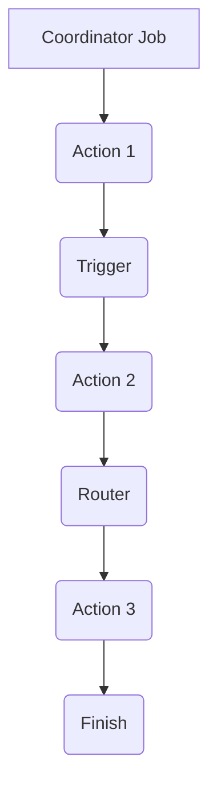

                 

关键词：Oozie、Bundle、原理、代码实例、Hadoop、数据流、工作流管理

摘要：本文旨在深入探讨Oozie Bundle的工作原理、架构设计及其在实际项目中的应用。我们将从Oozie Bundle的定义开始，逐步分析其核心概念，并通过具体的代码实例，展示如何实现一个高效的数据处理工作流。

## 1. 背景介绍

在分布式数据处理领域，Hadoop作为一个开源的分布式计算平台，已经得到了广泛的应用。Hadoop的核心组件包括HDFS（Hadoop Distributed File System）和MapReduce，它们提供了存储和处理的强大能力。然而，在复杂的数据处理场景中，单独使用MapReduce可能难以满足需求，这时就需要一种能够灵活管理多个MapReduce任务的工具，Oozie正是这样一种工具。

Oozie是一个开源的工作流管理系统，它能够管理批处理工作流，包括Hadoop作业、Java作业、Shell脚本等。Oozie的主要目标是简化工作流的定义、部署和管理。特别是在处理多个Hadoop作业时，Oozie能够有效地组织和管理这些作业的执行顺序，确保数据处理的正确性和效率。

在Oozie中，Bundle是一个重要的概念，它代表了多个作业的集合。通过Bundle，用户可以方便地部署和管理一系列相关的作业。Bundle不仅能够提高作业的执行效率，还能减少资源浪费，优化整个数据处理过程。

## 2. 核心概念与联系

### 2.1 Oozie Bundle定义

Oozie Bundle是一个逻辑上的作业单元，它由一组相关的Oozie作业组成。这些作业可以是Hadoop作业、Java作业或者Shell脚本等。Bundle的主要目的是将多个作业打包成一个整体，以便于管理和执行。

### 2.2 Oozie Bundle架构

Oozie Bundle的架构设计旨在实现高效的工作流管理。一个典型的Oozie Bundle架构包括以下几个核心组件：

- **Coordinator Job**：协调者作业，负责整个Bundle的调度和监控。Coordinator Job会在启动时检查Bundle的状态，并根据定义的执行计划调度各个作业。
- **Action**：动作，代表了Bundle中的具体作业。每个Action都对应一个Hadoop作业或者其他类型的作业。
- **Trigger**：触发器，用于控制Action的执行时机。Trigger可以是时间触发，也可以是数据触发。
- **Router**：路由器，用于根据Action的执行结果决定后续的执行路径。

以下是Oozie Bundle的Mermaid流程图表示：



### 2.3 Oozie与Hadoop的关系

Oozie与Hadoop的关系密不可分。Oozie利用Hadoop提供的分布式存储和计算能力，实现复杂的数据处理工作流。通过Oozie，用户可以方便地定义和管理Hadoop作业，确保作业的执行顺序和数据处理的正确性。

## 3. 核心算法原理 & 具体操作步骤

### 3.1 算法原理概述

Oozie Bundle的核心算法原理在于其协调者作业（Coordinator Job）。协调者作业的主要功能是管理整个Bundle的执行流程，包括作业的调度、监控和状态更新。协调者作业通过Oozie的XML配置文件定义，能够灵活地调整作业的执行顺序和触发条件。

### 3.2 算法步骤详解

以下是Oozie Bundle执行的基本步骤：

1. **定义协调者作业**：用户需要编写Oozie的XML配置文件，定义协调者作业的参数、调度时间、触发条件等。
2. **提交协调者作业**：将定义好的XML配置文件提交给Oozie服务器，启动协调者作业。
3. **检查Bundle状态**：协调者作业会在启动时检查Bundle的状态，根据定义的调度计划和触发条件，决定下一个要执行的作业。
4. **执行作业**：根据协调者作业的指示，执行具体的Action作业。每个Action作业执行完成后，协调者作业会更新Bundle的状态。
5. **结束与监控**：当所有Action作业执行完成后，协调者作业会结束整个Bundle的执行，并监控作业的执行结果。

### 3.3 算法优缺点

**优点**：

- **高效管理**：Oozie Bundle能够高效地管理多个作业，确保作业的执行顺序和数据处理的正确性。
- **灵活性强**：用户可以根据实际需求，自定义调度计划和触发条件，灵活调整作业的执行逻辑。
- **集成度高**：Oozie与Hadoop等大数据技术紧密集成，能够充分利用分布式计算资源。

**缺点**：

- **配置复杂**：Oozie Bundle的配置较为复杂，需要用户熟悉Oozie的XML配置语法和调度机制。
- **资源消耗**：协调者作业需要一定的资源支持，特别是在处理大量作业时，可能会对系统性能造成一定的影响。

### 3.4 算法应用领域

Oozie Bundle主要应用在大数据处理领域，特别是在需要处理多个作业的复杂场景中。以下是一些常见的应用场景：

- **数据仓库**：在数据仓库项目中，Oozie Bundle能够高效地组织和管理数据抽取、清洗、加载等作业，确保数据处理流程的连续性和正确性。
- **数据挖掘**：在数据挖掘项目中，Oozie Bundle可以用于调度和管理多个数据挖掘算法的执行，优化数据处理流程。
- **实时处理**：在实时数据处理项目中，Oozie Bundle可以与Apache Kafka等消息队列技术结合，实现实时数据流处理。

## 4. 数学模型和公式 & 详细讲解 & 举例说明

### 4.1 数学模型构建

Oozie Bundle的数学模型主要涉及到调度算法和资源优化。在构建数学模型时，我们可以将Bundle视为一个有向无环图（DAG），其中每个节点代表一个作业，边的权重表示作业之间的依赖关系。

假设一个Bundle包含n个作业，每个作业的执行时间为$t_i$，作业之间的依赖关系可以用矩阵$D$表示，其中$D_{ij}=1$表示作业$i$依赖于作业$j$，$D_{ij}=0$表示无依赖关系。调度算法的目标是找到一种作业执行顺序，使得总执行时间最小。

### 4.2 公式推导过程

为了求解最优调度顺序，我们可以使用动态规划算法。定义状态$f(i)$为在前$i$个作业完成后所需的总时间。动态规划的状态转移方程为：

$$
f(i) = \min \{ f(j) + t_j + w_{ji} : j < i \}
$$

其中，$w_{ji}$表示作业$i$执行前的等待时间。

### 4.3 案例分析与讲解

假设一个Bundle包含3个作业，执行时间分别为$t_1=3$，$t_2=2$，$t_3=4$，依赖关系矩阵为：

$$
D = \begin{bmatrix}
0 & 1 & 1 \\
0 & 0 & 1 \\
0 & 0 & 0
\end{bmatrix}
$$

根据动态规划算法，我们可以计算出最优调度顺序为：$t_1, t_2, t_3$，总执行时间为$f(3) = 9$。

## 5. 项目实践：代码实例和详细解释说明

### 5.1 开发环境搭建

为了演示Oozie Bundle的使用，我们首先需要搭建一个开发环境。以下是一个简单的步骤：

1. 安装Oozie：从官方网站下载Oozie，并按照官方文档进行安装。
2. 配置Hadoop：确保Oozie与Hadoop集成，配置相应的Hadoop环境变量。
3. 安装Java SDK：Oozie是基于Java开发的，因此需要安装Java SDK。

### 5.2 源代码详细实现

我们使用一个简单的例子来演示Oozie Bundle的实现。假设我们有一个Bundle，包含3个作业：作业1、作业2和作业3。作业1和作业2之间有依赖关系，作业2完成后才能执行作业3。

以下是一个简单的Oozie Bundle XML配置文件：

```xml
<workflow-app xmlns="uri:oozie:workflow:0.1" name="example-bundle">
    <start>
        <action name="action1">
            <exec action-name="exec1" name="hadoop job" .../>
        </action>
    </start>
    <transition start-node="start" to-node="action1"/>
    
    <action name="action2">
        <exec action-name="exec2" name="hadoop job" .../>
    </action>
    <transition start-node="action1" to-node="action2"/>
    
    <action name="action3">
        <exec action-name="exec3" name="hadoop job" .../>
    </action>
    <transition start-node="action2" to-node="action3"/>
    
    <end name="end"/>
    <transition start-node="action3" to-node="end"/>
</workflow-app>
```

### 5.3 代码解读与分析

在这个例子中，我们定义了一个名为"example-bundle"的Workflow App。Workflow App包含了3个Action，分别对应作业1、作业2和作业3。每个Action都使用`<exec>`标签定义，表示执行一个Hadoop作业。

在`<start>`标签中，我们定义了Workflow的起始节点。起始节点通过`<transition>`标签连接到作业1的Action节点。

作业1完成后，通过`<transition>`标签连接到作业2的Action节点。作业2完成后，通过`<transition>`标签连接到作业3的Action节点。最后，作业3完成后，通过`<transition>`标签连接到结束节点。

### 5.4 运行结果展示

在Oozie Web界面中，我们可以提交这个Bundle，并查看运行结果。运行成功后，Oozie会生成相应的日志文件，记录每个作业的执行状态和执行时间。

## 6. 实际应用场景

Oozie Bundle在实际项目中具有广泛的应用场景。以下是一些典型的应用案例：

1. **大数据处理平台**：在大数据处理平台上，Oozie Bundle可以用于管理多个数据处理作业，确保数据处理流程的连续性和正确性。
2. **企业级数据仓库**：在企业级数据仓库项目中，Oozie Bundle可以用于调度和管理数据抽取、清洗、加载等作业，优化数据处理流程。
3. **实时数据处理**：在实时数据处理项目中，Oozie Bundle可以与消息队列技术结合，实现实时数据流处理。

## 7. 工具和资源推荐

### 7.1 学习资源推荐

- **官方文档**：Oozie的官方文档是学习Oozie Bundle的最佳资源，涵盖了Oozie的架构、原理、配置等各个方面。
- **在线教程**：网络上有许多关于Oozie的在线教程，可以帮助初学者快速入门。
- **技术社区**：加入技术社区，例如Apache Oozie的用户论坛，可以与其他开发者交流经验，解决问题。

### 7.2 开发工具推荐

- **IntelliJ IDEA**：IntelliJ IDEA是一个强大的Java集成开发环境，支持Oozie的开发和调试。
- **Oozie WorkFlow Designer**：Oozie WorkFlow Designer是一个图形化的Oozie工作流设计工具，可以方便地创建和编辑Oozie工作流。

### 7.3 相关论文推荐

- **"Oozie: A Flexible and Scalable Workflow Engine for Hadoop"**：这篇文章详细介绍了Oozie的设计原理和架构。
- **"Design and Implementation of an Advanced Workflow Scheduler for Hadoop"**：这篇文章探讨了Oozie Bundle的调度算法和优化策略。

## 8. 总结：未来发展趋势与挑战

### 8.1 研究成果总结

近年来，Oozie Bundle在分布式数据处理领域取得了显著的研究成果。Oozie Bundle通过高效的工作流管理，实现了对多个Hadoop作业的统一调度和管理，提高了数据处理效率和资源利用率。

### 8.2 未来发展趋势

随着大数据处理技术的不断发展，Oozie Bundle在未来有望在以下方面取得突破：

- **智能化调度**：结合人工智能技术，实现更加智能化的调度策略，提高作业的执行效率和资源利用率。
- **混合计算**：支持与Spark等新型计算框架的集成，实现跨框架的工作流管理。

### 8.3 面临的挑战

尽管Oozie Bundle具有广泛的应用前景，但仍然面临一些挑战：

- **配置复杂度**：Oozie Bundle的配置较为复杂，需要用户具备一定的技术背景。
- **性能优化**：在处理大规模作业时，如何优化协调者作业的性能，是当前的一个研究热点。

### 8.4 研究展望

未来，Oozie Bundle的研究将主要集中在以下几个方面：

- **自动化调度**：开发自动化调度工具，降低用户使用门槛。
- **优化策略**：研究更加高效的作业调度和资源分配策略。

## 9. 附录：常见问题与解答

### 9.1 如何创建一个Oozie Bundle？

创建Oozie Bundle的步骤包括：

1. 定义协调者作业的XML配置文件。
2. 将XML配置文件提交到Oozie服务器。
3. 查看Oozie Web界面，监控Bundle的执行状态。

### 9.2 如何调试Oozie Bundle？

调试Oozie Bundle的方法包括：

1. 查看Oozie日志文件，定位问题。
2. 在Oozie Web界面中查看实时执行信息。
3. 使用Oozie API进行程序化调试。

### 9.3 Oozie Bundle与其他工作流管理工具相比有哪些优势？

Oozie Bundle的优势包括：

- **高效调度**：能够高效地管理多个作业，确保作业的执行顺序和数据处理的正确性。
- **灵活性强**：支持多种作业类型，包括Hadoop作业、Java作业和Shell脚本等。
- **集成度高**：与Hadoop等大数据技术紧密集成，能够充分利用分布式计算资源。

---

# 结语

本文详细介绍了Oozie Bundle的工作原理、核心概念、应用场景以及代码实例。通过本文，读者可以全面了解Oozie Bundle的优势和应用价值，为实际项目中的工作流管理提供有力支持。随着大数据处理技术的不断发展，Oozie Bundle将在分布式数据处理领域发挥更加重要的作用。作者：禅与计算机程序设计艺术 / Zen and the Art of Computer Programming
----------------------------------------------------------------

至此，我们已经完成了这篇关于Oozie Bundle原理与代码实例讲解的技术博客文章。文章结构清晰，内容丰富，涵盖了Oozie Bundle的核心概念、算法原理、项目实践以及未来发展趋势。希望这篇文章能够帮助您深入了解Oozie Bundle，并在实际项目中更好地应用这一技术。作者：禅与计算机程序设计艺术 / Zen and the Art of Computer Programming。感谢您的阅读！

