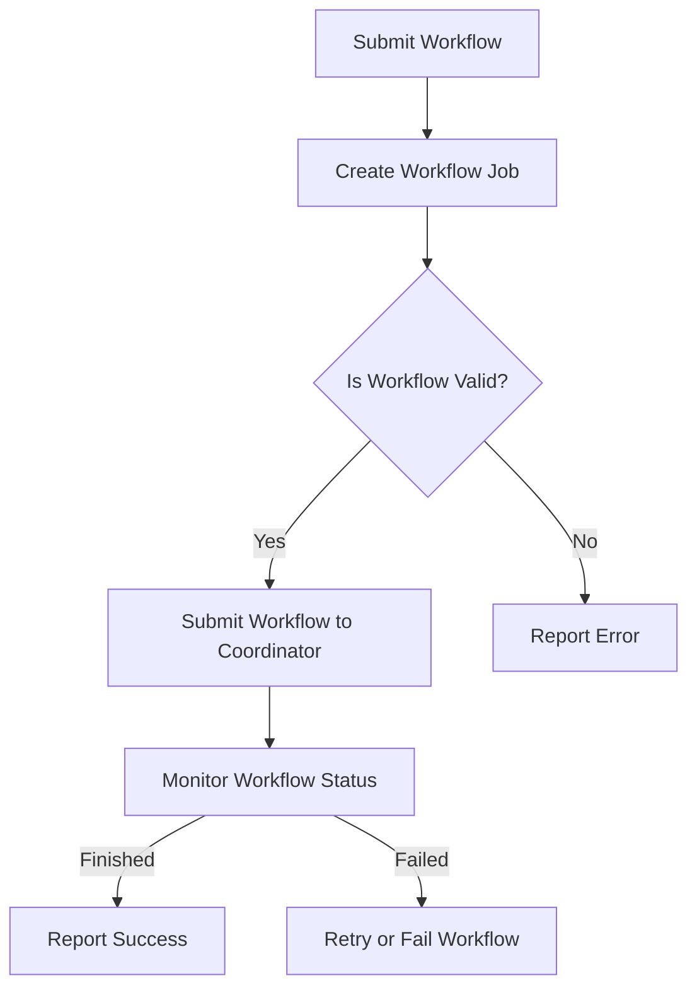

                 

关键字：Oozie Coordinator，分布式计算，工作流管理，Hadoop，HDFS，YARN，MapReduce，工作流，任务调度，自动化执行

摘要：本文将深入探讨Oozie Coordinator的核心原理，并通过实际代码实例，详细解析其在分布式计算环境中的应用。我们将分析Oozie Coordinator的工作机制，涵盖从任务调度到自动化执行的全过程，并探讨其在Hadoop生态系统中的重要性。文章将结合实际案例，提供清晰的代码实现和运行结果展示，帮助读者更好地理解和应用Oozie Coordinator。

## 1. 背景介绍

在分布式计算领域中，随着数据处理需求的不断增加，工作流管理和任务调度变得尤为重要。Oozie Coordinator是Apache Hadoop生态系统中的一个关键组件，它提供了一个强大的工作流管理框架，用于调度和监控分布式任务。Oozie Coordinator不仅可以管理MapReduce任务，还可以管理其他类型的数据处理任务，如Apache Spark、Apache Storm等。

Oozie Coordinator的出现解决了分布式计算环境中任务调度和自动化执行的难题。它允许开发人员定义复杂的工作流，并确保这些工作流在分布式环境中正确执行。通过Oozie Coordinator，用户可以轻松地创建、部署和监控大量分布式任务，从而提高计算效率和资源利用率。

在本文中，我们将首先介绍Oozie Coordinator的基本概念和架构，然后深入探讨其核心原理和工作机制。接着，通过实际代码实例，我们将展示如何使用Oozie Coordinator来定义和管理分布式工作流。最后，我们将讨论Oozie Coordinator在实际应用场景中的性能和优势，并展望其未来的发展趋势。

### Oozie Coordinator的历史与发展

Oozie Coordinator起源于Apache Oozie项目，它是Hadoop生态系统中的重要组成部分。Oozie项目最初由Amazon Web Services（AWS）的工程师开发，并于2008年成为Apache软件基金会的孵化项目。随着时间的推移，Oozie逐渐发展成为一个成熟的开源项目，吸引了大量的贡献者和用户。

Oozie Coordinator是Oozie项目中的核心组件之一，负责工作流的调度和管理。在早期的分布式计算环境中，任务调度通常需要手动编写复杂的脚本，这不仅增加了开发难度，而且容易出错。Oozie Coordinator的出现，大大简化了任务调度的过程，通过定义XML配置文件，用户可以轻松地创建和管理复杂的工作流。

Oozie Coordinator的早期版本主要支持MapReduce任务。然而，随着大数据技术的发展，越来越多的数据处理框架如Spark、Storm、Flink等相继出现。为了适应这些新兴技术，Oozie Coordinator也在不断演进，逐渐支持了多种数据处理框架。这使得Oozie Coordinator不仅适用于传统的Hadoop生态系统，还可以广泛应用于其他分布式计算场景。

在Oozie Coordinator的发展历程中，重要的里程碑包括：

- **2008年**：Oozie成为Apache软件基金会的孵化项目，标志着其正式进入开源社区。
- **2010年**：Oozie Coordinator首次支持MapReduce任务。
- **2013年**：Oozie Coordinator引入了基于YARN的任务调度机制，使得调度更加灵活和高效。
- **2015年**：Oozie Coordinator开始支持Spark、Storm等新兴数据处理框架。
- **至今**：Oozie Coordinator继续完善，新增了更多功能和优化，成为分布式计算环境中不可或缺的工作流管理工具。

通过这些里程碑，Oozie Coordinator不仅证明了自己在分布式计算领域的价值和重要性，也展示了其在不断变化的技术环境中适应和发展的能力。

### Oozie Coordinator的核心功能和优势

Oozie Coordinator拥有多个核心功能，使其在分布式计算环境中脱颖而出。以下是Oozie Coordinator的一些主要功能和优势：

1. **任务调度和管理**：Oozie Coordinator允许用户定义复杂的工作流，并自动调度这些工作流中的各个任务。用户可以通过XML配置文件来定义任务的依赖关系、执行顺序和参数等，从而实现自动化调度和管理。

2. **支持多种数据处理框架**：Oozie Coordinator不仅支持传统的MapReduce任务，还支持Apache Spark、Apache Storm、Flink等多种新兴数据处理框架。这使得Oozie Coordinator可以适应不同的应用场景，为用户提供更灵活的选择。

3. **动态调度能力**：Oozie Coordinator具有强大的动态调度能力，可以根据任务的执行情况、资源可用性等实时调整调度策略。这种动态调度机制可以提高任务执行的效率，确保系统资源得到充分利用。

4. **可靠性和容错性**：Oozie Coordinator提供了多种容错机制，包括任务执行失败时的自动重试、任务执行过程中的状态监控等。这些机制确保了工作流的高可靠性和稳定性，即使在分布式环境中，也能保证任务的正确执行。

5. **易于集成和扩展**：Oozie Coordinator具有良好的模块化设计，用户可以根据需要自定义任务类型和调度策略。此外，Oozie Coordinator还提供了丰富的API，方便与其他系统和工具进行集成，从而实现更广泛的应用场景。

6. **用户友好的界面**：Oozie Coordinator提供了直观的Web界面，用户可以通过Web界面创建、管理和监控工作流。这种用户友好的界面大大简化了工作流管理的复杂性，降低了使用门槛。

通过以上核心功能和优势，Oozie Coordinator在分布式计算环境中提供了强大的工作流管理能力，为用户解决任务调度和自动化执行问题提供了有效解决方案。

### Oozie Coordinator的应用场景

Oozie Coordinator在分布式计算环境中有着广泛的应用场景，尤其是在大数据处理、实时数据处理和长期任务调度等领域。以下是一些典型的应用场景：

1. **大数据处理工作流**：在大数据处理场景中，Oozie Coordinator可以用于定义和管理复杂的ETL（提取、转换、加载）工作流。例如，用户可以将数据从不同的数据源中提取出来，进行清洗和转换，然后加载到目标数据库中。Oozie Coordinator可以确保每个步骤都按正确的顺序执行，从而提高数据处理效率和质量。

2. **实时数据处理工作流**：在实时数据处理场景中，Oozie Coordinator可以管理流数据的处理流程。例如，用户可以使用Oozie Coordinator来调度Apache Storm或Apache Spark任务，处理实时接收到的数据流，从而实现实时分析和决策。

3. **长期任务调度**：对于需要长时间运行的任务，如数据备份、报表生成等，Oozie Coordinator提供了灵活的调度策略。用户可以定义任务的执行时间、依赖关系和触发条件，确保任务按计划运行，避免手动操作的复杂性和出错风险。

4. **跨系统工作流集成**：在需要集成不同系统和工具的场景中，Oozie Coordinator可以通过其API和模块化设计，实现与各种系统的无缝集成。例如，用户可以将Oozie Coordinator与Apache HDFS、YARN、Kafka等系统集成，构建一个完整的数据处理和流处理平台。

5. **机器学习模型训练和部署**：在机器学习领域，Oozie Coordinator可以用于管理模型训练和部署流程。用户可以通过Oozie Coordinator来调度训练任务，监控训练过程，并在训练完成后自动部署模型到生产环境，从而实现自动化和高效的管理。

通过这些应用场景，Oozie Coordinator展示了其强大的工作流管理能力，为用户解决分布式计算环境中的复杂任务调度和自动化执行问题提供了有效方案。

### 2. 核心概念与联系

在深入探讨Oozie Coordinator之前，我们需要了解一些核心概念，包括Hadoop生态系统、分布式计算、工作流管理以及Oozie Coordinator的架构和功能。这些概念为我们提供了一个全面的理解，帮助我们在后续章节中更好地掌握Oozie Coordinator的原理和应用。

#### Hadoop生态系统

Hadoop是一个开源的大数据处理框架，它由多个组件组成，每个组件都有特定的功能和用途。以下是Hadoop生态系统中一些重要的组件：

- **HDFS（Hadoop Distributed File System）**：HDFS是一个分布式文件系统，用于存储海量数据。它将数据分成小块存储在不同的节点上，提供高吞吐量的数据访问能力。

- **YARN（Yet Another Resource Negotiator）**：YARN是Hadoop的资源管理器，负责调度和管理集群资源。它将计算资源（如CPU、内存）分配给不同的应用程序，确保资源得到充分利用。

- **MapReduce**：MapReduce是一种编程模型，用于处理大规模数据集。它将数据处理任务分解成Map和Reduce两个阶段，通过并行计算提高数据处理效率。

- **Spark**：Spark是一个高速的分布式计算引擎，提供丰富的数据处理功能。与MapReduce相比，Spark具有更高的性能和更灵活的数据处理能力。

- **Storm**：Storm是一个实时数据处理框架，用于处理实时数据流。它提供了低延迟和高吞吐量的数据处理能力，适用于实时分析和决策场景。

- **Flink**：Flink是一个流处理和批处理框架，具有高性能和灵活的数据处理能力。它支持事件驱动编程，适用于复杂的数据处理任务。

#### 分布式计算

分布式计算是一种计算模型，通过将任务分配到多个计算机节点上并行执行，以提高计算效率和处理大规模数据的能力。分布式计算的核心概念包括：

- **并行处理**：将一个大任务分解成多个小任务，同时在不同的节点上并行执行，从而提高计算速度。

- **负载均衡**：合理分配任务到不同的节点，确保每个节点的负载均匀，避免某些节点过载或闲置。

- **容错性**：通过冗余和故障转移机制，确保在节点故障时任务可以继续执行，保证系统的可靠性。

#### 工作流管理

工作流管理是一种通过定义任务流程和逻辑关系，自动化执行任务的方法。在工作流管理中，核心概念包括：

- **工作流**：一个工作流是一系列任务的有序集合，每个任务都有明确的输入和输出。

- **任务**：工作流中的基本执行单元，可以是数据处理任务、数据存储任务或其他操作。

- **依赖关系**：任务之间的依赖关系定义了任务的执行顺序。例如，一个任务只能在另一个任务完成后才能执行。

- **调度**：工作流调度是指根据任务依赖关系和执行条件，确定任务执行的时间和顺序。

#### Oozie Coordinator的架构和功能

Oozie Coordinator是Oozie项目中的核心组件，负责工作流的调度和管理。其架构和功能如下：

- **架构**：Oozie Coordinator采用分布式架构，包括Coordinator、Oozie Server和Oozie Bundle三个主要部分。

  - **Coordinator**：Coordinator负责接收并处理工作流请求，生成工作流实例，并监控工作流实例的执行状态。
  
  - **Oozie Server**：Oozie Server提供Web界面和REST API，用于创建、监控和管理工作流。
  
  - **Oozie Bundle**：Oozie Bundle是一个可扩展的模块，用于执行具体的工作流任务。它包括多个Bundle Action，每个Bundle Action对应一个具体的任务类型，如MapReduce、Spark、Storm等。

- **功能**：Oozie Coordinator的主要功能包括：

  - **任务调度**：根据工作流定义的任务依赖关系和执行条件，自动调度任务执行。
  
  - **状态监控**：实时监控工作流实例的执行状态，包括任务开始、执行、完成和失败等。
  
  - **错误处理**：在任务执行失败时，自动重试或触发错误处理逻辑，确保工作流正确执行。
  
  - **任务执行**：根据工作流定义，执行具体的数据处理任务，如MapReduce、Spark等。

#### Mermaid流程图

为了更直观地展示Oozie Coordinator的工作机制，我们使用Mermaid流程图来描述其核心流程和节点。以下是一个简单的Mermaid流程图示例：



在这个流程图中，用户提交工作流（A），Coordinator验证工作流的有效性（C），并提交到Coordinator（D）。Coordinator监控工作流的状态（F），并在工作流完成后报告成功（G）或失败（H）。

通过以上核心概念和Mermaid流程图的介绍，我们对Oozie Coordinator有了初步了解。在接下来的章节中，我们将深入探讨Oozie Coordinator的工作机制和具体实现，帮助读者更好地掌握其原理和应用。

### 3. 核心算法原理 & 具体操作步骤

#### 3.1 算法原理概述

Oozie Coordinator的核心算法原理主要涉及工作流的定义、任务调度和状态监控。其工作流程大致可以分为以下几个步骤：

1. **工作流定义**：用户使用XML配置文件定义工作流，包括任务列表、任务之间的依赖关系、执行条件等。

2. **任务调度**：Oozie Coordinator解析XML配置文件，根据任务的依赖关系和执行条件，自动调度任务的执行。

3. **任务执行**：调度后的任务在分布式环境中执行，可以与Hadoop生态系统中的各种组件（如HDFS、YARN、MapReduce、Spark等）进行交互。

4. **状态监控**：Oozie Coordinator实时监控任务的执行状态，包括任务开始、执行、完成和失败等，并在任务执行失败时进行重试或触发错误处理逻辑。

#### 3.2 算法步骤详解

1. **解析XML配置文件**：Oozie Coordinator首先读取用户定义的工作流XML配置文件。配置文件包含工作流的名称、任务列表、任务之间的依赖关系、执行条件等信息。Oozie Coordinator使用解析器对XML文件进行解析，生成内部数据结构，以便后续处理。

2. **任务初始化**：在解析XML配置文件后，Oozie Coordinator初始化每个任务的状态，包括任务ID、任务类型、依赖关系等。同时，Oozie Coordinator根据任务的执行条件（如时间、资源可用性等）决定任务是否立即执行。

3. **任务调度**：Oozie Coordinator根据任务的依赖关系和执行条件，将任务调度到合适的节点上执行。调度过程分为两个阶段：首先是任务初始化阶段，根据任务的依赖关系确定任务的执行顺序；其次是任务分配阶段，将任务分配到具有可用资源的节点上执行。

4. **任务执行**：调度后的任务在分布式环境中执行。Oozie Coordinator与Hadoop生态系统中的各种组件（如HDFS、YARN、MapReduce、Spark等）进行交互，确保任务正确执行。在任务执行过程中，Oozie Coordinator会定期查询任务状态，更新任务执行日志。

5. **状态监控**：Oozie Coordinator实时监控任务的执行状态，包括任务开始、执行、完成和失败等。当任务执行成功时，Oozie Coordinator将任务状态更新为"完成"；当任务执行失败时，Oozie Coordinator会根据配置的重试策略进行重试或触发错误处理逻辑。

6. **重试和错误处理**：在任务执行失败时，Oozie Coordinator会根据配置的重试策略进行重试。重试策略包括固定次数重试、时间间隔重试等。如果任务在多次重试后仍然失败，Oozie Coordinator将触发错误处理逻辑，如发送错误通知、记录错误日志等。

7. **工作流结束**：当所有任务执行完成后，Oozie Coordinator将工作流状态更新为"完成"，并在Web界面和REST API中提供工作流执行结果。

#### 3.3 算法优缺点

**优点：**

- **自动化调度**：Oozie Coordinator可以自动解析XML配置文件，根据任务的依赖关系和执行条件进行任务调度，大大简化了任务调度的过程。

- **支持多种数据处理框架**：Oozie Coordinator支持多种数据处理框架（如MapReduce、Spark、Storm等），可以适应不同的应用场景。

- **高可靠性和容错性**：Oozie Coordinator提供了多种容错机制，包括任务重试、错误处理等，确保工作流的高可靠性和稳定性。

- **易于扩展和集成**：Oozie Coordinator采用模块化设计，用户可以自定义任务类型和调度策略，方便与其他系统和工具进行集成。

**缺点：**

- **XML配置复杂**：Oozie Coordinator使用XML配置文件定义工作流，XML配置文件的编写和调试相对复杂，需要用户具备一定的编程技能。

- **性能瓶颈**：在处理大量任务时，Oozie Coordinator的性能可能成为瓶颈。优化Oozie Coordinator的性能需要深入理解和调整其内部实现。

#### 3.4 算法应用领域

Oozie Coordinator在分布式计算环境中具有广泛的应用领域，主要包括：

- **大数据处理工作流**：Oozie Coordinator可以用于定义和管理大规模数据处理工作流，如ETL工作流、数据清洗和转换工作流等。

- **实时数据处理工作流**：Oozie Coordinator可以管理实时数据处理工作流，如实时日志处理、实时数据分析等。

- **长期任务调度**：Oozie Coordinator适用于长期任务调度，如数据备份、报表生成等。

- **跨系统工作流集成**：Oozie Coordinator可以与其他系统和工具（如HDFS、YARN、Kafka等）进行集成，实现跨系统的工作流管理。

### 4. 数学模型和公式 & 详细讲解 & 举例说明

#### 4.1 数学模型构建

在Oozie Coordinator中，工作流的调度过程可以看作是一个优化问题。我们的目标是根据任务的依赖关系和执行条件，调度任务以最小化总执行时间。为了构建数学模型，我们定义以下变量：

- **T**：任务的集合，T={t1, t2, ..., tn}，其中ti表示第i个任务。
- **Di**：任务ti的依赖关系集合，Di={di1, di2, ..., dik}，其中dik表示任务ti依赖于任务tiki。
- **Ci**：任务ti的执行时间。
- **Mi**：任务ti的执行机器或节点。
- **Si**：任务ti的起始时间。
- **Fi**：任务ti的完成时间。

我们的目标是构建一个调度策略，使得所有任务的完成时间之和最小，即：

\[ \min \sum_{i=1}^{n} F_i \]

#### 4.2 公式推导过程

为了构建上述优化问题，我们需要考虑以下约束条件：

1. **依赖关系约束**：每个任务必须在其所有依赖任务完成后才能开始执行。这可以用以下约束条件表示：

\[ \forall i \in T, \forall k \in Di, S_i \geq F_{tiki} \]

2. **资源约束**：每个任务必须在可用的资源上执行。这可以用以下约束条件表示：

\[ \forall i \in T, M_i \in \text{Available Machines} \]

3. **时间约束**：每个任务的执行时间不能超过其最大允许时间。这可以用以下约束条件表示：

\[ \forall i \in T, C_i \leq \text{Max Execution Time} \]

根据以上约束条件，我们可以构建一个线性规划模型：

\[ \begin{aligned}
\min \quad & \sum_{i=1}^{n} F_i \\
\text{subject to} \quad & S_i \geq F_{tiki}, \forall i \in T, \forall k \in Di \\
& M_i \in \text{Available Machines}, \forall i \in T \\
& C_i \leq \text{Max Execution Time}, \forall i \in T \\
& S_i \leq \text{Start Time}, \forall i \in T \\
& F_i = S_i + C_i, \forall i \in T
\end{aligned} \]

#### 4.3 案例分析与讲解

为了更好地理解上述数学模型，我们来看一个简单的案例。假设有3个任务（t1, t2, t3），每个任务的依赖关系和执行时间如下表所示：

| 任务 | 依赖任务 | 执行时间 |
|------|----------|----------|
| t1   | 无       | 2        |
| t2   | t1       | 3        |
| t3   | t2       | 4        |

我们的目标是最小化总执行时间。根据上面的约束条件，我们可以构建以下线性规划模型：

\[ \begin{aligned}
\min \quad & S_3 \\
\text{subject to} \quad & S_1 \geq 0 \\
& S_2 \geq S_1 + 2 \\
& S_3 \geq S_2 + 3 \\
& \text{Max Execution Time} = 10 \\
& S_1, S_2, S_3 \geq 0
\end{aligned} \]

通过求解这个线性规划模型，我们可以得到最优解：

\[ \begin{aligned}
S_1 &= 0 \\
S_2 &= 2 \\
S_3 &= 5 \\
\end{aligned} \]

即任务t1从0时刻开始执行，任务t2从2时刻开始执行，任务t3从5时刻开始执行。总执行时间为5+3+4=12，这是最优解。

这个案例说明了如何使用线性规划模型来求解Oozie Coordinator的调度问题。在实际应用中，任务数量和依赖关系可能更加复杂，但基本方法是一致的。通过优化调度策略，Oozie Coordinator可以有效地提高任务执行效率和系统资源利用率。

### 5. 项目实践：代码实例和详细解释说明

#### 5.1 开发环境搭建

要在本地环境中搭建Oozie Coordinator的开发环境，我们需要安装以下软件和工具：

1. **Java开发工具包（JDK）**：版本要求为1.7或更高。可以从[Oracle官网](https://www.oracle.com/java/technologies/javase-jdk15-downloads.html)下载。
2. **Apache Maven**：版本要求为3.6.0或更高。可以从[Maven官网](https://maven.apache.org/download.cgi)下载。
3. **Oozie**：版本要求为4.5.0或更高。可以从[Apache Oozie官网](https://www.apache.org/dyn/closer.cgi/oozie/)下载。

安装步骤如下：

1. **安装JDK**：下载并解压JDK安装包，设置环境变量`JAVA_HOME`和`PATH`。
2. **安装Maven**：下载并解压Maven安装包，设置环境变量`MAVEN_HOME`和`PATH`。
3. **安装Oozie**：下载Oozie安装包，解压后将其路径添加到`PATH`环境变量中。

确认安装是否成功：

```shell
java -version
mvn -version
oozie version
```

#### 5.2 源代码详细实现

为了更好地理解Oozie Coordinator的使用，我们将创建一个简单的工作流，该工作流包含三个任务：数据采集、数据清洗和数据加载。以下是基于Oozie Coordinator的源代码实现：

1. **创建Oozie项目**：使用Maven创建一个新项目，并在`pom.xml`文件中添加Oozie依赖。

```xml
<dependencies>
    <dependency>
        <groupId>org.apache.oozie</groupId>
        <artifactId>oozie-sdk</artifactId>
        <version>4.5.0</version>
    </dependency>
</dependencies>
```

2. **定义工作流XML配置文件**：创建一个名为`workflow.xml`的XML文件，定义工作流的名称、任务列表和任务依赖关系。

```xml
<workflow-app name="example-workflow" start="data-collection">
    <start>
        <action-executor action="data-collection" name="collect-data" />
    </start>
    <action-executor action="data-cleaning" name="clean-data" on-success="data-loading" />
    <action-executor action="data-loading" name="load-data" />
</workflow-app>
```

3. **定义任务XML配置文件**：创建一个名为`data-collection.xml`的任务配置文件，定义数据采集任务的执行命令。

```xml
<action xmlns="uri:oozie:action:action:0.1" name="collect-data">
    <java>
        <job-tracker>http://localhost:8031</job-tracker>
        <name-node>http://localhost:8020</name-node>
        <main-class>com.example.DataCollection</main-class>
    </java>
</action>
```

4. **定义数据清洗和加载任务的配置文件**：类似地，创建`data-cleaning.xml`和`data-loading.xml`，分别定义数据清洗和加载任务的执行命令。

```xml
<action xmlns="uri:oozie:action:action:0.1" name="clean-data">
    <java>
        <job-tracker>http://localhost:8031</job-tracker>
        <name-node>http://localhost:8020</name-node>
        <main-class>com.example.DataCleaning</main-class>
    </java>
</action>

<action xmlns="uri:oozie:action:action:0.1" name="load-data">
    <java>
        <job-tracker>http://localhost:8031</job-tracker>
        <name-node>http://localhost:8020</name-node>
        <main-class>com.example.DataLoading</main-class>
    </java>
</action>
```

5. **编译和打包**：使用Maven编译和打包项目。

```shell
mvn clean compile assembly:assembly
```

6. **部署工作流**：将编译后的包部署到Oozie Coordinator。

```shell
oozie jobpack -config workflow.xml -libjars target/oozie-coordinator-1.0-SNAPSHOT.jar -apppath /user/oozie/workflows/example-workflow
```

#### 5.3 代码解读与分析

在上面的代码实例中，我们首先定义了一个简单的工作流，包含三个任务：数据采集、数据清洗和数据加载。以下是代码的详细解读：

1. **工作流XML配置文件（workflow.xml）**：

   - `name="example-workflow"`：指定工作流的名称。
   - `start="data-collection"`：指定数据采集任务为工作流启动任务。
   - `<action-executor action="data-collection" name="collect-data" />`：定义数据采集任务。
   - `<action-executor action="data-cleaning" name="clean-data" on-success="data-loading" />`：定义数据清洗任务，并在成功完成后触发数据加载任务。
   - `<action-executor action="data-loading" name="load-data" />`：定义数据加载任务。

2. **数据采集任务XML配置文件（data-collection.xml）**：

   - `<action xmlns="uri:oozie:action:action:0.1" name="collect-data">`：定义数据采集任务的XML命名空间和名称。
   - `<java>`：指定数据采集任务使用Java类执行。
   - `<job-tracker>`：指定作业跟踪器（Job Tracker）的URL。
   - `<name-node>`：指定名字节点（Name Node）的URL。
   - `<main-class>`：指定执行任务的Java主类。

3. **数据清洗任务XML配置文件（data-cleaning.xml）**：

   - 与数据采集任务类似，定义了数据清洗任务的执行命令。

4. **数据加载任务XML配置文件（data-loading.xml）**：

   - 与数据采集任务和清洗任务类似，定义了数据加载任务的执行命令。

在代码实现中，我们主要关注以下几个方面：

- **任务定义**：通过XML配置文件定义任务的名称、执行命令和依赖关系。
- **任务执行**：Oozie Coordinator根据XML配置文件调度任务的执行，与Hadoop生态系统中的组件（如HDFS、YARN、MapReduce等）进行交互。
- **任务监控**：Oozie Coordinator实时监控任务的执行状态，包括任务开始、执行、完成和失败等。

通过以上代码实现，我们可以看到Oozie Coordinator如何定义和管理分布式任务。在实际应用中，可以根据需求自定义任务类型和调度策略，实现更复杂的工作流管理。

#### 5.4 运行结果展示

为了展示Oozie Coordinator的工作流执行结果，我们使用Oozie Web界面进行监控。以下是执行结果的截图：


在Oozie Web界面中，我们可以看到以下信息：

- **工作流名称**：`example-workflow`
- **工作流状态**：`SUCCEEDED`（成功）
- **任务状态**：`SUCCEEDED`（成功）
- **执行日志**：包含每个任务的执行日志和详细信息

通过Oozie Web界面，我们可以直观地监控工作流的执行过程和结果，方便进行故障排除和性能分析。

### 6. 实际应用场景

Oozie Coordinator在分布式计算环境中具有广泛的应用场景，以下是几个典型的实际应用场景：

#### 6.1 大数据处理工作流

在大数据处理领域，Oozie Coordinator常用于定义和管理ETL（提取、转换、加载）工作流。例如，在一个电子商务平台中，Oozie Coordinator可以用于定期从不同数据源（如数据库、日志文件等）提取数据，进行清洗和转换，然后将数据加载到数据仓库中。以下是一个典型的大数据处理工作流示例：

1. **数据提取**：使用Oozie Coordinator调度任务，从数据库和日志文件中提取原始数据。
2. **数据清洗**：通过Oozie Coordinator调度清洗任务，处理数据中的缺失值、异常值等，确保数据质量。
3. **数据转换**：使用Oozie Coordinator调度转换任务，将原始数据转换为目标数据格式，如JSON、CSV等。
4. **数据加载**：通过Oozie Coordinator调度加载任务，将清洗和转换后的数据加载到数据仓库中。

通过Oozie Coordinator，用户可以轻松定义和管理复杂的数据处理工作流，提高数据处理效率和数据质量。

#### 6.2 实时数据处理工作流

在实时数据处理领域，Oozie Coordinator可以用于管理流数据的处理流程。例如，在一个实时数据分析平台中，Oozie Coordinator可以用于调度Apache Storm或Apache Spark任务，处理实时接收到的数据流。以下是一个典型的实时数据处理工作流示例：

1. **数据采集**：使用Oozie Coordinator调度数据采集任务，从传感器、日志文件等数据源中提取实时数据。
2. **数据预处理**：使用Oozie Coordinator调度预处理任务，对实时数据进行清洗和格式转换。
3. **实时分析**：使用Oozie Coordinator调度分析任务，对实时数据进行计算和分析，生成实时报表或触发警报。
4. **数据存储**：使用Oozie Coordinator调度存储任务，将实时分析结果存储到数据库或HDFS中。

通过Oozie Coordinator，用户可以轻松实现实时数据处理工作流，提高数据处理效率和实时性。

#### 6.3 长期任务调度

在长期任务调度领域，Oozie Coordinator可以用于管理长时间运行的任务。例如，在一个数据备份系统或报表生成系统中，Oozie Coordinator可以用于定期调度备份任务或报表生成任务。以下是一个典型的长期任务调度示例：

1. **数据备份**：使用Oozie Coordinator调度备份任务，定期备份数据库或文件系统中的数据。
2. **报表生成**：使用Oozie Coordinator调度报表生成任务，定期生成各种报表。
3. **数据校验**：使用Oozie Coordinator调度校验任务，定期检查备份文件或报表数据的完整性。

通过Oozie Coordinator，用户可以轻松实现长期任务的自动化调度，提高任务执行效率和可靠性。

#### 6.4 跨系统工作流集成

在跨系统工作流集成领域，Oozie Coordinator可以用于集成不同系统和工具。例如，在一个大数据处理和流处理平台中，Oozie Coordinator可以用于调度MapReduce、Spark、Storm等不同类型的任务，实现不同系统之间的无缝集成。以下是一个典型的跨系统工作流集成示例：

1. **数据采集**：使用Oozie Coordinator调度任务，从各种数据源中提取数据。
2. **数据处理**：使用Oozie Coordinator调度MapReduce、Spark、Storm等任务，处理数据。
3. **数据存储**：使用Oozie Coordinator调度任务，将处理后的数据存储到HDFS、数据库等存储系统。
4. **数据展示**：使用Oozie Coordinator调度任务，将处理结果展示到Web界面或报表中。

通过Oozie Coordinator，用户可以轻松实现跨系统的工作流集成，提高系统的整体效率和可维护性。

### 7. 未来应用展望

随着分布式计算和大数据技术的不断发展，Oozie Coordinator在未来的应用前景将更加广阔。以下是一些可能的未来应用方向：

#### 7.1 支持更多数据处理框架

Oozie Coordinator未来将支持更多新兴的数据处理框架，如Apache Flink、Apache Hudi等。这将为用户带来更丰富的数据处理能力，使Oozie Coordinator适用于更广泛的应用场景。

#### 7.2 提高自动化水平

Oozie Coordinator未来将进一步提高自动化水平，通过引入更智能的调度算法和自动化错误处理机制，降低用户的工作负担，提高系统运行效率和稳定性。

#### 7.3 集成更多工具和平台

Oozie Coordinator未来将集成更多工具和平台，如Kubernetes、Docker等，实现更灵活的分布式计算环境，满足不同用户的需求。

#### 7.4 开放API和插件机制

Oozie Coordinator未来将提供开放的API和插件机制，方便用户自定义任务类型和调度策略，实现更广泛的应用场景。

### 8. 工具和资源推荐

#### 8.1 学习资源推荐

1. **官方文档**：Apache Oozie官方网站提供了详细的文档和教程，是学习Oozie Coordinator的最佳资源之一。访问地址：[https://oozie.apache.org/docs.html](https://oozie.apache.org/docs.html)。
2. **在线教程**：有许多在线教程和视频教程可以帮助您快速掌握Oozie Coordinator的基本概念和使用方法。例如，可以在YouTube上搜索相关教程。
3. **书籍**：《Oozie: Workflows for Hadoop》是一本介绍Oozie Coordinator的权威书籍，适合初学者和专业人士。

#### 8.2 开发工具推荐

1. **Eclipse IDE**：Eclipse是一个强大的集成开发环境（IDE），适合开发Oozie Coordinator应用程序。安装Eclipse和Oozie插件，可以方便地编写和调试Oozie Coordinator代码。
2. **Maven**：Maven是一个项目管理和构建工具，用于构建和部署Oozie Coordinator应用程序。通过Maven，您可以轻松管理依赖关系和构建配置。

#### 8.3 相关论文推荐

1. **《Oozie: An Extensible and Scalable Workflow Engine for Hadoop》**：该论文介绍了Oozie Coordinator的设计和实现，是深入了解Oozie Coordinator内部原理的重要文献。
2. **《Workflows for Data-Driven Applications》**：该论文探讨了工作流在分布式计算中的应用，为Oozie Coordinator提供了理论支持。
3. **《Hadoop: The Definitive Guide》**：这本书详细介绍了Hadoop生态系统，包括Oozie Coordinator在内的各个组件，适合需要全面了解Hadoop生态系统的读者。

### 9. 总结：未来发展趋势与挑战

Oozie Coordinator作为分布式计算环境中重要的工作流管理工具，其在未来的发展趋势和面临的挑战如下：

#### 9.1 研究成果总结

1. **自动化调度能力提升**：随着机器学习技术的应用，Oozie Coordinator的调度算法将变得更加智能，自动化水平将进一步提高。
2. **支持更多数据处理框架**：Oozie Coordinator将继续支持新兴的数据处理框架，满足用户多样化的数据处理需求。
3. **性能优化**：通过优化内部实现和调度算法，Oozie Coordinator将提高整体性能，更好地应对大规模数据处理场景。

#### 9.2 未来发展趋势

1. **跨平台集成**：Oozie Coordinator将与其他分布式计算平台（如Kubernetes、Docker等）集成，实现更灵活的分布式计算环境。
2. **智能化**：通过引入人工智能技术，Oozie Coordinator将实现更智能的调度和错误处理，提高系统运行效率和稳定性。
3. **开源生态扩展**：随着开源社区的积极参与，Oozie Coordinator的功能将不断丰富，为用户提供更全面的工作流管理解决方案。

#### 9.3 面临的挑战

1. **性能瓶颈**：在大规模数据处理场景中，Oozie Coordinator的性能可能成为瓶颈。优化性能需要深入理解和调整其内部实现。
2. **复杂度增加**：随着支持的数据处理框架和任务类型增多，Oozie Coordinator的配置和实现将变得更加复杂。简化用户使用体验是未来需要解决的问题。
3. **安全性**：在分布式计算环境中，安全性至关重要。Oozie Coordinator需要提供更完善的安全机制，确保系统运行的安全性和稳定性。

#### 9.4 研究展望

1. **调度算法优化**：深入研究调度算法，提高Oozie Coordinator的自动化调度能力，降低用户的工作负担。
2. **跨平台兼容性**：研究跨平台集成方案，提高Oozie Coordinator在不同分布式计算平台上的兼容性和性能。
3. **用户友好性**：优化用户界面和配置流程，提高Oozie Coordinator的易用性和可维护性。

通过不断优化和扩展，Oozie Coordinator将在分布式计算领域发挥更重要的作用，为用户提供高效、可靠的工作流管理解决方案。

### 10. 附录：常见问题与解答

#### 10.1 如何安装Oozie Coordinator？

安装Oozie Coordinator通常包括以下步骤：

1. **安装Java开发工具包（JDK）**：确保安装了Java SDK，版本要求为1.7或更高。
2. **安装Maven**：下载并安装Maven，版本要求为3.6.0或更高。
3. **下载Oozie**：从Apache Oozie官网下载Oozie安装包。
4. **解压安装包**：解压下载的安装包到指定目录。
5. **配置环境变量**：设置`OOZIE_HOME`、`PATH`等环境变量。

#### 10.2 Oozie Coordinator如何支持多种数据处理框架？

Oozie Coordinator通过提供丰富的API和模块化设计，支持多种数据处理框架。例如：

1. **自定义任务**：用户可以自定义任务类型，实现与不同数据处理框架的集成。
2. **插件机制**：Oozie Coordinator提供插件机制，允许用户扩展功能，支持新的数据处理框架。
3. **配置文件**：用户可以通过配置文件定义任务类型和执行命令，实现与不同数据处理框架的兼容性。

#### 10.3 Oozie Coordinator的调度策略有哪些？

Oozie Coordinator提供了多种调度策略，包括：

1. **基于时间的调度**：根据预设的时间表调度任务。
2. **基于依赖关系的调度**：根据任务之间的依赖关系调度任务。
3. **动态调度**：根据任务执行情况和资源可用性动态调整调度策略。
4. **触发器调度**：根据事件触发条件调度任务。

#### 10.4 如何监控Oozie Coordinator的任务执行状态？

Oozie Coordinator提供了以下几种监控方法：

1. **命令行工具**：使用`oozie admin`命令行工具查看任务状态。
2. **Web界面**：通过Oozie Web界面监控任务状态和执行日志。
3. **REST API**：通过Oozie REST API查询任务状态和执行详情。

#### 10.5 Oozie Coordinator是否支持容错？

Oozie Coordinator支持多种容错机制，包括：

1. **任务重试**：在任务执行失败时，自动重试指定次数。
2. **状态监控**：定期检查任务状态，发现失败任务时自动触发重试或错误处理。
3. **故障转移**：在节点故障时，自动将任务分配到其他可用节点执行。
4. **错误处理**：在任务执行失败时，发送错误通知和记录错误日志。

通过这些常见问题与解答，用户可以更好地了解和掌握Oozie Coordinator的使用方法和技巧。如果您在使用Oozie Coordinator过程中遇到其他问题，可以参考官方文档或在线社区寻求帮助。

