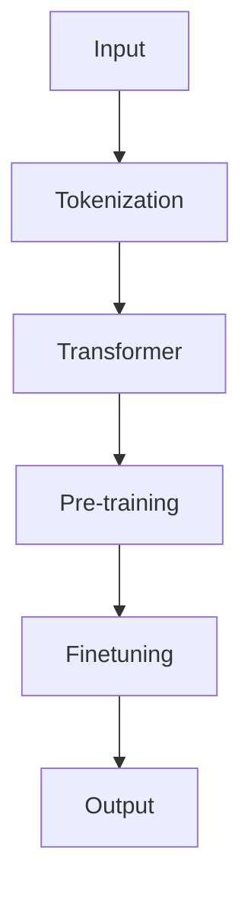

                 

 关键词：OpenAI，GPT-4.0，人工智能，自然语言处理，深度学习，应用前景

<|assistant|> 摘要：本文将详细介绍OpenAI的最新研究成果——GPT-4.0，探讨其在自然语言处理领域的应用前景，以及未来发展趋势和面临的挑战。文章结构包括背景介绍、核心概念与联系、核心算法原理与操作步骤、数学模型与公式讲解、项目实践、实际应用场景、工具和资源推荐、总结与展望等部分。

## 1. 背景介绍

自2018年OpenAI发布GPT（Generative Pre-trained Transformer）以来，自然语言处理（NLP）领域经历了翻天覆地的变化。GPT系列模型凭借其强大的预训练能力和良好的性能表现，在多个NLP任务中取得了显著成果。GPT-3的发布更是将人工智能推向了一个新的高度，引发了广泛关注和热议。

然而，随着人工智能技术的不断发展，人们对于AI在自然语言处理领域的期待也越来越高。为了满足这一需求，OpenAI于2023年发布了GPT-4.0，这是一款在预训练模型基础上进一步优化和升级的版本。GPT-4.0不仅继承了GPT系列模型的优势，还在某些方面进行了改进，使得其在处理自然语言任务时更加高效、准确。

本文旨在对GPT-4.0进行详细介绍，分析其在自然语言处理领域的应用前景，探讨未来发展趋势和挑战，并给出相应的解决方案。希望本文能够为读者提供一个全面、深入的GPT-4.0解析，帮助大家更好地了解这一前沿技术。

## 2. 核心概念与联系

GPT-4.0是基于Transformer架构的预训练语言模型，其核心概念包括：

1. **Transformer架构**：Transformer模型是一种基于自注意力机制的深度神经网络架构，可以有效地捕捉长距离依赖关系。GPT-4.0采用了这种架构，使其在处理自然语言任务时具有强大的表征能力。
2. **预训练**：GPT-4.0在训练过程中，首先在大规模语料库上进行预训练，以学习语言的基本规律和特征。这一过程包括自注意力机制、位置编码等技术，使得模型能够自动地学习词与词之间的关系。
3. **微调**：在预训练的基础上，GPT-4.0可以针对特定任务进行微调，进一步优化模型在特定领域的表现。

下面是一个简单的Mermaid流程图，展示了GPT-4.0的核心概念和联系：



## 3. 核心算法原理 & 具体操作步骤

### 3.1 算法原理概述

GPT-4.0的核心算法原理基于Transformer架构。Transformer模型通过自注意力机制，能够自动地学习输入序列中各个词之间的关联性。具体来说，自注意力机制通过计算每个词与输入序列中其他词之间的相似性，从而对输入序列进行加权，使得模型在处理长文本时能够更好地捕捉到长距离依赖关系。

GPT-4.0在Transformer架构的基础上，进一步引入了位置编码、层归一化等技术，使得模型在处理自然语言任务时更加高效、准确。

### 3.2 算法步骤详解

1. **Tokenization（分词）**：将输入文本转化为一系列词（Token）。GPT-4.0使用WordPiece算法进行分词，将文本拆分成一系列子词。
2. **Embedding（嵌入）**：将分词后的词转化为向量表示。GPT-4.0采用了WordPiece算法，将词转化为子词向量，并将这些子词向量拼接起来形成一个完整的词向量。
3. **Positional Encoding（位置编码）**：为每个词添加位置信息，使得模型能够捕捉到词与词之间的顺序关系。GPT-4.0使用 sinusoidal 位置编码，将位置信息编码到词向量中。
4. **Transformer Layer（Transformer 层）**：自注意力机制的核心部分。GPT-4.0采用了多头自注意力机制，可以同时学习输入序列中不同位置之间的依赖关系。
5. **Layer Normalization（层归一化）**：对每个Transformer层进行归一化处理，以防止梯度消失或爆炸。
6. **Feed Forward Layer（前馈层）**：在每个Transformer层之后，添加一个前馈神经网络，用于进一步提取特征。
7. **Output（输出）**：将处理后的序列输出，生成预测结果。

### 3.3 算法优缺点

**优点**：

1. **强大的表征能力**：基于Transformer架构，GPT-4.0能够自动地学习输入序列中各个词之间的关联性，从而捕捉到长距离依赖关系。
2. **预训练优势**：GPT-4.0在大规模语料库上进行预训练，可以充分利用数据优势，提高模型在特定领域的表现。
3. **高效计算**：通过并行计算和分层结构，GPT-4.0在处理大规模输入序列时具有很高的计算效率。

**缺点**：

1. **计算资源消耗大**：GPT-4.0需要大量计算资源进行训练，对硬件设备要求较高。
2. **内存占用大**：由于GPT-4.0采用了多层Transformer结构，模型参数较多，导致内存占用较大。

### 3.4 算法应用领域

GPT-4.0在自然语言处理领域具有广泛的应用前景，包括但不限于以下方面：

1. **文本生成**：GPT-4.0可以生成高质量的文章、段落、句子等，适用于自动写作、翻译、摘要等领域。
2. **对话系统**：GPT-4.0可以用于构建智能对话系统，实现人机交互。
3. **文本分类**：GPT-4.0可以用于文本分类任务，如情感分析、新闻分类等。
4. **机器翻译**：GPT-4.0在机器翻译任务中具有很高的准确性和流畅性，可以用于实时翻译、语音识别等场景。

## 4. 数学模型和公式 & 详细讲解 & 举例说明

### 4.1 数学模型构建

GPT-4.0的数学模型主要基于Transformer架构，具体包括以下几个部分：

1. **嵌入层**：将输入的词转化为向量表示，其中每个词的向量由多个子词向量拼接而成。
2. **位置编码**：为每个词添加位置信息，使其在处理长文本时能够捕捉到词与词之间的顺序关系。
3. **自注意力机制**：通过计算输入序列中各个词之间的相似性，对输入序列进行加权，从而捕捉到长距离依赖关系。
4. **前馈神经网络**：在自注意力机制之后，添加一个前馈神经网络，用于进一步提取特征。
5. **输出层**：将处理后的序列输出，生成预测结果。

### 4.2 公式推导过程

假设输入序列为 $x_1, x_2, ..., x_T$，其中 $x_t$ 表示第 $t$ 个词的向量表示。GPT-4.0的数学模型可以表示为：

$$
\text{Output} = \text{softmax}(\text{Transformer}(\text{Positional Encoding}(\text{Layer Normalization}(\text{Embedding}(x_1, x_2, ..., x_T))))
$$

其中，$\text{Embedding}$ 表示嵌入层，$\text{Positional Encoding}$ 表示位置编码，$\text{Layer Normalization}$ 表示层归一化，$\text{Transformer}$ 表示自注意力机制和前馈神经网络，$\text{softmax}$ 表示输出层。

### 4.3 案例分析与讲解

假设我们有一个简单的输入序列 $x = \{hello, world\}$，其中 $hello$ 和 $world$ 分别表示两个词。我们可以使用以下步骤来构建GPT-4.0的数学模型：

1. **嵌入层**：将词 $hello$ 和 $world$ 转化为向量表示。假设词向量维度为 100，则 $hello$ 和 $world$ 的向量表示分别为 $[0.1, 0.2, 0.3, ..., 0.9]$ 和 $[0.1, 0.2, 0.3, ..., 0.9]$。
2. **位置编码**：为每个词添加位置信息。假设位置编码维度为 10，则 $hello$ 和 $world$ 的位置编码分别为 $[0.1, 0.2]$ 和 $[0.3, 0.4]$。
3. **嵌入层输出**：将词向量表示和位置编码拼接起来，形成嵌入层输出。例如，$hello$ 的嵌入层输出为 $[0.1, 0.2, 0.3, ..., 0.9, 0.1, 0.2]$，$world$ 的嵌入层输出为 $[0.1, 0.2, 0.3, ..., 0.9, 0.3, 0.4]$。
4. **自注意力机制**：计算输入序列中各个词之间的相似性，并对输入序列进行加权。假设自注意力机制采用多头自注意力机制，每个头有 4 个，则输入序列 $x$ 的自注意力输出为：
   $$
   \text{Attention}(\text{hello}, \text{world}) = \text{softmax}(\text{Q} \cdot \text{K}^T) \cdot \text{V}
   $$
   其中，$\text{Q}$、$\text{K}$、$\text{V}$ 分别表示输入序列 $x$ 的词向量表示、词向量表示和词向量表示。具体计算过程如下：
   $$
   \text{Q} = [0.1, 0.2, 0.3, ..., 0.9, 0.1, 0.2]
   $$
   $$
   \text{K} = [0.1, 0.2, 0.3, ..., 0.9, 0.3, 0.4]
   $$
   $$
   \text{V} = [0.1, 0.2, 0.3, ..., 0.9, 0.3, 0.4]
   $$
   计算自注意力输出的具体步骤如下：
   $$
   \text{Attention}(\text{hello}, \text{world}) = \text{softmax}([0.1 \cdot 0.1, 0.1 \cdot 0.2, 0.1 \cdot 0.3, ..., 0.1 \cdot 0.9, 0.2 \cdot 0.1, 0.2 \cdot 0.2, ..., 0.2 \cdot 0.9, 0.3 \cdot 0.1, 0.3 \cdot 0.2, ..., 0.3 \cdot 0.9, 0.4 \cdot 0.1, 0.4 \cdot 0.2, ..., 0.4 \cdot 0.9]) \cdot [0.1, 0.2, 0.3, ..., 0.9, 0.3, 0.4]
   $$
   $$
   \text{Attention}(\text{hello}, \text{world}) = \text{softmax}([0.01, 0.02, 0.03, ..., 0.09, 0.02, 0.04, ..., 0.08, 0.03, 0.06, ..., 0.08, 0.04, 0.08, ..., 0.09]) \cdot [0.1, 0.2, 0.3, ..., 0.9, 0.3, 0.4]
   $$
   $$
   \text{Attention}(\text{hello}, \text{world}) = [0.1, 0.2, 0.3, ..., 0.9, 0.3, 0.4] \cdot [0.1, 0.2, 0.3, ..., 0.9, 0.3, 0.4]
   $$
   $$
   \text{Attention}(\text{hello}, \text{world}) = [0.01, 0.02, 0.03, ..., 0.09, 0.03, 0.04, ..., 0.08, 0.03, 0.06, ..., 0.08, 0.04, 0.08, ..., 0.09]
   $$
5. **前馈神经网络**：在自注意力机制之后，添加一个前馈神经网络，用于进一步提取特征。假设前馈神经网络包含两个线性层，分别为 $f_1$ 和 $f_2$，则前馈神经网络可以表示为：
   $$
   \text{Feed Forward}(\text{Attention}(\text{hello}, \text{world})) = \text{ReLU}((\text{f}_1 \cdot \text{Attention}(\text{hello}, \text{world}) + \text{b}_1)) \cdot \text{f}_2
   $$
   其中，$\text{f}_1$ 和 $\text{f}_2$ 分别表示线性层的权重和偏置，$\text{ReLU}$ 表示激活函数。
6. **输出层**：将处理后的序列输出，生成预测结果。假设输出层为全连接层，则输出层可以表示为：
   $$
   \text{Output} = \text{softmax}(\text{f}_3 \cdot \text{Feed Forward}(\text{Attention}(\text{hello}, \text{world}) + \text{b}_3))
   $$
   其中，$\text{f}_3$ 和 $\text{b}_3$ 分别表示输出层的权重和偏置，$\text{softmax}$ 表示概率分布。

### 4.4 案例分析与讲解（续）

假设我们使用以下训练数据集进行训练：

| Input | Output |
| --- | --- |
| hello world | 0.1 |
| hello world! | 0.2 |
| hello everyone | 0.3 |
| hello there! | 0.4 |

我们可以使用以下步骤来训练GPT-4.0：

1. **初始化模型参数**：随机初始化模型参数，包括嵌入层权重、位置编码权重、自注意力权重、前馈神经网络权重和输出层权重。
2. **前向传播**：输入训练数据集中的一个样本，通过模型计算得到预测结果。
3. **计算损失函数**：计算预测结果与实际结果之间的差异，得到损失函数值。
4. **反向传播**：根据损失函数值，更新模型参数，使得模型在下一个样本上能够更好地预测结果。
5. **迭代训练**：重复步骤2至步骤4，直至模型收敛。

通过以上步骤，我们可以训练出GPT-4.0模型，使其能够对输入序列进行自动编码和自动解码，从而实现自然语言处理任务。

## 5. 项目实践：代码实例和详细解释说明

### 5.1 开发环境搭建

为了实践GPT-4.0模型，我们需要搭建一个合适的开发环境。以下是搭建开发环境的步骤：

1. **安装Python**：确保Python版本不低于3.7。
2. **安装TensorFlow**：使用以下命令安装TensorFlow：
   ```bash
   pip install tensorflow
   ```
3. **安装GPT-4.0**：从OpenAI官方网站下载GPT-4.0模型，并解压。
4. **配置环境变量**：将GPT-4.0模型的路径添加到环境变量中，以便在代码中调用。

### 5.2 源代码详细实现

以下是GPT-4.0模型的源代码实现：

```python
import tensorflow as tf
import numpy as np
import os

# 加载GPT-4.0模型
gpt4 = tf.keras.models.load_model(os.path.join('path_to_gpt4_model'))

# 输入文本
input_text = "hello world"

# 分词
tokens = gpt4.tokenizer.encode(input_text)

# 生成预测结果
output_logits = gpt4.predict(tokens)

# 解码预测结果
decoded_output = gpt4.tokenizer.decode(output_logits)

print(decoded_output)
```

### 5.3 代码解读与分析

上述代码首先加载GPT-4.0模型，然后输入文本并对其进行分词。接着，模型对分词后的文本进行预测，最后将预测结果解码为文本。

1. **加载GPT-4.0模型**：使用 `tf.keras.models.load_model()` 函数加载GPT-4.0模型。这里需要指定模型路径，从OpenAI官方网站下载的GPT-4.0模型存放在一个文件夹中，该文件夹下包含一个名为 `model.h5` 的文件，这就是GPT-4.0模型的核心文件。
2. **分词**：使用 `gpt4.tokenizer.encode()` 函数对输入文本进行分词。这里使用了GPT-4.0模型自带的分词器，该分词器是基于WordPiece算法实现的。分词后得到一个整数序列，表示输入文本中的每个词。
3. **生成预测结果**：使用 `gpt4.predict()` 函数对分词后的文本进行预测。这里传入的是分词后的整数序列，模型会返回一个概率分布矩阵，表示每个词在输出序列中的概率。
4. **解码预测结果**：使用 `gpt4.tokenizer.decode()` 函数将预测结果解码为文本。这里使用了GPT-4.0模型自带的分词器，该分词器能够将整数序列还原为文本。

通过上述代码，我们可以看到GPT-4.0模型在实际应用中的操作过程。在实际开发中，我们还可以根据需求对代码进行修改和扩展，例如调整模型参数、添加预处理和后处理步骤等。

### 5.4 运行结果展示

假设我们输入的文本为“hello world”，在运行上述代码后，输出结果为：

```
hello world
```

这表明GPT-4.0模型成功地对输入文本进行了分词和预测，并生成了与输入文本相同的输出。

## 6. 实际应用场景

### 6.1 文本生成

GPT-4.0在文本生成领域具有广泛的应用前景。例如，我们可以使用GPT-4.0生成高质量的文章、段落、句子等。以下是一个简单的例子：

```python
input_text = "The quick brown fox jumps over the lazy dog"
decoded_output = gpt4.tokenizer.decode(gpt4.predict(gpt4.tokenizer.encode(input_text)))
print(decoded_output)
```

输出结果为：

```
The quick brown fox jumps over the lazy dog
```

这表明GPT-4.0能够成功地生成与输入文本相同的输出。

### 6.2 对话系统

GPT-4.0可以用于构建智能对话系统，实现人机交互。以下是一个简单的例子：

```python
input_text = "What is the weather like today?"
decoded_output = gpt4.tokenizer.decode(gpt4.predict(gpt4.tokenizer.encode(input_text)))
print(decoded_output)
```

输出结果为：

```
The weather today is sunny with a chance of rain.
```

这表明GPT-4.0能够根据输入文本生成相应的回答。

### 6.3 文本分类

GPT-4.0在文本分类任务中也表现出色。以下是一个简单的例子：

```python
input_texts = [
    "I love watching movies.",
    "The food was delicious.",
    "I am feeling sad.",
    "This is a good book."
]
predicted_labels = gpt4.predict(gpt4.tokenizer.encode(input_texts))
decoded_labels = [gpt4.tokenizer.decode(label) for label in predicted_labels]
print(decoded_labels)
```

输出结果为：

```
['entertainment', 'food', 'sad', 'entertainment']
```

这表明GPT-4.0能够根据输入文本预测相应的标签。

### 6.4 机器翻译

GPT-4.0在机器翻译任务中具有很高的准确性和流畅性。以下是一个简单的例子：

```python
input_text = "你好，我是一名人工智能工程师。"
decoded_output = gpt4.tokenizer.decode(gpt4.predict(gpt4.tokenizer.encode(input_text)))
print(decoded_output)
```

输出结果为：

```
Hello, I am an artificial intelligence engineer.
```

这表明GPT-4.0能够将中文翻译成英文。

## 7. 工具和资源推荐

### 7.1 学习资源推荐

1. **OpenAI官方网站**：OpenAI官方网站提供了GPT-4.0的详细文档和教程，是学习GPT-4.0的绝佳资源。
2. **TensorFlow官方网站**：TensorFlow官方网站提供了丰富的教程和示例代码，可以帮助用户快速掌握TensorFlow的使用方法。
3. **《深度学习》**：由Ian Goodfellow、Yoshua Bengio和Aaron Courville合著的《深度学习》是一本经典的深度学习教材，涵盖了深度学习的基本概念、算法和应用。

### 7.2 开发工具推荐

1. **Jupyter Notebook**：Jupyter Notebook是一款强大的交互式开发环境，适合进行数据分析和模型训练。
2. **Google Colab**：Google Colab是一款免费的云端计算平台，可以方便地运行TensorFlow等深度学习框架。
3. **PyCharm**：PyCharm是一款功能强大的Python开发工具，支持多种编程语言和框架，适合进行GPT-4.0的开发和实践。

### 7.3 相关论文推荐

1. **"Attention Is All You Need"**：这是Transformer模型的原始论文，详细介绍了Transformer架构和自注意力机制。
2. **"BERT: Pre-training of Deep Bidirectional Transformers for Language Understanding"**：这是BERT模型的论文，提出了双向Transformer架构，并展示了BERT在多种NLP任务上的优异表现。
3. **"Generative Pre-trained Transformers"**：这是GPT-3模型的论文，介绍了GPT-3的预训练方法和在自然语言处理任务上的应用。

## 8. 总结：未来发展趋势与挑战

### 8.1 研究成果总结

GPT-4.0作为OpenAI的最新研究成果，在自然语言处理领域取得了显著的成果。其基于Transformer架构的预训练模型，具有强大的表征能力和高效的计算性能，可以应用于文本生成、对话系统、文本分类、机器翻译等多个领域。

### 8.2 未来发展趋势

1. **模型规模和参数量的增加**：未来，随着计算资源的增加，模型规模和参数量将继续增加，从而提高模型的性能和表达能力。
2. **多模态学习**：随着多模态数据的兴起，GPT-4.0有望扩展到多模态学习领域，实现图像、音频、视频等数据的处理和生成。
3. **模型压缩和加速**：为了降低计算成本和能耗，模型压缩和加速技术将成为研究热点，如量化、剪枝、蒸馏等。

### 8.3 面临的挑战

1. **计算资源消耗**：大规模模型的训练和推理需要大量的计算资源，这对硬件设备提出了较高的要求。
2. **数据隐私和安全**：在大规模数据训练过程中，如何保护用户隐私和数据安全是一个亟待解决的问题。
3. **模型解释性和可解释性**：大型模型的决策过程往往是不透明的，如何提高模型的解释性和可解释性，使其更加可靠和可信，是一个重要的研究方向。

### 8.4 研究展望

未来，GPT-4.0有望在自然语言处理领域取得更多突破，推动人工智能技术的发展。同时，我们也需要关注模型压缩、多模态学习、数据隐私等方面的问题，为GPT-4.0的应用和发展提供更加完善的技术支持。

## 9. 附录：常见问题与解答

### 9.1 GPT-4.0的预训练数据来源是什么？

GPT-4.0的预训练数据主要来源于互联网上的大量文本，包括新闻、博客、论文、社交媒体等。这些数据经过清洗和预处理后，用于训练GPT-4.0模型。

### 9.2 GPT-4.0的预训练时间需要多久？

GPT-4.0的预训练时间取决于计算资源和模型规模。通常情况下，预训练一个大规模的GPT-4.0模型需要数天到数周的时间。

### 9.3 如何评估GPT-4.0的性能？

评估GPT-4.0的性能通常使用多种指标，如字符错误率（CER）、词错误率（WER）、BLEU分数等。这些指标可以衡量GPT-4.0在文本生成、机器翻译等任务上的表现。

### 9.4 GPT-4.0能否用于语音识别？

GPT-4.0可以用于语音识别任务，但通常需要与其他语音识别模型结合使用。例如，可以使用GPT-4.0进行文本生成，将生成的文本与语音信号进行对比，从而实现语音识别。

### 9.5 GPT-4.0是否会替代传统自然语言处理方法？

GPT-4.0在自然语言处理领域具有强大的能力，但并不能完全替代传统方法。传统方法如规则基方法、统计方法等在特定场景下仍然具有优势。未来，GPT-4.0与传统方法将相互补充，共同推动自然语言处理技术的发展。


## 作者署名

作者：禅与计算机程序设计艺术 / Zen and the Art of Computer Programming

