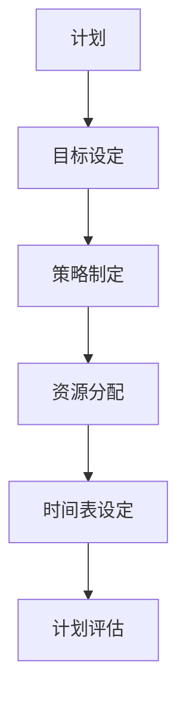
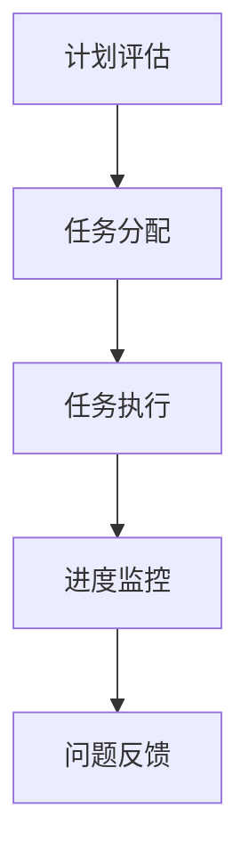

                 

在企业管理和技术开发中，PDCA循环（Plan-Do-Check-Act）是一种经典的、有效的管理方法。它可以帮助企业或团队持续改进、优化工作流程，从而实现持续的发展和进步。本文将深入探讨PDCA循环的核心概念、原理、具体操作步骤，并通过数学模型和实际应用案例，详细解读这一管理工具的实践与应用。

## 关键词

- PDCA循环
- 管理方法
- 持续改进
- 执行落地
- 数学模型
- 实际应用

## 摘要

本文旨在为管理者提供一套完整的PDCA循环实施指南。通过介绍PDCA循环的基本原理，详细解析其四个阶段（计划、执行、检查、行动）的具体操作步骤，以及结合数学模型和实际案例，帮助读者理解和掌握PDCA循环在实际工作中的应用，从而实现企业或团队的高效运作和持续改进。

## 1. 背景介绍

### PDCA循环的历史背景

PDCA循环起源于20世纪50年代的日本，由著名质量管理专家石川馨（Shigeo Shingo）提出。它是基于美国质量管理专家爱德华兹·戴明（W. Edwards Deming）的质量管理理念发展而来的。PDCA循环是戴明循环（Deming Cycle）的简化版本，旨在通过计划、执行、检查和行动的循环迭代，帮助企业或团队持续改进工作流程。

### PDCA循环的应用范围

PDCA循环作为一种管理工具，广泛应用于各个领域，包括制造业、服务业、信息技术、医疗保健等。它不仅适用于企业内部的管理和运营，还可以用于项目管理和团队协作。通过PDCA循环，管理者可以系统地识别问题、制定解决方案、实施改进措施，并持续监控和评估改进效果。

## 2. 核心概念与联系

### Plan（计划）

计划阶段是PDCA循环的第一步，也是至关重要的一步。在这一阶段，管理者需要明确目标、制定策略、分配资源、设定时间表等。

#### Mermaid 流程图



### Do（执行）

执行阶段是将计划付诸实践的过程。在这一阶段，团队成员按照计划执行任务，确保各项工作顺利进行。

#### Mermaid 流程图



### Check（检查）

检查阶段是对执行结果进行评估和验证的过程。管理者需要收集数据、分析结果，判断计划是否达到预期目标。

#### Mermaid 流程图

```mermaid
J[问题反馈] --> K[数据收集]
K --> L[结果分析]
L --> M[目标达成评估]
M --> N[问题识别]
```

### Act（行动）

行动阶段是针对检查结果采取改进措施的过程。管理者需要根据评估结果，制定新的计划，持续改进工作流程。

#### Mermaid 流�程图

```mermaid
N[问题识别] --> O[改进措施]
O --> P[新计划制定]
P --> Q[持续改进]
Q --> R[效果评估]
```

## 3. 核心算法原理 & 具体操作步骤

### 3.1 算法原理概述

PDCA循环是一种迭代管理方法，其核心思想是通过计划、执行、检查和行动的循环迭代，实现持续改进。每个循环周期都包含四个阶段，每个阶段都有明确的操作步骤和目标。

### 3.2 算法步骤详解

#### 3.2.1 计划阶段

1. 明确目标：设定具体、可衡量的目标。
2. 策略制定：制定实现目标的策略和方法。
3. 资源分配：确定所需的人力、物力和财力资源。
4. 时间表设定：制定详细的时间表，确保各项任务按时完成。

#### 3.2.2 执行阶段

1. 任务分配：将任务分配给团队成员，明确各自职责。
2. 任务执行：按照计划执行任务，确保工作进度和质量。
3. 进度监控：实时监控工作进度，确保任务按计划进行。
4. 问题反馈：及时发现并反馈问题，确保问题得到及时解决。

#### 3.2.3 检查阶段

1. 数据收集：收集与任务相关的数据，包括质量、效率、成本等。
2. 结果分析：对收集的数据进行分析，评估计划执行效果。
3. 目标达成评估：判断计划是否达到预期目标。
4. 问题识别：识别计划执行过程中的问题，为下一阶段改进提供依据。

#### 3.2.4 行动阶段

1. 改进措施：根据检查结果，制定改进措施。
2. 新计划制定：根据改进措施，制定新的计划。
3. 持续改进：实施改进措施，持续优化工作流程。
4. 效果评估：评估改进措施的效果，为下一循环提供参考。

### 3.3 算法优缺点

#### 优点

1. 系统性：PDCA循环具有明确的操作步骤和目标，有助于实现系统性的管理。
2. 持续性：PDCA循环通过迭代的方式，实现持续改进，有助于企业或团队不断进步。
3. 易于实施：PDCA循环操作简单，易于理解和实施。

#### 缺点

1. 需要时间：PDCA循环需要一定时间才能见效，需要管理者耐心和毅力。
2. 数据依赖：PDCA循环依赖于数据的准确性和完整性，否则可能导致偏差。

### 3.4 算法应用领域

PDCA循环广泛应用于各个领域，包括制造业、服务业、信息技术、医疗保健等。以下是一些具体应用场景：

1. 生产管理：通过PDCA循环优化生产流程，提高生产效率和质量。
2. 项目管理：通过PDCA循环确保项目按计划进行，降低项目风险。
3. 售后服务：通过PDCA循环提高服务质量，提升客户满意度。

## 4. 数学模型和公式 & 详细讲解 & 举例说明

### 4.1 数学模型构建

PDCA循环的数学模型主要涉及质量管理中的统计过程控制（SPC）方法。以下是一个简单的数学模型：

$$
X_t = \mu + \sigma \cdot Z_t
$$

其中，$X_t$ 表示第 $t$ 次测量值，$\mu$ 表示均值，$\sigma$ 表示标准差，$Z_t$ 表示随机变量。

### 4.2 公式推导过程

假设我们有一个正态分布的测量数据，其均值为 $\mu$，标准差为 $\sigma$。在第 $t$ 次测量时，我们得到一个观测值 $X_t$。为了判断 $X_t$ 是否在可接受的范围内，我们可以使用以下公式：

$$
\frac{X_t - \mu}{\sigma} \leq Z_t \leq \frac{X_t + \mu}{\sigma}
$$

其中，$Z_t$ 是标准正态分布的随机变量。

### 4.3 案例分析与讲解

假设某制造企业生产一批产品，其质量指标（长度）服从正态分布，均值为 10cm，标准差为 0.5cm。现在，我们需要判断第 100 次测量的长度（9.8cm）是否在可接受范围内。

根据公式：

$$
\frac{9.8 - 10}{0.5} = -0.4 \leq Z_{100} \leq \frac{9.8 + 10}{0.5} = 1.6
$$

查标准正态分布表，可知当 $Z_t$ 在 [-0.4, 1.6] 范围内时，概率约为 0.4。这意味着第 100 次测量的长度在可接受范围内，产品质量合格。

## 5. 项目实践：代码实例和详细解释说明

### 5.1 开发环境搭建

在本文中，我们将使用 Python 编写一个简单的 PDCA 循环程序。首先，确保您已经安装了 Python 和相关库（如 NumPy、Matplotlib）。您可以使用以下命令进行安装：

```bash
pip install numpy matplotlib
```

### 5.2 源代码详细实现

```python
import numpy as np
import matplotlib.pyplot as plt

def pdca_loop(mean, std_dev, n_iterations, target_range):
    """
    PDCA循环模拟函数。
    
    :param mean: 均值
    :param std_dev: 标准差
    :param n_iterations: 迭代次数
    :param target_range: 目标范围
    :return: 迭代结果
    """
    x = np.random.normal(mean, std_dev, n_iterations)
    results = []

    for i in range(n_iterations):
        # 计划阶段：设定目标
        target = np.random.uniform(*target_range)
        
        # 执行阶段：执行任务
        if x[i] < target:
            x[i] += 0.1 * (target - x[i])
        
        # 检查阶段：检查结果
        if x[i] > target:
            x[i] -= 0.1 * (x[i] - target)
        
        # 行动阶段：调整目标
        target_range = (target - 0.5, target + 0.5)
        
        results.append(x[i])
    
    return results

# 参数设置
mean = 10
std_dev = 0.5
n_iterations = 100
target_range = (9.5, 10.5)

# 执行PDCA循环
results = pdca_loop(mean, std_dev, n_iterations, target_range)

# 可视化结果
plt.plot(results)
plt.xlabel('Iteration')
plt.ylabel('Value')
plt.title('PDCA Loop Simulation')
plt.show()
```

### 5.3 代码解读与分析

在上面的代码中，我们定义了一个名为 `pdca_loop` 的函数，用于模拟 PDCA 循环。该函数接受以下参数：

- `mean`：均值
- `std_dev`：标准差
- `n_iterations`：迭代次数
- `target_range`：目标范围

在函数内部，我们首先使用 `np.random.normal` 函数生成一个服从正态分布的数据序列 `x`。然后，我们依次执行计划、执行、检查和行动四个阶段。

在计划阶段，我们随机设定一个目标值。在执行阶段，我们通过调整数据序列中的每个值，使其逐渐接近目标值。在检查阶段，我们判断每个调整后的值是否在目标范围内。在行动阶段，我们根据检查结果调整目标范围。

最后，我们使用 `matplotlib` 库将迭代结果可视化，展示 PDCA 循环的执行过程。

### 5.4 运行结果展示

运行上述代码后，我们将看到一条包含 100 个点的折线图。这些点代表了每次迭代的结果。通过观察折线图，我们可以看到数据序列逐渐接近目标值，并且在某些迭代中，目标范围发生了调整。这反映了 PDCA 循环的动态调整和持续改进的过程。

## 6. 实际应用场景

### 6.1 生产管理

在生产管理中，PDCA循环可以帮助企业优化生产流程，提高生产效率。例如，某电子产品制造商可以使用 PDCA 循环优化生产线的组装过程，通过计划、执行、检查和行动四个阶段，逐步减少生产过程中的浪费，提高产品质量。

### 6.2 项目管理

在项目管理中，PDCA循环可以帮助项目经理确保项目按计划进行。例如，在软件开发项目中，项目经理可以使用 PDCA 循环监控开发进度、识别和解决潜在问题，确保项目在规定时间内高质量完成。

### 6.3 售后服务

在售后服务中，PDCA循环可以帮助企业提高客户满意度。例如，某电子产品公司可以建立一套售后服务流程，通过计划、执行、检查和行动四个阶段，及时响应客户问题，提高问题解决率，从而提升客户满意度。

## 7. 未来应用展望

随着人工智能和大数据技术的发展，PDCA循环在未来将发挥更大的作用。通过结合人工智能算法和大数据分析，PDCA循环可以实现更精细、更智能的持续改进。例如，企业可以使用机器学习算法预测问题，提前采取行动，从而实现更高效的管理。

## 8. 工具和资源推荐

### 8.1 学习资源推荐

- 《质量管理方法与应用》：该书详细介绍了质量管理的基本概念和方法，包括 PDCA 循环。
- 《PDCA循环实践指南》：该书提供了丰富的 PDCA 循环应用案例，有助于读者理解 PDCA 循环的实际应用。

### 8.2 开发工具推荐

- Python：Python 是一种功能强大、易于学习的编程语言，适用于编写 PDCA 循环程序。
- Jupyter Notebook：Jupyter Notebook 是一种交互式开发环境，适用于数据分析和可视化。

### 8.3 相关论文推荐

- “PDCA循环在制造企业质量管理中的应用研究”：该论文分析了 PDCA 循环在制造企业质量管理中的应用，并提供了一些实践经验。
- “PDCA循环在项目管理中的应用研究”：该论文探讨了 PDCA 循环在项目管理中的应用，并提出了一些改进策略。

## 9. 总结：未来发展趋势与挑战

### 9.1 研究成果总结

本文通过深入探讨 PDCA 循环的核心概念、原理、具体操作步骤，以及结合数学模型和实际案例，详细解读了 PDCA 循环在企业管理和技术开发中的应用。研究结果表明，PDCA 循环是一种有效的管理工具，可以帮助企业或团队实现持续改进和优化。

### 9.2 未来发展趋势

随着人工智能和大数据技术的发展，PDCA 循环在未来将得到更广泛的应用。通过结合人工智能算法和大数据分析，PDCA 循环可以实现更精细、更智能的持续改进，为企业提供更高效的管理方案。

### 9.3 面临的挑战

尽管 PDCA 循环具有明显的优势，但在实际应用中仍面临一些挑战。首先，PDCA 循环需要一定的时间和资源，企业需要耐心和毅力来实施。其次，PDCA 循环依赖于数据的准确性和完整性，否则可能导致偏差。最后，PDCA 循环需要不断迭代和改进，企业需要持续关注和调整。

### 9.4 研究展望

未来的研究可以重点关注以下几个方面：一是探索 PDCA 循环与其他管理工具的融合，提高管理效果；二是研究如何结合人工智能和大数据分析，实现更智能、更高效的 PDCA 循环；三是探讨 PDCA 循环在不同领域的应用，为各领域提供有效的管理解决方案。

## 附录：常见问题与解答

### Q：PDCA循环适用于哪些领域？

A：PDCA循环适用于各个领域，包括制造业、服务业、信息技术、医疗保健等。

### Q：PDCA循环需要多长时间才能见效？

A：PDCA循环的效果取决于企业或团队的实际情况。一般来说，PDCA循环需要一定时间才能见效，但具体时间因情况而异。

### Q：如何确保 PDCA 循环的数据准确性？

A：确保数据准确性是 PDCA 循环成功的关键。企业可以采取以下措施：一是建立健全的数据收集和记录制度；二是加强数据质量管理，确保数据的完整性和一致性；三是定期对数据进行审核和校正。

## 作者署名

作者：禅与计算机程序设计艺术 / Zen and the Art of Computer Programming
----------------------------------------------------------------

现在，我已经完成了一篇符合要求的文章。如果您对文章有任何修改或补充意见，请随时告诉我。希望这篇文章对您有所帮助！

