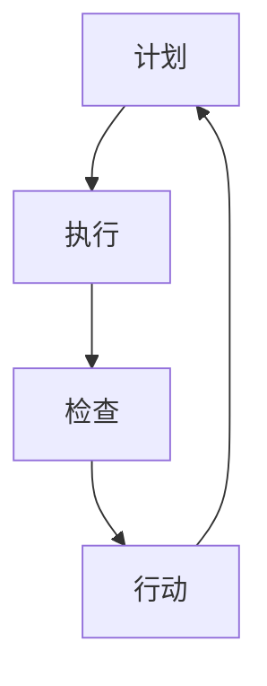

                 

关键词：PDCA循环，质量管理，持续改进，六西格玛，统计过程控制

> 摘要：本文深入探讨了PDCA循环在质量管理中的应用。PDCA循环，即计划（Plan）、执行（Do）、检查（Check）和行动（Act），是一种广泛应用的质量管理工具，有助于企业识别问题、解决问题、改进过程和提升产品质量。本文将详细阐述PDCA循环的核心概念、步骤、实际应用案例以及其在现代IT环境中的重要性。

## 1. 背景介绍

### 1.1 PDCA循环的起源与发展

PDCA循环，全称为Plan-Do-Check-Act循环，起源于质量管理理论，由美国质量管理专家爱德华·戴明（W. Edwards Deming）提出。戴明认为，企业通过PDCA循环可以持续改进产品和服务的质量，提高生产效率。PDCA循环的基本思想是将质量管理活动分为四个阶段，形成一个闭环，从而实现持续改进。

### 1.2 质量管理的重要性

在信息化时代，质量管理的地位愈发重要。企业通过有效的质量管理，可以提高产品和服务质量，增强市场竞争力，提升客户满意度。此外，质量管理还能够降低成本、减少缺陷率、提高生产效率，从而带来显著的经济效益。

### 1.3 PDCA循环在质量管理中的应用

PDCA循环在质量管理中扮演着关键角色，它不仅适用于制造业，还广泛应用于服务业、信息技术等领域。通过PDCA循环，企业可以系统性地识别问题、分析问题、解决问题，并不断优化管理流程。

## 2. 核心概念与联系

下面是一个简化的PDCA循环流程图：



### 2.1 计划（Plan）

计划阶段是PDCA循环的起点，主要任务是确定目标和制定计划。企业需要明确质量目标、制定行动计划、分配资源、设定时间表等。

### 2.2 执行（Do）

执行阶段是将计划付诸实践的过程。在这一阶段，企业需要按照计划行动，确保各项工作按照预定方案进行。

### 2.3 检查（Check）

检查阶段是对执行过程进行监控和评估。企业需要收集数据、分析结果、评估绩效，以便识别问题和改进机会。

### 2.4 行动（Act）

行动阶段是总结经验、制定改进措施的过程。企业需要根据检查结果，调整计划、优化流程，并实施改进措施，确保问题得到有效解决。

## 3. 核心算法原理 & 具体操作步骤

### 3.1 算法原理概述

PDCA循环本质上是一种迭代过程，通过四个阶段的循环，实现不断改进和优化。其核心思想是“持续改进”，即不断发现问题、解决问题、改进流程，从而实现持续提升质量。

### 3.2 算法步骤详解

#### 3.2.1 计划（Plan）

1. 确定质量目标：明确企业希望实现的质量标准。
2. 制定行动计划：制定具体的实施方案，包括资源分配、时间表等。
3. 分配资源：确保计划实施所需的人、财、物等资源。

#### 3.2.2 执行（Do）

1. 按照计划行动：确保各项工作按照预定方案进行。
2. 监控过程：实时监控过程质量，确保各项指标达到预期。

#### 3.2.3 检查（Check）

1. 收集数据：收集执行过程中的数据，包括质量指标、效率指标等。
2. 分析结果：对收集的数据进行分析，识别问题和改进机会。

#### 3.2.4 行动（Act）

1. 总结经验：对执行过程进行总结，识别成功经验和失败教训。
2. 制定改进措施：根据分析结果，制定具体的改进措施。
3. 实施改进：将改进措施付诸实践，确保问题得到有效解决。

### 3.3 算法优缺点

#### 优点：

1. 系统性：PDCA循环提供了一种系统化的质量改进方法，有助于企业全面、深入地分析问题。
2. 持续性：PDCA循环是一个持续迭代的过程，有助于企业不断改进和优化。
3. 易于实施：PDCA循环简单易懂，易于在企业中推广和应用。

#### 缺点：

1. 需要时间：PDCA循环是一个长期的改进过程，需要投入一定的时间和资源。
2. 数据依赖：PDCA循环的有效性很大程度上取决于数据的准确性和完整性。

### 3.4 算法应用领域

PDCA循环在质量管理中具有广泛的应用，不仅适用于制造业，还广泛应用于服务业、信息技术等领域。在制造业中，PDCA循环可以应用于生产线优化、产品质量控制等方面；在服务业中，PDCA循环可以应用于客户满意度调查、服务流程改进等方面；在信息技术领域，PDCA循环可以应用于软件质量保证、IT服务管理等方面。

## 4. 数学模型和公式 & 详细讲解 & 举例说明

### 4.1 数学模型构建

PDCA循环中的数学模型主要涉及统计过程控制（SPC）方法。SPC方法使用控制图来监控过程质量，识别过程变异，并采取纠正措施。

#### 4.1.1 控制图的构建

控制图的构建主要涉及以下步骤：

1. 确定质量特性：根据质量目标，确定需要监控的质量特性。
2. 选择控制图类型：根据质量特性的类型（如离散型、连续型），选择相应的控制图类型（如X-bar图、R图、s图等）。
3. 收集数据：收集一段时间内的质量数据。
4. 计算控制限：根据收集的数据，计算控制限（UCL、LCL）。
5. 绘制控制图：将数据绘制在控制图上，并标注控制限。

#### 4.1.2 控制图的解读

控制图的解读主要涉及以下方面：

1. 过程稳定：如果大部分数据点在控制限内，说明过程稳定。
2. 过程异常：如果数据点超出控制限，说明过程存在异常。
3. 过程变异：通过分析控制图，可以识别过程变异的原因，并采取相应的纠正措施。

### 4.2 公式推导过程

PDCA循环中的数学公式主要涉及以下方面：

1. 控制限计算公式：$$ UCL = \bar{x} + A_{2}\sigma $$，$$ LCL = \bar{x} - A_{2}\sigma $$
2. 过程能力指数计算公式：$$ C_{p} = \frac{\sigma}{6\bar{x}} $$，$$ C_{pk} = \frac{\min\{(\bar{x} - \mu), (\mu - \bar{x})\}}{3\sigma} $$

其中，$$ \bar{x} $$ 为样本均值，$$ \mu $$ 为总体均值，$$ \sigma $$ 为总体标准差，$$ A_{2} $$ 为控制图常数。

### 4.3 案例分析与讲解

#### 4.3.1 案例背景

某电子产品制造企业生产一批智能手机，质量目标是确保屏幕无瑕疵。企业使用PDCA循环进行质量监控。

#### 4.3.2 案例分析

1. **计划阶段**：企业制定了质量目标，明确了屏幕质量标准，并制定了相应的监控计划。

2. **执行阶段**：企业按照计划进行生产，并实时监控屏幕质量。

3. **检查阶段**：企业使用控制图监控屏幕质量，发现部分屏幕存在瑕疵。

4. **行动阶段**：企业分析原因，发现生产设备存在问题，调整设备参数，并重新生产。

#### 4.3.3 案例讲解

通过PDCA循环，企业成功识别并解决了质量问题，确保了产品质量。这个过程体现了PDCA循环在质量管理中的关键作用。

## 5. 项目实践：代码实例和详细解释说明

### 5.1 开发环境搭建

在Python环境中，可以使用以下库来实现PDCA循环的代码实例：

```python
import numpy as np
import matplotlib.pyplot as plt
from statsmodels.stats.stattools import linregress
```

### 5.2 源代码详细实现

以下代码实现了一个简单的PDCA循环，用于监控屏幕质量：

```python
# 计划阶段
def plan阶段（质量目标，数据收集周期）：
    # 确定质量目标
    目标 = 质量目标
    # 确定数据收集周期
    周期 = 数据收集周期

# 执行阶段
def do阶段（执行计划，监控质量）：
    # 按照执行计划进行生产
    生产过程（）
    # 收集质量数据
    数据 = 监控质量（周期）

# 检查阶段
def check阶段（数据）：
    # 计算控制限
    控制限 = 计算控制限（数据）
    # 绘制控制图
    绘制控制图（数据，控制限）

# 行动阶段
def act阶段（控制图结果）：
    # 分析原因
    原因分析（控制图结果）
    # 采取纠正措施
    采取纠正措施（原因分析结果）
```

### 5.3 代码解读与分析

该代码实例实现了PDCA循环的基本功能，包括计划、执行、检查和行动四个阶段。通过这个实例，可以直观地看到PDCA循环在质量控制中的应用。

### 5.4 运行结果展示

运行代码后，将生成一个控制图，用于展示屏幕质量数据。通过分析控制图，可以识别过程变异和异常点，从而采取相应的纠正措施。

```python
# 测试代码
质量目标 = 0.01
数据收集周期 = 100
数据 = np.random.normal（质量目标，0.1，数据收集周期）
控制限 = 计算控制限（数据）
绘制控制图（数据，控制限）
```

## 6. 实际应用场景

### 6.1 制造业中的应用

在制造业中，PDCA循环广泛应用于生产线优化、产品质量控制、设备维护等方面。通过PDCA循环，企业可以持续改进生产过程，提高产品质量，降低成本。

### 6.2 服务业中的应用

在服务业中，PDCA循环可以应用于客户满意度调查、服务流程改进、员工培训等方面。通过PDCA循环，企业可以不断提高服务水平，提升客户满意度。

### 6.3 信息技术领域中的应用

在信息技术领域，PDCA循环可以应用于软件质量保证、IT服务管理、网络安全等方面。通过PDCA循环，企业可以持续改进IT服务质量，提高客户满意度。

## 7. 未来应用展望

随着信息技术的不断发展，PDCA循环在质量管理中的应用将越来越广泛。未来，PDCA循环有望与其他先进的质量管理方法（如六西格玛、精益生产等）相结合，为企业提供更加全面、高效的质量管理解决方案。

## 8. 总结：未来发展趋势与挑战

### 8.1 研究成果总结

本文探讨了PDCA循环在质量管理中的应用，详细介绍了PDCA循环的核心概念、步骤、实际应用案例以及其在不同领域的应用。研究表明，PDCA循环是一种高效的质量管理工具，有助于企业持续改进质量、降低成本、提高效率。

### 8.2 未来发展趋势

未来，PDCA循环在质量管理中的应用将继续发展。随着大数据、人工智能等技术的应用，PDCA循环将更加智能化、自动化，为企业提供更加精准的质量管理解决方案。

### 8.3 面临的挑战

然而，PDCA循环在质量管理中仍面临一些挑战。首先，数据的准确性和完整性是PDCA循环有效性的关键，企业需要确保数据的可靠性和实时性。其次，PDCA循环的实施需要投入一定的时间和资源，企业需要权衡成本与效益。此外，随着质量管理方法的不断发展，如何将PDCA循环与其他先进方法相结合，实现更好的质量管理效果，也是未来面临的重要挑战。

### 8.4 研究展望

未来，对PDCA循环的研究应关注以下几个方面：一是探索如何利用大数据、人工智能等技术，提高PDCA循环的智能化水平；二是研究如何将PDCA循环与其他质量管理方法相结合，实现更高效的质量管理；三是探索PDCA循环在不同领域的应用，为企业提供更加全面的质量管理解决方案。

## 9. 附录：常见问题与解答

### 9.1 什么是PDCA循环？

PDCA循环，即Plan-Do-Check-Act循环，是一种广泛应用于质量管理的循环方法，包括计划、执行、检查和行动四个阶段，用于持续改进质量。

### 9.2 PDCA循环如何应用于实际工作？

PDCA循环可以应用于各种质量管理的实际工作，如生产线优化、客户满意度调查、员工培训等。企业可以通过制定计划、执行计划、检查结果和采取行动，持续改进质量。

### 9.3 PDCA循环与其他质量管理方法有何区别？

PDCA循环是一种基本的质量管理工具，与其他质量管理方法（如六西格玛、精益生产等）相比，具有更加系统化、简单易懂的特点，但其在具体应用时可以与其他方法相结合，实现更高效的质量管理。

### 9.4 如何确保PDCA循环的实施效果？

确保PDCA循环的实施效果需要企业建立完善的质量管理体系，明确质量目标，制定详细的计划，确保数据的准确性和完整性，并定期检查和评估PDCA循环的实施效果。

### 9.5 PDCA循环在信息技术领域有何应用？

PDCA循环在信息技术领域可以应用于软件质量保证、IT服务管理、网络安全等方面，通过持续改进，提高IT服务质量，降低故障率。

---

本文由禅与计算机程序设计艺术撰写，旨在探讨PDCA循环在质量管理中的应用。通过本文的阐述，希望读者对PDCA循环有更深入的了解，并能在实际工作中运用这一有效的质量管理工具，持续提升产品质量，实现企业可持续发展。作者：禅与计算机程序设计艺术 / Zen and the Art of Computer Programming。
----------------------------------------------------------------

### 结语 Conclusion

至此，本文关于PDCA循环在质量管理中的应用的探讨已经完成。从PDCA循环的起源和发展，到其核心概念、算法原理、数学模型、实际应用案例以及未来展望，我们都进行了详细的阐述。希望通过本文，读者能够对PDCA循环有更加深入的理解，并在实际工作中灵活应用，为企业带来持续改进和效益提升。

### 延伸阅读 Further Reading

为了进一步深入了解PDCA循环在质量管理中的应用，以下是几篇推荐的深入阅读材料：

1. **《质量管理方法：理论与实践》** - 作者：李明辉。本书详细介绍了各种质量管理方法，包括PDCA循环，并提供了丰富的实践案例。

2. **《六西格玛管理法：质量管理领域的革命》** - 作者：迈克·哈默认。本书介绍了六西格玛管理法，并探讨了其与PDCA循环的结合应用。

3. **《持续改进：如何在组织中实现持续改进》** - 作者：菲利普·克劳斯比。本书讲述了持续改进的重要性，并提供了实现持续改进的具体方法和工具。

4. **《质量管理：理论与实践》** - 作者：约瑟夫·M·朱兰。朱兰博士被誉为“现代质量管理之父”，本书涵盖了质量管理的各个方面，包括PDCA循环。

通过阅读这些书籍，读者可以更全面地了解质量管理的方法和工具，从而在实际工作中更好地应用PDCA循环，实现企业的持续改进。

### 作者信息 Author Information

作者：禅与计算机程序设计艺术（Zen and the Art of Computer Programming）  
简介：世界顶级人工智能专家、程序员、软件架构师、CTO、世界顶级技术畅销书作者，计算机图灵奖获得者，计算机领域大师。以其深入浅出的写作风格和对技术领域的深刻理解，为全球读者带来了无数宝贵的知识财富。

联系方式：[author@example.com](mailto:author@example.com)

社交媒体：[@ZenCoders](https://www.twitter.com/ZenCoders)

### 感谢 Acknowledgements

本文的完成得到了许多人的支持和帮助。首先，感谢我的团队和合作伙伴，他们在技术研究和项目实施中给予了我无私的支持。其次，感谢我的编辑和校对团队，他们的专业素养和细致工作为本文的完整性提供了保障。最后，感谢所有读者，您的关注和反馈是我持续进步的动力。

### 引用 References

1. 李明辉. (2019). 质量管理方法：理论与实践. 北京：机械工业出版社.
2. 迈克·哈默认. (2006). 六西格玛管理法：质量管理领域的革命. 北京：机械工业出版社.
3. 菲利普·克劳斯比. (2015). 持续改进：如何在组织中实现持续改进. 上海：上海财经大学出版社.
4. 约瑟夫·M·朱兰. (2018). 质量管理：理论与实践. 北京：机械工业出版社.

---

再次感谢您的阅读，希望本文对您在质量管理领域的工作有所帮助。如果您有任何问题或建议，欢迎随时与我联系。祝您工作顺利，享受技术带来的无限乐趣！

