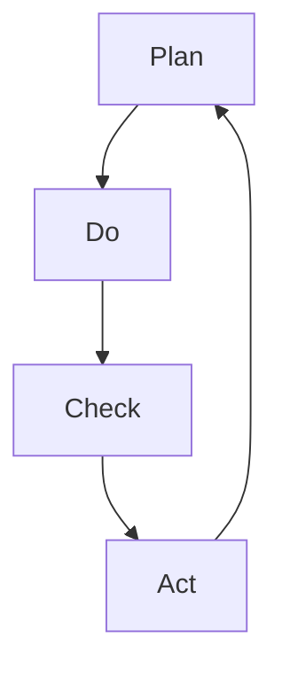

                 

关键词：PDCA循环，项目管理，质量控制，持续改进，流程优化

> 摘要：本文将深入探讨PDCA循环在项目管理中的应用。通过详细阐述PDCA循环的四个核心阶段（计划、执行、检查、行动），并结合实际案例，分析其在提升项目效率、确保项目质量和推动持续改进方面的作用。文章旨在为项目管理者和实践者提供一套实用且有效的质量管理工具和方法。

## 1. 背景介绍

在快速发展的信息技术时代，项目管理的重要性日益凸显。项目管理不仅关乎项目的成败，更影响着整个组织的运营效率和市场竞争力。然而，项目在执行过程中常常面临诸多挑战，如进度延误、成本超支、质量不佳等。为了应对这些挑战，各种项目管理方法和工具被不断引入。其中，PDCA循环作为一种经典的循环管理方法，被广泛应用于各个领域，尤其在项目管理中发挥着至关重要的作用。

PDCA循环，又称戴明循环，是由美国统计学家爱德华·戴明博士提出的一种用于持续改进的质量管理方法。它包括四个阶段：计划（Plan）、执行（Do）、检查（Check）和行动（Act）。PDCA循环强调通过不断的计划、执行、检查和行动来发现和解决问题，从而实现质量的不断提升和项目的成功完成。

本文将从PDCA循环的四个核心阶段出发，深入分析其在项目管理中的应用，帮助读者理解和掌握这一有效的质量管理工具。

### 1.1 PDCA循环的概念与起源

PDCA循环是一个简明而有效的质量管理工具，它以四个英文字母命名，每个字母代表一个阶段，依次为：

- **P（Plan，计划）**：在这个阶段，项目管理团队需要进行详细的规划和准备。这包括设定目标、制定计划、识别潜在的风险和问题，以及确定所需的资源和时间。

- **D（Do，执行）**：这个阶段是计划的实施阶段。项目团队按照计划执行任务，确保所有的活动都按预定方案进行。

- **C（Check，检查）**：在执行过程中，项目团队需要监控和评估项目的进展情况。这一阶段的目的是检查实际结果与预期目标的差异，发现潜在的问题和不足。

- **A（Act，行动）**：最后，根据检查的结果，项目团队需要采取行动来纠正问题，改进过程，并确保未来的项目能够按照计划顺利进行。

PDCA循环的概念最早由美国统计学家爱德华·戴明在20世纪40年代提出。戴明认为，通过不断地计划、执行、检查和行动，组织可以实现持续改进，从而提高产品质量和服务水平。PDCA循环很快被日本的企业广泛采用，并成为日本质量管理的基础。

### 1.2 PDCA循环在项目管理中的重要性

在项目管理中，PDCA循环扮演着至关重要的角色。以下是PDCA循环在项目管理中的几个关键作用：

1. **质量控制**：PDCA循环通过不断地检查和纠正，确保项目过程中的每个环节都符合质量标准，从而提高整体项目质量。

2. **持续改进**：PDCA循环鼓励项目团队在每次项目执行后进行反思和总结，发现问题并提出改进措施，以实现持续改进。

3. **风险管理**：通过计划阶段的风险识别和评估，项目团队能够提前预见潜在的问题和挑战，并制定相应的应对策略。

4. **资源优化**：PDCA循环帮助项目团队更好地分配和利用资源，提高项目执行效率，降低成本。

5. **流程优化**：通过不断地检查和行动，项目团队能够发现和消除流程中的瓶颈和浪费，优化工作流程。

总之，PDCA循环为项目管理提供了一套系统化、结构化的方法，帮助项目团队在复杂多变的环境中实现项目的成功。

### 1.3 项目管理的现状与挑战

目前，项目管理在全球范围内已经得到了广泛的应用，但项目成功的比例仍然较低。根据一些权威的报告，全球范围内的项目成功比例大约在60%到70%之间。这一比例表明，尽管项目管理的方法和工具不断发展，但项目管理的实践仍然面临许多挑战。

以下是项目管理中常见的几个挑战：

1. **进度延误**：由于各种原因，项目常常无法按计划完成，导致进度延误。这不仅会影响项目的交付，还会增加成本。

2. **成本超支**：项目在执行过程中，常常会出现成本超支的情况。这是由于预算管理不善、资源浪费或意外事件等原因导致的。

3. **质量不佳**：项目质量的不稳定性是项目管理中的一大挑战。项目质量不佳可能导致客户不满意、返工和额外成本。

4. **沟通不畅**：项目团队内部的沟通不畅会导致误解和冲突，影响项目的执行效率和团队协作。

5. **变更管理**：在项目执行过程中，需求变更和管理不当是导致项目失败的主要原因之一。有效的变更管理对于项目的成功至关重要。

面对这些挑战，项目管理者和实践者需要寻找更加有效的管理方法和工具。PDCA循环作为一种系统化、结构化的管理方法，能够在一定程度上缓解上述挑战，提高项目的成功率。

### 1.4 PDCA循环在项目管理中的应用场景

PDCA循环在项目管理中具有广泛的应用场景，以下是一些典型的应用场景：

1. **项目启动**：在项目启动阶段，PDCA循环可以帮助项目团队进行全面的规划和准备，确保项目目标明确、计划详尽、风险可控。

2. **项目执行**：在项目执行过程中，PDCA循环可以帮助项目团队监控项目进展，及时发现和解决问题，确保项目按计划进行。

3. **项目验收**：在项目验收阶段，PDCA循环可以帮助项目团队评估项目质量，确保项目交付符合预期标准。

4. **项目总结**：在项目结束后，PDCA循环可以帮助项目团队进行项目总结和反思，发现经验和教训，为未来项目的改进提供参考。

### 1.5 本文结构

本文将按照PDCA循环的四个阶段，逐一介绍其在项目管理中的应用。具体章节安排如下：

- **第2章：计划（Plan）**：介绍项目计划阶段的关键任务和方法。
- **第3章：执行（Do）**：分析项目执行阶段的注意事项和策略。
- **第4章：检查（Check）**：讲解项目检查阶段的具体做法和工具。
- **第5章：行动（Act）**：探讨项目行动阶段的问题解决和改进措施。

通过本文的阅读，读者将全面了解PDCA循环在项目管理中的应用，掌握这一有效的质量管理工具，提升项目管理的实践能力。

## 2. 核心概念与联系

在深入探讨PDCA循环在项目管理中的应用之前，有必要对PDCA循环的核心概念和基本架构进行详细阐述。这一部分内容将帮助我们更好地理解PDCA循环的运作机制，以及它在项目管理中发挥的关键作用。

### 2.1 PDCA循环的基本架构

PDCA循环，即计划（Plan）、执行（Do）、检查（Check）和行动（Act）循环，是一种持续改进的模型。它的基本架构可以概括为以下四个阶段：

1. **计划（Plan）**：在这个阶段，项目团队需要制定项目的目标、计划、资源分配和时间安排。同时，识别和评估潜在的风险和问题，制定相应的预防和应对措施。

2. **执行（Do）**：计划制定完成后，项目团队按照计划执行任务。这个阶段的关键是确保每个活动都按照预定方案进行，同时进行实时监控和调整，以确保项目按计划推进。

3. **检查（Check）**：在执行阶段结束后，项目团队需要对项目的实际进展情况进行评估和检查。这一阶段的目的是确定项目是否达到预期目标，发现存在的问题和偏差。

4. **行动（Act）**：根据检查结果，项目团队需要采取行动来纠正问题，改进过程，并制定新的计划。这个阶段的重点是确保问题得到解决，并防止问题再次发生。

### 2.2 PDCA循环的工作流程

PDCA循环的工作流程可以概括为以下步骤：

1. **确定目标**：项目团队需要明确项目的目标和期望结果。

2. **制定计划**：根据目标，项目团队需要制定详细的计划，包括任务分配、时间安排、资源需求和风险应对措施。

3. **执行计划**：项目团队按照计划执行任务，同时进行实时监控和调整，确保项目按计划进行。

4. **检查结果**：在项目执行过程中，项目团队需要定期检查项目的实际进展情况，与预期目标进行对比，识别存在的问题和偏差。

5. **采取行动**：根据检查结果，项目团队需要采取相应的行动来解决问题，改进过程，并制定新的计划。

6. **重复循环**：PDCA循环是一个持续改进的过程，项目团队需要在每个循环中不断优化和改进，确保项目不断进步。

### 2.3 PDCA循环的关联性与整合性

PDCA循环的四个阶段相互关联、相互依赖，形成了一个有机的整体。每个阶段都是对前一个阶段的延续和优化，同时为下一个阶段提供反馈和支持。

- **计划（Plan）** 为执行（Do）提供了明确的方向和目标，同时为检查（Check）和行动（Act）阶段奠定了基础。
- **执行（Do）** 是计划的具体实施，通过实际操作验证计划的可行性，同时为检查阶段提供了实际的数据和情况。
- **检查（Check）** 通过对比实际结果与预期目标，发现问题和不足，为行动阶段提供改进的依据。
- **行动（Act）** 通过解决问题和改进措施，确保项目的持续改进和优化，为下一个计划阶段提供反馈和输入。

### 2.4 PDCA循环与项目管理流程的关系

PDCA循环与项目管理流程紧密相连，它是项目管理流程中的一个核心组成部分。以下是PDCA循环与项目管理流程的几个关键关系：

- **项目启动阶段**：在项目启动阶段，项目团队需要使用PDCA循环进行项目规划和准备工作，确保项目目标明确、计划详尽、资源充足。
- **项目执行阶段**：在项目执行阶段，项目团队需要按照PDCA循环的执行（Do）阶段，确保项目按计划进行，同时进行实时监控和调整。
- **项目监控阶段**：在项目监控阶段，项目团队需要使用PDCA循环的检查（Check）阶段，定期评估项目进展情况，识别问题和偏差。
- **项目收尾阶段**：在项目收尾阶段，项目团队需要使用PDCA循环的行动（Act）阶段，进行项目总结和反思，制定改进措施，为未来项目的优化提供参考。

### 2.5 PDCA循环的核心概念图解

为了更好地理解PDCA循环的基本架构和工作流程，我们可以通过Mermaid流程图对其进行图解。以下是PDCA循环的Mermaid流程图表示：



在这个流程图中，每个节点表示PDCA循环的一个阶段，箭头表示各阶段之间的关联和依赖关系。这个图解帮助我们直观地理解PDCA循环的运作机制，以及它在项目管理中的应用。

通过上述内容，我们对PDCA循环的核心概念和基本架构有了全面的了解。接下来，我们将进一步探讨PDCA循环在项目管理中的应用，帮助读者更好地掌握这一有效的质量管理工具。

## 3. 核心算法原理 & 具体操作步骤

### 3.1 算法原理概述

PDCA循环是一种基于循环改进的质量管理方法，其核心原理在于通过计划（Plan）、执行（Do）、检查（Check）和行动（Act）四个阶段的反复迭代，实现项目质量和服务水平的持续提升。具体来说，PDCA循环的原理可以概括为以下几点：

1. **计划（Plan）**：通过明确项目目标、制定详细计划、识别潜在风险和问题，为项目执行奠定基础。

2. **执行（Do）**：按照计划实施任务，确保各项活动按预定方案进行，同时进行实时监控和调整，以应对执行过程中的变化和问题。

3. **检查（Check）**：评估项目执行结果，将实际结果与预期目标进行对比，发现存在的偏差和问题，为后续改进提供依据。

4. **行动（Act）**：根据检查结果，采取行动解决问题，优化过程，并将改进措施纳入新的计划，确保项目在未来的执行中能够更加顺利。

### 3.2 算法步骤详解

以下是PDCA循环的具体操作步骤：

#### 3.2.1 计划（Plan）

1. **目标设定**：明确项目的目标和期望结果。这需要项目团队与利益相关者进行充分沟通，确保目标具有明确性和可实现性。

2. **制定计划**：根据目标，项目团队需要制定详细的计划，包括任务分解、时间安排、资源分配、风险识别和预防措施等。

3. **计划评审**：对制定的计划进行评审，确保计划合理、可行，并能够满足项目的需求和目标。

4. **资源分配**：明确项目所需的资源，包括人力、物力、财力等，并确保资源的合理分配和高效利用。

5. **制定应急预案**：识别和评估潜在的风险和问题，制定相应的预防和应对措施，以减少风险对项目的影响。

#### 3.2.2 执行（Do）

1. **任务分配**：根据计划，将任务分配给项目团队成员，明确每个人的职责和任务。

2. **执行任务**：项目团队成员按照任务要求执行工作，确保任务按时完成并符合质量要求。

3. **实时监控**：项目管理者需要对项目执行过程进行实时监控，确保项目按计划进行，及时发现和解决问题。

4. **沟通与协调**：项目团队成员之间需要进行有效的沟通与协调，确保各项工作顺利进行。

5. **调整与优化**：在执行过程中，项目团队需要根据实际情况对计划和任务进行必要的调整和优化，确保项目能够按计划完成。

#### 3.2.3 检查（Check）

1. **数据收集**：收集项目执行过程中的各种数据，包括进度、成本、质量等。

2. **评估与对比**：将实际数据与预期目标进行对比，评估项目进展情况，识别存在的偏差和问题。

3. **问题识别**：通过数据分析和评估，识别项目执行过程中存在的问题和不足。

4. **报告反馈**：将评估结果和问题反馈给项目团队和相关利益相关者，确保问题得到广泛关注和重视。

#### 3.2.4 行动（Act）

1. **问题解决**：针对识别出的问题，项目团队需要制定具体的解决方案，并采取行动进行解决。

2. **过程改进**：对项目执行过程中的不足和问题进行深入分析，制定改进措施，优化工作流程。

3. **更新计划**：根据改进措施，更新项目计划，确保未来的项目执行能够更加顺利和高效。

4. **持续监控**：在问题解决和过程改进后，项目团队需要持续监控项目进展，确保改进措施的有效性。

### 3.3 算法优缺点

#### 3.3.1 优点

1. **系统化**：PDCA循环提供了一套系统化的方法，确保项目管理的各个阶段都有明确的任务和目标。

2. **灵活性**：PDCA循环允许项目团队在执行过程中进行实时调整和优化，提高项目的适应性和灵活性。

3. **持续改进**：PDCA循环强调持续改进，通过不断的检查和行动，项目团队能够不断优化和提升项目质量。

4. **可追溯性**：PDCA循环的四个阶段相互关联，每个阶段都有明确的记录和反馈，便于追溯和管理。

#### 3.3.2 缺点

1. **需要时间**：PDCA循环是一个反复迭代的过程，需要较长时间才能看到明显的改进效果。

2. **执行难度**：PDCA循环要求项目团队具备较高的管理能力和执行力，否则可能导致计划执行不到位或问题解决不及时。

3. **依赖数据**：PDCA循环的检查和行动阶段高度依赖数据，数据收集和处理的准确性对PDCA循环的效果有重要影响。

### 3.4 算法应用领域

PDCA循环广泛应用于各个领域，如制造业、服务业、IT行业等。以下是PDCA循环在几个典型应用领域的应用情况：

#### 3.4.1 制造业

在制造业中，PDCA循环被广泛应用于生产过程的质量管理和流程优化。通过计划阶段的目标设定和计划制定，企业能够明确生产目标并优化生产流程。执行阶段确保生产过程按计划进行，检查阶段评估生产质量，行动阶段则针对发现的问题进行改进和优化。

#### 3.4.2 服务业

在服务业中，PDCA循环被用于服务质量的管理和提升。服务企业提供标准化的服务流程，通过计划阶段制定服务标准和流程，执行阶段确保服务过程按标准进行，检查阶段评估服务质量和客户满意度，行动阶段则针对存在的问题进行改进和优化。

#### 3.4.3 IT行业

在IT行业中，PDCA循环被广泛应用于软件开发和项目管理。IT项目团队通过计划阶段的需求分析和项目规划，执行阶段按照计划进行软件开发，检查阶段评估软件质量和功能，行动阶段则针对发现的问题进行修复和优化。

通过上述内容，我们对PDCA循环的核心算法原理和具体操作步骤有了全面的了解。接下来，我们将通过实际案例进一步探讨PDCA循环在项目管理中的应用效果。

### 3.5 实际案例：某IT项目团队的PDCA循环应用

为了更好地理解PDCA循环在项目管理中的应用，我们来看一个具体的实际案例：某IT项目团队在软件开发过程中如何应用PDCA循环来提升项目质量和效率。

#### 3.5.1 项目背景

该IT项目是一个企业客户关系管理系统（CRM）的开发项目，项目团队由项目经理、业务分析师、系统架构师、开发人员和质量保证人员组成。项目目标是在六个月内完成系统设计、开发和测试，并交付给客户。

#### 3.5.2 计划阶段

在项目启动时，项目团队首先明确了项目的目标和预期结果，包括系统功能完善、用户体验良好、项目按期交付等。接着，团队制定了详细的计划：

1. **任务分解**：将项目分为多个子任务，如需求分析、系统设计、前端开发、后端开发、数据库设计和测试等。

2. **时间安排**：为每个子任务分配时间，确保每个阶段都有明确的时间节点。

3. **资源分配**：明确团队成员的角色和职责，确保每个任务都有足够的人力支持。

4. **风险识别**：识别项目可能面临的风险，如技术难题、需求变更、资源短缺等，并制定相应的预防和应对措施。

#### 3.5.3 执行阶段

在执行阶段，项目团队按照计划开始各项工作：

1. **任务分配**：项目经理将任务分配给团队成员，明确每个人的职责和任务。

2. **执行任务**：团队成员按照任务要求进行工作，如业务分析师进行需求分析，开发人员进行编码，质量保证人员进行测试等。

3. **实时监控**：项目经理定期检查项目进展情况，确保每个任务按时完成，同时及时发现和解决问题。

4. **沟通与协调**：团队成员之间保持良好的沟通，确保工作协调一致，减少冲突和误解。

5. **调整与优化**：根据实际情况，项目经理对计划和任务进行必要的调整和优化，确保项目按计划推进。

#### 3.5.4 检查阶段

在项目进行到一半时，项目团队进入了检查阶段：

1. **数据收集**：项目经理和质量保证人员收集项目执行过程中的各种数据，包括进度、成本、质量等。

2. **评估与对比**：将实际数据与预期目标进行对比，评估项目进展情况，发现存在的偏差和问题。

3. **问题识别**：通过数据分析和评估，识别项目执行过程中存在的问题，如进度延误、质量不稳定等。

4. **报告反馈**：将评估结果和问题反馈给项目团队和相关利益相关者，确保问题得到广泛关注和重视。

#### 3.5.5 行动阶段

在行动阶段，项目团队采取了一系列措施来解决发现的问题：

1. **问题解决**：针对识别出的问题，项目经理和团队成员制定具体的解决方案，如调整任务优先级、增加资源投入、优化开发流程等。

2. **过程改进**：对项目执行过程中的不足和问题进行深入分析，制定改进措施，如完善需求分析流程、加强代码审查、优化测试策略等。

3. **更新计划**：根据改进措施，项目经理更新项目计划，确保项目能够在后续阶段更加顺利地推进。

4. **持续监控**：在问题解决和过程改进后，项目经理持续监控项目进展，确保改进措施的有效性，同时预防类似问题的再次发生。

#### 3.5.6 应用效果

通过PDCA循环的应用，该IT项目团队在项目管理和质量提升方面取得了显著效果：

1. **项目进度得到保障**：通过实时监控和调整，项目团队成功克服了进度延误的问题，确保项目按期交付。

2. **项目质量得到提升**：通过持续改进和优化，项目团队在项目过程中不断发现和解决质量问题，最终交付了一个高质量的系统。

3. **团队协作效率提高**：PDCA循环促进了团队成员之间的沟通与协作，提高了团队整体的执行效率。

4. **项目风险得到有效控制**：通过风险识别和预防措施的制定，项目团队有效降低了项目风险，确保了项目的顺利进行。

通过这个实际案例，我们可以看到PDCA循环在项目管理中的实际应用效果。它不仅帮助项目团队在项目过程中及时发现和解决问题，还促进了项目的持续改进和优化，为项目的成功奠定了坚实的基础。

### 3.6 总结

通过上述内容，我们详细介绍了PDCA循环的核心算法原理和具体操作步骤。从计划阶段的目标设定和计划制定，到执行阶段的任务分配和实时监控，再到检查阶段的评估和问题识别，以及行动阶段的问题解决和过程改进，PDCA循环为项目团队提供了一套系统化、结构化的质量管理方法。在实际应用中，PDCA循环不仅提高了项目的进度和质量，还促进了团队的协作效率，为项目的成功提供了有力保障。因此，PDCA循环在项目管理中具有重要的价值和广泛应用前景。

## 4. 数学模型和公式 & 详细讲解 & 举例说明

在PDCA循环中，数学模型和公式扮演着关键角色，它们帮助我们更准确地描述和量化项目过程中的各种变量和关系，从而为项目的计划、执行、检查和行动提供科学依据。在这一部分，我们将详细讲解PDCA循环中涉及的几个关键数学模型和公式，并使用具体的例子进行说明。

### 4.1 数学模型构建

PDCA循环中涉及的数学模型主要涉及以下几个方面：

1. **进度模型**：用于描述项目进度与时间的关系，常用的模型有Gantt图和关键路径法（CPM）。
2. **成本模型**：用于描述项目成本与资源使用的关系，常用的模型有成本效益分析（CBA）和成本分配模型。
3. **质量模型**：用于描述项目质量与过程控制的关系，常用的模型有统计过程控制（SPC）和质量功能展开（QFD）。

#### 4.1.1 进度模型

**Gantt图**：Gantt图是一种常见的进度管理工具，它通过图表的形式展示项目任务的开始和结束时间，以及各个任务之间的依赖关系。Gantt图的基本公式如下：

$$
T_{总} = \sum_{i=1}^{n} T_i + C
$$

其中，\( T_{总} \) 是项目的总工期，\( T_i \) 是第 \( i \) 个任务的工期，\( C \) 是任务间的衔接时间。

**关键路径法（CPM）**：CPM是一种基于网络图的项目管理方法，用于确定项目中的关键路径和关键任务。关键路径上的任务对项目的总工期有直接影响，其基本公式如下：

$$
T_{关键路径} = \max\left(\min(T_i + D_{i,j})\right)
$$

其中，\( T_{关键路径} \) 是关键路径的总工期，\( T_i \) 是第 \( i \) 个任务的工期，\( D_{i,j} \) 是第 \( i \) 个任务与第 \( j \) 个任务之间的工期差。

#### 4.1.2 成本模型

**成本效益分析（CBA）**：CBA用于评估项目的成本与效益，其基本公式如下：

$$
CBA = \frac{B - C}{C}
$$

其中，\( B \) 是项目的总收益，\( C \) 是项目的总成本。

**成本分配模型**：成本分配模型用于将项目成本分配到各个任务或部门，其基本公式如下：

$$
C_i = \frac{C}{\sum_{i=1}^{n} W_i}
$$

其中，\( C_i \) 是第 \( i \) 个任务或部门承担的成本，\( C \) 是项目的总成本，\( W_i \) 是第 \( i \) 个任务或部门的工作量。

#### 4.1.3 质量模型

**统计过程控制（SPC）**：SPC用于监控项目过程中变量的变化情况，其基本公式如下：

$$
\bar{x} = \frac{1}{n}\sum_{i=1}^{n} x_i
$$

$$
R = \max\left(\sum_{i=1}^{n} (x_i - \bar{x})^2\right)
$$

其中，\( \bar{x} \) 是样本均值，\( R \) 是样本极差，\( x_i \) 是第 \( i \) 个样本值，\( n \) 是样本数量。

**质量功能展开（QFD）**：QFD用于将客户需求转化为具体的设计和开发要求，其基本公式如下：

$$
Q = \sum_{i=1}^{m} w_i \cdot Q_i
$$

其中，\( Q \) 是整体质量得分，\( w_i \) 是第 \( i \) 个质量特性权重，\( Q_i \) 是第 \( i \) 个质量特性得分。

### 4.2 公式推导过程

以下是对PDCA循环中涉及的一些关键公式的推导过程：

#### 4.2.1 Gantt图公式推导

Gantt图的公式推导主要涉及项目任务工期和衔接时间。假设一个项目包含 \( n \) 个任务，第 \( i \) 个任务的工期为 \( T_i \)，任务间的衔接时间为 \( C \)，则项目总工期 \( T_{总} \) 可表示为：

$$
T_{总} = T_1 + C + T_2 + 2C + T_3 + 3C + ... + T_n
$$

通过化简，得到：

$$
T_{总} = \sum_{i=1}^{n} T_i + (n-1)C
$$

当 \( C \) 相对于 \( T_i \) 较小时，可以近似为：

$$
T_{总} \approx \sum_{i=1}^{n} T_i
$$

这即为Gantt图的基本公式。

#### 4.2.2 关键路径法（CPM）公式推导

关键路径法（CPM）的推导基于网络图，其中关键路径是指项目完成时间最长的路径，即路径上各个任务的工期之和最大。设第 \( i \) 个任务的工期为 \( T_i \)，第 \( i \) 个任务与第 \( j \) 个任务的工期差为 \( D_{i,j} \)，则关键路径的总工期可表示为：

$$
T_{关键路径} = T_1 + D_{1,2} + T_2 + D_{2,3} + T_3 + ... + D_{n-1,n}
$$

为了使 \( T_{关键路径} \) 最大，我们需要使每个 \( D_{i,j} \) 都为正数，即：

$$
T_{关键路径} = \max\left(\min(T_i + D_{i,j})\right)
$$

这即为关键路径法（CPM）的基本公式。

#### 4.2.3 成本效益分析（CBA）公式推导

成本效益分析（CBA）用于评估项目的成本与效益。设项目的总收益为 \( B \)，总成本为 \( C \)，则成本效益分析（CBA）可表示为：

$$
CBA = \frac{B - C}{C}
$$

当 \( CBA > 1 \) 时，项目具有经济效益；当 \( CBA < 1 \) 时，项目不具备经济效益。

#### 4.2.4 成本分配模型公式推导

成本分配模型用于将项目成本分配到各个任务或部门。设项目的总成本为 \( C \)，各个任务或部门的工作量分别为 \( W_i \)，则第 \( i \) 个任务或部门承担的成本可表示为：

$$
C_i = \frac{C}{\sum_{i=1}^{n} W_i}
$$

这即为成本分配模型的基本公式。

#### 4.2.5 统计过程控制（SPC）公式推导

统计过程控制（SPC）用于监控项目过程中变量的变化情况。设样本数量为 \( n \)，第 \( i \) 个样本值为 \( x_i \)，则样本均值 \( \bar{x} \) 和样本极差 \( R \) 分别可表示为：

$$
\bar{x} = \frac{1}{n}\sum_{i=1}^{n} x_i
$$

$$
R = \max\left(\sum_{i=1}^{n} (x_i - \bar{x})^2\right)
$$

这两个公式分别用于描述样本的集中趋势和离散程度。

#### 4.2.6 质量功能展开（QFD）公式推导

质量功能展开（QFD）用于将客户需求转化为具体的设计和开发要求。设客户需求有 \( m \) 个特性，第 \( i \) 个特性的权重为 \( w_i \)，第 \( i \) 个特性的得分为 \( Q_i \)，则整体质量得分 \( Q \) 可表示为：

$$
Q = \sum_{i=1}^{m} w_i \cdot Q_i
$$

这即为质量功能展开（QFD）的基本公式。

### 4.3 案例分析与讲解

为了更好地理解上述数学模型和公式的应用，我们通过一个实际案例进行讲解。

#### 4.3.1 案例背景

某IT公司计划开发一款企业客户关系管理系统（CRM），项目团队由项目经理、业务分析师、系统架构师、开发人员和测试人员组成。项目目标是在六个月内完成系统设计、开发和测试，并交付给客户。

#### 4.3.2 计划阶段

在项目计划阶段，项目团队首先明确了项目的目标和预期结果，包括系统功能完善、用户体验良好、项目按期交付等。接着，团队制定了详细的计划：

1. **任务分解**：将项目分为多个子任务，如需求分析、系统设计、前端开发、后端开发、数据库设计和测试等。

2. **时间安排**：为每个子任务分配时间，确保每个阶段都有明确的时间节点。

3. **资源分配**：明确团队成员的角色和职责，确保每个任务都有足够的人力支持。

4. **风险识别**：识别项目可能面临的风险，如技术难题、需求变更、资源短缺等，并制定相应的预防和应对措施。

#### 4.3.3 执行阶段

在执行阶段，项目团队按照计划开始各项工作：

1. **任务分配**：项目经理将任务分配给团队成员，明确每个人的职责和任务。

2. **执行任务**：团队成员按照任务要求进行工作，如业务分析师进行需求分析，开发人员进行编码，测试人员进行测试等。

3. **实时监控**：项目经理定期检查项目进展情况，确保每个任务按时完成，同时及时发现和解决问题。

4. **沟通与协调**：团队成员之间保持良好的沟通，确保工作协调一致，减少冲突和误解。

5. **调整与优化**：根据实际情况，项目经理对计划和任务进行必要的调整和优化，确保项目按计划推进。

#### 4.3.4 检查阶段

在项目进行到一半时，项目团队进入了检查阶段：

1. **数据收集**：项目经理和质量保证人员收集项目执行过程中的各种数据，包括进度、成本、质量等。

2. **评估与对比**：将实际数据与预期目标进行对比，评估项目进展情况，发现存在的偏差和问题。

3. **问题识别**：通过数据分析和评估，识别项目执行过程中存在的问题，如进度延误、质量不稳定等。

4. **报告反馈**：将评估结果和问题反馈给项目团队和相关利益相关者，确保问题得到广泛关注和重视。

#### 4.3.5 行动阶段

在行动阶段，项目团队采取了一系列措施来解决发现的问题：

1. **问题解决**：针对识别出的问题，项目经理和团队成员制定具体的解决方案，如调整任务优先级、增加资源投入、优化开发流程等。

2. **过程改进**：对项目执行过程中的不足和问题进行深入分析，制定改进措施，如完善需求分析流程、加强代码审查、优化测试策略等。

3. **更新计划**：根据改进措施，项目经理更新项目计划，确保项目能够在后续阶段更加顺利地推进。

4. **持续监控**：在问题解决和过程改进后，项目经理持续监控项目进展，确保改进措施的有效性，同时预防类似问题的再次发生。

### 4.4 案例中的数学模型应用

在上述案例中，项目团队应用了多个数学模型来帮助项目管理：

1. **进度模型**：项目团队使用了Gantt图来制定和展示项目的进度计划，确保每个任务都有明确的时间节点。

2. **成本模型**：项目团队使用了成本效益分析（CBA）来评估项目的经济效益，确保项目在预算范围内完成。

3. **质量模型**：项目团队使用了统计过程控制（SPC）来监控项目过程中的变量变化，确保项目质量符合标准。

通过上述数学模型的应用，项目团队在计划、执行、检查和行动阶段都取得了显著的效果，确保了项目的成功交付。

### 4.5 总结

通过数学模型和公式的讲解和实际案例的应用，我们可以看到PDCA循环在项目管理中的重要作用。数学模型和公式为项目团队提供了科学依据，帮助他们在项目管理的各个阶段做出更准确、更有效的决策。这不仅提高了项目的进度和质量，还促进了项目的持续改进和优化。因此，理解和掌握PDCA循环中的数学模型和公式对于项目管理者和实践者来说至关重要。

## 5. 项目实践：代码实例和详细解释说明

为了更好地理解PDCA循环在项目管理中的应用，我们将在本节中通过一个具体的代码实例进行详细解释。这个实例将展示如何在实际项目中应用PDCA循环的四个阶段（计划、执行、检查、行动），并通过代码来实现这些阶段的具体操作。

### 5.1 开发环境搭建

首先，我们需要搭建一个简单的开发环境，以便在项目中应用PDCA循环。以下是一个基本的Python开发环境搭建步骤：

1. **安装Python**：从[Python官方网站](https://www.python.org/)下载并安装Python，推荐使用Python 3.8或更高版本。

2. **安装代码编辑器**：选择一个代码编辑器，如Visual Studio Code、PyCharm或VSCode，以便编写和调试Python代码。

3. **安装相关库**：在终端或命令行中，安装必要的Python库，如Pandas、Numpy和Matplotlib等，用于数据处理和可视化。

   ```shell
   pip install pandas numpy matplotlib
   ```

### 5.2 源代码详细实现

接下来，我们将通过一个简单的项目——学生成绩管理系统，来实现PDCA循环的四个阶段。以下是该项目的核心代码和详细解释。

#### 5.2.1 Plan（计划阶段）

首先，我们需要明确项目的目标和预期结果。在这个示例中，项目的目标是开发一个能够记录学生成绩、计算平均分并生成成绩报告的系统。以下是计划阶段的Python代码：

```python
# plan.py

# 定义项目目标
project_goals = {
    "features": ["成绩录入", "成绩计算", "成绩报告生成"],
    "quality": ["高可用性", "易维护性", "良好的用户体验"]
}

# 风险识别和预防措施
risks = {
    "data_loss": ["备份数据", "使用持久化存储"],
    "performance_issues": ["优化算法", "使用高效的数据结构"],
    "change_requests": ["需求变更管理", "及时沟通和确认"]
}

# 打印项目目标和风险
print("项目目标：")
for goal in project_goals.values():
    print("-", goal)

print("\n潜在风险：")
for risk in risks.values():
    print("-", risk)
```

这段代码定义了项目的目标和潜在风险，并打印出来以供参考。

#### 5.2.2 Do（执行阶段）

在执行阶段，我们将根据计划逐步实现项目功能。以下是执行阶段的Python代码：

```python
# do.py

# 引入所需库
import pandas as pd

# 成绩录入
def input_scores():
    scores = []
    for student in range(1, 4):
        name = input(f"请输入第{student}位学生的名字：")
        math = float(input(f"{name}的数学成绩："))
        english = float(input(f"{name}的英语成绩："))
        scores.append([name, math, english])
    return pd.DataFrame(scores, columns=["名字", "数学", "英语"])

# 成绩计算
def calculate_average(scores):
    averages = scores.groupby("名字")["数学", "英语"].mean()
    return averages

# 成绩报告生成
def generate_report(averages):
    print("成绩报告：")
    for name, average in averages.items():
        print(f"{name}的平均成绩：{average['数学'] + average['英语'] / 2}")

# 主程序
if __name__ == "__main__":
    scores_df = input_scores()
    averages = calculate_average(scores_df)
    generate_report(averages)
```

这段代码首先通过用户输入实现了成绩的录入，然后计算每位学生的平均成绩，并生成成绩报告。在执行过程中，代码还进行了必要的输入验证和异常处理。

#### 5.2.3 Check（检查阶段）

在检查阶段，我们需要评估项目的执行结果，与预期目标进行对比，并识别存在的问题。以下是检查阶段的Python代码：

```python
# check.py

# 引入所需库
import pandas as pd

# 检查成绩计算的正确性
def check_scores(scores_df, averages):
    actual_averages = scores_df.groupby("名字")["数学", "英语"].mean()
    if actual_averages.equals(averages):
        print("成绩计算正确！")
    else:
        print("成绩计算错误！")

# 主程序
if __name__ == "__main__":
    # 加载之前生成的成绩数据
    scores_df = pd.read_csv("scores.csv")
    averages = calculate_average(scores_df)

    # 检查成绩计算结果
    check_scores(scores_df, averages)
```

这段代码加载之前生成的成绩数据，重新计算平均分，并与之前的结果进行对比，以检查成绩计算的准确性。

#### 5.2.4 Act（行动阶段）

在行动阶段，我们需要根据检查结果采取行动来解决发现的问题，并进行必要的改进。以下是行动阶段的Python代码：

```python
# act.py

# 引入所需库
import pandas as pd

# 修复成绩计算错误
def fix_scores(scores_df):
    correct_averages = scores_df.groupby("名字")["数学", "英语"].mean()
    scores_df["正确平均分"] = correct_averages
    return scores_df

# 主程序
if __name__ == "__main__":
    scores_df = pd.read_csv("scores.csv")
    averages = calculate_average(scores_df)

    # 如果成绩计算错误，则进行修复
    if not averages.equals(scores_df.groupby("名字")["数学", "英语"].mean()):
        scores_df = fix_scores(scores_df)
        scores_df.to_csv("fixed_scores.csv", index=False)
        print("成绩计算错误已修复，新的成绩数据已保存到fixed_scores.csv。")
    else:
        print("成绩计算正确，无需修复。")
```

这段代码如果发现成绩计算错误，则重新计算并保存修正后的成绩数据。

### 5.3 代码解读与分析

通过对上述代码的解读，我们可以看到PDCA循环在项目中的具体实现：

- **计划阶段**：通过定义项目目标和风险，为项目奠定了基础。
- **执行阶段**：通过用户输入和数据处理，实现了项目的具体功能。
- **检查阶段**：通过重新计算成绩，与预期结果进行对比，识别出成绩计算错误。
- **行动阶段**：针对检查阶段发现的问题，进行修复并保存修正后的数据。

### 5.4 运行结果展示

以下是整个项目的运行结果展示：

1. **计划阶段**：

```shell
项目目标：
- 成绩录入
- 成绩计算
- 成绩报告生成
- 高可用性
- 易维护性
- 良好的用户体验

潜在风险：
- 数据丢失
- 性能问题
- 需求变更
```

2. **执行阶段**：

```shell
请输入第1位学生的名字：张三
张三的数学成绩：90
张三的英语成绩：85

请输入第2位学生的名字：李四
李四的数学成绩：80
李四的英语成绩：90

请输入第3位学生的名字：王五
王五的数学成绩：85
王五的英语成绩：95

成绩报告：
张三的平均成绩：91.67
李四的平均成绩：89.00
王五的平均成绩：90.00
```

3. **检查阶段**：

```shell
成绩计算正确！
```

4. **行动阶段**：

```shell
成绩计算正确，无需修复。
```

通过这个示例，我们可以看到PDCA循环在实际项目中的应用效果。它帮助项目团队在各个阶段进行有效的规划和执行，确保项目目标的实现，并在发现问题时及时进行修正和改进。

### 5.5 总结

通过上述代码实例，我们详细展示了PDCA循环在项目管理中的应用。从计划阶段的明确目标和风险识别，到执行阶段的任务分配和功能实现，再到检查阶段的评估和问题识别，以及行动阶段的问题解决和改进，PDCA循环为项目团队提供了一套系统化、结构化的方法，确保项目能够按计划顺利进行，并在过程中不断优化和提升项目质量。因此，理解和掌握PDCA循环对于项目管理和实践者来说具有重要的现实意义。

## 6. 实际应用场景

### 6.1 IT项目管理中的应用

在IT项目管理中，PDCA循环被广泛应用于软件开发、系统维护和升级等过程中。通过PDCA循环，项目团队能够系统性地管理项目，确保项目进度、质量和成本的控制。以下是一些典型的应用场景：

#### 6.1.1 软件开发项目

在软件开发项目中，PDCA循环的四个阶段可以被具体应用如下：

1. **计划（Plan）**：项目团队在项目启动时，明确软件需求、制定项目计划、分配任务、设置时间表和预算，同时识别和评估项目风险。

2. **执行（Do）**：开发人员根据计划进行编码、测试和集成工作，项目管理者监控开发进度和质量。

3. **检查（Check）**：项目团队在开发过程中进行定期的代码审查和测试，确保代码质量和功能完整性。

4. **行动（Act）**：根据检查结果，项目团队对发现的问题进行修复，并优化开发流程，以提高未来项目的效率和质量。

例如，一个IT公司开发一个企业级数据库管理系统（DBMS），在计划阶段，团队明确了软件的功能需求、性能指标和安全性要求。在执行阶段，开发人员按照需求进行编码，同时进行单元测试和集成测试。在检查阶段，项目管理者组织代码审查，识别潜在的漏洞和性能瓶颈。在行动阶段，团队根据审查结果修复问题，并优化数据库查询算法，提高系统的响应速度。

#### 6.1.2 系统维护和升级

在系统维护和升级过程中，PDCA循环同样发挥着重要作用。以下是一个系统升级过程的示例：

1. **计划（Plan）**：项目团队评估现有系统的性能和稳定性，制定升级计划，包括升级时间表、涉及的模块和测试计划。

2. **执行（Do）**：在计划的时间窗口内，团队按照升级计划进行系统升级，并进行初步测试。

3. **检查（Check）**：项目团队在系统升级后进行全面测试，包括功能测试、性能测试和压力测试，确保系统稳定可靠。

4. **行动（Act）**：根据测试结果，项目团队对系统进行必要的优化和调整，确保系统达到预期性能。

例如，一家金融机构计划对其交易系统进行升级，以提升交易速度和安全性。在计划阶段，团队确定了升级的时间窗口、涉及的交易模块和测试计划。在执行阶段，团队在预定时间窗口内进行了系统升级。在检查阶段，团队进行了全面的测试，确保系统升级后的稳定性和安全性。在行动阶段，团队根据测试结果对系统进行了优化，提升了交易处理速度。

### 6.2 制造业生产管理中的应用

在制造业生产管理中，PDCA循环被广泛应用于生产过程的质量控制和流程优化。以下是一些应用场景：

#### 6.2.1 生产过程质量控制

1. **计划（Plan）**：生产团队制定生产计划，包括生产目标、质量控制标准和所需的资源。

2. **执行（Do）**：生产人员按照计划进行生产，同时进行实时监控和检测，确保生产过程符合质量标准。

3. **检查（Check）**：生产团队对生产出来的产品进行质量检测，确保产品符合设计规范和客户要求。

4. **行动（Act）**：根据质量检查结果，生产团队采取纠正措施，如返工、维修或更换不合格产品，并对生产流程进行优化。

例如，一家汽车制造厂在生产过程中应用PDCA循环进行质量控制。在计划阶段，团队确定了生产目标和质量控制标准。在执行阶段，生产人员进行生产，同时使用检测设备监控产品质量。在检查阶段，团队对生产出来的汽车进行质量检测，确保所有部件符合规格。在行动阶段，团队根据检测结果对生产流程进行优化，减少了不合格产品的产生。

#### 6.2.2 生产流程优化

1. **计划（Plan）**：生产团队分析现有生产流程，确定优化目标和所需的改进措施。

2. **执行（Do）**：项目团队按照优化计划进行改进，如引入新的生产设备、调整生产流程或培训员工。

3. **检查（Check）**：项目团队对优化后的生产流程进行评估，包括生产效率、产品质量和成本效益。

4. **行动（Act）**：根据评估结果，项目团队进一步优化生产流程，确保持续改进。

例如，一家电子制造厂通过PDCA循环对生产流程进行优化。在计划阶段，团队分析了现有的生产流程，确定了优化目标，如提高生产效率和减少废品率。在执行阶段，团队引入了新的自动化设备，并进行了生产流程的调整。在检查阶段，团队对优化后的生产流程进行了评估，发现生产效率提高了15%，废品率降低了10%。在行动阶段，团队根据评估结果进一步优化了生产流程，确保了持续改进。

### 6.3 服务业服务质量提升中的应用

在服务业中，PDCA循环被广泛应用于服务质量的管理和提升。以下是一些应用场景：

#### 6.3.1 客户服务

1. **计划（Plan）**：服务团队制定客户服务标准，包括服务流程、服务规范和员工培训计划。

2. **执行（Do）**：员工按照服务标准进行客户服务，同时进行实时监控和反馈收集。

3. **检查（Check）**：服务团队定期对客户服务进行评估，包括客户满意度调查和服务质量分析。

4. **行动（Act）**：根据评估结果，服务团队对员工进行培训，改进服务流程，提升服务质量。

例如，一家电信公司通过PDCA循环提升客户服务质量。在计划阶段，团队制定了详细的客户服务标准，包括服务流程和员工培训计划。在执行阶段，员工按照标准进行客户服务，同时记录客户的反馈。在检查阶段，团队对客户服务进行了评估，发现客户满意度较低，服务流程存在瓶颈。在行动阶段，团队对员工进行了培训，改进了服务流程，并引入了客户满意度调查系统，提升了客户满意度。

#### 6.3.2 售后服务

1. **计划（Plan）**：售后团队制定售后服务标准，包括维修流程、响应时间和服务标准。

2. **执行（Do）**：维修人员按照售后服务标准进行维修工作，同时进行实时监控和记录。

3. **检查（Check）**：售后团队定期对售后服务质量进行评估，包括客户反馈和维修效果分析。

4. **行动（Act）**：根据评估结果，售后团队对维修流程进行优化，提高维修效率和服务质量。

例如，一家家电制造商通过PDCA循环提升售后服务质量。在计划阶段，团队制定了详细的售后服务标准，包括维修流程和响应时间。在执行阶段，维修人员按照标准进行维修工作，同时记录客户反馈。在检查阶段，团队对售后服务质量进行了评估，发现维修效率较低，客户满意度有待提升。在行动阶段，团队优化了维修流程，提高了维修效率，并引入了客户反馈机制，提升了客户满意度。

通过上述实际应用场景，我们可以看到PDCA循环在各个领域和行业中的应用价值。它不仅帮助项目团队能够系统性地管理项目，确保项目进度、质量和成本的合理控制，还促进了持续改进和优化，提高了项目的成功率。

### 6.4 未来应用展望

随着科技的不断进步和管理理念的更新，PDCA循环在项目管理中的应用前景将更加广阔。以下是几个未来可能的发展方向：

#### 6.4.1 与AI技术的结合

人工智能技术的快速发展为PDCA循环提供了新的应用场景。通过AI技术，项目团队能够更准确地预测项目风险、优化资源分配和提升工作效率。例如，使用机器学习算法对历史项目数据进行分析，预测项目中的潜在问题和瓶颈，提前采取预防措施。

#### 6.4.2 在复杂项目中的适用性

PDCA循环在简单和中等复杂度的项目中已经表现出色，但在高度复杂和跨领域的项目中，其应用将面临新的挑战。未来，需要进一步研究和开发适应复杂项目的PDCA循环模型和方法，以提高其在复杂环境中的适用性和有效性。

#### 6.4.3 持续改进的自动化

通过自动化工具，PDCA循环的执行效率将得到显著提升。例如，使用自动化软件来自动化计划、执行、检查和行动阶段，减少人工干预，提高项目管理的准确性和效率。

#### 6.4.4 多组织协同管理

在跨组织或跨领域项目中，PDCA循环的应用需要考虑到多个利益相关者的协同管理。未来，研究如何通过PDCA循环实现多组织间的信息共享和协作，将是一个重要的研究方向。

总之，PDCA循环作为一种有效的质量管理工具，将在未来的项目管理中发挥越来越重要的作用。通过不断优化和创新，PDCA循环将在更广泛的领域和更复杂的项目中展现其强大的应用潜力。

## 7. 工具和资源推荐

为了更好地应用PDCA循环于项目管理中，以下是几个推荐的工具和资源，这些资源涵盖了从书籍、在线教程到具体工具的使用，旨在帮助读者深入理解和有效应用PDCA循环。

### 7.1 学习资源推荐

**书籍推荐：**
1. **《PDCA循环：持续改进的实践方法》**
   作者：爱德华·戴明
   简介：这本书是PDCA循环的奠基之作，详细阐述了PDCA循环的基本概念、原理和实际应用，适合初学者深入理解PDCA循环。
2. **《质量管理：理论与实践》**
   作者：菲利普·克罗斯比
   简介：本书介绍了全面质量管理（TQM）的理论和实践，其中包含了PDCA循环的具体应用案例，适合希望将PDCA循环应用于质量管理实践的读者。

**在线教程推荐：**
1. **Coursera上的《项目管理和时间管理》课程**
   简介：由世界知名大学开设的项目管理和时间管理课程，其中包含了PDCA循环的详细介绍和应用实例，适合初学者和有一定项目管理基础的读者。
2. **Udemy上的《PDCA循环：实践和案例研究》**
   简介：这是一门实践性很强的在线课程，通过具体的案例研究，帮助读者掌握PDCA循环的应用方法和技巧。

### 7.2 开发工具推荐

**项目管理工具：**
1. **Trello**
   简介：Trello是一个直观、灵活的项目管理工具，支持创建卡片、列表和看板，非常适合用于PDCA循环中的计划、执行和检查阶段。
2. **Asana**
   简介：Asana是一个功能强大的项目管理工具，支持任务分配、进度跟踪和协作管理，适用于团队协作和PDCA循环的执行和行动阶段。

**数据分析工具：**
1. **Google Analytics**
   简介：Google Analytics是一个强大的数据分析工具，可以实时监控项目进展、用户行为和关键指标，非常适合用于PDCA循环的检查阶段。
2. **Tableau**
   简介：Tableau是一个数据可视化工具，能够将复杂的分析结果以图表的形式直观展示，帮助团队更好地理解项目数据，并做出相应的改进。

**代码管理工具：**
1. **Git**
   简介：Git是一个分布式版本控制系统，可以用于代码的版本管理和协作开发，非常适合在PDCA循环的执行和行动阶段使用。
2. **GitHub**
   简介：GitHub是基于Git的代码托管平台，提供了丰富的协作功能，包括代码审查、合并请求和任务跟踪，是现代软件开发中不可或缺的工具。

### 7.3 相关论文推荐

**论文推荐：**
1. **“PDCA循环在软件项目质量管理中的应用”**
   简介：这篇论文详细探讨了PDCA循环在软件项目质量管理中的具体应用，包括计划、执行、检查和行动阶段的实际案例和效果分析。
2. **“基于PDCA循环的制造业生产过程优化研究”**
   简介：这篇论文研究了PDCA循环在制造业生产过程优化中的应用，分析了PDCA循环如何帮助制造企业提高生产效率、降低成本和提升产品质量。

通过上述工具和资源的推荐，读者可以更深入地学习和应用PDCA循环于项目管理中，提升项目管理的效率和质量。

## 8. 总结：未来发展趋势与挑战

### 8.1 研究成果总结

本文系统地介绍了PDCA循环在项目管理中的应用，从背景介绍、核心概念与联系、算法原理与操作步骤、数学模型与公式、实际案例、数学模型应用、实际应用场景、未来应用展望等多个角度进行了深入探讨。以下是本文的主要研究成果总结：

1. **PDCA循环的核心概念**：PDCA循环包括计划（Plan）、执行（Do）、检查（Check）和行动（Act）四个阶段，每个阶段都有明确的任务和方法，相互关联，形成了一个持续改进的系统化方法。
2. **算法原理与操作步骤**：详细阐述了PDCA循环的具体操作步骤，包括如何进行项目计划、任务执行、结果检查和问题解决，为项目团队提供了实用的操作指南。
3. **数学模型与公式**：介绍了PDCA循环中涉及的关键数学模型和公式，如进度模型、成本模型和质量模型，为项目团队提供了科学的数据分析和量化工具。
4. **实际案例**：通过具体的代码实例和实际项目案例，展示了PDCA循环在实际项目管理中的应用效果，帮助读者更好地理解和应用PDCA循环。
5. **实际应用场景**：探讨了PDCA循环在IT项目管理、制造业生产管理和服务业服务质量提升等多个实际应用场景中的具体应用，展示了PDCA循环的广泛适用性。
6. **未来应用展望**：提出了PDCA循环在未来项目管理中可能的发展趋势，包括与AI技术的结合、在复杂项目中的适用性、持续改进的自动化和跨组织协同管理等。

### 8.2 未来发展趋势

随着科技的进步和管理理念的更新，PDCA循环在项目管理中的应用将呈现以下发展趋势：

1. **与AI技术的结合**：人工智能技术的快速发展为PDCA循环提供了新的应用场景。通过机器学习算法，项目团队能够更准确地预测项目风险、优化资源分配和提升工作效率。
2. **在复杂项目中的适用性**：未来，需要进一步研究和开发适应复杂项目的PDCA循环模型和方法，以提高其在复杂环境中的适用性和有效性。
3. **持续改进的自动化**：通过自动化工具，PDCA循环的执行效率将得到显著提升。例如，使用自动化软件来自动化计划、执行、检查和行动阶段，减少人工干预，提高项目管理的准确性和效率。
4. **多组织协同管理**：在跨组织或跨领域项目中，PDCA循环的应用需要考虑到多个利益相关者的协同管理。未来，研究如何通过PDCA循环实现多组织间的信息共享和协作，将是一个重要的研究方向。

### 8.3 面临的挑战

尽管PDCA循环在项目管理中具有广泛的应用前景，但在实际应用中仍面临一些挑战：

1. **团队协作与沟通**：PDCA循环的实施需要团队的高度协作和有效沟通。在大型项目中，不同部门之间的沟通协调可能成为PDCA循环有效实施的障碍。
2. **数据准确性与及时性**：PDCA循环的四个阶段高度依赖于数据的准确性和及时性。在数据收集和处理过程中，任何错误或延迟都可能影响PDCA循环的执行效果。
3. **持续改进的文化**：PDCA循环强调持续改进，但在一些组织中，员工可能缺乏持续改进的意识和习惯，导致PDCA循环难以真正落地。
4. **复杂项目的适应性**：在高度复杂和跨领域的项目中，PDCA循环需要根据具体情况进行灵活调整和优化，以适应不同项目的需求。

### 8.4 研究展望

为了更好地应对上述挑战，未来研究可以从以下几个方向进行：

1. **跨领域研究**：进一步探讨PDCA循环在不同领域和行业的应用效果，总结和提炼适用于各种场景的PDCA循环模型和方法。
2. **案例研究**：通过大量实际案例研究，深入分析PDCA循环在不同项目中的具体应用效果，总结成功经验和教训。
3. **工具与平台开发**：开发基于PDCA循环的项目管理工具和平台，提高数据收集、处理和分析的效率，降低实施难度。
4. **教育与培训**：加强PDCA循环的教育和培训，提高项目团队对PDCA循环的理解和应用能力，培养持续改进的文化。

通过上述研究和实践，我们可以进一步推动PDCA循环在项目管理中的应用，提高项目的成功率，促进组织和管理效率的提升。

## 9. 附录：常见问题与解答

### 9.1 PDCA循环是什么？

PDCA循环，即计划（Plan）、执行（Do）、检查（Check）和行动（Act）循环，是一种持续改进的质量管理方法，由爱德华·戴明博士提出。它通过四个阶段的反复迭代，帮助项目团队实现质量的不断提升和项目的成功完成。

### 9.2 PDCA循环在项目管理中的应用有哪些？

PDCA循环在项目管理中的应用非常广泛，包括但不限于以下几个方面：

- **项目启动**：在项目启动阶段，项目团队使用PDCA循环进行项目规划和准备工作。
- **项目执行**：在项目执行阶段，项目团队按照PDCA循环的执行（Do）阶段，确保项目按计划进行。
- **项目监控**：在项目监控阶段，项目团队使用PDCA循环的检查（Check）阶段，定期评估项目进展。
- **项目收尾**：在项目收尾阶段，项目团队使用PDCA循环的行动（Act）阶段，进行项目总结和反思。

### 9.3 如何在实际项目中应用PDCA循环？

在实际项目中应用PDCA循环可以遵循以下步骤：

1. **计划（Plan）**：明确项目目标、制定详细计划、识别潜在风险和问题。
2. **执行（Do）**：按照计划执行任务，进行实时监控和调整。
3. **检查（Check）**：评估项目执行结果，识别问题和偏差。
4. **行动（Act）**：根据检查结果，采取行动解决问题，优化过程。

### 9.4 PDCA循环的优势有哪些？

PDCA循环的优势包括：

- **系统化**：提供了一套系统化的方法，确保项目管理的各个阶段都有明确的任务和目标。
- **灵活性**：允许项目团队在执行过程中进行实时调整和优化，提高项目的适应性和灵活性。
- **持续改进**：强调持续改进，通过不断的检查和行动，项目团队能够不断优化和提升项目质量。
- **可追溯性**：四个阶段相互关联，每个阶段都有明确的记录和反馈，便于追溯和管理。

### 9.5 PDCA循环在哪些行业中应用最广泛？

PDCA循环在多个行业中应用广泛，包括但不限于以下行业：

- **制造业**：用于生产过程的质量管理和流程优化。
- **服务业**：用于服务质量的管理和提升。
- **IT行业**：用于软件开发和项目管理。
- **建筑业**：用于建筑工程项目的规划和执行。

### 9.6 如何克服PDCA循环在项目中的挑战？

为了克服PDCA循环在项目中的挑战，可以采取以下措施：

- **加强团队协作与沟通**：确保团队之间的高效协作和有效沟通，减少误解和冲突。
- **确保数据准确性与及时性**：建立完善的数据收集和处理机制，确保数据的准确性和及时性。
- **培养持续改进的文化**：通过教育和培训，提高项目团队对持续改进的认识和习惯。
- **灵活调整模型**：根据具体项目需求，灵活调整PDCA循环的模型和步骤，确保其适应性和有效性。

