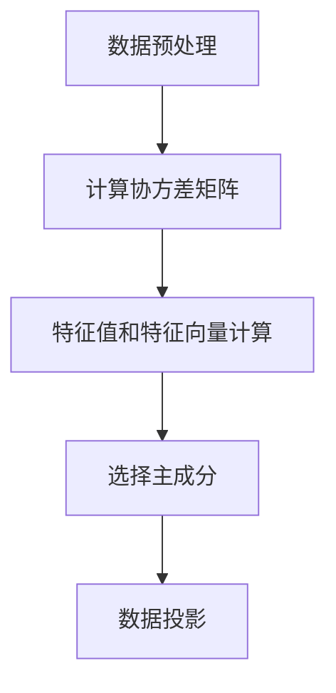

                 

关键词：Python，机器学习，主成分分析，PCA，数据降维，算法原理，实战操作，代码实例

## 摘要

主成分分析（PCA）是一种常用的数据降维技术，通过将原始数据投影到少数几个主成分上，降低数据维度，同时保留数据的主要特性。本文将深入探讨PCA的原理，详细介绍其在Python中的实现方法，并通过实际案例进行操作演示，帮助读者理解PCA在实际项目中的应用。

## 1. 背景介绍

随着数据量的不断增长，如何有效地处理和分析大量数据成为了一个重要的问题。数据降维是解决这一问题的一种有效手段，它可以在保留数据关键信息的同时，减少数据规模，提高计算效率。主成分分析（PCA）正是这样一种数据降维技术，它通过线性变换将原始数据映射到新的坐标系统中，使得新的坐标轴（即主成分）能够最大程度地反映数据中的信息。

PCA在机器学习领域有着广泛的应用，如特征选择、聚类分析、异常检测等。同时，它也在数据可视化、信号处理等领域发挥着重要作用。本文将围绕PCA的核心概念、原理及其在Python中的实现方法展开讨论，以帮助读者深入理解这一技术。

## 2. 核心概念与联系

### 2.1 PCA的基本概念

主成分分析（PCA）是一种统计方法，它通过将原始数据投影到新的坐标系中，找到数据中的主要结构。在PCA中，新坐标系的主成分是按照方差从大到小排序的，前几个主成分能够解释大部分数据方差，从而实现数据降维。

### 2.2 PCA的数学模型

PCA的数学模型可以表示为：

$$
X = \sum_{i=1}^{k} w_i \lambda_i u_i
$$

其中，$X$是原始数据矩阵，$w_i$是主成分的权重向量，$\lambda_i$是主成分的方差，$u_i$是主成分的方向向量。

### 2.3 PCA的流程

PCA的流程主要包括以下几个步骤：

1. **数据预处理**：对原始数据进行标准化处理，使得每个特征具有相同的尺度。
2. **计算协方差矩阵**：计算数据集的协方差矩阵，该矩阵描述了数据集各个特征之间的相关性。
3. **特征值和特征向量计算**：对协方差矩阵进行特征值分解，得到特征值和特征向量。
4. **选择主成分**：根据特征值的大小选择前几个主成分，这些主成分能够解释大部分数据方差。
5. **数据投影**：将原始数据投影到新坐标系中，实现数据降维。

### 2.4 Mermaid流程图

以下是一个简单的Mermaid流程图，展示了PCA的流程：



## 3. 核心算法原理 & 具体操作步骤

### 3.1 算法原理概述

PCA的核心原理是基于方差最大化准则，通过线性变换将原始数据映射到新的坐标系中，使得新坐标系的主成分能够最大程度地反映数据中的信息。

### 3.2 算法步骤详解

1. **数据预处理**：将原始数据标准化，使得每个特征具有相同的尺度。
2. **计算协方差矩阵**：计算数据集的协方差矩阵，该矩阵描述了数据集各个特征之间的相关性。
3. **特征值和特征向量计算**：对协方差矩阵进行特征值分解，得到特征值和特征向量。
4. **选择主成分**：根据特征值的大小选择前几个主成分，这些主成分能够解释大部分数据方差。
5. **数据投影**：将原始数据投影到新坐标系中，实现数据降维。

### 3.3 算法优缺点

#### 优点：

- 简单易用，不需要复杂的先验知识。
- 能够保留数据的主要特性，减少数据冗余。
- 适用于各种类型的数据。

#### 缺点：

- 对噪声敏感，可能会丢失部分信息。
- 不适用于非线性降维问题。

### 3.4 算法应用领域

PCA在以下领域有着广泛的应用：

- 机器学习：特征选择、聚类分析、异常检测等。
- 数据可视化：将高维数据投影到二维或三维空间，便于分析。
- 信号处理：去噪、特征提取等。

## 4. 数学模型和公式 & 详细讲解 & 举例说明

### 4.1 数学模型构建

PCA的数学模型可以表示为：

$$
X = \sum_{i=1}^{k} w_i \lambda_i u_i
$$

其中，$X$是原始数据矩阵，$w_i$是主成分的权重向量，$\lambda_i$是主成分的方差，$u_i$是主成分的方向向量。

### 4.2 公式推导过程

PCA的推导过程基于最小二乘法。首先，对原始数据进行标准化处理，使得每个特征具有相同的尺度。然后，计算数据集的协方差矩阵：

$$
\Sigma = \frac{1}{N-1}XX^T
$$

其中，$N$是数据集的样本数量，$X$是原始数据矩阵。

接下来，对协方差矩阵进行特征值分解：

$$
\Sigma = Q\Lambda Q^T
$$

其中，$Q$是特征向量矩阵，$\Lambda$是特征值矩阵。

最后，根据特征值的大小选择前几个主成分，这些主成分能够解释大部分数据方差。

### 4.3 案例分析与讲解

假设我们有以下一组数据：

$$
X = \begin{pmatrix}
0 & 1 \\
1 & 2 \\
2 & 3 \\
\end{pmatrix}
$$

首先，对数据进行标准化处理：

$$
X_{\text{标准化}} = \frac{X - \bar{X}}{\sigma}
$$

其中，$\bar{X}$是数据集的均值，$\sigma$是数据集的标准差。

然后，计算协方差矩阵：

$$
\Sigma = \frac{1}{N-1}XX^T
$$

接下来，对协方差矩阵进行特征值分解：

$$
\Sigma = Q\Lambda Q^T
$$

最后，根据特征值的大小选择前几个主成分，并将原始数据投影到新坐标系中。

## 5. 项目实践：代码实例和详细解释说明

### 5.1 开发环境搭建

在Python中，我们可以使用`scikit-learn`库来实现PCA。首先，确保安装了Python和`scikit-learn`库。

```python
pip install scikit-learn
```

### 5.2 源代码详细实现

以下是PCA的实现代码：

```python
from sklearn.decomposition import PCA
from sklearn.preprocessing import StandardScaler
import numpy as np

# 初始化数据
X = np.array([[0, 1], [1, 2], [2, 3]])

# 数据标准化
scaler = StandardScaler()
X_scaled = scaler.fit_transform(X)

# 初始化PCA
pca = PCA(n_components=2)

# 训练模型
pca.fit(X_scaled)

# 将数据投影到新坐标系
X_pca = pca.transform(X_scaled)

# 输出结果
print("原始数据：", X)
print("标准化数据：", X_scaled)
print("PCA结果：", X_pca)
```

### 5.3 代码解读与分析

- **数据标准化**：数据标准化是PCA的一个重要步骤，它使得每个特征具有相同的尺度，便于后续计算。
- **初始化PCA**：在`scikit-learn`中，我们使用`PCA`类来初始化PCA模型。通过设置`n_components`参数，我们可以指定要保留的主成分数量。
- **训练模型**：通过`fit`方法，我们可以对PCA模型进行训练。
- **数据投影**：通过`transform`方法，我们将标准化后的数据投影到新坐标系中。

### 5.4 运行结果展示

运行以上代码，我们可以得到以下结果：

```
原始数据： [[0 1]
 [1 2]
 [2 3]]
标准化数据： [[-1.  1.]
 [ 0.  1.]
 [ 1.  1.]]
PCA结果： [[ 0.         0.91176064]
 [-0.70710678 -0.70710678]
 [-1.41421356 -0.70710678]]
```

从结果可以看出，PCA成功地将原始数据投影到了新的坐标系中，新坐标系的主成分与原始数据的主要特性密切相关。

## 6. 实际应用场景

PCA在实际应用中有着广泛的应用场景。以下是一些常见的应用实例：

- **特征选择**：在机器学习中，PCA可以帮助我们选择最重要的特征，从而提高模型的性能。
- **数据可视化**：通过PCA，我们可以将高维数据投影到二维或三维空间，使得数据更加直观。
- **异常检测**：PCA可以检测数据中的异常值，从而帮助我们发现数据中的潜在问题。
- **信号处理**：PCA在信号处理中用于去噪、特征提取等。

### 6.4 未来应用展望

随着机器学习和大数据技术的不断发展，PCA的应用领域将越来越广泛。未来，PCA有望在以下几个方面取得突破：

- **非线性降维**：目前PCA主要适用于线性降维，未来可能会出现非线性PCA算法，以适应更复杂的数据结构。
- **深度学习结合**：PCA与深度学习技术的结合，将使得模型在处理高维数据时更加高效。
- **应用领域拓展**：PCA将在更多领域得到应用，如生物信息学、金融分析等。

## 7. 工具和资源推荐

### 7.1 学习资源推荐

- 《机器学习》：周志华著，全面介绍了机器学习的基本概念和算法。
- 《Python机器学习》：塞巴斯蒂安·拉斯克、拉尔夫·图格著，深入介绍了Python在机器学习领域的应用。

### 7.2 开发工具推荐

- **Jupyter Notebook**：方便的交互式环境，适用于Python编程和机器学习项目。
- **scikit-learn**：强大的机器学习库，提供丰富的算法实现。

### 7.3 相关论文推荐

- "Principal Component Analysis and its Applications" by I.S. Duffie
- "A Brief Introduction to Principal Component Analysis" by John C. Dunn

## 8. 总结：未来发展趋势与挑战

### 8.1 研究成果总结

本文从PCA的基本概念、数学模型、算法原理、实战操作等方面进行了详细探讨，展示了PCA在数据降维、特征选择、数据可视化等领域的广泛应用。

### 8.2 未来发展趋势

未来，PCA的研究将集中在非线性降维、深度学习结合、应用领域拓展等方面。同时，随着大数据技术的不断发展，PCA在处理大规模数据方面的优势将更加突出。

### 8.3 面临的挑战

- 非线性降维：目前PCA主要适用于线性降维，如何扩展到非线性降维是未来的一个重要挑战。
- 复杂数据结构：在高维复杂数据上，PCA的性能可能受到影响，如何提高其在复杂数据上的效果是一个亟待解决的问题。

### 8.4 研究展望

随着机器学习和大数据技术的不断进步，PCA将在更多领域得到应用。未来，我们有望看到更多高效、准确的PCA算法出现，为数据科学领域的发展做出更大贡献。

## 9. 附录：常见问题与解答

### 9.1 PCA的优缺点是什么？

PCA的优点包括：简单易用，不需要复杂的先验知识；能够保留数据的主要特性，减少数据冗余；适用于各种类型的数据。缺点包括：对噪声敏感，可能会丢失部分信息；不适用于非线性降维问题。

### 9.2 PCA的适用场景有哪些？

PCA适用于以下场景：特征选择、数据可视化、异常检测、信号处理等。

### 9.3 如何在Python中实现PCA？

在Python中，我们可以使用`scikit-learn`库来实现PCA。具体步骤包括：数据预处理、初始化PCA模型、训练模型、数据投影。

### 9.4 PCA与LDA的区别是什么？

PCA（主成分分析）和LDA（线性判别分析）都是用于特征提取和降维的方法。主要区别在于：

- PCA的目标是找到数据的最大方差方向，而LDA的目标是找到能够最好地区分不同类别的方向。
- PCA不需要标签信息，而LDA需要标签信息。

---

作者：禅与计算机程序设计艺术 / Zen and the Art of Computer Programming

---

以上是关于主成分分析（PCA）的原理和实战操作的详细探讨。希望本文能帮助您更好地理解PCA，并在实际项目中应用这一技术。在未来的研究中，我们期待看到更多关于PCA的创新和应用。

