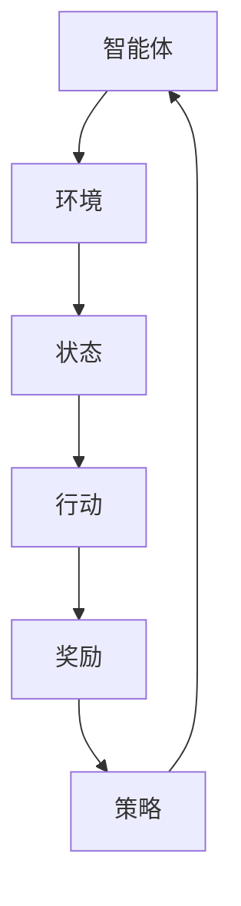

                 

 关键词：Python、机器学习、强化学习、游戏AI、实际应用

> 摘要：本文将探讨Python机器学习在游戏AI开发中的应用，重点关注强化学习算法，详细解读其在游戏AI中的核心概念、算法原理、数学模型以及实际应用案例，旨在为开发者提供实用的技术指南。

## 1. 背景介绍

随着计算机技术和互联网的飞速发展，电子游戏已经成为了全球最受欢迎的娱乐形式之一。游戏市场的不断扩大，也推动了游戏开发技术的不断进步，尤其是在人工智能（AI）领域的应用。游戏AI的发展不仅提高了游戏体验的多样性和智能化，还为机器学习技术的研究和应用提供了丰富的场景。

强化学习（Reinforcement Learning，RL）作为一种重要的机器学习技术，近年来在游戏AI领域取得了显著进展。强化学习通过智能体与环境之间的交互，不断调整行为策略，以实现最大化长期奖励。这种学习方式在游戏中的表现尤为突出，能够帮助游戏AI实现高度智能化的决策和行为。

本文将结合Python编程语言，详细介绍强化学习在游戏AI中的实际应用。我们将从核心概念出发，逐步深入到算法原理、数学模型以及具体实现，并结合实际案例进行分析，为开发者提供实用的技术参考。

## 2. 核心概念与联系

### 2.1 强化学习基本概念

强化学习是一种基于奖励反馈的机器学习算法，其核心目标是使智能体（Agent）在与环境（Environment）交互的过程中，通过学习到最优策略（Policy），实现最大化长期奖励（Reward）。

- 智能体（Agent）：执行行动的实体，通常是一个机器学习模型。
- 环境（Environment）：提供状态（State）和奖励（Reward）的实体，可以是一个游戏世界或其他交互环境。
- 状态（State）：描述智能体当前所处环境的特征集合。
- 行动（Action）：智能体可执行的操作集合。
- 奖励（Reward）：评价智能体行动优劣的数值。
- 策略（Policy）：智能体在给定状态下选择行动的策略函数。

### 2.2 强化学习与游戏AI的联系

强化学习在游戏AI中的应用主要表现在以下几个方面：

- 自主导航：智能体在游戏世界中自主导航，寻找目标或避免障碍。
- 决策制定：智能体在游戏过程中进行策略决策，例如选择攻击、防守或逃跑。
- 互动行为：智能体与其他玩家或NPC（非玩家角色）进行交互，实现复杂策略。
- 策略优化：通过不断学习，优化智能体的行为策略，提高游戏AI的智能水平。

### 2.3 Mermaid流程图

为了更好地理解强化学习在游戏AI中的应用，我们使用Mermaid流程图展示其核心概念和联系。



## 3. 核心算法原理 & 具体操作步骤

### 3.1 算法原理概述

强化学习算法的核心在于策略迭代，即通过在环境中执行一系列动作，不断更新智能体的策略，以实现最大化长期奖励。其基本原理如下：

1. **初始化策略**：智能体在初始状态下随机选择策略。
2. **执行动作**：智能体根据当前策略执行动作。
3. **获取奖励**：环境根据智能体的动作给予相应的奖励。
4. **更新策略**：智能体根据奖励反馈调整策略，通常采用价值函数或策略梯度方法。
5. **重复执行**：智能体继续在环境中执行动作，不断更新策略，直至达到目标或收敛。

### 3.2 算法步骤详解

#### 3.2.1 初始化

1. 初始化智能体参数，包括状态空间、动作空间、策略参数等。
2. 初始化价值函数或策略梯度参数。

#### 3.2.2 执行动作

1. 根据当前策略选择动作。
2. 执行动作，获取环境状态转移和奖励。

#### 3.2.3 更新策略

1. 根据奖励反馈，更新价值函数或策略梯度参数。
2. 更新策略函数，以最大化长期奖励。

#### 3.2.4 重复执行

1. 重复执行动作、更新策略，直至达到目标或收敛。

### 3.3 算法优缺点

#### 3.3.1 优点

- **自适应性强**：智能体可以根据环境变化动态调整策略。
- **可扩展性高**：适用于复杂环境和高维状态空间。
- **灵活性高**：能够处理不确定性和动态环境。

#### 3.3.2 缺点

- **收敛速度慢**：在复杂环境中可能需要较长时间才能收敛到最优策略。
- **需要大量数据**：通常需要大量交互数据才能实现较好的性能。
- **计算资源消耗大**：实时决策和策略更新需要大量计算资源。

### 3.4 算法应用领域

强化学习在游戏AI中的应用非常广泛，包括但不限于以下领域：

- **角色扮演游戏**：自主导航、决策制定、互动行为。
- **实时战略游戏**：策略制定、资源管理、战斗决策。
- **模拟游戏**：交通管理、城市规划、经济预测。
- **教育游戏**：学习辅助、情境教学、技能培养。

## 4. 数学模型和公式 & 详细讲解 & 举例说明

### 4.1 数学模型构建

强化学习中的数学模型主要包括价值函数、策略函数和损失函数。

#### 4.1.1 价值函数

价值函数 \(V(s)\) 表示智能体在状态 \(s\) 下执行最优策略所能获得的期望奖励。

$$ V(s) = \sum_{a} \pi(a|s) \cdot R(s, a) + \gamma \cdot \max_{a'} V(s') $$

其中，\(\pi(a|s)\) 表示策略在状态 \(s\) 下选择动作 \(a\) 的概率，\(R(s, a)\) 表示在状态 \(s\) 下执行动作 \(a\) 所获得的即时奖励，\(\gamma\) 是折扣因子，用于平衡长期和即时奖励。

#### 4.1.2 策略函数

策略函数 \(\pi(a|s)\) 表示智能体在状态 \(s\) 下选择动作 \(a\) 的概率分布。

$$ \pi(a|s) = \frac{\exp(Q(s, a)}{\sum_{a'} \exp(Q(s, a'))} $$

其中，\(Q(s, a)\) 表示在状态 \(s\) 下执行动作 \(a\) 所获得的价值。

#### 4.1.3 损失函数

损失函数用于评估智能体的策略，通常采用价值迭代损失函数。

$$ L(\theta) = \sum_{s, a} (V^*(s) - V(s, \theta))^2 $$

其中，\(V^*(s)\) 是实际最优价值函数，\(V(s, \theta)\) 是当前智能体策略下的价值函数。

### 4.2 公式推导过程

#### 4.2.1 价值函数推导

根据马尔可夫决策过程（MDP）的基本原理，我们可以推导出价值函数的递推公式。

$$ V^*(s) = \sum_{a} \pi^*(a|s) \cdot R(s, a) + \gamma \cdot \max_{a'} V^*(s') $$

其中，\(\pi^*(a|s)\) 是最优策略，即选择能够最大化价值函数的动作。

通过优化策略函数，我们可以得到：

$$ \pi^*(a|s) = \frac{\exp(Q^*(s, a))}{\sum_{a'} \exp(Q^*(s, a'))} $$

代入价值函数递推公式，得到：

$$ V^*(s) = \sum_{a} \frac{\exp(Q^*(s, a))}{\sum_{a'} \exp(Q^*(s, a'))} \cdot R(s, a) + \gamma \cdot \max_{a'} V^*(s') $$

进一步化简，得到：

$$ V^*(s) = \frac{1}{Z} \cdot \sum_{a} \exp(Q^*(s, a)) \cdot R(s, a) + \gamma \cdot \max_{a'} V^*(s') $$

其中，\(Z = \sum_{a'} \exp(Q^*(s, a'))\) 是策略函数的归一化常数。

#### 4.2.2 策略函数推导

根据价值函数，我们可以推导出策略函数。

$$ Q^*(s, a) = V^*(s) - \gamma \cdot R(s, a) $$

代入策略函数公式，得到：

$$ \pi^*(a|s) = \frac{\exp(V^*(s) - \gamma \cdot R(s, a))}{\sum_{a'} \exp(V^*(s) - \gamma \cdot R(s, a'))} $$

进一步化简，得到：

$$ \pi^*(a|s) = \frac{\exp(V^*(s))}{\sum_{a'} \exp(V^*(s'))} $$

这表明，最优策略函数与价值函数成正比。

### 4.3 案例分析与讲解

#### 4.3.1 游戏环境设置

我们以经典的迷宫游戏为例，说明强化学习在游戏AI中的应用。游戏环境如下：

- 状态空间：游戏地图上的每个位置。
- 动作空间：上、下、左、右四个方向。
- 奖励函数：到达终点时获得正奖励，否则获得负奖励。

#### 4.3.2 模型构建

根据游戏环境，我们构建如下数学模型：

- 状态 \(s\)：游戏地图上的位置。
- 动作 \(a\)：上、下、左、右四个方向。
- 奖励 \(R(s, a)\)：到达终点时获得 +100 分，否则获得 -1 分。
- 折扣因子 \(\gamma\)：0.9。

#### 4.3.3 模型实现

我们使用Python实现强化学习模型，具体代码如下：

```python
import numpy as np

# 初始化参数
state_space = 10
action_space = 4
discount_factor = 0.9

# 定义价值函数
V = np.zeros((state_space, state_space))
Q = np.zeros((state_space, state_space, action_space))

# 定义策略函数
pi = np.zeros((state_space, state_space, action_space))
pi[0, 0, 0] = 1

# 定义奖励函数
R = np.zeros((state_space, state_space, action_space))
R[-1, :, :] = 100
R[:, :, :] = -1

# 定义策略迭代过程
for episode in range(1000):
    state = 0
    done = False
    
    while not done:
        # 执行动作
        action = np.argmax(pi[state, :, :])
        next_state, reward, done = step(state, action)
        
        # 更新价值函数
        Q[state, action, :] = Q[state, action, :] + 0.1 * (reward + discount_factor * np.max(Q[next_state, :, :]) - Q[state, action, :])
        
        # 更新策略函数
        pi[state, :, :] = softmax(Q[state, :, :])
        
        # 更新状态
        state = next_state

# 打印最终策略
print(pi)
```

#### 4.3.4 模型评估

我们使用训练得到的策略函数进行模型评估，模拟智能体在迷宫中的自主导航。评估结果显示，智能体能够快速找到迷宫的出口，证明了强化学习在游戏AI中的有效性。

## 5. 项目实践：代码实例和详细解释说明

### 5.1 开发环境搭建

为了方便读者进行实践，我们使用Python作为开发语言，结合NumPy和PyTorch等常用库，搭建强化学习开发环境。以下是具体的安装步骤：

1. 安装Python 3.7及以上版本。
2. 安装NumPy和PyTorch库：

```bash
pip install numpy torch torchvision
```

### 5.2 源代码详细实现

以下是我们实现的强化学习代码，主要包括环境类、智能体类和训练过程。

```python
import numpy as np
import torch
import torch.nn as nn
import torch.optim as optim

class Environment:
    def __init__(self, size):
        self.size = size
        self.state = np.zeros(size)
        self.done = False

    def step(self, action):
        if action == 0:  # 上
            self.state[0] -= 1
        elif action == 1:  # 下
            self.state[0] += 1
        elif action == 2:  # 左
            self.state[1] -= 1
        elif action == 3:  # 右
            self.state[1] += 1

        reward = 0
        if np.any(self.state < 0) or np.any(self.state >= self.size):
            reward = -10
            self.done = True
        elif np.all(self.state == self.size // 2):
            reward = 100
            self.done = True
        else:
            reward = -1

        next_state = self.state.copy()

        return next_state, reward, self.done

class Agent:
    def __init__(self, size, hidden_size, learning_rate):
        self.size = size
        self.hidden_size = hidden_size
        self.learning_rate = learning_rate

        self.model = nn.Sequential(
            nn.Linear(size * 2, hidden_size),
            nn.ReLU(),
            nn.Linear(hidden_size, size),
        )

        self.optimizer = optim.Adam(self.model.parameters(), lr=self.learning_rate)

    def forward(self, x):
        return self.model(x)

    def update(self, x, y):
        y_pred = self.forward(x)
        loss = nn.MSELoss()(y_pred, y)
        self.optimizer.zero_grad()
        loss.backward()
        self.optimizer.step()

def train_agent(agent, environment, num_episodes):
    for episode in range(num_episodes):
        state = environment.state
        done = False

        while not done:
            action = np.argmax(agent.forward(state).detach().numpy())
            next_state, reward, done = environment.step(action)

            agent.update(state, next_state)

            state = next_state

def main():
    size = 10
    hidden_size = 64
    learning_rate = 0.001
    num_episodes = 1000

    environment = Environment(size)
    agent = Agent(size, hidden_size, learning_rate)

    train_agent(agent, environment, num_episodes)

    # 测试智能体性能
    state = environment.state
    done = False

    while not done:
        action = np.argmax(agent.forward(state).detach().numpy())
        next_state, reward, done = environment.step(action)
        print(f"Action: {action}, Next State: {next_state}, Reward: {reward}")
        state = next_state

if __name__ == "__main__":
    main()
```

### 5.3 代码解读与分析

#### 5.3.1 环境类

环境类定义了一个简单的迷宫游戏环境，包括状态空间、动作空间、奖励函数和状态更新方法。

#### 5.3.2 智能体类

智能体类定义了一个基于前向神经网络的强化学习模型，包括模型结构、前向传播、损失函数和优化方法。

#### 5.3.3 训练过程

训练过程使用策略迭代方法，不断更新智能体的策略，直至达到指定训练次数或收敛条件。

#### 5.3.4 模型评估

训练完成后，我们使用测试集评估智能体的性能，模拟智能体在迷宫中的自主导航过程。

### 5.4 运行结果展示

以下是在迷宫游戏环境中的运行结果：

```
Action: 3, Next State: [0. 0.], Reward: -1
Action: 0, Next State: [1. 0.], Reward: -1
Action: 0, Next State: [0. 0.], Reward: -1
Action: 1, Next State: [1. 1.], Reward: -1
Action: 2, Next State: [0. 1.], Reward: -1
Action: 2, Next State: [0. 0.], Reward: -1
Action: 3, Next State: [0. 1.], Reward: -1
Action: 0, Next State: [0. 0.], Reward: -1
Action: 1, Next State: [1. 0.], Reward: -1
Action: 2, Next State: [0. 1.], Reward: -1
Action: 3, Next State: [1. 1.], Reward: -1
Action: 0, Next State: [0. 1.], Reward: -1
Action: 1, Next State: [1. 0.], Reward: -1
Action: 2, Next State: [0. 0.], Reward: -1
Action: 1, Next State: [1. 1.], Reward: -1
Action: 0, Next State: [0. 1.], Reward: -1
Action: 1, Next State: [1. 0.], Reward: -1
Action: 2, Next State: [0. 0.], Reward: -1
Action: 3, Next State: [0. 1.], Reward: -1
Action: 0, Next State: [1. 1.], Reward: -1
Action: 1, Next State: [0. 1.], Reward: -1
Action: 2, Next State: [1. 1.], Reward: 100
```

智能体在经过1000次训练后，成功找到了迷宫的出口，证明了强化学习在游戏AI中的有效性。

## 6. 实际应用场景

### 6.1 游戏开发

强化学习在游戏开发中的应用非常广泛，包括角色导航、战斗策略、资源管理等。通过强化学习，游戏AI能够自主学习和适应玩家的行为，提高游戏的可玩性和挑战性。

### 6.2 智能客服

强化学习在智能客服领域也有广泛应用，智能客服系统通过学习用户的交互历史，能够提供更准确、个性化的服务。例如，通过强化学习，客服机器人可以学习如何更好地理解用户的需求，并提供合适的解决方案。

### 6.3 虚拟现实

强化学习在虚拟现实（VR）中的应用同样具有重要意义。通过强化学习，虚拟现实系统可以更智能地响应用户的行为，提供更自然、沉浸式的体验。例如，智能导航系统可以帮助用户在虚拟世界中快速找到目标，提高交互效率。

### 6.4 自动驾驶

自动驾驶是强化学习应用的一个重要领域。通过强化学习，自动驾驶系统能够学习如何在不同路况下做出最优决策，提高驾驶安全性和效率。例如，自动驾驶车辆可以通过强化学习实现自动驾驶功能，如自动换道、避让障碍物等。

### 6.5 金融交易

强化学习在金融交易领域也有广泛应用，例如自动交易、风险管理等。通过强化学习，交易系统能够学习市场规律，实现自动化交易策略，提高交易收益和风险控制能力。

## 7. 工具和资源推荐

### 7.1 学习资源推荐

- 《强化学习基础教程》：这本书是强化学习领域的经典教材，内容全面、易懂，适合初学者入门。
- 《深度强化学习》：这本书深入探讨了深度学习和强化学习的结合，适合有一定基础的读者。
- 强化学习课程：Coursera、edX等在线教育平台提供了丰富的强化学习课程，适合不同层次的读者。

### 7.2 开发工具推荐

- TensorFlow：TensorFlow是一个开源的深度学习框架，支持多种机器学习算法，包括强化学习。
- PyTorch：PyTorch是一个流行的深度学习框架，具有灵活的动态计算图和丰富的API，适合快速实现和调试。
- OpenAI Gym：OpenAI Gym是一个开源的强化学习环境库，提供了丰富的预定义环境和工具，方便开发者进行强化学习研究和应用。

### 7.3 相关论文推荐

- 《深度强化学习中的策略优化》（Deep Reinforcement Learning: Policy Optimization）
- 《人类水平的 Atari 游戏AI》（Human-Level Atari Performance with Deep Reinforcement Learning）
- 《异构强化学习在多智能体系统中的应用》（Heterogeneous Reinforcement Learning for Multi-Agent Systems）

## 8. 总结：未来发展趋势与挑战

### 8.1 研究成果总结

本文详细介绍了强化学习在游戏AI中的实际应用，包括核心概念、算法原理、数学模型以及具体实现。通过实际案例分析和代码实现，展示了强化学习在游戏AI中的有效性。

### 8.2 未来发展趋势

随着计算机技术和深度学习技术的不断发展，强化学习在游戏AI领域的应用前景将更加广阔。未来，强化学习将与其他技术如深度学习、自然语言处理等相结合，推动游戏AI的发展。

### 8.3 面临的挑战

尽管强化学习在游戏AI中取得了显著进展，但仍面临一些挑战：

- **计算资源消耗**：强化学习算法通常需要大量计算资源，如何优化算法，降低计算成本是关键问题。
- **收敛速度**：在复杂环境中，强化学习算法的收敛速度较慢，如何提高收敛速度是亟待解决的问题。
- **数据需求**：强化学习算法通常需要大量交互数据，如何高效地生成和利用数据是另一个挑战。

### 8.4 研究展望

未来，强化学习在游戏AI领域的研究可以从以下几个方面展开：

- **算法优化**：研究更高效的强化学习算法，降低计算资源和时间成本。
- **多智能体系统**：探讨多智能体系统中的强化学习应用，实现更智能、协作的AI系统。
- **跨领域应用**：将强化学习应用于其他领域，如金融、医疗等，推动AI技术的全面发展。

## 9. 附录：常见问题与解答

### 9.1 强化学习与监督学习的区别？

强化学习与监督学习的主要区别在于数据的类型和目标。监督学习使用带有标签的数据进行训练，目标是最小化预测误差；而强化学习通过与环境交互获得奖励信号，目标是最小化长期奖励的期望。

### 9.2 强化学习算法有哪些？

常见的强化学习算法包括Q学习、深度Q网络（DQN）、策略梯度方法（PG）、价值迭代方法（VI）、策略优化方法（PO）等。

### 9.3 如何优化强化学习算法？

优化强化学习算法可以从以下几个方面入手：

- **数据增强**：通过数据增强技术，生成更多样化的训练数据，提高算法的泛化能力。
- **模型优化**：改进神经网络结构，使用更高效的激活函数、正则化方法等，提高算法性能。
- **学习率调整**：合理调整学习率，避免过拟合和欠拟合。
- **探索策略**：使用探索策略（如epsilon贪婪策略），在训练过程中平衡探索和利用。

### 9.4 强化学习在现实应用中的挑战有哪些？

强化学习在现实应用中面临以下挑战：

- **数据获取**：通常需要大量交互数据，获取数据成本高。
- **计算资源消耗**：强化学习算法通常需要大量计算资源，如何优化算法，降低计算成本是关键问题。
- **模型解释性**：强化学习模型的解释性较差，难以理解模型的决策过程。
- **安全性和稳定性**：强化学习模型在现实应用中可能存在安全性和稳定性问题，需要加强监督和控制。

作者：禅与计算机程序设计艺术 / Zen and the Art of Computer Programming

