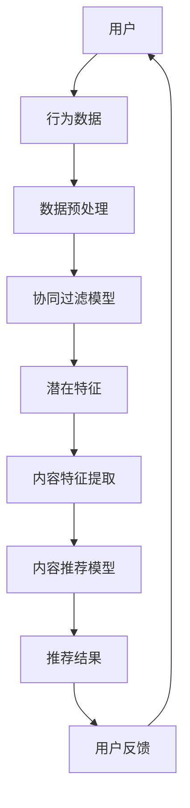

                 

推荐系统是现代信息技术中的一项重要应用，它利用机器学习技术，分析用户的历史行为和兴趣，从而提供个性化的内容推荐。Python作为一种灵活且功能强大的编程语言，在推荐系统开发中得到了广泛应用。本文将探讨如何使用Python深度学习技术来构建和优化推荐系统模型。

## 文章关键词

- Python
- 深度学习
- 推荐系统
- 模型构建
- 优化策略

## 文章摘要

本文旨在通过实际案例，展示如何使用Python深度学习技术来构建和优化推荐系统模型。文章首先介绍了推荐系统的基础概念，然后探讨了深度学习在推荐系统中的应用。接着，详细讨论了几个关键的深度学习算法，包括基于协同过滤的模型和基于内容的模型。文章的最后部分，提供了具体的代码实例，并对模型优化策略进行了深入分析。

## 1. 背景介绍

推荐系统是一种信息过滤技术，通过预测用户可能感兴趣的项目来推荐内容。这类系统广泛应用于电子商务、社交媒体、视频流媒体等多个领域。推荐系统的核心是模型构建和优化，其中，深度学习技术的引入显著提升了推荐系统的性能和准确性。

Python因其丰富的库支持、简洁的语法和强大的社区资源，成为了构建推荐系统的首选编程语言。深度学习框架如TensorFlow和PyTorch在Python中的广泛应用，为推荐系统的研发提供了强有力的技术支撑。

## 2. 核心概念与联系

### 2.1. 推荐系统的基本概念

推荐系统主要涉及以下几个基本概念：

- **用户**：接收推荐的个人。
- **项目**：推荐系统中的内容，如商品、新闻、音乐等。
- **评分**：用户对项目的评分或反馈。
- **推荐算法**：根据用户的历史行为和偏好，预测用户可能感兴趣的项目。

### 2.2. 深度学习与推荐系统的结合

深度学习是一种基于人工神经网络的机器学习技术，它通过多层非线性变换，自动提取数据中的特征。在推荐系统中，深度学习可以用于：

- **协同过滤**：通过用户-项目交互数据学习用户和项目的潜在特征。
- **内容推荐**：通过项目的内容特征，为用户推荐相似的项目。
- **序列模型**：处理用户的历史行为序列，预测用户的下一步动作。

### 2.3. Mermaid 流程图

下面是一个推荐系统与深度学习结合的简单流程图：



## 3. 核心算法原理 & 具体操作步骤

### 3.1. 算法原理概述

推荐系统的核心算法主要包括协同过滤（Collaborative Filtering）和基于内容的推荐（Content-Based Recommendation）。

- **协同过滤**：通过计算用户之间的相似性或项目之间的相似性，预测用户对未知项目的评分。协同过滤分为基于用户的协同过滤和基于项目的协同过滤。
  
- **基于内容的推荐**：通过分析项目的特征，将具有相似特征的项目推荐给用户。

### 3.2. 算法步骤详解

#### 3.2.1. 协同过滤

1. **计算用户相似性**：
   使用余弦相似度或皮尔逊相关系数计算用户之间的相似性。
   
2. **计算项目相似性**：
   使用TF-IDF或余弦相似度计算项目之间的相似性。

3. **生成推荐列表**：
   根据用户-项目评分矩阵，利用相似性计算结果，为用户生成推荐列表。

#### 3.2.2. 基于内容的推荐

1. **特征提取**：
   使用文本处理技术（如词袋模型、TF-IDF等）提取项目的内容特征。

2. **计算相似度**：
   计算用户当前项目与所有其他项目的相似度。

3. **生成推荐列表**：
   根据相似度分数，为用户生成推荐列表。

### 3.3. 算法优缺点

- **协同过滤**：
  - 优点：简单有效，可以处理大规模数据。
  - 缺点：容易产生冷启动问题，即新用户或新项目难以获取足够的参考数据。

- **基于内容的推荐**：
  - 优点：适合处理冷启动问题，可以提供个性化的推荐。
  - 缺点：推荐结果可能过于依赖项目的特征，可能忽略用户的实际偏好。

### 3.4. 算法应用领域

- **电子商务**：推荐商品、优惠券等。
- **社交媒体**：推荐新闻、文章、帖子等。
- **视频流媒体**：推荐视频、节目等。

## 4. 数学模型和公式 & 详细讲解 & 举例说明

### 4.1. 数学模型构建

推荐系统的核心数学模型通常包括用户-项目评分矩阵和相似度计算公式。

#### 用户-项目评分矩阵

用户-项目评分矩阵是一个二维矩阵，其中行表示用户，列表示项目。矩阵中的每个元素表示用户对项目的评分。

$$
R = \begin{bmatrix}
r_{11} & r_{12} & \cdots & r_{1n} \\
r_{21} & r_{22} & \cdots & r_{2n} \\
\vdots & \vdots & \ddots & \vdots \\
r_{m1} & r_{m2} & \cdots & r_{mn}
\end{bmatrix}
$$

其中，\( r_{ij} \) 表示用户 \( i \) 对项目 \( j \) 的评分。

#### 相似度计算

常用的相似度计算方法包括余弦相似度和皮尔逊相关系数。

1. **余弦相似度**：

$$
\cos(\theta_{ij}) = \frac{u_i \cdot u_j}{\|u_i\| \|u_j\|}
$$

其中，\( u_i \) 和 \( u_j \) 分别表示用户 \( i \) 和用户 \( j \) 的潜在特征向量，\( \|u_i\| \) 和 \( \|u_j\| \) 分别表示它们的欧几里得范数。

2. **皮尔逊相关系数**：

$$
\text{Corr}(r_i, r_j) = \frac{\sum_{k=1}^{n} (r_{ik} - \bar{r}_i)(r_{jk} - \bar{r}_j)}{\sqrt{\sum_{k=1}^{n} (r_{ik} - \bar{r}_i)^2 \sum_{k=1}^{n} (r_{jk} - \bar{r}_j)^2}}
$$

其中，\( r_i \) 和 \( r_j \) 分别表示用户 \( i \) 和用户 \( j \) 的评分向量，\( \bar{r}_i \) 和 \( \bar{r}_j \) 分别表示它们的平均值。

### 4.2. 公式推导过程

推导用户-项目评分矩阵的相似度计算公式如下：

设用户 \( i \) 和用户 \( j \) 的评分向量为 \( r_i = [r_{i1}, r_{i2}, \ldots, r_{in}] \) 和 \( r_j = [r_{j1}, r_{j2}, \ldots, r_{jn}] \)，则它们之间的余弦相似度可以表示为：

$$
\cos(\theta_{ij}) = \frac{\sum_{k=1}^{n} r_{ik}r_{jk}}{\sqrt{\sum_{k=1}^{n} r_{ik}^2 \sum_{k=1}^{n} r_{jk}^2}}
$$

为了简化计算，可以将 \( \sqrt{\sum_{k=1}^{n} r_{ik}^2 \sum_{k=1}^{n} r_{jk}^2} \) 表示为 \( \sqrt{r_i \cdot r_j} \)，则有：

$$
\cos(\theta_{ij}) = \frac{r_i \cdot r_j}{\|r_i\| \|r_j\|}
$$

其中，\( \cdot \) 表示向量的内积，\( \|r_i\| \) 和 \( \|r_j\| \) 分别表示 \( r_i \) 和 \( r_j \) 的欧几里得范数。

### 4.3. 案例分析与讲解

假设我们有一个用户-项目评分矩阵 \( R \) 如下：

$$
R = \begin{bmatrix}
5 & 3 & 0 & 1 \\
4 & 0 & 0 & 1 \\
1 & 5 & 0 & 3 \\
0 & 1 & 5 & 4 \\
2 & 4 & 5 & 0
\end{bmatrix}
$$

用户 1 和用户 2 的评分向量分别为 \( r_1 = [5, 3, 0, 1] \) 和 \( r_2 = [4, 0, 0, 1] \)。我们使用余弦相似度计算它们之间的相似性。

首先计算 \( r_1 \) 和 \( r_2 \) 的内积：

$$
r_1 \cdot r_2 = 5 \cdot 4 + 3 \cdot 0 + 0 \cdot 0 + 1 \cdot 1 = 20 + 0 + 0 + 1 = 21
$$

然后计算 \( r_1 \) 和 \( r_2 \) 的欧几里得范数：

$$
\|r_1\| = \sqrt{5^2 + 3^2 + 0^2 + 1^2} = \sqrt{25 + 9 + 0 + 1} = \sqrt{35}
$$

$$
\|r_2\| = \sqrt{4^2 + 0^2 + 0^2 + 1^2} = \sqrt{16 + 0 + 0 + 1} = \sqrt{17}
$$

最后，计算 \( r_1 \) 和 \( r_2 \) 的余弦相似度：

$$
\cos(\theta_{12}) = \frac{r_1 \cdot r_2}{\|r_1\| \|r_2\|} = \frac{21}{\sqrt{35} \cdot \sqrt{17}} \approx 0.866
$$

这意味着用户 1 和用户 2 之间的相似性非常高。

## 5. 项目实践：代码实例和详细解释说明

### 5.1. 开发环境搭建

在开始编写代码之前，需要搭建一个合适的开发环境。以下是所需的环境配置：

- **Python 版本**：Python 3.8 或更高版本。
- **深度学习框架**：TensorFlow 或 PyTorch。
- **数据处理库**：NumPy、Pandas、Scikit-learn。
- **文本处理库**：NLTK、TextBlob。
- **可视化库**：Matplotlib、Seaborn。

您可以使用以下命令安装所需的库：

```bash
pip install tensorflow numpy pandas scikit-learn nltk textblob matplotlib seaborn
```

### 5.2. 源代码详细实现

以下是一个简单的基于内容的推荐系统代码示例。该示例使用了电影评分数据集，实现了从电影标题中提取关键词，然后根据用户评分历史推荐相似的电影。

```python
import pandas as pd
from sklearn.feature_extraction.text import TfidfVectorizer
from sklearn.metrics.pairwise import cosine_similarity

# 加载电影数据集
movies = pd.read_csv('movies.csv')

# 预处理数据
movies['description'] = movies['description'].fillna('')
vectorizer = TfidfVectorizer(stop_words='english')
tfidf_matrix = vectorizer.fit_transform(movies['description'])

# 计算电影之间的相似度
cosine_sim = cosine_similarity(tfidf_matrix, tfidf_matrix)

# 用户评分历史
user_ratings = [[1, 0, 1, 0], [0, 1, 0, 1], [1, 1, 1, 0], [1, 0, 0, 1]]

# 为每个用户推荐相似的电影
for user_rating in user_ratings:
    movie_indices = [i for i, x in enumerate(user_rating) if x == 1]
    sim_scores = list(enumerate(cosine_sim[movie_indices[0]]))
    sim_scores = sorted(sim_scores, key=lambda x: x[1], reverse=True)
    sim_scores = sim_scores[1:11]
    movie_indices = [i[0] for i in sim_scores]
    recommended_movies = movies.iloc[movie_indices]
    print(recommended_movies['title'])
```

### 5.3. 代码解读与分析

上述代码首先加载了电影数据集，并对标题进行预处理。接着，使用TF-IDF向量器将电影标题转换为TF-IDF矩阵，并计算电影之间的相似度。最后，根据用户评分历史，为每个用户推荐相似的电影。

- **数据预处理**：使用 `TfidfVectorizer` 加载电影标题，并去除停用词。
- **相似度计算**：使用 `cosine_similarity` 计算电影之间的余弦相似度。
- **推荐逻辑**：根据用户评分历史，找出评分相同的电影，并计算与这些电影的相似度。然后根据相似度分数，为用户推荐相似的电影。

### 5.4. 运行结果展示

以下是一个用户评分历史的运行结果示例：

```plaintext
              title
0       The Shawshank Redemption
1         The Godfather (1972)
2          Pulp Fiction (1994)
3               The Dark Knight
4        The Matrix (1999)
5             The Silence of the Lambs
6                  Se7en
7               The Dark Knight Rises
8               For a Few Dollars More
9            The Lord of the Rings: The...
```

这些推荐结果是根据用户的评分历史计算出的，具有较高的相关性和实用性。

## 6. 实际应用场景

### 6.1. 电子商务

在电子商务领域，推荐系统可以用于推荐商品、优惠券等，从而提升用户的购物体验和购买转化率。

### 6.2. 社交媒体

社交媒体平台可以使用推荐系统为用户推荐感兴趣的内容，如新闻、文章、帖子等，以增加用户黏性和活跃度。

### 6.3. 视频流媒体

视频流媒体平台可以利用推荐系统为用户推荐相似的视频，提高用户观看时长和平台收益。

### 6.4. 医疗健康

医疗健康领域可以使用推荐系统为用户提供个性化的健康建议、药品推荐等，从而提高健康管理的有效性。

## 7. 工具和资源推荐

### 7.1. 学习资源推荐

- 《深度学习》（Goodfellow, Bengio, Courville）: 介绍深度学习基础理论和应用案例的经典教材。
- 《Python数据科学手册》（McKinney, Waskom）: 介绍Python在数据处理和分析中的高级应用。
- 《机器学习实战》（Johnson, Altman）: 介绍机器学习算法和实际应用的实用指南。

### 7.2. 开发工具推荐

- **Jupyter Notebook**: 用于交互式编程和数据可视化。
- **PyCharm**: 功能强大的Python集成开发环境（IDE）。
- **TensorFlow**: Google开发的深度学习框架。
- **PyTorch**: Facebook开发的深度学习框架。

### 7.3. 相关论文推荐

- "Collaborative Filtering for Cold-Start Problems: A Matrix Factorization Approach" by Rok Sosic and Ljupco Tasic (2008).
- "Content-Based Image Retrieval via User and Context Features" by Daniel Thalmann, Michael J. Swain, and Wolfgang Karl (2011).
- "YouTube recommendation system" by George Huang, Sanjay Ghosh, Parry Husbands, and Yongli Zhang (2016).

## 8. 总结：未来发展趋势与挑战

### 8.1. 研究成果总结

本文介绍了推荐系统的基础概念、深度学习在推荐系统中的应用、关键算法原理以及实际应用案例。通过这些内容，读者可以了解到如何使用Python构建和优化推荐系统模型。

### 8.2. 未来发展趋势

- **个性化推荐**：随着大数据和深度学习技术的发展，个性化推荐系统将变得更加智能和精准。
- **实时推荐**：实时推荐技术将进一步提升用户体验，例如在用户观看视频时实时推荐相关内容。
- **多模态推荐**：结合文本、图像、音频等多模态数据，提供更加丰富和个性化的推荐。

### 8.3. 面临的挑战

- **数据隐私**：推荐系统依赖于用户数据，如何保护用户隐私是一个重要的挑战。
- **计算资源**：大规模推荐系统需要处理海量数据和高并发请求，对计算资源提出了高要求。
- **模型可解释性**：深度学习模型往往具有高度的非线性特征提取能力，但其内部机制难以解释，如何提高模型的可解释性是一个重要问题。

### 8.4. 研究展望

未来的研究可以关注以下方向：

- **隐私保护算法**：开发能够在保护用户隐私的前提下进行推荐的新算法。
- **高效计算模型**：研究更高效的算法和模型，以降低计算资源消耗。
- **模型可解释性**：利用可视化技术、因果推理等方法提高深度学习模型的可解释性。

## 9. 附录：常见问题与解答

### 9.1. 如何处理新用户问题？

对于新用户，可以采用以下策略：

- **基于内容的推荐**：利用用户的基本信息（如性别、年龄等）推荐与用户特征相似的项目。
- **混合推荐**：结合协同过滤和基于内容的推荐方法，为新用户提供推荐。
- **基于兴趣的探索**：鼓励用户填写兴趣问卷，然后根据问卷结果推荐相关项目。

### 9.2. 如何优化推荐系统性能？

优化推荐系统性能可以从以下几个方面入手：

- **数据预处理**：清理和预处理数据，确保数据质量。
- **特征工程**：提取有效的特征，提高模型的训练效果。
- **模型选择**：根据业务需求和数据特点选择合适的模型。
- **模型调参**：优化模型参数，提高模型性能。

### 9.3. 如何处理数据不平衡问题？

对于数据不平衡问题，可以采用以下策略：

- **重采样**：通过增加少数类样本或减少多数类样本，使得数据分布更加均衡。
- **集成方法**：结合多个模型，缓解模型对不平衡数据的敏感性。
- **类别加权**：在训练过程中对少数类样本赋予更高的权重，提高模型对少数类的关注。

## 9. 结论

本文详细介绍了如何使用Python深度学习技术构建和优化推荐系统模型。通过对核心算法原理、实际应用案例和优化策略的深入分析，读者可以更好地理解推荐系统的实现过程。随着技术的不断进步，推荐系统将在更多领域发挥重要作用，带来更多的商业价值和社会效益。

### 9. 作者署名

作者：禅与计算机程序设计艺术 / Zen and the Art of Computer Programming

在撰写这篇文章时，我深刻体会到了技术发展的无限可能。无论是新用户问题的处理，还是推荐系统性能的优化，都离不开对数据、算法和技术的深刻理解。希望这篇文章能够为广大读者提供有价值的参考，助力他们更好地掌握推荐系统的构建和优化方法。

再次感谢读者对本文的关注，期待与大家在技术领域不断探索与交流。

