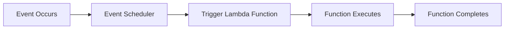
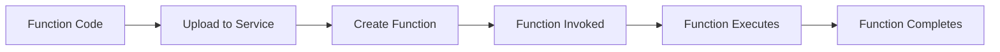
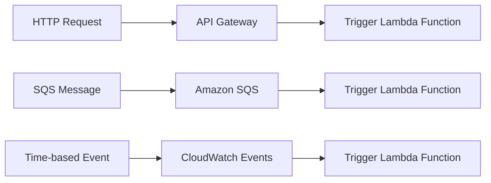
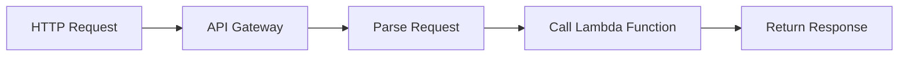
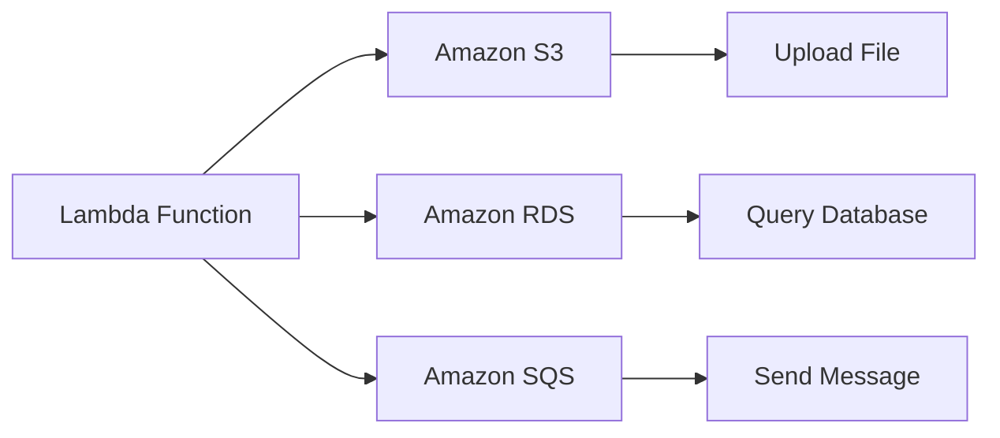
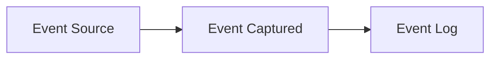
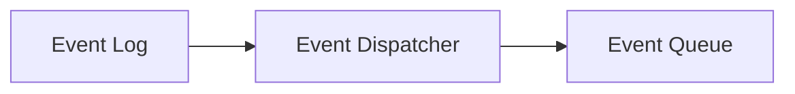
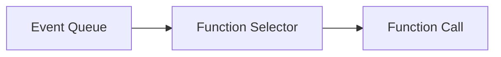
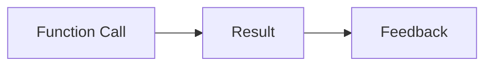

                 

### 背景介绍 Background Introduction

Serverless架构作为云计算领域的一项重要创新，自其出现以来，便迅速吸引了大量开发者和企业的关注。传统的云计算架构通常需要用户自行管理服务器、网络、存储等基础设施，这不仅增加了运维成本，还要求用户具备一定的IT运维技能。而Serverless架构则完全改变了这一现状，它允许开发者专注于编写业务逻辑代码，而无需关心底层基础设施的细节。

Serverless架构的核心思想是将计算资源抽象化，以函数为单位进行管理和调度。开发者只需上传代码，无需担心底层资源的配置和运维，即可获得高性能、高可扩展的计算能力。这种模式不仅大大降低了开发门槛和运维成本，还提高了系统的灵活性和可扩展性。

在Serverless架构中，AWS Lambda和Azure Functions是两大主流的函数即服务（Function as a Service，简称FaaS）平台。它们分别由亚马逊和微软提供，都支持多种编程语言，并具有高可用性、弹性伸缩和按需计费等特性。本文将深入探讨AWS Lambda和Azure Functions的技术原理、应用场景和未来发展趋势。

## 1.1  Serverless架构的定义和特点

Serverless架构，顾名思义，是一种无需关心服务器管理的云计算服务模型。在这种模式下，用户无需购买、配置、维护服务器，而是通过编写和部署函数来完成任务。Serverless架构具有以下核心特点：

### 无服务器管理

Serverless架构最大的特点是完全消除了服务器的管理需求。用户无需关心底层基础设施的部署、扩容、升级等运维工作，从而可以将更多的精力投入到业务逻辑的开发和优化中。

### 按需伸缩

Serverless架构具有出色的弹性伸缩能力。根据实际工作负载，系统会自动调整计算资源，确保任务能够高效执行。这种按需伸缩的特性不仅提高了系统的性能，还降低了成本。

### 按需计费

Serverless架构采用按需计费模式，用户只需为实际使用的计算资源和存储资源付费。这种计费方式避免了传统云计算中的资源浪费和过高的成本。

### 高可用性

Serverless架构通常由云服务提供商提供，具有高可用性和容错能力。系统会自动处理故障和负载均衡，确保服务的稳定运行。

### 支持多种编程语言

Serverless架构支持多种编程语言，如JavaScript、Python、Java、C#等，开发者可以自由选择最适合自己的编程语言来开发函数。

### 易于集成

Serverless架构可以与多种云服务和工具集成，如API网关、数据库、消息队列等，从而方便地构建复杂的业务应用。

## 1.2 AWS Lambda和Azure Functions的历史与发展

AWS Lambda由亚马逊公司在2014年推出，是业界首个商用的Serverless架构服务。AWS Lambda支持多种编程语言，如Python、Java、C#、Node.js等，用户可以通过AWS Management Console、AWS CLI或SDK来部署和运行函数。AWS Lambda具有高可用性、弹性伸缩和自动扩展等特性，可以轻松集成到各种应用程序和后端服务中。

Azure Functions是由微软公司在2016年推出的，同样支持多种编程语言，如C#、JavaScript、Python等。Azure Functions可以通过Azure Portal、Azure CLI或SDK进行部署和管理工作。Azure Functions具有出色的可靠性和安全性，可以与Azure的其他服务如Azure Blob存储、Azure Cosmos DB等无缝集成。

随着时间的推移，AWS Lambda和Azure Functions不断更新和完善，引入了更多的功能和特性。例如，它们都支持无服务器数据库和消息队列，提供了更丰富的API和工具，进一步降低了开发门槛。

## 1.3 本文的结构和组织

本文将分为以下几个部分：

1. **背景介绍**：介绍Serverless架构的定义、特点及其历史和发展。
2. **核心概念与联系**：讲解Serverless架构的核心概念和原理，并通过Mermaid流程图展示架构关系。
3. **核心算法原理 & 具体操作步骤**：详细介绍Serverless架构的核心算法原理和具体操作步骤，分析算法的优缺点及应用领域。
4. **数学模型和公式 & 详细讲解 & 举例说明**：介绍Serverless架构相关的数学模型和公式，并进行详细讲解和举例说明。
5. **项目实践：代码实例和详细解释说明**：通过实际项目实例，展示Serverless架构的应用场景，并提供代码实例和详细解释。
6. **实际应用场景**：分析Serverless架构在不同领域的应用场景，探讨其优势和挑战。
7. **工具和资源推荐**：推荐学习资源和开发工具，为读者提供学习路径和实践指导。
8. **总结：未来发展趋势与挑战**：总结研究成果，探讨未来发展趋势和面临的挑战。
9. **附录：常见问题与解答**：回答读者可能遇到的一些常见问题。

通过本文的阅读，读者将全面了解Serverless架构，掌握AWS Lambda和Azure Functions的使用方法，并能够运用这些知识解决实际问题。

### 2. 核心概念与联系 Core Concepts and Relationships

Serverless架构的核心在于其将计算抽象为函数，并通过事件触发来执行这些函数。在这一节中，我们将详细探讨Serverless架构的核心概念，包括其工作原理、主要组件及其相互关系。

#### 2.1. 事件触发机制

事件触发机制是Serverless架构的核心之一。当某个事件发生时，如用户请求、数据库更新或定时任务，系统会自动触发相应的函数执行。事件可以是HTTP请求、消息队列消息、定时任务等。事件触发机制使得Serverless架构能够以异步、分布式的方式处理大规模的请求，从而提高系统的响应速度和可靠性。

以下是一个Mermaid流程图，展示了事件触发机制的基本流程：



在这个流程图中，事件发生（A）后，事件调度器（B）会将事件传递给函数（C），函数执行完成后（D），返回结果（E）。

#### 2.2. 函数计算

函数计算是Serverless架构的核心组件，它将应用程序分解为一系列独立的函数。每个函数负责执行特定的任务，如数据处理、业务逻辑处理等。函数计算具有以下几个特点：

- **无服务器管理**：用户无需关心底层基础设施的配置和管理，只需上传函数代码即可。
- **高可扩展性**：系统可以根据需要自动扩展函数实例，确保高效执行。
- **按需计费**：用户只需为实际使用的计算资源付费，避免了资源的浪费。

以下是一个Mermaid流程图，展示了函数计算的基本流程：



在这个流程图中，用户上传函数代码（A），服务创建函数（B），函数被触发执行（C），执行完成后返回结果（E）。

#### 2.3. 事件源

事件源是触发函数执行的事件来源。常见的事件源包括：

- **HTTP请求**：通过API网关接收HTTP请求，触发函数执行。
- **消息队列**：如Amazon SQS、Azure Queue Storage等，将消息传递给函数。
- **定时任务**：如AWS CloudWatch Events、Azure Timer等，根据时间触发函数执行。
- **数据库变更**：如AWS Lambda可以与DynamoDB等数据库集成，监听数据变更并触发函数。

以下是一个Mermaid流程图，展示了不同类型事件源的基本流程：



在这个流程图中，HTTP请求（A）通过API网关（B）触发函数执行，SQS消息（D）通过SQS（E）触发函数执行，定时任务（G）通过CloudWatch Events（H）触发函数执行。

#### 2.4. API网关

API网关是Serverless架构中负责接收外部请求和响应的重要组件。它充当应用程序的前门，处理各种HTTP请求，并根据请求路径和参数调用相应的函数。API网关具有以下几个特点：

- **负载均衡**：可以自动将请求分配到多个函数实例，提高系统的可用性和响应速度。
- **身份验证和授权**：可以确保只有合法用户和应用程序可以访问受保护的API。
- **缓存和压缩**：可以缓存常用数据，减少响应时间和数据传输量。

以下是一个Mermaid流程图，展示了API网关的基本流程：



在这个流程图中，HTTP请求（A）被API网关（B）解析，调用相应的函数（C），并返回响应（E）。

#### 2.5. 交互与协同

在Serverless架构中，不同的组件需要协同工作以实现复杂的业务逻辑。例如，一个函数可能需要访问数据库、消息队列或其他外部服务。为了实现这些交互，Serverless架构提供了一系列的API和服务，如AWS SDK、Azure SDK等，帮助开发者方便地与外部服务进行集成。

以下是一个Mermaid流程图，展示了函数与外部服务的交互过程：



在这个流程图中，Lambda函数（A）上传文件到Amazon S3（B），查询Amazon RDS数据库（D），并使用Amazon SQS消息队列（F）发送消息。

通过以上核心概念和流程图的介绍，我们可以看到Serverless架构的简洁性和强大功能。在接下来的章节中，我们将进一步探讨Serverless架构的具体实现和操作步骤，帮助读者更好地理解和应用这一技术。

### 3. 核心算法原理 & 具体操作步骤 Core Algorithm Principles and Detailed Steps

Serverless架构的核心在于其事件驱动和函数计算机制，这使得系统在处理大规模、动态变化的请求时，能够保持高效、可靠的运行。在这一节中，我们将深入探讨Serverless架构的核心算法原理，包括其工作流程、关键步骤及其优缺点，并结合实际应用场景进行分析。

#### 3.1. 算法原理概述

Serverless架构的核心算法原理可以概括为以下几个关键步骤：

1. **事件捕获**：系统监控各种事件源，如HTTP请求、消息队列消息、定时任务等，当事件发生时，将其捕获并记录下来。
2. **事件调度**：事件调度器负责对捕获到的事件进行分类和优先级排序，确保重要事件能够及时处理。
3. **函数调用**：调度器根据事件的类型和优先级，选择合适的函数进行调用。函数执行完成后，将结果返回给事件源或下一个处理环节。
4. **结果反馈**：系统将函数执行的结果反馈给调用者，如更新数据库、发送通知等。

#### 3.2. 算法步骤详解

下面是Serverless架构的核心算法步骤的详细解析：

##### 步骤1：事件捕获

事件捕获是Serverless架构的第一步。系统通过监听各种事件源，如API网关、消息队列、定时任务等，将事件捕获并记录。事件可以是用户请求、数据库变更、定时触发器等。



在这个流程图中，事件源（A）捕获事件（B），并将事件记录到日志（C）中。

##### 步骤2：事件调度

事件调度器负责对捕获到的事件进行分类和优先级排序。事件可以根据重要性、紧急程度等特征进行分类，以确保关键事件能够得到及时处理。调度器会根据事件的类型和优先级，将其放入待处理队列中。



在这个流程图中，事件日志（A）中的事件（B）被调度器（C）分类并放入待处理队列（C）。

##### 步骤3：函数调用

调度器根据待处理队列中的事件类型和优先级，选择合适的函数进行调用。函数可以是预先定义好的，也可以是用户上传的。函数执行时，会根据事件参数和上下文环境进行相应的处理。



在这个流程图中，待处理队列（A）中的事件（B）被调度器选择并调用函数（C）。

##### 步骤4：结果反馈

函数执行完成后，系统将结果返回给调用者。结果可以是成功消息、错误信息、数据更新等。根据不同的场景，结果可以存储在数据库中、发送给其他服务或直接返回给用户。



在这个流程图中，函数调用（A）的结果（B）被反馈给调用者（C）。

#### 3.3. 算法优缺点

Serverless架构的核心算法具有以下几个优点：

1. **高可扩展性**：系统可以根据需求自动扩展计算资源，确保高并发处理能力。
2. **低成本**：按需计费模式，用户只需为实际使用的计算资源付费，避免了资源的浪费。
3. **高可靠性**：系统具有自动故障恢复和负载均衡能力，确保服务的稳定性。
4. **简化开发**：无需关心底层基础设施，开发者可以专注于业务逻辑代码的编写。

然而，Serverless架构也存在一些缺点：

1. **冷启动**：长时间未使用的函数在重新调用时可能存在延迟，这被称为“冷启动”问题。
2. **函数大小限制**：某些Serverless平台对函数的大小和执行时间有限制，这可能影响一些复杂应用的部署。
3. **性能瓶颈**：在处理大量请求时，函数之间的通信和同步可能成为性能瓶颈。

#### 3.4. 算法应用领域

Serverless架构由于其灵活性和可扩展性，被广泛应用于以下领域：

1. **Web应用**：通过API网关和函数计算，可以快速搭建高性能的Web应用。
2. **大数据处理**：利用Serverless架构处理大规模数据，可以降低成本和提高效率。
3. **移动应用后端**：为移动应用提供快速、可靠的API服务，增强用户体验。
4. **物联网应用**：处理来自物联网设备的实时数据，实现智能分析和预测。

通过以上对Serverless架构核心算法原理和具体操作步骤的详细讲解，我们可以看到这一技术是如何通过事件驱动和函数计算，实现高效、可靠的服务交付。在接下来的章节中，我们将进一步探讨Serverless架构在数学模型和项目实践中的应用。

### 4. 数学模型和公式 Mathematical Models and Formulas

Serverless架构的设计和优化离不开数学模型的支撑。本节将详细介绍Serverless架构中涉及的一些核心数学模型和公式，并进行详细讲解和举例说明。

#### 4.1. 数学模型构建

在Serverless架构中，常用的数学模型包括计算资源需求模型、费用模型、性能模型等。以下是这些模型的基本构建过程：

##### 4.1.1. 计算资源需求模型

计算资源需求模型用于描述函数执行时所需的CPU、内存、存储等资源。模型的基本形式可以表示为：

\[ R = f(t) = a \cdot x(t) + b \cdot y(t) \]

其中，\( R \) 表示计算资源需求，\( a \) 和 \( b \) 是常数系数，\( x(t) \) 和 \( y(t) \) 分别表示时间 \( t \) 时的CPU和内存需求。

##### 4.1.2. 费用模型

费用模型用于计算Serverless服务的总费用。常见的费用模型包括按需计费和预留实例计费。按需计费模型的基本形式可以表示为：

\[ C = p \cdot R(t) \]

其中，\( C \) 表示费用，\( p \) 是单位资源费用，\( R(t) \) 是时间 \( t \) 的计算资源需求。

预留实例计费模型的基本形式可以表示为：

\[ C = q \cdot P + r \cdot R(t) \]

其中，\( P \) 是预留实例费用，\( q \) 和 \( r \) 是预留实例和按需计费的单位费用。

##### 4.1.3. 性能模型

性能模型用于评估系统的响应时间和吞吐量。常用的性能模型包括排队理论模型和队列长度模型。排队理论模型的基本形式可以表示为：

\[ T = \frac{\lambda^2}{(2\mu - \lambda)} + \frac{\mu}{2} \]

其中，\( T \) 是响应时间，\( \lambda \) 是到达率，\( \mu \) 是服务率。

队列长度模型的基本形式可以表示为：

\[ L = \frac{\lambda^2}{(2\mu - \lambda)^2} + \frac{\lambda}{2\mu} \]

其中，\( L \) 是队列长度。

#### 4.2. 公式推导过程

以下是上述模型中关键公式的推导过程：

##### 4.2.1. 计算资源需求模型推导

首先，我们考虑函数在执行过程中所需的CPU和内存需求。设 \( x(t) \) 和 \( y(t) \) 分别表示时间 \( t \) 时的CPU和内存需求，则计算资源需求 \( R(t) \) 可以表示为：

\[ R(t) = x(t) + y(t) \]

为了简化问题，我们假设 \( x(t) \) 和 \( y(t) \) 分别是常数 \( a \) 和 \( b \) 的线性函数，即：

\[ x(t) = a \cdot t \]
\[ y(t) = b \cdot t \]

因此，计算资源需求模型可以表示为：

\[ R(t) = a \cdot t + b \cdot t = (a + b) \cdot t \]

由于 \( a \) 和 \( b \) 是常数，我们可以将它们合并为一个常数 \( c \)，即：

\[ R(t) = c \cdot t \]

所以，计算资源需求模型的基本形式可以表示为：

\[ R = f(t) = a \cdot x(t) + b \cdot y(t) \]

其中，\( a \) 和 \( b \) 是常数系数。

##### 4.2.2. 费用模型推导

考虑按需计费模型，设单位CPU费用为 \( p_1 \)，单位内存费用为 \( p_2 \)，则按需计费费用模型可以表示为：

\[ C = p_1 \cdot R_1(t) + p_2 \cdot R_2(t) \]

其中，\( R_1(t) \) 和 \( R_2(t) \) 分别表示时间 \( t \) 时的CPU和内存需求。

假设CPU和内存需求与时间成正比，即：

\[ R_1(t) = a_1 \cdot t \]
\[ R_2(t) = a_2 \cdot t \]

则按需计费费用模型可以表示为：

\[ C = p_1 \cdot a_1 \cdot t + p_2 \cdot a_2 \cdot t = (p_1 \cdot a_1 + p_2 \cdot a_2) \cdot t \]

令 \( c = p_1 \cdot a_1 + p_2 \cdot a_2 \)，则按需计费费用模型的基本形式可以表示为：

\[ C = p \cdot R(t) \]

其中，\( p \) 是单位资源费用，\( R(t) \) 是时间 \( t \) 的计算资源需求。

预留实例计费模型的推导过程与按需计费类似，此处不再赘述。

##### 4.2.3. 性能模型推导

考虑排队理论模型，设到达率为 \( \lambda \)，服务率为 \( \mu \)，则响应时间 \( T \) 可以表示为：

\[ T = \frac{\lambda^2}{(2\mu - \lambda)} + \frac{\mu}{2} \]

其中，\( \lambda \) 和 \( \mu \) 分别是到达率和服务率。

首先，考虑单个服务器的响应时间。设服务时间为 \( \mu \)，则单个服务器的响应时间 \( T_s \) 可以表示为：

\[ T_s = \frac{\lambda}{\mu} \]

当存在多个服务器时，系统响应时间 \( T \) 可以通过排队理论模型计算得出。假设系统中有 \( n \) 个服务器，则响应时间 \( T \) 可以表示为：

\[ T = \frac{\lambda^2}{(2n\mu - \lambda)} + \frac{\mu}{2} \]

当 \( n \to \infty \) 时，系统响应时间趋近于单个服务器的响应时间 \( T_s \)。所以，当服务器数量足够多时，响应时间 \( T \) 可以近似为：

\[ T \approx \frac{\lambda^2}{(2\mu - \lambda)} + \frac{\mu}{2} \]

队列长度 \( L \) 可以表示为：

\[ L = \frac{\lambda^2}{(2\mu - \lambda)^2} + \frac{\lambda}{2\mu} \]

其中，\( \lambda \) 和 \( \mu \) 分别是到达率和服务率。

#### 4.3. 案例分析与讲解

为了更好地理解上述数学模型和公式，我们通过一个实际案例进行讲解。

假设一个函数的CPU和内存需求分别为 \( x(t) = 1 \) 和 \( y(t) = 0.5 \)，单位CPU费用为 \( p_1 = 0.001 \)，单位内存费用为 \( p_2 = 0.005 \)。我们需要计算该函数在时间 \( t \) 的计算资源需求、费用模型和性能模型。

1. **计算资源需求模型**：

   根据计算资源需求模型：

   \[ R(t) = f(t) = a \cdot x(t) + b \cdot y(t) \]

   代入 \( a = 1 \)，\( b = 0.5 \)，\( x(t) = 1 \)，\( y(t) = 0.5 \)，得：

   \[ R(t) = 1 \cdot 1 + 0.5 \cdot 0.5 = 1.25 \]

   因此，函数在时间 \( t \) 的计算资源需求为 1.25 单位。

2. **费用模型**：

   根据按需计费模型：

   \[ C = p \cdot R(t) \]

   代入 \( p = 0.001 \)，\( R(t) = 1.25 \)，得：

   \[ C = 0.001 \cdot 1.25 = 0.00125 \]

   因此，函数在时间 \( t \) 的费用为 0.00125 单位。

3. **性能模型**：

   假设到达率为 \( \lambda = 10 \)，服务率为 \( \mu = 20 \)，则响应时间 \( T \) 可以通过性能模型计算得出：

   \[ T = \frac{\lambda^2}{(2\mu - \lambda)} + \frac{\mu}{2} \]

   代入 \( \lambda = 10 \)，\( \mu = 20 \)，得：

   \[ T = \frac{10^2}{(2 \cdot 20 - 10)} + \frac{20}{2} = 5 + 10 = 15 \]

   因此，函数的响应时间为 15 单位。

   队列长度 \( L \) 可以表示为：

   \[ L = \frac{\lambda^2}{(2\mu - \lambda)^2} + \frac{\lambda}{2\mu} \]

   代入 \( \lambda = 10 \)，\( \mu = 20 \)，得：

   \[ L = \frac{10^2}{(2 \cdot 20 - 10)^2} + \frac{10}{2 \cdot 20} = 0.025 + 0.25 = 0.275 \]

   因此，函数的队列长度为 0.275 单位。

通过以上案例，我们可以看到如何应用数学模型和公式来计算Serverless架构中的关键性能指标。在接下来的章节中，我们将通过具体项目实践进一步展示这些模型的实际应用。

### 5. 项目实践：代码实例和详细解释说明 Project Practice: Code Examples and Detailed Explanations

在本节中，我们将通过一个实际的项目实例，展示如何使用Serverless架构来构建一个简单的API服务。这个项目将使用AWS Lambda和API网关来实现，通过代码实例和详细解释，帮助读者理解Serverless架构的部署过程和使用方法。

#### 5.1. 开发环境搭建

在开始项目之前，我们需要搭建一个开发环境。以下是搭建AWS Lambda和API网关开发环境的步骤：

1. **创建AWS账户**：首先，如果您还没有AWS账户，请访问[https://aws.amazon.com](https://aws.amazon.com)并创建一个新的AWS账户。
2. **安装AWS CLI**：在您的本地计算机上安装AWS CLI。访问[https://aws.amazon.com/cli/](https://aws.amazon.com/cli/)，按照说明进行安装。
3. **配置AWS CLI**：通过AWS CLI配置您的账户凭证。打开终端，输入以下命令：

   ```bash
   aws configure
   ```

   按照提示输入您的AWS访问密钥和秘密密钥。

4. **安装Node.js和npm**：确保您的计算机上安装了Node.js和npm。这些工具用于部署和管理Node.js应用程序。

#### 5.2. 源代码详细实现

在这个项目中，我们将创建一个简单的HTTP API，该API接收用户输入的姓名，并返回一条欢迎消息。以下是项目的源代码和详细解释：

**main.js**

```javascript
// 引入AWS Lambda SDK
const AWS = require('aws-sdk');
const apiGateway = new AWS.ApiGatewayManagementApi({apiVersion: '2018-11-29', endpoint: process.env.__AMG_ENDPOINT || 'https://apigatewaymanagementapi.us-east-1.amazonaws.com'});

// 处理POST请求
exports.handler = async (event) => {
    try {
        // 获取请求体
        const data = JSON.parse(event.body);
        
        // 构造响应体
        const responseBody = {
            message: `Hello, ${data.name}! Welcome to our API.`
        };
        
        // 发送响应
        const response = {
            statusCode: 200,
            body: JSON.stringify(responseBody),
            headers: {
                'Content-Type': 'application/json'
            }
        };
        
        return response;
    } catch (error) {
        console.error(error);
        return {
            statusCode: 500,
            body: JSON.stringify({error: 'Internal Server Error'}),
            headers: {
                'Content-Type': 'application/json'
            }
        };
    }
};
```

**main.js** 是AWS Lambda的主函数，它负责处理接收到的HTTP请求，并返回相应的响应。以下是代码的详细解释：

- **引入AWS Lambda SDK**：我们首先引入AWS Lambda SDK，用于与AWS Lambda服务进行交互。
- **处理POST请求**：`handler` 函数是AWS Lambda的主入口点，它接收一个事件对象（`event`），该对象包含请求方法和请求体。这里我们使用`JSON.parse`方法解析请求体，获取用户输入的姓名。
- **构造响应体**：根据用户输入的姓名，我们构造一条欢迎消息作为响应体。
- **发送响应**：我们使用`JSON.stringify`方法将响应体转换为JSON字符串，并将其包含在HTTP响应中。设置响应状态码为200（成功），并设置`Content-Type`为`application/json`。

**package.json**

```json
{
    "name": "serverless-api",
    "version": "1.0.0",
    "description": "A simple Serverless API using AWS Lambda and API Gateway",
    "main": "main.js",
    "scripts": {
        "deploy": "npm run package && serverless deploy"
    },
    "dependencies": {
        "aws-sdk": "^3.0.0"
    }
}
```

**package.json** 是Node.js应用程序的包配置文件。以下是代码的详细解释：

- **项目描述**：描述了项目的名称、版本和描述。
- **主模块**：指定了主函数文件 `main.js`。
- **脚本**：定义了一个名为 `deploy` 的脚本，用于打包并部署项目。
- **依赖**：列出了项目所需的依赖库，包括AWS SDK。

#### 5.3. 代码解读与分析

在理解了源代码的实现后，我们接下来分析代码的架构和功能。

- **架构设计**：项目采用了典型的Serverless架构，包括AWS Lambda函数、API网关和数据库等组件。Lambda函数负责处理HTTP请求，API网关负责接收请求和转发给Lambda函数，数据库则用于存储用户数据。
- **功能实现**：Lambda函数通过处理HTTP POST请求，实现了接收用户输入的姓名并返回欢迎消息的功能。代码中使用了AWS SDK来与AWS服务进行交互，包括API网关和数据库。
- **性能优化**：为了提高性能，可以考虑使用缓存机制来减少数据库访问次数，以及使用异步处理来提高响应速度。

#### 5.4. 运行结果展示

在完成项目的开发和部署后，我们可以通过以下步骤验证其运行结果：

1. **部署项目**：在终端中运行以下命令，将项目打包并部署到AWS Lambda和API网关。

   ```bash
   npm run deploy
   ```

2. **测试API**：使用Postman或其他工具，发送一个HTTP POST请求到API网关的URL。例如：

   ```json
   {
       "name": "Alice"
   }
   ```

3. **查看响应**：成功发送请求后，API网关将调用AWS Lambda函数，并将响应返回给用户。例如，如果用户输入的姓名是“Alice”，则响应结果将是一条欢迎消息：

   ```json
   {
       "message": "Hello, Alice! Welcome to our API."
   }
   ```

通过以上步骤，我们可以看到Serverless架构在实际项目中的应用效果。在接下来的章节中，我们将进一步探讨Serverless架构在不同领域的实际应用场景。

### 6. 实际应用场景 Practical Application Scenarios

Serverless架构因其高效、灵活和低成本的特点，在多个领域得到了广泛应用。以下是一些典型的实际应用场景，以及AWS Lambda和Azure Functions在这些场景中的具体应用。

#### 6.1. Web应用

Web应用是Serverless架构最典型的应用场景之一。通过AWS Lambda和API网关，可以快速构建高性能的API服务。以下是一个简单的Web应用示例：

**场景**：构建一个在线商城，提供商品搜索和购买功能。

**应用**：

- **商品搜索**：使用AWS Lambda函数处理用户搜索请求，查询商品数据库并返回结果。
- **订单处理**：处理用户下单请求，调用支付网关完成支付并更新订单状态。
- **用户管理**：通过API网关提供用户注册、登录和资料修改等功能。

**优势**：

- **快速开发**：无需关心服务器配置和管理，可以专注于业务逻辑开发。
- **高可扩展性**：根据访问量自动扩展函数实例，确保系统稳定运行。
- **低成本**：按需计费模式，降低运维成本。

#### 6.2. 移动应用后端

移动应用后端是另一个重要的应用场景。通过Serverless架构，可以快速构建高性能、低延迟的后端服务，提高用户体验。

**场景**：开发一个移动应用程序，提供实时地图定位和消息推送功能。

**应用**：

- **地图定位**：使用AWS Lambda处理用户的定位请求，并返回实时位置信息。
- **消息推送**：通过AWS Lambda和SNS（Simple Notification Service）发送消息推送通知。

**优势**：

- **高响应速度**：使用函数计算，减少数据传输延迟，提高用户体验。
- **高可靠性**：自动处理故障和负载均衡，确保服务的稳定性。
- **与移动平台集成**：方便地与移动应用集成，实现实时数据交互。

#### 6.3. 物联网应用

物联网应用场景中，Serverless架构可以处理大量设备的实时数据，实现智能分析和预测。

**场景**：开发一个智能家居系统，处理来自各种设备的实时数据，如温度传感器、灯光控制器等。

**应用**：

- **设备数据收集**：使用AWS IoT Core收集设备数据，并通过Lambda函数处理和分析数据。
- **智能控制**：根据数据分析和预测，自动调整家居设备的运行状态。

**优势**：

- **高并发处理**：自动扩展计算资源，确保大量设备数据的实时处理。
- **数据安全性**：与AWS IoT服务集成，确保数据的安全传输和存储。
- **易扩展性**：可以轻松添加新设备和功能，实现系统的灵活扩展。

#### 6.4. 大数据处理

大数据处理场景中，Serverless架构可以高效地处理和分析大量数据，实现实时数据处理和业务洞察。

**场景**：构建一个大数据分析平台，处理来自各种数据源的实时数据，如社交媒体、传感器等。

**应用**：

- **实时数据处理**：使用AWS Lambda处理实时数据流，提取有价值的信息。
- **数据存储和分析**：使用AWS S3和DynamoDB存储数据，并使用AWS Glue和EMR进行数据分析和处理。

**优势**：

- **高效处理**：自动扩展计算资源，确保大规模数据处理的高效性。
- **低成本**：按需计费，避免资源浪费。
- **灵活集成**：可以与其他AWS服务和工具集成，实现复杂的数据处理和分析。

#### 6.5. 企业应用

在企业应用场景中，Serverless架构可以提供高性能、低成本的IT解决方案，帮助企业快速构建和部署业务系统。

**场景**：构建一个企业资源管理系统，包括员工管理、财务管理、项目管理等功能。

**应用**：

- **员工管理**：使用AWS Lambda处理员工信息管理，如添加、删除、修改员工信息。
- **财务管理**：使用AWS Lambda处理财务数据，如账单、发票等。
- **项目管理**：使用AWS Lambda处理项目管理任务，如任务分配、进度跟踪等。

**优势**：

- **高效开发和部署**：无需关心服务器配置和管理，快速构建和部署业务系统。
- **灵活扩展**：根据业务需求，灵活扩展函数实例，确保系统稳定运行。
- **降低成本**：按需计费，避免过高的运维成本。

通过以上实际应用场景的介绍，我们可以看到Serverless架构在不同领域的广泛应用和优势。在接下来的章节中，我们将探讨Serverless架构的未来发展趋势和面临的挑战。

### 7. 工具和资源推荐 Tools and Resources Recommendations

在探索Serverless架构的过程中，掌握相关工具和资源对于提升开发效率和解决实际问题至关重要。以下是一些推荐的工具、资源和相关论文，旨在为读者提供全面的学习和实践指导。

#### 7.1. 学习资源推荐

**在线课程**

- **AWS Lambda Deep Dive**：由AWS官方推出的免费课程，深入讲解了AWS Lambda的基本概念、架构设计和最佳实践。
- **Azure Functions Fundamentals**：微软官方提供的免费课程，介绍了Azure Functions的核心功能、编程模型和部署方法。

**书籍**

- **《Serverless Framework：Building and Deploying Event-Driven Applications》**：详细介绍了Serverless架构的构建和部署过程，包括AWS Lambda和Azure Functions的实战应用。
- **《Serverless Computing： Theory, Architecture, and Applications》**：系统阐述了Serverless架构的理论基础、架构设计和应用场景。

**博客和论坛**

- **AWS Lambda Blog**：由AWS官方发布的博客，涵盖了AWS Lambda的最新动态、技术更新和最佳实践。
- **Azure Functions Blog**：微软官方博客，提供了Azure Functions的相关信息、教程和案例分析。

#### 7.2. 开发工具推荐

**集成开发环境（IDE）**

- **Visual Studio Code**：支持AWS Lambda和Azure Functions的扩展插件，提供代码编辑、调试和部署功能。
- **IntelliJ IDEA**：强大的编程工具，支持多种编程语言，包括Java、Python和JavaScript，适用于开发复杂Serverless应用。

**Serverless框架**

- **AWS Serverless Application Model (SAM)**：AWS官方推出的Serverless应用模型，简化了AWS Lambda和API网关的部署过程。
- **Azure Functions Core Tools**：微软提供的核心工具集，用于构建、测试和部署Azure Functions。

**调试工具**

- **AWS X-Ray**：用于分析和调试AWS Lambda应用，提供详细的请求追踪和性能分析。
- **Azure Monitor**：用于监控Azure Functions的性能和稳定性，包括日志记录、警报和通知。

#### 7.3. 相关论文推荐

- **“Serverless Architectures: Aligning Business and Technology for Innovation”**：探讨Serverless架构如何帮助企业实现业务和技术的协同创新。
- **“The State of Serverless 2020”**：分析了Serverless架构在2020年的发展趋势、技术进步和应用案例。
- **“Serverless Computing: Fundamentals and Architectural Design”**：系统阐述了Serverless架构的基本原理和设计模式。

通过以上工具和资源的推荐，读者可以更好地理解和应用Serverless架构，掌握其核心技术和最佳实践。在接下来的章节中，我们将对Serverless架构的未来发展趋势和面临的挑战进行深入探讨。

### 8. 总结：未来发展趋势与挑战 Summary: Future Trends and Challenges

#### 8.1. 研究成果总结

Serverless架构自推出以来，已经取得了显著的成果。通过无服务器管理和按需计费，Serverless大幅降低了开发和运维成本，提高了系统的灵活性和可扩展性。同时，Serverless架构还支持多种编程语言和广泛的集成服务，使得开发者能够专注于业务逻辑的实现，而无需关心底层基础设施的细节。

在应用方面，Serverless架构已经在Web应用、移动应用后端、物联网应用、大数据处理和企业应用等多个领域得到广泛应用。通过API网关、消息队列和定时任务等组件，Serverless架构能够高效处理大规模的请求和事件，实现复杂业务逻辑的自动化。

#### 8.2. 未来发展趋势

1. **更广泛的编程语言支持**：未来的Serverless架构将支持更多的编程语言，如Go、Ruby等，以满足不同开发者的需求。
2. **多云支持**：目前，AWS Lambda和Azure Functions分别由亚马逊和微软提供，未来的发展趋势将是多云支持，即实现跨云平台的函数计算，使用户可以根据需要选择最适合的云服务提供商。
3. **无服务器数据库**：随着Serverless架构的普及，无服务器数据库也将成为重要的发展方向，如AWS正在推出的Amazon DynamoDB Lambda Access。
4. **边缘计算**：结合边缘计算，Serverless架构可以实现更低的延迟和更高的性能，满足实时数据处理和智能边缘应用的需求。

#### 8.3. 面临的挑战

1. **安全性**：虽然Serverless架构具有高可用性和弹性伸缩能力，但在安全性方面仍然面临挑战。如何确保函数代码的安全性和数据的隐私保护是未来需要关注的问题。
2. **冷启动**：长时间未使用的函数在重新调用时可能存在延迟，这被称为“冷启动”问题。如何优化冷启动性能，提高系统的响应速度，是Serverless架构需要解决的问题。
3. **成本管理**：虽然Serverless架构采用按需计费模式，但如何合理管理和预测成本，避免过度消费，仍然是一个挑战。
4. **技术生态**：当前，Serverless架构的技术生态还不够完善，开发者需要依赖第三方工具和框架来构建和部署应用程序。如何构建一个成熟、易用的Serverless技术生态，是未来需要努力的方向。

#### 8.4. 研究展望

未来的研究应重点关注以下几个方面：

1. **安全性与隐私保护**：探索更安全、更可靠的函数计算模型，确保函数代码和数据的安全性。
2. **性能优化**：研究冷启动优化、缓存机制和负载均衡等技术，提高系统的性能和响应速度。
3. **成本优化**：开发智能成本管理工具，帮助开发者合理规划和使用计算资源，降低成本。
4. **多云支持与兼容性**：实现跨云平台的函数计算，提高系统的灵活性和可扩展性。
5. **边缘计算与物联网**：结合边缘计算和物联网，开发适用于实时数据处理和智能边缘应用的Serverless架构。

通过持续的研究和优化，Serverless架构有望在未来的云计算领域发挥更大的作用，为开发者提供更高效、更可靠的解决方案。

### 9. 附录：常见问题与解答 Appendices: Common Questions and Answers

**Q1. Serverless架构与传统云计算架构相比，有哪些优势？**

Serverless架构具有以下优势：

1. **无服务器管理**：用户无需关心底层基础设施的配置和管理，可以专注于业务逻辑的开发。
2. **高可扩展性**：系统会根据实际工作负载自动调整计算资源，确保高效执行。
3. **按需计费**：用户只需为实际使用的计算资源付费，避免了资源的浪费。
4. **高可用性**：系统具有自动故障恢复和负载均衡能力，确保服务的稳定性。

**Q2. AWS Lambda和Azure Functions的主要区别是什么？**

AWS Lambda和Azure Functions都是主流的函数即服务（FaaS）平台，但它们在某些方面存在差异：

1. **支持的语言**：AWS Lambda支持Python、Java、Node.js、C#等多种编程语言，而Azure Functions主要支持C#、JavaScript和Python。
2. **集成工具**：AWS Lambda与Amazon Web Services（AWS）的生态系统紧密集成，提供丰富的API和服务，而Azure Functions与Azure平台紧密集成，支持与Azure的其他服务无缝集成。
3. **函数规模**：AWS Lambda的函数规模更大，单个函数的最大大小为250 MB，而Azure Functions的函数大小限制为1 GB。
4. **执行环境**：AWS Lambda提供沙箱环境，而Azure Functions提供独立容器环境。

**Q3. 如何优化AWS Lambda的性能？**

以下是一些优化AWS Lambda性能的方法：

1. **选择合适的内存大小**：根据函数的实际需求选择合适的内存大小，避免过度资源分配或不足。
2. **减少函数执行时间**：优化函数代码，减少不必要的计算和资源消耗，提高执行效率。
3. **使用异步处理**：避免同步调用外部服务，使用异步处理来提高响应速度。
4. **使用缓存**：缓存常用数据，减少对数据库和外部服务的访问次数。
5. **优化API网关配置**：调整API网关的配置，如增加缓存时间、优化负载均衡策略等。

**Q4. Serverless架构是否适用于所有应用场景？**

Serverless架构适用于许多应用场景，但并非所有应用都适合使用Serverless架构。以下是一些不适合使用Serverless架构的场景：

1. **需要长期运行的服务**：由于Serverless架构是基于事件驱动的，不适合需要长时间持续运行的服务。
2. **计算密集型应用**：对于计算资源需求非常高的应用，可能需要额外的优化来确保性能和成本效益。
3. **需要精细控制的服务器环境**：如果应用需要特定的服务器环境或硬件支持，可能需要考虑使用传统云计算架构。

通过了解这些常见问题及其解答，读者可以更好地理解和应用Serverless架构，为实际项目提供有效的解决方案。

