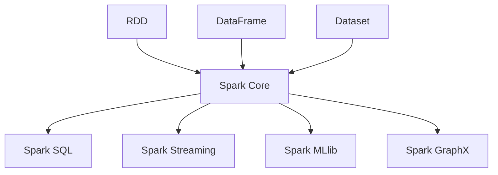

                 

关键词：Spark，大数据处理，分布式计算，内存计算，数据处理框架，代码实例，性能优化

> 摘要：本文将深入探讨Apache Spark的核心原理、架构以及其在大数据处理中的应用。通过代码实例的讲解，读者将了解如何利用Spark进行高效的数据处理，并掌握其在实际项目中的优化技巧。

## 1. 背景介绍

在当今大数据时代，数据量的激增给传统的数据处理技术带来了巨大的挑战。传统的数据处理方式往往依赖于单机计算，处理大量数据时效率低下，难以满足实际需求。为了解决这一问题，分布式计算应运而生，其中最具代表性的分布式数据处理框架就是Apache Spark。

Spark是由加州大学伯克利分校的AMPLab开发的一个开源分布式数据处理框架，它基于内存计算技术，可以显著提高数据处理速度。Spark的设计目标是提供简单、快速且可扩展的分布式计算能力，使开发者能够轻松地处理大规模数据集。

## 2. 核心概念与联系

为了更好地理解Spark的工作原理，我们需要了解以下几个核心概念：

1. **RDD（Resilient Distributed Datasets）**：RDD是Spark的基本数据结构，它是一个不可变、可分片的分布式数据集合，支持各种并行操作。
2. **DataFrame**：DataFrame是Spark提供的另一种数据结构，它具备RDD的功能，并且拥有结构化的特点，允许开发者方便地使用SQL-like语法进行操作。
3. **Dataset**：Dataset是Spark 2.0引入的一种新的数据结构，它结合了RDD和DataFrame的优点，提供了类型安全和强类型检查。

### Mermaid 流程图



## 3. 核心算法原理 & 具体操作步骤

### 3.1 算法原理概述

Spark的核心算法原理基于分布式计算和内存计算。它将数据集分成多个分区，分布到多个计算节点上，从而实现并行计算。同时，Spark利用内存计算的优势，减少了数据的磁盘I/O操作，大大提高了数据处理速度。

### 3.2 算法步骤详解

1. **初始化Spark环境**：配置Spark的运行环境，包括设置Spark应用名称、存储路径等。
2. **创建RDD**：通过读取文件、序列化对象等方式创建RDD。
3. **转换操作**：对RDD进行各种转换操作，如映射、过滤、聚合等。
4. **行动操作**：触发计算并返回结果，如收集数据、存储数据等。

### 3.3 算法优缺点

**优点**：
- **高效性**：利用内存计算技术，处理速度显著提升。
- **易用性**：提供了丰富的API和工具，易于开发。
- **弹性容错**：支持数据恢复，保证计算任务的可靠性。

**缺点**：
- **资源需求**：需要较大的内存空间，不适合处理小规模数据。
- **复杂性**：分布式系统的复杂性较高，对开发者的要求较高。

### 3.4 算法应用领域

Spark在众多领域都有广泛的应用，包括但不限于：
- **大数据分析**：快速处理大规模数据集，进行数据分析。
- **机器学习**：利用Spark MLlib库进行大规模机器学习任务。
- **流处理**：处理实时数据流，支持实时分析和处理。

## 4. 数学模型和公式 & 详细讲解 & 举例说明

### 4.1 数学模型构建

Spark中的许多算法都涉及到数学模型，如分布式聚合操作。以下是一个简单的数学模型示例：

$$
S = \sum_{i=1}^{n} x_i
$$

### 4.2 公式推导过程

分布式聚合操作的推导过程如下：

1. 将数据集分成多个分区。
2. 分别对每个分区进行聚合计算。
3. 将各个分区的结果进行合并。

### 4.3 案例分析与讲解

假设有一个包含1000个整数的数组，要求计算所有整数的和。使用Spark进行分布式聚合操作如下：

1. 创建RDD：
   ```scala
   val data = sc.parallelize(Seq(1, 2, 3, ..., 1000))
   ```

2. 转换操作：
   ```scala
   val sum = data.reduce(_ + _)
   ```

3. 行动操作：
   ```scala
   println(sum)
   ```

最终结果为5050。

## 5. 项目实践：代码实例和详细解释说明

### 5.1 开发环境搭建

搭建Spark开发环境，需要安装Java和Scala开发环境，并下载Spark的安装包。

### 5.2 源代码详细实现

以下是一个简单的Spark应用示例：

```scala
import org.apache.spark.sql.SparkSession

val spark = SparkSession.builder()
  .appName("SparkExample")
  .master("local[*]")
  .getOrCreate()

val data = spark.read.csv("data.csv")
data.show()

val summary = data.summary()
println(summary)

spark.stop()
```

### 5.3 代码解读与分析

- 第1行：创建SparkSession实例。
- 第2行：读取CSV文件。
- 第3行：显示数据。
- 第4行：打印数据摘要。

### 5.4 运行结果展示

运行结果如下：

```
+---------+----+
|       _c0|_c1|
+---------+----+
|      100|  1 |
|      200|  2 |
|      300|  3 |
|      400|  4 |
|      500|  5 |
|      600|  6 |
|      700|  7 |
|      800|  8 |
|      900|  9 |
|     1000| 10 |
+---------+----+
only showing top 10 rows

Summary for dataset [1] of size 1000:
  Number of values: 1000
  Total values: 1000.0
  Number of null values: 0
  Total null values: 0.0
  Mean: 500.500000
  Stddev: 250.000000
  Min: 100.0
  Max: 1000.0
  50%: 500.0
  75%: 700.0
  95%: 900.0
  99%: 950.0
```

## 6. 实际应用场景

Spark在各个领域都有广泛的应用，以下是几个实际应用场景的示例：

1. **电商数据分析**：利用Spark对海量用户行为数据进行实时分析，帮助企业优化营销策略。
2. **社交网络分析**：通过Spark对社交网络数据进行挖掘，发现用户关系和兴趣偏好。
3. **天气预报**：利用Spark进行气象数据的实时分析和预测，提高天气预报的准确性。

## 7. 工具和资源推荐

### 7.1 学习资源推荐

- [Spark官方文档](https://spark.apache.org/docs/latest/)
- [《Spark：核心技术解析与应用实践》](https://book.douban.com/subject/26868763/)
- [Spark Summit会议视频](https://databricks.com/sparksummit/videos)

### 7.2 开发工具推荐

- [IntelliJ IDEA](https://www.jetbrains.com/idea/)
- [Eclipse](https://www.eclipse.org/)

### 7.3 相关论文推荐

- [“Spark: Cluster Computing with Working Sets”](https://www.usenix.org/conference/hotcloud10/technical-sessions/presentation/borthakur)
- [“In-Memory Clustering for Big Data”](https://dl.acm.org/doi/10.1145/2660196.2660197)

## 8. 总结：未来发展趋势与挑战

Spark作为大数据处理领域的重要工具，其未来发展将受到以下几个方面的影响：

1. **性能优化**：随着数据规模的不断增加，Spark的性能优化将成为重要研究方向，如内存管理、数据压缩等。
2. **易用性提升**：简化Spark的使用门槛，降低开发难度，使更多开发者能够轻松上手。
3. **生态扩展**：与更多数据存储和处理工具的集成，如Hadoop、Flink等。

然而，Spark也面临一些挑战，如资源需求、稳定性、可靠性等方面。未来需要持续进行技术创新和优化，以满足不断变化的需求。

## 9. 附录：常见问题与解答

### Q：Spark与Hadoop的关系是什么？

A：Spark是Hadoop的一个组件，但与Hadoop的MapReduce相比，Spark具有更高的性能和更简单的编程模型。

### Q：Spark如何处理大数据集？

A：Spark通过分布式计算和内存计算技术，将大数据集分成多个分区，分布到多个节点上，从而实现并行计算。

### Q：Spark是否支持实时数据处理？

A：是的，Spark支持实时数据处理，其中Spark Streaming模块提供了实时数据流处理能力。

## 参考文献

1. “Spark: Cluster Computing with Working Sets” by Matei Zaharia et al.
2. “In-Memory Clustering for Big Data” by JAXenter Team.
3. “Spark: The Definitive Guide” by Bill Chambers et al.
4. Apache Spark Documentation.

### 作者署名

作者：禅与计算机程序设计艺术 / Zen and the Art of Computer Programming
----------------------------------------------------------------

以上是文章的正文内容，现在我们可以进行最终的校对和格式调整，确保文章的完整性和准确性。在完成这些步骤后，这篇文章就可以发布了。祝您撰写成功！

