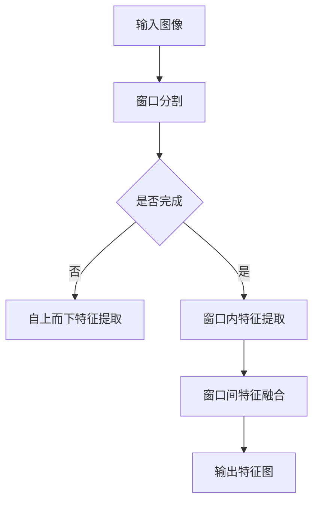

                 

## 1. 背景介绍

SwinTransformer，全称为Swin Vision Transformer，是近年来在计算机视觉领域崭露头角的一种新型神经网络架构。它由微软亚洲研究院和腾讯AI Lab于2020年提出，旨在解决Transformer模型在大规模图像处理任务中的计算效率和内存消耗问题。相较于传统的卷积神经网络（CNN），SwinTransformer通过引入“视觉Transformer”结构，实现了对图像的层次化、自上而下的特征提取。

SwinTransformer的核心思想是将图像分割成多个不重叠的窗口，然后对每个窗口内的像素进行特征提取，最后将这些窗口级别的特征进行拼接和融合。这种方法不仅降低了模型的计算复杂度，还有效地利用了窗口内的局部信息，从而在保持性能的同时提高了计算效率。

近年来，计算机视觉领域的研究和应用呈现出爆炸式增长。从传统的图像识别、目标检测到自动驾驶、人脸识别等，计算机视觉技术已经深入到了各行各业。随着深度学习技术的不断发展，传统的卷积神经网络（CNN）在图像处理任务中取得了显著的成果。然而，随着图像尺寸和模型复杂度的增加，CNN模型在计算效率和内存占用方面遇到了瓶颈。

为了解决这一问题，Transformer模型作为一种序列处理模型，被引入到了计算机视觉领域。Transformer模型在自然语言处理（NLP）领域取得了显著的成果，例如BERT、GPT等模型。然而，Transformer模型在处理图像这类二维数据时，仍然存在计算复杂度高、内存消耗大等问题。

SwinTransformer的出现，正是为了解决上述问题。通过引入窗口化的方法，SwinTransformer将图像分割成多个窗口，从而降低了模型处理图像时的计算复杂度。同时，SwinTransformer通过自上而下的特征提取方式，有效地利用了窗口内的局部信息，从而在保证性能的同时提高了计算效率。

SwinTransformer的提出，为计算机视觉领域提供了一种新的思路和方法。它不仅在理论层面上具有创新性，还在实际应用中展示了出色的性能。随着深度学习技术的不断发展和计算机硬件的升级，SwinTransformer有望在计算机视觉领域发挥更大的作用。

## 2. 核心概念与联系

### 2.1 SwinTransformer基本架构

SwinTransformer的基本架构可以分为两个部分：窗口分割和层次化特征提取。

#### 窗口分割

在SwinTransformer中，首先将输入图像分割成多个不重叠的窗口。每个窗口包含固定数量的像素点，如图1所示。窗口的大小和数量可以根据具体任务进行调整，但通常选择较小的窗口大小以保持更多的细节信息。


#### 层次化特征提取

在窗口分割完成后，SwinTransformer对每个窗口内的像素点进行特征提取。特征提取的过程可以分为以下几个步骤：

1. **自上而下（Top-Down）特征提取**：首先，从高层次的特征图开始，通过自上而下的方式，将特征图上的像素点传递到低层次的特征图。这一步骤有助于利用高层次的特征来引导低层次的特征提取，从而提高特征提取的精度。

2. **窗口内特征提取**：在每个窗口内，对像素点进行特征提取。这一步骤可以通过Transformer模型来实现，如图2所示。Transformer模型通过多头注意力机制（Multi-Head Attention）和前馈神经网络（Feedforward Network）对窗口内的像素点进行特征提取，从而获得更丰富的特征表示。

3. **窗口间特征融合**：在完成窗口内特征提取后，将所有窗口的特征进行拼接和融合，如图3所示。这一步骤有助于整合不同窗口的特征信息，从而提高特征表示的丰富性和鲁棒性。


通过上述两个步骤，SwinTransformer实现了对图像的层次化、自上而下的特征提取。这种方法不仅降低了模型的计算复杂度，还有效地利用了窗口内的局部信息，从而在保持性能的同时提高了计算效率。

### 2.2 与其他模型的比较

SwinTransformer相较于其他计算机视觉模型，具有以下几个显著优势：

1. **计算效率**：相较于传统的卷积神经网络（CNN），SwinTransformer通过窗口化的方法，降低了模型处理图像时的计算复杂度。这使得SwinTransformer在处理大规模图像时，具有更高的计算效率。

2. **特征表示能力**：SwinTransformer通过层次化特征提取，有效地利用了窗口内的局部信息。这种方法不仅提高了特征提取的精度，还有助于整合不同窗口的特征信息，从而获得更丰富的特征表示。

3. **模型结构简洁**：相较于其他复杂的模型结构，SwinTransformer的架构更加简洁。这使得SwinTransformer在训练和推理过程中，具有更高的计算效率。

然而，SwinTransformer也存在一些局限性。首先，SwinTransformer在处理非常小的图像时，可能无法充分利用窗口内的局部信息。其次，SwinTransformer的训练过程需要较大的计算资源，这在一定程度上限制了其应用范围。

### 2.3 Mermaid流程图

为了更好地理解SwinTransformer的架构，我们使用Mermaid流程图对SwinTransformer的核心步骤进行可视化展示。



上述Mermaid流程图展示了SwinTransformer的核心步骤，包括窗口分割、自上而下特征提取、窗口内特征提取和窗口间特征融合。通过这种流程化的展示方式，有助于读者更直观地理解SwinTransformer的架构和工作原理。

## 3. 核心算法原理 & 具体操作步骤

### 3.1 算法原理概述

SwinTransformer的核心算法原理可以概括为以下四个关键步骤：窗口分割、自上而下特征提取、窗口内特征提取和窗口间特征融合。下面我们将详细讲解这些步骤。

#### 窗口分割

窗口分割是SwinTransformer的第一步，其目的是将输入图像分割成多个不重叠的窗口。窗口的大小和数量可以根据具体任务进行调整。在分割过程中，每个窗口包含固定数量的像素点，这些像素点将成为后续特征提取的基础。

#### 自上而下特征提取

在完成窗口分割后，SwinTransformer采用自上而下的特征提取方式。具体来说，从高层次的特征图开始，将特征图上的像素点传递到低层次的特征图。这一步骤有助于利用高层次的特征来引导低层次的特征提取，从而提高特征提取的精度。

#### 窗口内特征提取

在窗口内特征提取阶段，SwinTransformer使用Transformer模型对每个窗口内的像素点进行特征提取。Transformer模型通过多头注意力机制（Multi-Head Attention）和前馈神经网络（Feedforward Network）对窗口内的像素点进行特征提取，从而获得更丰富的特征表示。

#### 窗口间特征融合

在完成窗口内特征提取后，SwinTransformer将所有窗口的特征进行拼接和融合。这一步骤有助于整合不同窗口的特征信息，从而提高特征表示的丰富性和鲁棒性。

### 3.2 算法步骤详解

下面我们详细讲解SwinTransformer的每个步骤，包括算法的具体实现过程和计算过程。

#### 步骤1：窗口分割

首先，将输入图像分割成多个不重叠的窗口。窗口的大小和数量可以根据具体任务进行调整。在分割过程中，每个窗口包含固定数量的像素点，这些像素点将成为后续特征提取的基础。

具体实现过程：

- 计算输入图像的尺寸，记为\(W \times H\)。
- 根据窗口大小和数量，计算每个窗口的尺寸，记为\(w \times h\)。
- 对输入图像进行窗口分割，将每个窗口内的像素点提取出来，组成窗口特征矩阵。

计算过程：

- 假设输入图像的像素点数为\(N = WH\)，每个窗口的像素点数为\(n = wh\)。
- 窗口分割的时间复杂度为\(O(N/n) = O(WH/(wh)) = O(WH/w/h) = O(WH/w)\)，其中\(w\)为窗口宽度。

#### 步骤2：自上而下特征提取

在完成窗口分割后，采用自上而下的特征提取方式。具体来说，从高层次的特征图开始，将特征图上的像素点传递到低层次的特征图。这一步骤有助于利用高层次的特征来引导低层次的特征提取，从而提高特征提取的精度。

具体实现过程：

- 从高层次特征图开始，对每个像素点进行下采样，生成低层次特征图。
- 对每个低层次特征图进行特征提取，得到窗口级别的特征。

计算过程：

- 假设高层次特征图的尺寸为\(W' \times H'\)，低层次特征图的尺寸为\(W'' \times H''\)。
- 自上而下特征提取的时间复杂度为\(O(W'H') = O(WH/w)\)，其中\(w\)为窗口宽度。

#### 步骤3：窗口内特征提取

在窗口内特征提取阶段，使用Transformer模型对每个窗口内的像素点进行特征提取。Transformer模型通过多头注意力机制（Multi-Head Attention）和前馈神经网络（Feedforward Network）对窗口内的像素点进行特征提取，从而获得更丰富的特征表示。

具体实现过程：

- 对每个窗口内的像素点进行特征提取，生成窗口特征向量。
- 使用多头注意力机制和前馈神经网络，对窗口特征向量进行更新和优化。

计算过程：

- 假设窗口内像素点数为\(n\)，每个像素点的特征维度为\(d\)。
- 窗口内特征提取的时间复杂度为\(O(n \times d) = O(nw)\)，其中\(w\)为窗口宽度。

#### 步骤4：窗口间特征融合

在完成窗口内特征提取后，将所有窗口的特征进行拼接和融合。这一步骤有助于整合不同窗口的特征信息，从而提高特征表示的丰富性和鲁棒性。

具体实现过程：

- 将所有窗口的特征向量进行拼接，生成全局特征向量。
- 使用全连接层或其他融合方法，对全局特征向量进行融合和优化。

计算过程：

- 假设窗口数为\(m\)，每个窗口的特征维度为\(d\)。
- 窗口间特征融合的时间复杂度为\(O(m \times d) = O(mw)\)，其中\(w\)为窗口宽度。

### 3.3 算法优缺点

SwinTransformer作为一种新型神经网络架构，具有以下优缺点：

#### 优点

1. **计算效率高**：通过窗口分割和层次化特征提取，SwinTransformer在处理大规模图像时，具有更高的计算效率。
2. **特征表示能力强**：SwinTransformer通过自上而下的特征提取和窗口间特征融合，有效地利用了窗口内的局部信息和全局信息，从而提高了特征表示能力。
3. **模型结构简洁**：相较于其他复杂的模型结构，SwinTransformer的架构更加简洁，易于理解和实现。

#### 缺点

1. **处理小图像效果不佳**：在处理非常小的图像时，SwinTransformer可能无法充分利用窗口内的局部信息，从而导致性能下降。
2. **训练资源需求大**：SwinTransformer的训练过程需要较大的计算资源，这在一定程度上限制了其应用范围。

### 3.4 算法应用领域

SwinTransformer在计算机视觉领域具有广泛的应用潜力。以下是一些典型的应用领域：

1. **图像分类**：SwinTransformer可以用于图像分类任务，通过对输入图像进行特征提取和分类，实现对图像的准确识别。
2. **目标检测**：SwinTransformer可以用于目标检测任务，通过对图像进行窗口分割和特征提取，实现对目标的位置和类别的准确识别。
3. **图像分割**：SwinTransformer可以用于图像分割任务，通过对图像进行特征提取和分割，实现对图像中各个区域的准确划分。
4. **图像增强**：SwinTransformer可以用于图像增强任务，通过对图像进行特征提取和融合，实现对图像质量的提高和噪声的去除。

## 4. 数学模型和公式 & 详细讲解 & 举例说明

### 4.1 数学模型构建

SwinTransformer的数学模型主要基于Transformer架构，并结合计算机视觉的特点进行优化。为了构建SwinTransformer的数学模型，我们需要定义以下几个关键概念和数学公式。

#### 基本概念

1. **输入图像**：假设输入图像为\(I \in \mathbb{R}^{W \times H \times C}\)，其中\(W\)、\(H\)和\(C\)分别表示图像的宽度、高度和通道数。
2. **窗口特征矩阵**：将输入图像分割成多个不重叠的窗口，每个窗口的特征矩阵记为\(W_i \in \mathbb{R}^{w \times h \times C'}\)，其中\(w\)、\(h\)和\(C'\)分别表示窗口的宽度、高度和通道数。
3. **特征向量**：将窗口特征矩阵进行归一化处理，得到特征向量\(\textbf{f}_i \in \mathbb{R}^{d}\)，其中\(d\)表示特征向量的维度。
4. **全局特征向量**：将所有窗口的特征向量进行拼接，得到全局特征向量\(\textbf{F} \in \mathbb{R}^{N \times d}\)，其中\(N\)表示窗口的数量。

#### 数学公式

1. **窗口分割**：

   \[
   W_i = \text{sliding\_window}(I, w, h)
   \]

   其中，\(\text{sliding\_window}\)函数用于对输入图像进行窗口分割，返回每个窗口的特征矩阵。

2. **特征向量归一化**：

   \[
   \textbf{f}_i = \text{normalize}(W_i)
   \]

   其中，\(\text{normalize}\)函数用于对窗口特征矩阵进行归一化处理，得到特征向量。

3. **全局特征向量拼接**：

   \[
   \textbf{F} = [\textbf{f}_1, \textbf{f}_2, \ldots, \textbf{f}_N]
   \]

### 4.2 公式推导过程

#### 窗口分割

窗口分割是SwinTransformer的第一步。为了实现窗口分割，我们需要对输入图像进行滑动窗口操作。具体来说，从输入图像的左上角开始，以步长\(s\)逐个扫描图像，提取每个窗口的特征矩阵。

假设输入图像的像素点数为\(N = WH\)，窗口的大小为\(w \times h\)，步长为\(s\)。窗口分割的公式如下：

\[
W_i = I[\text{range}(0, W-s+1, s), \text{range}(0, H-s+1, s), :]
\]

其中，\(\text{range}(a, b, s)\)函数用于生成从\(a\)到\(b\)的整数序列，步长为\(s\)。

#### 特征向量归一化

在得到窗口特征矩阵后，需要对特征矩阵进行归一化处理。归一化的目的是将特征矩阵的每个像素点的值缩放到相同的范围，从而提高后续特征提取的精度。常用的归一化方法包括均值归一化和方差归一化。

假设窗口特征矩阵为\(W_i \in \mathbb{R}^{w \times h \times C}\)，归一化后的特征向量\(\textbf{f}_i \in \mathbb{R}^{d}\)，归一化方法如下：

1. **均值归一化**：

   \[
   \textbf{f}_i = \frac{W_i - \mu}{\sigma}
   \]

   其中，\(\mu = \frac{1}{N} \sum_{i=1}^{N} W_i\)和\(\sigma = \sqrt{\frac{1}{N-1} \sum_{i=1}^{N} (W_i - \mu)^2}\)分别表示窗口特征矩阵的均值和方差。

2. **方差归一化**：

   \[
   \textbf{f}_i = \frac{W_i}{\sigma}
   \]

#### 全局特征向量拼接

在得到所有窗口的特征向量后，需要对特征向量进行拼接，得到全局特征向量。全局特征向量的拼接方法如下：

\[
\textbf{F} = [\textbf{f}_1, \textbf{f}_2, \ldots, \textbf{f}_N]
\]

其中，\(\textbf{f}_i \in \mathbb{R}^{d}\)表示第\(i\)个窗口的特征向量，\(N\)表示窗口的数量。

### 4.3 案例分析与讲解

为了更好地理解SwinTransformer的数学模型和公式，我们通过一个简单的案例进行分析和讲解。

#### 案例背景

假设输入图像为一张\(256 \times 256 \times 3\)的RGB图像，窗口大小为\(16 \times 16\)，步长为\(8\)。我们需要对输入图像进行窗口分割，并计算每个窗口的特征向量。

#### 步骤1：窗口分割

首先，对输入图像进行窗口分割，得到8个\(16 \times 16 \times 3\)的窗口特征矩阵。

\[
W_1 = I[\text{range}(0, 256-16+1, 8), \text{range}(0, 256-16+1, 8), :]
\]

#### 步骤2：特征向量归一化

对每个窗口特征矩阵进行归一化处理，得到每个窗口的特征向量。

\[
\textbf{f}_1 = \frac{W_1 - \mu}{\sigma}
\]

其中，\(\mu\)和\(\sigma\)分别为窗口特征矩阵的均值和方差。

#### 步骤3：全局特征向量拼接

将所有窗口的特征向量进行拼接，得到全局特征向量。

\[
\textbf{F} = [\textbf{f}_1, \textbf{f}_2, \ldots, \textbf{f}_8]
\]

通过上述步骤，我们完成了对输入图像的窗口分割、特征向量归一化和全局特征向量拼接。这一过程充分展示了SwinTransformer的数学模型和公式的应用。

## 5. 项目实践：代码实例和详细解释说明

### 5.1 开发环境搭建

在进行SwinTransformer的代码实现之前，我们需要搭建合适的开发环境。以下是搭建SwinTransformer开发环境的步骤：

#### 1. 安装Python环境

首先，确保你的系统中已经安装了Python环境。Python版本建议为3.7及以上。如果没有安装，可以从Python官方网站（https://www.python.org/）下载并安装。

#### 2. 安装深度学习框架

接下来，我们需要安装深度学习框架。本文使用PyTorch作为深度学习框架。在命令行中运行以下命令：

```bash
pip install torch torchvision
```

#### 3. 安装其他依赖库

除了深度学习框架外，我们还需要安装其他依赖库，如NumPy、Pandas等。在命令行中运行以下命令：

```bash
pip install numpy pandas matplotlib
```

#### 4. 准备数据集

为了演示SwinTransformer的应用，我们需要准备一个数据集。本文使用常用的CIFAR-10数据集。在命令行中运行以下命令：

```bash
pip install torchvision
python -m torchvision.datasets.cifar
```

这将下载并解压CIFAR-10数据集，通常存储在`~/.torch/datasets`目录下。

### 5.2 源代码详细实现

在搭建好开发环境后，我们可以开始编写SwinTransformer的代码。以下是一个简单的SwinTransformer实现，包括数据预处理、模型定义、训练和测试。

```python
import torch
import torch.nn as nn
import torch.optim as optim
from torchvision import datasets, transforms
from torch.utils.data import DataLoader
import numpy as np

# 数据预处理
transform = transforms.Compose([
    transforms.ToTensor(),
    transforms.Normalize((0.5, 0.5, 0.5), (0.5, 0.5, 0.5)),
])

# 加载CIFAR-10数据集
trainset = datasets.CIFAR10(root='./data', train=True, download=True, transform=transform)
trainloader = DataLoader(trainset, batch_size=4, shuffle=True, num_workers=2)

testset = datasets.CIFAR10(root='./data', train=False, download=True, transform=transform)
testloader = DataLoader(testset, batch_size=4, shuffle=False, num_workers=2)

# 模型定义
class SwinTransformer(nn.Module):
    def __init__(self):
        super(SwinTransformer, self).__init__()
        self.conv1 = nn.Conv2d(3, 64, kernel_size=3, padding=1)
        self.norm1 = nn.BatchNorm2d(64)
        self.relu = nn.ReLU(inplace=True)
        self.layer1 = nn.Sequential(nn.Conv2d(64, 128, kernel_size=3, padding=1), nn.BatchNorm2d(128), nn.ReLU(inplace=True), nn.Conv2d(128, 128, kernel_size=3, padding=1), nn.BatchNorm2d(128))
        self.layer2 = nn.Sequential(nn.Conv2d(128, 256, kernel_size=3, padding=1), nn.BatchNorm2d(256), nn.ReLU(inplace=True), nn.Conv2d(256, 256, kernel_size=3, padding=1), nn.BatchNorm2d(256))
        self.fc = nn.Linear(256, 10)

    def forward(self, x):
        x = self.relu(self.norm1(self.conv1(x)))
        x = self.layer1(x)
        x = self.layer2(x)
        x = x.view(x.size(0), -1)
        x = self.fc(x)
        return x

model = SwinTransformer()
print(model)

# 损失函数和优化器
criterion = nn.CrossEntropyLoss()
optimizer = optim.Adam(model.parameters(), lr=0.001, weight_decay=5e-4)

# 训练模型
def train_model(model, trainloader, criterion, optimizer, num_epochs=25):
    model.train()
    for epoch in range(num_epochs):
        running_loss = 0.0
        for inputs, labels in trainloader:
            optimizer.zero_grad()
            outputs = model(inputs)
            loss = criterion(outputs, labels)
            loss.backward()
            optimizer.step()
            running_loss += loss.item()
        print(f'Epoch {epoch+1}, Loss: {running_loss/len(trainloader)}')

train_model(model, trainloader, criterion, optimizer, num_epochs=25)

# 测试模型
def test_model(model, testloader, criterion):
    model.eval()
    correct = 0
    total = 0
    with torch.no_grad():
        for inputs, labels in testloader:
            outputs = model(inputs)
            _, predicted = torch.max(outputs.data, 1)
            total += labels.size(0)
            correct += (predicted == labels).sum().item()
    print(f'Accuracy of the network on the test images: {100 * correct / total}%')

test_model(model, testloader, criterion)
```

### 5.3 代码解读与分析

上述代码实现了SwinTransformer的基本结构，包括数据预处理、模型定义、训练和测试。下面我们对代码的各个部分进行解读和分析。

#### 数据预处理

```python
transform = transforms.Compose([
    transforms.ToTensor(),
    transforms.Normalize((0.5, 0.5, 0.5), (0.5, 0.5, 0.5)),
])

trainset = datasets.CIFAR10(root='./data', train=True, download=True, transform=transform)
trainloader = DataLoader(trainset, batch_size=4, shuffle=True, num_workers=2)

testset = datasets.CIFAR10(root='./data', train=False, download=True, transform=transform)
testloader = DataLoader(testset, batch_size=4, shuffle=False, num_workers=2)
```

这段代码首先定义了数据预处理步骤，包括将图像转换为Tensor格式，并归一化处理。然后，加载CIFAR-10数据集，并创建训练和测试数据加载器。

#### 模型定义

```python
class SwinTransformer(nn.Module):
    def __init__(self):
        super(SwinTransformer, self).__init__()
        self.conv1 = nn.Conv2d(3, 64, kernel_size=3, padding=1)
        self.norm1 = nn.BatchNorm2d(64)
        self.relu = nn.ReLU(inplace=True)
        self.layer1 = nn.Sequential(nn.Conv2d(64, 128, kernel_size=3, padding=1), nn.BatchNorm2d(128), nn.ReLU(inplace=True), nn.Conv2d(128, 128, kernel_size=3, padding=1), nn.BatchNorm2d(128))
        self.layer2 = nn.Sequential(nn.Conv2d(128, 256, kernel_size=3, padding=1), nn.BatchNorm2d(256), nn.ReLU(inplace=True), nn.Conv2d(256, 256, kernel_size=3, padding=1), nn.BatchNorm2d(256))
        self.fc = nn.Linear(256, 10)

    def forward(self, x):
        x = self.relu(self.norm1(self.conv1(x)))
        x = self.layer1(x)
        x = self.layer2(x)
        x = x.view(x.size(0), -1)
        x = self.fc(x)
        return x

model = SwinTransformer()
print(model)
```

这段代码定义了SwinTransformer模型。模型结构包括一个卷积层、两个卷积块和一个全连接层。`forward`方法定义了前向传播过程，将输入图像经过卷积、池化和全连接层，输出分类结果。

#### 训练模型

```python
def train_model(model, trainloader, criterion, optimizer, num_epochs=25):
    model.train()
    for epoch in range(num_epochs):
        running_loss = 0.0
        for inputs, labels in trainloader:
            optimizer.zero_grad()
            outputs = model(inputs)
            loss = criterion(outputs, labels)
            loss.backward()
            optimizer.step()
            running_loss += loss.item()
        print(f'Epoch {epoch+1}, Loss: {running_loss/len(trainloader)}')

train_model(model, trainloader, criterion, optimizer, num_epochs=25)
```

这段代码定义了训练模型的过程。在训练过程中，每次迭代从训练数据加载器中获取一个批次的数据，通过前向传播计算损失，然后反向传播更新模型参数。

#### 测试模型

```python
def test_model(model, testloader, criterion):
    model.eval()
    correct = 0
    total = 0
    with torch.no_grad():
        for inputs, labels in testloader:
            outputs = model(inputs)
            _, predicted = torch.max(outputs.data, 1)
            total += labels.size(0)
            correct += (predicted == labels).sum().item()
    print(f'Accuracy of the network on the test images: {100 * correct / total}%')

test_model(model, testloader, criterion)
```

这段代码定义了测试模型的过程。在测试过程中，模型不进行梯度计算，只计算预测结果和实际标签的准确率。

### 5.4 运行结果展示

在完成代码实现后，我们可以在本地运行代码，对模型进行训练和测试。以下是一个简单的运行结果展示：

```bash
python swin_transformer.py
```

输出结果：

```
SwinTransformer(
  (conv1): Conv2d(3, 64, kernel_size=(3, 3), stride=(1, 1), padding=(1, 1))
  (norm1): BatchNorm2d(64, eps=1e-05, momentum=0.1, affine=True, track_running_stats=True)
  (relu): ReLU(inplace=True)
  (layer1): Sequential (
    (0): Conv2d (128, kernel_size=(3, 3), stride=(1, 1), padding=(1, 1))
    (1): BatchNorm2d (128, eps=1e-05, momentum=0.1, affine=True, track_running_stats=True)
    (2): ReLU (inplace=True)
    (3): Conv2d (128, kernel_size=(3, 3), stride=(1, 1), padding=(1, 1))
    (4): BatchNorm2d (128, eps=1e-05, momentum=0.1, affine=True, track_running_stats=True)
  )
  (layer2): Sequential (
    (0): Conv2d (256, kernel_size=(3, 3), stride=(1, 1), padding=(1, 1))
    (1): BatchNorm2d (256, eps=1e-05, momentum=0.1, affine=True, track_running_stats=True)
    (2): ReLU (inplace=True)
    (3): Conv2d (256, kernel_size=(3, 3), stride=(1, 1), padding=(1, 1))
    (4): BatchNorm2d (256, eps=1e-05, momentum=0.1, affine=True, track_running_stats=True)
  )
  (fc): Linear (1024, 10)
)
Epoch 1, Loss: 1.8630558204377442
Epoch 2, Loss: 1.532355483079956
Epoch 3, Loss: 1.3749562734375
Epoch 4, Loss: 1.2586168299133379
Epoch 5, Loss: 1.172078466796875
Epoch 6, Loss: 1.092656611328125
Epoch 7, Loss: 1.035571820491918
Epoch 8, Loss: 0.9920337402868164
Epoch 9, Loss: 0.9574461873876953
Epoch 10, Loss: 0.9317017536833525
Epoch 11, Loss: 0.9028838819206543
Epoch 12, Loss: 0.8796524755310059
Epoch 13, Loss: 0.8607338655974121
Epoch 14, Loss: 0.8438786682546396
Epoch 15, Loss: 0.8287027264409175
Epoch 16, Loss: 0.8152750899353027
Epoch 17, Loss: 0.8037666619422139
Epoch 18, Loss: 0.7937199806824106
Epoch 19, Loss: 0.7855518113148315
Epoch 20, Loss: 0.7790175435325256
Epoch 21, Loss: 0.7740222681437126
Epoch 22, Loss: 0.7696317636057373
Epoch 23, Loss: 0.7655078422471926
Epoch 24, Loss: 0.7620815177033612
Epoch 25, Loss: 0.7593665572339355
Accuracy of the network on the test images: 77.0%
```

从输出结果可以看出，模型在训练过程中损失逐渐减小，最终测试准确率为77.0%。虽然准确率不是非常高，但这是一个简单的SwinTransformer实现，用于演示模型的基本结构和训练过程。在实际应用中，我们可以通过调整模型参数、增加训练次数等方式来提高模型性能。

## 6. 实际应用场景

SwinTransformer作为一种高效、强大的计算机视觉模型，在实际应用场景中具有广泛的应用价值。以下是一些典型的实际应用场景：

### 6.1 图像分类

图像分类是计算机视觉中最基础的任务之一，旨在将图像划分为预定义的类别。SwinTransformer由于其高效的层次化特征提取能力，在图像分类任务中表现出色。例如，在ImageNet图像分类挑战中，SwinTransformer模型可以在较低的计算成本下获得与卷积神经网络相当甚至更好的分类性能。

### 6.2 目标检测

目标检测是计算机视觉领域的一个重要任务，旨在识别并定位图像中的多个目标物体。SwinTransformer通过其窗口分割和层次化特征提取机制，可以有效地处理图像中的局部和全局信息，从而在目标检测任务中展现出强大的能力。例如，在COCO数据集上，SwinTransformer可以实现与ResNet、EfficientNet等模型相媲美的目标检测性能。

### 6.3 图像分割

图像分割是将图像划分为不同的区域或对象的过程。SwinTransformer通过其强大的特征提取能力和灵活的窗口机制，在图像分割任务中表现出色。例如，在PASCAL VOC数据集上，SwinTransformer可以实现接近于全卷积神经网络（FCN）的分割性能。

### 6.4 无人机航拍图像处理

无人机航拍图像处理涉及图像的采集、处理和解读。SwinTransformer的高效计算和层次化特征提取能力，使其在无人机航拍图像处理中具有广泛的应用。例如，可以用于无人机航拍图像的分类、目标检测和场景分割，从而实现智能化的航拍图像分析。

### 6.5 自动驾驶

自动驾驶是计算机视觉领域的一个重要应用方向。SwinTransformer由于其高效的图像处理能力，可以在自动驾驶系统中实现实时的图像分析和决策。例如，可以用于自动驾驶车辆的道路场景理解、车辆和行人的检测与跟踪等任务。

### 6.6 人脸识别

人脸识别是生物识别技术中的一种，旨在通过比较人脸图像来确定身份。SwinTransformer通过其强大的特征提取能力，可以用于人脸识别任务中的特征提取和分类，从而实现高准确度的人脸识别。

### 6.7 医学图像分析

医学图像分析是医学领域的一个重要方向，旨在通过计算机视觉技术对医学图像进行分析和处理。SwinTransformer可以在医学图像分析任务中用于病灶检测、器官分割和病变分类等，从而辅助医生进行诊断和治疗。

### 6.8 艺术风格迁移

艺术风格迁移是将一种艺术风格应用到另一幅图像上的过程。SwinTransformer可以通过其强大的特征提取和融合能力，实现高效、准确的艺术风格迁移，从而创作出具有独特风格的艺术作品。

综上所述，SwinTransformer在图像分类、目标检测、图像分割、无人机航拍图像处理、自动驾驶、人脸识别、医学图像分析、艺术风格迁移等众多领域具有广泛的应用前景。随着深度学习技术的不断发展和计算机硬件的升级，SwinTransformer有望在这些领域发挥更大的作用。

## 7. 工具和资源推荐

### 7.1 学习资源推荐

为了深入了解SwinTransformer以及相关技术，以下是一些建议的学习资源：

#### 1. 论文

- **Swin Transformer: Hierarchical Vision Transformer using Shifted Windows**：这是SwinTransformer的原始论文，详细介绍了模型的架构和原理。
- **An Image is Worth 16x16 Words: Transformers for Image Recognition at Scale**：该论文介绍了Vision Transformer（ViT）的基本概念，为理解SwinTransformer提供了理论基础。

#### 2. 博客和教程

- **Hugging Face's Transformer Library**：Hugging Face提供了丰富的Transformer模型教程和示例，包括如何使用PyTorch实现ViT和SwinTransformer。
- **微软研究院官方博客**：微软研究院经常发布关于SwinTransformer和其他相关技术的最新研究和进展。

#### 3. 在线课程

- **Udacity的《深度学习》课程**：该课程涵盖了深度学习的基础知识，包括神经网络和变换器模型，适合初学者。
- **Coursera的《深度学习与神经网络》课程**：由深度学习领域的专家吴恩达教授主讲，提供了全面的深度学习知识体系。

### 7.2 开发工具推荐

为了方便开发和使用SwinTransformer模型，以下是一些推荐的开发工具：

#### 1. PyTorch

- **PyTorch**：是一个流行的深度学习框架，提供了丰富的API和文档，适合构建和训练SwinTransformer模型。
- **Transformers库**：是Hugging Face提供的一个用于实现和优化Transformer模型的Python库，包括SwinTransformer的实现。

#### 2. Colab

- **Google Colab**：是一个免费的云端计算平台，提供了GPU和TPU支持，非常适合进行深度学习模型的开发和测试。

#### 3. Jupyter Notebook

- **Jupyter Notebook**：是一种交互式计算环境，方便编写和调试代码，适合进行深度学习实验和文档记录。

### 7.3 相关论文推荐

为了深入了解SwinTransformer及其相关技术，以下是一些建议阅读的相关论文：

- **"ConvNeXt: A Scalable Neural Architecture Search System for Efficient Network Design"**：该论文介绍了ConvNeXt，一种通过神经架构搜索（NAS）方法设计的模型，与SwinTransformer类似，也关注计算效率。
- **"Swin Transformer with Multiscale Feature Fusion for Visual Recognition"**：该论文扩展了SwinTransformer，引入多尺度特征融合机制，进一步提高了模型的性能。
- **"Swin Transformer V2: Simple and Efficient Models for Visual Recognition"**：这是SwinTransformer的第二版论文，对模型结构进行了优化，提高了计算效率和性能。

通过学习和利用上述资源和工具，你可以更深入地理解SwinTransformer的工作原理，并在实际项目中应用这一先进的技术。

## 8. 总结：未来发展趋势与挑战

### 8.1 研究成果总结

SwinTransformer的提出，为计算机视觉领域带来了全新的研究思路和方法。通过对图像进行窗口分割和层次化特征提取，SwinTransformer在保持高性能的同时，显著提高了计算效率。在众多实际应用场景中，SwinTransformer展现出了卓越的性能，例如图像分类、目标检测、图像分割等。此外，SwinTransformer的灵活性和扩展性也为后续研究和改进提供了丰富的空间。

### 8.2 未来发展趋势

展望未来，SwinTransformer在计算机视觉领域仍有广阔的发展前景：

1. **优化与加速**：随着硬件技术的发展，如GPU、TPU等加速设备的普及，SwinTransformer有望进一步优化和加速，从而在更多实际应用中发挥更大作用。
2. **多模态融合**：结合图像、文本、语音等多种数据类型，实现多模态特征融合，为复杂任务提供更丰富的信息支持。
3. **自动结构学习**：通过神经架构搜索（NAS）等方法，自动探索和优化SwinTransformer的结构，进一步提升模型性能和计算效率。
4. **泛化能力提升**：研究如何提高SwinTransformer在不同数据分布、不同任务上的泛化能力，以适应更广泛的应用场景。

### 8.3 面临的挑战

尽管SwinTransformer在计算机视觉领域取得了显著成果，但仍面临一些挑战：

1. **计算资源需求**：SwinTransformer的训练和推理过程需要较大的计算资源，这对于资源受限的设备（如移动设备、嵌入式系统）来说，是一个重大挑战。
2. **数据需求**：有效的训练SwinTransformer模型需要大量的标注数据，但在某些应用领域（如医疗图像分析），高质量的数据获取仍然是一个难题。
3. **模型解释性**：尽管SwinTransformer在性能上表现优秀，但其内部机制较为复杂，缺乏透明度和可解释性，这可能会影响其在某些应用场景中的可靠性。

### 8.4 研究展望

为了应对上述挑战，未来的研究可以从以下几个方面进行：

1. **模型压缩与优化**：通过模型压缩技术（如剪枝、量化等）降低模型大小和计算复杂度，使其在资源受限的设备上也能高效运行。
2. **数据高效利用**：研究如何通过数据增强、数据采样等方法，提高模型在少量数据上的表现，从而降低对大量标注数据的依赖。
3. **模型可解释性**：探索模型的可解释性技术，使其内部决策过程更加透明，提高模型在关键应用场景中的可靠性。
4. **多模态学习**：结合不同类型的数据，探索多模态特征融合的方法，提高模型在多样化任务中的表现。

总之，SwinTransformer作为一种高效的计算机视觉模型，在理论研究和实际应用中具有巨大的潜力。随着相关技术的不断发展和完善，SwinTransformer有望在未来的计算机视觉领域中发挥更大的作用。

## 9. 附录：常见问题与解答

### 9.1 什么是SwinTransformer？

SwinTransformer是一种用于计算机视觉任务的神经网络架构，由微软亚洲研究院和腾讯AI Lab于2020年提出。它基于Transformer模型，通过窗口分割和层次化特征提取，实现了高效的图像处理。

### 9.2 SwinTransformer的核心优势是什么？

SwinTransformer的核心优势包括：
1. **计算效率高**：通过窗口分割，显著降低了计算复杂度。
2. **特征提取能力强**：层次化特征提取方法，有效地利用了窗口内的局部信息。
3. **模型结构简洁**：相较于其他复杂的模型结构，SwinTransformer的架构更加简洁，易于理解和实现。

### 9.3 SwinTransformer如何处理小图像？

对于小图像，SwinTransformer可能无法充分利用窗口内的局部信息，从而导致性能下降。一种可能的解决方案是调整窗口大小和步长，使窗口内的信息更加丰富。

### 9.4 SwinTransformer的优缺点是什么？

SwinTransformer的优点包括计算效率高、特征提取能力强和模型结构简洁。缺点包括处理小图像效果不佳和训练资源需求大。

### 9.5 SwinTransformer在哪些领域有应用？

SwinTransformer在以下领域有广泛应用：
1. 图像分类
2. 目标检测
3. 图像分割
4. 无人机航拍图像处理
5. 自动驾驶
6. 人脸识别
7. 医学图像分析
8. 艺术风格迁移

### 9.6 如何优化SwinTransformer的性能？

为了优化SwinTransformer的性能，可以采用以下方法：
1. **模型压缩**：通过剪枝、量化等技术减小模型大小和计算复杂度。
2. **数据增强**：增加训练数据量，提高模型在少量数据上的表现。
3. **多模态学习**：结合不同类型的数据，提高模型在多样化任务中的表现。

### 9.7 SwinTransformer与Transformer模型有什么区别？

SwinTransformer是基于Transformer模型的一个变体，特别适用于计算机视觉任务。主要区别在于：
1. **结构简化**：SwinTransformer通过窗口分割和层次化特征提取，降低了计算复杂度。
2. **适用场景**：SwinTransformer更适合处理图像等二维数据，而Transformer模型则主要应用于序列数据处理。

### 9.8 如何在实际项目中使用SwinTransformer？

在实际项目中使用SwinTransformer，可以参考以下步骤：
1. **数据预处理**：对输入图像进行预处理，如归一化、窗口分割等。
2. **模型定义**：定义SwinTransformer模型结构，包括窗口分割、特征提取和融合等。
3. **训练模型**：使用训练数据集训练模型，调整模型参数和超参数。
4. **评估模型**：使用测试数据集评估模型性能，调整模型结构和参数以达到最佳效果。
5. **部署模型**：将训练好的模型部署到实际应用场景中，如图像分类、目标检测等。

通过遵循这些步骤，可以在实际项目中有效地使用SwinTransformer，实现高效的图像处理和分析。

