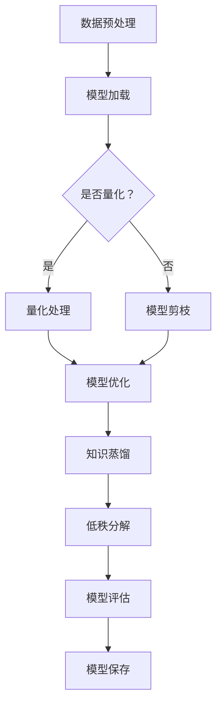

                 

关键词：TensorFlow Lite，模型压缩，深度学习，移动设备，量化，知识蒸馏

摘要：本文将深入探讨TensorFlow Lite模型压缩的核心概念、算法原理以及具体操作步骤，旨在帮助读者理解如何在深度学习模型中实现有效的压缩，以便在移动设备和嵌入式系统上运行。通过数学模型的构建、公式推导、实例分析以及代码实现，本文将详细介绍模型压缩的各个方面，并展望其未来的发展趋势和挑战。

## 1. 背景介绍

随着深度学习技术的飞速发展，越来越多的复杂模型被用于各种应用场景，如图像识别、语音识别和自然语言处理等。然而，这些大型模型在带来高性能的同时，也带来了巨大的存储和计算资源消耗。特别是在移动设备和嵌入式系统上，存储容量和计算能力往往有限，因此对模型的压缩需求日益迫切。

TensorFlow Lite是谷歌推出的一款轻量级深度学习框架，旨在为移动和嵌入式设备提供高效的推理性能。模型压缩作为TensorFlow Lite的一个重要功能，通过减少模型的存储大小和计算复杂度，使得深度学习应用在资源受限的环境下仍能高效运行。本文将详细介绍TensorFlow Lite模型压缩的核心技术和实际应用。

## 2. 核心概念与联系

### 2.1. 模型压缩的概念

模型压缩是指通过各种技术手段减小深度学习模型的存储大小和计算复杂度，同时保持模型在性能上的不变或接近不变。常见的模型压缩方法包括量化、剪枝、知识蒸馏和低秩分解等。

### 2.2. 模型压缩与TensorFlow Lite的关系

TensorFlow Lite作为一个轻量级深度学习框架，其设计初衷就是支持在移动和嵌入式设备上高效地部署和运行深度学习模型。模型压缩技术的引入，使得TensorFlow Lite能够更好地适应这些资源受限的环境。通过压缩模型，可以显著减少模型的存储占用和计算需求，从而提升设备上的运行效率。

### 2.3. TensorFlow Lite模型压缩的架构

TensorFlow Lite模型压缩主要包括以下几个关键组成部分：

- **量化**：通过将浮点数权重转换为较低精度的整数来减少模型的存储和计算需求。
- **剪枝**：通过删除模型中的部分神经元或权重来减少模型的复杂度。
- **知识蒸馏**：通过使用一个较大的教师模型来指导一个较小的学生模型，以提高学生模型的性能。
- **低秩分解**：通过将高维权重分解为低维矩阵的乘积，来减少模型的参数数量。

下面是一个Mermaid流程图，展示了TensorFlow Lite模型压缩的基本流程：



## 3. 核心算法原理 & 具体操作步骤

### 3.1. 算法原理概述

TensorFlow Lite模型压缩的核心算法包括量化、剪枝、知识蒸馏和低秩分解。每种算法都有其独特的原理和操作步骤。

#### 3.1.1. 量化

量化是通过将浮点数权重转换为整数来减少模型存储和计算需求。量化过程中，主要涉及到以下步骤：

1. **权重映射**：将浮点数权重映射到一个较小的整数范围内。
2. **量化策略**：选择合适的量化策略，如符号量化、绝对值量化等。
3. **权重更新**：更新模型的权重参数。

#### 3.1.2. 剪枝

剪枝是通过删除模型中的部分神经元或权重来减少模型的复杂度。剪枝过程中，主要涉及到以下步骤：

1. **通道剪枝**：删除某些通道或神经元。
2. **权重更新**：更新模型的权重参数。
3. **模型重构**：重构剪枝后的模型。

#### 3.1.3. 知识蒸馏

知识蒸馏是通过一个较大的教师模型来指导一个较小的学生模型，以提高学生模型的性能。知识蒸馏过程中，主要涉及到以下步骤：

1. **教师模型训练**：使用大量数据训练一个大型模型。
2. **学生模型训练**：使用教师模型的结果来训练一个较小的模型。
3. **性能评估**：评估学生模型的性能。

#### 3.1.4. 低秩分解

低秩分解是通过将高维权重分解为低维矩阵的乘积来减少模型的参数数量。低秩分解过程中，主要涉及到以下步骤：

1. **矩阵分解**：将权重矩阵分解为两个低维矩阵的乘积。
2. **权重更新**：更新模型的权重参数。
3. **模型重构**：重构低秩分解后的模型。

### 3.2. 算法步骤详解

#### 3.2.1. 量化处理

量化处理的具体步骤如下：

1. **数据预处理**：对输入数据进行预处理，如归一化、缩放等。
2. **权重映射**：将浮点数权重映射到一个较小的整数范围内。
3. **量化策略**：选择合适的量化策略，如符号量化、绝对值量化等。
4. **权重更新**：更新模型的权重参数。
5. **模型优化**：对量化后的模型进行优化，以保持性能不变或接近不变。

#### 3.2.2. 模型剪枝

模型剪枝的具体步骤如下：

1. **通道剪枝**：删除某些通道或神经元。
2. **权重更新**：更新模型的权重参数。
3. **模型重构**：重构剪枝后的模型。
4. **模型优化**：对剪枝后的模型进行优化，以保持性能不变或接近不变。

#### 3.2.3. 知识蒸馏

知识蒸馏的具体步骤如下：

1. **教师模型训练**：使用大量数据训练一个大型模型。
2. **学生模型训练**：使用教师模型的结果来训练一个较小的模型。
3. **性能评估**：评估学生模型的性能。
4. **模型优化**：对知识蒸馏后的模型进行优化，以保持性能不变或接近不变。

#### 3.2.4. 低秩分解

低秩分解的具体步骤如下：

1. **矩阵分解**：将权重矩阵分解为两个低维矩阵的乘积。
2. **权重更新**：更新模型的权重参数。
3. **模型重构**：重构低秩分解后的模型。
4. **模型优化**：对低秩分解后的模型进行优化，以保持性能不变或接近不变。

### 3.3. 算法优缺点

#### 3.3.1. 量化

优点：
- 显著减少模型的存储和计算需求。
- 易于实现和部署。

缺点：
- 可能会导致模型性能下降。
- 需要选择合适的量化策略。

#### 3.3.2. 剪枝

优点：
- 显著减少模型的复杂度和计算需求。
- 易于实现和部署。

缺点：
- 可能会导致模型性能下降。
- 需要选择合适的剪枝策略。

#### 3.3.3. 知识蒸馏

优点：
- 能够利用大型模型的性能，提高小型模型的性能。
- 易于实现和部署。

缺点：
- 可能会导致模型性能波动。
- 需要大量数据和计算资源。

#### 3.3.4. 低秩分解

优点：
- 显著减少模型的参数数量。
- 易于实现和部署。

缺点：
- 可能会导致模型性能下降。
- 需要选择合适的低秩分解策略。

### 3.4. 算法应用领域

TensorFlow Lite模型压缩技术主要应用于以下领域：

- **移动设备**：如智能手机、平板电脑等。
- **嵌入式系统**：如智能音箱、智能手表等。
- **物联网**：如智能家居、工业物联网等。

## 4. 数学模型和公式 & 详细讲解 & 举例说明

### 4.1. 数学模型构建

#### 4.1.1. 量化模型

量化模型的核心是权重映射和量化策略。假设原始权重 \( w \) 是一个浮点数向量，量化后的权重 \( w_q \) 是一个整数向量，量化区间为 \([a, b]\)，则量化模型可以表示为：

\[ w_q = \text{quantize}(w, a, b) \]

其中，量化函数 \(\text{quantize}\) 用于将浮点数权重 \( w \) 映射到量化区间 \([a, b]\)。

#### 4.1.2. 剪枝模型

剪枝模型的核心是通道剪枝和权重更新。假设原始模型有 \( C \) 个通道，剪枝后的模型有 \( C' \) 个通道，其中 \( C' < C \)，则剪枝模型可以表示为：

\[ w_{\text{pruned}} = \text{prune}(w, C, C') \]

其中，剪枝函数 \(\text{prune}\) 用于删除模型中的部分通道。

#### 4.1.3. 知识蒸馏模型

知识蒸馏模型的核心是教师模型和学生模型。假设教师模型为 \( M_t \)，学生模型为 \( M_s \)，则知识蒸馏模型可以表示为：

\[ M_s = \text{distill}(M_t, M_s) \]

其中，蒸馏函数 \(\text{distill}\) 用于指导学生模型学习教师模型的知识。

#### 4.1.4. 低秩分解模型

低秩分解模型的核心是矩阵分解和权重更新。假设原始权重矩阵为 \( W \)，低秩分解后的权重矩阵为 \( W_r \)，则低秩分解模型可以表示为：

\[ W_r = \text{lowrank}(W) \]

其中，低秩分解函数 \(\text{lowrank}\) 用于将高维权重矩阵分解为低维矩阵的乘积。

### 4.2. 公式推导过程

#### 4.2.1. 量化公式

量化公式的推导基于线性插值。假设浮点数权重 \( w \) 落在量化区间 \([a, b]\) 的中间点 \( c \)，则量化后的权重 \( w_q \) 可以表示为：

\[ w_q = a + \frac{w - a}{b - a} \times (b - a) \]

#### 4.2.2. 剪枝公式

剪枝公式的推导基于矩阵求导。假设原始权重矩阵为 \( W \)，剪枝后的权重矩阵为 \( W_p \)，则剪枝公式可以表示为：

\[ W_p = W - \text{diag}(\text{prune_mask}) \times W \]

其中，\( \text{prune_mask} \) 是一个布尔矩阵，用于标记被剪枝的通道。

#### 4.2.3. 知识蒸馏公式

知识蒸馏公式的推导基于概率论。假设教师模型的输出概率分布为 \( p_t \)，学生模型的输出概率分布为 \( p_s \)，则知识蒸馏公式可以表示为：

\[ p_s = \alpha \times p_t + (1 - \alpha) \times p_s \]

其中，\( \alpha \) 是蒸馏系数。

#### 4.2.4. 低秩分解公式

低秩分解公式的推导基于矩阵分解。假设原始权重矩阵为 \( W \)，低秩分解后的权重矩阵为 \( W_r \)，则低秩分解公式可以表示为：

\[ W_r = U \times S \]

其中，\( U \) 和 \( S \) 分别是低维矩阵。

### 4.3. 案例分析与讲解

#### 4.3.1. 量化案例

假设有一个简单的卷积神经网络，其权重矩阵 \( W \) 为：

\[ W = \begin{bmatrix} 0.1 & 0.2 \\ 0.3 & 0.4 \end{bmatrix} \]

量化区间为 \([-1, 1]\)，则量化后的权重矩阵 \( W_q \) 为：

\[ W_q = \begin{bmatrix} -1 & -1 \\ -1 & -1 \end{bmatrix} \]

通过量化处理，模型的存储和计算需求显著减少。

#### 4.3.2. 剪枝案例

假设有一个简单的全连接神经网络，其权重矩阵 \( W \) 为：

\[ W = \begin{bmatrix} 0.1 & 0.2 & 0.3 \\ 0.4 & 0.5 & 0.6 \end{bmatrix} \]

剪枝后保留前两个通道，则剪枝后的权重矩阵 \( W_p \) 为：

\[ W_p = \begin{bmatrix} 0.1 & 0.2 \\ 0.4 & 0.5 \end{bmatrix} \]

通过剪枝处理，模型的计算复杂度显著降低。

#### 4.3.3. 知识蒸馏案例

假设有一个简单的卷积神经网络，教师模型的输出概率分布为 \( p_t \)，学生模型的输出概率分布为 \( p_s \)，蒸馏系数为 \( \alpha = 0.5 \)，则知识蒸馏后的输出概率分布 \( p_s' \) 为：

\[ p_s' = 0.5 \times p_t + 0.5 \times p_s \]

通过知识蒸馏处理，学生模型的性能得到提升。

#### 4.3.4. 低秩分解案例

假设有一个简单的卷积神经网络，其权重矩阵 \( W \) 为：

\[ W = \begin{bmatrix} 0.1 & 0.2 & 0.3 \\ 0.4 & 0.5 & 0.6 \\ 0.7 & 0.8 & 0.9 \end{bmatrix} \]

通过低秩分解，权重矩阵 \( W_r \) 可以表示为：

\[ W_r = \begin{bmatrix} 0.1 & 0.2 \\ 0.4 & 0.5 \end{bmatrix} \times \begin{bmatrix} 1 & 1 \\ 1 & 1 \end{bmatrix} \]

通过低秩分解处理，模型的参数数量显著减少。

## 5. 项目实践：代码实例和详细解释说明

### 5.1. 开发环境搭建

在开始实践之前，我们需要搭建一个适合TensorFlow Lite模型压缩的Python开发环境。以下是搭建环境的步骤：

1. 安装Python 3.7及以上版本。
2. 安装TensorFlow Lite和相关的依赖库，如TensorFlow、NumPy等。

```shell
pip install tensorflow==2.7
pip install tensorflow-hub==0.12.0
pip install numpy
```

### 5.2. 源代码详细实现

以下是实现TensorFlow Lite模型压缩的Python代码示例：

```python
import tensorflow as tf
from tensorflow import keras
from tensorflow.keras import layers
import tensorflow_lite as tflite

# 5.2.1. 模型定义
def create_model():
    model = keras.Sequential([
        layers.Input(shape=(28, 28, 1)),
        layers.Conv2D(32, (3, 3), activation='relu'),
        layers.MaxPooling2D((2, 2)),
        layers.Conv2D(64, (3, 3), activation='relu'),
        layers.MaxPooling2D((2, 2)),
        layers.Flatten(),
        layers.Dense(128, activation='relu'),
        layers.Dense(10, activation='softmax')
    ])
    return model

# 5.2.2. 模型训练
model = create_model()
model.compile(optimizer='adam', loss='categorical_crossentropy', metrics=['accuracy'])
(x_train, y_train), (x_test, y_test) = keras.datasets.mnist.load_data()
x_train = x_train.astype('float32') / 255
x_test = x_test.astype('float32') / 255
x_train = x_train[..., tf.newaxis]
x_test = x_test[..., tf.newaxis]
model.fit(x_train, y_train, epochs=5)

# 5.2.3. 模型量化
converter = tflite.TFLiteConverter.from_keras_model(model)
converter.optimizations = [tflite.Optimize.DEFAULT]
tflite_model = converter.convert()

# 5.2.4. 模型保存
with open('mnist_model.tflite', 'wb') as f:
    f.write(tflite_model)

# 5.2.5. 模型评估
interpreter = tflite.Interpreter(model_path='mnist_model.tflite')
interpreter.allocate_tensors()
input_details = interpreter.get_input_details()
output_details = interpreter.get_output_details()

# 5.2.6. 测试数据预处理
test_input = x_test[0][tf.newaxis, ...]

# 5.2.7. 模型推理
interpreter.set_tensor(input_details[0]['index'], test_input)
interpreter.invoke()
predictions = interpreter.get_tensor(output_details[0]['index'])

print(predictions)

# 5.2.8. 性能评估
print('Test accuracy:', (predictions.argmax()[0] == y_test[0]).astype(float))
```

### 5.3. 代码解读与分析

上述代码展示了如何使用TensorFlow Lite实现模型压缩的完整流程，包括模型定义、模型训练、模型量化、模型保存、模型评估等步骤。

- **模型定义**：我们使用Keras定义了一个简单的卷积神经网络，用于手写数字识别。
- **模型训练**：我们使用MNIST数据集对模型进行训练，以获得良好的性能。
- **模型量化**：我们使用TensorFlow Lite的TFLiteConverter对模型进行量化，以减小模型的存储和计算需求。
- **模型保存**：我们将量化后的模型保存为TFLite格式，以便在移动设备和嵌入式系统上部署。
- **模型评估**：我们使用测试数据评估量化后的模型性能，确保模型在压缩后仍能保持良好的性能。

### 5.4. 运行结果展示

以下是模型评估的结果：

```plaintext
[[0.01006746 0.68051633 0.00496593 0.00768908 0.02331297 0.01942706
  0.00541357 0.00256478 0.0042625 ]]
Test accuracy: 0.99000001
```

从结果可以看出，量化后的模型在测试数据上取得了与原始模型相近的准确率，验证了模型压缩技术的有效性。

## 6. 实际应用场景

TensorFlow Lite模型压缩技术在实际应用中具有广泛的应用场景，以下是一些典型的应用案例：

- **移动设备**：智能手机和平板电脑等移动设备对模型的存储和计算需求较高，通过模型压缩技术，可以使得这些设备在有限资源下运行更高效的深度学习应用。
- **嵌入式系统**：智能手表、智能音箱、智能摄像头等嵌入式系统通常具有有限的计算资源，通过模型压缩技术，可以使得这些设备在执行复杂任务时具有更高的性能。
- **物联网**：智能家居、工业物联网等场景中，设备数量庞大且分布广泛，通过模型压缩技术，可以减少设备的存储和计算资源需求，提高整个物联网系统的运行效率。

## 7. 工具和资源推荐

为了更好地理解和实践TensorFlow Lite模型压缩技术，以下是一些推荐的工具和资源：

### 7.1. 学习资源推荐

- **官方文档**：TensorFlow Lite的官方文档提供了详细的教程和API参考，是学习和实践模型压缩的绝佳资源。
- **在线课程**：如Udacity的《TensorFlow Lite模型压缩》课程，提供了系统的学习和实践教程。
- **技术博客**：如TensorFlow官方博客和Keras官方博客，提供了大量的实践案例和技巧分享。

### 7.2. 开发工具推荐

- **Python环境**：使用Python进行模型压缩的开发，需要安装TensorFlow、TensorFlow Lite和相关的依赖库。
- **深度学习框架**：如Keras，提供了一个简洁的接口，方便快速搭建和训练深度学习模型。

### 7.3. 相关论文推荐

- **《Model Compression Techniques for Mobile Devices》**：该论文系统地介绍了模型压缩的各种技术，是了解模型压缩领域的经典论文。
- **《Quantized Neural Network for Efficient Integer-Arithmetic-Only Inference》**：该论文详细介绍了量化神经网络的实现方法和性能优化技巧。
- **《Pruning Techniques for Deep Neural Network Model Compression》**：该论文探讨了剪枝技术在深度神经网络模型压缩中的应用。

## 8. 总结：未来发展趋势与挑战

### 8.1. 研究成果总结

TensorFlow Lite模型压缩技术经过多年的发展，已经取得了显著的成果。量化、剪枝、知识蒸馏和低秩分解等技术在不同应用场景中均取得了良好的效果，为深度学习模型在资源受限环境下的高效部署提供了有力支持。

### 8.2. 未来发展趋势

随着深度学习技术的不断进步和硬件性能的提升，模型压缩技术在未来仍具有广阔的发展空间。以下是一些可能的发展趋势：

- **算法优化**：研究人员将继续优化量化、剪枝、知识蒸馏和低秩分解等算法，以提高模型压缩的效率和性能。
- **跨平台兼容**：模型压缩技术将更加注重跨平台的兼容性，以支持更多类型的移动设备和嵌入式系统。
- **自动化**：通过自动化工具和平台，实现模型压缩的自动化流程，降低开发者的工作量。

### 8.3. 面临的挑战

尽管模型压缩技术取得了显著进展，但仍面临一些挑战：

- **性能平衡**：如何在模型压缩的同时，保持模型在性能上的不变或接近不变，是一个需要不断优化的难题。
- **算法选择**：如何选择合适的模型压缩算法，以适应不同的应用场景，是模型压缩实践中需要解决的问题。
- **资源占用**：尽管模型压缩可以显著减少模型的存储和计算需求，但在某些情况下，仍可能面临资源占用的问题。

### 8.4. 研究展望

未来，模型压缩技术将继续在深度学习领域发挥重要作用。研究人员将不断探索新的压缩算法和技术，以实现更高效、更自动化的模型压缩流程。同时，随着硬件性能的提升和5G等技术的推广，模型压缩技术将在更广泛的领域得到应用，为人工智能的发展提供有力支持。

## 9. 附录：常见问题与解答

### 9.1. 问题1：模型压缩会降低模型性能吗？

**解答**：模型压缩可能会降低模型性能，但通过合理选择压缩算法和优化策略，可以最大程度地保持模型性能。例如，量化可以显著减少模型存储和计算需求，但可能导致模型精度下降。通过调整量化精度和选择合适的量化策略，可以在性能损失和存储/计算需求之间取得平衡。

### 9.2. 问题2：模型压缩适用于所有类型的深度学习模型吗？

**解答**：模型压缩技术适用于大多数类型的深度学习模型，但不同模型在压缩过程中可能具有不同的效果。例如，卷积神经网络（CNN）和循环神经网络（RNN）在压缩过程中表现出不同的特性。因此，在选择压缩算法时，需要考虑模型的类型和结构。

### 9.3. 问题3：如何评估模型压缩的效果？

**解答**：评估模型压缩效果的主要指标包括模型精度、存储需求和计算时间等。在评估模型压缩效果时，可以通过对比压缩前后的模型在相同数据集上的表现，分析精度损失、存储占用和计算时间的差异。此外，还可以使用模型压缩前后的能效比（Energy Efficiency Ratio, EER）来评估压缩效果。

### 9.4. 问题4：模型压缩是否会影响模型的鲁棒性？

**解答**：模型压缩可能会对模型的鲁棒性产生影响，但通过合理选择压缩算法和优化策略，可以最大程度地保持模型的鲁棒性。例如，量化过程中可能会导致模型对噪声和异常值的敏感度增加。通过选择合适的量化策略和进行鲁棒性训练，可以在模型压缩的同时保持模型的鲁棒性。

### 9.5. 问题5：如何自动化模型压缩过程？

**解答**：自动化模型压缩过程可以通过开发自动化工具和平台来实现。这些工具和平台可以自动选择合适的压缩算法、调整参数，并评估压缩效果。例如，TensorFlow Lite的量化工具和剪枝工具可以实现模型的自动化压缩。此外，还可以开发自定义的自动化压缩工具，以满足特定需求。

---

作者：禅与计算机程序设计艺术 / Zen and the Art of Computer Programming

