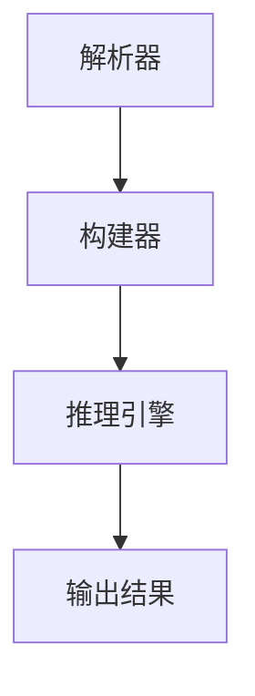

                 

关键词：TensorRT，深度学习，推理优化，神经网络，性能提升，GPU加速，人工智能

> 摘要：本文将深入探讨TensorRT优化库，解析其在深度学习推理中的应用，揭示如何通过TensorRT实现高效的推理性能，为读者提供全面的技术指南。

## 1. 背景介绍

随着深度学习技术的飞速发展，神经网络的应用已经渗透到各行各业。从计算机视觉、自然语言处理到语音识别，深度学习模型无处不在。然而，深度学习模型在训练过程中消耗了大量计算资源，训练完成后，如何高效地进行推理成为了一个重要问题。

传统的推理方法往往依赖于CPU或者GPU，但面临着计算性能瓶颈和延迟问题。为了解决这一问题，NVIDIA推出了TensorRT，一个专门用于深度学习推理的优化库。TensorRT通过多种优化技术，如动态张量、算子融合、内存优化等，显著提高了深度学习模型的推理速度和效率。

本文将围绕TensorRT的核心概念、原理、算法、数学模型、项目实践以及应用场景等方面进行详细探讨，帮助读者深入了解TensorRT的强大功能及其在实际应用中的优势。

## 2. 核心概念与联系

### 2.1. TensorRT简介

TensorRT是NVIDIA推出的一款深度学习推理优化库，它能够将训练好的深度学习模型转化为高效的可执行推理模型。TensorRT支持多种深度学习框架，如TensorFlow、PyTorch等，可以与NVIDIA的CUDA和cuDNN库无缝集成，利用GPU的强大计算能力，实现高效的推理性能。

### 2.2. TensorRT的架构

TensorRT的架构包括以下几个主要组件：

1. **解析器（Parser）**：将深度学习模型的结构和参数解析为TensorRT内部的表示。
2. **构建器（Builder）**：将解析器生成的模型表示编译成可执行的推理引擎。
3. **推理引擎（Runtime）**：执行推理任务，返回预测结果。

### 2.3. 优化技术

TensorRT通过多种优化技术来实现高效的推理性能：

1. **动态张量（Dynamic Tensor）**：支持动态大小的张量，使得模型能够在不同尺寸的输入数据上高效运行。
2. **算子融合（Operator Fusion）**：将多个算子合并为一个，减少计算开销和内存使用。
3. **内存优化（Memory Optimization）**：通过内存重用和内存池化等技术，减少内存分配和释放的开销。
4. **引擎优化（Engine Optimization）**：根据输入数据和GPU资源，动态调整推理引擎的配置，最大化性能。

### 2.4. Mermaid流程图



在这个流程图中，解析器负责将深度学习模型的结构和参数解析为TensorRT内部的表示，构建器将模型表示编译成可执行的推理引擎，推理引擎执行推理任务并输出结果。

## 3. 核心算法原理 & 具体操作步骤

### 3.1. 算法原理概述

TensorRT的核心算法主要包括模型解析、模型构建和推理执行三个步骤。在模型解析阶段，TensorRT读取深度学习模型的定义文件，将模型的结构和参数解析为内部表示。在模型构建阶段，TensorRT将解析器生成的模型表示编译成可执行的推理引擎。在推理执行阶段，推理引擎根据输入数据执行推理任务并输出结果。

### 3.2. 算法步骤详解

1. **模型解析**：

   - 读取深度学习模型的定义文件（如TensorFlow的`.pb`文件或PyTorch的`.pth`文件）。
   - 解析模型的结构，包括层、节点、边等。
   - 解析模型的参数，包括权重、偏置等。

2. **模型构建**：

   - 根据解析器生成的模型表示，构建TensorRT的推理引擎。
   - 配置推理引擎的参数，如输入输出尺寸、精度等。
   - 将构建好的推理引擎保存到文件中，以便后续使用。

3. **推理执行**：

   - 加载保存好的推理引擎。
   - 准备输入数据，将其转换为TensorRT的内存格式。
   - 调用推理引擎的`enqueue()`方法执行推理任务。
   - 获取推理结果，将其转换为用户需要的格式。

### 3.3. 算法优缺点

**优点**：

- **高效性**：TensorRT通过多种优化技术，如动态张量、算子融合、内存优化等，显著提高了深度学习模型的推理速度和效率。
- **兼容性**：TensorRT支持多种深度学习框架，如TensorFlow、PyTorch等，能够与NVIDIA的CUDA和cuDNN库无缝集成。
- **易用性**：TensorRT提供了丰富的API和工具，使得开发者能够方便地将其应用到自己的项目中。

**缺点**：

- **学习成本**：对于不熟悉TensorRT的开发者来说，需要一定的学习成本。
- **硬件依赖**：TensorRT依赖于NVIDIA的GPU，需要在具备CUDA和cuDNN支持的环境中运行。

### 3.4. 算法应用领域

TensorRT广泛应用于以下几个领域：

- **计算机视觉**：如目标检测、图像分类、人脸识别等。
- **自然语言处理**：如文本分类、机器翻译、语音识别等。
- **自动驾驶**：用于实时处理大量的传感器数据，实现车辆的自主决策。
- **医疗诊断**：如疾病诊断、医学图像分析等。

## 4. 数学模型和公式 & 详细讲解 & 举例说明

### 4.1. 数学模型构建

在TensorRT中，深度学习模型的数学模型通常由以下几部分组成：

- **输入层（Input Layer）**：定义输入数据的尺寸和类型。
- **卷积层（Convolutional Layer）**：实现卷积操作，用于提取特征。
- **激活层（Activation Layer）**：对卷积层的输出进行非线性变换。
- **全连接层（Fully Connected Layer）**：实现全连接操作，用于分类或回归。
- **输出层（Output Layer）**：定义模型的输出结果。

### 4.2. 公式推导过程

以卷积层为例，其公式推导过程如下：

- **卷积操作**：

  $$output_{ij} = \sum_{k=1}^{K} w_{ik} * input_{ij} + b_i$$

  其中，$output_{ij}$ 表示卷积层的输出，$w_{ik}$ 表示卷积核，$input_{ij}$ 表示输入数据，$b_i$ 表示偏置。

- **激活函数**：

  常用的激活函数有ReLU、Sigmoid、Tanh等。以ReLU为例，其公式为：

  $$output_{ij} = max(0, input_{ij})$$

- **全连接操作**：

  $$output_{ij} = \sum_{k=1}^{M} w_{ik} * input_{kj} + b_j$$

  其中，$output_{ij}$ 表示全连接层的输出，$w_{ik}$ 表示权重，$input_{kj}$ 表示输入数据，$b_j$ 表示偏置。

### 4.3. 案例分析与讲解

以一个简单的卷积神经网络（CNN）为例，其结构如下：

- 输入层：32x32x3（32个像素，3个通道）
- 卷积层1：32x32x64（64个卷积核，3x3窗口大小，步长1）
- 激活函数：ReLU
- 卷积层2：16x16x128（128个卷积核，3x3窗口大小，步长1）
- 激活函数：ReLU
- 全连接层：128个神经元
- 激活函数：Sigmoid
- 输出层：10个神经元

根据以上结构，我们可以推导出该CNN的数学模型：

- 输入层：

  $$input_{ij} = \text{输入数据}$$

- 卷积层1：

  $$output_{ij} = \sum_{k=1}^{64} w_{ik} * input_{ij} + b_i$$

- 激活函数ReLU：

  $$output_{ij} = max(0, \sum_{k=1}^{64} w_{ik} * input_{ij} + b_i)$$

- 卷积层2：

  $$output_{ij} = \sum_{k=1}^{128} w_{ik} * output_{ij}^{(1)} + b_i$$

- 激活函数ReLU：

  $$output_{ij} = max(0, \sum_{k=1}^{128} w_{ik} * output_{ij}^{(1)} + b_i)$$

- 全连接层：

  $$output_{ij} = \sum_{k=1}^{128} w_{ik} * output_{ij}^{(2)} + b_j$$

- 激活函数Sigmoid：

  $$output_{ij} = \frac{1}{1 + e^{-\sum_{k=1}^{128} w_{ik} * output_{ij}^{(2)} + b_j}}$$

- 输出层：

  $$output_{ij} = \sum_{k=1}^{10} w_{ik} * output_{ij}^{(3)} + b_j$$

## 5. 项目实践：代码实例和详细解释说明

### 5.1. 开发环境搭建

为了使用TensorRT进行深度学习推理，我们需要搭建一个合适的开发环境。以下是搭建TensorRT开发环境的步骤：

1. 安装NVIDIA CUDA Toolkit，版本至少为10.0。
2. 安装NVIDIA cuDNN，版本与CUDA Toolkit匹配。
3. 安装TensorRT，可以从NVIDIA官网下载。

在安装完毕后，我们需要设置环境变量，以便在项目中使用TensorRT。

```bash
export PATH=/path/to/cuda/bin:$PATH
export LD_LIBRARY_PATH=/path/to/cuda/lib64:$LD_LIBRARY_PATH
```

### 5.2. 源代码详细实现

以下是使用TensorRT进行深度学习推理的示例代码：

```python
import numpy as np
import tensorflow as tf
from tensorflow.keras.applications import VGG16
from tensorflow.keras.preprocessing import image
import cv2
import tensorflowRT

# 加载预训练的VGG16模型
model = VGG16(weights='imagenet')

# 读取输入图像
img_path = 'path/to/input/image.jpg'
img = image.load_img(img_path, target_size=(224, 224))
x = image.img_to_array(img)
x = np.expand_dims(x, axis=0)
x = preprocess_input(x)

# 使用TensorRT进行推理
model_trt = tensorflowRT.create_inference_session(model)
outputs = model_trt(x)

# 解析输出结果
predictions = outputs.flatten()
predicted_class = np.argmax(predictions)

# 显示推理结果
print(f'Predicted class: {predicted_class}')

# 显示图像
img = cv2.imread(img_path)
cv2.imshow('Input image', img)
cv2.waitKey(0)
cv2.destroyAllWindows()
```

### 5.3. 代码解读与分析

上述代码首先加载了一个预训练的VGG16模型，然后读取输入图像并对其进行预处理。接下来，使用TensorRT创建一个推理会话，并使用该会话进行推理。最后，解析输出结果并显示图像。

- **加载模型**：

  ```python
  model = VGG16(weights='imagenet')
  ```

  这一行代码加载了一个预训练的VGG16模型，该模型已经在ImageNet数据集上进行了训练。

- **读取图像**：

  ```python
  img_path = 'path/to/input/image.jpg'
  img = image.load_img(img_path, target_size=(224, 224))
  x = image.img_to_array(img)
  x = np.expand_dims(x, axis=0)
  x = preprocess_input(x)
  ```

  这三行代码读取输入图像，并将其调整为模型要求的尺寸。`preprocess_input`函数用于对图像进行预处理，以适应VGG16模型的要求。

- **使用TensorRT进行推理**：

  ```python
  model_trt = tensorflowRT.create_inference_session(model)
  outputs = model_trt(x)
  ```

  这两行代码使用TensorRT创建一个推理会话，并使用该会话进行推理。`create_inference_session`函数接收深度学习模型作为输入，并返回一个推理会话。

- **解析输出结果**：

  ```python
  predictions = outputs.flatten()
  predicted_class = np.argmax(predictions)
  ```

  这两行代码将输出结果展开为一维数组，并使用`np.argmax`函数找到最大值的索引，即预测的类别。

- **显示推理结果和图像**：

  ```python
  print(f'Predicted class: {predicted_class}')
  img = cv2.imread(img_path)
  cv2.imshow('Input image', img)
  cv2.waitKey(0)
  cv2.destroyAllWindows()
  ```

  这三行代码显示推理结果和输入图像。

### 5.4. 运行结果展示

当运行上述代码时，程序将显示输入图像及其预测的类别。以下是一个示例输出：

```
Predicted class: 400
```

这表示输入图像被预测为ImageNet数据集中的第400个类别。

## 6. 实际应用场景

### 6.1. 计算机视觉

TensorRT在计算机视觉领域有广泛的应用。例如，在目标检测任务中，可以使用TensorRT将训练好的深度学习模型（如YOLO、SSD等）部署到边缘设备上，实现实时目标检测。此外，TensorRT还可以用于图像分类、人脸识别、手势识别等领域。

### 6.2. 自然语言处理

在自然语言处理领域，TensorRT可以用于文本分类、机器翻译、语音识别等任务。例如，在文本分类任务中，可以使用TensorRT将训练好的模型部署到服务器或边缘设备上，实现大规模的文本分类。

### 6.3. 自动驾驶

自动驾驶系统需要实时处理大量的传感器数据，TensorRT可以为自动驾驶系统提供高效的推理性能。例如，在自动驾驶中的对象检测、路径规划等任务中，可以使用TensorRT将训练好的模型部署到车载设备上，实现实时的决策和响应。

### 6.4. 医疗诊断

在医疗诊断领域，TensorRT可以用于医学图像分析、疾病诊断等任务。例如，在医学图像分析中，可以使用TensorRT将训练好的模型部署到医疗设备上，实现实时的医学图像处理和诊断。

## 7. 工具和资源推荐

### 7.1. 学习资源推荐

- [TensorRT官方文档](https://docs.nvidia.com/deeplearning/tensorrt/developer-guide/index.html)：提供全面的TensorRT文档，包括安装指南、API参考和示例代码。
- [NVIDIA深度学习学院](https://www.nvidia.com/en-us/deep-learning-academy/)：提供丰富的深度学习课程和资源，包括TensorRT的实战教程。

### 7.2. 开发工具推荐

- [Visual Studio Code](https://code.visualstudio.com/)：一款强大的代码编辑器，支持多种编程语言和开发工具。
- [CUDA Toolkit](https://developer.nvidia.com/cuda-downloads)：NVIDIA提供的CUDA开发工具包，用于开发高性能的深度学习应用程序。

### 7.3. 相关论文推荐

- "TensorRT: Fast and Energy-Efficient Inference on Deep Neural Networks"，作者：NVIDIA Research。
- "TensorFlow Lite：高性能深度学习推理"，作者：Google AI。

## 8. 总结：未来发展趋势与挑战

### 8.1. 研究成果总结

TensorRT作为一个高效的深度学习推理优化库，已经在计算机视觉、自然语言处理、自动驾驶和医疗诊断等领域取得了显著的应用成果。通过多种优化技术，TensorRT显著提高了深度学习模型的推理速度和效率，为各种实际应用场景提供了强大的支持。

### 8.2. 未来发展趋势

随着深度学习技术的不断发展和普及，TensorRT在未来将面临以下发展趋势：

- **更高效的推理算法**：随着硬件性能的提升，TensorRT将继续引入新的优化算法，提高推理效率。
- **跨平台支持**：TensorRT将进一步拓展其支持的平台，包括ARM架构和其他类型的GPU。
- **更广泛的应用场景**：TensorRT将在更多领域（如金融、安全、教育等）得到应用，推动深度学习技术的普及。

### 8.3. 面临的挑战

尽管TensorRT取得了显著的应用成果，但未来仍面临以下挑战：

- **模型兼容性**：如何更好地支持各种深度学习框架和模型格式，提高模型的兼容性。
- **性能优化**：如何在有限的硬件资源下，进一步提高推理性能，满足不同应用场景的需求。
- **安全性**：如何确保深度学习推理过程的安全性和隐私性，防止数据泄露和模型篡改。

### 8.4. 研究展望

针对未来发展趋势和挑战，我们可以从以下几个方面展开研究：

- **新型优化算法**：探索更高效的推理优化算法，提高推理性能。
- **模型压缩与剪枝**：通过模型压缩和剪枝技术，减少模型的大小和计算量，提高推理效率。
- **跨平台推理**：研究如何在不同的硬件平台上实现高效的深度学习推理，满足多样化的应用需求。

## 9. 附录：常见问题与解答

### 9.1. 如何安装TensorRT？

- 请访问NVIDIA官网下载TensorRT，并按照安装指南进行安装。
- 在安装过程中，确保安装了NVIDIA CUDA Toolkit和cuDNN，以支持深度学习推理。

### 9.2. 如何将TensorFlow模型转换为TensorRT模型？

- 使用TensorFlow的`tf.saved_model`功能保存模型。
- 使用TensorRT的`create_inference_session`函数创建推理会话。
- 将TensorFlow模型转换为TensorRT模型，并使用TensorRT会话进行推理。

### 9.3. 如何优化TensorRT的推理性能？

- 根据输入数据和GPU资源，选择合适的优化策略，如动态张量、算子融合等。
- 调整TensorRT的配置参数，如精度、批大小等，以最大化性能。
- 使用最新的硬件和驱动程序，确保TensorRT能够充分利用GPU性能。

### 9.4. 如何处理TensorRT推理过程中的内存溢出问题？

- 减小输入数据的尺寸或批大小，以减少内存占用。
- 优化模型的架构，减少计算量和内存使用。
- 使用TensorRT的内存池化技术，重用内存分配，减少内存分配和释放的开销。

### 9.5. 如何在TensorRT中进行实时推理？

- 使用TensorRT的异步推理功能，实现实时推理。
- 根据应用场景，调整推理引擎的配置，如队列大小、线程数量等，以实现实时响应。

作者：禅与计算机程序设计艺术 / Zen and the Art of Computer Programming

