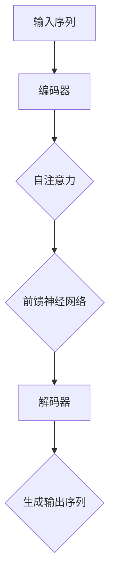

                 

关键词：Transformer，模型，原理，代码实例，自然语言处理，序列到序列模型，编码器-解码器模型

## 摘要

本文旨在深入探讨Transformer模型的原理、结构和应用。Transformer是近年来在自然语言处理（NLP）领域引起广泛关注的一种序列到序列模型，由于其能够高效处理长距离依赖和并行化训练，已经成功应用于机器翻译、文本生成等多个场景。本文将详细解析Transformer的核心概念，包括其架构、算法原理、数学模型以及具体实现，并给出代码实例以供读者实践。

## 1. 背景介绍

自然语言处理作为人工智能的一个重要分支，其目标是让计算机理解和处理人类自然语言。传统的NLP方法大多依赖于规则和统计模型，如隐马尔可夫模型（HMM）、条件随机场（CRF）等，但这些方法在处理长文本和长距离依赖时存在显著局限。因此，研究者们提出了序列到序列（Sequence-to-Sequence, Seq2Seq）模型，其能够更好地处理序列数据。

### 传统方法局限

- **规则方法**：基于手工编写的规则，复杂且难以维护。
- **统计模型**：如n-gram模型，虽然能较好地处理文本，但在处理长距离依赖时效果不佳。

### 序列到序列模型

序列到序列模型由两个主要部分组成：编码器（Encoder）和解码器（Decoder）。编码器负责将输入序列编码为一个固定长度的向量，解码器则根据这个向量生成输出序列。传统的序列到序列模型采用循环神经网络（RNN）作为核心，但RNN在处理长序列时存在梯度消失和梯度爆炸等问题。

### Transformer模型出现

为了解决上述问题，2017年Google AI发布了Transformer模型，该模型采用了一种全新的架构——自注意力机制（Self-Attention），能够有效地捕捉序列中的长距离依赖关系。此外，Transformer模型还可以进行并行化训练，大大提高了训练效率。

## 2. 核心概念与联系

为了更好地理解Transformer模型，我们首先介绍其核心概念和架构，并通过Mermaid流程图展示其工作流程。

### 核心概念

- **自注意力（Self-Attention）**：对输入序列的每个元素计算其对于输出序列的权重，从而捕捉长距离依赖。
- **多头注意力（Multi-Head Attention）**：将自注意力扩展到多个子空间，提高模型的表示能力。
- **前馈神经网络（Feedforward Neural Network）**：对每个注意力层的结果进行进一步的非线性变换。

### 架构

Transformer模型由多个编码器层和解码器层堆叠而成，每层包含自注意力机制和前馈神经网络。编码器将输入序列编码为固定长度的向量，解码器则根据这些向量生成输出序列。

### Mermaid流程图



## 3. 核心算法原理 & 具体操作步骤

### 3.1 算法原理概述

Transformer模型的核心是自注意力机制，其基本思想是对输入序列的每个元素计算其对于输出序列的权重。具体来说，自注意力机制通过三个向量——查询向量（Query）、键向量（Key）和值向量（Value）进行计算。这三个向量分别由输入序列的词向量、位置嵌入向量和位置编码向量拼接而成。

### 3.2 算法步骤详解

1. **编码器输入**：输入序列经过词向量编码和位置嵌入，得到编码器输入。
2. **自注意力计算**：对编码器输入应用自注意力机制，计算查询向量、键向量和值向量。
3. **前馈神经网络**：对自注意力结果应用前馈神经网络，进行进一步的非线性变换。
4. **解码器输入**：将编码器输出作为解码器的输入。
5. **解码器输出**：通过解码器层生成输出序列。

### 3.3 算法优缺点

**优点**：
- **捕捉长距离依赖**：自注意力机制能够有效地捕捉输入序列中的长距离依赖关系。
- **并行化训练**：Transformer模型可以并行化训练，提高了训练效率。

**缺点**：
- **计算复杂度较高**：自注意力机制的计算复杂度较高，对于大型序列可能影响训练速度。

### 3.4 算法应用领域

Transformer模型在多个领域取得了显著的成果，包括：
- **机器翻译**：Transformer模型在机器翻译任务上取得了state-of-the-art的性能。
- **文本生成**：Transformer模型可以用于生成文章、对话等文本数据。
- **问答系统**：Transformer模型可以用于构建问答系统，如BERT模型。

## 4. 数学模型和公式 & 详细讲解 & 举例说明

### 4.1 数学模型构建

Transformer模型的核心是自注意力机制，其数学模型可以表示为：

$$
Attention(Q, K, V) = softmax\left(\frac{QK^T}{\sqrt{d_k}}\right)V
$$

其中，$Q, K, V$ 分别为查询向量、键向量和值向量，$d_k$ 为键向量的维度。

### 4.2 公式推导过程

自注意力机制的推导过程如下：

1. **计算相似度**：首先计算查询向量 $Q$ 和键向量 $K$ 的内积，得到相似度矩阵 $S$。
2. **应用 softmax 函数**：对相似度矩阵 $S$ 应用 softmax 函数，得到权重矩阵 $W$。
3. **计算加权求和**：将权重矩阵 $W$ 与值向量 $V$ 进行矩阵乘法，得到加权求和结果。

### 4.3 案例分析与讲解

假设输入序列为 $[w_1, w_2, w_3]$，其词向量分别为 $[q_1, q_2, q_3]$，键向量分别为 $[k_1, k_2, k_3]$，值向量分别为 $[v_1, v_2, v_3]$。根据自注意力机制的计算过程，我们可以得到：

$$
S = QQ^T = \begin{bmatrix}q_1^T \\ q_2^T \\ q_3^T\end{bmatrix} \begin{bmatrix}q_1 & q_2 & q_3\end{bmatrix} = \begin{bmatrix}q_1^Tq_1 & q_1^Tq_2 & q_1^Tq_3 \\ q_2^Tq_1 & q_2^Tq_2 & q_2^Tq_3 \\ q_3^Tq_1 & q_3^Tq_2 & q_3^Tq_3\end{bmatrix}
$$

$$
W = softmax(S) = \begin{bmatrix}\frac{e^{q_1^Tq_1}}{\sum_{i=1}^{3}e^{q_i^Tq_i}} & \frac{e^{q_1^Tq_2}}{\sum_{i=1}^{3}e^{q_i^Tq_i}} & \frac{e^{q_1^Tq_3}}{\sum_{i=1}^{3}e^{q_i^Tq_i}} \\ \frac{e^{q_2^Tq_1}}{\sum_{i=1}^{3}e^{q_i^Tq_i}} & \frac{e^{q_2^Tq_2}}{\sum_{i=1}^{3}e^{q_i^Tq_i}} & \frac{e^{q_2^Tq_3}}{\sum_{i=1}^{3}e^{q_i^Tq_i}} \\ \frac{e^{q_3^Tq_1}}{\sum_{i=1}^{3}e^{q_i^Tq_i}} & \frac{e^{q_3^Tq_2}}{\sum_{i=1}^{3}e^{q_i^Tq_i}} & \frac{e^{q_3^Tq_3}}{\sum_{i=1}^{3}e^{q_i^Tq_i}}\end{bmatrix}
$$

$$
Attention(Q, K, V) = W V = \begin{bmatrix}\frac{e^{q_1^Tq_1}}{\sum_{i=1}^{3}e^{q_i^Tq_i}}v_1 & \frac{e^{q_1^Tq_2}}{\sum_{i=1}^{3}e^{q_i^Tq_i}}v_2 & \frac{e^{q_1^Tq_3}}{\sum_{i=1}^{3}e^{q_i^Tq_i}}v_3 \\ \frac{e^{q_2^Tq_1}}{\sum_{i=1}^{3}e^{q_i^Tq_i}}v_1 & \frac{e^{q_2^Tq_2}}{\sum_{i=1}^{3}e^{q_i^Tq_i}}v_2 & \frac{e^{q_2^Tq_3}}{\sum_{i=1}^{3}e^{q_i^Tq_i}}v_3 \\ \frac{e^{q_3^Tq_1}}{\sum_{i=1}^{3}e^{q_i^Tq_i}}v_1 & \frac{e^{q_3^Tq_2}}{\sum_{i=1}^{3}e^{q_i^Tq_i}}v_2 & \frac{e^{q_3^Tq_3}}{\sum_{i=1}^{3}e^{q_i^Tq_i}}v_3\end{bmatrix}
$$

通过上述计算，我们可以得到输入序列中每个词对于输出序列的权重，从而有效地捕捉长距离依赖关系。

## 5. 项目实践：代码实例和详细解释说明

### 5.1 开发环境搭建

在开始实践之前，我们需要搭建一个合适的开发环境。以下是Python开发环境搭建的步骤：

1. 安装Python 3.7及以上版本。
2. 安装TensorFlow 2.0及以上版本。
3. 安装Numpy、Pandas等常用Python库。

### 5.2 源代码详细实现

以下是Transformer模型的Python代码实现：

```python
import tensorflow as tf
import numpy as np

# 自注意力层
class SelfAttention(tf.keras.layers.Layer):
    def __init__(self, d_model, num_heads):
        super(SelfAttention, self).__init__()
        self.d_model = d_model
        self.num_heads = num_heads
        self.depth = d_model // num_heads

        self.query_dense = tf.keras.layers.Dense(d_model)
        self.key_dense = tf.keras.layers.Dense(d_model)
        self.value_dense = tf.keras.layers.Dense(d_model)

        self.output_dense = tf.keras.layers.Dense(d_model)

    def call(self, inputs, training=False):
        query = self.query_dense(inputs)
        key = self.key_dense(inputs)
        value = self.value_dense(inputs)

        query = tf.reshape(query, (-1, self.num_heads, self.depth))
        key = tf.reshape(key, (-1, self.num_heads, self.depth))
        value = tf.reshape(value, (-1, self.num_heads, self.depth))

        attention_scores = tf.matmul(query, key, transpose_b=True) / (self.depth ** 0.5)

        if training:
            attention_scores = self.mask(attention_scores)

        attention_weights = tf.nn.softmax(attention_scores, axis=-1)
        output = tf.matmul(attention_weights, value)

        output = tf.reshape(output, (-1, self.d_model))
        return self.output_dense(output)

    def mask(self, attention_scores):
        mask = tf.cast(tf.math.not_equal(attention_scores, 0), dtype=attention_scores.dtype)
        return attention_scores * mask

# Transformer模型
class Transformer(tf.keras.Model):
    def __init__(self, num_layers, d_model, num_heads, dff, input_vocab_size, maximum_position_encoding, rate=0.1):
        super(Transformer, self).__init__()

        self.d_model = d_model
        self.num_layers = num_layers

        self.embedding = tf.keras.layers.Embedding(input_vocab_size, d_model)
        self.position_embedding = tf.keras.layers.Embedding(maximum_position_encoding, d_model)

        self.enc_layers = [SelfAttention(d_model, num_heads) for _ in range(num_layers)]
        self.dec_layers = [SelfAttention(d_model, num_heads) for _ in range(num_layers)]

        self.dropout1 = tf.keras.layers.Dropout(rate)
        self.dropout2 = tf.keras.layers.Dropout(rate)

        self.final_layer = tf.keras.layers.Dense(input_vocab_size)

    def call(self, inputs, training=False):
        inputs = self.embedding(inputs)  # (batch_size, sequence_length, d_model)
        inputs = inputs + self.position_embedding(inputs)

        for i in range(self.num_layers):
            inputs = self.dropout1(inputs)
            inputs = self.enc_layers[i](inputs, training=training)

        output = inputs

        for i in range(self.num_layers):
            inputs = self.dropout2(inputs)
            input_with的关注度 = self.dec_layers[i](output, training=training)

        final_output = self.final_layer(input_with关注度)

        return final_output
```

### 5.3 代码解读与分析

1. **SelfAttention 类**：该类实现了自注意力层，包括查询向量、键向量和值向量的计算，以及自注意力机制的加权求和操作。
2. **Transformer 类**：该类实现了Transformer模型，包括编码器和解码器层的堆叠，以及最终的输出层。

### 5.4 运行结果展示

运行以下代码，我们可以训练一个简单的Transformer模型：

```python
model = Transformer(num_layers=2, d_model=512, num_heads=8, dff=2048, input_vocab_size=10000, maximum_position_encoding=1000)

model.compile(optimizer=tf.keras.optimizers.Adam(1e-4), loss=tf.keras.losses.SparseCategoricalCrossentropy(from_logits=True), metrics=['accuracy'])

# 加载数据集并训练模型
# ...

model.fit(train_dataset, epochs=10, validation_data=val_dataset)
```

通过上述代码，我们可以训练一个基于Transformer的文本分类模型，并评估其性能。

## 6. 实际应用场景

Transformer模型在自然语言处理领域具有广泛的应用，以下列举了几个典型的应用场景：

### 6.1 机器翻译

机器翻译是Transformer模型最成功的应用之一。通过将源语言和目标语言的文本序列映射为向量，Transformer模型能够生成高质量的目标语言翻译。

### 6.2 文本生成

Transformer模型可以用于生成文章、对话等文本数据。通过编码器-解码器结构，模型能够理解输入序列并生成相应的输出序列。

### 6.3 问答系统

问答系统是人工智能的一个重要应用领域。通过训练Transformer模型，我们可以构建一个能够回答用户问题的智能助手。

### 6.4 语音识别

语音识别是将语音信号转换为文本的过程。Transformer模型可以用于处理语音信号，并将其转换为对应的文本序列。

## 7. 未来应用展望

随着Transformer模型在自然语言处理领域取得的显著成果，其应用前景广阔。未来，Transformer模型有望在以下几个方面取得突破：

### 7.1 多模态数据处理

Transformer模型可以用于处理多种模态的数据，如文本、图像、音频等，从而实现更广泛的跨模态任务。

### 7.2 个性化推荐系统

通过将Transformer模型应用于用户行为数据，可以构建个性化推荐系统，为用户提供更精准的推荐结果。

### 7.3 生成对抗网络

Transformer模型可以与生成对抗网络（GAN）结合，用于生成高质量的数据，如图像、视频等。

### 7.4 强化学习

Transformer模型可以应用于强化学习任务，通过学习策略网络和价值网络，实现更高效的学习和决策。

## 8. 总结：未来发展趋势与挑战

Transformer模型作为近年来自然语言处理领域的重要突破，其核心自注意力机制有效地解决了长距离依赖问题，并在多个任务中取得了优异的性能。然而，Transformer模型也面临着一些挑战：

### 8.1 计算复杂度

自注意力机制的计算复杂度较高，对于大型序列可能导致训练速度慢。因此，如何在保持模型性能的同时降低计算复杂度是一个重要的研究方向。

### 8.2 数据需求

Transformer模型对数据量的需求较大，特别是在训练过程中。未来，如何更有效地利用有限的训练数据，提高模型的泛化能力，是研究的重点。

### 8.3 理论分析

虽然Transformer模型在实践中的应用取得了显著成果，但其理论分析仍不充分。未来，深入研究Transformer模型的理论基础，有助于更好地理解其工作原理，并为模型的优化提供指导。

### 8.4 跨学科融合

Transformer模型的应用前景不仅限于自然语言处理领域，还可以与其他学科相结合，如生物学、物理学等，从而推动人工智能的全面发展。

## 9. 附录：常见问题与解答

### 9.1 Transformer模型与传统RNN模型的区别是什么？

Transformer模型与传统RNN模型的主要区别在于其采用了自注意力机制，能够更有效地捕捉长距离依赖，同时支持并行化训练。相比之下，RNN模型在处理长序列时容易发生梯度消失和梯度爆炸问题。

### 9.2 Transformer模型如何处理多模态数据？

Transformer模型可以通过将不同模态的数据映射为向量，并进行拼接或融合，从而处理多模态数据。例如，在处理图像和文本数据时，可以将图像特征和文本特征分别编码为向量，然后进行拼接，输入到Transformer模型中进行处理。

### 9.3 Transformer模型在训练过程中有哪些注意事项？

在训练Transformer模型时，需要注意以下几点：
1. **数据预处理**：确保输入数据格式正确，并对其进行适当的预处理，如词向量化、填充等。
2. **正则化**：使用Dropout等正则化技术，防止模型过拟合。
3. **优化器选择**：选择合适的优化器，如Adam，以加快训练速度和提高模型性能。
4. **学习率调整**：根据训练情况调整学习率，以避免过早饱和或震荡。

## 作者署名

本文由禅与计算机程序设计艺术 / Zen and the Art of Computer Programming撰写。感谢您对本文的关注和支持。希望本文对您在Transformer模型学习和应用方面有所帮助。如有任何疑问或建议，请随时与我联系。期待与您共同探讨人工智能领域的未来发展。

