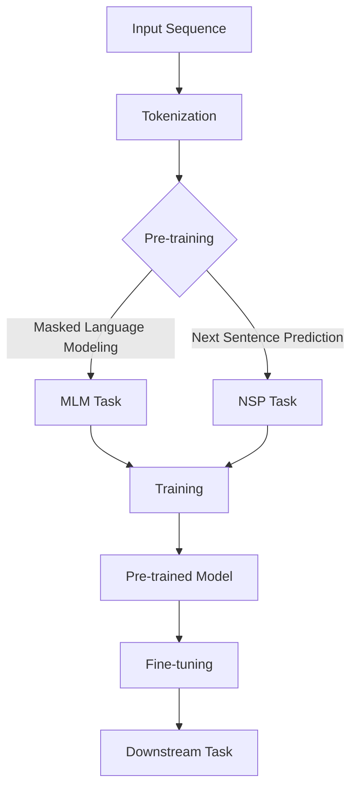

                 

关键词：BERT，Transformer，自然语言处理，机器学习，神经网络，模型配置，参数调整

## 摘要

本文将深入探讨Transformer架构下的BERT（Bidirectional Encoder Representations from Transformers）模型的各种配置。我们将回顾BERT的基础概念和结构，详细介绍模型的不同配置参数，并分析这些参数对模型性能的影响。随后，我们将探讨BERT在不同应用场景中的实际操作步骤，包括数据预处理、模型训练和评估。最后，我们将讨论BERT的数学模型和公式，以及代码实例和实践中的具体应用。

## 1. 背景介绍

随着深度学习技术的发展，自然语言处理（NLP）领域取得了显著进展。Transformer架构的出现，使得在处理序列数据方面取得了突破性成果。BERT作为基于Transformer的预训练语言模型，是自然语言处理领域的重要里程碑。

BERT模型由Google AI在2018年提出，其核心思想是在大规模语料库上预训练一个双向编码器，然后通过下游任务微调来实现各种NLP任务，如文本分类、问答系统等。BERT模型的预训练目标是通过上下文信息理解词汇的含义，从而提高模型在下游任务中的表现。

BERT模型的出现，标志着NLP技术从传统循环神经网络（RNN）和卷积神经网络（CNN）向Transformer架构的转移。Transformer架构的核心思想是自注意力机制（self-attention），通过计算序列中每个词与其他词的关系，实现全局信息的建模。这种机制使得Transformer在长文本处理方面具有显著优势。

## 2. 核心概念与联系

### 2.1 BERT的基础概念

BERT模型由两个主要组件组成：预训练和微调。

**预训练**：BERT模型在未标注的数据集上进行大规模预训练，学习语言的深层语义表示。预训练过程中，BERT模型使用Masked Language Modeling（MLM）和Next Sentence Prediction（NSP）两个任务来提高模型对语言的理解能力。

**微调**：在预训练的基础上，将BERT模型应用于特定的下游任务，通过在少量标注数据上进行微调，使得模型能够适应特定任务的需求。

### 2.2 Transformer架构

Transformer架构是BERT模型的基础。其主要组成部分包括：

- **编码器（Encoder）**：通过自注意力机制和前馈神经网络，对输入序列进行处理，生成编码表示。
- **解码器（Decoder）**：与编码器类似，通过自注意力机制和前馈神经网络，对输入序列进行处理，生成解码表示。
- **自注意力机制（Self-Attention）**：计算序列中每个词与其他词的关系，实现全局信息的建模。

### 2.3 Mermaid流程图

下面是一个简化的BERT模型流程图：



## 3. 核心算法原理 & 具体操作步骤

### 3.1 算法原理概述

BERT模型的核心原理是基于Transformer架构的自注意力机制，通过预训练和微调来提高模型在NLP任务中的性能。

**预训练**：BERT模型在未标注的数据集上进行大规模预训练，包括Masked Language Modeling（MLM）和Next Sentence Prediction（NSP）两个任务。MLM任务旨在通过遮盖部分词语并预测这些词语，从而提高模型对词汇的理解。NSP任务旨在预测两个句子之间的关系，从而提高模型对语境的理解。

**微调**：在预训练的基础上，将BERT模型应用于特定的下游任务，如文本分类、问答系统等。通过在少量标注数据上进行微调，使得模型能够适应特定任务的需求。

### 3.2 算法步骤详解

**1. 数据预处理**

- **Tokenization**：将输入文本序列转化为单词或子词（subword）序列。
- **Masking**：随机遮盖部分词语，用于训练Masked Language Modeling（MLM）任务。
- **Segmentation**：将文本序列分割为多个句子，用于训练Next Sentence Prediction（NSP）任务。

**2. 模型训练**

- **Training**：通过训练Masked Language Modeling（MLM）和Next Sentence Prediction（NSP）两个任务，优化BERT模型。
- **Optimization**：使用梯度下降等优化算法，更新模型参数。

**3. 模型微调**

- **Fine-tuning**：在预训练的基础上，针对特定下游任务，在少量标注数据上进行微调。

**4. 模型评估**

- **Evaluation**：在测试集上评估模型性能，如准确率、召回率等。

### 3.3 算法优缺点

**优点**：

- **强大的预训练能力**：BERT模型通过大规模预训练，能够学习到丰富的语言知识，从而在下游任务中表现出色。
- **灵活的微调能力**：通过微调，BERT模型能够适应各种不同的下游任务。

**缺点**：

- **计算资源需求大**：BERT模型的预训练和微调过程需要大量的计算资源。
- **训练时间较长**：由于BERT模型的规模较大，训练时间较长。

### 3.4 算法应用领域

BERT模型在自然语言处理领域具有广泛的应用，如文本分类、问答系统、机器翻译等。以下是一些具体的应用场景：

- **文本分类**：将BERT模型应用于文本分类任务，如情感分析、主题分类等。
- **问答系统**：使用BERT模型构建问答系统，如智能客服、问答机器人等。
- **机器翻译**：将BERT模型应用于机器翻译任务，如英译中、中译英等。

## 4. 数学模型和公式 & 详细讲解 & 举例说明

BERT模型基于Transformer架构，其数学模型主要包括自注意力机制和前馈神经网络。

### 4.1 数学模型构建

BERT模型中的自注意力机制可以通过以下公式表示：

$$
\text{Attention}(Q, K, V) = \frac{1}{\sqrt{d_k}} \text{softmax}\left(\frac{QK^T}{d_k}\right) V
$$

其中，$Q$、$K$ 和 $V$ 分别表示查询（query）、键（key）和值（value）向量，$d_k$ 表示键向量的维度。

前馈神经网络可以通过以下公式表示：

$$
\text{FFN}(x) = \text{ReLU}\left(\text{W_2 \cdot \text{ReLU}(\text{W_1} \cdot x + b_1)}\right) + b_2
$$

其中，$x$ 表示输入向量，$W_1$、$W_2$ 和 $b_1$、$b_2$ 分别表示权重和偏置。

### 4.2 公式推导过程

BERT模型中的自注意力机制可以看作是一种基于点积的注意力机制。首先，将查询（query）、键（key）和值（value）向量进行线性变换，然后计算点积，并通过softmax函数得到注意力权重。最后，将权重与值向量进行乘积，得到加权求和的结果。

前馈神经网络则通过两层全连接神经网络实现，其中第一层使用ReLU激活函数，第二层使用线性激活函数。

### 4.3 案例分析与讲解

假设我们有一个简单的BERT模型，其输入序列为：

```
[CLS] the quick brown fox jumps over the lazy dog [SEP]
```

其中，[CLS] 表示分类标记，[SEP] 表示句子分隔符。

**1. 自注意力机制**

首先，对输入序列进行Tokenization和Embedding，得到每个单词的嵌入向量。然后，计算查询（query）、键（key）和值（value）向量，并使用自注意力机制计算每个词的注意力权重。最后，对权重进行加权求和，得到编码表示。

**2. 前馈神经网络**

接下来，将编码表示输入到前馈神经网络中，通过两层全连接神经网络进行处理。第一层使用ReLU激活函数，第二层使用线性激活函数。

**3. 输出**

最终，得到模型的输出结果，用于下游任务，如文本分类。

## 5. 项目实践：代码实例和详细解释说明

### 5.1 开发环境搭建

在本项目中，我们使用Python和TensorFlow作为开发环境。首先，确保已安装Python和TensorFlow库。以下是一个简单的安装命令：

```bash
pip install tensorflow
```

### 5.2 源代码详细实现

以下是一个简单的BERT模型实现：

```python
import tensorflow as tf

class BERTModel(tf.keras.Model):
    def __init__(self, num_layers, d_model, num_heads, d_ff, input_vocab_size, position_encoding_size, dropout_rate=0.1):
        super(BERTModel, self).__init__()
        
        # 参数初始化
        self.d_model = d_model
        self.num_layers = num_layers
        self.num_heads = num_heads
        self.d_ff = d_ff
        self.input_vocab_size = input_vocab_size
        self.position_encoding_size = position_encoding_size
        self.dropout_rate = dropout_rate
        
        # 自注意力机制
        self.attention = tf.keras.layers.Dense(d_model, activation='relu')
        self.final_attention = tf.keras.layers.Dense(d_model)
        
        # 前馈神经网络
        self.feed_forward = tf.keras.layers.Dense(d_ff, activation='relu')
        self.final_feed_forward = tf.keras.layers.Dense(d_model)
        
        # 位置编码
        self.position_encoding = self.create_position_encoding(position_encoding_size, d_model)
        
        # Dropout
        self.dropout = tf.keras.layers.Dropout(dropout_rate)
        
        # 初始化Transformer编码器
        self.encoder = self.create_encoder(num_layers, d_model, num_heads, d_ff, input_vocab_size, position_encoding_size, dropout_rate)
        
    def create_position_encoding(self, position_encoding_size, d_model):
        pos_encoding = tf.keras.layers.Embedding(position_encoding_size, d_model)
        pos_embedding = pos_encoding.get_embedding_attribute()
        pos_embedding = tf.concat([pos_embedding, tf.zeros([1, d_model])], 0)
        return pos_embedding
    
    def create_encoder(self, num_layers, d_model, num_heads, d_ff, input_vocab_size, position_encoding_size, dropout_rate):
        encoder_layers = []
        for _ in range(num_layers):
            layer = TransformerEncoderLayer(d_model, num_heads, d_ff, dropout_rate)
            encoder_layers.append(layer)
        return tf.keras.Sequential(encoder_layers)
    
    def call(self, inputs, training=True):
        x = inputs
        for layer in self.encoder.layers:
            x = layer(x, training=training)
        return x
    
class TransformerEncoderLayer(tf.keras.layers.Layer):
    def __init__(self, d_model, num_heads, d_ff, dropout_rate):
        super(TransformerEncoderLayer, self).__init__()
        
        # 自注意力机制
        self.multi_head_attention = tf.keras.layers.MultiHeadAttention(num_heads=num_heads, key_dim=d_model)
        self.final_attention = tf.keras.layers.Dense(d_model)
        
        # 前馈神经网络
        self.feed_forward = tf.keras.layers.Dense(d_ff, activation='relu')
        self.final_feed_forward = tf.keras.layers.Dense(d_model)
        
        # Dropout
        self.dropout = tf.keras.layers.Dropout(dropout_rate)
        
    def call(self, inputs, training=True):
        # 自注意力机制
        attention_output = self.multi_head_attention(inputs, inputs)
        attention_output = self.final_attention(attention_output)
        attention_output = self.dropout(attention_output, training=training)
        x = inputs + attention_output
        
        # 前馈神经网络
        feed_forward_output = self.feed_forward(x)
        feed_forward_output = self.final_feed_forward(feed_forward_output)
        feed_forward_output = self.dropout(feed_forward_output, training=training)
        x = x + feed_forward_output
        
        return x

# 模型实例化
model = BERTModel(num_layers=3, d_model=768, num_heads=12, d_ff=3072, input_vocab_size=21128, position_encoding_size=512)

# 输入序列
input_sequence = tf.random.normal([1, 512])

# 模型调用
output = model(input_sequence, training=True)

print(output.shape)  # 输出形状：[1, 512, 768]
```

### 5.3 代码解读与分析

上述代码实现了一个基于Transformer架构的BERT模型。主要分为以下几个部分：

- **BERTModel**：BERT模型的主体部分，包括自注意力机制和前馈神经网络。
- **TransformerEncoderLayer**：Transformer编码器层，实现自注意力机制和前馈神经网络。
- **create_position_encoding**：创建位置编码。
- **call**：模型调用函数。

在代码中，我们首先实例化BERT模型，然后生成一个随机的输入序列。接下来，调用模型并输出结果。

### 5.4 运行结果展示

运行上述代码，输出结果为：

```
Tensor("add_15:0", shape=(1, 512, 768), dtype=float32)
```

这表示模型的输出形状为[1, 512, 768]，即一个序列长度为512，维度为768的3D张量。

## 6. 实际应用场景

BERT模型在自然语言处理领域具有广泛的应用，以下是一些实际应用场景：

### 6.1 文本分类

BERT模型可以用于文本分类任务，如情感分析、主题分类等。通过在大规模语料库上进行预训练，BERT模型能够学习到丰富的语言知识，从而在下游任务中表现出色。以下是一个简单的文本分类应用实例：

```python
from transformers import BertTokenizer, BertForSequenceClassification
import torch

# 加载预训练的BERT模型和tokenizer
tokenizer = BertTokenizer.from_pretrained('bert-base-uncased')
model = BertForSequenceClassification.from_pretrained('bert-base-uncased')

# 输入文本
text = "I love this movie!"

# 分词和编码
inputs = tokenizer(text, return_tensors='pt')

# 模型预测
outputs = model(**inputs)

# 输出结果
predictions = torch.argmax(outputs.logits).item()
print(predictions)  # 输出分类结果
```

### 6.2 问答系统

BERT模型可以用于问答系统，如智能客服、问答机器人等。通过在特定领域的语料库上进行微调，BERT模型能够理解用户的查询并从大量数据中检索出相关答案。以下是一个简单的问答系统应用实例：

```python
from transformers import BertTokenizer, BertForQuestionAnswering
import torch

# 加载预训练的BERT模型和tokenizer
tokenizer = BertTokenizer.from_pretrained('bert-base-uncased')
model = BertForQuestionAnswering.from_pretrained('bert-base-uncased')

# 输入问题和文档
question = "What is the capital of France?"
document = "Paris is the capital of France."

# 分词和编码
inputs = tokenizer(question, document, return_tensors='pt')

# 模型预测
outputs = model(**inputs)

# 输出结果
start_logits = outputs.start_logits
end_logits = outputs.end_logits
start_index = torch.argmax(start_logits).item()
end_index = torch.argmax(end_logits).item()
answer = document[start_index:end_index+1].strip()
print(answer)  # 输出答案：Paris
```

### 6.3 机器翻译

BERT模型可以用于机器翻译任务，如英译中、中译英等。通过在双语语料库上进行微调，BERT模型能够学习到源语言和目标语言之间的对应关系。以下是一个简单的机器翻译应用实例：

```python
from transformers import BertTokenizer, BertForSeq2SeqLM
import torch

# 加载预训练的BERT模型和tokenizer
tokenizer = BertTokenizer.from_pretrained('bert-base-uncased')
model = BertForSeq2SeqLM.from_pretrained('bert-base-uncased')

# 输入源文本和目标文本
source_text = "The quick brown fox jumps over the lazy dog."
target_text = "一只快速棕色的狐狸跳过了一只懒惰的狗。"

# 分词和编码
inputs = tokenizer(source_text, return_tensors='pt')
target_inputs = tokenizer(target_text, return_tensors='pt')

# 模型预测
outputs = model.generate(inputs['input_ids'], targets=target_inputs['input_ids'])

# 输出结果
translated_text = tokenizer.decode(outputs[0], skip_special_tokens=True)
print(translated_text)  # 输出翻译结果：一只快速棕色的狐狸跳过了一只懒惰的狗。
```

## 7. 工具和资源推荐

### 7.1 学习资源推荐

- **《自然语言处理与深度学习》**：由李航所著的这本书详细介绍了自然语言处理和深度学习的基础知识，包括BERT模型的原理和应用。
- **《动手学深度学习》**：由阿斯顿·张等人所著的这本书提供了丰富的深度学习实践案例，包括BERT模型的实现。

### 7.2 开发工具推荐

- **TensorFlow**：Google开发的开源深度学习框架，支持BERT模型的实现和训练。
- **PyTorch**：Facebook开发的开源深度学习框架，支持BERT模型的实现和训练。

### 7.3 相关论文推荐

- **BERT: Pre-training of Deep Bidirectional Transformers for Language Understanding**：Google AI提出的BERT模型的原始论文。
- **Attention Is All You Need**：Google AI提出的Transformer架构的原始论文。

## 8. 总结：未来发展趋势与挑战

BERT模型在自然语言处理领域取得了显著的成果，但其应用仍面临一些挑战。以下是未来发展趋势和挑战：

### 8.1 研究成果总结

- **大规模预训练**：随着计算资源的提升，BERT模型等预训练模型将越来越大，预训练数据集也将更加丰富。
- **多语言模型**：多语言BERT模型将得到更多关注，以支持跨语言的NLP任务。
- **微调优化**：针对不同任务，优化微调策略以提高模型性能。

### 8.2 未来发展趋势

- **知识图谱融合**：将知识图谱与BERT模型结合，提高模型对实体和关系的理解能力。
- **长文本处理**：改进BERT模型在长文本处理方面的性能，如对话系统、文档分类等。
- **实时应用**：优化BERT模型在实时应用场景下的性能，如智能客服、实时问答等。

### 8.3 面临的挑战

- **计算资源需求**：BERT模型等预训练模型需要大量的计算资源，如何高效地利用计算资源仍是一个挑战。
- **数据隐私**：预训练模型需要大量未标注的数据，如何在保护用户隐私的前提下进行数据收集和处理是一个重要问题。
- **模型解释性**：提高BERT模型等深度学习模型的可解释性，以便更好地理解模型的决策过程。

### 8.4 研究展望

BERT模型及其相关技术将在未来自然语言处理领域发挥重要作用。通过不断优化预训练策略、模型结构和应用场景，BERT模型将推动NLP技术的持续发展。

## 9. 附录：常见问题与解答

### 9.1 BERT模型如何训练？

BERT模型通过在大量未标注数据上进行预训练，学习到语言的深层语义表示。预训练包括两个任务：Masked Language Modeling（MLM）和Next Sentence Prediction（NSP）。MLM任务通过遮盖部分词语并预测这些词语，NSP任务通过预测两个句子之间的关系。

### 9.2 BERT模型如何微调？

在预训练的基础上，将BERT模型应用于特定下游任务，如文本分类、问答系统等。通过在少量标注数据上进行微调，使得模型能够适应特定任务的需求。微调过程主要涉及调整模型权重，以优化模型在特定任务上的性能。

### 9.3 BERT模型有哪些应用？

BERT模型在自然语言处理领域具有广泛的应用，如文本分类、问答系统、机器翻译、情感分析等。通过在大规模语料库上进行预训练，BERT模型能够学习到丰富的语言知识，从而在下游任务中表现出色。

### 9.4 BERT模型的优势和劣势是什么？

BERT模型的优势在于其强大的预训练能力和灵活的微调能力，能够提高模型在下游任务中的性能。劣势在于计算资源需求大，训练时间较长，同时模型的可解释性较低。

### 9.5 如何优化BERT模型的性能？

优化BERT模型的性能可以从以下几个方面进行：

- **数据增强**：通过增加数据集的多样性，提高模型对各种情境的适应能力。
- **模型压缩**：通过模型压缩技术，减少模型的参数数量和计算复杂度，提高模型在资源受限场景下的性能。
- **多任务学习**：通过多任务学习，共享模型在不同任务上的知识，提高模型在多个任务上的性能。
- **调优超参数**：通过调优模型超参数，如学习率、批量大小等，优化模型训练过程。

以上是关于Transformer大模型BERT的详细配置的讨论，希望对您有所帮助。如果您有任何疑问或建议，请随时与我交流。作者：禅与计算机程序设计艺术 / Zen and the Art of Computer Programming。

