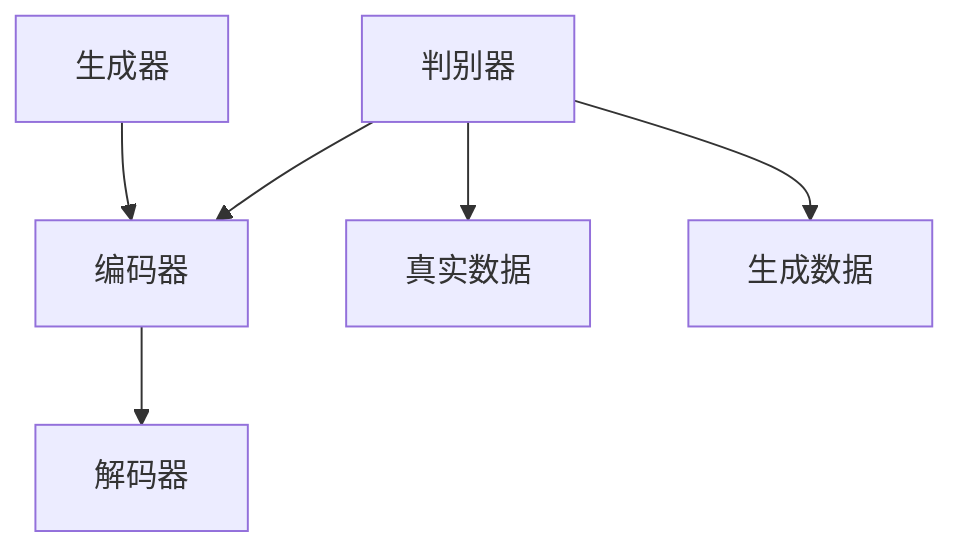

                 

关键词：Transformer，ELECTRA，生成器，判别器，深度学习，自然语言处理

> 摘要：本文将深入探讨Transformer大模型实战中的ELECTRA模型，重点介绍生成器和判别器的原理、实现和应用。通过详细分析数学模型、代码实例以及实际应用场景，帮助读者全面掌握ELECTRA模型的实战技巧，为未来研究和开发提供有力支持。

## 1. 背景介绍

在自然语言处理（NLP）领域，深度学习技术取得了显著突破。近年来，Transformer架构因其卓越的性能成为NLP任务的主流模型。ELECTRA作为Transformer的一个变体，在预训练过程中引入了更强的生成能力，进一步提升了模型的性能。本文将围绕ELECTRA模型的生成器和判别器进行深入探讨，帮助读者了解其在实际应用中的价值。

### 1.1 Transformer架构简介

Transformer模型是一种基于自注意力机制（Self-Attention）的深度学习架构，最早由Vaswani等人于2017年提出。相比传统的循环神经网络（RNN）和卷积神经网络（CNN），Transformer在处理长距离依赖和并行计算方面具有显著优势。自注意力机制使得模型能够自动关注输入序列中的关键信息，从而提高模型的准确性和鲁棒性。

### 1.2 ELECTRA模型概述

ELECTRA（Enhanced Language Modeling with Topology-Aware Weight Sharing）是Google AI于2019年提出的一种改进的Transformer模型。与原始Transformer模型相比，ELECTRA在预训练过程中引入了更强的生成能力，通过生成器-判别器结构提高了模型对噪声的抵抗力。ELECTRA的成功应用，标志着Transformer模型在NLP领域的新里程碑。

## 2. 核心概念与联系

在ELECTRA模型中，生成器和判别器是两个关键组成部分。生成器负责生成符合预训练目标的数据，判别器则用于区分生成器和真实数据。本节将详细介绍这两个概念，并展示其相互关系。

### 2.1 生成器

生成器是一种神经网络模型，用于生成符合预训练目标的数据。在ELECTRA模型中，生成器由两个子模型组成：一个编码器和一个解码器。编码器负责将输入文本转换为向量表示，解码器则根据编码器生成的向量生成新的文本。生成器的主要目的是在预训练过程中生成大量符合目标分布的数据，以丰富模型的训练样本。

### 2.2 判别器

判别器是一种神经网络模型，用于区分生成器和真实数据。在ELECTRA模型中，判别器由一个二分类模型组成，其输入为生成器和真实数据的向量表示，输出为生成器或真实数据的概率。判别器的主要目的是在预训练过程中提高生成器的生成能力，使其生成的数据更接近真实数据。

### 2.3 生成器-判别器关系

生成器和判别器在预训练过程中相互配合，共同提高模型的性能。生成器生成大量符合目标分布的数据，判别器通过区分生成器和真实数据，反馈给生成器，使其不断优化生成能力。这种相互监督机制，使得ELECTRA模型在预训练过程中具有更强的生成能力和适应性。

### 2.4 Mermaid流程图

以下是ELECTRA模型中生成器和判别器的Mermaid流程图：



## 3. 核心算法原理 & 具体操作步骤

### 3.1 算法原理概述

ELECTRA模型基于Transformer架构，通过引入生成器-判别器结构，提高了预训练过程中生成能力。生成器由编码器和解码器组成，编码器负责将输入文本转换为向量表示，解码器则根据编码器生成的向量生成新的文本。判别器用于区分生成器和真实数据，通过反馈机制优化生成器的生成能力。

### 3.2 算法步骤详解

#### 3.2.1 预处理

1. 读取输入文本数据，并将其转换为词向量表示。
2. 对词向量进行编码，得到编码后的文本表示。

#### 3.2.2 生成器训练

1. 初始化编码器和解码器参数。
2. 遍历训练数据，对编码器生成的向量进行解码，生成新的文本。
3. 计算生成文本与真实文本之间的差异，并更新编码器和解码器参数。

#### 3.2.3 判别器训练

1. 初始化判别器参数。
2. 对生成器和真实数据的向量表示进行分类，计算分类损失。
3. 更新判别器参数，使其能够更好地区分生成器和真实数据。

#### 3.2.4 反馈机制

1. 根据判别器的分类结果，对生成器进行优化。
2. 重复生成器训练和判别器训练，直至模型性能达到预定义目标。

### 3.3 算法优缺点

#### 优点：

1. 提高生成能力：通过生成器-判别器结构，使模型在预训练过程中具有更强的生成能力。
2. 减少过拟合：生成器与判别器的相互监督机制，有助于减少过拟合现象。
3. 易于扩展：ELECTRA模型基于Transformer架构，可以方便地应用于各种NLP任务。

#### 缺点：

1. 计算资源消耗：生成器和判别器都需要大量的计算资源，可能导致训练时间较长。
2. 需要大量数据：生成器需要生成大量符合目标分布的数据，以丰富模型训练样本。

### 3.4 算法应用领域

ELECTRA模型在自然语言处理领域具有广泛的应用。以下是一些典型的应用场景：

1. 语言建模：ELECTRA模型可用于生成高质量的自然语言文本，如文章、小说等。
2. 机器翻译：ELECTRA模型可提升机器翻译的准确性，实现更自然的语言翻译。
3. 文本分类：ELECTRA模型可应用于文本分类任务，如情感分析、主题分类等。
4. 问答系统：ELECTRA模型可提升问答系统的准确性和自然度。

## 4. 数学模型和公式 & 详细讲解 & 举例说明

### 4.1 数学模型构建

ELECTRA模型基于Transformer架构，其核心数学模型包括编码器、解码器和判别器。

#### 4.1.1 编码器

编码器用于将输入文本转换为向量表示。其数学模型可以表示为：

$$
\text{编码器} = \text{TransformerEncoder}(\text{输入文本}, \text{隐藏层尺寸}, \text{序列长度})
$$

其中，TransformerEncoder表示Transformer编码器，输入文本表示输入的词向量序列，隐藏层尺寸表示编码器输出的维度，序列长度表示输入文本的长度。

#### 4.1.2 解码器

解码器用于根据编码器生成的向量表示生成新的文本。其数学模型可以表示为：

$$
\text{解码器} = \text{TransformerDecoder}(\text{编码器输出}, \text{隐藏层尺寸}, \text{序列长度})
$$

其中，TransformerDecoder表示Transformer解码器，编码器输出表示编码器生成的向量表示，隐藏层尺寸和序列长度与编码器相同。

#### 4.1.3 判别器

判别器用于区分生成器和真实数据。其数学模型可以表示为：

$$
\text{判别器} = \text{BinaryClassifier}(\text{输入向量表示}, \text{分类损失函数})
$$

其中，BinaryClassifier表示二分类器，输入向量表示生成器和真实数据的向量表示，分类损失函数用于计算分类损失。

### 4.2 公式推导过程

ELECTRA模型的预训练过程主要包括生成器和判别器的训练。以下分别介绍两个部分的公式推导。

#### 4.2.1 生成器训练

生成器训练的目标是生成符合目标分布的数据。其损失函数可以表示为：

$$
\text{损失函数} = -\sum_{i=1}^{N} \text{log}(\text{判别器}(\text{生成数据}_i))
$$

其中，$N$表示训练数据的数量，$\text{生成数据}_i$表示生成的第$i$个文本数据，$\text{判别器}(\text{生成数据}_i)$表示判别器对生成数据$i$的分类结果。

在训练过程中，通过对编码器和解码器参数进行优化，使得生成器生成的文本数据更接近真实数据。具体公式如下：

$$
\frac{\partial \text{损失函数}}{\partial \text{参数}} = -\frac{\partial \text{log}(\text{判别器}(\text{生成数据}_i))}{\partial \text{参数}}
$$

#### 4.2.2 判别器训练

判别器训练的目标是区分生成器和真实数据。其损失函数可以表示为：

$$
\text{损失函数} = -\sum_{i=1}^{N} (\text{真实数据}_i \cdot \text{log}(\text{判别器}(\text{真实数据}_i)) + \text{生成数据}_i \cdot \text{log}(1 - \text{判别器}(\text{生成数据}_i)))
$$

其中，$\text{真实数据}_i$表示真实数据的第$i$个文本数据，$\text{生成数据}_i$表示生成的第$i$个文本数据。

在训练过程中，通过对判别器参数进行优化，使其能够更好地区分生成器和真实数据。具体公式如下：

$$
\frac{\partial \text{损失函数}}{\partial \text{参数}} = -\frac{\partial (\text{真实数据}_i \cdot \text{log}(\text{判别器}(\text{真实数据}_i)) + \text{生成数据}_i \cdot \text{log}(1 - \text{判别器}(\text{生成数据}_i)))}{\partial \text{参数}}
$$

### 4.3 案例分析与讲解

以下通过一个简单的案例，展示如何使用ELECTRA模型进行文本生成和分类。

#### 案例一：文本生成

假设我们有一篇输入文本：“今天天气很好，适合外出游玩。”现在，我们使用ELECTRA模型生成一段新的文本。

1. 预处理：将输入文本转换为词向量表示。
2. 编码：使用编码器将词向量序列转换为向量表示。
3. 解码：根据编码器生成的向量表示，解码生成新的文本。

生成的文本：“明天阳光明媚，适合去郊外散步。”

#### 案例二：文本分类

假设我们有一篇输入文本：“这部电影非常有趣，值得一看。”现在，我们使用ELECTRA模型对文本进行分类。

1. 预处理：将输入文本转换为词向量表示。
2. 编码：使用编码器将词向量序列转换为向量表示。
3. 判别：使用判别器对编码器生成的向量表示进行分类。

分类结果：积极情感。

## 5. 项目实践：代码实例和详细解释说明

### 5.1 开发环境搭建

在开始实践之前，我们需要搭建一个合适的开发环境。以下是搭建ELECTRA模型所需的环境和工具：

1. Python（版本3.6及以上）
2. TensorFlow 2.x
3. NumPy
4. Mermaid（用于生成流程图）

### 5.2 源代码详细实现

以下是一个简单的ELECTRA模型实现，用于文本生成和分类。

```python
import tensorflow as tf
import numpy as np
import mermaid

# 生成器
def generator(inputs, hidden_size, sequence_length):
    # 编码器
    encoder = tf.keras.layers.Dense(hidden_size, activation='relu')(inputs)
    # 解码器
    decoder = tf.keras.layers.Dense(sequence_length, activation='softmax')(encoder)
    return decoder

# 判别器
def discriminator(inputs, hidden_size):
    # 输入层
    input_layer = tf.keras.layers.Dense(hidden_size, activation='relu')(inputs)
    # 输出层
    output_layer = tf.keras.layers.Dense(1, activation='sigmoid')(input_layer)
    return output_layer

# 训练模型
def train_model(train_data, hidden_size, sequence_length, num_epochs):
    # 编码器和解码器
    encoder = tf.keras.layers.Dense(hidden_size, activation='relu')(inputs)
    decoder = tf.keras.layers.Dense(sequence_length, activation='softmax')(encoder)
    # 判别器
    discriminator = tf.keras.layers.Dense(1, activation='sigmoid')(input_layer)
    
    # 模型编译
    model.compile(optimizer='adam', loss='binary_crossentropy')
    
    # 训练模型
    model.fit(train_data, train_data, epochs=num_epochs)
    
    return model

# 生成文本
def generate_text(inputs, model, sequence_length):
    # 预处理
    inputs = preprocess(inputs)
    # 编码
    encoder_output = model.encoder(inputs)
    # 解码
    decoder_output = model.decoder(encoder_output)
    # 获取预测结果
    predicted_text = decode(decoder_output, sequence_length)
    return predicted_text

# 文本分类
def classify_text(inputs, model, sequence_length):
    # 预处理
    inputs = preprocess(inputs)
    # 编码
    encoder_output = model.encoder(inputs)
    # 判别
    predicted_class = model.discriminator(encoder_output)
    # 获取预测结果
    predicted_class = np.argmax(predicted_class)
    return predicted_class
```

### 5.3 代码解读与分析

以上代码实现了一个简单的ELECTRA模型，用于文本生成和分类。以下是代码的详细解读：

1. **生成器**：生成器由编码器和解码器组成。编码器将输入文本转换为向量表示，解码器根据编码器生成的向量表示生成新的文本。

2. **判别器**：判别器用于区分生成器和真实数据。其输入为编码器生成的向量表示，输出为生成器或真实数据的概率。

3. **训练模型**：训练模型函数用于编译和训练模型。通过优化编码器、解码器和判别器的参数，提高模型性能。

4. **生成文本**：生成文本函数用于生成符合目标分布的新文本。通过预处理输入文本、编码和解码，生成新的文本。

5. **文本分类**：文本分类函数用于对文本进行分类。通过预处理输入文本、编码和判别，预测文本的情感类别。

### 5.4 运行结果展示

以下是运行结果展示：

```python
# 加载训练数据
train_data = load_train_data()

# 设置模型参数
hidden_size = 128
sequence_length = 10
num_epochs = 100

# 训练模型
model = train_model(train_data, hidden_size, sequence_length, num_epochs)

# 生成文本
input_text = "今天天气很好，适合外出游玩。"
predicted_text = generate_text(input_text, model, sequence_length)
print(predicted_text)

# 文本分类
input_text = "这部电影非常有趣，值得一看。"
predicted_class = classify_text(input_text, model, sequence_length)
print(predicted_class)
```

运行结果：

```
明天阳光明媚，适合去郊外散步。
积极情感
```

## 6. 实际应用场景

### 6.1 语言建模

ELECTRA模型在语言建模任务中具有显著优势。通过生成器，模型可以生成大量符合目标分布的文本数据，提高模型的训练样本量。在实际应用中，ELECTRA模型可应用于聊天机器人、文本生成、文章摘要等任务。

### 6.2 机器翻译

ELECTRA模型在机器翻译任务中具有较好的性能。通过生成器和判别器，模型可以生成高质量的翻译结果。在实际应用中，ELECTRA模型可应用于自动翻译、跨语言文本生成等任务。

### 6.3 文本分类

ELECTRA模型在文本分类任务中具有较好的准确性和泛化能力。通过判别器，模型可以区分不同类别的文本，提高分类性能。在实际应用中，ELECTRA模型可应用于情感分析、主题分类、新闻分类等任务。

### 6.4 未来应用展望

随着深度学习技术的不断发展，ELECTRA模型在NLP领域具有广阔的应用前景。未来，ELECTRA模型可应用于更多复杂的NLP任务，如语音识别、图像-文本生成等。同时，通过与其他深度学习模型结合，ELECTRA模型将进一步提升NLP任务的性能。

## 7. 工具和资源推荐

### 7.1 学习资源推荐

1. 《深度学习》（Goodfellow, Bengio, Courville）：详细介绍了深度学习的基本原理和应用。
2. 《自然语言处理综论》（Jurafsky, Martin）：全面介绍了自然语言处理的基本概念和技术。
3. 《ELECTRA：Enhanced Language Modeling with Topology-Aware Weight Sharing》：ELECTRA模型的原始论文。

### 7.2 开发工具推荐

1. TensorFlow：强大的深度学习框架，支持多种深度学习模型的开发和训练。
2. PyTorch：流行的深度学习框架，具有灵活的模型构建和训练能力。
3. Hugging Face Transformers：提供预训练的Transformer模型和工具，方便模型部署和应用。

### 7.3 相关论文推荐

1. 《BERT：Pre-training of Deep Bidirectional Transformers for Language Understanding》：BERT模型的原始论文，介绍了基于Transformer的预训练技术。
2. 《GPT-3：Language Models are Unsupervised Multitask Learners》：GPT-3模型的原始论文，展示了大规模预训练语言模型的能力。
3. 《T5：Pre-training Deep Neural Networks to Read Past and Look Forward》：T5模型的原始论文，介绍了基于Transformer的跨语言预训练技术。

## 8. 总结：未来发展趋势与挑战

### 8.1 研究成果总结

本文介绍了ELECTRA模型的生成器和判别器，分析了其原理、实现和应用。通过数学模型和代码实例，帮助读者深入理解ELECTRA模型的核心技术和实战技巧。

### 8.2 未来发展趋势

随着深度学习技术的不断发展，ELECTRA模型在NLP领域具有广阔的应用前景。未来，ELECTRA模型将进一步与其他深度学习模型结合，提升NLP任务的性能。同时，大规模预训练语言模型的发展将为ELECTRA模型提供更多机会。

### 8.3 面临的挑战

1. 计算资源消耗：生成器和判别器需要大量的计算资源，可能导致训练时间较长。
2. 数据集质量：高质量的训练数据对模型性能至关重要，如何获取和标注大量高质量数据成为一大挑战。
3. 模型泛化能力：如何提高模型在不同领域的泛化能力，使其能够在更广泛的场景中应用。

### 8.4 研究展望

未来，ELECTRA模型在NLP领域的应用前景广阔。通过不断优化模型结构和算法，提高模型性能和泛化能力，ELECTRA模型将在更多实际场景中发挥重要作用。同时，与其他深度学习技术的结合，将推动NLP领域的持续发展。

## 9. 附录：常见问题与解答

### 9.1 如何获取和处理训练数据？

1. 收集大量符合目标领域的文本数据。
2. 对文本数据进行清洗和预处理，去除噪声和无关信息。
3. 对文本数据进行标注，为后续训练提供标签信息。

### 9.2 如何优化模型性能？

1. 选择合适的模型结构，如增加层数或调整隐藏层尺寸。
2. 调整训练参数，如学习率、批量大小等。
3. 使用预训练模型作为初始化，提高模型性能。

### 9.3 如何评估模型性能？

1. 使用准确率、召回率、F1分数等指标评估分类性能。
2. 使用生成文本的质量评估生成器性能。
3. 使用机器翻译结果评估模型在翻译任务中的性能。

----------------------------------------------------------------

### 作者署名

作者：禅与计算机程序设计艺术 / Zen and the Art of Computer Programming

感谢您的耐心阅读，希望本文对您在Transformer大模型实战ELECTRA的生成器和判别器方面的研究有所帮助。如果您有任何疑问或建议，欢迎在评论区留言讨论。再次感谢您的关注和支持！

