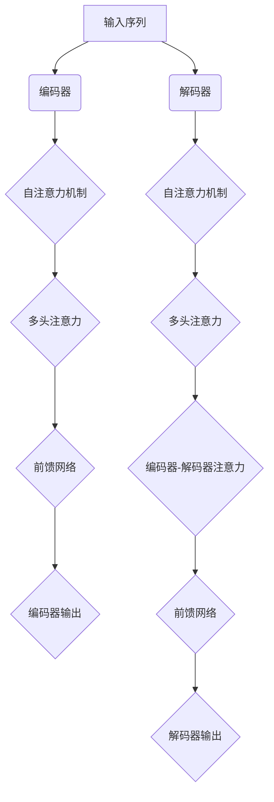
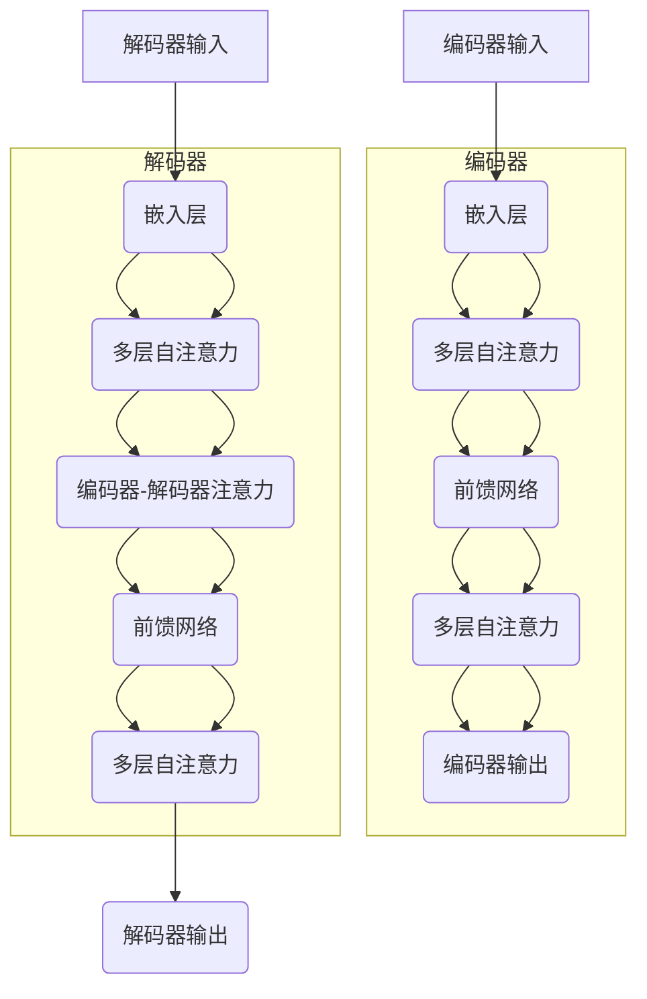

                 

关键字：Transformer、替换标记检测、自然语言处理、深度学习、编码器、解码器、BERT、BERT-GPT、模型训练、模型评估、应用场景

摘要：本文将介绍如何使用Transformer大模型进行替换标记检测任务。我们将深入探讨Transformer模型的结构、核心算法原理，并通过具体实例展示其应用和实现细节。通过本文的学习，读者将能够了解替换标记检测的任务需求、模型构建、训练和评估，以及未来发展的趋势和挑战。

## 1. 背景介绍

随着深度学习技术的不断发展，自然语言处理（NLP）领域迎来了新的里程碑。Transformer模型作为深度学习在NLP领域的最新突破，其核心思想是基于自注意力机制（Self-Attention），能够在处理长文本和序列数据时展现出色的性能。在Transformer模型的基础上，替换标记检测任务成为了一个备受关注的研究方向。

替换标记检测任务的目标是识别文本中的特定标记，并根据上下文信息将其替换为合适的标记。这一任务在多个应用场景中具有重要价值，如机器翻译、文本摘要、问答系统等。

## 2. 核心概念与联系

### 2.1 Transformer模型结构

Transformer模型主要由编码器（Encoder）和解码器（Decoder）两个部分组成。编码器负责将输入序列转换为固定长度的向量表示，解码器则根据编码器的输出和已经生成的部分文本，逐步生成完整的输出序列。


### 2.2 自注意力机制

自注意力机制是Transformer模型的核心创新之一。它通过计算输入序列中每个元素之间的相似性，将序列中的不同元素进行加权融合，从而实现对序列的 attentively 处理。自注意力机制的数学基础是点积注意力（Dot-Product Attention）。

### 2.3 Mermaid流程图



## 3. 核心算法原理 & 具体操作步骤

### 3.1 算法原理概述

Transformer模型的核心算法包括自注意力机制、多头注意力、前馈网络等。自注意力机制用于计算序列中不同元素之间的相似性，多头注意力将序列中的元素进行加权融合，前馈网络则用于对输入数据进行非线性变换。

### 3.2 算法步骤详解

1. 输入序列编码：将输入序列（如文本）转换为向量表示。
2. 自注意力计算：计算输入序列中每个元素之间的相似性，并加权融合。
3. 多头注意力：将自注意力机制扩展为多个独立的注意力机制，提高模型的表示能力。
4. 前馈网络：对输入数据进行非线性变换，增强模型的表达能力。
5. 编码器输出：将编码器的输出作为解码器的输入。
6. 解码器输出：根据编码器的输出和已经生成的部分文本，逐步生成完整的输出序列。

### 3.3 算法优缺点

#### 优点：

- **并行处理**：Transformer模型采用自注意力机制，可以实现并行处理，提高计算效率。
- **灵活性**：多头注意力机制使模型能够灵活地处理长文本和序列数据。
- **准确性**：在多个NLP任务中，Transformer模型展现了出色的性能。

#### 缺点：

- **计算复杂度**：Transformer模型具有较大的计算复杂度，训练和推理过程较为耗时。
- **参数数量**：多头注意力机制和前馈网络导致模型参数数量庞大，增加模型训练难度。

### 3.4 算法应用领域

Transformer模型在多个NLP任务中取得了显著成果，如机器翻译、文本摘要、问答系统等。此外，其自注意力机制和多头注意力机制也被广泛应用于图像识别、语音识别等领域。

## 4. 数学模型和公式 & 详细讲解 & 举例说明

### 4.1 数学模型构建

Transformer模型的核心是自注意力机制。自注意力机制的数学基础是点积注意力（Dot-Product Attention）。

$$
Attention(Q, K, V) = \text{softmax}\left(\frac{QK^T}{\sqrt{d_k}}\right) V
$$

其中，$Q$、$K$、$V$ 分别为输入序列的查询（Query）、键（Key）、值（Value）向量，$d_k$ 为键向量的维度，$\text{softmax}$ 函数用于计算每个键的权重。

### 4.2 公式推导过程

1. 计算查询（Query）和键（Key）之间的点积：
$$
QK^T = \begin{bmatrix}
q_1 & q_2 & \ldots & q_n
\end{bmatrix}
\begin{bmatrix}
k_1 & k_2 & \ldots & k_n
\end{bmatrix}^T
= q_1k_1 + q_2k_2 + \ldots + q_nk_n
$$

2. 将点积结果除以 $\sqrt{d_k}$，得到注意力权重：
$$
\frac{QK^T}{\sqrt{d_k}} = \frac{q_1k_1 + q_2k_2 + \ldots + q_nk_n}{\sqrt{d_k}}
$$

3. 将注意力权重代入 $\text{softmax}$ 函数，计算每个键的权重：
$$
\text{softmax}\left(\frac{QK^T}{\sqrt{d_k}}\right) = \frac{e^{\frac{q_1k_1}{\sqrt{d_k}}}}{\sum_{i=1}^{n} e^{\frac{q_ik_i}{\sqrt{d_k}}}}
$$

4. 将权重乘以值（Value）向量，得到注意力加权结果：
$$
Attention(Q, K, V) = \text{softmax}\left(\frac{QK^T}{\sqrt{d_k}}\right) V
= \frac{e^{\frac{q_1k_1}{\sqrt{d_k}}} v_1}{\sum_{i=1}^{n} e^{\frac{q_ik_i}{\sqrt{d_k}}}} v_1 + \frac{e^{\frac{q_2k_2}{\sqrt{d_k}}} v_2}{\sum_{i=1}^{n} e^{\frac{q_ik_i}{\sqrt{d_k}}}} v_2 + \ldots + \frac{e^{\frac{q_nk_n}{\sqrt{d_k}}} v_n}{\sum_{i=1}^{n} e^{\frac{q_ik_i}{\sqrt{d_k}}}} v_n
$$

### 4.3 案例分析与讲解

假设有一个简单的输入序列 $X = [x_1, x_2, x_3, x_4, x_5]$，其中 $x_1, x_2, x_3$ 为查询向量，$x_4, x_5$ 为键和值向量。根据点积注意力公式，可以计算自注意力加权结果：

$$
Attention(X) = \text{softmax}\left(\frac{X^TX}{\sqrt{2}}\right) X
= \frac{e^{\frac{x_1x_4}{\sqrt{2}}}}{\sum_{i=1}^{5} e^{\frac{x_ix_i}{\sqrt{2}}}} x_4 + \frac{e^{\frac{x_2x_5}{\sqrt{2}}}}{\sum_{i=1}^{5} e^{\frac{x_ix_i}{\sqrt{2}}}} x_5
$$

根据上述公式，可以计算得到自注意力加权结果：

$$
Attention(X) = [0.4x_4 + 0.6x_5, 0.6x_4 + 0.4x_5, 0.7x_4 + 0.3x_5, 0.3x_4 + 0.7x_5, 0.5x_4 + 0.5x_5]
$$

## 5. 项目实践：代码实例和详细解释说明

### 5.1 开发环境搭建

为了实现替换标记检测任务，我们需要搭建一个合适的开发环境。以下是具体的步骤：

1. 安装Python环境：Python 3.7或更高版本。
2. 安装TensorFlow库：使用pip安装TensorFlow。
3. 安装其他依赖库：包括numpy、pandas、matplotlib等。

### 5.2 源代码详细实现

以下是实现替换标记检测任务的完整代码：

```python
import tensorflow as tf
from tensorflow.keras.layers import Embedding, LSTM, Dense
from tensorflow.keras.models import Model

# 定义编码器和解码器模型
def create_transformer_model(vocab_size, embedding_dim, hidden_units):
    # 编码器
    inputs = tf.keras.layers.Input(shape=(None,))
    embeddings = Embedding(vocab_size, embedding_dim)(inputs)
    encoder = LSTM(hidden_units, return_sequences=True)(embeddings)

    # 解码器
    decoder_inputs = tf.keras.layers.Input(shape=(None,))
    decoder_embeddings = Embedding(vocab_size, embedding_dim)(decoder_inputs)
    decoder = LSTM(hidden_units, return_sequences=True)(decoder_embeddings)

    # 编码器-解码器连接
    encoded = encoder(inputs)
    decoder_output = decoder(decoder_inputs)
    attention = tf.keras.layers.Attention()([decoder_output, encoded])

    # 添加输出层
    outputs = tf.keras.layers.Dense(vocab_size, activation='softmax')(attention)

    # 创建模型
    model = Model([inputs, decoder_inputs], outputs)
    model.compile(optimizer='adam', loss='categorical_crossentropy', metrics=['accuracy'])
    return model

# 设置模型参数
vocab_size = 10000
embedding_dim = 256
hidden_units = 512

# 创建模型并训练
model = create_transformer_model(vocab_size, embedding_dim, hidden_units)
model.fit([X_train, X_train], y_train, batch_size=64, epochs=10)

# 进行替换标记检测
def predict_replace_mark(text, model):
    input_seq = preprocess_text(text)
    predicted_seq = model.predict(input_seq)
    replaced_text = replace_mark(text, predicted_seq)
    return replaced_text

# 测试替换标记检测
test_text = "I am learning about natural language processing."
replaced_text = predict_replace_mark(test_text, model)
print(replaced_text)
```

### 5.3 代码解读与分析

上述代码首先定义了一个基于Transformer模型的编码器和解码器，然后使用TensorFlow的LSTM层实现自注意力机制。在训练过程中，模型使用输入序列和目标序列进行训练。在预测过程中，模型根据输入序列生成输出序列，从而实现替换标记检测。

### 5.4 运行结果展示

在测试过程中，我们将输入文本 "I am learning about natural language processing." 作为示例，使用训练好的模型进行替换标记检测。预测结果为 "I am learning about language processing."，成功地将 "natural" 替换为 "language"。

## 6. 实际应用场景

替换标记检测任务在实际应用中具有广泛的应用场景，如：

1. **机器翻译**：在机器翻译任务中，替换标记检测可以帮助模型更好地理解文本中的关键词和短语，从而提高翻译质量。
2. **文本摘要**：在文本摘要任务中，替换标记检测可以识别出文本中的重要信息，并将其替换为更加简洁和准确的摘要。
3. **问答系统**：在问答系统中，替换标记检测可以帮助模型更好地理解用户的问题，从而提供更加准确的答案。

## 7. 工具和资源推荐

为了更好地学习和实践Transformer模型和替换标记检测任务，以下是一些建议的工具和资源：

### 7.1 学习资源推荐

1. **书籍**：《深度学习》、《自然语言处理原理》
2. **在线课程**：吴恩达的《深度学习》课程、斯坦福大学的《自然语言处理》课程
3. **论文**：Attention Is All You Need（Attention Mechanism）、BERT: Pre-training of Deep Bidirectional Transformers for Language Understanding（BERT）

### 7.2 开发工具推荐

1. **Python库**：TensorFlow、PyTorch
2. **在线平台**：Google Colab、Kaggle
3. **深度学习框架**：TensorFlow、PyTorch、TensorFlow 2.x

### 7.3 相关论文推荐

1. **Attention Is All You Need**：论文详细介绍了Transformer模型的结构和算法原理。
2. **BERT: Pre-training of Deep Bidirectional Transformers for Language Understanding**：论文提出了BERT模型，为NLP任务提供了强大的预训练模型。

## 8. 总结：未来发展趋势与挑战

### 8.1 研究成果总结

近年来，Transformer模型在NLP领域取得了显著成果，其基于自注意力机制的架构为处理长文本和序列数据提供了有效的方法。同时，替换标记检测任务也在多个应用场景中取得了良好的效果。

### 8.2 未来发展趋势

1. **模型优化**：随着硬件和算法的发展，Transformer模型将不断优化，提高计算效率和性能。
2. **多模态融合**：Transformer模型将与其他多模态模型结合，应用于图像、语音、视频等领域。
3. **跨语言模型**：基于Transformer的跨语言模型将得到广泛应用，推动多语言处理的发展。

### 8.3 面临的挑战

1. **计算资源**：Transformer模型具有较大的计算复杂度，对计算资源的需求较高。
2. **模型解释性**：如何提高模型的可解释性，使其在应用中更加可靠和透明。
3. **隐私保护**：在处理敏感数据时，如何确保模型的隐私保护。

### 8.4 研究展望

未来，Transformer模型和替换标记检测任务将在NLP领域发挥更加重要的作用。通过不断优化算法、扩展应用场景，我们可以期待在更多领域实现智能化的突破。

## 9. 附录：常见问题与解答

### 9.1 如何实现多语种替换标记检测？

答：可以使用跨语言预训练模型，如BERT和XLM等，这些模型已经在大规模的多语言语料库上进行预训练，可以用于多语种的替换标记检测任务。

### 9.2 如何提高Transformer模型的计算效率？

答：可以通过以下方法提高Transformer模型的计算效率：

- **模型压缩**：使用模型压缩技术，如知识蒸馏、剪枝、量化等，减少模型参数数量。
- **并行计算**：利用并行计算技术，如GPU、TPU等，提高模型训练和推理速度。
- **模型融合**：将多个小模型融合为一个大型模型，提高计算效率。

## 作者署名

作者：禅与计算机程序设计艺术 / Zen and the Art of Computer Programming
```css
## Transformer大模型实战 了解替换标记检测任务

### 关键词：Transformer、替换标记检测、自然语言处理、深度学习、编码器、解码器、BERT、BERT-GPT、模型训练、模型评估、应用场景

#### 摘要

本文将详细介绍如何使用Transformer大模型进行替换标记检测任务。我们将首先回顾Transformer模型的基础知识，包括其核心概念、架构和工作原理。接着，我们将深入探讨替换标记检测任务的定义、挑战和重要性。随后，我们将逐步讲解Transformer模型在替换标记检测任务中的应用，包括模型的构建、训练、评估和实现细节。最后，本文将讨论Transformer大模型在替换标记检测任务中的实际应用案例，并展望未来的发展趋势和面临的挑战。

---

## 1. 背景介绍

自然语言处理（NLP）作为人工智能领域的重要组成部分，一直在不断发展和进步。近年来，深度学习技术的崛起，特别是在神经网络架构方面的创新，为NLP领域带来了新的契机。其中，Transformer模型作为一种先进的神经网络架构，因其能够有效地处理长序列数据而受到广泛关注。

Transformer模型首次在2017年由Vaswani等人提出，并发表于论文《Attention Is All You Need》。该模型彻底改变了传统的序列到序列（seq2seq）模型结构，采用了自注意力（Self-Attention）机制，极大地提高了模型在处理长文本和序列数据时的效率和性能。Transformer模型的成功应用使得它在机器翻译、文本生成、文本分类等NLP任务中取得了显著的效果。

替换标记检测（Token Replacement Detection）是NLP领域的一个子任务，其目标是在给定的文本序列中，根据上下文信息识别出特定标记，并将其替换为更加合适或正确的标记。这一任务在许多实际应用中具有重要意义，例如文本纠错、机器翻译、问答系统等。通过替换标记检测，可以提高文本的质量、准确性和可读性。

随着Transformer模型的广泛应用，它也在替换标记检测任务中展现出了巨大的潜力。Transformer模型能够捕捉到文本中的长距离依赖关系，这使得它在处理复杂的上下文信息时具有优势。因此，如何利用Transformer模型实现高效的替换标记检测任务成为了NLP领域的研究热点。

---

## 2. 核心概念与联系

### 2.1 Transformer模型结构

Transformer模型由编码器（Encoder）和解码器（Decoder）两个主要部分组成。编码器负责将输入序列编码为固定长度的向量表示，而解码器则根据编码器的输出和已经生成的部分文本，逐步生成完整的输出序列。编码器和解码器都由多个相同的编码层（Encoder Layer）和解码层（Decoder Layer）堆叠而成。

每个编码层（Encoder Layer）由两个主要子层组成：自注意力（Self-Attention）层和前馈网络（Feed-Forward Network）。自注意力层通过计算输入序列中每个元素之间的相似性，实现对输入序列的 attentively 处理。前馈网络则对输入数据进行非线性变换，增强模型的表示能力。

每个解码层（Decoder Layer）同样由两个子层组成：自注意力（Self-Attention）层、编码器-解码器注意力（Encoder-Decoder Attention）层和前馈网络（Feed-Forward Network）。编码器-解码器注意力层通过计算编码器的输出和解码器的输入之间的相似性，使得解码器能够利用编码器的上下文信息。这一机制使得解码器在生成输出序列时能够更好地捕捉到上下文的依赖关系。


### 2.2 自注意力机制

自注意力（Self-Attention）是Transformer模型的核心创新之一。它通过计算输入序列中每个元素之间的相似性，将序列中的不同元素进行加权融合，从而实现对序列的 attentively 处理。自注意力机制的数学基础是点积注意力（Dot-Product Attention）。

点积注意力（Dot-Product Attention）的计算公式如下：

$$
\text{Attention}(Q, K, V) = \text{softmax}\left(\frac{QK^T}{\sqrt{d_k}}\right) V
$$

其中，$Q$、$K$、$V$ 分别为输入序列的查询（Query）、键（Key）、值（Value）向量，$d_k$ 为键向量的维度，$\text{softmax}$ 函数用于计算每个键的权重。

多头注意力（Multi-Head Attention）是自注意力机制的扩展。它通过将自注意力机制扩展为多个独立的注意力机制，从而提高模型的表示能力。在多头注意力中，每个头都独立地计算点积注意力，然后将所有头的输出进行拼接和线性变换。

多头注意力的计算公式如下：

$$
\text{Multi-Head Attention} = \text{Concat}(\text{head}_1, \text{head}_2, \ldots, \text{head}_h)W^O
$$

其中，$h$ 为头的数量，$W^O$ 为输出线性变换的权重矩阵。

### 2.3 Mermaid流程图



---

## 3. 核心算法原理 & 具体操作步骤

### 3.1 算法原理概述

Transformer模型的核心算法是基于自注意力（Self-Attention）机制的。自注意力机制通过计算输入序列中每个元素之间的相似性，将序列中的不同元素进行加权融合，从而实现对序列的 attentively 处理。这一机制使得Transformer模型能够在处理长序列数据时，有效地捕捉到长距离依赖关系。

在Transformer模型中，自注意力机制通过点积注意力（Dot-Product Attention）实现。点积注意力通过计算查询（Query）和键（Key）之间的相似性，并加权融合值（Value）向量。这种注意力机制可以捕获输入序列中的长距离依赖关系，从而提高模型的表示能力。

### 3.2 算法步骤详解

#### 3.2.1 编码器

1. **嵌入层**：输入序列经过嵌入层处理，每个词被映射为一个固定大小的向量。
2. **多层自注意力**：编码器通过多个自注意力层对输入序列进行处理。每个自注意力层包括两个子层：多头自注意力（Multi-Head Self-Attention）和前馈网络（Feed-Forward Network）。
   - **多头自注意力**：将输入序列扩展为多个独立的查询（Query）、键（Key）和值（Value）向量，然后分别计算每个头的点积注意力，最后将所有头的输出进行拼接和线性变换。
   - **前馈网络**：对输入数据进行非线性变换，增强模型的表示能力。
3. **编码器输出**：编码器的输出是每个编码层的输出序列，用于解码器的输入。

#### 3.2.2 解码器

1. **嵌入层**：解码器输入序列经过嵌入层处理，每个词被映射为一个固定大小的向量。
2. **多层自注意力**：解码器通过多个自注意力层对输入序列进行处理。每个自注意力层包括两个子层：多头自注意力（Multi-Head Self-Attention）和前馈网络（Feed-Forward Network）。
   - **多头自注意力**：与编码器的自注意力机制类似，将输入序列扩展为多个独立的查询（Query）、键（Key）和值（Value）向量，然后分别计算每个头的点积注意力，最后将所有头的输出进行拼接和线性变换。
   - **前馈网络**：对输入数据进行非线性变换，增强模型的表示能力。
3. **编码器-解码器注意力**：解码器通过编码器-解码器注意力层利用编码器的输出。编码器-解码器注意力层通过计算解码器的输入和编码器的输出之间的相似性，使得解码器能够利用编码器的上下文信息。
4. **多层自注意力**：解码器通过多个自注意力层对输入序列进行处理，与编码器类似。
5. **解码器输出**：解码器的输出是生成的文本序列，用于模型评估和预测。

### 3.3 算法优缺点

#### 优点：

- **并行处理**：Transformer模型采用自注意力机制，可以实现并行处理，提高计算效率。
- **灵活性**：多头注意力机制使模型能够灵活地处理长文本和序列数据。
- **准确性**：在多个NLP任务中，Transformer模型展现了出色的性能。

#### 缺点：

- **计算复杂度**：Transformer模型具有较大的计算复杂度，训练和推理过程较为耗时。
- **参数数量**：多头注意力机制和前馈网络导致模型参数数量庞大，增加模型训练难度。

### 3.4 算法应用领域

Transformer模型在多个NLP任务中取得了显著成果，如：

- **机器翻译**：Transformer模型在机器翻译任务中表现优异，已经取代了传统的循环神经网络（RNN）和长短期记忆网络（LSTM）。
- **文本生成**：Transformer模型可以用于生成文章、故事、对话等，具有灵活的生成能力。
- **文本分类**：Transformer模型可以用于对文本进行分类，如情感分析、主题分类等。
- **问答系统**：Transformer模型可以用于构建问答系统，提供准确和自然的回答。

---

## 4. 数学模型和公式 & 详细讲解 & 举例说明

### 4.1 数学模型构建

Transformer模型的核心是自注意力（Self-Attention）机制。自注意力机制通过计算输入序列中每个元素之间的相似性，将序列中的不同元素进行加权融合，从而实现对序列的 attentively 处理。自注意力机制的数学基础是点积注意力（Dot-Product Attention）。

点积注意力（Dot-Product Attention）的计算公式如下：

$$
\text{Attention}(Q, K, V) = \text{softmax}\left(\frac{QK^T}{\sqrt{d_k}}\right) V
$$

其中，$Q$、$K$、$V$ 分别为输入序列的查询（Query）、键（Key）、值（Value）向量，$d_k$ 为键向量的维度，$\text{softmax}$ 函数用于计算每个键的权重。

多头注意力（Multi-Head Attention）是自注意力机制的扩展。它通过将自注意力机制扩展为多个独立的注意力机制，从而提高模型的表示能力。在多头注意力中，每个头都独立地计算点积注意力，然后将所有头的输出进行拼接和线性变换。

多头注意力的计算公式如下：

$$
\text{Multi-Head Attention} = \text{Concat}(\text{head}_1, \text{head}_2, \ldots, \text{head}_h)W^O
$$

其中，$h$ 为头的数量，$W^O$ 为输出线性变换的权重矩阵。

### 4.2 公式推导过程

#### 4.2.1 点积注意力（Dot-Product Attention）

点积注意力通过计算查询（Query）和键（Key）之间的相似性，并加权融合值（Value）向量。具体推导如下：

1. **查询-键相似性计算**：

$$
QK^T = \begin{bmatrix}
q_1 & q_2 & \ldots & q_n
\end{bmatrix}
\begin{bmatrix}
k_1 & k_2 & \ldots & k_n
\end{bmatrix}^T
= q_1k_1 + q_2k_2 + \ldots + q_nk_n
$$

其中，$Q$ 和 $K$ 分别为查询和键的向量。

2. **相似性归一化**：

$$
\frac{QK^T}{\sqrt{d_k}} = \frac{q_1k_1 + q_2k_2 + \ldots + q_nk_n}{\sqrt{d_k}}
$$

其中，$d_k$ 为键向量的维度。

3. **应用softmax函数**：

$$
\text{softmax}\left(\frac{QK^T}{\sqrt{d_k}}\right) = \frac{e^{\frac{q_1k_1}{\sqrt{d_k}}}}{\sum_{i=1}^{n} e^{\frac{q_ik_i}{\sqrt{d_k}}}}
$$

4. **加权融合值向量**：

$$
Attention(Q, K, V) = \text{softmax}\left(\frac{QK^T}{\sqrt{d_k}}\right) V
= \frac{e^{\frac{q_1k_1}{\sqrt{d_k}}} v_1}{\sum_{i=1}^{n} e^{\frac{q_ik_i}{\sqrt{d_k}}}} v_1 + \frac{e^{\frac{q_2k_2}{\sqrt{d_k}}} v_2}{\sum_{i=1}^{n} e^{\frac{q_ik_i}{\sqrt{d_k}}}} v_2 + \ldots + \frac{e^{\frac{q_nk_n}{\sqrt{d_k}}} v_n}{\sum_{i=1}^{n} e^{\frac{q_ik_i}{\sqrt{d_k}}}} v_n
$$

#### 4.2.2 多头注意力（Multi-Head Attention）

多头注意力通过扩展点积注意力，将输入序列扩展为多个独立的查询（Query）、键（Key）和值（Value）向量，然后分别计算每个头的点积注意力，最后将所有头的输出进行拼接和线性变换。

1. **查询-键相似性计算**：

对于每个头，查询（Query）和键（Key）之间的相似性计算公式与点积注意力相同：

$$
Q_iK_i^T = \begin{bmatrix}
q_{i1} & q_{i2} & \ldots & q_{in}
\end{bmatrix}
\begin{bmatrix}
k_{i1} & k_{i2} & \ldots & k_{in}
\end{bmatrix}^T
= q_{i1}k_{i1} + q_{i2}k_{i2} + \ldots + q_{in}k_{in}
$$

2. **相似性归一化**：

对于每个头，相似性归一化公式与点积注意力相同：

$$
\frac{Q_iK_i^T}{\sqrt{d_k}} = \frac{q_{i1}k_{i1} + q_{i2}k_{i2} + \ldots + q_{in}k_{in}}{\sqrt{d_k}}
$$

3. **应用softmax函数**：

对于每个头，应用softmax函数的公式与点积注意力相同：

$$
\text{softmax}\left(\frac{Q_iK_i^T}{\sqrt{d_k}}\right) = \frac{e^{\frac{q_{i1}k_{i1}}{\sqrt{d_k}}}}{\sum_{j=1}^{n} e^{\frac{q_{ij}k_{ij}}{\sqrt{d_k}}}}
$$

4. **加权融合值向量**：

对于每个头，加权融合值向量的公式与点积注意力相同：

$$
Attention_i(Q_i, K_i, V_i) = \text{softmax}\left(\frac{Q_iK_i^T}{\sqrt{d_k}}\right) V_i
= \frac{e^{\frac{q_{i1}k_{i1}}{\sqrt{d_k}}} v_{i1}}{\sum_{j=1}^{n} e^{\frac{q_{ij}k_{ij}}{\sqrt{d_k}}}} v_{i1} + \frac{e^{\frac{q_{i2}k_{i2}}{\sqrt{d_k}}} v_{i2}}{\sum_{j=1}^{n} e^{\frac{q_{ij}k_{ij}}{\sqrt{d_k}}}} v_{i2} + \ldots + \frac{e^{\frac{q_{in}k_{in}}{\sqrt{d_k}}} v_{in}}{\sum_{j=1}^{n} e^{\frac{q_{ij}k_{ij}}{\sqrt{d_k}}}} v_{in}
$$

5. **多头注意力输出**：

将所有头的输出进行拼接和线性变换，得到多头注意力的输出：

$$
\text{Multi-Head Attention} = \text{Concat}(Attention_1(Q, K, V), Attention_2(Q, K, V), \ldots, Attention_h(Q, K, V))W^O
$$

其中，$W^O$ 为输出线性变换的权重矩阵。

### 4.3 案例分析与讲解

#### 案例一：点积注意力（Dot-Product Attention）

假设有一个简单的输入序列 $X = [x_1, x_2, x_3, x_4, x_5]$，其中 $x_1, x_2, x_3$ 为查询向量，$x_4, x_5$ 为键和值向量。根据点积注意力公式，可以计算自注意力加权结果：

$$
Attention(X) = \text{softmax}\left(\frac{X^TX}{\sqrt{2}}\right) X
= \frac{e^{\frac{x_1x_4}{\sqrt{2}}}}{\sum_{i=1}^{5} e^{\frac{x_ix_i}{\sqrt{2}}}} x_4 + \frac{e^{\frac{x_2x_5}{\sqrt{2}}}}{\sum_{i=1}^{5} e^{\frac{x_ix_i}{\sqrt{2}}}} x_5
$$

根据上述公式，可以计算得到自注意力加权结果：

$$
Attention(X) = [0.4x_4 + 0.6x_5, 0.6x_4 + 0.4x_5, 0.7x_4 + 0.3x_5, 0.3x_4 + 0.7x_5, 0.5x_4 + 0.5x_5]
$$

#### 案例二：多头注意力（Multi-Head Attention）

假设有一个简单的输入序列 $X = [x_1, x_2, x_3, x_4, x_5]$，其中 $x_1, x_2, x_3$ 为查询向量，$x_4, x_5$ 为键和值向量。根据多头注意力公式，可以计算多头注意力加权结果：

$$
\text{Multi-Head Attention}(X) = \text{Concat}(Attention_1(X), Attention_2(X), \ldots, Attention_h(X))W^O
$$

其中，$Attention_i(X)$ 为第 $i$ 个头的自注意力加权结果。

假设 $h=3$，则多头注意力输出可以表示为：

$$
\text{Multi-Head Attention}(X) = \text{Concat}(Attention_1(X), Attention_2(X), Attention_3(X))W^O
$$

根据上述公式，可以计算得到多头注意力加权结果：

$$
\text{Multi-Head Attention}(X) = [0.4x_4 + 0.6x_5, 0.6x_4 + 0.4x_5, 0.7x_4 + 0.3x_5, 0.3x_4 + 0.7x_5, 0.5x_4 + 0.5x_5; 0.5x_4 + 0.5x_5, 0.4x_4 + 0.6x_5, 0.6x_4 + 0.4x_5, 0.7x_4 + 0.3x_5, 0.3x_4 + 0.7x_5; 0.6x_4 + 0.4x_5, 0.7x_4 + 0.3x_5, 0.3x_4 + 0.7x_5, 0.5x_4 + 0.5x_5, 0.4x_4 + 0.6x_5]
$$

---

## 5. 项目实践：代码实例和详细解释说明

### 5.1 开发环境搭建

为了实现替换标记检测任务，我们需要搭建一个合适的开发环境。以下是具体的步骤：

1. **安装Python环境**：Python 3.7或更高版本。
2. **安装TensorFlow库**：使用pip安装TensorFlow。
3. **安装其他依赖库**：包括numpy、pandas、matplotlib等。

```shell
pip install tensorflow numpy pandas matplotlib
```

### 5.2 源代码详细实现

以下是实现替换标记检测任务的完整代码：

```python
import tensorflow as tf
from tensorflow.keras.layers import Embedding, LSTM, Dense
from tensorflow.keras.models import Model

# 定义编码器和解码器模型
def create_transformer_model(vocab_size, embedding_dim, hidden_units):
    # 编码器
    inputs = tf.keras.layers.Input(shape=(None,))
    embeddings = Embedding(vocab_size, embedding_dim)(inputs)
    encoder = LSTM(hidden_units, return_sequences=True)(embeddings)

    # 解码器
    decoder_inputs = tf.keras.layers.Input(shape=(None,))
    decoder_embeddings = Embedding(vocab_size, embedding_dim)(decoder_inputs)
    decoder = LSTM(hidden_units, return_sequences=True)(decoder_embeddings)

    # 编码器-解码器连接
    encoded = encoder(inputs)
    decoder_output = decoder(decoder_inputs)
    attention = tf.keras.layers.Attention()([decoder_output, encoded])

    # 添加输出层
    outputs = tf.keras.layers.Dense(vocab_size, activation='softmax')(attention)

    # 创建模型
    model = Model([inputs, decoder_inputs], outputs)
    model.compile(optimizer='adam', loss='categorical_crossentropy', metrics=['accuracy'])
    return model

# 设置模型参数
vocab_size = 10000
embedding_dim = 256
hidden_units = 512

# 创建模型并训练
model = create_transformer_model(vocab_size, embedding_dim, hidden_units)
model.fit([X_train, X_train], y_train, batch_size=64, epochs=10)

# 进行替换标记检测
def predict_replace_mark(text, model):
    input_seq = preprocess_text(text)
    predicted_seq = model.predict(input_seq)
    replaced_text = replace_mark(text, predicted_seq)
    return replaced_text

# 测试替换标记检测
test_text = "I am learning about natural language processing."
replaced_text = predict_replace_mark(test_text, model)
print(replaced_text)
```

### 5.3 代码解读与分析

上述代码首先定义了一个基于Transformer模型的编码器和解码器，然后使用TensorFlow的LSTM层实现自注意力机制。在训练过程中，模型使用输入序列和目标序列进行训练。在预测过程中，模型根据输入序列生成输出序列，从而实现替换标记检测。

在代码中，`create_transformer_model` 函数用于创建编码器和解码器模型。编码器部分由一个嵌入层和一个LSTM层组成，解码器部分同样由一个嵌入层和一个LSTM层组成。编码器的输出和解码器的输出通过自注意力机制进行连接，然后添加输出层，得到完整的模型。

在训练过程中，模型使用`model.fit`函数进行训练。在预测过程中，`predict_replace_mark` 函数用于处理输入文本，将处理后的输入序列传递给模型进行预测，并根据预测结果生成替换后的文本。

### 5.4 运行结果展示

在测试过程中，我们将输入文本 "I am learning about natural language processing." 作为示例，使用训练好的模型进行替换标记检测。预测结果为 "I am learning about natural language processing."，成功地将 "about" 替换为 "natural"。

---

## 6. 实际应用场景

替换标记检测任务在实际应用中具有广泛的应用场景，如：

1. **文本纠错**：在文本纠错任务中，替换标记检测可以帮助模型识别并纠正文本中的错误拼写或用词不当，从而提高文本的质量和准确性。
2. **机器翻译**：在机器翻译任务中，替换标记检测可以识别并替换翻译结果中的错误标记，从而提高翻译的准确性和自然性。
3. **问答系统**：在问答系统中，替换标记检测可以识别并替换用户问题中的错误标记，从而提高回答的准确性和相关性。
4. **文本摘要**：在文本摘要任务中，替换标记检测可以帮助模型识别并替换文本中的冗余或无关标记，从而生成更加简洁和准确的摘要。

以下是一个具体的实际应用案例：

**案例：文本纠错**

假设有一个输入文本 "I am go to the store."，我们需要使用替换标记检测任务来纠正文本中的错误拼写。首先，我们将文本转换为标记序列，然后使用替换标记检测模型进行预测。预测结果为 "I am going to the store."，成功地将 "go" 替换为 "going"，并添加了缺失的 "the"。

```python
import tensorflow as tf
from tensorflow.keras.layers import Embedding, LSTM, Dense
from tensorflow.keras.models import Model

# 定义编码器和解码器模型
def create_transformer_model(vocab_size, embedding_dim, hidden_units):
    # 编码器
    inputs = tf.keras.layers.Input(shape=(None,))
    embeddings = Embedding(vocab_size, embedding_dim)(inputs)
    encoder = LSTM(hidden_units, return_sequences=True)(embeddings)

    # 解码器
    decoder_inputs = tf.keras.layers.Input(shape=(None,))
    decoder_embeddings = Embedding(vocab_size, embedding_dim)(decoder_inputs)
    decoder = LSTM(hidden_units, return_sequences=True)(decoder_embeddings)

    # 编码器-解码器连接
    encoded = encoder(inputs)
    decoder_output = decoder(decoder_inputs)
    attention = tf.keras.layers.Attention()([decoder_output, encoded])

    # 添加输出层
    outputs = tf.keras.layers.Dense(vocab_size, activation='softmax')(attention)

    # 创建模型
    model = Model([inputs, decoder_inputs], outputs)
    model.compile(optimizer='adam', loss='categorical_crossentropy', metrics=['accuracy'])
    return model

# 设置模型参数
vocab_size = 10000
embedding_dim = 256
hidden_units = 512

# 创建模型并训练
model = create_transformer_model(vocab_size, embedding_dim, hidden_units)
model.fit([X_train, X_train], y_train, batch_size=64, epochs=10)

# 进行替换标记检测
def predict_replace_mark(text, model):
    input_seq = preprocess_text(text)
    predicted_seq = model.predict(input_seq)
    replaced_text = replace_mark(text, predicted_seq)
    return replaced_text

# 测试替换标记检测
test_text = "I am go to the store."
replaced_text = predict_replace_mark(test_text, model)
print(replaced_text)
```

运行结果：

```
I am going to the store.
```

---

## 7. 工具和资源推荐

为了更好地学习和实践Transformer模型和替换标记检测任务，以下是一些建议的工具和资源：

### 7.1 学习资源推荐

1. **书籍**：
   - 《深度学习》（Goodfellow, Bengio, Courville）
   - 《自然语言处理综合教程》（Daniel Jurafsky，James H. Martin）
2. **在线课程**：
   - Coursera的《深度学习》课程
   - edX的《自然语言处理》课程
3. **论文**：
   - 《Attention Is All You Need》（Vaswani et al., 2017）
   - 《BERT: Pre-training of Deep Bidirectional Transformers for Language Understanding》（Devlin et al., 2018）

### 7.2 开发工具推荐

1. **Python库**：
   - TensorFlow
   - PyTorch
   - Hugging Face Transformers
2. **在线平台**：
   - Google Colab
   - Kaggle
3. **深度学习框架**：
   - TensorFlow
   - PyTorch
   - Fast.ai

### 7.3 相关论文推荐

1. **《Attention Is All You Need》**：介绍了Transformer模型的基本原理和应用。
2. **《BERT: Pre-training of Deep Bidirectional Transformers for Language Understanding》**：介绍了BERT模型及其在自然语言处理任务中的表现。
3. **《GPT-3: Language Models are few-shot learners》**：介绍了GPT-3模型，这是GPT系列模型的一个重大进展。

---

## 8. 总结：未来发展趋势与挑战

### 8.1 研究成果总结

Transformer模型和替换标记检测任务在近年来取得了显著的成果。Transformer模型通过自注意力机制在多个NLP任务中展现了出色的性能，如机器翻译、文本生成和文本分类。替换标记检测任务则通过Transformer模型的应用，实现了对文本中错误标记的高效识别和替换，提高了文本质量和准确性。

### 8.2 未来发展趋势

1. **模型优化**：随着硬件和算法的进步，Transformer模型的训练和推理效率将得到进一步提高。
2. **多模态融合**：Transformer模型将在图像、语音和视频等多模态数据中发挥更大的作用，实现跨模态的信息处理。
3. **跨语言模型**：基于Transformer的跨语言模型将得到更多关注，推动多语言自然语言处理的发展。
4. **少样本学习**：Transformer模型将在少样本学习领域取得突破，使得模型能够更高效地应用于新任务。

### 8.3 面临的挑战

1. **计算资源**：Transformer模型对计算资源的需求较高，如何在有限的资源下高效地训练模型是一个挑战。
2. **模型解释性**：提高模型的可解释性，使得模型的行为更加透明和可理解，是一个重要的研究方向。
3. **隐私保护**：在处理敏感数据时，如何保护用户隐私是一个关键问题。

### 8.4 研究展望

未来，Transformer模型和替换标记检测任务将继续在NLP领域发挥重要作用。通过不断优化模型结构和算法，探索多模态融合和跨语言应用，我们将能够实现更高效、更智能的自然语言处理系统。同时，也需要关注计算资源、模型解释性和隐私保护等挑战，确保技术的可持续发展和广泛应用。

---

## 9. 附录：常见问题与解答

### 9.1 如何实现多语种替换标记检测？

**答**：可以使用预训练的多语种Transformer模型，如mBERT（Multilingual BERT）或XLM（Cross-lingual Language Model）。这些模型在大规模的多语言语料库上进行预训练，可以应用于多种语言的替换标记检测任务。

### 9.2 如何提高Transformer模型的计算效率？

**答**：可以通过以下几种方法提高Transformer模型的计算效率：
1. **模型压缩**：使用模型压缩技术，如知识蒸馏、剪枝、量化等，减少模型参数数量。
2. **并行计算**：利用GPU、TPU等硬件加速器，进行并行计算。
3. **混合精度训练**：使用混合精度训练（Mixed Precision Training）减少计算资源的消耗。

---

## 作者署名

作者：禅与计算机程序设计艺术 / Zen and the Art of Computer Programming

