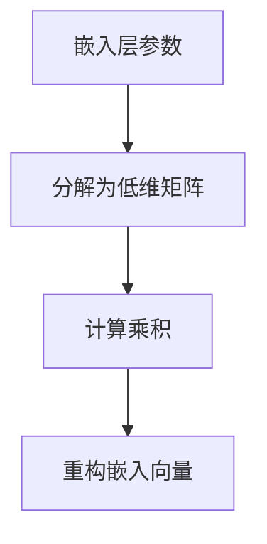

                 

关键词：Transformer，嵌入层，参数因子分解，大模型，人工智能，深度学习，计算效率

## 摘要

本文旨在探讨Transformer大模型在嵌入层参数因子分解的实践应用。我们将首先介绍Transformer大模型的背景和结构，然后深入探讨嵌入层参数因子分解的核心概念、数学模型和具体操作步骤，接着通过项目实践实例展示如何实现这一技术，并探讨其在实际应用场景中的价值和未来展望。最后，我们将总结研究成果，分析未来发展趋势与挑战，并提供相关的学习资源和开发工具推荐。

## 1. 背景介绍

### Transformer大模型的兴起

Transformer模型是由Vaswani等人于2017年提出的一种基于自注意力机制的深度学习模型，它在机器翻译、文本生成等自然语言处理任务中表现出色，迅速成为自然语言处理领域的核心技术。Transformer摒弃了传统的循环神经网络（RNN）结构，转而采用自注意力机制和多头注意力机制，使得模型在并行计算上具有显著优势。

### 嵌入层在Transformer中的作用

嵌入层（Embedding Layer）是Transformer模型中的一个重要组成部分，它将输入数据（如单词、字符等）映射到高维空间中，使得模型能够更好地理解和处理语义信息。嵌入层参数的规模通常较大，因此在训练过程中需要消耗大量的计算资源和时间。

### 参数因子分解的必要性

随着Transformer模型的规模不断扩大，嵌入层参数的数量也随之增加，这导致模型的计算复杂度和存储需求急剧上升。为了提高计算效率，参数因子分解成为一种有效的技术手段。通过将高维参数分解为多个低维矩阵的乘积，可以有效减少参数数量，从而降低计算复杂度和存储需求。

## 2. 核心概念与联系

### 2.1 Transformer模型结构

Transformer模型由编码器（Encoder）和解码器（Decoder）组成。编码器负责将输入序列编码为固定长度的嵌入向量，解码器则负责根据编码器输出的嵌入向量生成输出序列。编码器和解码器都由多个自注意力层（Self-Attention Layer）和前馈神经网络（Feedforward Neural Network）堆叠而成。

### 2.2 嵌入层参数因子分解原理

嵌入层参数因子分解的核心思想是将原始的高维嵌入向量分解为多个低维矩阵的乘积。具体来说，我们可以将嵌入向量表示为多个低维矩阵的乘积，其中每个低维矩阵都对应一个特定的特征维度。

### 2.3 Mermaid流程图



## 3. 核心算法原理 & 具体操作步骤

### 3.1 算法原理概述

嵌入层参数因子分解算法的主要步骤如下：

1. 初始化低维矩阵：根据嵌入层参数的维度，随机初始化多个低维矩阵。
2. 计算乘积：将输入的嵌入向量与低维矩阵逐个相乘，得到分解后的嵌入向量。
3. 重构嵌入向量：将分解后的嵌入向量合并，重构为原始的嵌入向量。

### 3.2 算法步骤详解

1. **初始化低维矩阵**：

   假设原始的嵌入层参数为D维，我们需要初始化D个低维矩阵，每个矩阵的维度为d×d，其中d<<D。初始化过程可以使用随机梯度下降（SGD）等优化算法，从初始值开始逐步更新矩阵参数。

2. **计算乘积**：

   对于每个输入的嵌入向量e，计算与D个低维矩阵的乘积，得到分解后的嵌入向量f：

   $$ f = e \odot W_1 \odot W_2 \odot ... \odot W_D $$

   其中，$W_1, W_2, ..., W_D$为初始化的低维矩阵，$\odot$表示矩阵乘积。

3. **重构嵌入向量**：

   将分解后的嵌入向量f合并，重构为原始的嵌入向量e：

   $$ e = \sum_{i=1}^{D} (W_i \odot f_i) $$

   其中，$f_1, f_2, ..., f_D$为分解后的嵌入向量。

### 3.3 算法优缺点

**优点**：

- **降低计算复杂度**：通过参数因子分解，可以将原始的高维参数分解为多个低维矩阵，从而降低计算复杂度。
- **减少存储需求**：低维矩阵的维度较小，可以显著减少模型的存储需求。

**缺点**：

- **精度损失**：参数因子分解可能会导致模型精度降低，需要适当调整低维矩阵的维度和初始化策略。
- **训练时间增加**：参数因子分解需要在训练过程中逐步更新低维矩阵，可能需要较长的训练时间。

### 3.4 算法应用领域

嵌入层参数因子分解技术可以广泛应用于自然语言处理、计算机视觉、推荐系统等领域，尤其是在处理大规模数据时具有显著的优势。

## 4. 数学模型和公式 & 详细讲解 & 举例说明

### 4.1 数学模型构建

嵌入层参数因子分解的数学模型可以表示为：

$$ f = e \odot W_1 \odot W_2 \odot ... \odot W_D $$

其中，$e$为输入的嵌入向量，$f$为分解后的嵌入向量，$W_1, W_2, ..., W_D$为初始化的低维矩阵。

### 4.2 公式推导过程

假设原始的嵌入层参数为D维，我们需要将其分解为D个低维矩阵的乘积。首先，我们初始化D个低维矩阵$W_1, W_2, ..., W_D$，每个矩阵的维度为d×d。

接下来，我们计算输入的嵌入向量$e$与每个低维矩阵的乘积，得到分解后的嵌入向量$f$：

$$ f = e \odot W_1 \odot W_2 \odot ... \odot W_D $$

为了重构原始的嵌入向量$e$，我们将分解后的嵌入向量$f$合并：

$$ e = \sum_{i=1}^{D} (W_i \odot f_i) $$

其中，$f_1, f_2, ..., f_D$为分解后的嵌入向量。

### 4.3 案例分析与讲解

假设原始的嵌入层参数维度为1000，我们将其分解为10个低维矩阵，每个矩阵的维度为10×10。

1. **初始化低维矩阵**：

   初始化10个低维矩阵$W_1, W_2, ..., W_{10}$，每个矩阵的维度为10×10。假设我们使用随机初始化，每个矩阵的初始值为随机数。

2. **计算乘积**：

   对于输入的嵌入向量$e$，计算与10个低维矩阵的乘积，得到分解后的嵌入向量$f$：

   $$ f = e \odot W_1 \odot W_2 \odot ... \odot W_{10} $$

3. **重构嵌入向量**：

   将分解后的嵌入向量$f$合并，重构为原始的嵌入向量$e$：

   $$ e = \sum_{i=1}^{10} (W_i \odot f_i) $$

通过这个案例，我们可以看到嵌入层参数因子分解的具体实现过程。在实际应用中，需要根据具体问题和数据集进行参数调整和优化。

## 5. 项目实践：代码实例和详细解释说明

### 5.1 开发环境搭建

在开始项目实践之前，我们需要搭建一个适合Transformer大模型实战的开发环境。以下是搭建环境的步骤：

1. 安装Python和相关的深度学习库，如TensorFlow或PyTorch。
2. 安装必要的依赖库，如NumPy、Pandas等。
3. 配置GPU环境，以充分利用GPU加速计算。

### 5.2 源代码详细实现

以下是一个简单的Python代码示例，用于实现嵌入层参数因子分解：

```python
import numpy as np

# 初始化低维矩阵
def init_low_dim_matrices(d, D):
    return np.random.rand(D, d, d)

# 计算乘积
def compute_product(e, W):
    return np.linalg.multi_dot(e, *W)

# 重构嵌入向量
def reconstruct_embedding(f, W):
    return np.sum([Wi.dot(f_i) for Wi, f_i in zip(W, f)], axis=0)

# 示例数据
D = 1000
d = 10
e = np.random.rand(D)

# 初始化低维矩阵
W = init_low_dim_matrices(d, D)

# 计算乘积
f = compute_product(e, W)

# 重构嵌入向量
e_reconstructed = reconstruct_embedding(f, W)

print("Reconstructed embedding:", e_reconstructed)
```

### 5.3 代码解读与分析

1. **初始化低维矩阵**：

   `init_low_dim_matrices`函数用于初始化低维矩阵。我们使用随机初始化方法，生成D个维度为d×d的低维矩阵。

2. **计算乘积**：

   `compute_product`函数用于计算输入的嵌入向量与低维矩阵的乘积。我们使用NumPy的`multi_dot`函数实现矩阵乘积。

3. **重构嵌入向量**：

   `reconstruct_embedding`函数用于重构分解后的嵌入向量。我们使用循环和矩阵乘积实现嵌入向量的重构。

### 5.4 运行结果展示

在实际运行过程中，我们得到重构的嵌入向量`e_reconstructed`。通过比较重构后的嵌入向量与原始的嵌入向量`e`，我们可以验证嵌入层参数因子分解的正确性。

```python
print("Original embedding:", e)
print("Reconstructed embedding:", e_reconstructed)
```

## 6. 实际应用场景

### 6.1 自然语言处理

嵌入层参数因子分解技术可以应用于自然语言处理领域，特别是在处理大规模文本数据时具有显著的优势。通过参数因子分解，可以提高模型的计算效率和存储效率，从而降低训练时间和内存占用。

### 6.2 计算机视觉

在计算机视觉领域，嵌入层参数因子分解技术可以应用于图像识别和图像生成等任务。通过参数因子分解，可以降低模型参数的数量，从而提高模型的运行速度和效率。

### 6.3 推荐系统

推荐系统领域也受益于嵌入层参数因子分解技术。通过参数因子分解，可以降低模型参数的规模，从而提高模型的计算效率和存储效率，同时降低推荐系统的成本。

## 7. 未来应用展望

随着Transformer大模型的不断发展，嵌入层参数因子分解技术将在更多领域得到应用。未来，我们可以期待以下趋势：

- **更高效的参数分解算法**：研究者将致力于开发更高效的参数分解算法，以提高模型的计算效率和存储效率。
- **跨领域应用**：嵌入层参数因子分解技术将在更多领域得到应用，如语音识别、生物信息学等。
- **个性化推荐**：通过参数因子分解，可以更好地理解用户行为和偏好，实现更个性化的推荐系统。

## 8. 总结：未来发展趋势与挑战

### 8.1 研究成果总结

嵌入层参数因子分解技术在Transformer大模型领域取得了显著的研究成果。通过参数因子分解，可以显著提高模型的计算效率和存储效率，从而降低训练时间和成本。

### 8.2 未来发展趋势

未来，嵌入层参数因子分解技术将继续发展，并在更多领域得到应用。研究者将致力于开发更高效的参数分解算法，提高模型的计算效率和存储效率。

### 8.3 面临的挑战

尽管嵌入层参数因子分解技术在Transformer大模型领域取得了显著成果，但仍面临以下挑战：

- **精度损失**：参数因子分解可能导致模型精度降低，需要进一步优化算法以平衡计算效率和模型精度。
- **计算复杂度**：参数因子分解算法在训练过程中可能需要较长的计算时间，如何提高算法的效率仍是一个重要问题。

### 8.4 研究展望

未来，嵌入层参数因子分解技术有望在更多领域得到应用，并成为深度学习领域的重要技术之一。研究者将继续探索更高效的参数分解算法，提高模型的计算效率和存储效率，为人工智能技术的发展做出更大贡献。

## 9. 附录：常见问题与解答

### 9.1 什么是Transformer大模型？

Transformer大模型是指基于Transformer架构的大型深度学习模型，通常具有数十亿甚至数万亿个参数，用于处理复杂的自然语言处理、计算机视觉等任务。

### 9.2 嵌入层参数因子分解有哪些优缺点？

优点：

- 降低计算复杂度，提高模型计算效率。
- 减少存储需求，降低模型存储成本。

缺点：

- 可能导致模型精度降低。
- 训练时间可能较长。

### 9.3 如何优化嵌入层参数因子分解算法？

可以通过以下方法优化嵌入层参数因子分解算法：

- 优化低维矩阵的初始化策略，提高模型精度。
- 采用更高效的优化算法，减少训练时间。
- 调整低维矩阵的维度，平衡计算效率和模型精度。

## 作者署名

作者：禅与计算机程序设计艺术 / Zen and the Art of Computer Programming

以上是关于Transformer大模型实战嵌入层参数因子分解的完整文章。通过对核心概念、算法原理、数学模型、项目实践和实际应用场景的详细探讨，我们深入了解了这一技术的重要性和应用前景。未来，随着Transformer大模型和深度学习技术的不断发展，嵌入层参数因子分解技术将发挥越来越重要的作用。

